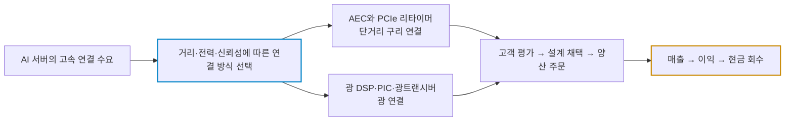
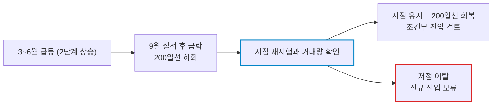

# 크레도 테크놀로지(Credo Technology Group Holding / CRDO) 실전 재무 및 가치 분석 보고서

- **작성일**: 2026-09-08
- **데이터 기준**: FY2027 1분기(2026년 8월 1일 마감, 9월 1일 장 마감 후 발표) 실적 및 yfinance 시장 데이터(2026년 9월 4일 미국 정규장 종가 기준, 조회일 2026-09-08)

대중은 AI 서버 랙 안에서 통행세를 걷는 이 회사의 매출이 한 분기 만에 114.7% 폭증했다는 헤드라인만 본다. 정작 봐야 할 것은 반토막 난 현금의 진짜 정체, 조정 이익 뒤에 숨어 있는 주식 희석, 그리고 20개월 뒤의 이익을 당겨 써야 겨우 17.7배가 되는 가격표다. 고점 대비 44.7% 빠졌다는 사실은 싸졌다는 증거가 아니라 그냥 많이 빠졌다는 뜻일 뿐이다.

## 핵심 요약

| 구분 | 핵심 요약 |
| :--- | :--- |
| **종목 및 주가** | 크레도 테크놀로지 (NASDAQ: `CRDO`) / **$170.57** (52주 범위 $86.49 ~ $308.67) |
| **최종 투자의견** | **관망 (Wait & Watch)** / 저점 재시험과 200일선 회복을 확인하기 전까지 신규 진입 보류 (투자 가치 점수 **72.3점**, 6.1절) |
| **비즈니스 본질** | AEC·광 DSP·광트랜시버·실리콘 포토닉스·PCIe 리타이머로 AI 데이터 이동 병목에서 통행세를 걷는 연결 전문 팹리스 |
| **핵심 매력 (Bull)** | FY27 Q1 매출 YoY +114.7%, 비GAAP 영업이익률 48.2%, 연간 광학 매출 6억 달러 초과 전망, 순현금 약 7억 3,805만 달러 |
| **핵심 리스크 (Bear)** | 현금 한 분기 -47.1%, 주식보상·무형자산 상각에 따른 GAAP 훼손, 하반기 광학 매출 부담, P/S 20.1배, 베타 3.23 |
| **포트폴리오 성격** | AI 인프라 고변동 **공격수 위성 포지션** / **원금 보존형, 배당 생활자, 단타 투기꾼은 매수 금지** |

---

## 1. 비즈니스 실체: GPU가 아니라 '데이터가 지나가는 길'에서 걷는 통행세

대중은 AI라고 하면 엔비디아의 GPU와 챗봇 껍데기만 쳐다본다. 정작 수만 개의 GPU를 묶어 놓으면 가장 먼저 터지는 건 연산 속도가 아니라 데이터 이동 병목이다. 칩이 아무리 빨라도 데이터가 제때 도착하지 않으면 수십억 달러짜리 클러스터의 활용률이 주저앉는다.

크레도는 SerDes(직렬화·역직렬화)와 신호처리 기술을 무기로 이 병목 구간에 제품을 판다. 승부처는 단 하나, 전송 속도·거리·소비전력·신뢰성의 조합이다. 다만 모든 거리와 모든 연결 방식에서 구리가 광을 밀어내는 구조는 아니다. 이 회사를 "구리가 광을 죽인다"는 단순한 서사로 소비하는 순간 판단은 틀어진다.

### 1.1 제품 포트폴리오: 어디까지가 진짜 실력인가

- **① AEC(Active Electrical Cable)**:
    - 구리 케이블 커넥터 안에 리타이머·기어박스·오류정정 회로를 박아 신호를 보정한다. 회사는 제품군 설명에서 0.5~7m 도달 범위, AOC(액티브 광케이블) 대비 **최대 50% 낮은 소비전력**, DAC(수동 구리 케이블) 대비 **최대 75% 낮은 무게·부피**를 제시한다.
    - 시중에 떠도는 "TCO 75% 절감"은 회사가 말한 적 없는 숫자다. 75%는 무게와 부피 이야기이지 비용 절감률이 아니다. 속도 등급과 제품별 도달 거리도 제각각이니 하나의 스펙으로 뭉뚱그리지 마라. [회사 AEC 제품 설명](https://credosemi.com/products/zeroflapaec/)
- **② 광 DSP·ZeroFlap 광트랜시버·실리콘 포토닉스 PIC**:
    - 광모듈의 신호처리 반도체에서 시작해 광 집적회로와 완성 모듈까지 영역을 넓혔다. ZeroFlap은 링크 불안정성(플랩)을 줄이는 설계와 진단 기능을 내세운다.
    - 링크 안정성을 개선한다는 말이 모든 장애를 막거나 무손실 전송을 보장한다는 뜻은 아니다. [회사 광트랜시버 설명](https://credosemi.com/products/zeroflap-optical-transceivers/)
- **③ SerDes IP 및 Toucan PCIe 리타이머**:
    - IP 라이선스와 PCIe/CXL 연결 제품을 함께 판다. Toucan 제품군에는 Gen5와 Gen6 리타이머가 있고, 아스테라 랩스(`ALAB`)가 선점한 시장에 정면으로 들어간 물건이다.
    - 리타이머는 신호 품질과 타이밍을 복원하는 장치이지 단순 증폭기가 아니다. 이 차이를 모르면 경쟁 구도 자체를 잘못 읽는다. [회사 PCIe 제품 목록](https://credosemi.com/products/pcie/)

### 1.2 DustPhotonics는 '협력사'가 아니라 7억 5,000만 달러를 쓴 인수다

아직도 더스트 포토닉스를 협력사로 소개하는 글이 돌아다닌다. 사실이 아니다. 크레도는 **2026년 5월 28일 DustPhotonics 인수 완료**를 발표했다. 4월 계약 발표 당시 선지급 대가는 현금 **7억 5,000만 달러**와 보통주 약 **92만 주**, 추가 조건부 대가는 최대 약 **321만 주**였다. 이것은 계약 조건이며 최종 취득 회계 금액이나 순현금 유출과 같은 개념은 아니다. [인수 계약 발표](https://investors.credosemi.com/news-events/news/news-details/2026/Credo-Agrees-to-Acquire-DustPhotonics-Accelerating-Expansion-into-Silicon-Photonics-and-Next-Generation-Optical-Connectivity/default.aspx), [인수 완료 발표](https://investors.credosemi.com/news-events/news/news-details/2026/Credo-Completes-Acquisition-of-DustPhotonics/default.aspx)

투자 관점의 쟁점은 딱 하나다. PIC 기술 내재화가 얼마나 빨리 매출과 이익으로 바뀌느냐다. 그 대가로 통합 비용과 주식 희석은 확정적으로 감수해야 한다. AEC 시장 전체의 독점, 특정 하이퍼스케일러의 독점 채택, 경쟁사의 진입 불가능성을 뒷받침할 근거는 공시 어디에도 없다. 기술 경쟁력과 영구 독점은 전혀 다른 말이다. 남이 만든 "독점 빨대" 서사를 그대로 받아먹지 마라.

---

## 2. 실적과 시장의 오독: 무엇이 급락을 만들었나

### 2.1 급락의 해부: 날짜와 사건을 붙여서 봐라

| 일자 | 사건 | 반드시 같이 봐야 할 것 |
| :--- | :--- | :--- |
| **05.28** | DustPhotonics 인수 완료 | 현금 감소를 따질 때 빠뜨리면 안 되는 선행 사건 |
| **06.22** | 장중 $308.67 고점 | 하락률의 비교 기준일 뿐 적정가치 기준이 아니다 |
| **09.01** | 정규장 종가 $206.63, 장 마감 후 FY27 Q1 발표 | 정규장 흐름과 실적 발표 후 반응은 별개다 |
| **09.02** | 시가 $188.63, 고가 $190.57, 저가 $161.95, 종가 $165.22 / 전일 대비 **-20.04%** | 거래량 3,011만 1,800주로 직전 50거래일 평균 637만 9,838주의 **4.72배** |
| **09.04** | 장중 $160.75 저점 후 $170.57 마감 | 저점 반등은 확인됐으나 바닥 완성과는 다른 이야기다 |

실적이 좋았는데 하루에 20% 넘게 밀렸다. 이 조합이 뜻하는 건 하나다. 좋은 실적은 이미 가격에 들어가 있었고, 시장이 확인하고 싶었던 건 그다음 숫자였다는 것이다.

### 2.2 대중의 착시 vs 숫자의 팩트

| 시장이 떠드는 것 (착시) | 데이터가 말하는 것 (팩트) |
| :--- | :--- |
| **"현금이 절반 가까이 사라졌으니 영업이 망가졌다"** | 같은 분기에 대규모 인수가 완료됐다. 인수대금과 영업현금흐름은 다른 항목이다 |
| **"GAAP 마진 훼손은 원인 불명이다"** | 회사가 주식보상과 취득 무형자산 상각을 조정표에 이미 다 까놨다 |
| **"비GAAP 영업이익률 48.2%가 곧 현금 창출력이다"** | 조정 회계이익률이다. 운전자본·설비투자·인수 지출을 반영한 현금흐름과 같지 않다 |
| **"최저 목표주가도 현재가보다 높으니 하방은 막혔다"** | 목표가는 애널리스트의 추정치다. 매수 보증도 지지선도 아니다 |
| **"실적이 좋았으니 이 급락은 무조건 과도하다"** | 기대가 가격에 얼마나 반영됐는지와 다음 분기 실제 성과는 따로 논다 |

### 2.3 FY27 Q1 숫자 해부

| 지표 | 수치 | 판정 |
| :--- | :--- | :--- |
| **매출** | 4억 7,900만 달러, YoY **+114.7%** | 성장률 자체는 흠잡을 데가 없다 |
| **비GAAP EPS** | $1.20, YoY 약 +131% | 예상 $1.16862 대비 서프라이즈 **+2.69%**. 폭발적 서프라이즈는 아니다 |
| **GAAP / 비GAAP 총이익률** | 64.5% / 68.0% | 직전 분기 대비 각각 **-3.7%p / -0.3%p**. 훼손은 GAAP 쪽에 집중됐다 |
| **비GAAP 영업비용** | 약 9,520만 달러 | YoY 약 **+74.5%**. 매출만 늘어난 게 아니라 비용도 같이 뛴다 |
| **비GAAP 영업이익 / 이익률** | 약 2억 3,064만 달러 / **48.2%** | YoY +5.1%p지만 QoQ **-1.4%p**로 꺾였다 |
| **GAAP 순이익** | 약 1억 2,940만 달러 | YoY 약 +104.1%, QoQ 약 **-23.5%** |
| **현금·단기투자자산** | 약 7억 6,426만 달러 | 직전 분기 14억 4,329만 달러 대비 **-47.1%** |

#### 마진 격차는 이미 회사가 공개했다

FY27 Q1 총이익의 GAAP·비GAAP 차이는 **주식보상 571만 5,000달러와 취득 무형자산 상각 1,100만 달러**, 합계 1,671만 5,000달러다. 회사의 Q2 전망 역시 GAAP 총이익률 **62.9~64.9%**, 비GAAP **67~69%**로 이 격차가 계속된다는 것을 전제로 깔고 있다. "다음 실적에서 마진 훼손의 원인을 해명해야 한다"는 식의 겁주기는 이미 공시된 조정표를 읽지 않았다는 자백일 뿐이다. [회사 실적 발표 및 GAAP 조정표](https://investors.credosemi.com/news-events/news/news-details/2026/Credo-Technology-Group-Holding-Ltd-Reports-First-Quarter-of-Fiscal-Year-2027-Financial-Results/default.aspx)

그렇다고 조정 실적을 그냥 믿으라는 소리도 아니다. 무형자산 상각은 그 분기의 현금 유출과 다르지만, 인수에 실제 자본을 썼다는 사실은 사라지지 않는다. 주식보상을 비용에서 빼면 조정 이익은 커지지만 기존 주주가 떠안는 희석은 그대로 남는다. 양쪽 다 보는 놈만 살아남는다.

#### 현금 반토막의 정체

현금·단기투자자산 감소액은 약 **6억 7,903만 달러**다. 인수 완료와 계약상 현금대가를 나란히 놓으면 원인 불명의 현금 증발이라는 해석은 성립하지 않는다. 반대로 계약상 현금대가 하나만 빼고 "검산 끝났다"고 선언하는 것도 게으른 짓이다. 취득한 현금, 운전자본 변동, 투자·재무활동이 전부 섞여 있는 항목이다.

부채도 정확히 읽어라. yfinance의 `totalDebt` **2,620만 5,000달러**는 회계상 부채총계가 아니라 리스 관련 부채까지 포함할 수 있는 차입성 부채 지표다. 현금·단기투자자산에서 이를 뺀 약 **7억 3,805만 달러**는 해당 정의에 따른 순현금이다. 이 숫자를 근거로 "총부채가 2,620만 달러뿐이니 사실상 무차입 완전체"라고 떠드는 건 정의를 모르고 하는 소리다.

### 2.4 진짜 승부처는 하반기 광학 매출이다

회사가 제시한 FY27 Q2 매출 전망은 **5억 2,500만~5억 3,500만 달러**, 비GAAP 영업비용 전망은 **1억~1억 500만 달러**다. 가이던스는 회사의 전망이지 확정 실적이 아니다.

9월 1일 실적발표 콜에서 경영진은 FY27 연간 매출 **85% 초과 성장**, 연간 광학 매출 **6억 달러 초과**, ZeroFlap·PIC·광 DSP 각각 **1억 달러 초과**, 비GAAP 순이익률 약 50%를 제시했다. 광학 6억 달러는 하반기만의 숫자가 아니라 **연간 전망**이고, 제품별 1억 달러는 하한선이지 정확한 배분액이 아니다. 이 두 가지를 뒤섞어서 하반기 기대치를 부풀리는 계산이 시중에 널려 있다. [콜 전사본](https://earningscalls.dev/transcripts/credo-technology-group-holding-ltd_crdo_earnings_call_transcript_2026-09-01)

!!! note "하반기 산수: 평균 수준과 분기 성장률을 혼동하지 마라"
    yfinance 연간 매출 컨센서스 **24억 9,654만 달러**에서 Q1 실적 4억 7,900만 달러와 Q2 가이던스 상단 5억 3,500만 달러를 빼면 하반기 합계는 약 **14억 8,254만 달러**, 분기 평균은 **7억 4,127만 달러**다. 이 평균이 Q2 가이던스 상단보다 **38.6% 높다**. 다만 이것은 하반기 평균이 그만큼 높아야 한다는 뜻이지, Q3와 Q4가 각각 직전 분기 대비 38%씩 성장해야 한다는 뜻은 아니다. 연간 컨센서스와 회사의 최저 성장 전망도 같은 개념이 아니다.

### 2.5 월가: 목표가 말고 조건을 읽어라

9월 2일자 보도 기준으로 JP모건은 비중확대 의견을 유지하면서 목표가를 **$335에서 $310**으로 내렸다. 광학 성장 속도가 높아진 투자자 기대에 못 미칠 수 있다는 취지다. 로젠블랫은 중립을 유지하며 목표가를 **$215에서 $235**로 올렸지만, ZeroFlap과 PIC 매출의 추가 증거를 요구했다. [JP모건 관련 보도](https://ca.investing.com/news/stock-market-news/jpmorgan-cuts-credo-tech-stock-price-target-on-optical-ramp-outlook-93CH-4826287), [로젠블랫 관련 보도](https://www.investing.com/news/analyst-ratings/rosenblatt-raises-credo-tech-stock-price-target-on-earnings-outlook-93CH-4886038)

방향이 갈린 두 리포트가 공통으로 가리키는 지점은 목표가가 아니라 검증 조건이다. 광학 매출이 실제 숫자로 찍히느냐. 그것 하나다. 주가 하락 전부를 GAAP 마진 하나로 설명하거나 특정 금리 움직임 하나로 몰아가는 해설은 근거가 없다.

---

## 3. 피어 비교: 기간과 회계 기준부터 맞춰라

| 시장 지표 | 크레도 `CRDO` | 아스테라 `ALAB` | 마벨 `MRVL` | 브로드컴 `AVGO` |
| :--- | ---: | ---: | ---: | ---: |
| **주가 ($)** | 170.57 | 310.40 | 223.55 | 357.90 |
| **시가총액 (십억$)** | 32.06 | 53.85 | 200.91 | 1,702.71 |
| **후행 PER** | 59.8배 | 153.7배 | 74.0배 | 45.6배 |
| **공급자 선행 PER** | 17.7배 | 48.5배 | 33.3배 | 18.5배 |
| **공급자 P/S** | 20.1배 | 44.8배 | 21.3배 | 19.1배 |
| **베타** | 3.23 | 3.78 | 2.25 | 1.46 |

출처: yfinance `info`, 2026-09-08 조회. 가격 기준은 9월 4일 정규장까지다. 선행 PER은 공급자의 `forwardEps`를 쓰는데, 기업마다 회계연도 종료일과 추정치 갱신 시점이 다르다. 동일한 향후 12개월 이익을 놓고 비교한 수치가 아니라는 뜻이다. [CRDO](https://finance.yahoo.com/quote/CRDO/), [ALAB](https://finance.yahoo.com/quote/ALAB/), [MRVL](https://finance.yahoo.com/quote/MRVL/), [AVGO](https://finance.yahoo.com/quote/AVGO/)

| TTM 손익 비교 | CRDO | ALAB | MRVL | AVGO |
| :--- | ---: | ---: | ---: | ---: |
| **기간 라벨** | 2026-04-30 | 2026-06-30 | 2026-07-31 | 2026-07-31 |
| **TTM 매출 (십억$)** | 1.335 | 1.202 | 9.450 | 89.104 |
| **TTM GAAP 총이익률** | 68.0% | 75.1% | 52.2% | 68.8% |
| **TTM GAAP 영업이익률** | 33.3% | 22.8% | 16.8% | 48.5% |

계산식은 `ttm_income_stmt`의 `Gross Profit ÷ Total Revenue`, `Operating Income ÷ Total Revenue`다. 기간 라벨이 회사의 실제 결산일과 다를 수 있고, CRDO의 TTM에는 FY27 Q1이 아직 들어가 있지 않다. 위 시장 지표 표의 P/S는 더 최신 TTM 매출을 쓰므로 이 표의 매출로 역산해서 맞추려 들면 숫자가 어긋난다.

여기서 흔한 사고가 하나 더 있다. CRDO의 GAAP 분기 영업이익률(25.2% 수준)을 TTM 영업이익률 자리에 끼워 넣고, 다시 비GAAP 분기 마진 48.2%와 비교하는 짓이다. 기간과 회계 기준을 동시에 섞는 순간 그 비교는 아무 의미도 없다.

**투자 해석**: ALAB보다 배수가 낮다는 건 관찰값일 뿐 사업 구성·성장 지속성·희석·현금 전환율까지 같다는 뜻이 아니다. MRVL과 AVGO는 제품군과 매출 구성이 훨씬 넓어서 순수 AEC 피어로 놓을 수 없다. 참고로 브로드컴의 SerDes 사업을 위탁생산 공장, 즉 "파운드리"라고 부르는 글은 그냥 걸러라. 브로드컴은 팹리스다.

---

## 4. 기술적 사이클 위치: 급락은 확인됐고 바닥은 아직이다

| 가격·수급 기준 | 계산값 | 해석 |
| :--- | :--- | :--- |
| **2026년 저점 → 고점** | 3월 30일 약 $86.49 → 6월 22일 $308.67 | 약 +257% 폭등 뒤의 깊은 조정 |
| **9월 4일 종가** | $170.57 | 고점 대비 **-44.7%** |
| **50일 단순이동평균** | $230.22 | 종가 이격률 약 **-25.9%** |
| **200일 단순이동평균** | $175.34 | 종가가 약 **2.7% 아래** |
| **실적 후 저점** | 9월 4일 $160.75 | 재시험 때 매수세를 확인할 지점 |
| **9월 2일 일봉 갭** | 당일 고가 $190.57 ~ 전일 저가 $206.12 | 종가 $206.63과 구분해야 할 실제 공백 구간 |

거래량은 9월 2일 약 3,011만 주에서 3일 약 1,377만 주, 4일 약 1,071만 주로 줄었다. 매물이 마르는 방향인 것은 맞지만 이틀 감소로 매물 소화 완료를 선언하는 건 성급하다. 50일선과 200일선은 앞으로 계속 움직이는 값이지 고정된 매수가가 아니다.

와인스타인의 4단계 모델로 보면 현재 위치는 3단계 천장 분산을 지나 4단계 하락의 초입에 걸쳐 있는 구간이다. 다만 주봉 기준 장기 이동평균의 기울기가 아직 완전히 꺾이지 않았으므로 4단계 확정으로 못 박지는 않는다. 일봉 급락 하나로 기관의 분산 매도까지 확인했다고 주장하는 것도 과하다. 확실한 것은 200일선 아래에서 새 저점을 만들었고, 그 저점이 아직 시험받지 않았다는 사실이다.

**베타 3.23**은 과거 시장 수익률에 대한 통계적 민감도지 "나스닥이 1% 빠지면 CRDO는 반드시 3% 빠진다"는 공식이 아니다. 이 종목의 단기 위험은 계수가 아니라 실적 후 갭 하락과 하루 -20.04%라는 실제 변동 폭에서 먼저 확인해라.

---

## 5. 밸류에이션: 먼 미래의 EPS를 당겨 쓰는 가격

| 지표 | 값 | 산출 기준 |
| :--- | :--- | :--- |
| **후행 PER** | 59.8배 | 공급자 TTM EPS $2.85 기준 |
| **FY27 컨센서스 PER** | 27.2배 | $170.57 ÷ EPS $6.2736 |
| **FY28 컨센서스 PER** | 17.7배 | $170.57 ÷ EPS $9.62603 |
| **P/S** | 20.1배 | 공급자 TTM 매출 약 15.91억 달러 기준 |
| **P/B** | 11.7배 | 장부가치는 인수로 생긴 영업권·무형자산의 영향을 받는다 |
| **목표주가 집계** | 19명, 평균 $281.39, 범위 $185 ~ $350 | 추정의 분포이며 하방을 보장하지 않는다 |

출처: yfinance `info`, `earnings_estimate`, `revenue_estimate`. FY27/FY28은 `0y`/`+1y`와 전년 실적을 대조한 연간 대응이다. 조정 EPS 중심의 컨센서스와 GAAP 후행 EPS는 애초에 같은 회계 기준이 아니다. [CRDO 분석·추정치](https://finance.yahoo.com/quote/CRDO/analysis/)

여기서 반드시 짚어야 할 게 있다. FY28 회계연도 말은 2028년 봄, 지금으로부터 약 20개월 뒤다. 그 이익 전망을 다 달성해야 비로소 17.7배가 성립한다. 그러니까 "선행 PER 17.7배면 반도체주 중에 싸다"는 말은 20개월치 성장을 이미 다 벌어들인 셈 치자는 소리다. 고점 대비 할인과 내재가치 대비 할인은 완전히 다른 개념이다.

### 5.1 EPS와 배수 가정에 따른 가격 민감도

아래는 가정을 바꿔가며 계산한 민감도 표다. 회사 가이던스도, 목표주가도 아니다. 각 경우에 확률을 부여하지 않았으므로 기대수익률로 읽으면 안 된다.

| 시나리오 | FY27 EPS 가정 | 적용 PER 가정 | 계산 가격 | $170.57 대비 |
| :--- | ---: | ---: | ---: | ---: |
| **하방 스트레스** | $5.00 | 20배 | $100.00 | **-41.4%** |
| **중간 민감도** | $6.2736 | 30배 | $188.21 | +10.3% |
| **상방 민감도** | $7.00 | 35배 | $245.00 | +43.6% |

이 표의 교훈은 단순하다. EPS가 늘어도 배수가 깎이면 주가는 내려간다. 성장주에서 계좌를 태우는 건 대개 실적 미달이 아니라 멀티플 축소다. 평균 목표가가 현재가보다 약 +65% 높다는 사실도 그 수익을 벌 확률이나 실현 기간에 대해서는 아무것도 말해주지 않는다.

---

## 6. 종합 평가 및 냉혹한 계좌 실행 원칙

### 6.1 6대 핵심 투자 지표 다차원 평가 매트릭스

| 평가 영역 | 가중치 | 평점 (100점 만점) | 가중 점수 | 등급 | 핵심 평가 요약 |
| :--- | :---: | :---: | :---: | :---: | :--- |
| **① 비즈니스 모델 및 해자** | 25% | **82점** | 20.50 | `A` | 연결 병목 기술력과 제품군 확장은 확실하나, 독점·락인을 입증할 공시 근거는 없다 |
| **② 실적 성장성 및 가이던스** | 25% | **88점** | 22.00 | `A+` | 매출 YoY +114.7%, Q2 가이던스 상단 5억 3,500만 달러, 연간 +85% 초과 전망 |
| **③ 재무 건전성 및 현금흐름** | 20% | **74점** | 14.80 | `B+` | 순현금 약 7억 3,805만 달러는 안전판이나, **현금 QoQ -47.1%와 주식보상 희석이 부담** |
| **④ 밸류에이션 매력도** | 15% | **55점** | 8.25 | `C` | **P/S 20.1배·후행 PER 59.8배**, FY28까지 당겨 써야 겨우 17.7배 |
| **⑤ 기술적 매매 타이밍** | 10% | **40점** | 4.00 | `D` | **200일선 하회, 고점 대비 -44.7%, 저점 미확정, 갭 매물대 잔존** |
| **⑥ 리스크 관리 가능성** | 5% | **55점** | 2.75 | `C` | 베타 3.23과 갭 하락 탓에 손절 기준가를 정해도 체결가를 보장할 수 없다 |
| **종합 가중치 환산 점수** | **100%** | — | **72.3점** | **`Hold`** | **사업은 성장 궤도에 있으나, 가격과 진입 시점이 전혀 유리하지 않다** |

!!! info "평점 산출 근거"
    종합 점수는 각 영역 평점에 가중치를 곱해 합산한 값이다.
    `82×0.25 + 88×0.25 + 74×0.20 + 55×0.15 + 40×0.10 + 55×0.05 = 72.3점`

    성장성(②)은 최상위권이다. 점수를 끌어내린 건 **밸류에이션(④)과 기술적 위치(⑤)**다. 사업이 좋다는 이야기와 지금 이 가격에 사는 게 옳다는 이야기는 서로 다른 문제이고, 이 종목은 정확히 그 간극에 서 있다.

### 6.2 실전 결론: "그래서 지금 어쩌라는 것인가?" (Action Verdict)

#### ① 지금 당장 사야 하는가? ➔ **"아니다. 지금 손가락 얹지 마라."**
* **이유**: $160.75는 관찰된 저점일 뿐 검증된 바닥이 아니다. $170.57에서 장기 목표주가만 보고 들어가면 바로 위 200일선($175.34)과 9월 2일 갭 매물대에 정면으로 부딪힌다.
* **지금 할 일**: 관심종목에 올려두고 저점 재시험 때 거래량이 마르면서 $160.75가 종가로 지켜지는지 확인하는 **적극적 관망(Wait & Watch)**이다. 손익비를 계산할 때는 멀리 있는 전고점이 아니라 가까운 저항대부터 써라.

#### ② 이런 주식은 누가 사고, 누가 절대 사면 안 되는가?
* **❌ 절대 사지 마라 (즉시 퇴장)**:
    * "원금이 깨지면 밤에 잠을 못 자는 사람" — 하루 만에 -20.04% 맞는 종목이다.
    * "분기마다 현금 배당이 꽂혀야 하는 은퇴 생활자" — 배당은 없다.
    * "고점 대비 44.7% 빠졌으니 반등만 먹고 나오겠다는 단타족" — 반등 구간마다 갭 매물이 기다린다.
* **⭕ 눈독 들이고 기다려야 할 사람 (스나이퍼 대기)**:
    * "AI 인프라의 연결 병목이라는 구조적 수요를 믿고, 광학 매출이 실제 숫자로 찍히는 것을 확인한 뒤 들어갈 인내심이 있는 사람"
    * "계좌 전체의 3% 이내라는 상한을 스스로 지킬 수 있고, 그 3%가 반토막 나도 생활이 흔들리지 않는 사람"
    * "조정 이익이 아니라 현금흐름표와 희석 주식 수까지 매 분기 직접 확인할 사람"

#### ③ 이 주식으로 '인생 역전'을 노리면 안 되는 냉혹한 이유
* **베타 3.23은 양날의 칼이다**: 시장이 빠질 때 계좌가 세 배로 아프다는 뜻이기도 하다. 3월 저점에서 6월 고점까지 +257%를 준 그 변동성이, 석 달 만에 -44.7%를 만들어냈다.
* **성장의 상한은 고객이 정한다**: 하이퍼스케일러 중심의 고객 구조에서는 한 곳의 설계 채택 지연이 그대로 분기 실적에 꽂힌다. 매출 성장률 세 자릿수는 기저효과가 사라지면 유지되지 않는다.
* **현실적인 기대치**: 이익 전망이 달성되고 배수가 유지되는 경우에만 5절 상방 시나리오(+43.6%)가 성립한다. 반대로 EPS가 $5.00으로 밀리고 배수가 20배로 축소되면 -41.4%다. 상방과 하방의 폭이 거의 같은 종목에 확정 상한선을 계산해 붙이는 건 사기다.
* **포트폴리오 내 진짜 용도**: 계좌를 지키는 방파제가 아니라 **공격수 위성 포지션**이다. 코어 자산을 대체하는 용도로 편입하는 순간 그건 투자가 아니라 베팅이다.

### 6.3 실전 가격대별 실행 시나리오 및 분할 매수 로드맵

분할 비중은 이 종목에 배정한 예산 내부의 비중이다. 전체 자산 대비 편입 한도는 **최대 3%**로 잘라 둔다. 이 한도조차 손실을 막아주지는 않는다. 고베타 성장주에서 한도를 미리 정하지 않으면 물타기가 몰빵으로 바뀌는 건 순식간이다.

| 구분 | 실행 조건 | 종목 예산 비중 / 전체 계좌 한도 | 실전 대응 방침 |
| :--- | :--- | :---: | :--- |
| **관망 (현 위치)** | $160.75 저점과 200일선 사이에서 방향 불명확 | **0%** | 가격이 내렸다는 이유만으로는 사지 않는다 |
| **1차 진입 (선발대)** | $160.75를 종가로 지키며 재시험 후 $164 ~ $168에서 반등 확인 | **30% / 0.9%** | 새 저점을 계속 만들면 조건 불충족, 진입 없음 |
| **2차 매수 (주력)** | 당시 200일선을 회복하고 재시험에서도 지지. 참고 구간 $175 ~ $182 | **40% / 1.2%** | 첫 저항 $190.57까지의 잔여 손익비가 부족하면 건너뛴다 |
| **3차 매수 (추세 확인)** | 더 높은 저점 형성 및 가까운 저항까지 손익비 재확인 | **최대 30% / 0.9%** | $210 돌파만으로 자동 추격 매수하지 않는다 |
| **손절 기준선** | **$160.75 종가 이탈** 또는 사업 전망의 중대한 훼손 | 신규 매수 중단 | 보유분은 정리 검토. "$150까지 기다려 보자"는 조건을 새로 만들지 않는다 |
| **반등 관리** | $190.57 / $206.12 ~ $206.63 / 당시 50일선 부근 | 분할 축소 검토 | 전부 저항 관찰 구간이며 도달 보장은 없다 |

!!! note "손익비를 계산해도 승률과 체결가는 남는다"
    $166 진입, $160.75 관리선, $190.57 첫 저항을 가정하면 주당 계획 위험 $5.25에 잠재 이익 $24.57로 **약 4.68:1**이다. 반면 $178에 진입해 같은 관리선을 쓰면 **약 0.73:1**로 뒤집힌다. 200일선 회복 자체가 추가 매수의 충분조건이 될 수 없는 이유가 이 숫자에 다 들어 있다. 이 계산은 수수료·슬리피지·갭을 제외한 것이며, 실제 손실은 계획 위험을 넘을 수 있다.

!!! tip "최종 핵심 제언 (Executive Takeaway)"
    - **최종 투자 가치 점수**: **72.3점 / 100점** (`Hold` / 성장은 진짜, 가격과 타이밍은 아직 아님)
    - **인수로 줄어든 현금을 영업 붕괴로 오독하지 마라**: 7억 5,000만 달러를 써서 실리콘 포토닉스를 사 왔다. 현금이 줄어든 건 사고가 아니라 지출의 결과다.
    - **그렇다고 비GAAP 이익과 애널리스트 목표가를 안전마진으로 착각하지도 마라**: 48.2%는 조정 회계이익률이고, 평균 목표가 $281.39는 누구의 보증도 아니다.
    - **다음 분기에 확인할 단 하나**: 광학 매출이 연간 6억 달러 궤도에 실제로 올라타는가. 올라타면 이번 급락은 기회였던 것이고, 밀리면 20개월 뒤 EPS를 당겨 쓴 가격표부터 무너진다.
    - **행동 원칙**: 저점 지지와 광학 매출을 확인한 뒤, 가까운 저항까지의 손익비가 충분할 때만 전체 계좌의 3% 이내에서 작게 접근한다.
