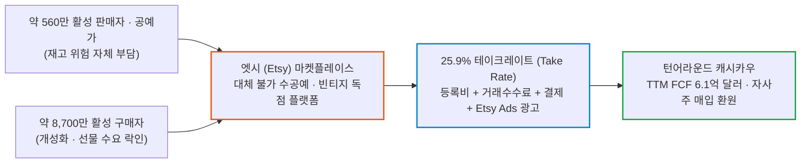
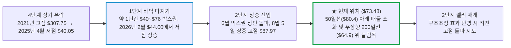

# 엣시(Etsy / ETSY) 실전 재무 및 가치 분석 보고서

- **작성일**: 2026-09-22
- **데이터 기준**: 2026년 2분기 실적(2026-06-30 마감) 및 2분기 주주서한, 최근 핵심 뉴스(2026.07~09), yfinance 시장 데이터(2026-09-21 미국장 마감 기준)

팬데믹 고점 대비 86% 폭락하며 사망 선고를 받았던 엣시가 2분기에 이미 영업이익을 전년 대비 33% 끌어올렸고, 그 위에 디팝(Depop) 매각과 12% 감원이라는 추가 군살 빼기를 얹었다. 대중이 중단사업 회계 손실이라는 껍데기 적자에 놀라 도망칠 때, 선행 PER 10.7배와 PEG 0.77배라는 바닥 밸류에이션에서 200일선 지지 기반의 냉혹한 분할 매수 타점을 계산하라.

## 핵심 요약

| 구분 | 핵심 요약 |
| :--- | :--- |
| **종목 및 주가** | 엣시 (NASDAQ: `ETSY`) / **$73.48** (52주 범위 $44.00 ~ $87.97) |
| **최종 투자의견** | **조건부 분할 매수 (Buy on Dip)** / 현재가 선발대 30%, 본대는 200일선($64.9) 지지 확인 후 투입 (투자 가치 점수 **78.0점**, 6.1절) |
| **비즈니스 본질** | 세상에 하나뿐인 수공예·빈티지 상품 생태계를 장악하고 25.9%의 고율 통행세를 뜯어내는 양방향 독점 플랫폼 |
| **핵심 매력 (Bull)** | Q2 계속영업 순이익 1.14억 달러(+150.7% YoY), 디팝 매각(약 14억 달러) 및 12% 감원으로 본업 집중, 에이전틱 AI 쇼핑 수혜, 선행 PER 10.7배·PEG 0.77배 저평가, 20억 달러 신규 자사주 매입 한도 |
| **핵심 리스크 (Bear)** | 경기 침체 시 재량 소비재(수공예·선물) 취약성, 범용 이커머스(아마존, 테무)의 초저가 공세, 높은 베타(1.81) 변동성, 3분기 구조조정 비용 반영 |
| **포트폴리오 성격** | 52주 저점 대비 +67% 반등 후 눌림목에 진입한 실적 턴어라운드주로 +20~30% 가치회귀를 노리는 **스윙~중기 공격수** / **배당이나 영구 보유를 바라는 보수파는 매수 금지** |

---

## 1. 비즈니스 실체: 대중이 모르는 기업의 '목줄'과 독점 빨대

대중은 엣시(Etsy)를 '손재주 좋은 동네 공예가들이 예쁜 액세서리와 빈티지 소품을 파는 귀여운 온라인 장터' 정도로 순진하게 바라본다. 자본 논리로 까보면 전혀 다른 비즈니스 괴물이 도사리고 있다. 엣시는 공장에서 찍어낸 싸구려 공산품이 아니라 '인간의 손길이 닿은 세상에 단 하나뿐인 물건'을 갈망하는 약 8,700만 명의 활성 구매자와 약 560만 명의 활성 판매자를 한 장터에 가두어 두고, 거래 대금의 4분의 1을 가차 없이 뜯어가는 **'수공예 틈새시장의 무자비한 통행세 징수인'이다**.

이 회사의 돈 버는 구조는 아마존이나 월마트 같은 대형 유통업체와 근본적으로 다르다:

- **① 재고 부담 제로(Zero Inventory)의 순수 중개 플랫폼**:
    - 엣시는 물류창고를 지어 재고를 쌓아두지 않는다. 판매자가 직접 만들고 직접 배송한다. 재고 감가상각과 악성 재고 폐기 위험을 판매자에게 전부 넘긴 채, 거래가 일어나는 길목만 틀어쥐고 수수료를 챙긴다.
- **② 25.9%에 달하는 압도적인 수수료율(Take Rate)**:
    - 상품 등록 수수료(Listing Fee), 결제 처리 수수료(Payment Processing Fee), 거래 성사 시 떼어가는 6.5%의 기본 거래 수수료에 더해, 판매자가 노출을 위해 돈을 내는 '엣시 광고(Etsy Ads)'와 오프사이트 광고(Offsite Ads) 수수료까지 합치면 2026년 2분기 마켓플레이스 테이크레이트는 **25.9%에 달한다**(전년 대비 +50bp). 100달러짜리 수공예 식탁보가 팔리면 평균 26달러가 엣시의 주머니로 꽂힌다.
- **③ 대체 불가능한 양방향 네트워크 락인(Lock-in)**:
    - 수공예품 창작자가 엣시를 떠나 독자 쇼핑몰을 차리는 순간 유입 트래픽은 0으로 수렴한다. 개성 있는 선물을 찾는 구매자 수천만 명이 이미 엣시에 몰려 있기 때문이다. 판매자는 수수료가 비싸다고 불평하면서도 엣시의 목줄에서 벗어나지 못한다.

### 1.1 아마존도 뚫지 못한 틈새시장 참호: '아마존 핸드메이드'의 굴욕

아마존은 막강한 자본과 물류망을 앞세워 '아마존 핸드메이드(Amazon Handmade)'를 출범시키고 엣시의 영역을 노렸다. 결과적으로 아마존은 엣시의 아성을 무너뜨리지 못했다. 기저귀와 건전지를 검색하는 쇼핑몰에서 '장인의 손길이 담긴 결혼 선물'을 찾는 감성 소비는 자리 잡지 못했다. 테무나 쉬인 같은 중국발 초저가 플랫폼도 사정은 같다. 플라스틱 공산품 덤핑과 수제 가죽 공예품은 소비 시장 자체가 분리되어 있기 때문이다. 이 강력한 카테고리 정체성이 엣시의 해자다.

### 1.2 구글의 통행세를 무력화한 '88% 직접 유입'의 해자

온라인 쇼핑몰의 가장 치명적인 약점은 구글이나 메타에 검색 광고비를 바쳐야만 고객이 들어오는 '트래픽 인질' 신세라는 점이다. 포털이 검색 알고리즘을 바꾸거나 키워드 입찰가를 올리면 마진이 순식간에 녹아내린다.

엣시는 다르다. 2026년 9월 오펜하이머(Oppenheimer)가 미국 소비자 2,500명을 대상으로 조사한 결과에 따르면, **응답자의 88%가 구글 검색을 거치지 않고 엣시 웹사이트나 앱으로 곧장 들어온다고 답했다**. 대중이 "이커머스는 검색 포털의 노예"라고 지레짐작할 때, 엣시는 이미 독자적인 목적성 쇼핑(Destination Shopping) 플랫폼으로 자리 잡았다. 검색 광고에 기대지 않아도 고객이 제 발로 찾아오는 이 오가닉 트래픽 참호가, 엣시가 25.9%의 고율 테이크레이트를 유지하는 진짜 비결이다.

---

## 2. 최근 핵심 뉴스 및 실적 흐름 심층 분석 (2026년 7월 ~ 9월)

2026년 7월 말부터 9월 중순까지 이어진 뉴스 흐름은 두 가지를 증명한다. 하나는 엣시가 **'구조조정 발표 이전에 이미 본업 마진을 복원했고, 디팝 매각과 12% 감원으로 그 위에 추가 비용 절감을 얹었다'는 사실이다**. 다른 하나는 **'에이전틱 AI 쇼핑 시대의 수혜주로 월가 IB들의 상향과 신규 매수 추천이 줄을 이었다'는 사실이다**.

### 2.1 최근 핵심 뉴스 타임라인 (팩트 vs 노이즈 vs 스마트머니)

| 일자 | 주요 뉴스 및 시장 이벤트 | 성격 | 스마트머니 관점의 핵심 분석 및 시사점 |
| :---: | :--- | :---: | :--- |
| **09.15** | **오펜하이머, 투자의견 'Perform → Outperform' 상향 및 목표가 $90 제시** | `🟢 스마트머니` | AI 기반 검색 활성화로 상품 발견과 구매 전환율 개선 전망. 미국 소비자 2,500명 조사에서 88%가 구글 검색 없이 엣시로 직접 유입. 2027·2028년 GMS 성장률 각각 5% 제시. 목표가는 2027년 예상 EBITDA의 12배 기준. 주가는 장중 $76.43(+2.6%)까지 올랐다가 상승분을 반납하고 $74.00에 마감 |
| **09.04~09.08** | **이틀 만에 $82.03 → $72.82 (-11.2%) 급락** | `🔴 수급 이탈` | 50일선 아래로 밀려나며 8월 고점권 매물 출회. 뚜렷한 펀더멘털 악재 없이 진행된 차익 실현 성격의 하락 |
| **08.20** | **로젠블랫, 전자상거래 섹터 커버리지 개시 및 엣시 '매수'·목표가 $95** | `🟢 에이전틱 수혜` | 에이전틱 커머스(Agentic Commerce) 도래 시 탐색 과정이 압축되더라도 독창적 판매자가 모인 마켓플레이스가 거래를 지배한다는 논리. 2026년 마켓플레이스 GMS 110억 달러(+5.5%) 전망, ChatGPT·구글 커머스 프로토콜 연동을 AI 상품 발견 강화 요인으로 제시 |
| **08.07** | **JP모건, 투자의견 '중립 → 비중확대' 상향 및 목표가 $85 → $100** | `🟢 실적 가속` | 마켓플레이스 GMS 3개 분기 연속 전년 대비 성장 확인. 경영진이 연간 GMS 가이던스를 '한 자릿수 중반'으로 상향. 당일 주가 +4.0% |
| **08.05** | **2분기 실적 발표(장 마감 후), 전체 인력 약 12%(약 220명) 감원, 20억 달러 자사주 매입 승인** | `🟢 체질 개선` | 계속영업 EPS $0.98로 컨센서스($0.75) 상회. 디팝 매각 손실로 GAAP 순이익은 적자. 다음 날(08.06) 주가는 장중 -9.3%까지 밀렸다가 -4.2%로 마감. 감원 비용 약 3,500만 달러는 3분기에 반영 |
| **07.30** | **디팝(Depop), 이베이에 약 14억 달러에 매각 종결** | `🟢 군살 제거` | 비핵심 중고 의류 플랫폼 정리 완료. 매각 대금은 3분기에 유입되어 6월 말 대차대조표에는 아직 반영되지 않음 |

---

### 2.2 뉴스 흐름으로 본 3대 핵심 구조적 판도 변화와 스마트머니의 의도

#### ① 구글 통행세를 우회하는 '88% 직접 유입'의 충격 (오펜하이머 조사)
- 대중은 검색 엔진이나 소셜 미디어가 정책을 바꾸면 중소 이커머스가 궤멸할 것이라며 공포에 떤다.
- 오펜하이머의 조사는 엣시에 대해서만큼은 이 공포가 과장임을 보여줬다. 미국 소비자 2,500명 중 **88%가 구글 검색창을 거치지 않고 엣시 웹이나 앱을 직접 켠다고 답했다**.
- 사용자가 제 발로 찾아오는 목적지(Destination)이기 때문에, 엣시는 검색 광고 의존도를 낮게 유지하면서 이익을 방어한다.

#### ② 에이전틱 커머스(Agentic Commerce) 시대의 진정한 승자 (로젠블랫 분석)
- AI 에이전트가 소비자의 쇼핑 니즈를 대신 검색하고 가격을 비교해 주는 시대가 열리고 있다.
- 공장에서 대량 생산되는 규격화된 공산품은 가격 비교 에이전트에 의해 마진이 바닥까지 깎여나가는 치킨게임을 피할 수 없다.
- 엣시가 쥐고 있는 '세상에 하나뿐인 수공예·빈티지·커스텀 상품'은 AI 에이전트가 아무리 발전해도 공급자를 대체할 수 없다. 탐색 경로가 압축되더라도 독창적 판매자가 거래를 쥐고 있으므로, 그 판매자들이 모여 있는 엣시의 수수료 수취 구조는 오히려 견고해진다.

#### ③ 2분기 마진 복원 위에 얹은 12% 감원 (JP모건 목표가 $100 상향)
- 2분기 영업이익 **+33.2% 급증은** 감원 발표 이전에 이미 달성한 숫자다. 마케팅비 비율을 전년 대비 낮추고 테이크레이트를 끌어올린 결과이며, 영업이익률은 18.7%까지 올라왔다.
- 8월 5일 발표한 **12% 인력 구조조정은** 회사가 망해가서 자른 것이 아니다. 7월 30일 디팝 매각을 끝낸 뒤 조직을 엣시 마켓플레이스 하나에 맞춰 재편하는 조치이며, 감원 효과는 3분기 이후 비용 구조에 반영된다.
- JP모건은 GMS 3개 분기 연속 성장과 연간 가이던스 상향(한 자릿수 중반)을 확인하고 목표주가를 **$100로** 올렸다.

---

### 2.3 2분기 실적 팩트 체크: 숫자로 증명한 본업 턴어라운드

2026년 2분기 실적은 엣시를 짓누르던 부진의 늪에서 벗어나는 전환점이었다. 겉으로 드러난 GAAP 순손실만 보고 "적자 전환했다"며 경악한 대중과 달리, 기관 투자자들은 본업의 마진 복원에 집중했다.

| 재무 지표 | Q2 2025 | Q1 2026 | Q2 2026 | 전년 동기 대비(YoY) | 냉혹한 데이터 분석 |
| :--- | ---: | ---: | ---: | ---: | :--- |
| **총매출** | $629.1M | $631.3M | **$668.3M** | **+6.2%** | 마켓플레이스 GMS +7.5%와 25.9% 테이크레이트로 매출 성장세 복원 |
| **영업이익** | $94.1M | $119.8M | **$125.3M** | **+33.2%** | 마케팅 효율화와 테이크레이트 상승으로 영업이익 급증 (감원 효과는 미반영) |
| **영업이익률 (OPM)** | 15.0% | 19.0% | **18.7%** | **+3.7%p** | 저점 탈출 후 18~19%대 고마진 체질 안착 |
| **계속영업 순이익** | $45.6M | $104.7M | **$114.3M** | **+150.7%** | 본업에서 창출한 진짜 순이익은 전년 대비 2.5배 |
| **보고 순이익 (GAAP)** | $28.8M | $69.7M | **-$46.6M** | **적자전환 (착시)** | 디팝 매각 관련 중단영업손실 -$161.0M 반영 |
| **잉여현금흐름 (FCF)** | $91.9M | $70.9M | **$32.8M** | **-64.3%** | 분기 FCF는 급감했지만 최근 4개 분기 합계(TTM)는 $613.5M로 연간 창출력 유지 |
| **현금 및 단기투자** | $1,412.3M | $1,425.8M | **$1,122.3M** | **-20.5%** | 최근 4개 분기 자사주 매입 $648.0M(2분기만 $249.7M)이 감소의 주원인. 디팝 매각 대금(약 14억 달러)은 3분기 유입 예정 |

출처: yfinance 분기 재무제표 및 엣시 2026년 2분기 주주서한(2026-06-30 마감 기준).

### 2.4 장부를 뒤흔든 3대 핵심 턴어라운드 동력

- **① 디팝(Depop) 매각과 군살 빼기 (비핵심 자산 털어내기)**:
    - 엣시는 과거 과도한 욕심으로 인수했던 중고 의류 플랫폼 디팝을 7월 30일 이베이에 약 14억 달러에 넘겼다. 이 과정에서 중단영업손실 1억 6,099만 달러가 2분기에 반영되며 GAAP 순이익이 -4,665만 달러 적자로 찍혔다. 실적 발표 다음 날 주가는 장중 -9.3%까지 밀렸지만, 본업(Etsy Marketplace)은 계속영업 순이익 **1억 1,434만 달러(+150.7% YoY)를** 쓸어 담았다.
- **② 마케팅 효율화와 12% 감원 (고정비 다이어트 2단계)**:
    - 2분기에는 마케팅비의 매출 대비 비율을 전년보다 낮추면서 매출 성장률(+6.2%)을 5배 이상 웃도는 영업이익 증가율(+33.2%)을 기록했다. 여기에 8월 5일 전체 인력의 약 12%(약 220명, 제품·엔지니어링 조직 중심) 감원을 발표했다. 감원 후 인원은 약 1,600명이며, 일회성 비용 약 3,500만 달러가 3분기에 반영된다. 3분기 GAAP 이익이 이 비용 때문에 한 번 더 흔들려도 놀랄 일이 아니다.
- **③ 20억 달러 자사주 매입과 주주환원의 괴력**:
    - 엣시는 2분기에만 약 390만 주를 2억 4,970만 달러에 사들였고, 실적 발표와 함께 20억 달러 규모의 신규 자사주 매입 프로그램을 승인했다. 시가총액(67.4억 달러)의 약 30%에 해당하는 한도다. 유통 주식 수가 줄어드는 만큼 향후 주당순이익(EPS) 성장에 가속도가 붙는다.

### 2.5 시장의 착시 vs 냉혹한 데이터 팩트

| 시장이 보고 놀란 것 (착시) | 데이터가 말해주는 진실 (팩트) |
| :--- | :--- |
| **"2분기 4,665만 달러 순손실을 냈으니 성장 엔진이 꺼졌다"** | 디팝 매각에 따른 일회성 중단영업손실(-1.61억 달러)일 뿐이다. 본업의 계속영업 순이익은 **1억 1,434만 달러로 전년 동기 대비 +150.7% 급증했다**. |
| **"아마존과 테무의 초저가 공세에 치여 설 자리가 없다"** | 테무에서 1달러짜리 플라스틱을 사는 고객과 엣시에서 150달러짜리 수제 원목 도마를 사는 고객은 타겟이 완전히 다르다. 엣시의 2분기 테이크레이트는 오히려 전년 대비 +50bp 올라 25.9%를 기록했다. |
| **"재량 소비재라 경기 침체 오면 끝장난다"** | 마켓플레이스 GMS는 3개 분기 연속 전년 대비 성장했고, 2분기에는 +7.5%로 직전 분기보다 성장 폭이 커졌다. 기념일 선물과 개성 있는 리빙 인테리어 수요는 가격 민감도가 상대적으로 낮다. |
| **"자사주 사느라 현금이 마르고 부채가 위험하다"** | 6월 말 현금 및 단기투자는 **11억 2,229만 달러이고**, 총부채는 30.76억 달러다. 여기에 7월 말 디팝 매각 대금 약 14억 달러가 들어오고, 최근 4개 분기 FCF만 6.1억 달러다. 1년 내 만기 부채 6.50억 달러를 갚고도 자사주 매입을 이어갈 여력이 있다. |

---

## 3. 경쟁 해자 및 피어 그룹 잔혹 비교

이커머스·플랫폼 섹터의 밸류에이션 멀티플을 대조해 보면, 엣시가 받는 디스카운트가 한눈에 드러난다. 선행 PER 기준으로 엣시보다 싼 곳은 핀터레스트(8.1배)뿐이고, 이베이·아마존·쇼피파이는 모두 엣시보다 비싸다.

| 비교 지표 | 엣시 `ETSY` | 이베이 `EBAY` | 쇼피파이 `SHOP` | 아마존 `AMZN` | 핀터레스트 `PINS` |
| :--- | ---: | ---: | ---: | ---: | ---: |
| **현재 주가 ($)** | **73.48** | 108.30 | 137.92 | 258.45 | 19.36 |
| **시가총액 ($B)** | **6.74** | 48.19 | 178.97 | 2,787.72 | 10.96 |
| **후행 PER (TTM)** | **23.3배** | 22.8배 | 93.2배 | 20.8배 | 56.9배 |
| **선행 PER (Forward)** | **10.7배** | 16.1배 | 56.3배 | 24.9배 | 8.1배 |
| **PEG 비율** | **0.77배** | 1.60배 | 1.73배 | 1.51배 | 0.24배 |
| **베타 (Beta)** | **1.81** | 1.34 | 2.62 | 1.44 | 0.89 |

출처: yfinance(2026-09-21 미국장 마감 기준).

!!! note "후행 PER 23.3배와 선행 PER 10.7배의 괴리"
    엣시의 후행 EPS($3.16)에는 디팝 매각에 따른 중단영업손실이 섞여 있다. 그래서 후행 PER이 부풀려져 보인다. 계속영업 기준 이익 체력은 애널리스트 추정 선행 EPS($6.89)에 더 가깝고, 두 PER의 차이는 대부분 이 회계 착시에서 나온다.

- **① 이베이(EBAY)의 늙은 모델 대비 엣시의 확장성**:
    - 이베이는 중고 경매와 자동차 부품 등으로 버티며 선행 PER 16.1배를 받고 있다. 수공예 선물 생태계에서 압도적 브랜드 충성도를 가진 엣시의 선행 PER은 **10.7배에 불과하다**. 2분기 영업이익 성장률(+33.2%)을 감안하면 명백한 역전 현상이다.
- **② 쇼피파이(SHOP)의 거품 vs 엣시의 딥 밸류(Deep Value)**:
    - 쇼피파이는 선행 PER 56.3배, PEG 1.73배라는 살벌한 밸류에이션을 요구한다. 성장이 조금만 삐끗해도 주가가 반토막 날 위험이 도사린다. 엣시는 PEG **0.77배 수준으로**, 성장률 대비 주가가 눌려 있어 밸류에이션 측면의 하방 쿠션이 두껍다.
- **③ 핀터레스트(PINS)가 더 싸다는 반론**:
    - 숫자만 보면 핀터레스트(선행 PER 8.1배, PEG 0.24배)가 더 싸다. 그러나 핀터레스트는 광고 매출에 의존하는 발견형 플랫폼이고, 엣시는 거래가 일어날 때마다 25.9%를 떼는 결제 통행세 모델이다. 수익 모델이 다르므로 단순 멀티플 비교로 엣시의 저평가 논리가 무너지지는 않는다.
- **④ 높은 베타(1.81)의 양날의 검**:
    - 엣시의 베타는 1.81로, 지수가 1% 움직일 때 평균 1.8% 안팎으로 움직인다는 뜻이다. 장이 흔들릴 때 과도하게 두들겨 맞지만, 시장 반등과 실적 턴어라운드가 맞물리면 지수보다 훨씬 큰 상방 탄력을 보인다.

---

## 4. 기술적 사이클 위치 (4단계 사이클 모델)

스탠 와인스타인(Stan Weinstein)의 4단계 시장 사이클 관점에서 엣시의 주가는 **'1단계 바닥 매집(Accumulation)을 끝내고 2단계 상승(Uptrend)에 진입한 뒤, 첫 번째 되돌림을 소화하는 구간'**에 걸쳐 있다.

- **① 1년간의 바닥 확인과 저점 상승**:
    - 주가는 2025년 4월 장중 $40.05(종가 기준 $40.80)까지 떨어지며 팬데믹 버블의 잔재를 털어냈다. 이후 약 1년간 $40~$76의 넓은 박스권을 오갔고, 2026년 2월 52주 저점 $44.00에서 직전 저점보다 높은 바닥을 만들었다. 2026년 6월 박스권 상단($76)을 돌파했고, 실적 발표 직전인 8월 5일 장중 $87.97까지 올라섰다. 종가 기준 고점은 8월 24일의 $87.03이다.
- **② 50일선 아래 숨고르기와 200일선 생명선**:
    - 9월 4일과 8일 이틀 동안 -11.2% 급락하며 주가는 50일 이동평균선($80.43) 아래로 밀려났고, 현재 $73.48에서 숨을 고르고 있다.
    - 가장 중요한 장기 추세선인 **200일 이동평균선은 $64.89 부근에서** 우상향 중이다(20거래일 전 $62.78). 현재 주가는 200일선 대비 약 +13.2% 위에 있다. 아직 200일선 지지를 시험하지 않았으므로, 본대는 이 선에서의 지지를 확인한 뒤에 투입하는 것이 맞다.

---

## 5. 밸류에이션 및 가격 타당성 검증

### 5.1 선행 PER 10.7배와 PEG 0.77배의 절대적 저평가

- 현재 주가 $73.48 기준 엣시의 선행 PER은 **10.66배에 불과하다**. 같은 이커머스 피어인 이베이(16.1배), 아마존(24.9배)과 비교하면 3분의 2에서 절반 이하 수준으로 후려쳐져 있다.
- 이익 성장률을 감안한 PEG 비율은 **0.77배다**. 피터 린치 기준으로 PEG 1.0 미만은 성장성 대비 주가가 싸구려 취급을 받고 있다는 뜻이다. 직전 분기 영업이익이 전년 대비 33% 뛴 기업에 붙을 멀티플이 아니다.

### 5.2 현금 쿠션과 부채 구조

- 2026년 6월 말 기준 엣시의 현금 및 단기투자 자산은 **11억 2,229만 달러(현금 9.01억 달러 + 단기투자 2.21억 달러)이다**.
- 총부채는 30.76억 달러이며, 이 중 1년 내 만기가 도래하는 부채가 6.50억 달러다. 6월 말 기준 순부채는 약 19.5억 달러다.
- 7월 30일 디팝 매각 대금 약 14억 달러가 3분기에 들어온다. 세금과 거래 비용을 빼기 전 단순 합산으로 보면 순부채는 5억 달러대로 줄어든다. 여기에 최근 4개 분기 FCF 6.1억 달러를 더하면, 단기 만기 상환과 20억 달러 자사주 매입을 동시에 감당할 현금 창출력은 충분하다. 다만 자사주 매입을 한도까지 공격적으로 집행하면 순부채가 다시 늘어난다는 점은 기억해 둬라.

### 5.3 월가 주요 IB 투자의견 및 목표주가 현황

2분기 실적 발표 이후 월가 하우스들은 엣시의 턴어라운드를 인정하며 상향과 신규 매수 추천을 이어갔다.

| 투자은행(IB) | 발표 일자 | 투자의견 | 목표주가 | 핵심 논거 및 스마트머니 시각 |
| :--- | :---: | :---: | :---: | :--- |
| **JP모건 (JPMorgan)** | 2026-08-07 | **비중확대 (중립에서 상향)** | **$100 ($85에서 상향)** | 마켓플레이스 GMS 3개 분기 연속 성장, 연간 GMS 가이던스 상향 |
| **로젠블랫 (Rosenblatt)** | 2026-08-20 | **매수 (신규)** | **$95** | 에이전틱 커머스 수혜, 2026년 마켓플레이스 GMS 110억 달러(+5.5%) 전망 |
| **오펜하이머 (Oppenheimer)** | 2026-09-15 | **아웃퍼폼 (Perform에서 상향)** | **$90** | AI 기반 검색 활성화, 미국 소비자 88%의 직접 유입, 2027·2028년 GMS 각 5% 성장 |
| **월가 컨센서스** | 2026-09-21 기준 | **Buy (27명)** | **평균 $88.33** | 현재가($73.48) 대비 평균 상승 여력 **+20.2%**, 최고 목표가($105.00) 기준 **+42.9%에 달한다** |

- 월가 애널리스트 27명의 평균 목표주가는 **$88.33이다**(중앙값 $90.00, 최고 $105.00, 최저 $70.00).
- JP모건의 $100와 오펜하이머의 $90는 단순한 장밋빛 전망이 아니다. 3개 분기 연속 GMS 성장, 가이던스 상향, AI 검색 도입에 따른 구매 전환율 개선이라는 확인 가능한 지표에 근거하고 있다.
- 디팝 매각은 7월 30일 종결되었지만, 3분기에도 감원 비용 약 3,500만 달러가 반영된다. 이 일회성 비용을 걷어낸 하반기 마진 확대가 숫자로 확인되면, 선행 PER이 10배에서 14~15배로 정상화되는 리레이팅(Re-rating)이 전개될 수 있다.

### 5.4 SEC 13F-HR 공시 기반 스마트머니 및 월가 거물 지분 지형도

대중이 소외주라며 외면할 때, 엣시의 실제 주주 명부를 까보면 월가의 가장 집요하고 잔혹한 **행동주의 사냥꾼(엘리엇의 폴 싱어)**, **세계 1위 퀀트 제국(르네상스 테크놀로지)**, 그리고 **하방 방어의 대가(오크트리의 하워드 막스)**가 수천억 원대 지분을 틀어쥐고 진을 치고 있다.

| 월가 거물 / 하우스 | SEC CIK | 최신 공시일 | 보유 형태 및 수량 | 보유 평가액 ($) | 포트폴리오 내 성격 및 전략적 의도 |
| :--- | :---: | :---: | :--- | :---: | :--- |
| **폴 싱어 (Paul Singer)** Elliott Investment Management | `0001791786` | 2026-08-14 | **보통주 5,000,000주** | **$376,650,000** (약 5,100억 원) | **포트폴리오 15위 핵심 비중** (비중 1.66%) 이사회 이사 파견 및 비핵심 자산 매각·감원·자사주 매입 주도 |
| **짐 사이먼스 / 피터 브라운** Renaissance Technologies | `0001037389` | 2026-08-13 | **보통주 5,990,442주** | **$451,259,996** (약 6,100억 원) | **헤지펀드 중 최대 지분 보유** 선행 PER 10배 바닥권 밸류에이션 퀀트 모델 매집 |
| **켄 그리핀 (Ken Griffin)** Citadel Advisors LLC | `0001423053` | 2026-09-02 | **보통주 3,483,174주** + 전환노트($23.2M) | **$285,590,481** (약 3,850억 원) | 멀티전략 롱숏의 대규모 지분 및 크레딧 복합 포지션 |
| **클리프 애스니스 (Cliff Asness)** AQR Capital Management | `0001072509` | 2026-08-14 | **보통주 약 270만 주** | **$205,268,667** (약 2,800억 원) | 퀀트 딥 밸류(Deep Value) 팩터 편입 |
| **스티브 코헨 (Steve Cohen)** Point72 Asset Management | `0001603466` | 2026-08-14 | **보통주 1,797,069주** | **$135,373,208** (약 1,800억 원) | 펀더멘털 턴어라운드 스윙 롱 포지션 |
| **하워드 막스 (Howard Marks)** Oaktree Capital Management | `0000949509` | 2026-08-14 | **전환사채(CB) 3종** (액면 약 $8,604만) | **$81,930,148** (약 1,100억 원) | **비대칭 손익비 추구** 채권으로 원금 손실 방어 + 주가 반등 시 주식 전환 이익 향유 |
| **조지 소로스 (George Soros)** Soros Fund Management | `0001029160` | 2026-08-14 | 보통주 297,000주 | **$22,373,010** (약 300억 원) | 매크로 가치회귀 선발대 |
| **레이 달리오 (Ray Dalio)** Bridgewater Associates | `0001350694` | 2026-08-14 | 보통주 273,253주 | **$20,584,148** (약 280억 원) | 올웨더 소비재 바스켓 편입 |

출처: SEC EDGAR 2026년 2분기 13F-HR 공식 공시(보고 기준일 2026-06-30). 평가액은 분기 말 종가 기준.

!!! note "13F 공시 데이터의 성격과 해석 시 유의점"
    - **45일 후행 지연 공시**: 13F는 분기 종료 후 45일 이내에 제출되므로 2026년 6월 30일 시점의 스냅샷이다. 7~8월에 발생한 단기 시세 변동 및 실시간 매매는 다음 분기(9월 말 기준) 공시가 나와야 잡힌다.
    - **공매도(숏) 미표시**: 13F에는 롱(Long) 주식 및 전환사채 등만 잡히며, 기관들의 숏(Short) 포지션이나 장외 스왑(TRS)은 공시되지 않는다.

#### 스마트머니 수급이 가리키는 2대 구조적 시사점

- **① 하워드 막스(Oaktree)의 안전마진 전략 (채권 하방 + 주식 상방)**:
    - 부실채권과 하방 방어의 대가 하워드 막스는 보통주 대신 **전환사채(Convertible Bond) 3종에 1,100억 원**을 실었다.
    - 최악의 경우에도 채권 변제 순위로 원금을 방어하고, 엣시 주가가 정상화되면 주식으로 전환해 막대한 시세 차익을 챙기는 구조다. 월가의 가장 보수적인 크레딧 거물이 엣시의 하방 경직성을 장부상으로 보증하고 있다는 뜻이다.
- **② 르네상스·시타델의 퀀트 딥 밸류 매집 (1조 원대 판돈)**:
    - 퀀트 알고리즘의 최정점에 선 르네상스 테크놀로지와 시타델이 합산 **1조 원에 가까운 보통주**를 쓸어 담았다.
    - 2021년 팬데믹 거품 붕괴 후 주가가 86% 폭락하며 선행 PER 10.7배, PEG 0.77배까지 후려쳐진 가격을, 알고리즘 모델이 '통계적 과매도 및 가치 왜곡(Deep Value Mispricing)'으로 판정하고 바닥 매집에 나섰음을 보여준다.

---

### 5.5 행동주의 거물 폴 싱어(Elliott)의 2년 반 캠페인과 주가 상방 폭발 메커니즘

월가에서 가장 잔혹하고 집요하기로 악명 높은 행동주의 헤지펀드 엘리엇 매니지먼트(Elliott Investment Management)의 폴 싱어가 엣시의 목줄을 쥐고 있다. 대중은 13F 공시에서 '보통주 500만 주'라는 숫자만 흘려보내지만, 이 포지션의 이면을 뜯어보면 **주가가 위로 한 번 크게 쏠 수밖에 없는 폭발적인 비대칭 수급 화약고**가 고스란히 드러난다.

#### ① 엘리엇의 참전 이력과 현재 포지션 (공시로 확인되는 것과 확인되지 않는 것)

- **2024년 2월의 기습 참전 (당시 주가 $70 ~ $76)**:
    - 엘리엇은 2024년 2월 엣시 지분 13% 상당(보통주 및 스왑 파생상품 결합)을 기습 확보하며 파트너인 마크 스타인버그(Marc Steinberg)를 엣시 이사회에 전격 입성시켰다. 당시 엣시의 주가는 **$70 ~ $76 부근**이었다.
- **-45% 반토막 폭락의 늪 ($40.05 저점)**:
    - 엘리엇의 참전 이후에도 고금리와 소비 침체, 테무·쉬인의 난립으로 엣시 주가는 2025년 4월 **$40.05까지 곤두박질쳤다**. 참전 당시 주가 대비 -45%에 달하는 폭락이다.
- **현재 포지션: 13%가 아니라 보통주 약 5.4%다**:
    - 2026년 2분기 13F 기준 엘리엇의 보유량은 **보통주 500만 주**로, 발행주식(약 9,178만 주)의 약 5.4%다. 직전 분기와 수량 변동은 없다. 참전 당시의 13% 노출과 비교하면 파생상품 노출을 정리했거나 보유 지분을 줄였다는 뜻이다.
    - 13F는 보유 수량만 보여줄 뿐 매입 단가와 매도 이력은 드러내지 않는다. 따라서 "엘리엇이 $70선에 물려 있다가 이제 본전을 찾았다"는 식의 평단가 추정은 공시로 증명할 수 없는 소설이다. 확인되는 팩트는 엘리엇이 **2026년 6월 말까지 약 5.4%를 쥔 채 이사회 영향력을 유지하고 있다**는 것뿐이다.

#### ② 폴 싱어가 빈손으로 이사회를 떠날 놈인가? (행동주의의 본질)

행동주의 펀드의 존재 이유는 명확하다. 남들이 피 흘리며 던진 기업의 지분을 장악한 뒤, 이사회를 흔들어 자산을 매각하고 인력을 자르고 현금을 쥐어짜 주가를 폭등시킨 후 차익을 챙기고 나가는 것이다.

아르헨티나 정부를 상대로 군함까지 압류하며 15년을 싸워 기어이 원리금을 받아냈던 폴 싱어가, 2년 반 동안 엣시 이사회에 사람을 앉혀 두고 아무 성과 없이 조용히 발을 뺄 리 만무하다. 지분을 줄인 뒤에도 약 5.4%를 남겨 두었다는 사실 자체가, 아직 뽑아낼 상방이 남아 있다고 엘리엇이 판단하고 있다는 신호다.

#### ③ 주가를 위로 쏘아 올리기 위해 장전해 둔 3단계 화약고

엘리엇은 지난 2년 반 동안 엣시를 쥐어짜며 주가가 위로 쏠릴 수밖에 없는 3단계 기폭제를 완벽하게 장전해 놓았다:

- **1단계: 비핵심 적자 자산 털어내기 및 실탄 장전 (디팝 매각)**:
    - 엣시 경영진이 과거 고점에 무리하게 인수해 적자를 내던 중고 의류 플랫폼 디팝(Depop)을 2026년 7월 30일 이베이에 **약 14억 달러(약 1.9조 원)**에 팔아치웠다. 비핵심 부실을 털어내고 본업 마켓플레이스에 집중할 막대한 현금을 확보했다.
- **2단계: 고정비 강제 다이어트 (12% 인력 구조조정)**:
    - 8월 5일 전체 인력의 **12%(약 220명, 엔지니어링 및 비수익 조직)**를 잘라냈다. 3분기 일회성 퇴직 비용(약 3,500만 달러)만 지나가면, 4분기부터 고정비가 깎여나가며 영업이익률이 20%대로 직행하는 강력한 마진 레버리지가 폭발한다.
- **3단계: 주가 폭등의 도화선 (시총 30%에 달하는 20억 달러 자사주 매입)**:
    - 현재 시가총액 67.4억 달러의 무려 30%에 달하는 **20억 달러를 자사주 매입 한도로 승인**했다. 디팝 매각 대금(약 14억 달러)과 연간 6억 달러 이상의 잉여현금흐름(FCF)으로 주식을 무섭게 태워 없애면, 유통 주식 수가 줄어들며 주당순이익(선행 EPS $6.89)이 인위적으로 치솟는다. 시장에 유통되는 주식 자체가 마르면서 매수세가 조금만 붙어도 주가가 수직으로 튀어 오르는 **'품절주 효과'**가 발생한다.

#### ④ 마지막 히든카드: 통매각(M&A) 및 사모펀드(PE) 엑시트 압박

만약 이렇게 본업 마진을 살리고 자사주를 태웠는데도 시장이 엣시의 주가를 제값으로 올려주지 않는다면 어떻게 될 것인가?
엘리엇의 전매특허인 최종 엑시트 카드가 나온다. 바로 **"회사를 사모펀드(Private Equity)나 글로벌 빅테크에 프리미엄을 얹어 통째로 매각하라"**는 M&A 압박이다. 경영권 매각 소식이 터지는 순간 통상 30~40%의 인수 프리미엄이 붙어 주가는 단숨에 수직 폭등하며, 엘리엇은 그때 전량 차익을 실현하고 유유히 탈출한다.

#### ⑤ 얼마나, 어디까지 튈 수 있는가? (냉혹한 현실 계산 vs 버려야 할 망상)

- **버려야 할 망상 (대박 환상 금지)**:
    - "팬데믹 때 300달러를 찍었으니 이번에도 3~4배 날아갈 것"이라는 순진한 망상은 버려라. 당시의 주가는 전 세계가 집에 갇혀 수공예 마스크와 인테리어 소품을 사재기하던 일회성 버블이었다. 엣시는 성숙기에 접어든 이커머스 플랫폼이다.
- **현실적인 상방 목표선 (1차 $88 ~ $95, 리레이팅 완성 시 $96 ~ $103)**:
    - 월가 컨센서스 평균($88.33)과 메이저 IB들의 목표가(오펜하이머 $90, 로젠블랫 $95, JP모건 $100, 월가 최고 목표가 $105)를 교차 대조하면 상방 룸이 명확하게 떨어진다.
    - 현실적인 1차 목표선은 컨센서스 평균부터 로젠블랫 목표가까지인 **$88 ~ $95 구간(현재가 대비 +20 ~ +30%)이다**. 이 구간에서 분할로 차익을 챙겨라.
    - 구조조정 효과가 숫자로 확인되어 선행 EPS($6.89)에 14~15배의 정상화 멀티플이 붙으면 **$96 ~ $103 구간(+31 ~ +40%)까지** 열린다. 하반기 마진 확대가 실제 숫자로 찍혀야 열리는 상단 시나리오이지, 처음부터 전량을 걸어 둘 기준선이 아니다.

---

## 6. 종합 평가 및 냉혹한 계좌 실행 원칙

### 6.1 6대 핵심 투자 지표 다차원 평가 매트릭스

| 평가 영역 | 가중치 | 평점 (100점 만점) | 가중 점수 | 등급 | 핵심 평가 요약 |
| :--- | :---: | :---: | :---: | :---: | :--- |
| **① 비즈니스 모델 및 해자** | 25% | **84점** | 21.00 | `A` | 대체 불가 수공예·빈티지 장터, 25.9% 테이크레이트, 88% 직접 유입 오가닉 참호 |
| **② 실적 성장성 및 가이던스** | 25% | **76점** | 19.00 | `B+` | Q2 계속영업 순이익 +150.7%, GMS 3개 분기 연속 성장 및 가이던스 상향 |
| **③ 재무 건전성 및 현금흐름** | 20% | **82점** | 16.40 | `A-` | TTM FCF 6.1억 달러, 디팝 매각 대금 약 14억 달러 유입, 20억 달러 자사주 매입 한도 |
| **④ 밸류에이션 매력도** | 15% | **85점** | 12.75 | `A` | 선행 PER 10.7배, PEG 0.77배의 극단적 저평가 |
| **⑤ 기술적 매매 타이밍** | 10% | **68점** | 6.80 | `B-` | 50일선 아래 매물 소화 중, 우상향 200일선 지지 시험 전 |
| **⑥ 리스크 관리 가능성** | 5% | **41점** | 2.05 | `D+` | 높은 베타(1.81), 재량 소비재 경기 민감도, 3분기 구조조정 비용 |
| **종합 가중치 환산 점수** | **100%** | — | **78.0점** | **`Buy`** | **본업 턴어라운드 명확, 눌림목을 활용한 분할 매수 구간** |

### 6.2 실전 결론: "그래서 지금 어쩌라는 것인가?" (Action Verdict)

#### ① 지금 당장 사야 하는가? ➔ **"선발대만 보내라. 본대는 200일선에서 싣는다."**
- **이유**: 8월 고점($87.97) 이후 9월 초 이틀간 -11.2% 급락하며 50일선 아래로 밀려났다. 하방에는 우상향하는 200일선($64.89)이 버티고 있지만, 아직 그 선까지 내려와 지지를 증명하지는 않았다.
- **지금 할 일**: 현재가($70~$74)에서 30% 수준의 선발대만 진입시킨다. 200일선 근접 구간($64~$67)에서 지지 양봉을 확인한 뒤 주력 물량을 싣는 2단계 분할 매수가 손익비를 극대화한다. 그 사이 어정쩡한 중간 가격대에서 물량을 늘리지 마라.

#### ② 이런 주식은 누가 사고, 누가 절대 사면 안 되는가?
- **❌ 절대 사지 마라 (즉시 퇴장)**: 주가 변동성에 밤잠을 설치는 보수적 투자자, 매 분기 꼬박꼬박 들어오는 배당금을 원하는 은퇴 생활자, 1~2주 만에 급등을 바라는 단타족.
- **⭕ 반드시 눈독 들이고 주워 담아야 할 사람 (스나이퍼 매수)**: 시장의 오독으로 억울하게 두들겨 맞은 플랫폼을 헐값에 주워 **+20% ~ +30%의 가치회귀 스윙 수익**을 챙기려는 가치 트레이더.

#### ③ 이 주식으로 '인생 역전(대박)'을 바라면 안 되는 냉혹한 이유
- 엣시는 고성장하는 AI 인프라주가 아니다. 태생이 전자상거래 플랫폼이자 경기 순환에 영향을 받는 재량 소비재 기업이다. GMS 성장률도 월가 전망 기준 연 5% 안팎이다.
- 선행 EPS($6.89)에 14~15배를 적용하면 $96~$103이 나온다. 컨센서스 평균($88.33)과 최고 목표가($105.00) 사이인 **$88~$95 구간(+20~30%)이** 현실적인 1차 목표선이다. 2021년 팬데믹 시절의 300달러 신화를 기대하며 무기한 물려 있겠다는 망상은 당장 버려라.

### 6.3 실전 가격대별 실행 시나리오 및 분할 매수 로드맵

| 구분 | 실행 조건 | 배정 비중 | 가격 기준 | 대응 방침 |
| :--- | :--- | :---: | :---: | :--- |
| **1차 진입 (선발대)** | 50일선 하회 구간 매물 소화 | 30% | $70 ~ $74 | 현재가 부근 정찰대 구축 |
| **2차 매수 (주력)** | 200일선($64.9) 근접 및 지지 양봉 | 40% | $64 ~ $67 | 핵심 비중 집중 확보 (손익비 최적 타점) |
| **3차 매수 (추세 확인)** | 50일선($80.4) 재돌파 및 안착 | 20% | $81 돌파 시 | 2단계 랠리 재개 확인 후 추가 |
| **예비 현금** | 소비 둔화 및 거시 변동성 버퍼 | 10% | — | 돌발 급락에 대비한 안전 현금 보존 |
| **차익 실현** | 컨센서스 목표가 구간 도달 | 분할 | $88 ~ $95 | +20~30% 구간에서 분할 매도 |
| **손절 기준선** | 200일선 장기 추세선 완전 붕괴 | — | $61 종가 이탈 시 | 지지선 붕괴 시 미련 없이 비중 축소 후 철수 |

!!! tip "최종 핵심 제언 (Executive Takeaway)"
    시장은 비핵심 자산인 디팝을 털어내며 생긴 일회성 회계 적자를 엣시 본업의 몰락으로 착각했다.

    대중이 GAAP 적자에 놀라 던질 때, 엣시 마켓플레이스는 계속영업 순이익 1억 1,434만 달러를 뽑아냈고 20억 달러 자사주 매입 한도를 새로 열었다. 감원 효과는 아직 숫자에 들어오지도 않았다. 200일선 위에서 진행되는 눌림목을 활용해 차분히 지분을 모으고, +20~30% 구간에서는 미련 없이 수익을 챙겨라.
