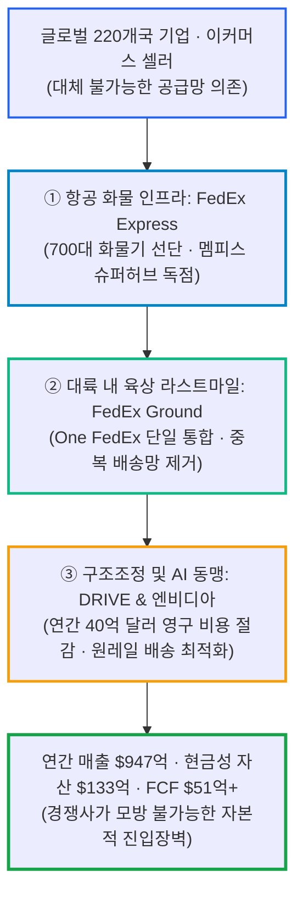
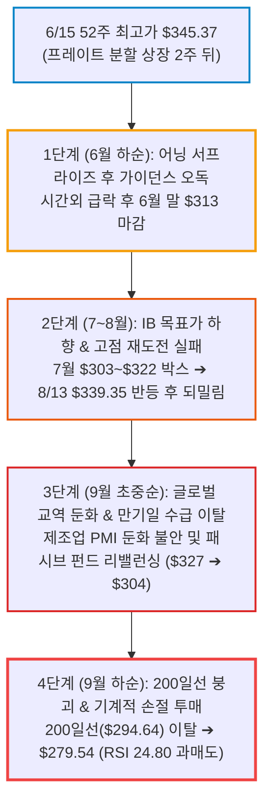
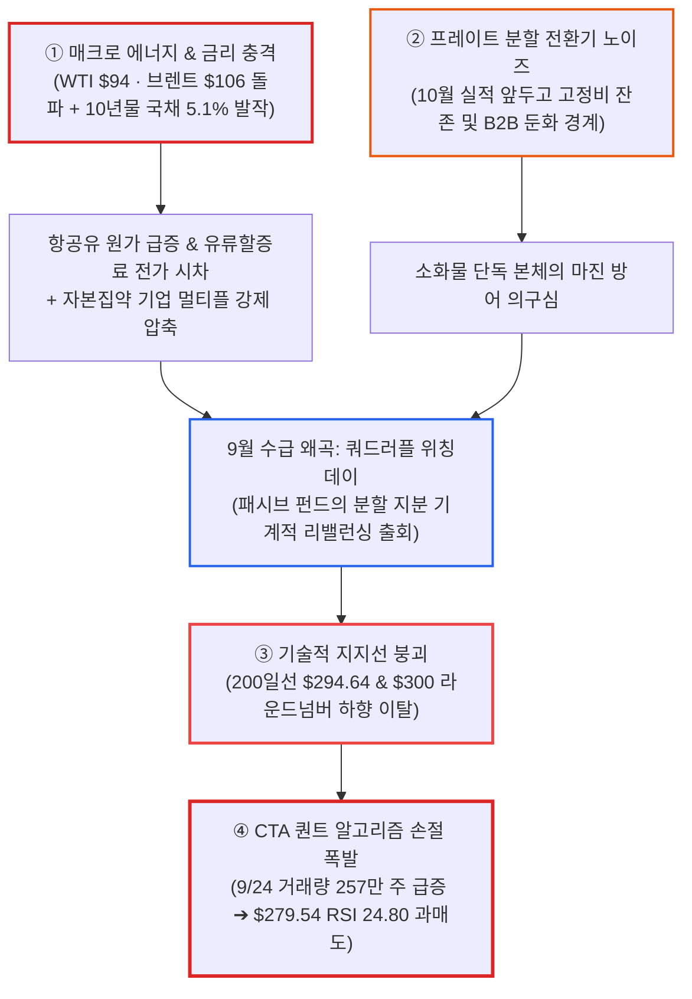
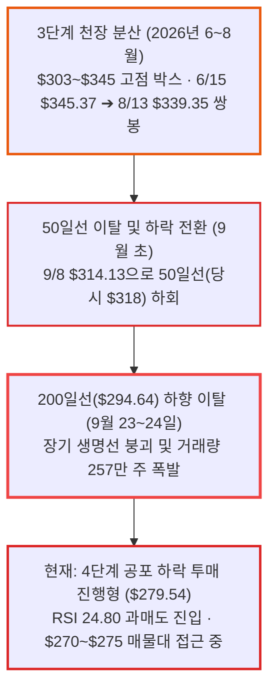

# 페덱스(FDX) 실전 재무 및 가치 분석 보고서

- **작성일**: 2026-09-25
- **데이터 기준**: 2026 회계연도 4분기 실적(2026-06-23 발표), 2026-06-01 페덱스 프레이트(FDXF) 인적분할 및 본사 41억 달러 특별 현금 배당 수령, 2027년 회계연도 역년(12월 결산) 전환 가이던스, 엔비디아·원레일 AI 물류 제휴, yfinance 시장 데이터 (2026-09-24 미국장 마감 기준)

대중이 회계연도 역년 전환에 따른 가이던스 오독과 단기 분할 잔존 비용 노이즈에 겁을 집어먹고 물량을 집어던질 때, 페덱스는 220개국 하늘과 땅을 촘촘히 엮은 대체 불가능한 항공·지상 물류 혈관망을 바탕으로 연간 51억 달러의 잉여현금흐름(FCF)과 133억 달러의 막대한 현금성 자산을 금고에 채워 넣었다. 프레이트 부문 분할에 따른 목표주가 기계적 조정과 9월 기관 수급 이탈 여파로 주가가 52주 최고가($345.37) 대비 -19% 급락하며 장기 생명선인 200일선($294.64)을 깨고 내려와 RSI 24.80의 과매도 구간에 진입했다.

## 핵심 요약

| 구분 | 핵심 요약 |
| :--- | :--- |
| **종목 및 주가** | 페덱스 (NYSE: `FDX`) / **$279.54** (52주 범위 $180.99 ~ $345.37) |
| **최종 투자의견** | **적극적 관망 후 조건부 분할 매수 (Wait & Buy on Dip)** / 200일선 이탈 후 $270~$275 바닥 지지 및 수급 진정 확인 시 (투자 가치 점수 **78.0점**, 6.1절) |
| **비즈니스 본질** | 700대 화물기 선단과 220개국 통관 허브를 장악한 글로벌 특송 독점망 + DRIVE 40억 달러 영구 비용 절감 체질 개선 |
| **핵심 매력 (Bull)** | Q4 어닝 서프라이즈(조정 EPS $6.31), 프레이트 분할 배당 41억 달러 유입으로 현금 133억 달러 확보, FCF 51.2억 달러(+71.6%), 선행 PER **13.4배** 저평가 |
| **최근 주가 급락의 5대 복합 원인** | ① 국제유가 $100 돌파(제트유 원가 급등 및 유류할증료 전가 시차), ② 미 국채 10년물 5.1% 돌파 할인율 충격, ③ 9월 만기일 패시브 펀드 분할 리밸런싱, ④ 200일선($294.64) 이탈에 따른 CTA 퀀트 손절 폭발, ⑤ 프레이트 분사 후 전환기 실적 경계감 (2.4절) |
| **핵심 리스크 (Bear)** | 200일선 이탈 후 거래량 동반 하락 진행, 고유가에 따른 연료비 마진 래그, 분사 후 첫 실적(10월)의 소화물 단독 마진 검증, 베타 1.36의 높은 변동성 |
| **포트폴리오 성격** | 과매도 국면에서 안전마진을 확보하고 경기 회복기 마진 레버리지를 회수할 **중기 가치회귀 스윙 자산(베타 1.36)** / **단기 테마 폭등 투기꾼은 매수 절대 금지** |

---

## 1. 비즈니스 실체: 대중이 모르는 기업의 '목줄'과 글로벌 물류 혈관 독점망

페덱스(FedEx Corporation)를 단순히 '노란색·보라색 트럭을 몰고 다니며 골목길 택배 상자나 나르는 운송 회사' 정도로 치부하는 자는 글로벌 실물 자본주의의 작동 원리를 전혀 모르는 자다. 이 기업의 본질은 **국경과 대륙을 넘어 전 세계 수백만 개 기업의 공급망(Supply Chain)과 무역 혈관의 통행세를 걷어 들이는 거대 물류 인프라 독점 카르텔이다**.

페덱스는 항공 특송(Express), 지상 배송(Ground), 그리고 2026년 6월 성공적으로 독립 분할을 완료한 화물(Freight) 부문까지, 어느 신규 진입자도 넘볼 수 없는 3대 물류 장벽을 구축했다.

### 1.1 돈 버는 구조: 하늘과 땅을 묶은 초격차 인프라의 위력

- **① 전 세계 최대 규모 민간 화물 항공 선단 (FedEx Express)**:
    - 700대 이상의 전용 화물기와 테네시주 멤피스 슈퍼허브(Memphis Superhub)를 중심으로 전 세계 220개국을 24~48시간 이내에 연결한다.
    - 반도체 장비, 바이오 의약품, 긴급 전자부품, 정밀 기계 등 '시간이 곧 돈'인 고부가가치 화물의 국제 이동은 페덱스의 날개가 없으면 전 세계 공장이 즉각 멈춰 선다. 4분기 기준 익스프레스 부문 매출만 **215억 7,000만 달러(+14% YoY)를** 기록했다.
- **② 미국 및 글로벌 육상 도어투도어 네트워크 (FedEx Ground)**:
    - 수천 개에 달하는 지상 물류 분류 센터와 수만 대의 배송 차량이 북미 전역의 가구와 기업을 거미줄처럼 연결한다.
    - 아마존(Amazon)조차 제3자 판매자(3P)의 고난도 장거리 배송이나 엔터프라이즈 화물에서는 페덱스의 물류망을 대체하지 못한다.
- **③ One FedEx 및 DRIVE 구조조정의 마진 폭발력**:
    - 과거 별도 법인으로 비효율적으로 분리되어 있던 Express와 Ground를 단일 법인(Federal Express Corporation)으로 통합하는 'One FedEx' 조직 개편을 단행했다.
    - 트럭 두 대가 같은 동네를 돌던 중복 배송 라우트를 전면 통합하고 자동화 설비를 확충하여, 연간 40억 달러 이상의 고정비를 영구적으로 깎아내는 DRIVE 프로젝트를 성공적으로 안착시켰다.

### 1.2 왜 빅테크도, 신생 스타트업도 페덱스의 성벽을 넘지 못하는가?

대중과 테크 맹신자들은 "소프트웨어 플랫폼이나 자율주행 드론이 물류 시장을 혁신할 것"이라고 떠들어댄다. 하지만 현실의 물류는 스크린 속 코드가 아니라 거대한 강철과 콘크리트의 물리적 요새다.

- **모방 불가능한 항공 인프라와 공항 이착륙 권리(Slot)**:
    - 전 세계 주요 국제공항의 야간 화물기 이착륙 슬롯과 거대 화물 터미널은 돈이 아무리 많아도 단기간에 확보할 수 없는 유한 자원이다. 수십 년간 국가별 정부 및 항공 당국과 체결한 운수권과 통관 라이선스는 후발 주자의 진입을 원천 차단한다.
- **글로벌 관세 및 복합 통관 노하우**:
    - 220개국의 서로 다른 복잡한 관세법, 검역 절차, 수출입 규제를 실시간으로 통과시키는 페덱스의 전산망과 현지 통관 전문 인력은 소프트웨어 따위로 하루아침에 대체할 수 없는 보이지 않는 해자다.

### 1.3 2026년 AI 물류 혁신과 온디맨드 리테일 생태계 확장

페덱스는 전통적인 운송 인프라에 안주하지 않고, 빅테크와의 전방위 협력을 통해 라스트마일 마진을 극대화하고 있다.

- **엔비디아(NVDA)·원레일(OneRail)과 연계한 당일배송 AI 플랫폼 '옴니스타(OmniStar)'**:
    - 2026년 9월, 라스트마일 배송 플랫폼 원레일은 엔비디아와 3년간 공동 개발한 AI 엔진 '옴니스타'를 공식 출시했다.
    - 기존에 20분 이상 소요되던 복잡한 배송 경로 결정 시간을 **2분 30초로** 단축시켰으며, 페덱스는 원레일과의 전략적 파트너십을 통해 당일배송 네트워크의 원가를 획기적으로 낮추고 있다.
- **우버(Uber)와의 미국 전역 온디맨드 리테일 배송 제휴**:
    - 2026년 6월 말부터 우버이츠, 우버, 포스트메이츠 앱을 통해 미국 소비자들이 **페덱스 오피스(FedEx Office)의** 프린팅 및 배송 사무용품을 실시간 온디맨드로 주문·수령할 수 있는 옴니채널 유통망을 개설했다.
- **차세대 AI 데이터센터 스위치(Switch)와의 엔터프라이즈 인프라 협력**:
    - 800억 달러 기업가치로 IPO를 추진 중인 미국 최대 데이터센터 운영사 스위치의 주요 고객사로 엔비디아, 델과 함께 페덱스가 포진해 있다. 페덱스는 자체 물류 데이터 플랫폼(FedEx Dataworks)의 연산 인프라를 스위치 데이터센터에 안착시켜 실시간 화물 추적과 라우팅 머신러닝 모델을 구동하고 있다.

---

## 2. 최근 실적과 시장의 오독: 대중의 착시 vs 숫자의 팩트

### 2.1 2026 회계연도 4분기 및 연간 확정 실적 대차대조

2026년 6월 23일 발표된 페덱스의 2026 회계연도 4분기(FY26 Q4, 2026-05-31 마감) 및 연간 확정 실적은 시장의 비관론을 박살 내는 강력한 어닝 서프라이즈를 기록했다.

| 재무 지표 | FY25 Q4 | FY26 Q3 | FY26 Q4 | 전년 동기 대비(YoY) | 판정 및 분석 |
| :--- | ---: | ---: | ---: | ---: | :--- |
| **총매출(Revenue)** | $22.22B | $24.00B | **$25.01B** | **+12.54%** | 분기 매출 250억 달러 돌파 (시장 컨센서스 9.7억 달러 상회) |
| **익스프레스 부문 매출** | $18.92B | $20.10B | **$21.57B** | **+14.01%** | 항공 화물 운임 상승 및 고부가가치 특송 물량 회복 |
| **프레이트(화물) 부문 매출** | $2.30B | $2.35B | **$2.41B** | **+4.78%** | LTL 화물 사업부를 포함한 마지막 분기 실적 |
| **영업이익** | $1.94B | $1.62B | **$2.09B** | **+7.85%** | DRIVE 비용 절감 효과로 분기 영업이익 20억 달러 돌파 |
| **당기순이익(Net Income)** | $1.65B | $1.05B | **$1.60B** | **-3.10%** | 분할 일회성 비용 반영에도 탄탄한 본업 순익 유지 |
| **조정 희석 EPS** | $6.07 | $5.25 | **$6.31** | **+3.95%** | **컨센서스($5.92)를 $0.39(+6.5%) 상회한 어닝 서프라이즈** |
| **분기 말 현금성 자산** | $5.50B | $6.17B | **$13.31B** | **+141.98%** | **프레이트 분사 특별 배당금($41억) 유입으로 133억 달러 폭증** |
| **연간 총매출 (Full Year)** | $87.93B | — | **$94.72B** | **+7.73%** | 연간 매출 947억 달러로 완연한 실적 턴어라운드 |
| **연간 잉여현금흐름(FCF)** | $2.98B | — | **$5.12B** | **+71.62%** | **CapEx 효율화(-6.1%)와 본업 현금으로 FCF 51억 달러 폭증** |

출처: yfinance 공시 재무제표 및 FedEx Corp FY2026 연간/4분기 실적 공시.

### 2.2 대중의 착시 vs 실제로 봐야 할 팩트

| 시장이 보고 놀란 것 (착시) | 데이터가 말해주는 진실 (팩트) |
| :--- | :--- |
| **가이던스 쇼크로 주가가 시간외 6.5% 폭락했다** | 6월 23일 시간외 급락은 회계연도 기준 변경에 따른 **시장 참여자들의 비교 기준 혼선이 부른 전형적인 촌극이다**. 페덱스는 2027년부터 회계연도 결산을 기존 5월 말에서 12월 말(역년 기준, Calendar Year)로 전환한다고 발표했다. 이에 따라 제시된 'CY26 가이던스(조정 EPS $16.90~$18.10)'가 기존 5월 결산 기준 FY27 컨센서스($18.90)와 단순 비교되면서 초기 오독이 발생했다. BofA와 UBS가 지적했듯, 새로운 기준은 6~12월 전환기에 계절적 성수기와 인센티브 부담 완화로 실질적인 EBIT 창출력이 한층 강화되는 구조다. |
| **프레이트(Freight)가 분할되어 알짜 사업을 뺏겼다** | 6월 1일 뉴욕증권거래소에 독립 상장된 페덱스 프레이트(FDXF)는 분사 과정에서 **페덱스 본사에 무려 약 41억 달러(약 5.6조 원)의 특별 현금 배당금을 지급**했다. 이 덕분에 페덱스 본사의 현금성 자산은 1년 전 55억 달러에서 **133억 달러로** 2.4배 수직 상승했다. 알짜 사업을 뺏긴 것이 아니라, 5조 6천억 원의 순현금을 금고에 확보하고 본체는 소화물(Parcel) 운송에 모든 자본을 집중해 마진을 끌어올리는 완벽한 가치 극대화다. |
| **월가 주요 IB들이 목표주가를 일제히 깎아내렸다** | 트루이스트($425➔$365), UBS($445➔$350), 레이먼드제임스($415➔$330), 스티펠($442➔$326) 등 주요 IB들의 목표가 하향은 기업 펀더멘털 악화 때문이 아니다. 시가총액 수백억 달러 규모의 프레이트 사업부가 독립 상장사(FDXF)로 분리되어 나갔으므로, 분할된 자산 가치만큼 목표주가 모델에서 기계적으로 덜어낸 '자산 구조 변경 반영'에 불과하다. **중요한 것은 이 모든 IB가 투자의견을 '매수(Buy/Outperform)'로 일관되게 유지하고 있다는 점이다.** |
| **분할 후 잔존 고정비(Stranded Costs)로 본사 마진이 훼손된다** | 분할 초기 일부 본사 공통 관리비가 남을 수 있으나, DRIVE 프로젝트를 통해 연간 40억 달러 이상의 영구적 구조조정이 진행 중이며, 39억 달러 수준의 절제된 연간 CapEx와 자사주 매입으로 상쇄하고도 남는다. |

### 2.3 6월 고점($345.37)부터 9월 200일선 이탈($279.54)까지: 4단계 하락의 전모 해부

페덱스는 2026년 6월 1일 프레이트 분할 완료 2주 뒤인 6월 15일 장중 52주 최고가 **$345.37을** 기록했다. 이후 6~8월 $303~$345의 고점 박스권을 오가다 9월에 무너지며 9월 24일 종가 $279.54까지 **-19.06%의** 날카로운 조정을 받았다. 이 하락 파동은 분할 직후의 가이던스 오독부터 IB 목표가 조정 노이즈, 매크로 공포, 그리고 9월 200일선 붕괴에 이르는 4단계 연쇄 충격으로 전개되었다.

- **① 1단계 (6월 하순): Q4 어닝 서프라이즈 후 'CY26 가이던스 오독'과 시간외 급락 ($345 ➔ $313)**:
    - 4분기 실적은 매출 250.1억 달러, 조정 EPS $6.31로 시장 컨센서스를 여유 있게 따돌렸다.
    - 그러나 회계연도를 12월 결산으로 전환하면서 제시한 CY26 가이던스($16.90~$18.10)를 월가가 기존 FY27 추정치($18.90)와 기계적으로 비교하면서 '가이던스 미달'로 오인했고, 주가는 6월 23일 장 마감 후 시간외 거래에서 6%대 급락했다.
    - 다음 날인 6월 24일 정규장에서는 596만 주의 대량 거래 속에 장중 $306.05까지 밀렸다가 $316.83(-0.13%)으로 마감하며 시간외 낙폭을 대부분 되돌렸다. 오독이었다는 증거다. 다만 주가는 6월 30일 $313.13으로 밀리며 50일선 아래로 내려갔다.
- **② 2단계 (7~8월): 프레이트 분사 반영 IB 목표가 컷과 고점 재도전 실패 ($303~$322 박스 ➔ $339 반등 실패)**:
    - 트루이스트, UBS, 스티펠, 레이먼드제임스 등 주요 하우스들이 프레이트 분사 자산을 제외하고 목표주가를 $326~$365선으로 기계적 하향 조정했다.
    - 이를 대중이 "실적 악화에 따른 목표가 강등"으로 오독하고 분할 잔존 고정비 우려가 부각되면서, 주가는 7월 내내 $303~$322 박스에 갇혔다.
    - 8월에는 저가 매수세가 들어오며 8월 13일 $339.35(장중 8월 14일 $341.69)까지 반등했지만 6월 고점($345.37)을 넘지 못하고 8월 말 $327.40으로 되밀렸다. 고점을 낮추는 쌍봉이 완성된 것이다.
- **③ 3단계 (9월 초중순): 매크로 교역 둔화 불안과 쿼드러플 위칭데이 기관 리밸런싱 ($327 ➔ $304)**:
    - 글로벌 제조업 PMI 둔화와 교역량 정체 우려가 겹치며 운송주 전반에 하방 압력이 가해졌다.
    - 9월 18일 선물옵션 동시만기일을 앞두고 대형 패시브 펀드들이 분할 완료된 프레이트와 페덱스 본체의 비중을 조정하는 과정에서 기계적 대량 매도가 쏟아지며 주가가 $303.65로 $300선 턱밑까지 밀려났다.
- **④ 4단계 (9월 21~24일): 200일선 붕괴와 거래량을 동반한 기계적 손절 투매 ($304 ➔ $279.54)**:
    - 9월 21일 $295.79로 $300선을 내준 주가는 9월 22일 $295.90으로 버텼으나, 9월 23일 $291.50으로 밀리며 장기 생명선인 200일선($294.64)을 깨뜨렸다.
    - 9월 24일에는 3개월 평균 거래량(약 165만 주)의 1.6배인 **257만 주의** 대량 거래가 터지며 주가가 하루 -4.10% 급락한 **$279.54까지** 주저앉았다.
    - 지지선 붕괴에 따른 퀀트 알고리즘의 손절매가 쏟아진 결과, 14일 RSI는 **24.80으로** 과매도 영역에 진입했다.

### 2.4 최근 9월 주가 급락($325 ➔ $279.54)의 5대 복합 원인 심층 해부

9월 1일 $324.88이던 주가가 불과 3주 만에 **$279.54까지 약 -14% 수직 낙하하며 200일선($294.64)을 깨뜨린 진짜 이유는 무엇인가?** 대중은 단순한 '실적 부진'이나 '경기 침체'라는 막연한 단어로 퉁치려 하지만, 데이터가 증명하는 실체는 **매크로 에너지 충격, 채권 금리 발작, 지수 리밸런싱, 그리고 퀀트 알고리즘의 손절매가 한 지점에 집중된 5대 복합 연쇄 폭발이다**.

- **① 국제유가 폭등(WTI $94 · 브렌트 $106)에 따른 '마진 래그(Margin Lag)' 충격**:
    - 700대의 화물 항공기(FedEx Express)와 수만 대의 육상 배송 차량을 굴리는 페덱스에게 제트유(항공유)와 디젤 연료비는 전체 영업비용의 10% 이상을 차지하는 최대 변동비 항목이다.
    - 9월 들어 중동 지정학 위기와 호르무즈 해협 긴장으로 국제유가가 배럴당 100달러를 돌파했다. 운송사는 화주에게 유류할증료(Fuel Surcharge)를 부과하지만, 이는 통상 2~3개월의 시차를 두고 요율에 반영된다. 유가가 단기에 수직 상승하는 구간에서는 **연료비 지출은 즉각 폭증하는 반면 할증료 수취는 지연되는 '마진 래그(Margin Lag)' 현상이** 발생하여 단기 분기 영업이익률을 갉아먹는다. 시장은 이 원가 부담을 주가에 즉각 선반영했다.
- **② 미국 10년물 국채금리 5.1% 돌파와 자본비용(WACC) 급등**:
    - 미국 10년물 국채금리가 9월 23일 **5.11%**, 9월 24일 **5.16%로** 마감하며 5%를 확실히 넘어섰고, 30년물도 9월 24일 **5.46%에** 달하는 등 20여 년 만의 채권 금리 폭등이 터져 나왔다.
    - 페덱스는 항공기 리스와 물류 터미널 인프라를 유지하기 위해 총부채(Total Debt) **429억 달러를** 짊어지고 있는 자본 집약적 대기업이다. 무위험 할인율이 5%를 넘어서자 기관 투자자들은 미래 현금흐름의 현재가치를 할인하며 전통 산업재 기업들의 주가수익비율(PER) 멀티플을 강제로 압축(De-rating)시켰다.
- **③ 9월 18일 쿼드러플 위칭데이(동시만기일) 패시브 자금의 분할 리밸런싱 매물**:
    - 지난 6월 1일 성공적으로 독립 상장된 페덱스 프레이트(FDXF)와 본체 페덱스(FDX)의 지수 편입 비중 조정이 9월 셋째 주 선물옵션 동시만기일을 기점으로 대규모로 집행되었다.
    - S&P 500 및 대형 인덱스 펀드, 패시브 ETF들이 분할된 두 기업의 포트폴리오 비중을 재조정하는 과정에서 9월 18일 하루에만 **303만 주의** 대량 매도 거래가 터졌고, 수급 충격의 여진이 9월 하순까지 이어졌다.
- **④ 200일선($294.64) 및 $300 라운드넘버 붕괴에 따른 CTA 퀀트 알고리즘 손절 폭발**:
    - 9월 21일 $295.79로 $300 라운드넘버 지지선이 무너진 데 이어, 9월 22일 보합($295.90)을 거쳐 9월 23일 $291.50으로 장기 생명선인 **200일 이동평균선($294.64)마저** 하향 이탈했다.
    - 기술적 지지선 붕괴를 감지한 월가 트렌드 추종(CTA) 및 퀀트 펀드의 알고리즘 손절 매도 트리거가 연쇄적으로 발동되었다. 그 결과 9월 24일 하루에만 3개월 평균의 1.6배인 **257만 주의** 대량 거래량을 동반한 기계적 투매가 터지며 주가가 **$279.54까지** 밀려났다.
- **⑤ 10월 실적 시즌을 앞둔 프레이트 분사 후 첫 전환기 실적 경계감**:
    - 페덱스는 10월 중순 2027 회계연도 1분기(전환 분기) 실적 발표를 앞두고 있다.
    - 고마진 LTL(소량화물) 캐시카우였던 프레이트가 독립 법인으로 분리된 후 맞이하는 첫 온전한 실적 시즌인 만큼, 고유가와 글로벌 B2B 교역 둔화 속에서 소화물(Express + Ground) 본체만으로 시장의 눈높이를 맞출 수 있을지에 대한 기관들의 선제적 위험 회피(Risk-off) 매물이 출회되었다.

---

## 3. 경쟁 해자 및 피어 그룹 잔혹 비교

글로벌 및 북미 물류 시장을 장악한 주요 운송 대기업들의 밸류에이션과 재무 지표를 냉정하게 대조해 본다.

| 기업명 | 티커 | 현재가 | 시가총액 | 선행 PER | Trailing PER | P/B | P/S | 배당수익률 | 영업이익률 | ROE | 베타 |
| :--- | :---: | ---: | ---: | ---: | ---: | ---: | ---: | ---: | ---: | ---: | ---: |
| **페덱스** | **FDX** | **$279.54** | **$66.16B** | **13.40배** | **15.72배** | **2.12배** | **0.70배** | **1.67%** | **11.13%** | **14.85%** | **1.36** |
| **UPS** | UPS | $92.05 | $78.31B | 11.41배 | 17.84배 | 5.20배 | 0.87배 | 6.85% | 9.05% | 29.60% | 1.04 |
| **올드 도미니언** | ODFL | $174.93 | $36.38B | 26.30배 | 34.10배 | 7.98배 | 6.49배 | 0.65% | 28.84% | 24.82% | 1.17 |
| **XPO** | XPO | $176.12 | $20.62B | 27.18배 | 53.21배 | 10.51배 | 2.41배 | — | 12.31% | 21.59% | 1.70 |

출처: yfinance 시장 데이터 (2026-09-24 기준).

### 3.1 숫자가 폭로하는 진짜 격차: UPS vs 페덱스

- **영업이익률 방어력의 본질 (11.13% vs 9.05%)**:
    - 경쟁사 UPS는 '네트워크 오브 더 퓨처(Network of the Future)'를 가동하여 미국 내 물동량의 68%를 자동화 설비로 처리하고 처리 비용을 28% 낮추는 등 AI와 자동화에 천문학적 자본을 쏟아붓고 있다.
    - 그럼에도 불구하고 UPS의 영업이익률은 9.05%에 그치고 있다. 팀스터즈(Teamsters) 노조 협약에 따른 막대한 인건비 상승 압박을 자동화로도 완전히 상쇄하지 못하고 있기 때문이다.
    - 반면 페덱스는 비노조 지상 배송 네트워크와 One FedEx 통합, 엔비디아-원레일 옴니스타 제휴를 통해 **11.13%의** 영업이익률을 지켜냈다. 자본 집약도와 노무 리스크 관리 측면에서 페덱스가 한 수 위의 마진 방어력을 입증했다.
- **압도적인 밸류에이션 안전마진 (P/S 0.70배, P/B 2.12배)**:
    - ODFL과 XPO 같은 순수 LTL 운송 기업들은 26~27배의 높은 선행 PER과 6~10배가 넘는 극단적인 P/B 멀티플을 받고 있다.
    - 반면 페덱스는 연간 947억 달러의 매출을 올리면서도 P/S 멀티플이 고작 **0.70배**, P/B는 **2.12배에** 불과하다. 700대의 항공기, 수천 개의 허브 터미널, 133억 달러의 현금성 자산을 쥐고 있는 기업의 주가가 극도로 헐값에 방치되어 있다.
- **월가 주요 IB들의 진짜 속내: 목표주가 컷 뒤에 숨겨진 '전원 매수'**:
    - BofA(목표가 $378), 트루이스트($365), UBS($350), 레이먼드제임스($330), 스티펠($326) 등 주요 IB들의 평균 목표주가는 **약 $350** 선이다.
    - 프레이트 분사 자산을 덜어내고 재산정한 목표가의 평균(약 $350)은 현재 주가($279.54) 대비 **+25%의 상승 여력을** 가리킨다. 가장 낮은 스티펠($326)도 +17% 위에 있다. yfinance 컨센서스 평균 목표가는 $355.10이다.

---

## 4. 기술적 사이클 위치 (4단계 사이클 모델)

스탠 와인스타인의 4단계 사이클(1단계 매집 ➔ 2단계 상승 ➔ 3단계 과열·분산 ➔ 4단계 공포·하락) 모델을 적용하면, 현재 페덱스의 주가는 **'4단계 공포 하락 및 지지선 붕괴 국면'에** 위치해 있다.

### 냉혹한 차트 팩트 점검

- **장기 생명선(200일선)의 명백한 하향 이탈**:
    - 현재가($279.54)는 200일 이동평균선($294.64)보다 -5.12% 밑으로 주저앉았다.
    - 이를 두고 "200일선 지지력을 시험 중이다"라고 우기는 것은 자기기만이다. 9월 23일과 24일에 걸쳐 200일선은 **명백히 하향 이탈(Breakdown)되었다.**
- **거래량을 동반한 물량 정리**:
    - 9월 24일 하락일 거래량은 **257만 주로** 3개월 평균(약 165만 주)의 1.6배다. 이는 매도 압력이 소멸한 것이 아니라, 지지선 이탈을 확인한 기관들의 손절 및 물량 정리가 공격적으로 출회되었음을 뜻한다.
- **RSI 24.80의 과매도 시그널과 반등 조건**:
    - 14일 RSI가 24.80까지 내려오며 기술적 반등 압력이 극대화된 것은 사실이다. 그러나 과매도라는 이유만으로 하락 중인 주식을 사는 것은 떨어지는 칼날을 손으로 쥐는 바보짓이다.
    - 2026년 3월 저점($274.98)이 형성된 **$270 ~ $275** 구간에서 하락 거래량이 마르고, 확실한 반등 양봉 종가가 확인되기 전까지는 기술적으로 매수를 서두를 이유가 없다.

---

## 5. 밸류에이션 및 가격 타당성 검증

### 5.1 PER 및 FCF 수익률 분해

페덱스의 현재 주가($279.54)는 역사적 및 본질 가치 관점에서 명백한 저평가 영역에 진입했다.

- **선행 PER 13.40배**:
    - 페덱스의 지난 10년 역사적 평균 선행 PER은 14.5~16.0배 수준이다. 현재 13.40배는 경기 침체 시나리오를 상당 부분 선반영한 디스카운트 가격대다.
- **압도적인 잉여현금흐름(FCF) 수익률 7.73%**:
    - 연간 FCF 51억 1,600만 달러 대비 시가총액은 661억 6,000만 달러다.
    - 국채 10년물 금리를 훌륭하게 상회하는 7.7%의 FCF 수익률과 금고에 쌓인 133억 달러의 현금은 주가 하방을 받쳐줄 가장 강력한 재무적 완충판이다.
- **선행 EPS 기반 가치 회귀 목표가 계산**:
    - 현재 주가 $279.54에 선행 PER 13.4배를 역산하면 차기 12개월 선행 EPS는 약 **$20.86** 수준으로 추정된다.
    - DRIVE 구조조정이 본궤도에 오르고 분할 잔존비용 우려가 걷히며 역사적 평균 멀티플인 **15.0배**만 인정받아도 주가는 **$312.90으로** 회귀한다.
    - 정상 멀티플 상단인 **16.0배를** 적용할 경우 목표 주가는 **$333.76에** 달한다. 즉, 하방 리스크 대비 상방으로 +12% ~ +20% 이상의 가치 회귀 룸이 열려 있다.

---

## 6. 종합 평가 및 냉혹한 계좌 실행 원칙

### 6.1 6대 핵심 투자 지표 다차원 평가 매트릭스

| 평가 영역 | 가중치 | 평점 (100점 만점) | 가중 점수 | 등급 | 핵심 평가 요약 |
| :--- | :---: | :---: | :---: | :---: | :--- |
| **① 비즈니스 모델 및 해자** | 25% | **85점** | 21.25 | `A` | 700대 화물기 선단, 220개국 물류망, 엔비디아-원레일 AI 물류 동맹 |
| **② 실적 성장성 및 가이던스** | 25% | **75점** | 18.75 | `B` | Q4 어닝 서프라이즈 달성했으나 회계연도 역년 전환기 가이던스 혼선 |
| **③ 재무 건전성 및 현금흐름** | 20% | **85점** | 17.00 | `A` | 프레이트 분사 배당 41억 달러 유입 ➔ 현금 133억 달러, FCF 51.2억 달러 |
| **④ 밸류에이션 매력도** | 15% | **80점** | 12.00 | `A-` | 선행 PER 13.4배, FCF 수익률 7.73%, P/S 0.70배의 안전마진 |
| **⑤ 기술적 매매 타이밍** | 10% | **50점** | 5.00 | `D` | 200일선($294.64) 이탈 및 4단계 공포 하락 투매 진행 중 |
| **⑥ 리스크 관리 가능성** | 5% | **80점** | 4.00 | `A-` | 직전 매물대 바닥($270) 지지선 및 $260 손절선 기준 명확 |
| **종합 가중치 환산 점수** | **100%** | — | **78.0점** | **`Hold & Buy on Dip`** | **펀더멘털은 견고하나 기술적 하락 멈춤 확인 후 분할 매수** |

### 6.2 실전 결론: "그래서 지금 어쩌라는 것인가?" (Action Verdict)

#### ① 지금 당장 사야 하는가? ➔ **"아니다. 지금 당장 손가락 얹지 마라."**
- **이유**: 주가가 200일 이동평균선($294.64)을 거래량을 싣고 깨고 내려왔다. RSI가 24.80으로 과매도라 한들, 지지선이 무너진 직후에는 추가 투매가 얼마든지 이어질 수 있다. 떨어지는 칼날을 맨손으로 잡는 것은 초보들이나 하는 짓이다. 선발대 진입 조건 네 가지로 대조하면 다음과 같다.

| 선발대 진입 조건 | 9월 24일 종가 기준 데이터 | 판정 |
| :--- | :--- | :---: |
| **지지선 부근에서 종가 유지** | 200일선($294.64)은 9월 23일 종가로 이탈했다. 다음 지지 후보인 3월 저점 매물대($270~$275)까지는 아직 $4.5~$9.5 남아 있다 | **미충족** |
| **하락이 멈춘 신호** | 9월 24일 거래량 257만 주(3개월 평균의 1.6배)로 하락일 거래량이 오히려 늘었다. RSI 24.80이지만 반등 종가 미출현 | **미충족** |
| **하락 원인이 펀더멘털 밖** | 유가·금리·지수 리밸런싱·기술적 손절이 주원인이다. 단, 분사 후 첫 실적(10월)은 아직 검증 전이다 | **충족** |
| **손익비 2:1 이상** | 현재가 기준 1차 목표가 $315(+12.69%) 대 손절선 $260(-6.99%)은 1.82 대 1로 기준 미달. 진입 구간($270~$275)까지 내려오면 3.40 대 1로 충족 | **현재가 미충족** |

- **지금 할 일**: 관심종목에 올려두고, $270 ~ $275 매물대 부근에서 거래량이 급감하며 하락이 멈추고 반등 양봉 종가가 출현하는지 지켜보는 **'적극적 관망(Wait & Watch)'이다**.

#### ② 이런 주식은 누가 사고, 누가 절대 사면 안 되는가?
- **❌ 절대 사지 마라 (즉시 퇴장)**: AI 반도체처럼 1~2달 만에 50~100% 폭등할 종목을 찾는 투기꾼, 배당수익률 5% 이상의 고배당 현금흐름을 당장 원하는 은퇴 생활자, 지지선 이탈에도 손절하지 못하고 물타기만 반복하는 미련한 자.
- **⭕ 반드시 눈독 들이고 주워 담아야 할 사람 (스나이퍼 대기)**: 회계연도 전환 촌극과 일시적 분할 비용 노이즈로 밸류에이션이 바닥까지 찌그러진 우량 인프라 기업을 $270~$275 매물대에서 매집하여, 1차 목표가($315, 진입가 대비 +16%)와 2차 목표가($340, +25%)까지의 가치회귀 차익을 노리는 가치투자자.

#### ③ 이 주식으로 '인생 역전(대박)'을 바라면 안 되는 냉혹한 이유
- 페덱스는 연간 매출이 947억 달러에 달하는 초대형 인프라 공룡이다. 연간 매출 성장률은 5~8% 안팎으로 완만하며, 폭발적인 고성장을 구가하는 소프트웨어 기업이 아니다. 베타 1.36의 경기민감주라 계좌 하방을 지켜주는 수비수도 아니다. 이 주식의 진정한 쓸모는 4단계 과매도 국면에서 진입해 밸류에이션 정상화 파동을 취하는 '포트폴리오 미드필더'에 있다.

### 6.3 실전 가격대별 실행 시나리오 및 분할 매수 로드맵

| 구분 | 실행 조건 | 배정 비중 | 가격 기준 | 대응 방침 |
| :--- | :--- | :---: | :---: | :--- |
| **1차 진입 (선발대)** | $270~$275 매물대 지지 안착 + 거래량 감소 동반 반등 양봉 종가 확인 (RSI 30 탈출 시) | 30% | $270 ~ $275 | 하락 멈춤 신호 확인 후 첫 진입 |
| **2차 매수 (주력)** | 200일선($294.64) 종가 탈환 및 지지 안착 확인 시 | 35% | $290 ~ $295 | 중기 추세 복원 확인 후 핵심 비중 확대 |
| **3차 매수 (추세 추종)** | 200일선 위 $300 라운드넘버 회복 및 10월 분기 실적 호조 확인 시 | 25% | $300 ~ $305 돌파 시 | 추세 복원 확인 후 비중 완성. 1차 목표가($315)부터는 분할 익절 구간 |
| **예비 현금** | 매크로 침체 발작 및 변동성 대비 현금 버퍼 | 10% | — | 진입 조건 충족 전까지 현금 보존 |
| **손절 기준선** | 직전 장기 매물대 지지선 완전 붕괴 시 | — | **$260.00 종가 이탈 시** | **미련 없이 전량 손절 (1차 진입가 $272.50 기준 -4.59%)** |

- **목표 가격대**:
    - **1차 목표가**: **$315.00** (50일선 $315.92 저항대, 현재가 대비 **+12.69%**, 1차 진입가 $272.50 대비 **+15.60%**)
    - **2차 목표가**: **$340.00** (8월 고점 $339.35 및 IB 평균 목표가 $350 하단, 현재가 대비 **+21.63%**, 1차 진입가 대비 **+24.77%**)
- **손익비(Risk/Reward)**: 1차 진입 구간 중간값($272.50) 기준으로 손절가($260)까지 -4.59%, 1차 목표가까지 +15.60%다. 손익비는 **3.40 대 1로** 기준(2:1)을 넘는다. 반면 지금 가격($279.54)에서 사면 1.82 대 1로 기준에 못 미친다. 매물대까지 기다려야 하는 숫자상의 이유다.

!!! tip "최종 핵심 제언 (Executive Takeaway)"
    대중이 가이던스 오독과 200일선 붕괴 헤드라인에 질려 비명을 지르며 물량을 던질 때가 언제나 최고의 기회였다. 그러나 지금은 칼날이 바닥에 꽂히기도 전에 손을 뻗을 때가 아니다. $270 ~ $275 매물대에서 매도 거래량이 완전히 마르고 첫 반등 양봉이 서는 것을 확인한 뒤, 차분하게 선발대부터 쏘아 올려라. 시장의 오독을 비웃으며 숫자가 증명하는 133억 달러의 현금과 51억 달러의 잉여현금흐름에 베팅하는 자만이 다음 파동의 과실을 독식한다.
