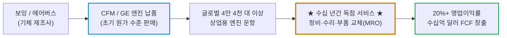
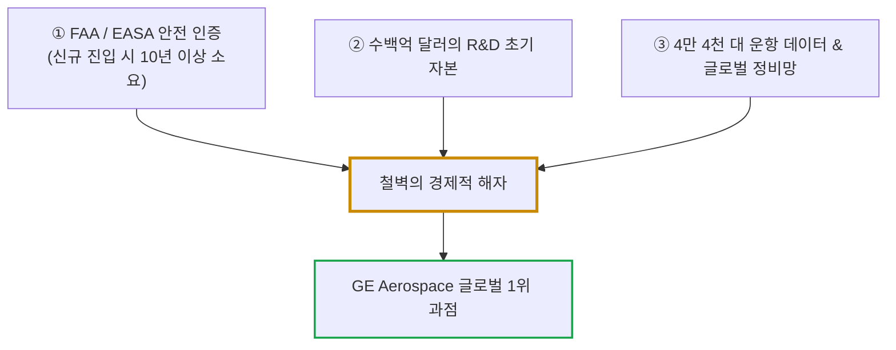
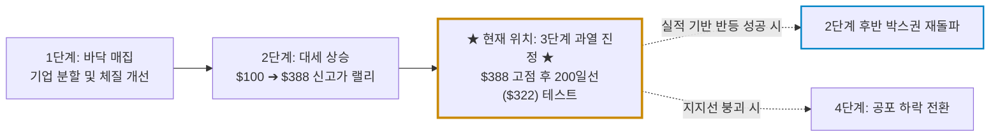

# GE 에어로스페이스(GE Aerospace / GE) 실전 재무 및 독점 가치 분석 보고서

- **작성일**: 2026-09-16
- **데이터 기준**: 2026년 2분기 실적(2026-06-30 마감, 7월 공시), 연간 가이던스 상향안, 최근 3개월 핵심 뉴스(2026.06~09) 및 yfinance 시장 데이터(2026-09-15 미국장 마감 기준)

대중은 제너럴 일렉트릭의 과거 몰락과 잡탕 복합기업의 악몽만 기억하지만, 군살을 전부 도려내고 홀로 선 GE 에어로스페이스는 전 세계 하늘을 나는 민항기 제트 엔진의 목줄을 쥐고 2,100억 달러(280조 원)의 통행세를 걷는 독점 제국이다. 분기 실적 서프라이즈와 가이던스 상향에도 불구하고 117.5억 달러(약 16조 원) 규모의 CPP 인수 충격과 공급망 병목 노이즈로 52주 최고가($388.84) 대비 -21.0% 조정을 받아 200일선($322.11)을 밑돌고 있는 지금, 차가운 숫자와 실전 손익비로 비즈니스 실체를 해부한다.

## 핵심 요약

| 구분 | 핵심 요약 |
| :--- | :--- |
| **종목 및 주가** | GE 에어로스페이스 (NYSE: `GE`) / **$307.05** (52주 범위 $268.91 ~ $388.84, 고점 대비 **-21.0%**) |
| **최종 투자의견** | **조건부 분할 매수 (Buy on Dip)** / 200일선($322.11) 하회에 따른 단기 매물 소화 후 지지선 분할 진입 (투자 가치 점수 **86.8점**, 6.1절) |
| **비즈니스 본질** | 전 세계 민간 여객기 엔진 과점 및 2,100억 달러(280조 원+) 수주잔고 기반의 초고마진 애프터마켓(MRO/부품) 통행세 독점 |
| **핵심 매력 (Bull)** | Q2 잉여현금흐름(FCF) 28.6억 달러(YoY +49%), 상업용 서비스 매출 +27%, 연간 조정 EPS 가이드 $7.65~$7.85 상향, CFM LEAP 엔진 독점 |
| **핵심 리스크 (Bear)** | 117.5억 달러 CPP 대형 인수에 따른 단기 부채 증가 및 통합 리스크, 엔진 생산 공급망 병목, 200일선 이탈에 따른 기술적 변동성 |
| **포트폴리오 성격** | 글로벌 항공·방산 사이클을 지탱하는 **초우량 산업 코어주(베타 1.35)** / **단기 100% 폭등 노리는 투기꾼은 매수 금지** |

---

## 1. 비즈니스 실체: 대중이 모르는 기업의 '목줄'과 독점 빨대

대중은 GE라고 하면 여전히 백색가전이나 전구, 아니면 2008년 금융위기 때 파산 직전까지 몰렸던 GE캐피탈의 빚더미를 떠올린다. 과거의 실패한 유산에 갇힌 자들은 지금의 GE 에어로스페이스가 어떤 괴물로 재탄생했는지 전혀 알지 못한다.

GE는 헬스케어(GEHC)와 에너지(GEV)를 완전히 분사시켜 밖으로 던져버렸다. 남아있는 본체는 오직 하나, 하늘을 지배하는 **상업용 항공기 및 군용기 엔진 제조·서비스 순수 플레이어(Pure Play)다.**

### 1.1 엔진 판매는 미끼일 뿐, 진짜 돈줄은 30년짜리 애프터마켓 빨대다

하수들은 제트 엔진을 자동차처럼 "공장에서 조립해 팔고 마진을 남기는 장사"로 착각한다. 제트 엔진 비즈니스의 본질은 **프린터와 토너 카트리지 모델의 항공우주 극한 버전**이다.

- **미끼 상품(Engine Sale)**: 제트 엔진을 비행기 제작사(보잉, 에어버스)에 납품할 때는 연구개발비와 초기 제조원가 때문에 마진이 거의 남지 않거나 심지어 적자를 보기도 한다.
- **진짜 독점 빨대(Commercial Services)**: 비행기가 한번 하늘에 뜨면 20~30년 동안 전 세계를 누빈다. 항공기 엔진은 사람의 생명과 직결되는 극한의 부품이므로 수천 시간 운항마다 분해 검사(Shop Visit)를 받아야 하고, 마모된 블레이드와 터빈 부품은 제조사가 공인한 순정품으로만 교체해야 한다.
- **고마진 반복 매출(Recurring Revenue)**: 전사 매출의 70% 이상이 신규 엔진 판매가 아니라 **애프터마켓 서비스(MRO 정비 및 예비 부품)에서** 나온다. 2026년 2분기 상업용 엔진·서비스(CES) 부문 매출은 전사 조정 매출의 약 56%인 71.0억 달러였고, 이 가운데 서비스 매출이 전년 동기 대비 **+27%** 폭증하며 전사 조정 영업이익률 21.7%를 끌어올린 주역이 됐다. 고객 항공사는 비행기를 띄우는 한 GE에 통행세를 바치지 않고는 단 하루도 운항할 수 없다.

### 1.2 CFM 인터내셔널의 독점적 지배력: 협동체(Narrowbody) 시장의 절대자

프랑스 사프란(Safran)과 50:50으로 합작 설립한 **CFM 인터내셔널(CFM International)은** 전 세계 항공 산업 역사상 가장 성공적인 합작 법인이다.

- **LEAP 엔진의 독점**: 글로벌 항공 여행의 척추 역할을 하는 단일통로(Narrowbody) 여객기 시장에서, 보잉 737 MAX의 엔진은 CFM LEAP-1B가 **100% 독점** 공급한다. 에어버스 A320neo 패밀리에서도 프랫앤휘트니(P&W)의 결함 사태를 틈타 CFM LEAP-1A가 **60% 이상의 점유율**을 확고하게 틀어쥐고 있다.
- **2,100억 달러 백로그의 실체**: GE 에어로스페이스의 수주잔고(Backlog)는 **2,100억 달러(약 280조 원 이상)에** 달한다. 이는 회사가 공장을 100% 가동해도 수년간 소화하기 벅찬 물량이며, 향후 10년 이상의 매출 가시성을 콘크리트처럼 보장한다.

---

## 2. 최근 3개월 핵심 뉴스 및 실적 흐름 심층 분석 (2026년 6월 ~ 9월)

2026년 6월 중순부터 9월 중순까지 쏟아진 핵심 뉴스 흐름은 GE 에어로스페이스가 GE 분사 이후 **'초고마진 애프터마켓 독점과 수직계열화 M&A로 글로벌 항공 공급망 목줄을 틀어쥐는 최상위 포식자'로** 입지를 굳히는 과정과, 메가 M&A 소화에 따른 단기 주가 왜곡을 선명하게 증명한다.

### 2.1 최근 3개월 핵심 타임라인 (팩트 vs 노이즈)

| 일자 | 주요 뉴스 및 시장 이벤트 | 성격 | 스마트머니 관점의 핵심 분석 및 시사점 |
| :---: | :--- | :---: | :--- |
| **09.15** | **주가 $307.05 종가 마감(-3.31%), 200일선($322.11) 하향 이탈** | `🔴 기술적` | 최근 3개월 최대 거래량(726만 주)을 동반한 투매로 200일선을 완전히 내줌. CPP 인수 자금 조달 우려와 매크로 변동성이 겹친 단기 수급 왜곡 구간 |
| **09.14** | **버핏의 프리시전 캐스트파츠(PCC) 가치 1,000억$ 급등과 CPP 인수 배수(2027E EBITDA 26배) 재평가 (-1.88%)** | `🟢 가치 재평가` | GE 에어로스페이스의 CPP 117.5억 달러 인수 결정으로 피어 그룹인 버크셔의 PCC 가치가 인수 당시(372억$) 대비 약 2.7배인 1,000억 달러(약 134조 원)로 급등 추산. 가스터빈 및 항공 엔진 터빈 블레이드 등 초정밀 주조품의 극심한 공급난과 전략적 가치 입증 |
| **09.10** | **유가 100달러 돌파 및 국채금리 4.84% 급등에 따른 산업재 동반 약세 (-0.39%)** | `🟡 매크로 외풍` | 미-이란 긴장 고조로 브렌트유가 100달러를 돌파하고 국채금리가 급등하며 산업재 섹터 전반에 원가 부담 우려 확산. 전일 급락에 이어 -0.39% 추가 약세로 200일선 지지선 시험 |
| **09.09** | **짐 크레이머의 호재성 언급에도 매크로 외풍에 -2.83% 급락** | `🟡 시장 센티` | CNBC 매드머니 짐 크레이머, 데이터센터 테마 과열을 경계하고 GE 에어로스페이스를 핵심 대안주로 지목하며 117.5억 달러 CPP 인수가 공급망을 강화할 것이라 진단. 그러나 금리·유가 부담에 거래량 502만 주를 동반한 -2.83% 급락으로 응수 |
| **09.08** | **상업용·군용 엔진 정밀 주조사 CPP(Consolidated Precision Products) 117.5억 달러 전격 인수 합의 (-0.66%)** | `메가 M&A` | 사모펀드로부터 117.5억 달러(현금 70억$ + 신규 차입)에 전격 인수 합의. 20개 이상 시설과 6,600명 인력 확보로 엔진 주조품 공급망 통제력 극대화. 하우멧([HWM 분석 참고](howmet-aerospace.md)) 주가가 당일 -10.7% 급락한 배경이자, GE의 강력한 수직계열화 선언 |
| **08.20** | **상업용 항공기 공급망 병목 심화 공표 (-3.25%)** | `구조적 이슈` | 래리 컬프 CEO, "수요 부진이 아니라 생산 능력이 주문을 따라가지 못하는 것이 유일한 병목"이라고 단언. 2,100억 달러 백로그 소화를 위한 공급망 내재화 필요성 부각 |
| **08.14** | **미 7월 PPI 둔화에 따른 금리 하락으로 산업재 강세 (+2.15%)** | `🟢 매크로 안도` | 인플레이션 압력이 꺾이며 할인율 부담이 완화되자 산업재로 자금이 재유입. GE 에어로스페이스는 +2.15% 상승하며 실적 시즌 이후 낙폭을 상당 부분 되돌림 |
| **08.07** | **허니웰 에어로스페이스 실적 충격(-23%) 여파로 항공우주 섹터 동반 약세 (-1.19%)** | `🟡 피어 노이즈` | 허니웰 에어로스페이스(HONA)의 2분기 실적 부진 및 연간 가이던스 하향 폭락(-23%)으로 섹터 전반 투자심리 위축. GE도 개별 결함 없이 -1.19% 동반 하락에 그치며 상대적 강세 유지 |
| **08.05** | **미-이란 협상 기대 및 유가·금리 하락으로 산업재 전반 반등 (+1.04%)** | `🟢 매크로 안도` | 호르무즈 해협 상선 재개방 합의 기대감으로 인플레이션 우려 완화. 산업재 섹터 반등세 속 GE 에어로스페이스도 +1.04% 상승하며 $381.22로 52주 고점권에 재접근 |
| **08.04** | **미 FAA, 보잉 737 MAX 7 전격 승인에 CFM LEAP 독점 수혜 (+2.26%)** | `🟢 구조적 호재` | 연방항공청(FAA)이 수년간 지연되던 737 MAX 7을 최종 승인. 보잉 737 MAX 기종의 엔진을 100% 독점 공급하는 CFM LEAP-1B 제조사인 GE 에어로스페이스 역시 +2.26% 동반 상승하며 기체 인도 가속 기대감 반영 |
| **07.21** | **Q2 실적 후 월가 IB 목표가 줄상향 러시에도 주가는 -0.18% 보합** | `🟢 스마트머니` | 웰스파고($390), UBS($435), BofA($405), JP모건($400)이 일제히 목표가를 올렸으나 주가는 $340.70 보합권에 묶임. BofA는 "보수적 가이던스 속에 향후 10년간 두 자릿수 이익 성장 지속"이라며 $405 제시. UBS는 항공 운항량 감소에도 강력한 수주잔고와 장기 성장 전망을 근거로 $435 상향. 웰스파고($390)와 JP모건($400)도 애프터마켓 실적 기반 상향 일제 동참 |
| **07.16** | **★ 2026년 2분기 실적 서프라이즈 및 연간 가이던스 대폭 상향, 그러나 당일 주가 -4.06% 급락 ★** | `🟢 어닝 비트` | 조정 매출 126.3억 달러(YoY +23.5%, 컨센 +7.1억$), 조정 EPS $2.02(YoY +22%, 컨센 +$0.16) 대폭 상회. 총 수주 165억 달러(+17%), 상업용 서비스 매출 +27% 폭증. 연간 EPS 가이던스 $7.65~$7.85 및 FCF 89억~92억 달러로 전격 상향. 그럼에도 애프터마켓 피크아웃 논란과 차익실현 매물이 겹치며 당일 -4.06% 급락 |
| **07.02** | **사프란과 차세대 RISE 엔진 기술 개발 가속화 발표 (+0.69%)** | `🟢 R&D` | 연료 소비와 탄소 배출을 20% 이상 감축하는 오픈 팬(Open Fan) 구조의 차세대 엔진 아키텍처 실증 시험 성공 |
| **06.25** | **기술주 고평가 차익실현 속 산업재 반등 견인 (+1.50%)** | `🟢 섹터 로테이션` | AI 빅테크 고평가 부담으로 자금이 산업재로 유입되며 GE 에어로스페이스 +1.50% 상승, $370.90으로 마감 |

### 2.2 월가 IB의 실적 후 시각: 목표가 400달러대 줄상향과 '애프터마켓 피크아웃' 착시

2분기 호실적 발표 직후 월가 주요 투자은행(IB)들은 일제히 목표주가를 400달러 선 안팎으로 끌어올렸다. 그런데 주가는 실적 발표 당일인 7월 16일에 오히려 **-4.06% 급락했고**, 목표가 상향이 쏟아진 7월 21일에도 $340.70 보합(-0.18%)에 머물렀다. 이 기묘한 엇박자의 원인은 무엇인가?

| 투자은행(IB) | 투자의견 | 목표주가 변동 | 핵심 평가 및 스마트머니 시각 |
| :--- | :---: | :---: | :--- |
| **UBS** | **매수** | **$426 ➔ $435** | 4월 이후 글로벌 항공 운항량이 일시 둔화되었음에도 견조한 엔진 수요와 수주잔고 확장 지속 확인. 장기 성장 궤도 확고 |
| **BofA** | **매수** | **$365 ➔ $405** | 상향된 가이던스조차 회사의 보수적 성향을 반영한 수치. 향후 10년간 두 자릿수 이익 성장세를 지속할 업종 내 최선호 종목 |
| **JP모건** | **비중확대** | **$335 ➔ $400** | 실적 발표 직후 시장 수익률을 일시 하회했으나, 장기 수요 신뢰와 서비스 사업 성장 목표의 달성 가능성은 100% 유효 |
| **웰스파고** | **비중확대** | **$325 ➔ $390** | 애프터마켓의 높아진 실적 기반을 반영해 전망치 상향. 단, 향후 성장세 둔화 가능성은 밸류에이션 부담 요인으로 지적 |

- **시장의 오독 (애프터마켓 성장 둔화 공포)**: 웰스파고 등이 언급한 "애프터마켓 성장률 둔화 가능성"에 단기 투기 세력이 차익실현 명분을 붙이며 주가를 눌렀다.
- **숫자의 팩트 (보수적 가이던스와 10년 슈퍼사이클)**: BofA와 UBS가 지적했듯, 경영진의 가이던스 상향($7.65~$7.85)은 통상적인 보수적 추정치다. 중동 긴장으로 인한 브렌트유 100달러 돌파 환경에서도 항공사들의 엔진 부품 및 MRO 주문은 취소되기는커녕 전년비 +27% 폭증했다. 비행기가 뜨는 한 정비는 필수이며, 유가가 올라도 안전 규정상 엔진 오버홀 주기는 단 하루도 미룰 수 없다.

### 2.3 대중의 착시 vs 숫자의 진실

시장 참가자들은 뉴스의 표면만 보고 엉뚱한 결론을 내린다. 대중의 오독과 데이터가 말하는 진실을 가차 없이 대조한다.

| 시장이 보고 놀란 것 (착시) | 데이터가 말해주는 진실 (팩트) |
| :--- | :--- |
| **"CPP 인수 금액이 11억 달러 수준의 작은 딜이다?"** | **117.5억 달러(약 16조 원) 규모의 초대형 메가 딜**이다. 현금 70억 달러와 신규 부채를 동원해 공급망 핵심인 정밀 주조 캐스팅 역량을 통째로 집어삼킨 승부수다 |
| **"2027년 EBITDA 26배 인수 배수는 바가지 덤터기다?"** | 버크셔의 프리시전 캐스트파츠(PCC)가 **1,000억 달러(약 134조 원)로 재평가**받을 만큼 항공·가스터빈 정밀 주조는 공급 극부족 상태다. 독점 캐파를 장악하지 못하면 2,100억 달러 백로그를 소화할 수 없다 |
| **"고유가와 금리 급등으로 항공사 정비 수요가 꺾일 것이다?"** | 엔진 오버홀(Shop Visit)과 교체 부품은 항공법상 강제되는 안전 의무다. **고유가 환경에서도 2분기 상업용 서비스 매출은 +27% 폭증**했고 주문 축소는 없었다 |
| **"보잉 기체 인도 지연과 피어 허니웰 쇼크(-23%)는 GE의 악재다?"** | 신규 기체 공급이 지연될수록 항공사는 노후 비행기를 굴려야 하고 **GE의 고마진 MRO 부품 수요는 폭증**한다. 또한 8월 4일 FAA의 737 MAX 7 승인으로 기체 인도 병목도 해소 수순에 들어섰다 |
| **"호실적 발표 후 주가가 $307까지 밀렸으니 피크아웃이다?"** | 20% 안팎의 고성장이 이어진 뒤 주가 멀티플(후행 PER 36.2배, 선행 PER 33.8배)에 대한 차익실현과 M&A 부채 우려가 반영된 **숨 고르기 조정(Overheating Relief) 국면이다** |

### 2.4 2026년 2분기 실적과 가이던스 상향의 냉혹한 해부

2026년 7월 16일 공시된 2분기 실적은 항공우주 산업의 최상위 포식자가 누리는 영업 레버리지를 증명했다.

| 실적 지표 | Q2 2026 발표치 | 월가 컨센서스 | 전년 동기(YoY) | 스마트머니 분석 판정 |
| :--- | :---: | :---: | :---: | :--- |
| **조정 매출액** | **$12.63B** | $12.10B | **+23.5%** | GAAP 매출은 $13.35B(YoY +21.1%), 20% 안팎의 외형 확장 지속 |
| **조정 희석 EPS** | **$2.02** | $1.86 | **+22.0%** | 컨센서스를 +8.6% 상회한 어닝 서프라이즈(GAAP 희석 EPS $2.26) |
| **상업용 엔진·서비스 매출** | **$7.10B** | — | **+27.0%** | Shop Visit 증가 및 부품 가격 결정력 확인 |
| **방산·추진기술 매출** | **$2.60B** | — | **+16.0%** | 글로벌 군비 증액 사이클에 따른 군용 엔진 호조 |
| **총 수주액 (Bookings)** | **$16.50B** | — | **+17.0%** | Book-to-Bill 1.3배 이상, 백로그 계속 팽창 중 |
| **영업이익률 (조정)** | **21.7%** | 20.5% | **+1.2%p** | GAAP 기준 19.2%(전년 19.0%), 인플레이션 원가를 서비스 마진으로 흡수 |
| **잉여현금흐름 (FCF)** | **$2.86B** | $2.40B | **+49.0%** | 영업현금흐름 $3.20B에서 CAPEX $0.34B만 제한 압도적 현금 창출력 |

경영진은 탄탄한 애프터마켓 수요와 백로그를 바탕으로 2026년 연간 가이던스를 전격 상향했다.

- **연간 매출 증가율 가이드**: 기존 두 자릿수 초반에서 **10%대 후반으로 상향** (월가 컨센서스 15.4% 상회)
- **연간 조정 EPS 가이드**: 기존 $7.10 ~ $7.40 ➔ **$7.65 ~ $7.85**로 상향 (월가 컨센서스 $7.56 상회)
- **연간 FCF 가이드**: 기존 $8.0B ~ $8.4B ➔ **$8.9B ~ $9.2B**로 상향

### 2.5 117.5억 달러 CPP 인수의 양날의 검과 공급망 장악 승부수

2026년 9월 8일 발표된 **콘솔리데이티드 프레시전 프로덕츠(CPP)** 인수는 항공우주 업계 판도를 뒤흔든 일대 사건이다.

- **인수 구조**: 사모펀드 워버그 핀커스와 버크셔 파트너스로부터 **총 117.5억 달러(약 16조 원)에** 인수하며, 조달 방식은 **보유 현금 70억 달러 + 신규 부채 조달**이다. 거래 종결은 2027년 하반기 예정이다.
- **전략적 노림수 (공급망 내재화)**:
    - CPP는 오하이오주 본사를 두고 전 세계 20곳 이상의 시설에서 6,600명을 고용하며, 초합금·티타늄·마그네슘 기반의 항공 엔진 및 가스터빈 정밀 주조품을 생산한다. GE는 이미 15년 넘게 CPP로부터 핵심 부품을 조달해왔다.
    - 하우멧([HWM](howmet-aerospace.md)) 등 외부 독점 공급사에 끌려다니던 엔진 터빈 블레이드와 캐스팅 공급망을 내부로 흡수함으로써, 8월 4일 FAA 승인이 떨어진 보잉 737 MAX 7용 CFM LEAP-1B 엔진 인도 스케줄을 가속할 통제권을 쥐었다.
    - 경영진은 인수 첫해부터 조정 EPS와 잉여현금흐름(FCF)에 즉각 플러스 기여를 할 것으로 공식 전망했다.
- **시장 반응과 단기 리스크**: 장기적으로는 공급망 주도권을 쥐는 결정적 한 수지만, 2027년 예상 EBITDA의 26배에 달하는 높은 인수 배수는 결코 싸지 않다. 더 냉정하게 볼 지점은 현금이다. 2026년 2분기 말 보유 현금은 93.5억 달러인데 여기서 70억 달러를 현금으로 쏟아붓는다. 총차입금 191.6억 달러에 신규 차입까지 얹히면 순차입금은 현재 98억 달러 수준에서 배 이상으로 뛴다. 시장이 발표 직후 주가를 $334에서 $307까지 끌어내리며 조정을 준 핵심 이유가 바로 이 부채 소화 과정에 있다.

---

## 3. 경쟁 해자 및 피어 그룹 잔혹 비교

민간 및 군용 항공기 엔진 산업은 전 세계에서 오직 3개 진영만이 생존해 있는 절대적 과점 시장이다. 진입 장벽은 그 어떤 소프트웨어나 테크 기업보다 높다.

### 3.1 3대 엔진 제조사 피어 그룹 잔혹 비교

| 비교 지표 | GE 에어로스페이스 (GE) | 프랫앤휘트니 / RTX (RTX) | 롤스로이스 (RR.L) |
| :--- | :--- | :--- | :--- |
| **주력 시장** | **글로벌 협동체 및 광동체 전방위 장악** | 협동체(GTF) 및 군용 F-35 | 광동체(대형 여객기 트렌트 엔진) 중심 |
| **주력 엔진 모델** | **CFM LEAP, GE9X, GEnx, F110** | PW1100G-JM (GTF), F135 | Trent 1000, Trent XWB, Trent 7000 |
| **시장 지위 및 점유율** | **글로벌 민항기 엔진 점유율 50%+ (1위)** | 약 25~30% (2위권) | 광동체 위주 약 15~20% |
| **핵심 약점 및 리스크** | 117.5억$ CPP 인수에 따른 부채 증가 | **GTF 엔진 분말 야금 결함으로 대규모 리콜·손실** | 협동체 부재, 장거리 노선 업황 민감도 |
| **서비스 매출 비중** | **약 70% (극도로 안정적 캐시카우)** | 약 50% 수준 | 약 55~60% |
| **영업이익률 체력** | **21.7% (업계 최고 수준)** | 12~14% (리콜 비용 압박) | 14~16% (턴어라운드 진행 중) |

- **프랫앤휘트니(RTX)의 자멸과 반사이익**: 경쟁사인 RTX의 P&W는 GTF(Geared Turbofan) 엔진의 분말 야금 결함으로 수백 대의 에어버스 A320neo를 강제 착륙시키고 수십억 달러의 보상금을 물어내며 신뢰도가 바닥으로 추락했다. 이로 인해 항공사들이 CFM LEAP 엔진으로 대거 쏠리며 GE의 과점 체제는 더욱 공고해졌다.
- **롤스로이스(RR)의 한계**: 롤스로이스는 대형 광동체 엔진에서는 강자이나, 항공 시장 거래량의 대다수를 차지하는 단거리 협동체(A320/B737) 라인업이 없어 물량 면에서 GE를 위협하지 못한다.

---

## 4. 기술적 사이클 위치 (4단계 사이클 모델)

스탠 와인스타인(Stan Weinstein)의 주가 4단계 사이클 모델(1단계 매집 ➔ 2단계 상승 ➔ 3단계 천장 분산 ➔ 4단계 공포 하락)을 적용하여 현재 GE 주가의 기술적 좌표를 정밀 진단한다.

### 4.1 현재 위치: 장기 2단계 상승 추세 내 '3단계 과열 진정 및 200일선 지지력 테스트'

- **주가 흐름**: 주가는 사상 최고가인 **$388.84**를 터치한 후, 차익실현 매물과 9월 8일 CPP 인수 발표 이후 가속화된 조정을 거쳐 현재 **$307.05**까지 내려왔다. 고점 대비 낙폭은 **-21.0%에 달한다.**
- **이동평균선 괴리**: 50일 이동평균선($352.35)을 깨뜨린 데 이어, 장기 추세 생명선인 **200일 이동평균선($322.11)마저** 하향 이탈하며 단기 차트 훼손이 일어난 상태다.
- **사이클 판정**:
    - **① 대세 하락장(4단계)으로의 진입인가?** **아니다.** 4단계 하락장은 실적이 꺾이고 매출이 역성장할 때 나타난다. GE의 2분기 조정 매출은 +23.5%(GAAP +21.1%) 성장 중이고 가이던스는 오히려 상향되었다.
    - **② 그렇다면 현재 구간의 정체는 무엇인가?** 가파른 상승에 따른 밸류에이션 부담을 덜어내고 117.5억 달러 M&A의 자금 조달 불확실성을 주가에 반영하는 **3단계 과열 진정 및 2단계 후반의 숨 고르기 박스권 매물 소화 국면**으로 규정한다.
    - **③ 200일선 이탈을 어떻게 볼 것인가?** 9월 15일 726만 주라는 최근 3개월 최대 거래량을 동반한 이탈이라 단기 훼손은 명백하다. 다만 이는 레버리지를 낀 단기 투기성 자금이 털려 나가는 과정이며, 실적이 멀쩡한 이상 가치 투자자에게는 손익비가 우수한 진입 타점을 제공한다.

---

## 5. 밸류에이션 및 가격 타당성 검증

### 5.1 주요 밸류에이션 지표 해부

| 밸류에이션 지표 | 현재 수치 | 역사적 및 산업 피어 대비 평가 | 판정 |
| :--- | :---: | :--- | :---: |
| **시가총액** | **$318.58B** (약 430조 원) | 전 세계 순수 항공우주 엔진 1위의 위상 | 적정 |
| **Trailing P/E** | **36.2배** | 과거 복합기업 시절(15~20배) 대비 리레이팅 | `약간 부담` |
| **Forward P/E** | **33.8배** | 선행 12개월 EPS $9.09 추정 기준(2026년 조정 EPS 가이드 $7.65~$7.85와는 기준 시점이 다름) | `소화 가능` |
| **EV / EBITDA** | **약 29.6배** | 기업가치 $340.0B 기준, 산업재 평균(14~16배)의 두 배 수준 | `고평가 부담` |
| **FCF 수익률 (Yield)** | **약 2.8 ~ 2.9%** | 연간 FCF 가이드 $8.9~$9.2B 기준. 최근 12개월 실적 기준으로는 2.1% | `보통` |
| **Beta (변동성)** | **1.35** | 시장 대비 탄력적이나 펀더멘털 하방 견고 | `양호` |

### 5.2 프리미엄 멀티플의 정당성: PER 30배 중반을 인정할 수 있는가?

대중은 "전통 제조업인데 PER이 35배가 넘는 것은 거품 아니냐"며 손가락질한다. 이는 회사의 수익 구조를 모르는 무지의 소치다.

- **소프트웨어급 마진율**: 전사 조정 영업이익률이 21.7%에 달하고, 이를 끌어올리는 엔진은 마진이 두껍게 붙는 애프터마켓 서비스다. 중공업 제조업체가 웬만한 빅테크 하드웨어 기업보다 높은 마진을 찍는다.
- **대체 불가능한 백로그**: 2,100억 달러라는 수주잔고는 경기 침체가 와도 항공사들이 일방적으로 취소할 수 없는 장기 계약이다.
- **주주환원 체력**: 연간 90억 달러 안팎의 FCF를 뿜어내며 2026년 상반기에만 자사주 45.3억 달러를 소각하고 배당으로 8.7억 달러를 풀었다. 다만 CPP 인수에 현금 70억 달러가 나가는 만큼, 향후 몇 개 분기는 자사주 매입 속도가 조절될 가능성을 열어둬야 한다.
- **결론**: 현재의 33~36배 P/E는 '단순 제조업' 기준으로는 비싸지만, '독점적 해자를 가진 필수 항공 인프라' 기준으로는 충분히 지불할 수 있는 정당한 프리미엄이다. 다만 주가가 52주 고점($388)에 있을 때는 안전마진이 전혀 없었으나, -21% 조정을 받아 $307선까지 내려온 지금은 밸류에이션 부담이 대폭 완화되었다.

---

## 6. 종합 평가 및 냉혹한 계좌 실행 원칙

### 6.1 6대 핵심 투자 지표 다차원 평가 매트릭스

| 평가 영역 | 가중치 | 평점 (100점 만점) | 가중 점수 | 등급 | 핵심 평가 요약 |
| :--- | :---: | :---: | :---: | :---: | :--- |
| **① 비즈니스 모델 및 해자** | 25% | **98점** | 24.50 | `S+` | 글로벌 민항기 엔진 1위, 2,100억$ 백로그 및 애프터마켓 MRO 독점 |
| **② 실적 성장성 및 가이던스** | 25% | **92점** | 23.00 | `S` | Q2 조정 매출 +23.5%, 조정 EPS +22%, 연간 EPS·FCF 가이던스 전격 상향 |
| **③ 재무 건전성 및 현금흐름** | 20% | **85점** | 17.00 | `A` | 연간 90억$ FCF 창출력. 단 보유 현금 93.5억$ 중 70억$를 CPP 인수에 소진하고 차입까지 얹히는 점은 감점 요인 |
| **④ 밸류에이션 매력도** | 15% | **72점** | 10.80 | `B` | Forward PER 33.8배, EV/EBITDA 29.6배로 절대 저평가와는 거리가 멀다. 고점 대비 -21% 조정이 만든 상대적 매력일 뿐이다 |
| **⑤ 기술적 매매 타이밍** | 10% | **68점** | 6.80 | `C+` | 200일선($322.11) 하향 이탈로 단기 매물 압박 상존, 바닥 지지선 확인 필요 |
| **⑥ 리스크 관리 가능성** | 5% | **94점** | 4.70 | `S` | 강력한 FCF와 270조 원 수주잔고로 기업 부도·영구적 자본 훼손 리스크 전무 |
| **종합 가중치 환산 점수** | **100%** | — | **86.8점** | **`Buy`** | **흔들림 없는 독점 우량주, 200일선 이탈 구간을 이용한 분할 매수 타점** |

### 6.2 실전 결론: "그래서 지금 어쩌라는 것인가?" (Action Verdict)

#### ① 지금 당장 시장가로 몰빵해야 하는가? ➔ **"아니다. 떨어지는 칼날에 한 번에 손을 얹지 마라."**
* **냉혹한 이유**: 실적과 펀더멘털은 결점이 없으나, 주가가 200일 이동평균선($322.11)을 강하게 깨고 내려왔다. 117.5억 달러 규모 CPP 인수 발표에 따른 기관들의 포트폴리오 리밸런싱과 채권 발행 등 수급 여진이 아직 끝나지 않았다.
* **지금 취해야 할 행동**: 감정에 휩쓸려 시장가로 전액 베팅하지 말고, 아래 제시하는 가격대별 로드맵에 따라 차분히 그물망을 쳐두는 '계획된 분할 매수(Tactical Scale-in)'로 대응하라.

#### ② 이런 주식은 누가 사고, 누가 절대 사면 안 되는가?
* **❌ 절대 사지 마라 (즉시 퇴장)**:
    - 내일 당장 상한가를 치거나 1주일 안에 50~100% 폭등할 AI 밈코인 같은 주식을 찾는 투기꾼.
    - 배당수익률 5~7% 이상을 기대하며 매달 생활비를 빼서 써야 하는 전통 고배당 은퇴자(현재 배당수익률 0.59%).
* **⭕ 반드시 포트폴리오에 담아야 할 사람 (우량 코어 구축자)**:
    - 변동성 높은 기술주(반도체, AI 소프트웨어) 위주의 포트폴리오에서 하방을 든든하게 받쳐줄 **실물 현금 창출 코어 방파제**를 원하는 투자자.
    - 3년 이상 복리로 연평균 10~15% 수준의 자산 증식을 노리는 스마트머니. 두 자릿수 이익 성장에 배당과 자사주 소각이 얹히는 구간이며, 그 이상을 기대하면 멀티플 축소에 발등을 찍힌다.

#### ③ 이 주식으로 '인생 역전(일확천금)'을 바라면 안 되는 냉혹한 이유
* GE 에어로스페이스의 시가총액은 이미 3,180억 달러(약 430조 원)에 달하는 초대형 메가캡이다.
* 매출 성장이 연 20%대를 기록하고 있으나, 물리적인 엔진 제조 캐파와 글로벌 항공기 인도 스케줄상 단기간에 매출이 3배, 5배로 폭발할 수는 없다. 이 주식의 진짜 가치는 '폭발적 텐배거'가 아니라, '절대로 망하지 않는 독점력과 압도적인 FCF로 계좌의 바닥을 지켜주는 든든한 닻'이라는 점을 명심하라.

### 6.3 실전 가격대별 실행 시나리오 및 분할 매수 로드맵

| 구분 | 실행 조건 | 배정 비중 | 가격 기준 | 실전 대응 방침 |
| :--- | :--- | :---: | :---: | :--- |
| **1차 진입 (선발대)** | 200일선 하회 과매도 구간 분할 착수 | **30%** | **$300 ~ $308** | 현재가 부근 정찰대 투입 (고점 대비 -21% 할인 진입) |
| **2차 매수 (주력)** | 심리적 지지선 $290~$300 지지 및 거래량 진정 | **40%** | **$288 ~ $298** | 핵심 비중 확대 구간 (최상의 손익비 타점 확보) |
| **3차 매수 (추세 회복)** | 200일선($322) 재돌파 및 일봉 안착 확인 | **20%** | **$322 ~ $326 돌파 시** | 기관 수급 재유입 및 추세 반등 확인 후 불타기 |
| **예비 현금 버퍼** | 매크로 충격 및 시장 폭락 대비 | **10%** | — | 돌발 악재 발생 시 추가 대응을 위한 현금 대기 |
| **손절 기준선** | 52주 신저가 붕괴 및 펀더멘털 훼손 | — | **$268 종가 이탈 시** | 구조적 엔진 결함 등 치명적 악재 발생 시 미련 없이 비중 축소 |

!!! tip "최종 핵심 제언 (Executive Takeaway)"
    대중은 주가가 천장을 뚫고 날아갈 때 환호하며 뒤늦게 꼭대기($388)에서 물량을 받아내고, 117.5억 달러짜리 초대형 호재(공급망 내재화)가 터져 단기 부채 노이즈로 주가가 눌릴 때는 공포에 떨며 투매에 동참한다.

    엔진이 없으면 비행기는 고철 덩어리에 불과하며, 하늘을 나는 비행기의 절반 이상은 GE의 허락 없이 날지 못한다. 2,100억 달러의 수주잔고와 연간 90억 달러의 잉여현금흐름은 거짓말을 하지 않는다. 200일선 밑으로 굴러 떨어진 지금의 가격은 공포에 질려 도망칠 자리가 아니라, 차분하게 계좌에 진짜 독점 자산을 주워 담아야 할 절호의 기회다.
