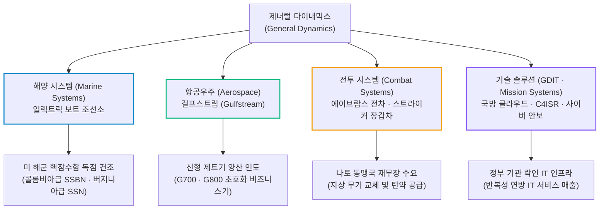
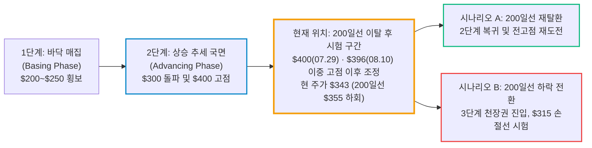

# 제너럴 다이내믹스(General Dynamics / GD) 실전 재무 및 가치 분석 보고서

- **작성일**: 2026-09-23
- **데이터 기준**: 2026년 2분기 실적(2026-06-30 마감, 2026-07-29 발표), 회사 IR 및 공식 수주잔고 데이터, 2026년 9월 방산 섹터 뉴스, yfinance 시장 데이터(2026-09-22 미국장 마감 기준)

대중이 화려한 AI 소프트웨어와 테크주 급등락에 눈이 멀어 있을 때, 제너럴 다이내믹스는 미 해군의 목줄인 핵잠수함 독점 건조대와 하늘의 슈퍼리치들이 줄 서는 걸프스트림 공장을 틀어쥐고 분기 순이익의 162%에 달하는 현금을 쓸어 담고 있다. 그런데도 주가는 9월 한 달 동안 10% 가까이 밀렸다. 회사가 망가진 것이 아니라 방산 섹터 전체의 가격표가 다시 매겨지고 있기 때문이다.

## 핵심 요약

| 구분 | 핵심 요약 |
| :--- | :--- |
| **종목 및 주가** | 제너럴 다이내믹스 (NYSE: `GD`) / **$343.39** (52주 범위 $306.77 ~ $400.00) |
| **최종 투자의견** | **분할 매수 (Buy on Dip)** / 선발대는 소규모로, 주력은 200일선 재탈환 확인 후 투입 (투자 가치 점수 **87.0점**, 6.1절) |
| **비즈니스 본질** | 미 해군 핵잠수함 독점 건조 인프라와 프리미엄 비즈니스 제트기(걸프스트림)의 복합 현금 캐시카우 |
| **핵심 매력 (Bull)** | Q2 매출 $14.09B(YoY +8.1%), 희석 EPS $4.24(YoY +13.4%), 영업현금흐름 순이익 대비 162%, **사상 최대 수주잔고 1,365억 달러($136.5B, 약 185조 원, YoY +32%)** |
| **핵심 리스크 (Bear)** | 미·이란 긴장 완화에 따른 방산 프리미엄 축소, 11월 중간선거 이후 국방 예산 협상 지연, 숙련 조선 인력 공급 병목, 경기 침체 시 민간 제트기 인도 취소 |
| **9월 하락의 성격** | GD 펀더멘털 훼손이 아닌 **방산 섹터 전체의 밸류에이션 재조정** (GD -9.5%, ITA -7.1%, S&P 500 +0.8%, 2.4절) |
| **포트폴리오 성격** | 계좌 하방을 방어할 **안보 독점 저베타(0.32) 수비수** / **단기 급등·인생 역전을 노린 투기 매수는 엄금** |

---

## 1. 비즈니스 실체: 대체 불가능한 국가 안보 독점 인프라와 걸프스트림의 현금 빨대

제너럴 다이내믹스(General Dynamics)를 언론에 나오는 '단순 방산주'나 '군납업체' 따위로 치부하는 것은 비즈니스의 본질을 놓치는 것이다. 이 기업의 본질은 **미국 국방부와 국가 안보의 목줄을 쥐고 있는 물리적 독점 인프라**이자, 슈퍼리치들의 하늘 위 이동 수단을 장악한 **초과 마진 캐시카우의 결합체**다.

사업 구조는 4대 핵심 축으로 나뉘며, 군수와 민수가 서로 완충 작용을 한다.

### 1.1 4대 사업 부문별 돈 버는 구조와 진입장벽

| 사업 부문 | 핵심 제품 및 포트폴리오 | 시장 지위 및 진입장벽 | 돈 버는 구조와 비즈니스 본질 |
| :--- | :--- | :--- | :--- |
| **해양 시스템 (Marine Systems)** | 버지니아급(SSN) 및 콜롬비아급(SSBN) 핵잠수함, 알레이 버크급 이지스 구축함 | **미국 내 대체 불가능한 독점적 인프라** (일렉트릭 보트 조선소) | 미 해군이 핵잠수함을 건조하려면 제너럴 다이내믹스를 거치지 않고는 불가능하다. 건조 기간만 수년~10년이 걸리는 장기 계약으로 향후 수십 년치 안정적 현금흐름을 예약해 놓은 국가 공인 영구 라이선스다. |
| **항공우주 (Aerospace)** | 걸프스트림(Gulfstream) G500, G600, G700, G800 비즈니스 제트기 | 글로벌 초호화 대형 비즈니스 제트기 시장의 **절대적 지배자** | 군납 마진의 한계를 보완하는 고마진 민수 캐시카우다. 신형 플래그십 G700/G800의 FAA 인증 완료 후 본격 인도 사이클에 진입하며 마진 확장을 주도하고 있다. |
| **전투 시스템 (Combat Systems)** | M1A2 에이브람스(Abrams) 주력 전차, 스트라이커(Stryker) 차륜형 장갑차, 포탄 | 나토(NATO) 표준 지상 전력의 중추이자 글로벌 지상 무기 공급자 | 우크라이나 전쟁 이후 전 세계적인 지상군 탄약 및 전차 재고 고갈로 유럽·아시아 동맹국(폴란드, 루마니아 등)의 주문이 쇄도하는 즉각적 전술 수혜 부문이다. |
| **기술 솔루션 (Technologies)** | GDIT(정부 IT 서비스), 미션 시스템(C4ISR, 통신, 보안, 암호화) | 국방부 및 정보기관 락인(Lock-in) IT 솔루션 | 정부 전산망, 안보 클라우드, 지휘통제 시스템을 수주하여 매년 예측 가능한 반복적 서비스 수수료를 회수하는 IT 파이프라인이다. |

### 1.2 왜 후발주자가 이 회사를 건드릴 수 없는가?

- **① 핵잠수함 건조 인프라의 복제 불가능성**: 신규 경쟁자가 수조 원의 자본을 들고 온다 한들 핵추진 잠수함을 건조할 수 있는 부지, 원자력 규제 인허가, 극비 보안 승인 기술자 풀을 확보하는 것은 현실적으로 불가능하다. 미국 정부가 스스로 문을 닫지 않는 한 사라질 수 없는 독점이다.
- **② 방산 사이클과 민간 제트기 마진의 헷지**: 정부 계약은 원가를 기준으로 이익률이 관리되기 때문에 폭발적 마진을 내기 어렵다. GD는 이를 걸프스트림이라는 민간 최고급 제품으로 보완한다. 대형 비즈니스 제트기는 대당 수천만 달러를 넘고, 항공우주 부문은 13~14%대의 영업이익률로 방산 부문보다 높은 마진을 낸다.

---

## 2. 최근 사건 타임라인과 2분기 실적, 그리고 9월 하락의 진실

### 2.1 최근 핵심 사건 타임라인: 날짜를 붙여서 봐라

| 일자 | 확인된 핵심 팩트 | 성격 | 시장 영향 및 한 줄 해석 |
| :---: | :--- | :---: | :--- |
| **2분기 (04.01~06.30)** | 이란 분쟁 이후 방산주 차별화 장세. LMT **-15.2%**, NOC **-25.0%**, RTX -1.2% | `섹터 조정` | 같은 기간 **GD는 +3.7%** 상승. F-35 지연·폭격기 비용 초과 같은 단일 프로그램 리스크가 없는 GD의 방어력이 확인되었다 |
| **07.29** | 2분기 실적 발표. EPS $4.24(컨센서스 $3.97 대비 +6.9%), **수주잔고 1,365억 달러($136.5B)** 사상 최대 | `실적 호재` | 장중 **$400.00(52주 최고가)** 를 찍었으나 종가 $380.96(**-3.1%**)으로 마감했다. 호재가 이미 주가에 반영된 상태에서 나온 전형적인 '뉴스에 팔아라' 반응이다 |
| **08.10** | 종가 기준 고점 $395.97 기록 | `기술적 고점` | 실적 발표 후 반등했으나 $400 돌파에는 실패하며 이중 고점을 형성했다 |
| **09.17** | 블룸버그, 중간선거 민주당 약진 시 국방 예산 협상 지연 우려 보도 | `정치 리스크` | 기관의 방산 비중 축소 흐름이 부각되었다 |
| **09.18** | 종가 $353.05로 **200일선($355.36) 이탈**, 거래량 269만 주(옵션 만기일 영향 포함) | `기술적 훼손` | 9월 중순 내내 방어하던 장기 추세선이 종가 기준으로 무너졌다 |
| **09.22** | 트럼프 대통령의 미·이란 협상 타결 시사, 이란의 호르무즈 해협 재개방 제안 | `지정학 완화` | GD $353.90 → **$343.39 (-3.0%)**, LMT·RTX 각각 약 -3%. 탄약 수요 기대로 붙어 있던 전쟁 프리미엄이 빠졌다 |
| **10.28 (예정)** | 3분기 실적 발표 (EPS 컨센서스 $4.14) | `다음 변곡점` | 섹터 재평가 국면에서 실적이 주가 하방을 지지하는지 확인할 첫 이벤트다 |

### 2.2 2026년 2분기 확정 실적 대차대조

월가 컨센서스를 상회한 2026년 2분기(2026-06-30 마감) 실적 데이터는 제너럴 다이내믹스의 실적 우상향 엔진이 정상 가동 중임을 증명한다.

| 재무 지표 | Q2 2025 | Q1 2026 | Q2 2026 | 전년 동기 대비(YoY) | 판정 및 분석 |
| :--- | ---: | ---: | ---: | ---: | :--- |
| **총매출(Revenue)** | $13.041B | $13.481B | **$14.094B** | **+8.07%** | 전 사업 부문 고른 성장, 걸프스트림 인도 본격화 |
| **GAAP 영업이익** | $1.305B | $1.420B | **$1.460B** | **+11.88%** | 매출 성장률을 상회하는 영업이익 성장 (영업이익률 10.4%, +0.4%p) |
| **GAAP 순이익** | $1.014B | $1.125B | **$1.160B** | **+14.40%** | 견고한 순이익 확장 추세 |
| **GAAP 희석 EPS** | $3.74 | $4.10 | **$4.24** | **+13.37%** | 컨센서스($3.97)를 6.9% 상회한 어닝 서프라이즈 |
| **영업활동 현금흐름** | $1.598B | $2.155B | **$1.880B** | **+17.65%** | **순이익 대비 162%에 달하는 압도적 현금 창출력** |
| **설비투자(CapEx)** | $198M | $203M | **$234M** | +18.18% | 조선소 설비 현대화 및 양산 시설 투자 집행 |
| **잉여현금흐름(FCF)** | $1.400B | $1.952B | **$1.646B** | **+17.57%** | 자사주 매입과 배당을 온전히 뒷받침하는 순수 현금 |
| **총 수주잔고(Backlog)** | — | $130.8B | **$136.5B** | **+32% (사상 최고치)** | **한화 약 185조 원에 달하는 실적 방어벽** |

출처: yfinance, 회사 IR 공시 및 2026-07-29 실적 발표 자료.

### 2.3 대중의 착시 vs 데이터가 말해주는 진실

| 시장과 언론의 흔한 착시 | 데이터와 장부 숫자가 말하는 냉혹한 진실 |
| :--- | :--- |
| **"11월 중간선거에서 민주당이 의회를 장악하면 국방예산이 삭감된다?"** | 예산 협상이 길어지고 신규 발주가 늦어질 수는 있다. 그러나 미 해군 콜롬비아급 SSBN은 양당이 모두 지지해 온 **미국 핵 3축 안보의 최우선 국가 전략 사업**이어서 삭감 대상이 될 가능성이 낮다. 게다가 이미 확보한 **수주잔고 1,365억 달러(약 185조 원)는** 정권 향방과 무관하게 향후 수년간 매출로 전환될 계약 물량이다. 선거 리스크는 이익이 아니라 **밸류에이션 배수**에 먼저 반영된다. |
| **"미국-이란 분쟁에도 방산주가 빠졌으니 매력이 없다?"** | 2분기 중 LMT(-15.2%)와 NOC(-25.0%)가 F-35 지연과 폭격기 비용 초과로 무너질 때 **GD는 +3.7% 상승하며 차별화된 방어력**을 증명했다. 단일 무기 결함 리스크가 없고 걸프스트림이라는 민간 캐시카우가 받쳐주기 때문이다. 다만 9월처럼 섹터 전체가 재평가될 때는 GD도 함께 빠진다. |
| **"수주 산업이라 현금이 묶이고 회계상 이익만 높다?"** | 2분기 영업활동 현금흐름은 **$1.880B로 분기 순이익($1.160B)의 무려 162%에 달한다.** 회계상 이익이 아니라 실제 금고로 현금이 들어오고 있다는 방증이다. |
| **"고금리 장기화로 기업용 제트기 수요가 얼어붙었다?"** | 걸프스트림의 신형 플래그십인 G700과 G800은 초고액 자산가 및 글로벌 대기업의 핵심 자산이다. 인증 지연 병목이 풀리며 대기 수주가 매출로 전환되고 있다. |
| **"주가가 $400 고점에서 밀렸으니 끝물이다?"** | 끝물이라고 단정할 근거는 없다. 하지만 **단순한 눌림목도 아니다.** 주가는 9/18에 200일선을 종가 기준으로 이탈했고, 거래량이 늘면서 하락했다. 펀더멘털은 **사상 최고치인 1,365억 달러의 수주잔고**로 단단하지만, 차트는 추세가 복원되었다는 증거를 아직 보여주지 않았다. |

### 2.4 9월 내내 빠진 이유: GD가 아니라 방산 섹터 전체의 재평가

**같은 기간 방산주 등락률 (2026-08-28 → 09-21 종가)**

| 종목 | 등락률 |
| :--- | ---: |
| **GD** | **-6.7%** (9/22 하락까지 포함하면 **-9.5%**) |
| RTX | -8.2% |
| ITA (방산 ETF) | -7.1% |
| HII (GD의 조선 경쟁사) | -6.2% |
| LMT | -4.5% |
| NOC | -3.0% |
| SPY (S&P 500) | **+0.8%** |

시장 전체는 오르는데 방산주만 함께 빠졌다. GD 고유의 악재였다면 이런 모습이 나올 수 없다. 원인은 세 가지다.

1. **미·이란 긴장 완화 (9/22에 하락 폭이 커진 직접 원인)**: 트럼프 대통령이 협상 타결 가능성을 언급하고 이란이 호르무즈 해협 재개방을 제안하자, 탄약 수요 기대로 붙어 있던 전쟁 프리미엄이 빠졌다. 같은 날 유가도 4거래일 연속 하락하며 같은 '긴장 완화 매매'가 원자재 시장에서도 진행되었다.
2. **11월 중간선거 리스크**: 민주당이 상·하원 중 한 곳 이상을 가져가면 국방 예산 협상이 길어지고 집행이 늦어질 수 있다. 기관들은 이 가능성에 대비해 방산 비중을 미리 줄이고 있다.
3. **상반기 급등 이후의 되돌림**: 상반기 이란 분쟁을 계기로 방산주 밸류에이션에 기대가 많이 반영되었다. 9/22의 호르무즈 뉴스는 이미 진행 중이던 디레이팅(de-rating)을 가속한 촉매였을 뿐이다.

!!! warning "저베타가 섹터 리스크까지 막아주지는 않는다"
    GD의 베타 0.32는 **S&P 500 전체와 함께 움직이는 정도**가 낮다는 뜻이다. 방산 섹터 고유의 정치·지정학 리스크를 피할 수 있다는 뜻이 아니다. 9월은 시장이 오르는 동안 방산만 빠진 달이었고, GD도 섹터와 똑같이 움직였다. 수비수 역할은 **시장 전체의 폭락**에서 기대할 수 있는 것이지, 섹터 재평가 국면에서 기대할 수 있는 것은 아니다.

---

## 3. 경쟁 해자 및 피어 그룹 잔혹 비교

방산 섹터 대형주 4인방(GD, LMT, RTX, NOC)을 놓고 어디에 돈을 묻어야 하는지 밸류에이션과 사업 구조를 냉정하게 비교해야 한다.

| 비교 지표 | **제너럴 다이내믹스 (GD)** | 록히드 마틴 (LMT) | RTX (RTX) | 노스롭 그루먼 (NOC) |
| :--- | :---: | :---: | :---: | :---: |
| **현재 주가** | **$343.39** | $522.34 | $190.99 | $509.86 |
| **시가총액** | **$92.9B** | $120.6B | $257.4B | $72.4B |
| **Trailing PER** | **20.95배** | 19.25배 | 33.68배 | 16.22배 |
| **Forward PER** | **18.47배** | 15.95배 | 24.33배 | 16.74배 |
| **EV/EBITDA** | **14.76배** | 14.18배 | 18.23배 | 12.02배 |
| **배당수익률** | **1.85%** (연 $6.36) | 2.58% | 1.50% | 1.88% |
| **베타 (Beta)** | **0.321** | 0.104 | 0.287 | -0.110 |
| **2분기 주가 등락률** | **+3.7%** | -15.2% | -1.2% | -25.0% |
| **핵심 독점 영역** | **핵잠수함 독점 + 걸프스트림** | F-35 전투기 단일 의존도 | 항공기 엔진 및 미사일 | B-21 스텔스 폭격기 |
| **포트폴리오 취약점** | 조선 숙련공 인력 수급 | F-35 업그레이드(TR-3) 지연 | 프랫&휘트니 기어드터보팬 리콜 여진 | 폭격기 개발비 초과 위험 |

출처: yfinance 시장 데이터 비교 (2026-09-22 미국장 마감 기준).

### 3.1 제너럴 다이내믹스만의 차별적 독점력

1. **단일 무기체계 결함 리스크가 작다**: 록히드 마틴은 매출의 상당 부분이 F-35 전투기 단일 프로그램에 묶여 있어 소프트웨어 지연이나 부품 결함 시 타격이 크다. 반면 GD는 해양(잠수함/구축함), 육상(에이브람스 전차), 항공(걸프스트림), IT 솔루션(GDIT)으로 분산되어 있다. 가장 큰 부문인 해양 시스템의 조선 인력 문제를 제외하면 특정 무기 하나에 실적이 흔들릴 위험은 작다.
2. **민간 마진 레버리지**: 록히드와 노스롭은 매출 대부분이 정부 국방 예산에 묶여 정부가 관리하는 마진 범위를 벗어나기 어렵다. GD는 고마진 민간 비즈니스 제트기 부문(Aerospace)으로 영업이익률을 자력으로 끌어올릴 수 있다. 민수 사업을 가진 방산 대형주로는 RTX(민항기 엔진·부품)도 있지만, RTX는 Forward PER 24배로 이미 비싸다. **민수 레버리지와 합리적 밸류에이션을 동시에 갖춘 곳은 GD다.**

---

## 4. 기술적 사이클 위치 (4단계 사이클 모델)

스탠 와인스타인(Stan Weinstein)의 주가 4단계 사이클 이론으로 점검했을 때, 제너럴 다이내믹스는 거시적 **2단계 상승 국면(Advancing Phase)의 후반부에서 추세 훼손 여부를 시험받는 구간**에 있다. 주가가 장기 추세선(200일선) 아래로 내려왔지만, 200일선 자체는 아직 완만하게 상승 중이다. 따라서 3단계(천장권)로 넘어갔다고 확정하기도 이르고, 건전한 눌림목이라고 단정하기도 이르다.

### 4.1 이동평균선 및 수급 지표 진단

- **현재 주가**: **$343.39**
- **52주 최고가 및 최저가**: $400.00(2026-07-29 장중) / $306.77 (고점 대비 -14.15%)
- **50일 이동평균선**: **$375.86** (하락 전환, 단기 저항선)
- **200일 이동평균선**: **$355.36** (9/18 종가 이탈, 재탈환 여부가 핵심)
- **거래량 흐름**: 8월 하순 일평균 60~90만 주 → 9월 100~150만 주로 증가, 9/18에는 269만 주
- **사이클 기술적 판정**:
    - 주가는 7/29 실적 발표일 장중 $400을 찍은 뒤 되밀렸고, 8/10에 $396에서 다시 막히며 이중 고점을 만들었다. 이후 9월 섹터 재평가와 함께 200일선까지 내려왔고, 9/18에 종가 기준으로 이탈했다.
    - **거래량이 늘면서 주가가 빠지는 모습은 가벼운 차익 실현보다 물량 정리(distribution)에 가깝다.** 따라서 지금은 지지가 확인된 매수 자리가 아니라, 지지선이 깨진 상태에서 가격 매력만으로 받아내는 자리다.
    - 반대로 200일선의 기울기가 아직 꺾이지 않았기 때문에, 선거·지정학 불확실성이 걷히고 200일선을 재탈환하면 2단계 상승 추세로 복귀할 수 있다.

---

## 5. 밸류에이션 및 가격 타당성 검증

### 5.1 PER 및 밸류에이션 배수 분해

- **선행 PER(Forward P/E)**: **18.47배** (예상 주당순이익 $18.59 기준)
- **과거 PER(Trailing P/E)**: **20.95배** (최근 12개월 EPS $16.39 기준)
- **EV/EBITDA**: **14.76배**
- **배당수익률**: **1.85%** (연간 주당 $6.36 지급, 2026년 3월 분기 배당을 $1.59로 6% 올리며 **29년 연속 증액**한 배당귀족주)
- **자사주 매입 현황**: 2분기에도 약 $102M 규모의 자사주를 매입하며 주당 가치를 방어 중이다.

### 5.2 현재 주가는 비싼가, 싼가?

S&P 500 지수 평균 Forward PER(약 21~22배)과 비교할 때, 제너럴 다이내믹스의 **선행 PER 18.47배는 할인 영역**이다.

- 미국 정부가 보증하는 핵잠수함 독점력, **사상 최대인 1,365억 달러(약 185조 원)의 수주잔고**, 순이익의 160%를 웃도는 현금 전환율을 보유한 초우량 독점 기업이 시장 평균보다 낮은 18배에 거래되고 있다. 이는 하방 안전마진이 상당 부분 확보되어 있음을 뜻한다.
- 다만 같은 섹터의 LMT(15.95배)와 NOC(16.74배)보다는 비싸다. 섹터 전체의 배수가 내려가는 국면에서는 GD의 배수도 추가로 눌릴 수 있다.
- 걸프스트림 G700/G800의 본격 인도와 미 해군 잠수함 계약 물량 확대로 향후 12개월 EPS가 현재 추정치 $18.6에서 $20까지 오른다고 가정하자. 이때 20배 수준의 정상 밸류에이션만 인정받아도 주가는 **$372(18.6×20) ~ $400(20×20)선으로 가치가 회귀할 여지**가 있다.

---

## 6. 종합 평가 및 냉혹한 계좌 실행 원칙

### 6.1 6대 핵심 투자 지표 다차원 평가 매트릭스

| 평가 영역 | 가중치 | 평점 (100점 만점) | 가중 점수 | 등급 | 핵심 평가 요약 |
| :--- | :---: | :---: | :---: | :---: | :--- |
| **① 비즈니스 모델 및 해자** | 25% | **95점** | 23.75 | `S` | 미 해군 핵잠수함 건조 인프라 독점 및 걸프스트림 브랜드 락인 |
| **② 실적 성장성 및 수주잔고** | 25% | **90점** | 22.50 | `S` | Q2 매출 +8.1%, EPS +13.4%, **1,365억 달러($136.5B, YoY +32%)의 압도적 백로그** |
| **③ 재무 건전성 및 현금흐름** | 20% | **92점** | 18.40 | `S` | 분기 FCF $1.65B, 영업현금흐름 순이익 대비 162%, 29년 연속 배당 증액 |
| **④ 밸류에이션 매력도** | 15% | **80점** | 12.00 | `A` | 선행 PER 18.47배로 S&P 500 대비 할인, 단 LMT·NOC보다는 높음 |
| **⑤ 기술적 매매 타이밍** | 10% | **65점** | 6.50 | `B` | 200일선 종가 이탈 및 거래량 증가 하락, 가격 매력은 있으나 추세 확인 전 |
| **⑥ 리스크 관리 가능성** | 5% | **77점** | 3.85 | `B+` | 저베타(0.32)와 정부 보증 수주로 하방 제한, 단 섹터 정치 리스크 노출 |
| **종합 가중치 환산 점수** | **100%** | — | **87.0점** | **`Buy`** | **펀더멘털은 최상급, 타이밍은 분할 대응이 필요한 포트폴리오 방파제** |

!!! info "평점 산출 공식"
    종합 점수는 각 영역의 가중치를 곱해 합산한 값이다.
    `95×0.25 + 90×0.25 + 92×0.20 + 80×0.15 + 65×0.10 + 77×0.05 = 87.00점`

### 6.2 실전 결론: "그래서 지금 어쩌라는 것인가?" (Action Verdict)

#### ① 지금 당장 사야 하는가? ➔ **"선발대만 작게 보내라. 주력은 200일선 재탈환을 확인한 뒤다."**

- **선발대를 보내도 되는 이유**: 9월 하락의 원인은 GD 펀더멘털 밖에 있다. Q2 실적은 컨센서스를 넘었고, 수주잔고는 전년 대비 32% 늘었으며, 선행 PER은 18배 초반으로 내려왔다. 선거와 지정학 불확실성이 걷히면 되돌아올 여지가 있는 하락이다.
- **비중을 줄여야 하는 이유**: 이번 하락은 실적이 아니라 정치·지정학 뉴스로 움직인다. 11/3 중간선거까지 약 6주 동안 비슷한 흐름이 이어질 수 있다. 손익비도 넉넉하지 않다. 손절선 $315까지는 -8.3%이고, 1차 저항인 50일선 $376까지는 +9.5%로 대략 1:1이다.
- **지금 할 일**: 한 번에 몰빵하지 말고, 선발대 → 보강 → 주력 → 추세 확인의 4단계로 나누어 가격과 추세 조건을 확인하면서 분할 매수한다(6.3절).

#### ② 이런 주식은 누가 사고, 누가 절대 사면 안 되는가?

- **❌ 절대 사지 마라 (즉시 퇴장)**: 한 달 만에 50%, 100% 폭등하는 테마주를 찾는 자, 인생 역전 단타를 노리는 자. (이 주식의 베타는 0.32에 불과하다. 급등락을 즐기는 투기꾼에겐 지루해 미칠 주식이다.)
- **⭕ 눈독 들이고 주워 담아야 할 사람 (스나이퍼 매수)**: 시장 전체의 변동성이나 기술주 폭락이 두려운 자, 계좌 하방을 지탱할 든든한 방파제(수비수)가 필요한 자, 연 8~12%의 안정적 자본 차익과 약 1.9%의 배당 복리를 노리는 투자자.

#### ③ 이 주식으로 '대박'을 바라서는 안 되는 냉혹한 이유

- 제너럴 다이내믹스는 시가총액 900억 달러가 넘는 거함이다. 매출 성장은 연 7~10% 안팎의 안정 궤도를 걷는다. 소프트웨어 기업처럼 하룻밤 사이에 마진이 50%로 치솟는 기적은 없다. 이 종목의 진짜 쓸모는 공격수가 아니라, 시장이 피바다가 될 때 계좌의 침몰을 막아내는 **'불침번 수비수'다.**

### 6.3 실전 가격대별 실행 시나리오 및 분할 매수 로드맵

종목 배정 예산 내부의 분할 비중 로드맵이며, 전체 포트폴리오 대비 편입 한도는 **최대 5% 이내**로 제한하여 운용한다.

| 구분 | 실행 조건 | 배정 비중 | 가격 기준 | 구체적 대응 방침 |
| :--- | :--- | :---: | :---: | :--- |
| **1차 진입 (선발대)** | 현 가격대, 선행 PER 18배 초반의 가격 매력 구간 | **20%** | **$338 ~ $345** | 추세 확인 전 매수이므로 소규모 정찰대만 배치 |
| **2차 매수 (보강)** | 추가 하락 후 하락이 멈추는 것을 확인 (52주 저점 $306.77 위) | **20%** | **$320 ~ $330** | 선거 전 추가 하락 시 평균 매입가를 낮추는 용도, 손절선 $315와 거리를 두고 집행 |
| **3차 매수 (주력)** | 200일선($355) 재탈환 후 종가 기준 안착 | **40%** | **$355 ~ $362** | 추세 복원 확인 후 핵심 주력 물량 투입 |
| **4차 매수 (추세 불타기)** | 50일선($376) 돌파 및 전고점 재도전 | **20%** | **$376 돌파 시** | 2단계 상승 파동 재개 확인 시 마지막 물량 실어 완성 |
| **손절 및 위험 관리선** | 국방 예산의 실질적 삭감 확인, 또는 종가 $315 이탈 | — | **$315 종가 하회** | 52주 저점 붕괴 위협 시 미련 없이 비중 축소 및 관망 |

2차 보강 조건이 나오지 않고 바로 반등하면 2차 물량은 건너뛰고 3차 주력 조건에서 합쳐서 집행한다.

### 6.4 판정을 바꿀 증거와 다음 모니터링 체크리스트

1. **11/3 중간선거 결과와 국방 예산 협상 일정**: 의회 구성이 바뀌어도 콜롬비아급·버지니아급 잠수함 예산이 유지되는지 확인하라. 선거 불확실성 해소는 섹터 배수 회복의 가장 큰 촉매다.
2. **미·이란 협상 진행 상황**: 협상이 실제 타결되면 전쟁 프리미엄은 추가로 빠질 수 있다. 반대로 협상이 결렬되면 방산 섹터 전반이 되살아날 수 있다.
3. **10/28 3분기 실적 발표**: EPS 컨센서스 $4.14 상회 여부와 수주잔고가 $136.5B 수준을 유지하는지 확인하라.
4. **걸프스트림 신형 제트기(G700/G800) 분기별 인도 대수 추이**: 인도 대수가 늘면서 항공우주 부문 영업마진이 14% 이상으로 확장되는지 확인하라.
5. **미 해군 잠수함 건조 프로그램(콜롬비아급) 납기 일정 및 조선소 인력 수급**: 일렉트릭 보트 조선소의 숙련 인력 부족으로 인한 공기 지연 이슈가 발생하는지 모니터링하라.
6. **200일선($355) 재탈환 여부**: 종가 기준으로 재탈환하고 안착하면 3차 주력 매수 조건이 충족된다.

!!! tip "최종 핵심 제언 (Executive Takeaway)"
    - **최종 투자 가치 점수**: **87.0점 / 100점** (`Buy` / 압도적 해자와 실적 모멘텀, 그러나 공격수가 아닌 수비수)
    - **독점의 실체**: 미 해군 핵잠수함 건조대를 대체할 조선소는 미국 땅 어디에도 없다. 미국이 안보를 포기하지 않는 한 사라질 수 없는 비즈니스다.
    - **9월 하락의 정체**: GD의 문제가 아니라 이란 긴장 완화와 중간선거 리스크에 따른 방산 섹터 전체의 재평가다. 수주잔고 1,365억 달러는 그대로다.
    - **가격표의 기회와 한계**: $400에서 $343까지 밀린 지금의 가격은 Forward PER 18배라는 할인 티켓이다. 그러나 200일선이 깨진 상태이므로 추세가 복원되었다는 증거는 아직 없다.
    - **행동 강령**: 단기 대박의 환상을 버려라. 지금은 선발대 20%만 보내고, 200일선 재탈환이 확인되면 주력을 투입하라.
