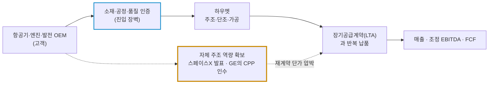
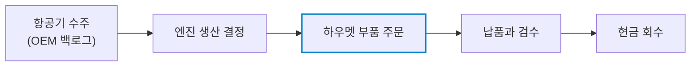

# 하우멧 에어로스페이스(Howmet Aerospace / HWM) 실전 재무 및 가치 분석 보고서

- **작성일**: 2026-09-09
- **데이터 기준**: 2026년 2분기 실적(2026-06-30 마감), 회사 가이던스, 최근 3개월 핵심 뉴스(2026.09) 및 yfinance 시장 데이터(2026-09-08 미국장 마감 기준)

하우멧은 항공우주 공급망의 질 좋은 병목을 장악한 회사다. 그러나 질 좋은 회사와 지금 당장 사도 되는 주식은 다르다. 실적은 강한데 주가는 대량 거래로 200일선을 깨뜨렸고, 선행 PER 36배는 앞으로 몇 년치 성장을 이미 값에 얹어 놓았다.

## 핵심 요약

| 구분 | 핵심 요약 |
| :--- | :--- |
| **종목 및 주가** | 하우멧 에어로스페이스 (NYSE: `HWM`) / **$231.53** (52주 범위 $176.32 ~ $310.00) |
| **최종 투자의견** | **관망 (Wait & Watch)** / 200일선 회복 또는 $220대 지지 확인 전 추격 금지 (투자 가치 점수 **77.9점**, 6.1절) |
| **비즈니스 본질** | 고온·고압 엔진 부품과 항공우주 패스너에서 인증·공정·품질의 진입장벽을 파는 공급자 |
| **핵심 매력 (Bull)** | Q2 매출 YoY +24%, 조정 EBITDA 마진 32.1%, FY2026 가이드 상향, 강한 FCF와 자사주 매입 |
| **핵심 리스크 (Bear)** | CAM 인수 뒤 순차입금 증가, 선행 PER 36.1배, 200일선 이탈, 고객사의 수직통합 |
| **포트폴리오 성격** | 민항·방산·가스터빈 사이클에 올라탄 **고품질 성장주** / **싸구려 가치주나 저변동 방파제로 착각하지 마라** |

---

## 1. 비즈니스 실체: 금속이 아니라 '불량 없이 반복 생산하는 능력'을 판다

하우멧을 단순한 금속 부품업체로 보면 본질을 놓친다. 이 회사가 파는 것은 니켈 합금 덩어리나 볼트가 아니다. 수천 회의 비행과 고온·고압을 견뎌야 하는 부품을 정해진 규격과 수율로 반복 생산하는 능력이다.

항공우주 부품은 한번 설계에 채택됐다고 영원히 독점하는 물건이 아니다. 다만 인증·소재 과학·주조·단조·가공·품질 추적을 처음부터 다시 검증하는 비용이 대단히 높다. 이 전환 비용이 경제적 해자의 핵심이다.

| 사업 부문 | Q2 2026 매출 | YoY | 조정 EBITDA 마진 | 돈 버는 구조 |
| :--- | ---: | ---: | ---: | :--- |
| **Engine Products** | $1.373B | +32% | 37.7% | 엔진·가스터빈용 에어포일과 회전 부품. IGT 캐스팅 점유율 50%+ |
| **Fastening Systems** | $589M | +37% | 30.1% | 항공우주 패스너, 유체 피팅, 커넥터. CAM 실적 편입 |
| **Engineered Structures** | $320M | +9% | 21.9% | 티타늄·알루미늄·니켈 단조품과 가공 구조물 |
| **Forged Wheels** | $265M | +5% | 27.2% | 상용차용 단조 알루미늄 휠 |

출처: [Howmet 2026년 2분기 실적 발표](https://www.howmet.com/press-release/2026-08-06/howmet-aerospace-reports-second-quarter-2026-results/). 마진은 회사가 정의한 비GAAP 조정 EBITDA 기준이다.

### 1.1 해자는 진짜다, 그러나 '대체 불가능'은 과장이다

- **① 기술과 공정 해자**: 2025년 말 기준 등록 특허 약 1,020개와 출원 특허 180개를 보유했다. 회사는 특허·영업비밀·상표가 경쟁우위에 중요하다고 직접 공시했다.
- **② 고객 인증과 품질 이력**: 항공기와 엔진의 수명주기 내내 추적 가능한 품질과 반복 생산 능력이 요구된다. 신규 공급자가 가격만 싸게 들고 와서 다음 날 물량을 빼앗을 수 있는 구조가 아니다.
- **③ 넓어진 패스너 포트폴리오**: CAM은 패스너뿐 아니라 유체 피팅과 커넥터까지 더했다. 기존 Fastening Systems의 고객·프로그램 노출을 넓힐 논리는 충분하다.
- **④ 그래도 독점은 아니다**: 회사는 Precision Castparts, ATI, Lisi Aerospace, VSMPO, Aubert & Duval을 경쟁사로 직접 적시한다. 고객사가 공급 병목을 뚫으려고 내재화에 나서는 순간 영구 독점 서사에는 금이 간다. "후발 주자 진입이 사실상 불가능하다"는 문장은 분석이 아니라 홍보다.

근거: [Howmet 2025 Form 10-K](https://www.sec.gov/Archives/edgar/data/4281/000000428126000012/hwm-20251231.htm).

---

## 2. 9월의 두 번의 충격과 분기 숫자

### 2.1 사건 타임라인: 날짜를 붙여서 봐라

| 날짜 | 확인된 사실 | 성격 | 한 줄 해석 |
| :---: | :--- | :---: | :--- |
| **04.06** | CAM을 순취득현금 차감 후 약 **$1.812B**에 인수 완료 | `선행 팩트` | Q2 패스너 매출 급증과 현재 부채 수준을 만든 원인 |
| **07.27** | Q3 배당 주당 **$0.14** 선언 (직전 $0.12, **+16.7%**) | `배당 증액` | 증액은 맞지만 연환산 수익률은 약 0.24%에 불과 |
| **08.06** | Q2 매출 $2.547B, 희석 EPS $1.33, FY2026 가이드 상향 | `실적 호재` | 컨센서스 $1.246을 6.7% 상회. 영업 실적은 강하다 |
| **09.02** | 스페이스X, 산업용 가스터빈 캐스팅 자체 제작 발표 | `구조 리스크` | 씨티·번스타인은 즉시 목표가 $329·$328 유지로 방어 |
| **09.08** | GE Aerospace, 정밀 주조업체 CPP를 **$11.75B**에 인수 발표 | `메가 악재` | 당일 **-10.70%**, 거래량 11.66M, 종가 $231.53로 200일선 이탈 |

CAM 인수 근거는 [2026년 2분기 Form 10-Q](https://www.sec.gov/Archives/edgar/data/4281/000000428126000025/hwm-20260630.htm), 배당 내역은 [회사 배당 이력](https://www.howmet.com/dividend-information/)에서 확인된다.

CPP는 상업항공·방산·산업용 가스터빈용 정밀 주조품을 만드는 업체이고, GE는 15년 넘게 CPP의 고객이었다. 거래 종결 예정 시점은 2027년 하반기다. [GE Aerospace 공식 발표](https://www.geaerospace.com/news/press-releases/ge-aerospace-acquire-consolidated-precision-products-cpp-expanding-mission-critical)

### 2.2 월가는 "매수 기회"라고 했고, 6일 뒤 GE가 답을 했다

9월 2일 스페이스X의 발표로 주가가 흔들리자 월가 메이저 하우스들은 곧바로 방어 리포트를 냈다. 무슨 논리로 방어했는지 원문 그대로 보자.

> **[뉴스 원문 보존] 2026-09-02 08:55 "하우멧 에어로스페이스, 스페이스X 경쟁 리스크 아냐 – 씨티 외"** (서울=써치엠글로벌 이배성 기자)
>
> - **씨티 John Godyn 애널리스트**: "스페이스X(NAS: SPCX)가 자체적인 산업용 가스터빈 캐스팅 제작 계획을 발표하면서 하우멧(NYS: HWM)의 주가가 하락했다. 하지만 이는 단기적인 현상으로 보이며, 투자자들은 이번 주가 하락을 매수기회로 삼아야 할 것이다. 스페이스X가 자체적인 캐스팅 제작을 발표한 것은 곧 하우멧이 생산하는 캐스팅이 그만큼 핵심적인 부품임을 가리킨다. 산업용 가스터빈 캐스팅에 대한 수요는 강력하고, 하우멧 경영진이 제시한 매출 목표 이상의 성장세를 기대할 수 있다." (투자의견 `매수`, 목표주가 **$329** 유지)
> - **번스타인 Douglas Harned 애널리스트**: "스페이스X가 자체적인 캐스팅을 제작하더라도 하우멧의 시장지위를 대체할 수 있을 것으로 예상되지는 않는다. 하우멧은 산업용 가스터빈 관련 캐스팅 시장에서 **50% 이상의 점유율**을 차지하고 있고, 많은 고객들과 장기적인 공급계약을 체결한 상태다. 스페이스X의 발표는 하우멧에 리스크가 되는 것이 아니라, 밸류체인에서 하우멧이 얼마나 중요한 입지에 있는지를 확인시켜주는 것이다." (투자의견 `Outperform`, 목표주가 **$328** 유지)

두 리포트가 근거로 삼은 사실 자체는 틀리지 않았다. 문제는 그 사실로 무엇을 결론 낼 수 있느냐다.

| 월가가 내세운 논리 | 6일 뒤 시장이 보여준 것 |
| :--- | :--- |
| **"IGT 캐스팅 점유율 50%+와 LTA가 지킨다"** | 점유율과 계약은 사실이다. 다만 재계약 단가까지 지켜주지는 않는다 |
| **"스페이스X 진입은 캐스팅의 핵심성을 입증한다"** | 시장이 두려워한 건 단일 기업의 진입이 아니라 고객 전체의 내재화 착수였다 |
| **"이번 하락은 단기 현상이니 매수 기회다"** | 9월 8일 GE의 CPP 인수로 주가는 오히려 **-10.70%** 추가 하락했다 |
| **"목표가 $328~$329가 하방을 받쳐 준다"** | 목표가는 애널리스트의 가정이다. 지지선도 환불 보증서도 아니다 |

시장이 진짜로 가격에 반영하기 시작한 위험은 이것이다. **하우멧의 37.7%짜리 엔진 부문 마진에 질린 고객사들이 수직계열화에 실제로 자본을 쓰기 시작했다.** 스페이스X는 발표였지만 GE는 $11.75B(약 16조 원)를 실제로 집행했다. 발표와 집행은 무게가 다르다.

### 2.3 분기 숫자: 조정치만 보지 말고 GAAP와 현금을 같이 봐라

| 지표 | Q2 2025 | Q1 2026 | Q2 2026 | YoY |
| :--- | ---: | ---: | ---: | ---: |
| **매출** | $2.053B | $2.313B | **$2.547B** | **+24.1%** |
| **GAAP 영업이익** | $521M | $660M | **$711M** | **+36.5%** |
| **GAAP 순이익** | $407M | $580M | **$534M** | **+31.2%** |
| **GAAP 희석 EPS** | $1.00 | $1.44 | **$1.33** | **+33.0%** |
| **영업현금흐름** | $446M | $453M | **$583M** | **+30.7%** |
| **설비투자** | $102M | $94M | **$104M** | **+2.0%** |
| **FCF** | $344M | $359M | **$479M** | **+39.2%** |

출처: yfinance 분기 손익계산서 및 현금흐름표(2026-09-09 기준).

FCF는 회사와 yfinance가 함께 쓰는 **영업현금흐름 - 설비투자** 정의다. 의무 부채상환과 인수대금까지 차감한 "마음대로 쓸 수 있는 현금"으로 오해하지 마라.

Q1 GAAP EPS $1.44가 Q2보다 높다고 성장 둔화로 단정하면 틀린다. Q1에는 Savannah 단조 시설 매각 같은 비경상 항목이 섞여 있다. Q2 조정 EPS는 $1.33으로 GAAP EPS와 정확히 같았다. 기간과 회계 기준을 섞으면 멀쩡한 숫자도 거짓말이 된다.

### 2.4 가이드 상향: 강한 것은 맞고, 영원한 두 자릿수 성장은 아니다

| FY2026 회사 가이드 | 범위 | 기준점 | 이전 기준점 대비 |
| :--- | ---: | ---: | ---: |
| **매출** | $10.000B ~ $10.100B | **$10.050B** | **+$400M** |
| **조정 EBITDA** | $3.210B ~ $3.250B | **$3.230B** | **+$170M** |
| **조정 희석 EPS** | $5.23 ~ $5.31 | **$5.27** | **+$0.33** |
| **FCF** | $1.850B ~ $1.950B | **$1.900B** | **+$150M** |

네 항목 전부 올렸다. 이 가이드는 강하다.

그러나 "향후 수년간 매출 CAGR 두 자릿수"는 회사가 확정한 장기 가이드가 아니다. yfinance 컨센서스가 2027년 매출 $11.46B와 성장률 13.5%를 가리키지만, 그것은 애널리스트 추정치일 뿐이다. 항공기 OEM의 막대한 백로그도 하우멧의 확정 매출이나 현금이 아니다. 백로그가 현금이 되려면 아래 다섯 단계를 전부 통과해야 한다.

### 2.5 CAM 인수 이후: 현금창출력은 강하고, 부채는 사라지지 않았다

| 재무 항목 | 2025-12-31 | 2026-06-30 | 변화 |
| :--- | ---: | ---: | ---: |
| **현금 및 현금성 자산** | $742M | **$563M** | -$179M |
| **총차입금** | $3.050B | **$4.501B** | +$1.451B |
| **순차입금** | $2.308B | **$3.938B** | +$1.630B |
| **순차입금 / EBITDA** | 약 **1.0배** | TTM 기준 약 **1.43배** | 인수 후 상승 |

총차입금과 현금은 10-Q 공시 기준이다. yfinance의 `Total Debt` $4.664B는 리스부채까지 포함해 공시 차입금과 정의가 다르지만, 순차입금은 $3.938B로 일치한다.

이자비용 이야기는 반드시 양쪽을 같이 봐야 한다. 회사는 엔화 대출 약 $186M을 상환하고 $300M 통화스왑을 체결해 연환산 이자비용을 약 $12M 줄였다. 그러나 CAM 조달까지 포함한 2026년 전체 부채 조치의 순효과는 회사 추정으로 **연간 이자비용 약 $38M 증가**다. "이자비용을 줄였으니 재무구조도 좋아졌다"는 해석은 반쪽짜리다.

주주환원은 실제다. Q2에 $300M, 7월에 추가 $200M을 자사주 매입에 썼고 1~7월 누적액은 $800M이다. 다만 비싼 가격에 산 자사주가 자동으로 가치를 만들지는 않는다. 1~7월 평균 매입가격 $248.29는 9월 8일 종가보다 높다.

---

## 3. 성장 엔진과 리스크: 무엇이 돈이 되고, 무엇이 논리를 죽이는가

### 3.1 이익을 밀어 올리는 세 축

- **① 상업항공 회복**: Q2 상업항공 매출은 전년 대비 **28%** 늘었다. 신형 항공기 생산뿐 아니라 운항시간 증가와 노후 기재 유지에 따른 스페어 수요가 실적을 받친다.
- **② 방산 수요**: 방산 항공 매출은 **11%** 증가했다. 민항 생산 차질을 완전히 상쇄하는 만능 방패는 아니지만 수요원을 분산한다.
- **③ 가스터빈 병목**: 가스터빈 시장 매출은 **38%** 증가했다. AI 데이터센터가 만든 전력 수요 폭증이 IGT 부품 병목을 키웠고, 이것이 지금 가장 강력한 순풍이다.

세 번째 축은 동시에 이 종목의 가장 큰 약점이기도 하다. 공급이 희소해서 마진이 높다는 말은, 고객이 그 희소성을 깨는 순간 마진도 같이 깎인다는 뜻이다.

### 3.2 논리를 죽이는 네 가지

| 리스크 | 관찰해야 할 숫자 | 논리가 깨지는 조건 |
| :--- | :--- | :--- |
| **고객 수직통합** | Engine Products 성장률, 신규 수주 | 내재화 이후 HWM 물량 축소나 주요 프로그램 이탈 확인 |
| **항공기 생산 차질** | Boeing·Airbus 인도량, 엔진 OEM 생산률 | OEM 차질이 출하와 운전자본을 장기간 압박 |
| **CAM 통합 실패** | Fastening Systems 유기성장·마진 | 매출만 늘고 마진과 현금 전환율이 악화 |
| **밸류에이션 압축** | 선행 EPS 수정과 선행 PER | EPS 상향 없이 배수만 30배 안팎으로 정상화 |

!!! warning "가장 중요한 미확인 사실"
    스페이스X의 자체 제작 계획과 GE의 CPP 인수는 확인된 사실이다. 그러나 그것이 하우멧의 **어느 제품, 얼마의 매출, 몇 %p의 마진**을 대체하는지는 공개된 근거가 없다. GE도 CPP 인수 뒤 다른 파트너와 공급자가 계속 필요하다고 밝혔다.

    시장이 과잉 반응했다고 단정할 수도, 해자가 무너졌다고 단정할 수도 없다. 다음 실적에서 Engine Products 성장률과 고객 코멘트를 확인하기 전까지는 **위험이 수치화되지 않은 상태**다.

---

## 4. 기술적 사이클: 2단계 상승이 아니라 추세 훼손 확인 구간

8월 6일 장중 $310을 찍은 뒤 9월 8일 $231.53까지 **25.3%** 밀렸다. 52주 신고가 부근에서 이어지던 상승 추세가 한 달 만에 무너졌다.

더 나쁜 신호는 낙폭이 아니라 거래량이다. 9월 8일 거래량 11.66M은 3개월 평균 2.81M의 약 **4.15배**다. 개인 투매만으로는 나오지 않는 숫자이고, 기관 물량이 실제로 빠져나갔다는 뜻이다.

| 기술적 기준 | 2026-09-08 값 | 판정 |
| :--- | ---: | :--- |
| **종가** | **$231.53** | 전일 대비 **-10.70%** |
| **장중 저가** | $229.67 | 3~4월 지지구간 재시험 |
| **50일선** | $275.35 | 종가가 약 **15.9% 아래** |
| **200일선** | $245.54 | 종가가 약 **5.7% 아래** |
| **52주 고점** | $310.00 | 고점 대비 **-25.3%** |
| **거래량** | 11.66M | 3개월 평균의 약 **4.15배** |

가격과 이동평균은 모두 2026년 9월 8일 미국 정규장 마감 기준 yfinance 값이다.

와인스타인 4단계 기준으로는 **2단계 상승이 훼손되고 3단계 분산 또는 4단계 하락으로 넘어갈 위험을 확인하는 구간**이다. 50일선이 아직 200일선 위에 있어 장기 하락이 확정된 것은 아니다. 다만 가격이 두 이동평균 아래로 내려가고 대량 거래까지 터진 국면을 "건실한 상승 추세"라고 부르는 건 차트를 안 본 소리다.

---

## 5. 밸류에이션: 25% 빠졌어도 헐값은 아니다

### 5.1 시장 배수와 피어 비교

| 시장 지표 | 하우멧 `HWM` | 하이코 `HEI` | 트랜스다임 `TDG` | ATI `ATI` | 카펜터 테크 `CRS` |
| :--- | ---: | ---: | ---: | ---: | ---: |
| **주가 ($)** | 231.53 | 316.10 | 1,145.14 | 207.32 | 458.56 |
| **시가총액 ($B)** | 92.33 | 44.18 | 63.30 | 28.23 | 22.73 |
| **후행 PER** | 49.9배 | 52.8배 | 34.7배 | 60.8배 | 43.7배 |
| **선행 PER** | 36.1배 | 43.9배 | 23.7배 | 32.5배 | 28.9배 |
| **P/S** | 10.1배 | 8.5배 | 6.4배 | 6.0배 | 7.3배 |
| **EV/EBITDA** | 34.5배 | 32.9배 | 18.5배 | 32.5배 | 27.9배 |

출처: yfinance 시장 데이터(2026-09-09 기준). [하우멧 에어로스페이스(HWM)](https://finance.yahoo.com/quote/HWM/), [하이코(HEI)](https://finance.yahoo.com/quote/HEI/), [트랜스다임 그룹(TDG)](https://finance.yahoo.com/quote/TDG/), [ATI(ATI)](https://finance.yahoo.com/quote/ATI/), [카펜터 테크놀로지(CRS)](https://finance.yahoo.com/quote/CRS/)

비교 대상 기업들의 실제 비즈니스 성격은 다음과 같다.

- **하우멧 에어로스페이스 (Howmet Aerospace, `HWM`)**: 항공기 제트엔진용 단결정 에어포일 주조, 고강도 항공우주 체결구(Fasteners), AI 전력 수혜용 가스터빈(IGT) 핵심 부품 전문.
- **하이코 (HEICO Corporation, `HEI`)**: FAA 승인 대체 부품(PMA)과 항공전자·방산 서브시스템 전문. 항공 부품 섹터 내 최고 수준의 밸류에이션 프리미엄을 받는 대표 피어.
- **트랜스다임 그룹 (TransDigm Group, `TDG`)**: 독점적 항공우주 부품 설계·제조와 압도적 마진의 애프터마켓(MRO) 공급으로 막대한 현금흐름을 창출하는 기업.
- **ATI (ATI Inc., `ATI`, 구 앨러게니 테크놀로지스)**: 차세대 항공우주 및 방위산업용 티타늄 합금, 니켈 초합금 및 정밀 단조재를 공급하는 첨단 특수 소재 전문 기업.
- **카펜터 테크놀로지 (Carpenter Technology, `CRS`)**: 제트엔진 및 극한 환경 산업용 프리미엄 특수강과 고온 내열 합금을 공급하는 핵심 소재 피어.

사업 구성·부채·회계연도·성장률이 서로 달라 완전한 동종 비교는 아니다. 정밀 주조 최대 경쟁자인 Precision Castparts는 버크셔 해서웨이의 비상장 자회사여서 애초에 시장 배수가 존재하지 않는다.

네 피어(하이코·트랜스다임·ATI·카펜터 테크놀로지)의 선행 PER 중앙값은 약 **30.7배**, EV/EBITDA 중앙값은 약 **30.2배**다. 하우멧(`HWM`)은 각각 약 **17.5%**, **14.3%** 비싸다. 성장률 프리미엄을 받을 자격은 있지만, 공짜로 주어지는 프리미엄은 아니다.

현금 수익률도 따져 보자. HWM의 TTM 매출은 $9.117B, GAAP 영업이익 $2.490B, 순이익 $1.871B, FCF $1.791B다. 현재 시가총액 기준 TTM FCF 수익률은 약 **1.9%**, FY2026 FCF 가이드 기준으로도 약 **2.1%**에 그친다. "현금흐름이 폭발적이니 어떤 가격도 정당화된다"는 말은 산수가 아니라 신앙이다.

### 5.2 2027년 EPS로 역산한 가격 시나리오

yfinance의 2027년 EPS 컨센서스는 **$6.42**다. 이것은 사실이 아니라 추정치이며 실적 발표와 업황에 따라 바뀐다.

| 시나리오 | 적용 가정 | 기준 가격 | 현재가 대비 | 무엇이 필요한가 |
| :--- | ---: | ---: | ---: | :--- |
| **Bear** | EPS $5.75 × 28배 | **$161** | **-30.5%** | 수직통합 우려 현실화, CAM 통합 부담, 배수 정상화 |
| **Base** | EPS $6.42 × 32배 | **$205** | **-11.4%** | 평균 컨센서스 달성, 제한적 프리미엄 유지 |
| **Bull** | EPS $6.90 × 38배 | **$262** | **+13.2%** | EPS 상단 달성, 30%대 마진 지속, 내재화 우려 완화 |

결론은 냉혹할 만큼 단순하다. 25% 급락한 뒤에도 현재가는 Base 가치보다 **높고**, Bull 가치까지의 상방은 13% 남짓이다.

현 가격을 피어 중앙 선행 PER 30.7배로 정당화하려면 2027년 EPS가 약 **$7.54**까지 올라야 한다. 지금 컨센서스보다 17.5% 높은 숫자다. 월가 목표가가 $300대에 걸려 있다는 이유만으로 안전마진이 생기지는 않는다.

### 5.3 시장이 이미 가격에 넣은 것

- FY2026 매출 100억 달러 돌파와 조정 EPS 5달러대는 더 이상 비밀이 아니다.
- 상업항공·방산·가스터빈의 동시 성장과 30%대 조정 EBITDA 마진도 8월 실적으로 확인됐다.
- 9월 급락은 "공급 병목이 영원하지 않다"는 위험을 시장이 처음 크게 가격에 넣기 시작한 사건이다.
- 진짜 초과수익은 이미 알려진 좋은 숫자가 아니라, **내재화 우려가 실제 매출 훼손으로 이어지지 않고 EPS가 다시 상향될 때** 나온다.

---

## 6. 종합 평가 및 냉혹한 계좌 실행 원칙

### 6.1 6대 핵심 투자 지표 다차원 평가 매트릭스

| 평가 영역 | 가중치 | 평점 (100점 만점) | 가중 점수 | 등급 | 핵심 평가 요약 |
| :--- | :---: | :---: | :---: | :---: | :--- |
| **① 비즈니스 모델 및 해자** | 25% | **92점** | 23.00 | `S` | 인증·공정 장벽과 IGT 50%+ 점유율은 진짜다. 독점은 아니다 |
| **② 실적 성장성 및 가이던스** | 25% | **92점** | 23.00 | `S` | 매출 +24.1%, 조정 EBITDA 마진 32.1%, 가이드 전 항목 상향 |
| **③ 재무 건전성 및 현금흐름** | 20% | **78점** | 15.60 | `B+` | 분기 FCF $479M은 강력하나 순차입금이 $3.938B로 증가 |
| **④ 밸류에이션 매력도** | 15% | **55점** | 8.25 | `C` | 선행 PER 36.1배, 급락 뒤에도 피어 중앙값보다 비싸다 |
| **⑤ 기술적 매매 타이밍** | 10% | **45점** | 4.50 | `D` | 200일선 5.7% 하회, 평균의 4.15배 거래량, 저점 미확정 |
| **⑥ 리스크 관리 가능성** | 5% | **70점** | 3.50 | `B` | $229.67과 200일선 $245.54라는 판정선이 명확하다 |
| **종합 가중치 환산 점수** | **100%** | — | **77.9점** | **`Wait & Watch`** | **기업의 질은 최상위권, 가격과 진입 시점은 불리하다** |

!!! info "평점 산출 근거"
    종합 점수는 각 영역 평점에 가중치를 곱해 합산한 값이다.
    `92×0.25 + 92×0.25 + 78×0.20 + 55×0.15 + 45×0.10 + 70×0.05 = 77.85점`

    사업의 질(①②)만 보면 90점대다. 점수를 끌어내린 것은 **밸류에이션(④)과 기술적 위치(⑤)**다. 좋은 기업이라는 판정과 이 가격에 사도 된다는 판정은 전혀 다른 문제이고, 하우멧은 정확히 그 간극에 서 있다.

### 6.2 실전 결론: "그래서 지금 어쩌라는 것인가?" (Action Verdict)

#### ① 지금 당장 사야 하는가? ➔ **"아니다. 떨어지는 칼날에 손가락을 얹지 마라."**

- **이유**: 10.70% 폭락 당일의 종가는 매수 근거가 못 된다. $230 부근이 3~4월 지지 구간인 것은 맞지만, 그날 거래량이 3개월 평균의 4.15배로 터졌다. 이만한 물량이 소화되는 데는 시간이 걸린다.
- **지금 할 일**: 관심종목에 올려 두고 세 가지를 확인하는 적극적 관망이다. 거래량이 마르는가, 저가 $229.67이 종가 기준으로 지켜지는가, 200일선 $245.54를 되찾는가.

#### ② 이런 주식은 누가 사고, 누가 절대 사면 안 되는가?

- **❌ 절대 사지 마라 (즉시 퇴장)**: 3~6개월 안에 시장을 이길 종목을 찾는 자, 낮은 변동성과 높은 배당을 원하는 자(연환산 배당수익률 약 0.24%다), 급락 하루만 보고 반등을 확신하는 자.
- **⭕ 관심종목에 올려 둘 사람 (스나이퍼 대기)**: 항공우주·방산·가스터빈의 장기 복리를 노리고, 가격보다 확인을 우선하며, 전체 계좌 대비 편입 한도를 3~4% 안에서 통제할 수 있는 자.

#### ③ 이 주식으로 '인생 역전'을 노리면 안 되는 냉혹한 이유

- **가격표가 이미 성장을 당겨 썼다**: 2027년 컨센서스 EPS $6.42에 32배를 적용한 기준 가치가 $205로 현재가보다 낮다. 10%대 수익을 내려면 EPS가 컨센서스 상단에 닿고 38배 프리미엄까지 유지돼야 한다.
- **성장의 상한은 고객이 정한다**: 37.7%짜리 엔진 부문 마진은 고객사가 공급 병목을 뚫지 못하는 동안에만 유지된다. 계약이 당장 끊기지 않아도 재계약 단가의 협상력은 깎인다.
- **포트폴리오 내 진짜 용도**: 계좌 하방을 지키는 방파제가 아니라 민항·방산·가스터빈 사이클에 올라탄 고품질 성장주다. 배당수익률 0.24%짜리 종목을 수비수 자리에 넣는 건 자산 배분이 아니라 착각이다.

### 6.3 실전 가격대별 실행 시나리오 및 분할 매수 로드맵

분할 비중은 하우멧에 배정하기로 한 예산 내부의 비중이고, 전체 계좌 대비 편입 한도는 **최대 4%**로 잘라 둔다. 표의 전체 계좌 한도는 이 4%를 기준으로 환산한 값이다.

가격대는 고정된 주문표가 아니라 조건표다. 이동평균과 새 저점이 움직이면 가격 기준도 함께 옮겨야 한다.

| 구분 | 실행 조건 | 예산 비중 / 계좌 한도 | 가격 기준 | 대응 방침 |
| :--- | :--- | :---: | :---: | :--- |
| **관망 (현 위치)** | 9월 8일 저점 재시험 전 | **0% / 0%** | $229.67 위 | 거래량 감소와 저점 방어부터 기다린다 |
| **1차 진입 (선발대)** | $220대 후반에서 3거래일 이상 저점 상승 | **25% / 1.0%** | **$226 ~ $236** | 소액 정찰대만. 새 저점을 만들면 진입 없음 |
| **2차 매수 (주력)** | 200일선 회복 후 종가 안착 | **35% / 1.4%** | **$243 ~ $250** | 거짓 이탈이었는지 확인한 뒤 비중 확대 |
| **3차 매수 (추세 확인)** | 50일선 회복과 EPS 추정 상향 동반 | **20% / 0.8%** | **$270 ~ $276** | 가격만 오르고 추정이 그대로면 생략 |
| **예비 현금** | 다음 실적과 수직통합 영향 확인 | **20% / 0.8%** | — | Q3 실적 확인 전까지 남겨 둔다 |
| **철수 기준선** | 주봉 종가 $219 이탈 후 반등 실패 | 신규 매수 중단 | **$219 하회** | 선발대를 축소한다. "$200까지 기다려 보자"는 조건을 새로 만들지 않는다 |

### 6.4 판정을 바꿀 증거와 다음 확인 항목

| 항목 | 근거 강도 | 확인 경로와 남은 과제 |
| :--- | :---: | :--- |
| **실적·가이던스·CAM 인수·부채** | 높음 | 회사 IR 자료와 SEC 10-Q 원문에 수치가 그대로 실려 있다 |
| **시장가격·컨센서스·기술지표** | 중간 | 2026-09-08 마감 기준값이며, 급락 직후라 변동 폭이 크다 |
| **스페이스X·GE의 수직통합 영향** | 낮음 | 어느 제품과 매출을 얼마나 대체하는지 공개 수치가 없다 |
| **현재 판정** | **관심종목 / 증거 대기** | Q3 가스터빈 성장률, Fastening Systems 마진, 순차입금, 200일선 |

판정을 바꿀 숫자는 세 개다. **가스터빈 매출 성장률**, **2027년 EPS 컨센서스**, **순차입금**. 셋이 동시에 좋아지면 매수 논리가 단단해지고, 둘 이상이 악화되면 좋은 회사라는 이유만으로 버티지 마라.

!!! tip "최종 핵심 제언 (Executive Takeaway)"
    - **최종 투자 가치 점수**: **77.9점 / 100점** (`Wait & Watch` / 기업은 최상급, 가격과 타이밍은 아직 아님)
    - **해자를 의심하지는 마라**: 실적과 IGT 캐스팅 50%+ 점유율은 진짜다. 월가가 스페이스X 뉴스를 매수 기회로 읽었던 근거도 이 독점력이었다.
    - **그러나 목표가를 안전마진으로 착각하지도 마라**: 6일 만에 터진 GE의 CPP 인수와 대량 거래 200일선 이탈이 "좋은 회사니까 무조건 산다"는 논리를 깨뜨렸다.
    - **다음 분기에 확인할 단 하나**: 고객사의 내재화가 Engine Products의 성장률과 마진을 실제로 갉아먹는가. 갉아먹지 않으면 이번 급락은 기회였던 것이고, 갉아먹으면 선행 36배짜리 가격표부터 무너진다.
    - **행동 원칙**: $220대 지지나 200일선 회복을 눈으로 확인한 뒤, 전체 계좌의 3~4% 이내에서 나눠서 접근한다.
