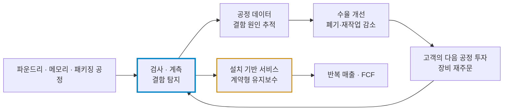
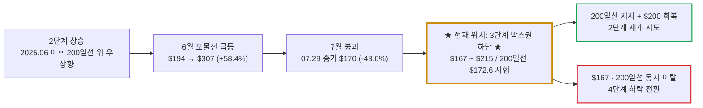

# KLA(KLA Corporation / KLAC) 실전 재무 및 가치 분석 보고서

- **작성일**: 2026-09-11

대중은 6월 한 달 +57% 폭등과 그 뒤 한 달 만의 -44% 폭락이라는 롤러코스터만 기억한다. 정작 봐야 할 것은 수주잔고가 $125.7억(+60%)으로 폭증한 바로 그 분기에 FCF가 23% 줄어든 이유, 그리고 6월 고점이 FY27 이익의 61배라는 미친 가격을 요구했다는 사실이다. 지금의 $177은 싸진 가격이 아니라 광기가 빠진 가격이다. 사업은 S급이지만, 손익비가 나오는 자리는 200일선 바로 위 몇 달러 구간뿐이다.

## 핵심 요약

| 구분 | 핵심 요약 |
| :--- | :--- |
| **종목 및 주가** | KLA (NASDAQ: `KLAC`) / **$177.18** (52주 범위 $93.75 ~ $307.37, 고점 대비 **-42.4%**) |
| **최종 투자의견** | **관망 후 조건부 분할 매수 (Buy on Support)** / 200일선($172.57) 지지 확인 전 추격 금지 (투자 가치 점수 **77.3점**, 6.1절) |
| **비즈니스 본질** | 칩 경쟁의 승자가 누구든 공정이 복잡해질수록 결함 검사·계측 횟수에 비례해 통행세를 걷는 공정 제어 1위 사업자 |
| **핵심 매력 (Bull)** | 수주잔고 $125.7억(YoY +60%), FY27 1분기 매출 가이던스 $40억(YoY +24.6%), 매출총이익률 61.3%·ROE 87.5%, 자사주 잔여 한도 $97.4억 |
| **핵심 리스크 (Bear)** | 4분기 FCF YoY -23.1%(매출채권 급증), 중국 매출 29.8%, 메모리 원가발 마진 역풍 100bp 이상, TSMC 매출 의존 약 19%, P/S 17.0배 |
| **포트폴리오 성격** | AI 반도체 설비투자 사이클에 올라탄 **고품질 경기민감 공격수(베타 1.44)** / **분할 뒤 낮아진 주당 가격만 보고 덤비는 단타족은 매수 금지** |

---

## 1. 비즈니스 실체: 칩을 만드는 회사가 아니라 불량을 숨길 수 없게 만드는 회사

반도체는 수백 단계 공정 중 한 단계만 틀어져도 웨이퍼 전체의 수율이 무너진다. 2나노 GAA, 12단 이상 쌓아 올리는 HBM, 칩 여러 개를 한 기판에 묶는 첨단 패키징으로 갈수록 결함이 숨을 곳은 많아지고, 결함 하나가 날리는 돈의 크기도 커진다.

KLA는 이 결함을 찾아내고, 어느 공정에서 틀어졌는지 데이터로 짚어 주는 검사·계측 장비와 소프트웨어, 유지보수 서비스를 판다. 엔비디아가 이기든, 구글 TPU가 이기든 상관없다. 칩이 복잡해질수록 검사 횟수가 늘고, 검사 횟수가 늘수록 KLA의 매출이 늘어난다. 대중이 AI 칩 설계사의 점유율 싸움에 목을 맬 때, 이 회사는 모든 팹의 품질 관문에서 조용히 통행세를 걷는다.

| FY26 제품 범주 | 매출 | 비중 | YoY | 돈 버는 구조 |
| :--- | ---: | ---: | ---: | :--- |
| **Wafer Inspection** | $66.31억 | 49% | +7% | 광학·전자빔으로 웨이퍼 미세 결함을 잡는 핵심 장비. FY25 +43% 폭증 뒤 성장이 식었다 |
| **Services** | $31.26억 | 23% | +16% | 설치 장비 유지보수. 경영진에 따르면 서비스 매출의 80%가 계약 기반이라 장비 사이클을 완충한다 |
| **Patterning** | $27.07억 | 20% | +23% | 노광 공정의 오버레이·선폭 계측. FY26 성장의 새 엔진 |
| **Specialty Semiconductor Process** | $5.03억 | 4% | -3% | 특수 증착·식각 장비. 성장 기여는 사실상 없다 |
| **PCB and Component Inspection** | $4.60억 | 3% | +29% | 첨단 패키징 기판·부품 검사 |
| **기타** | $1.53억 | 1% | -25% | 리퍼비시·구형 장비 업그레이드 |
| **합계** | **$135.79억** | 100% | **+12%** | — |

출처: [KLA FY2026 Form 10-K](https://www.sec.gov/Archives/edgar/data/319201/000031920126000027/klac-20260630.htm), [FY2026 4분기·연간 실적 발표](https://ir.kla.com/news-events/press-releases/detail/518/kla-corporation-reports-fiscal-2026-fourth-quarter-and-full)

FY26 성장의 무게중심은 이미 옮겨 갔다. 매출의 절반인 Wafer Inspection은 +7%에 그쳤고, 성장을 끌어올린 건 Patterning(+23%)과 Services(+16%)다. "AI 수혜로 검사 장비가 날개 돋친 듯 팔린다"는 서사는 FY25에 이미 가격에 반영됐다. FY26 숫자는 그 서사의 연장이 아니라 성장 엔진의 교대를 보여 준다.

### 1.1 수요 지도: 누가 KLA에 돈을 내는가

| 지역 (출하지 기준) | FY26 매출 | 비중 | YoY | FY24 비중 | 냉혹한 해석 |
| :--- | ---: | ---: | ---: | ---: | :--- |
| **중국** | $40.48억 | 29.8% | +0.1% | 42.8% | 비중만 줄었지 금액은 제자리다. 10-K는 레거시 공정 투자와 수출통제 효과가 서로 상쇄됐다고 적시한다 |
| **대만** | $36.44억 | 26.8% | +13.7% | 17.7% | TSMC 선단 공정 투자의 직접 수혜 |
| **한국** | $18.34억 | 13.5% | +26.2% | 9.2% | HBM·DRAM 증설이 숫자로 찍힌 곳 |
| **북미** | $17.57억 | 13.0% | +29.0% | 10.9% | 미국 내 신규 팹 투자 |
| **일본** | $9.15억 | 6.7% | -19.2% | 9.8% | 주요 지역 중 유일한 역성장 |
| **유럽·이스라엘** | $7.27억 | 5.4% | +26.6% | 5.6% | 규모는 작지만 성장 중 |
| **기타 아시아** | $6.54억 | 4.8% | +69.6% | 4.0% | 싱가포르·말레이시아 등 패키징 거점 |

TSMC 한 곳이 FY25와 FY26 모두 매출의 **약 19%**를 차지했다. 최고의 고객이자 최대의 집중 리스크다. TSMC가 설비투자 속도를 한 분기만 늦춰도 KLA의 분기 실적은 흔들린다.

### 1.2 해자는 강하다. 그러나 '완전 독점'은 홍보 문구다

KLA의 해자는 장비 한 대의 성능이 아니라 누적된 결함 데이터, 고객 공정에 맞춘 인증 이력, 전 세계 설치 기반, 9,100건 이상의 활성 특허가 결합된 구조다. 팹 엔지니어가 수년간 KLA 장비의 데이터 체계에 맞춰 공정 관리 기준을 짜 놓았으니, 싸다는 이유로 다음 날 장비를 바꿀 수 없다.

그렇다고 "검사·계측 시장 사실상 독점"을 증서처럼 쓰는 순간 분석은 홍보문이 된다. 어플라이드 머티어리얼즈는 전자빔 검사로, 온토 이노베이션·노바는 계측으로 파고들고, 중국은 자국 장비 국산화를 국가 과제로 밀어붙인다. 경영진 스스로도 수출통제 때문에 경쟁사가 영업하는 중국 팹 일부 구간에서 KLA가 배제돼 있다고 인정했다. 강한 해자와 영구 독점은 전혀 다른 말이다.

---

## 2. 최근 3개월 핵심 뉴스 및 실적 흐름 심층 분석 (2026년 6월 ~ 8월)

### 2.1 최근 3개월 핵심 뉴스 타임라인 (2026.06.11 ~ 2026.08.12)

2026년 6월 초부터 8월 중순까지 쏟아진 17건의 핵심 뉴스는 KLA가 **'오라클·TSMC·테슬라·인텔로 이어지는 글로벌 초대형 CAPEX 전쟁의 핵심 관문'**으로서 누린 사상 최대의 포물선 랠리와, 그 직후 시장의 과도한 눈높이가 빚어낸 냉혹한 멀티플 재산정 과정을 적나라하게 보여준다.

| 일자 | 주요 뉴스 및 시장 이벤트 | 영향도 | 스마트머니 관점의 핵심 분석 및 시사점 |
| :--- | :--- | :---: | :--- |
| **08.12** | **인텔 200억 달러 공모 자금 조달 발표로 ASML·KLA 등 장비주 수혜 전망** | `🟢 CAPEX 낙수` | 인텔이 AI 반도체, 커스텀 ASIC, 파운드리, 첨단 패키징 투자를 위해 200억 달러 규모 자금 조달(주당 $95에 2.1억 주 매각) 발표. 배런스와 키뱅크는 리소그래피(ASML)뿐만 아니라 초미세 결함 검사·계측의 KLA(KLAC), AMAT, LRCX로 설비 투자 낙수효과가 직결될 것으로 분석 |
| **08.06** | **테슬라, 텍사스에 168억 달러 규모 자체 반도체 팹 'Terafab' 신설 공식 발표** | `🟢 메가 호재` | 테슬라가 텍사스주 Grimes 카운티에 전기차·휴머노이드 로봇 및 스페이스X 위성, xAI 데이터센터용 AI 칩을 자체 생산하기 위한 초대형 팹 건설 발표. 신규 선단 팹 구축에 필수적인 KLA, ASML, AMAT, LRCX 장비 수주 파이 급증 전망 |
| **08.04** | **씨티, "WFE 슈퍼사이클 가속... '28년 최대 2,500억 달러 전망"** | `🟢 업황 상향` | 씨티는 KLA와 램리서치 등 핵심 장비사들의 2분기 가이던스 상향을 근거로 WFE 시장 규모가 '26년 1,500억$ 이상, '27년 1,900억$ 이상, '28년 2,000억~2,500억$로 폭증할 것으로 분석. 이미 팹 리드타임 지연으로 2029년 이후 장비 주문 논의가 개시되었다고 강조 |
| **07.30** | **모건스탠리($253)·웰스파고($245), 목표가 하향 속 '27년 WFE 초과성장 확신** | `🟢 저가 매수` | 모건스탠리는 단기 실적이 눈높이에 미달했으나 '27년 성장 신뢰는 높아졌다고 평가. 웰스파고는 실적 전 과열되었던 단기 기대치가 리셋되는 과정일 뿐이라며, '27년 KLA가 WFE 시장 성장률을 초과 달성할 독보적 입지를 감안할 때 이번 주가 조정을 절호의 매수 기회로 규정 |
| **07.30** | **RBC($180 상향, 공정제어 집약도 상승) vs BofA($260 하향, 배수 정상화)** | `🟡 밸류에이션` | RBC는 WFE 전망 상향, 하반기 가속, 공정 제어 집약도의 구조적 상승 및 서비스 부문 두 자릿수 성장을 주목하며 $180으로 상향. BofA는 6월 분기 호실적을 반영해 '26~'27년 EPS 추정치를 7~14% 상향했으나 섹터 전반의 밸류에이션 배수 조정을 반영해 목표가를 $317에서 $260으로 하향 |
| **07.30** | **도이치방크($195 하향)·서스퀘하나($215 하향), 상회폭 제한 및 마진 정체 지적** | `🔴 기대치 미달` | 도이치방크는 실적·가이던스가 컨센서스를 넘었으나 상회 폭이 미미해 높은 시장 기대치를 만족시키지 못했다고 평가하며 $195로 하향. 서스퀘하나는 실행력은 우수하나 WFE 대비 초과성장 폭이 제한적이고 매출총이익률 상승 여력이 크지 않다며 $215로 하향 |
| **07.29** | **실적 발표 직후 높은 눈높이 대비 가이던스 실망에 프리마켓 -7.5% 급락** | `🔴 단기 수급` | 실적 발표 후 시간외 거래에 이어 프리마켓에서도 7.5% 급락세 지속. 장 시작 전부터 차익 매물이 쏟아지며 정규장 -10.80%($170.19) 폭락의 도화선으로 작용 |
| **07.29** | **★ FY26 Q4 실적 발표: 매출 $36.6억(+15.2%)·EPS $1.05 비트 불구 시간외 -9.6% ★** | `🔴 호실적 속 폭락` | Q4 매출 $36.6억, 비GAAP EPS $1.05로 컨센서스 상회. 1분기 가이던스(매출 $40억, EPS $1.16) 역시 월가 예상 돌파. 10대 1 주식분할(06.11) 소급 적용. 그러나 수주잔고 폭증 속에서도 분기 FCF가 YoY -23.1% 급감하고 운전자본 부담이 드러나며 시간외에서 9.6% 폭락 |
| **07.17** | **TSMC, 2026년 CAPEX 600억~640억 달러로 대증액 발표 (KLA Top Pick 선정)** | `🟢 메가 호재` | TSMC가 AI 메가트렌드 가시성을 확신하며 연간 CAPEX를 기존 520억~560억$에서 600억~640억$로 대폭 상향. 캔터 피츠제럴드는 KLA, ASML, AMAT, LRCX를 섹터 Top Pick으로 선정. 향후 3년간 전례 없는 설비투자 가속 공식화 |
| **07.13** | **스티펄, "AI 에이전트 확산으로 WFE 폭증" KLA 목표주가 $191→$270 상향** | `🟢 수직 상향` | AI 에이전트 확산으로 메모리·로직 수요 곡선이 가팔라졌으나 공급능력은 구조적으로 비탄력적이라 진단. '26년 WFE 1,450억~1,500억$, '27년 1,920억$, '28년 2,250억$로 전망하며 KLA 목표주가를 $191에서 $270으로 41% 파격 상향 |
| **07.07** | **골드만삭스, "메모리 아키텍처 변화로 KLA 일부 검사 서비스 둔화 우려" (신중론)** | `🔴 노이즈/경계` | AMD, AMAT, ON은 상승 여력이 있으나 KLA와 ARM에 대해서는 하락 리스크를 지적. 메모리 배치 방식 변화가 일부 KLA 서비스 필요성을 낮출 수 있다는 신중론 제기 |
| **06.23** | **BofA, "2030년 반도체 TAM 2.7조 달러... WFE 슈퍼사이클" KLA 목표가 $317 상향** | `🟢 스마트머니` | 하이퍼스케일러 데이터센터 투자가 '28년까지 지속되며 반도체 TAM이 '30년 2.7조 달러로 성장(연평균 28%)할 것으로 전망. WFE 시장 '27년 1,900억$, '28년 2,500억$ 전망에 힘입어 KLA 목표주가를 $210에서 $317(분할 환산)로 상향 |
| **06.17** | **씨티, "강력한 DRAM·NAND 수요로 WFE 가속" KLA 목표가 $206→$290 상향** | `🟢 실적 상향` | 강세 시나리오에서 WFE 시장이 '26년 1,450억$, '27년 2,000억$, '28년 2,500억$로 폭발할 것으로 예상. TSMC, 인텔, 삼성전자 증설과 AI 에이전트용 고성능 메모리 수요를 근거로 KLA 목표가 $206에서 $290으로 상향 |
| **06.12** | **미국-이란 종전 MOU 기대감 및 반도체 랠리에 필라델피아 지수 +8% 폭등** | `🟢 매크로/수급` | 지정학 리스크 완화와 유가 급락 속 글로벌 반도체주 폭등. 키옥시아 시총 44조 엔 돌파 등 낸드·메모리 투자 폭증 기대감에 KLA, AMAT, LRCX, MU 등 반도체 장비·메모리 핵심주 10% 이상 동반 폭등 |
| **06.12** | **★ 오라클 200억 달러 AI CAPEX 발표 낙수효과로 KLA 하루 만에 +12.92% 폭등 ★** | `🟢 메가 팩트` | 6월 11일 오라클의 200억 달러 규모 자본 조달 발표로 AI 데이터센터 증설 자금이 장비사 수주잔고로 직결된다는 확신 확산. KLA +12.92%(종가 $219.07), LRCX +12.65%, AMAT +11.19%, ASML +9.53% 포물선 랠리 폭발 |
| **06.11** | **짐 크레이머, "위험 회피 국면에서도 견고한 현금흐름의 KLA·AMAT 52주 신고가"** | `🟢 시장 센티` | 시장이 위험자산을 회피하고 경기 방어주로 이동하는 국면에서도 메모리 슈퍼사이클과 독점적 현금흐름을 증명한 KLA와 AMAT가 기술주 중 유일하게 52주 신고가 명단에 올랐다고 평가 |
| **06.11** | **캔터 피츠제럴드, WFE 전망 상향 및 KLA 목표가 $2,500 제시 (분할 전 기준)** | `🟢 사이클 시작` | 클린룸 확보 지연으로 반도체 숏티지가 3년간 지속될 것으로 전망하며 '26년 WFE 1,450억$, '27년 1,850억$, '29년 2,500억$ 제시. KLA에 비중확대 및 목표가 2,500달러(10대 1 주식분할 전 기준, 분할 환산 $250) 제시하며 6월 랠리의 기폭제 제공 |

출처: yfinance `KLAC` 일봉·`upgrades_downgrades`, 주요 투자은행(IB) 리서치 보고서, SEC 공시.

실적 발표일의 -10.8%를 "KLA 실적 쇼크"로 읽는 자는 날짜를 안 본 것이다. 발표 당일 정규장부터 반도체 섹터 전체가 중국 메모리 굴기와 AI 투자 회수 공포에 두들겨 맞고 있었다. KLA는 섹터 투매의 한가운데서 숫자를 냈고, 시장은 숫자보다 6월에 쌓아 올린 멀티플을 먼저 털어냈다.

### 2.2 뉴스 흐름으로 본 4대 핵심 구조적 변화와 스마트머니의 의도

지난 3개월간 쏟아진 17건의 뉴스 타임라인을 관통하는 거대 자본의 진짜 의도와 **4대 구조적 판도 변화**는 명확하다.

- **① 빅테크 CAPEX 폭탄과 WFE 슈퍼사이클의 2차 가속**:
    - 6월 11일 오라클의 200억 달러 자본 조달 발표를 시작으로 7월 17일 TSMC의 2026년 CAPEX 600억~640억 달러 대증액, 8월 6일 테슬라의 168억 달러 'Terafab' 신설, 8월 12일 인텔의 200억 달러 공모 조달까지 천문학적인 팹 증설 경쟁이 확정됐다.
    - 글로벌 IB(캔터, 씨티, BofA, 스티펄)들은 입을 모아 WFE(웨이퍼 팹 장비) 시장 전망치를 2026년 1,450억~1,500억 달러에서 2027년 1,900억 달러, 2028년 2,500억 달러로 줄상향했다. 반도체 선단 공정(2나노 GAA, HBM3E/4)과 클린룸 확보 지연으로 장비 리드타임이 늘어나며 KLA의 수주잔고는 $125.7억(+60%)으로 폭증했다.
- **② 6월의 포물선 광기와 주식분할 착시**:
    - 6월 11일 하루 만에 +12.92% 폭등하고 6월 12일 10대 1 주식분할이 단행되자 개미들은 "주가가 싸졌다"는 착시에 빠져 추격 매수에 나섰다. BofA($317), 캔터($325) 등 IB들의 목표가 연쇄 상향 속에 주가는 6월 30일 장중 $307.37(월간 +58.4%)까지 치솟았다.
    - 그러나 이 고점은 FY27 예상 순이익의 61배를 요구하는 극단적 과열 상태였다. 기업가치는 1달러도 늘지 않았는데 수급과 분할 거품이 만들어낸 치명적인 오버슈팅이었다.
- **③ '컨센서스 비트'에도 시간외 -9.6%·정규장 -10.8% 급락한 진짜 이유**:
    - 7월 29일 실적 발표에서 Q4 매출($36.6억, YoY +15.2%)과 비GAAP EPS($1.05)는 모두 시장 예상치를 넘겼다. 1분기 가이던스(매출 $40억, EPS $1.16) 역시 컨센서스를 상회했다.
    - 그럼에도 주가가 이틀 만에 고점 대비 -44% 폭락한 것은 실적 쇼크가 아니라, 6월에 당겨 쓴 60배 멀티플에 대한 청구서였다. 분기 영업현금흐름(-22.2%)과 FCF(-23.1%)가 역성장하고 매출총이익률 상승 여력이 제한적이라는 사실이 드러나자 모건스탠리, 웰스파고, 도이치방크 등이 목표주가를 일제히 $245~$253 수준으로 낮추며 기대치를 리셋했다.
- **④ 200일선 지지와 공정 제어 집약도의 구조적 하방 안전판**:
    - 골드만삭스의 메모리 아키텍처 변화에 따른 일부 검사 서비스 둔화 신호나 중국 장비 수출통제 노이즈가 단기 주가를 눌렀으나, 수율이 칩의 승패를 가르는 2나노 및 첨단 패키징에서 KLA의 독점적 공정 제어 집약도는 오히려 상승하고 있다.
    - 광기가 빠진 주가는 6월 이전 출발점이자 장기 지지선인 200일선($172.57) 부근까지 내려앉았으며, 웰스파고와 RBC가 지적했듯 밸류에이션 거품이 정상화된 자리가 실질적인 분할 매수 기회로 전환되고 있다.

### 2.3 FY26 4분기·연간 숫자 팩트 체크

| 지표 | Q4 FY26 | YoY | FY26 | YoY |
| :--- | ---: | ---: | ---: | ---: |
| **총매출** | $36.58억 | **+15.2%** | **$135.79억** | +11.7% |
| **GAAP 매출총이익률** | 61.4% | -0.6%p | 61.3% | +0.4%p |
| **GAAP 영업이익률** | 42.5% | -0.1%p | 41.7% | +0.4%p |
| **GAAP 순이익** | $13.63억 | +13.3% | **$48.31억** | +18.9% |
| **GAAP 희석 EPS** | $1.04 | +14.8% | $3.66 | +20.5% |
| **비GAAP 희석 EPS** | $1.05 | 예상 $1.00 대비 **+5.1%** | $3.76 | — |
| **영업현금흐름** | $9.06억 | **-22.2%** | $41.43억 | +1.5% |
| **FCF** | $8.17억 | **-23.1%** | **$37.67억** | +0.5% |
| **주주환원** | $8.76억 | — | **$33.48억** | 배당 $10.58억 + 자사주 $22.90억 |
| **수주잔고 (6월 30일)** | **$125.7억** | **+59.9%** | — | FY26 매출의 0.93배 |

출처: [FY2026 실적 발표](https://ir.kla.com/news-events/press-releases/detail/518/kla-corporation-reports-fiscal-2026-fourth-quarter-and-full), [FY2026 Form 10-K](https://www.sec.gov/Archives/edgar/data/319201/000031920126000027/klac-20260630.htm), yfinance `quarterly_income_stmt`·`quarterly_cashflow`·`earnings_history`

손익계산서는 흠잡을 데가 없다. 5개 분기 연속 비GAAP EPS가 예상치를 넘었고, 수주잔고는 1년 새 $78.6억에서 $125.7억으로 불었다. 문제는 현금흐름표다. 매출이 +15% 늘어난 분기에 FCF가 -23% 줄었다.

### 2.4 5분기 추이: 매출은 가속, 현금은 역행

| 분기 | Q4 FY25 | Q1 FY26 | Q2 FY26 | Q3 FY26 | Q4 FY26 | Q1 FY27 (가이던스) |
| :--- | :---: | :---: | :---: | :---: | :---: | :---: |
| **총매출** | $31.75억 | $32.10억 | $32.97억 | $34.15억 | **$36.58억** | **$40.0억 ± $2.0억** |
| **전분기 대비** | — | +1.1% | +2.7% | +3.6% | **+7.1%** | **+9.4%** (중앙값) |
| **GAAP 매출총이익률** | 62.0% | 61.3% | 61.4% | 61.1% | 61.4% | 61.6% ± 1.0% |
| **GAAP 영업이익률** | 42.6% | 41.7% | 41.3% | 41.2% | 42.5% | — |
| **비GAAP EPS (실제 / 예상)** | $0.94 / $0.86 | $0.88 / $0.86 | $0.89 / $0.88 | $0.94 / $0.92 | **$1.05 / $1.00** | $1.16 ± $0.10 (컨센서스 $1.18) |
| **FCF** | $10.62억 | $10.66억 | $12.62억 | **$6.22억** | **$8.17억** | — |

- **매출은 분기마다 가속한다**: 전분기 대비 성장률이 +1.1% → +2.7% → +3.6% → +7.1%로 네 분기 연속 올라갔고, 1분기 가이던스 중앙값은 +9.4%다. 전년 동기 대비로는 +24.6%다. 사이클이 꺾였다는 주장은 이 숫자 앞에서 설 자리가 없다.
- **마진은 오르지 않는다**: 매출이 이만큼 가속하는데 매출총이익률은 61~62%에 갇혀 있다. 영업 레버리지가 원가 역풍에 잡아먹히고 있다는 뜻이다. 원인은 2.5절에서 경영진이 직접 밝혔다.

#### 현금 감소의 정체: 매출채권과 재고가 현금을 삼켰다

2025년 12월 말 $22.27억이던 매출채권 합계는 2026년 6월 말 **$31.90억**으로 두 분기 만에 **$9.63억(+43%)** 늘었다. 같은 기간 재고도 $3.66억 늘었다. 3·4분기 운전자본 변동이 영업현금흐름에서 빼 간 돈은 합계 **$14.26억**이다. 매출채권 회수 기간(DSO)은 2분기 약 58일에서 4분기 약 72일로 14일 길어졌다.

즉 FCF 감소는 수요 붕괴가 아니다. 분기 후반에 출하가 몰리고 하반기 매출 +20%를 준비하는 재고를 쌓으면서 생긴 운전자본 흡수다. 그렇다고 "곧 회복된다"고 넘어가는 것도 게으른 짓이다. 회수 기간이 두 분기 연속 늘어났다는 사실은 10월 28일 FY27 1분기 발표에서 반드시 확인해야 할 경고등이다.

### 2.5 경영진이 제시한 사이클 숫자와 스스로 인정한 역풍

7월 28일 실적 콜에서 경영진은 호재와 역풍을 동시에 꺼내 놓았다. 호재만 골라 듣는 자는 마진을 놓치고, 역풍만 골라 듣는 자는 수주를 놓친다.

| 구분 | 경영진 제시 내용 | 투자 해석 |
| :--- | :--- | :--- |
| **2026년 WFE 시장** | 기존 $1,400억대 → **$1,500억대 초반**으로 상향 (2025년 약 $1,200억) | 업황 전망 상향은 실재한다 |
| **2027년 WFE 시장** | 업계 계획 기준 **약 $1,900억** 수준 논의 | 컨센서스 수준을 인용한 것이지 회사 가이던스가 아니다 |
| **첨단 패키징 매출** | 2026년 약 **$11억**, 전년 대비 +70% 이상 (시장 성장률의 약 2배) | AI 패키징 복잡도가 매출로 찍히는 구간 |
| **하반기 매출** | 2026년 하반기 매출이 상반기 대비 약 **+20%** | 1분기 가이던스 $40억과 정합 |
| **리드타임** | 전반적으로 약 12개월, 일부 제품 **18~24개월** | 고객은 이미 2027년 하반기 인도분을 논의 중 |
| **서비스** | Q4 +17%, 장기 목표 13~15% 중 2027년 상단 가속 | 사이클 완충재가 두꺼워진다 |
| **메모리 원가** | 메모리 가격 상승이 마진을 **약 100bp 이상** 깎고 2027년까지 지속 | 마진이 61%대에 갇힌 직접 원인 |
| **관세** | 매출총이익률 역풍으로 언급, 제조 규모 효과로 일부 상쇄 | 정량 수치는 비공개 |
| **공급망** | 장기 리드타임 부품이 상반기 실적을 제약, 광학 부품 공급사와 2029년 이후까지 장기 생산능력 계약 체결 | 수요가 아니라 공급이 병목이었다는 뜻 |

출처: [FY2026 4분기 실적 콜 요약](https://finance.yahoo.com/markets/stocks/articles/kla-corporation-q4-2026-earnings-123000079.html), [실적 콜 전사 보도](https://www.investing.com/news/transcripts/earnings-call-transcript-kla-beats-q4-2026-estimates-but-shares-fall-93CH-4818299)

### 2.6 대중의 착시 vs 숫자의 팩트

| 시장이 떠드는 것 (착시) | 데이터가 말하는 것 (팩트) |
| :--- | :--- |
| **"실적 발표 날 -10.8%는 수요가 꺾였다는 신호다"** | 같은 분기 수주잔고 +60%, 1분기 매출 가이던스 YoY +24.6%. 꺾인 건 수요가 아니라 6월에 FY27 이익의 61배까지 부풀었던 멀티플이다 |
| **"FCF -23%는 영업이 망가졌다는 증거다"** | 매출채권 두 분기 +$9.63억, DSO 58일 → 72일. 운전자본 흡수다. 다만 회수 지연이 두 분기 연속이라는 점은 무시하면 안 된다 |
| **"61% 마진은 영원한 독점 마진이다"** | 경영진 스스로 메모리 원가가 2027년까지 100bp 넘게 마진을 깎는다고 했다. 가이던스 61.6%는 붕괴가 아니라 정체다 |
| **"중국 비중이 줄었으니 리스크가 해소됐다"** | 비중은 42.8% → 29.8%로 줄었지만 금액은 $40.5억으로 그대로다. 수출통제 한 번이면 여전히 매출의 30%가 흔들린다 |
| **"10대 1 분할로 주식이 싸졌다"** | 분할은 주식 수를 10배로 늘렸을 뿐이다. 시가총액 $2,315억과 P/S 17배는 한 푼도 변하지 않았다 |
| **"애널리스트 최저 목표가 $175가 바닥이다"** | 목표가는 추정치다. 현재가와의 차이는 1.2%에 불과하고, 어느 누구도 하방을 보장하지 않는다 |

---

## 3. 경쟁 해자 및 피어 그룹 잔혹 비교

### 3.1 반도체 장비 빅4 정밀 비교

| 시장 지표 | KLA `KLAC` | 어플라이드 `AMAT` | 램리서치 `LRCX` | ASML `ASML` |
| :--- | ---: | ---: | ---: | ---: |
| **주가 ($)** | 177.18 | 454.01 | 298.01 | 1,687.43 |
| **시가총액** | $2,315억 | $3,603억 | $3,729억 | $6,481억 |
| **52주 고점 대비** | **-42.4%** | -38.6% | -32.0% | -15.6% |
| **200일선 대비** | **+2.7%** | +10.9% | +13.5% | +13.4% |
| **공급자 선행 PER** | 26.4배 | 24.6배 | 25.6배 | 28.1배 |
| **P/S (TTM)** | 17.0배 | 11.7배 | 16.1배 | 통화 혼재로 미기재 |
| **TTM GAAP 매출총이익률** | **61.3%** | 49.4% | 50.5% | 51.6% |
| **TTM GAAP 영업이익률** | **41.7%** | 31.1% | 35.3% | 32.7% |
| **ROE** | **87.5%** | 41.1% | 65.1% | 53.9% |
| **최근 분기 매출 YoY** | 15.2% | 24.8% | **30.0%** | 21.3% |
| **당해 회계연도 컨센서스 EPS 성장률** | +45.0% | +35.8% | **+62.6%** | +54.6% |

출처: yfinance `info`·`ttm_income_stmt`·`earnings_estimate`, 2026-09-11 조회. 회계연도 종료월이 KLA·램리서치 6월, 어플라이드 10월, ASML 12월로 서로 달라 컨센서스 성장률은 같은 기간 비교가 아니다. ASML은 유로 재무와 달러 주가가 섞여 공급자 P/S가 왜곡되므로 제외했다.

### 3.2 피어 대비 핵심 경쟁력 및 리스크 판정

- **① 수익성은 빅4 압도적 1등이다**:
    - 매출총이익률 61.3%, 영업이익률 41.7%, ROE 87.5%로 세 지표 모두 2위와 격차가 크다. ROE는 자사주 매입으로 자본을 줄인 효과도 섞여 있지만, 영업이익률 41.7%는 회계 기교로 만들 수 없는 숫자다.
- **② 그런데 낙폭도 1등이고, 200일선에 가장 가깝다**:
    - 고점 대비 -42.4%로 빅4 중 가장 많이 빠졌고, 200일선 이격은 +2.7%로 가장 좁다. 6월 한 달 +58.4%라는 가장 가파른 포물선을 그렸으니, 가장 가파르게 되돌린 것이다. 수익성이 좋다고 멀티플 조정에서 면제되지 않는다.
- **③ 성장률은 빅4 꼴찌다**:
    - 최근 분기 매출 성장률 15.2%는 램리서치(30.0%)의 절반이다. 수주잔고 +60%와 12~24개월의 리드타임은 성장이 매출로 넘어오기 전 대기열에 쌓여 있다는 신호다. 다만 "준비됐다"와 "넘어왔다"는 다르다. 1분기 +24.6%가 실제로 찍혀야 한다.
- **④ 가격표는 싸지 않다**:
    - 선행 PER 26.4배는 빅4 중간이지만 P/S 17.0배는 어플라이드(11.7배)보다 45% 비싸다. 높은 마진이 높은 P/S를 정당화하지만, 마진이 61%에 갇혀 있는 동안에는 추가 재평가 여지가 제한된다.

---

## 4. 기술적 사이클 위치: 포물선 붕괴 뒤 3단계 박스권 하단

| 2026-09-10 미국장 마감 기준 | 값 | 현재가($177.18) 대비 | 기술적 판정 |
| :--- | ---: | ---: | :--- |
| **52주 최고가** | $307.37 (06.30 장중) | **-42.4%** | 6월 포물선 고점. 복귀까지 +73%가 필요하다 |
| **8월 반등 고점** | $214.80 (08.13 장중) | -17.5% | 박스권 상단이자 첫 번째 두꺼운 매물대 |
| **50일 단순이동평균** | $200.17 | **-11.5%** | 8월 13일 $221.98에서 하락 전환. 단기 추세는 아래를 향한다 |
| **200일 단순이동평균** | $172.57 | **+2.7%** | 여전히 우상향. 장기 추세의 마지막 방어선 |
| **최근 저점** | $167.05 (09.03 장중) | -5.7% | 7월 29일 종가 저점 $170.19와 함께 박스권 하단 |
| **52주 최저가** | $93.75 | +89.0% | 싸다는 뜻이 아니라 변동성이 크다는 뜻이다 |
| **거래량 (09.10)** | 1,049만 주 | 50일 평균의 0.91배 | 투매 클라이맥스도, 매집 급증도 없다 |

가격·이동평균은 yfinance `KLAC` 수정 전 일별 종가로 계산했다.

### 4.1 차트가 말하는 냉혹한 현실

- **① 200일선은 아직 한 번도 뚫리지 않았다**:
    - 최소 2025년 6월 말 이후 15개월 동안 KLAC는 200일선 아래로 종가를 마감한 적이 없다. 7월 29일 투매 종가 $170.19조차 당시 200일선($161.72)보다 5.2% 위였다. 장기 기관 자금의 추세선은 살아 있다.
- **② 그러나 방어선과의 거리가 5.2%에서 2.7%로 좁혀졌다**:
    - 주가는 7월 저점과 비슷한 자리인데, 200일선이 그사이 $11 올라왔다. 다음 하락 파동이 오면 이번에는 200일선이 실제로 시험대에 오른다. 7월과 같은 -10% 급락 하루면 추세선이 깨진다.
- **③ 4단계 확정은 아니다. 하지만 3단계의 전형이다**:
    - 와인스타인 모델의 기준인 30주 이동평균은 여전히 상승 중이고 주가는 그 위에 있다. 따라서 "4단계 하락 말미"라는 판정은 이르다. 반대로 50일선은 꺾여 내려오고, 6주째 $167~$215 박스에 갇혀 있으며, 반등마다 50일선 아래에서 밀린다. 급등 뒤 추세가 옆으로 눕는 3단계 분산 구간의 교과서다.
- **④ 거래량은 아직 방향을 말하지 않는다**:
    - 9월 1~3일 저점 구간 거래량은 50일 평균의 0.53~0.86배로 말랐고, 9월 4일 반등(+7.32%)도 1.08배에 그쳤다. 매도세가 지친 것은 맞지만, 새로운 매수 주체가 들어왔다는 증거도 없다.

---

## 5. 밸류에이션 및 가격 타당성 검증

### 5.1 현재 가격이 요구하는 것

| 지표 | 값 | 산출 기준 및 냉혹한 해석 |
| :--- | ---: | :--- |
| **시가총액** | $2,314.9억 | 반도체 장비 빅4 중 4위 |
| **후행 PER** | 48.4배 | FY26 GAAP EPS 기준. 사이클 상승기라 높게 보인다 |
| **FY27 컨센서스 PER** | **32.5배** | $177.18 ÷ EPS $5.45 (24명, +45.0%). 2027년 6월 결산까지 약 9개월 남았다 |
| **FY28 컨센서스 PER** | 26.5배 | $177.18 ÷ EPS $6.69 (22명, +22.7%). 21개월 뒤의 이익을 당겨 쓴 배수다 |
| **P/S (TTM)** | 17.0배 | FY26 매출 $135.8억 기준 |
| **FY27 컨센서스 P/S** | 12.8배 | 매출 컨센서스 $181.1억(+33.4%) 기준 |
| **EV/EBITDA** | 39.7배 | 순차입 약 $12.5억(총차입 $61.5억 − 현금·단기투자 $49.0억) 반영 |
| **FY26 FCF 수익률** | 약 1.6% | $37.67억 ÷ 시가총액. 현금 창출력은 강하지만 가격은 싸지 않다 |
| **배당수익률 / 자사주 잔여 한도** | 0.52% / $97.4억 | 분기 배당 $0.23(분할 환산 +21% 인상). 잔여 한도는 시가총액의 4.2% |

출처: yfinance `info`·`earnings_estimate`·`revenue_estimate`, 자사주 한도는 FY2026 10-K 기준.

### 5.2 6월 고점이 요구했던 가격표 vs 지금의 가격표

90일 전 FY27 EPS 컨센서스는 $5.02였다. 6월 30일 장중 고점 $307.37은 그 이익의 **61.3배**를 요구했다. 그 뒤 90일 동안 컨센서스는 $5.45로 **+8.7% 올랐고**, 주가는 **-42.4% 빠졌다**. 이익 전망은 좋아졌는데 주가가 반토막 난 것, 이게 멀티플 압축의 정의다.

지금의 FY27 PER 32.5배는 6월의 광기에서는 내려왔지만 싸다고 부를 수준도 아니다. 이익이 +45% 늘어난다는 컨센서스를 전부 믿어야 겨우 성립하는 가격이다.

### 5.3 EPS와 배수 가정에 따른 가격 민감도

아래는 가정을 바꿔 계산한 민감도 표다. 회사 가이던스도, 목표주가도 아니며, 각 경우에 확률을 부여하지 않았다.

| 시나리오 | FY27 EPS 가정 | 적용 PER | 계산 가격 | $177.18 대비 | 필요한 조건 |
| :--- | ---: | ---: | ---: | ---: | :--- |
| **하방 스트레스** | $4.90 | 24배 | $117.60 | **-33.6%** | 수출통제 강화·메모리 원가 확대·고객 설비투자 이연 |
| **중간 민감도** | $5.45 | 32배 | $174.40 | -1.6% | 컨센서스 달성, 현재 배수 유지 |
| **상방 민감도** | $5.90 | 40배 | $236.00 | +33.2% | 첨단 패키징·HBM 수요 가속과 마진 회복 |

이 표의 교훈은 단순하다. 컨센서스를 그대로 달성해도 지금 가격은 제자리다. 수익은 이익 상향과 배수 확장이 동시에 와야 난다. 반대로 이익이 10% 빠지고 배수가 사이클 평균으로 돌아가면 -34%다. 좋은 회사를 사도 가격이 틀리면 계좌는 망가진다.

### 5.4 월가 컨센서스: 목표가보다 목표가를 내린 순서를 봐라

| 항목 | 값 |
| :--- | :--- |
| **투자의견 분포** | 적극 매수 5 / 매수 14 / 보유 10 / 매도 0 (29명) |
| **목표주가** | 평균 $233.77(+31.9%) / 중앙값 $234.00 / 최고 $325.00(캔터 피츠제럴드) / 최저 $175.00(-1.2%) |
| **6월 하순 (고점 부근)** | 웰스파고 $305, BofA $317, 캔터 $325로 줄상향 |
| **7월 29일 (실적 직후)** | 웰스파고 $245, 서스퀘하나 $215, 도이치 $195, 스티펠 $250으로 하향 / JP모건 $238, 제프리스 $210, RBC $180으로 상향 |
| **9월 1일** | UBS 중립 유지, $215 → $200 |

출처: yfinance `analyst_price_targets`·`recommendations`·`upgrades_downgrades`, 2026-09-11 조회.

월가는 고점에서 목표가를 올리고 저점에서 내렸다. 주가를 따라다닌 것이다. 평균 목표가 +31.9%는 매수 근거가 아니라 참고값이다.

---

## 6. 종합 평가 및 냉혹한 계좌 실행 원칙

### 6.1 6대 핵심 투자 지표 다차원 평가 매트릭스

| 평가 영역 | 가중치 | 평점 (100점 만점) | 가중 점수 | 등급 | 핵심 평가 요약 |
| :--- | :---: | :---: | :---: | :---: | :--- |
| **① 비즈니스 모델 및 해자** | 25% | **92점** | 23.00 | `S` | 결함 데이터·공정 인증·설치 기반의 전환비용, 빅4 최고 마진 |
| **② 실적 성장성 및 가이던스** | 25% | **86점** | 21.50 | `A` | 수주잔고 +60%, 1분기 매출 +24.6% 가이던스, 네 분기 연속 매출 가속 |
| **③ 재무 건전성 및 현금흐름** | 20% | **80점** | 16.00 | `A-` | FCF $37.7억·주주환원 $33.5억은 강하나, **4분기 FCF -23%와 DSO 14일 증가가 부담** |
| **④ 밸류에이션 매력도** | 15% | **58점** | 8.70 | `C` | FY27 PER 32.5배, P/S 17배, FCF 수익률 1.6%. 컨센서스를 다 믿어야 성립하는 가격 |
| **⑤ 기술적 매매 타이밍** | 10% | **50점** | 5.00 | `C-` | 우상향 200일선 +2.7% 위지만, **하락 전환한 50일선 아래 3단계 박스권** |
| **⑥ 리스크 관리 가능성** | 5% | **62점** | 3.10 | `C+` | $165 손절선이 가깝고 명확하나 중국·수출통제 뉴스에 갭 하락 위험 |
| **종합 가중치 환산 점수** | **100%** | — | **77.3점** | **`Hold`** | **사업은 S급, 가격은 C급. 200일선 지지 확인이 매수의 전제 조건** |

!!! info "평점 산출 근거"
    종합 점수는 각 영역 평점에 가중치를 곱해 합산한 값이다.
    `92×0.25 + 86×0.25 + 80×0.20 + 58×0.15 + 50×0.10 + 62×0.05 = 77.3점`

    사업(①)과 성장(②)은 최상위권이다. 점수를 끌어내린 건 **밸류에이션(④)과 기술적 위치(⑤)**다. 6월의 광기가 빠진 것과 가격이 매력적인 것은 전혀 다른 이야기이고, 이 종목은 정확히 그 간극에 서 있다.

### 6.2 실전 결론: "그래서 지금 어쩌라는 것인가?" (Action Verdict)

#### ① 지금 당장 사야 하는가? ➔ **"$177에서 추격하지 마라. 200일선이 버티는지 먼저 확인해라."**

* **이유**: 현재가 $177.18에서 사서 $165 손절선을 쓰면 주당 위험이 $12.18이다. 첫 저항인 50일선 $200까지의 잠재 이익은 $22.82로 **손익비 1.87:1**에 불과하다. 같은 전략을 $172에서 실행하면 위험 $7, 이익 $28로 **4.0:1**이 된다. 5달러 차이가 손익비를 두 배로 만든다.
* **지금 할 일**: 관심종목에 올려두고 두 가지를 본다. 200일선($172~$173) 부근에서 거래량이 50일 평균 이하로 마르며 종가가 버티는가, 그리고 9월 3일 저점 $167.05가 종가로 지켜지는가. 둘 다 확인되기 전까지는 **적극적 관망(Wait & Watch)**이다.

#### ② 이런 주식은 누가 사고, 누가 절대 사면 안 되는가?

* **❌ 절대 사지 마라 (즉시 퇴장)**:
    * "10대 1 분할로 주가가 $177이 됐으니 싸졌다고 느끼는 사람" — 시가총액은 1달러도 줄지 않았다.
    * "고점 대비 -42%니까 반등만 먹고 나오겠다는 단타족" — 7월 이틀 연속 -11%를 맞은 종목이다. 반등 구간마다 $200과 $215 매물대가 기다린다.
    * "배당 생활자" — 배당수익률 0.52%다. 이 주식의 주주환원은 배당이 아니라 자사주 매입이다.
* **⭕ 눈독 들이고 기다려야 할 사람 (스나이퍼 대기)**:
    * "AI 반도체의 공정 복잡도 증가가 3년 이상 검사·계측 수요를 늘린다고 보고, 200일선 지지를 확인할 때까지 현금을 쥐고 있을 인내심이 있는 사람"
    * "10월 28일 1분기 발표에서 매출 $40억 달성과 매출채권 회수 기간 개선을 직접 확인할 사람"
    * "계좌 전체의 4% 이내라는 상한을 지키고, 그 4%가 -34% 하방 시나리오를 맞아도 흔들리지 않는 사람"

#### ③ 이 주식으로 '인생 역전(대박)'을 노리면 안 되는 냉혹한 이유

* **이미 한 번 폭발했다**: 52주 저점 $93.75에서 고점 $307.37까지 +228%를 줬다. 그 폭발의 대부분은 멀티플 확장이었고, 멀티플은 이미 61배에서 32배로 반납되는 중이다.
* **성장의 천장은 고객의 설비투자 예산이 정한다**: 매출의 약 19%가 TSMC 한 곳, 29.8%가 수출통제에 노출된 중국이다. 이 두 변수 중 하나만 틀어져도 수주잔고는 이연된다.
* **현실적인 기대치**: 컨센서스 달성과 배수 유지라는 중간 민감도에서 계산 가격은 현재가 수준(-1.6%)이다. 상방 +33%는 이익 상향과 배수 확장이 동시에 와야 가능하다. 이 종목은 복리로 계좌를 키우는 **고품질 공격수**이지, 한 번에 계좌를 두 배로 만드는 복권이 아니다.

### 6.3 실전 가격대별 실행 시나리오 및 분할 매수 로드맵

분할 비중은 이 종목에 배정한 예산 내부의 비중이다. 전체 자산 대비 편입 한도는 **최대 4%**로 잘라 둔다. 고품질 종목이라도 베타 1.44의 장비주에 한도를 정하지 않으면 물타기가 몰빵으로 바뀌는 건 순식간이다.

| 구분 | 실행 조건 | 종목 예산 비중 / 전체 계좌 한도 | 가격 기준 | 대응 방침 |
| :--- | :--- | :---: | :---: | :--- |
| **관망 (현 위치)** | 200일선과 50일선 사이, 방향 불명확 | **0%** | $177 ~ $200 | 가격이 내렸다는 이유만으로 사지 않는다 |
| **1차 진입 (선발대)** | 200일선 부근에서 거래량이 50일 평균 이하로 마르고, $167.05를 종가로 지키며 반등 | **30% / 1.2%** | $170 ~ $175 | 새 저점을 만들면 조건 불충족, 진입 없음 |
| **2차 매수 (주력)** | 50일선을 종가로 회복한 뒤 3거래일 이상 안착 | **40% / 1.6%** | $200 이상 | 추세 복원 확인. 10월 28일 실적 전후 급변동에 대비해 분할 체결 |
| **3차 매수 (추세 확인)** | 8월 고점 돌파 + FY27 1분기 매출 가이던스 달성과 DSO 개선 확인 | **30% / 1.2%** | $215 돌파 | 실적 확인 없는 가격 돌파만으로는 추격하지 않는다 |
| **손절 기준선** | 9월 저점과 200일선 동시 붕괴 | 신규 매수 중단 | **$165 종가 이탈** | 보유분 정리 검토. "$150까지 기다려 보자"는 조건을 새로 만들지 않는다 |
| **반등 관리** | 50일선 / 8월 고점 / 7월 중순 매물대 | 분할 축소 검토 | $200 / $215 / $230 | 전부 저항 관찰 구간이며 도달 보장은 없다 |

!!! note "손익비를 계산해도 승률과 체결가는 남는다"
    $172 진입, $165 손절, $200 첫 저항을 가정하면 주당 계획 위험 $7에 잠재 이익 $28로 **4.0:1**, 8월 고점 $214.80까지는 **6.1:1**이다. 반면 현재가 $177.18에서 같은 손절선을 쓰면 **1.87:1**로 반토막 난다. 이 계산은 수수료·슬리피지·갭 하락을 제외한 것이며, 7월 29일 같은 -10% 갭이 나오면 실제 손실은 계획 위험을 넘는다.

!!! tip "최종 핵심 제언 (Executive Takeaway)"
    - **최종 투자 가치 점수**: **77.3점 / 100점** (`Hold` / 사업은 S급, 진입은 200일선 지지 확인 후)
    - **FCF 감소를 영업 붕괴로 오독하지 마라**: 매출채권이 두 분기 만에 $9.6억 불었다. 수요가 사라진 게 아니라 현금 회수가 늦어진 것이다. 다만 회수 지연이 세 분기째 이어지면 그때는 경고가 아니라 문제다.
    - **분할이 만든 싼 가격표에 속지 마라**: 6월 고점은 FY27 이익의 61배였고 지금은 32.5배다. 광기가 빠졌을 뿐 바겐세일은 아니다.
    - **다음 분기에 확인할 단 두 가지**: 10월 28일 1분기 매출이 $40억 궤도에 올라타는가, 그리고 매출채권 회수 기간이 72일에서 줄어드는가. 둘 다 맞으면 이번 급락은 기회였고, 둘 다 틀리면 수주잔고 +60%는 숫자놀음이 된다.
    - **행동 원칙**: 200일선 $172 부근의 지지와 $167.05 방어를 확인한 뒤, 손익비가 3:1 이상 나올 때만 전체 계좌의 4% 이내에서 세 번에 나눠 담는다. $165 종가 이탈은 논쟁 없이 철수다.
