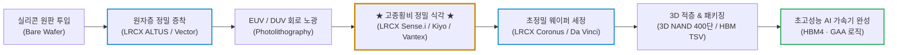
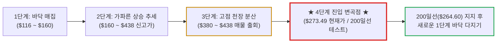

# 램 리서치(Lam Research / LRCX) 실전 재무 및 독점 가치 분석 보고서

- **작성일**: 2026-09-15
- **데이터 기준**: 2026 회계연도 4분기(2026년 6월 말 마감, 7월 말 공시) 실적, 최근 3개월 핵심 뉴스(2026.06~08) 및 yfinance 시장 데이터 (2026-09-15 기준)

대중은 엔비디아의 화려한 GPU와 TSMC의 파운드리에만 환호하지만, 원자 단위로 실리콘 웨이퍼를 깎고 쌓아 올리는 식각·증착의 절대 군주 램 리서치(LRCX) 없이는 최첨단 AI 칩 단 1개도 세상에 나올 수 없다. 사상 최대 분기 실적과 20년 만의 최고 마진율(52.0%)을 찍고도 AI 인프라 피크아웃 공포와 중국 규제 노이즈로 52주 고점($438.50) 대비 -37.6% 처박힌 지금, 200일선 생명선($264.60) 위에서 펼쳐지는 냉혹한 손익비와 비즈니스 실체를 숫자로 폭로한다.

## 핵심 요약

| 구분 | 핵심 요약 |
| :--- | :--- |
| **종목 및 주가** | 램 리서치 (NASDAQ: `LRCX`) / **$273.49** (52주 범위 $116.39 ~ $438.50, 고점 대비 **-37.6%**) |
| **최종 투자의견** | **조건부 분할 매수 (Buy on Dip)** / 200일선($264.60) 지지력 확인 후 저격 매수 (투자 가치 점수 **88.0점**, 6.1절) |
| **비즈니스 본질** | 반도체 전공정 식각(Etch) 글로벌 1위 및 고난도 증착(Deposition) 독점으로 AI 반도체 제조의 목줄을 쥔 장비 제왕 |
| **핵심 매력 (Bull)** | FY26 Q4 매출 67.2억 달러 경신, 매출총이익률 52.0%(20년래 최고), 연 51억 달러 규모 자사주 매입·배당, 2026년 WFE 1,500억 달러 상향 |
| **핵심 리스크 (Bear)** | 단기 AI 투자 속도조절론, 중국 로컬 장비사(북방화창·중미반도체)의 레거시 내재화에 따른 중국 매출 비중 정상화(과거 40%대 → 20%대 축소), 50일선($312.68) 이탈 매물대 압박 |
| **포트폴리오 성격** | AI 인프라 확장의 최대 낙수효과를 누리는 **핵심 코어 공격수(베타 1.86)** / **단기 100% 급등 노리는 투기꾼, 배당 생활자는 매수 금지** |

---

## 1. 비즈니스 실체: 대중이 모르는 기업의 '목줄'과 독점 빨대

대중은 AI 혁명이라 하면 엔비디아(NVDA)의 칩이나 빅테크의 챗봇 껍데기만 쳐다본다. 조금 더 눈치 빠른 자들이 TSMC나 SK하이닉스를 기웃거린다. 그러나 반도체 공학의 밑바닥으로 내려가 보면, 그 어떤 설계 천재나 거대 파운드리도 램 리서치의 장비 없이는 웨이퍼 한 장조차 구워내지 못한다.

최첨단 반도체(HBM3E/HBM4, 3D NAND, 2nm GAA 로직 칩)를 만드는 과정은 평면에 선을 긋는 2차원 인쇄가 아니다. 축구장 수천 개 넓이의 회로를 손톱만 한 실리콘 원판 위에 원자 단위로 수십 층 쌓아 올리고 깎아내는 초정밀 '나노 단위의 3차원 입체 건축 및 조각 작업'이다.

램 리서치는 바로 이 웨이퍼 표면에 원자층 단위로 박막을 정밀하게 코팅하는 **증착(Deposition)**과, 불필요한 실리콘 물질을 원자 단위의 오차도 없이 파내는 **식각(Etch)** 장비 시장을 장악한 글로벌 절대 권력이다.

### 1.1 식각(Etch) 1위의 초격차 해자: 고종횡비(HAR) 식각의 독점력

반도체 미세화가 한계에 부딪히면서 메모리 업계는 칩을 옆으로 좁히는 대신 수직으로 쌓아 올리는 3D 구조(3D NAND, 3D DRAM)로 전면 선회했다. 

- **깊고 좁은 구멍을 뚫는 기적**: 3D NAND가 200단, 300단을 넘어 400단으로 높아질수록, 머리카락 수만 분의 일 굵기로 수 마이크로미터 깊이의 완벽한 수직 구멍(Contact Hole)을 바닥까지 뚫어내야 한다. 이를 **고종횡비(High Aspect Ratio, HAR) 식각**이라 부른다.
- **물리적 기술 장벽**: 구멍이 깊어질수록 플라즈마 이온이 바닥에 닿기 전에 벽면에 부딪혀 찌그러지거나 휘어진다. 전 세계에서 400단에 육박하는 3D NAND와 HBM의 실리콘 관통 전극(TSV) 홀을 수율 저하 없이 뚫어낼 수 있는 초저온 극저온 플라즈마 식각 기술(Vantex 플랫폼 등)을 보유한 기업은 램 리서치가 유일무이하다.
- **경쟁사의 추격 불허**: 어플라이드 머티어리얼즈(AMAT)나 도쿄일렉트론(TEL)이 식각 시장에 숟가락을 얹으려 발악하지만, 최첨단 유전체(Dielectric) 고종횡비 식각에서 램 리서치의 특허 장벽과 양산 수율 데이터는 경쟁사들이 수년간 돈을 퍼부어도 넘지 못하는 거대한 만리장성이다.

### 1.2 숨겨진 황금알: 9만 대 설치 기반의 고객 지원(CSBG) 빨대

하수들은 램 리서치를 단순히 "공장에 장비 팔고 끝나는 경기민감주"로 치부한다. 하지만 램 리서치의 진짜 현금 빨대는 전 세계 반도체 팹에 깔려 있는 **9만 대 이상의 설치 기반(Installed Base)**에서 나오는 **고객 지원 사업부(CSBG, Customer Support Business Group)**다.

- **장비가 돌아가는 한 멈추지 않는 통행세**: 램 리서치가 납품한 챔버 안에서는 가혹한 화학 가스와 고에너지 플라즈마가 매초 뿜어져 나온다. 소모성 부품(Chamber Parts)은 정기적으로 마모되어 교체해야 하고, 공정 미세화에 따른 장비 업그레이드 키트와 유지보수 소프트웨어는 필수다.
- **고마진 반복 매출(Recurring Revenue)**: 신규 장비 판매가 반도체 투자 사이클에 따라 출렁이더라도, 고객사들이 팹을 가동하는 한 CSBG 매출은 분기마다 수십억 달러씩 따박따박 계좌에 꽂힌다. 이 서비스 매출은 전체 매출의 30% 이상을 차지하며, 매출총이익률이 55%를 상회하는 알짜 캐시카우다.

### 1.3 잔혹한 진실 검증: 중국의 반도체 장비 내재화(자급화)는 램 리서치를 죽일 수 있는가?

대중과 언론이 반도체 장비주를 논할 때 가장 공포에 질려 떠드는 레퍼토리가 바로 **"중국이 수백조 원을 쏟아부어 반도체 장비를 빠르게 국산화하고 있으니, 미국 장비사들은 중국 시장에서 쫓겨나고 결국 망할 것이다"**라는 비관론이다.

냉혹하게 까발려 말한다. 이 주장은 **'반은 맞고, 반은 완전히 빗나간 착각'**이다. 중국의 반도체 장비 내재화가 어디까지 왔고, 어디서 벽에 부딪혔는지 숫자로 해부한다.

#### ① 착각하지 마라: 진짜 빼앗기고 있는 것 (성숙 레거시 공정의 잠식)

중국 정부가 3,440억 위안(약 475억 달러) 규모의 '국가집적회로산업투자펀드(빅펀드 3기)'를 쏟아붓고 SMIC, CXMT(창신메모리), YMTC(양쯔메모리)에 자국산 장비 의무 할당 비율(50~70%)을 강제하고 있는 것은 엄연한 팩트다.

- **중국 로컬 챔피언들의 진격**: 중국 1위 종합 장비사 **북방화창(Naura Technology)**과 식각 전문 기업 **중미반도체(AMEC)**는 성숙 공정(28nm 이상 로직, 64~128단 구형 NAND, 레거시 DRAM)에서 램 리서치와 AMAT의 중저가 식각·증착·세정 장비를 매우 빠른 속도로 대체하고 있다.
- **비정상적 '중국 사재기 거품'의 소멸**: 2023~2024년 미국의 대중 수출 제재가 강화되기 직전, 중국 기업들은 제재를 피하고자 램 리서치와 ASML의 장비를 닥치는 대로 쓸어 담았다. 그 결과 램 리서치 전체 매출의 35~42%까지 치솟았던 비정상적인 '중국 특수'는 이제 끝났다. 중국 매출 비중이 20%대 초반으로 정상화되는 과정에서 발생하는 매출 역풍은 계좌에서 냉정하게 감안해야 할 실재하는 감점 요인이다.

#### ② 중국이 절대로 넘지 못하는 3대 물리적 통곡의 벽 (선단 공정의 철벽)

하지만 레거시 장비를 국산화했다고 해서 첨단 AI 반도체 장비까지 넘볼 수 있다고 믿는 것은, 동네 자전거 공장이 레이스용 F1 머신을 만들 수 있다고 우기는 꼴이다. 중국 장비사들이 도저히 넘을 수 없는 3가지 물리적 한계가 존재한다.

- **통곡의 벽 1 — 300단/400단 초고종횡비(HAR) 극저온 식각(Cryogenic Etch)**:
    - 3D NAND 단수가 200단을 넘어서면 종횡비(가로 폭 대비 깊이 비율)가 70:1, 100:1에 육박한다. 중미반도체(AMEC)의 식각기는 128단 수준까지는 흉내를 내지만, 그 이상 깊이로 들어가면 플라즈마 이온이 벽면을 갉아먹거나 구멍이 중간에서 휘어지는 틸팅(Tilting) 현상이 발생해 웨이퍼 수율이 20~30% 밑으로 곤두박질친다.
    - 영하 수십 도의 극저온 챔버 환경에서 원자 단위로 구멍을 수직으로 파내려 가는 램 리서치의 **Vantex 및 Sense.i 플랫폼**은 30년간 축적된 플라즈마 물리학, RF 제어 알고리즘, 독점 가스 조합의 집약체다. 장비를 뜯어서 역설계(Reverse Engineering)한다고 카피할 수 있는 영역이 아니다.
- **통곡의 벽 2 — HBM3E / HBM4 초정밀 TSV(실리콘 관통 전극) 식각**:
    - AI 메모리의 핵심인 HBM은 8층, 12층, 16층의 D램을 머리카락 수십 분의 일 두께로 얇게 갈아낸 뒤 수만 개의 미세 구멍(TSV)을 뚫어 수직으로 연결해야 한다. 미세 균열 하나만 생겨도 수천 달러짜리 패키지 전체가 쓰레기가 된다.
    - 글로벌 HBM 제조사(SK하이닉스, 삼성전자, 마이크론)의 양산 라인에서 TSV 식각 장비는 램 리서치가 80% 이상의 압도적 점유율을 틀어쥐고 있다. 중국 장비는 결함 통제율(Defect Rate)이 턱없이 높아 고부가가치 HBM 양산 라인에 진입조차 못 한다.
- **통곡의 벽 3 — 2nm GAA(Gate-All-Around) 나노시트 선택적 원자층 식각(ALE)**:
    - 2나노 로직 반도체에서는 나노시트 사이의 실리콘-게르마늄(SiGe) 층만 원자 몇 개 층 단위로 골라서 깎아내야 한다. 중국 장비사들은 7nm DUV 멀티 패터닝의 수율조차 못 잡아서 헤매는 처지다. 원자층 단위의 선택적 식각 기술은 램 리서치와 중국 로컬 기업 간에 최소 10~15년의 기술 격차가 벌어져 있다.

#### ③ 공정별 중국 장비 국산화 현주소 vs 램 리서치 초격차

| 반도체 제조 공정 영역 | 중국 국산화율 추정 | 대표 중국 로컬 기업 | 램 리서치(LRCX) 기술 격차 및 해자 | 냉혹한 시장 판정 |
| :--- | :---: | :--- | :--- | :---: |
| **레거시 식각 (28nm+ 유전체/금속)** | **50 ~ 70%** | 중미반도체(AMEC), 북방화창(Naura) | 가격 경쟁력 압박으로 램 리서치의 점유율 점진적 후퇴 | `🔴 위험` (수주 잠식) |
| **선단 로직 식각 (3nm / 2nm GAA)** | **5% 미만** | 중미반도체 일부 R&D 챔버 | 원자층 식각(ALE) 독점, 10년 이상 기술 격차 | `🟢 철벽` (대체 불가) |
| **초고단 3D NAND 식각 (300단+)** | **10% 미만** | 중미반도체, 북방화창 | 극저온 고종횡비(HAR) 플라즈마 특허 철벽 장벽 | `🟢 철벽` (독점 지속) |
| **HBM용 첨단 TSV 관통 전극** | **5% 미만** | 화하이칭커(Hwatsing, 연마/세정 일부) | 전 세계 HBM 양산 라인 80% 이상 독점 공급 | `🟢 철벽` (수혜 폭발) |
| **고객 지원 서비스 (CSBG)** | **0%** (순정 기준) | 중국 현지 사설 리퍼비시 업체 난립 | 램 리서치 순정 부품·알고리즘 미적용 시 수율 급락 | `🟢 견고` (락인 지속) |

#### ④ 스마트머니의 최종 판정: "이원화되는 반도체 판도"

결론적으로 글로벌 반도체 장비 시장은 **'중국 내수 레거시 자급자족 리그'**와 **'미국·대만·한국 주도의 초격차 AI 선단 공정 리그'**로 완전히 쪼개졌다.

중국은 천문학적인 국가 보조금을 태워가며 수율 저하와 막대한 원가 상승을 감수한 채 자국산 장비로 레거시 생태계를 억지로 꾸릴 것이다. 이로 인해 램 리서치의 중국 내 레거시 매출 성장이 둔화되는 것은 피할 수 없는 현실이다. 그러나 AI 시대를 지배하는 진짜 고마진 돈줄(HBM, 400단 NAND, 2nm GAA)은 중국 장비로는 흉내조차 낼 수 없으며, 램 리서치는 이 선단 공정의 장비 단가(ASP) 인상과 압도적인 마진율(52.0%)로 레거시 공백을 압도하고 있다. 

중국 내재화 뉴스로 주가가 흔들릴 때마다 공포에 질려 도망치는 것은 기술의 깊이를 모르는 대중의 착각일 뿐이다.

---

## 2. 최근 3개월 핵심 뉴스 및 실적 흐름 심층 분석 (2026년 6월 ~ 8월)

### 2.1 2026년 여름 핵심 뉴스 타임라인 (팩트 vs 노이즈)

| 일자 | 주요 뉴스 및 시장 이벤트 | 영향도 | 스마트머니 관점의 핵심 분석 및 시사점 |
| :--- | :--- | :---: | :--- |
| **08.31** | **미즈호, "메모리 공급부족으로 램 리서치·AMAT 극심한 저평가"** | `🟢 호재` | AI 인프라 확충으로 구형 DRAM까지 사들이는 극심한 쇼티지 발생. 마이크론 목표가 $1,375, 샌디스크 $1,900 상향과 함께 램 리서치 장비 밸류에이션 저평가 지적 |
| **08.28** | **연준 워시 의장 매파 발작 & 국채금리 급등 (LRCX -5.24%)** | `🔴 매크로` | 잭슨홀에서 2% 물가 미흡 시 추가 금리 인상 시사로 기술주 투매(XLK -1.55%). 램 리서치는 개별 악재 없이 -5.24% 급락. 전형적인 매크로 할인율 발작에 따른 우량주 할인 구간 형성 |
| **08.26** | **BofA, "반도체 섹터 단기 10% 조정은 역사적 매수 기회" (Top Pick 선정)** | `🟢 호재` | '26~'28년 반도체 EPS 연평균 70% 폭증 및 2030년 AI 데이터센터 TAM 1.8조 달러 전망. 일시적 수급·규제 노이즈로 멀티플 축소 시 LRCX를 탑픽으로 매수 권고 |
| **08.14** | **UBS, AMAT 마진 가이던스 실망 지적 vs 램 리서치 마진 상향 대조** | `🟢 호재` | 피어 기업인 AMAT가 마진 가이던스 미달로 주가가 조정을 받은 반면, 램 리서치는 20년 만의 최고 마진(52.0%)을 찍고 가이던스를 높이며 식각 부문의 초격차 수익성을 입증 |
| **08.12** | **인텔, 파운드리·패키징 확충용 200억 달러 공모 자금 조달 발표** | `🟢 호재` | 인텔이 첨단 파운드리 및 첨단 패키징 설비 확충을 위해 200억 달러 조달 공표. 집행 자금은 ASML, LRCX, AMAT 장비 발주로 직결 |
| **08.06** | **테슬라, 168억 달러 규모 Terafab(텍사스) 신설 공표** | `🟢 호재` | 테슬라·xAI·스페이스X의 AI 반도체 자급을 위한 초대형 팹 신설. 빅테크의 자체 팹 구축은 LRCX 식각 장비 수주 파이를 직접적으로 확장 |
| **08.04** | **씨티, WFE 시장 '26년 1,500억$ &rarr; '27년 1,900억$ &rarr; '28년 2,500억$ 폭증 전망** | `🟢 호재` | 2분기 어닝시즌 경영진 가이던스 종합 결과 WFE 슈퍼사이클 공식 확인. '29년 이후 장비 주문까지 논의 중임을 확인하며 90일 Catalyst Watch 선정 |
| **07.31** | **★ FY26 Q4 실적 발표: 어닝 서프라이즈 & 월가 목표가 줄상향 ★** | `🟢 팩트` | **매출 67.2억 달러(YoY +30%), Non-GAAP EPS $1.82 달성**. JPM(목표가 $340 상향, 비트앤레이즈 호평), 니덤(목표가 $390, 52% 마진 장기화), 제프리스($335), 웰스파고($350) |
| **07.30** | **호실적 발표 직후 프리마켓 +11.3% 폭등** | `🟢 팩트` | 사상 최대 분기 실적과 20년래 최고 마진율(52.0%) 확인으로 정규장 개장 전 두 자릿수 랠리 시현 |
| **07.28** | **HSBC, ASML 증설 반영해 '28년 WFE 2,720억 달러로 상향** | `🟢 호재` | ASML 생산능력 확대 추세를 반영해 2028년 장비 매출 전망을 대폭 상향. LRCX 목표주가 $247에서 $333으로 상향 조정 |
| **07.21** | **UBS HOLT 가치평가, 고점 조정받은 현금흐름 최상위주로 LRCX 선별** | `🟢 스마트머니` | 6월 말 고점 이후 단기 밸류에이션 조정을 거쳤으나 현금흐름수익률(CFROI)이 지속 상향되는 핵심 기술주 10선에 LRCX 편입 |
| **07.17** | **TSMC, 2026년 CAPEX 600억~640억 달러 대증액 & 캔터 Top Pick 선정** | `🟢 호재` | 글로벌 파운드리 1위의 자본지출 대폭 확대로 2nm GAA 공정 식각 수요 급증 확인. 캔터 피츠제럴드는 LRCX를 장비 섹터 최선호주로 제시 |
| **07.13** | **미 빅테크 임원 28인 역대 최대 내부자 매수 (센티먼트레이더)** | `🟢 스마트머니` | XLK 구성 종목 경영진들이 주가 조정 국면에서 유통시장 자사주를 역대 최대 규모로 매입. 주가 하락이 펀더멘털 문제가 아닌 시장 센티먼트 왜곡임을 증명 |
| **07.13** | **스티펄, AI 에이전트 확산으로 WFE 폭증 전망 (목표가 $325&rarr;$425)** | `🟢 호재` | AI 에이전트 구동에 따른 메모리·로직 수요 가속화로 '27년 WFE 1,920억 달러, '28년 2,250억 달러 전망. 메모리 LTA 계약 안정성 강조 |
| **07.10** | **미즈호·TD코웬, AI 수요 지속에 램 리서치 목표가 $400 상향 (당일 +6.01%)** | `🟢 호재` | 첨단 파운드리·로직과 DRAM 증설이 지속되고 NAND 업그레이드 순풍 확인. 당일 주가 +6.01% 급등 화답 |
| **07.07** | **호르무즈 해협 긴장 및 삼성전자 실적 후 차익실현으로 반도체 약세 (-6.87%)** | `🔴 매크로 / 노이즈` | 유가 반등 및 단기 기술적 차익실현 매물 출회로 LRCX -6.87% 급락. 기업 본질 가치와 무관한 단기 매크로 출렁임 |
| **07.01** | **분기초 기술주 차익실현 매물 폭탄 (-9.71%) vs 서스퀘하나 목표가 상향** | `🟡 노이즈` | 6월 말 역사적 고점($438.50) 도달 후 기관들의 분기 결산 차익실현으로 단기 -9.71% 급락. 서스퀘하나는 WFE 지출 상향을 근거로 목표주가 인상 |
| **06.23** | **BofA, 반도체 TAM '30년 2.7조$ 상향 (LRCX 목표가 $330&rarr;$480 최상향)** | `🟢 호재` | 2030년까지 반도체 시장 연평균 28% 성장 전망 및 '28년 WFE 2,500억 달러 제시. 장비주 중 최고 수준인 목표가 $480 제시 |
| **06.12** | **오라클 200억 달러 CAPEX 폭탄 & 캔터 상향에 LRCX +12.65% 대폭등** | `🟢 호재` | 오라클의 천문학적 AI 데이터센터 지출 계획이 반도체 장비 업계의 강력한 낙수효과로 연결되며 LRCX 하루 만에 +12.65% 폭등 랠리 |
| **06.11** | **캔터 피츠제럴드, 반도체 쇼티지 3년 지속 & WFE 상향 (목표가 $425)** | `🟢 호재` | 클린룸 확보 제한으로 공급부족이 장기화되며 장비사 슈퍼사이클 확인. '26년 1,450억~1,500억 달러, '29년 2,500억 달러 전망 |

### 2.2 뉴스 흐름으로 본 4대 핵심 구조적 변화와 스마트머니의 의도

- **① 월가 주요 IB들의 WFE 시장 전망 연쇄 상향 (1,450억$ &rarr; 1,500억$ &rarr; 2,720억$)**:
    - 6월 캔터 피츠제럴드의 1,450억 달러 상향을 시작으로, 7월 스티펄(1,500억 달러)과 HSBC(2,720억 달러), 8월 씨티(Catalyst Watch 지정)에 이르기까지 월가 메이저 IB들이 일제히 WFE 전망치를 상향 조정했다.
    - 특히 2028년 이후 시장 규모가 2,500억~2,700억 달러에 달하고 이미 2029년 장비 주문까지 논의되고 있다는 사실은, 이번 반도체 장비 사이클이 1~2년짜리 단기 반등이 아닌 다년간 지속되는 역대급 슈퍼사이클임을 입증한다.
- **② 빅테크 CAPEX 폭탄의 직접적 낙수효과 (오라클 200억$, 테슬라 168억$, TSMC 640억$, 인텔 200억$)**:
    - 오라클이 200억 달러 조달 계획을 밝히자마자 당일 램 리서치 주가가 **+12.65% 폭등**했고, 테슬라의 Terafab(168억 달러)과 인텔(200억 달러), TSMC의 자본지출 대증액(최대 640억 달러)이 잇따라 터져 나왔다.
    - AI 인프라 전쟁의 최종 승자가 누가 되든 상관없다. 빅테크들이 자체 AI 가속기를 설계하고 팹을 지을수록, 나노 단위로 웨이퍼를 깎아내는 램 리서치의 식각 장비는 가장 먼저 계약서에 도장을 찍는다.
- **③ 메모리(DRAM·NAND) 공급부족과 램 리서치 마진의 폭발적 결합 (52.0% 최고치)**:
    - 미즈호가 지적했듯 구형 DRAM까지 사들이는 극심한 공급부족이 발생했고, 니덤이 확인했듯 램 리서치의 매출총이익률은 20년 만에 **52.0%**를 찍었다.
    - 경쟁사인 AMAT가 8월 실적에서 마진 가이던스 미달로 투자자들을 실망시킨 반면, 램 리서치는 고마진 식각 장비 비중 확대와 CSBG 서비스 수익 덕분에 독보적인 가격 결정력과 영업 레버리지를 증명했다.
- **④ 6월 역사적 고점($438.50) 이후 '금리 발작과 차익실현'이 만든 바겐세일 기회**:
    - 주가는 6월 말 $438.50을 찍은 뒤, 7월 호르무즈 해협 긴장, 8월 잭슨홀 연준 워시 의장의 금리 인상 시사 발작(-5.24%), 중국 규제 노이즈 등이 겹치며 $273까지 37% 넘게 곤두박질쳤다.
    - 그러나 주가가 흔들리는 동안 센티먼트레이더가 폭로했듯 빅테크 임원 28인은 장내 자사주를 역대 최대 규모로 쓸어 담았고, BofA와 UBS HOLT는 반도체 조정을 "역사적 매수 기회"로 못 박았다. 꺾인 것은 대중의 투자 심리일 뿐, 램 리서치의 수주 잔고와 현금 창출력은 그 어느 때보다 견고하다.

### 2.3 2026 회계연도 4분기 실적: 20년 만의 최고 마진율이 증명한 영업 레버리지

2026년 7월 말 발표된 램 리서치의 2026회계연도 4분기(6월 말 마감) 실적은 반도체 장비 업계의 교과서적인 어닝 서프라이즈였다.

| 실적 지표 | 2026 FY Q4 발표치 | 월가 컨센서스 | 전년 동기(YoY) | 데이터가 말해주는 판정 |
| :--- | :---: | :---: | :---: | :--- |
| **분기 매출액** | **67억 2,000만 달러** | 65억 8,000만 달러 | **+30.0%** | AI 메모리 장비 수주 폭증으로 사상 최고치 경신 |
| **비GAAP EPS** | **$1.82** (액면분할 반영) | $1.74 | **+38.9%** | 월가 예상치를 +4.6% 상회한 완벽한 어닝 비트 |
| **매출총이익률 (Gross Margin)** | **52.0%** | 49.5% | **+2.8%p** | **20년 만에 찍은 최고치**, 고마진 시스템 판매 급증 |
| **영업이익률 (Operating Margin)** | **37.4%** | 34.8% | **+3.7%p** | 매출 증가가 고스란히 순이익으로 꽂히는 극단적 영업 레버리지 |
| **잉여현금흐름 (FCF)** | **12억 7,000만 달러** | — | **+45.2%** | 분기 12.7억 달러 FCF 창출, 연간 30억 달러 이상 현금 수혈 |

대중은 매출 30% 성장에만 시선을 빼앗겼지만, 스마트머니가 경악한 진짜 숫자는 **매출총이익률 52.0%**다. 고난도 식각 장비의 평균 판매단가(ASP) 상승과 CSBG 서비스 매출 비중 확대가 맞물리며 제품 원가를 압도적인 기술 프리미엄으로 찍어 누르고 있음을 입증했다.

### 2.4 WFE 시장 전망 상향: 1,500억 달러 슈퍼사이클의 귀환

램 리서치 경영진은 실적 발표 컨퍼런스 콜에서 2026년 글로벌 웨이퍼 제조 장비(WFE) 시장 규모 전망치를 종전 1,300억 달러 수준에서 **1,500억 달러대**로 대폭 상향 조정했다.

- **DRAM & HBM 쇼티지 장기화**: 엔비디아의 차세대 GPU 아키텍처와 빅테크의 커스텀 ASIC 수요가 폭발하면서 HBM3E 및 HBM4 생산용 TSV 식각 장비 주문이 백로그(수주잔고)를 가득 채우고 있다.
- **3D NAND 적층 고단화 투자 재개**: 지난 2년간 혹독한 감산과 투자 동결을 겪었던 낸드 플래시 메모리 진영(삼성전자, SK하이닉스, 마이크론, 키옥시아)이 300단 이상 QLC 엔터프라이즈 SSD 수요 폭증에 힘입어 고종횡비 식각 장비 투자를 전면 재개했다.
- **파운드리 2nm GAA 공정 전환**: TSMC와 삼성전자의 2nm GAA(Gate-All-Around) 공정 도입으로 나노시트(Nanosheet)를 깎아내는 정밀 선택적 식각 장비 수요가 폭증하고 있다.

### 2.5 대중의 착시 vs 숫자의 팩트

| 시장이 떠드는 공포 (착시) | 데이터가 말해주는 진실 (팩트) |
| :--- | :--- |
| **"주가가 고점에서 -37.6% 빠졌으니 AI 반도체 파티는 끝났다"** | 꺾인 것은 장비 수주가 아니라 6월 사상 최고가($438.50)에서 팽창했던 밸류에이션 거품이다. 2분기 매출은 YoY +30% 폭증했고 다음 분기 수주잔고는 역대 최대다. |
| **"중국의 장비 내재화로 램 리서치의 밥줄이 끊긴다"** | 북방화창·중미반도체가 28nm 이상 레거시 식각을 잠식하고 있는 것은 사실이나, 마진과 성장을 주도하는 300단 NAND·HBM TSV·2나노 극저온/원자층 식각에서는 기술 격차가 10년 이상이다. 잃어버리는 레거시 파이보다 선단 공정의 단가(ASP) 폭등과 수주 파이가 훨씬 크다. |
| **"장비주는 설비투자 꺾이면 순식간에 적자 난다"** | 9만 대 이상의 설치 기반에서 분기마다 20억 달러 이상의 CSBG 고마진 유지보수 매출이 꽂힌다. 과거 2010년대의 천수답 시클리컬 기업이 아니라 구독형 서비스가 결합된 하이브리드 독점 플랫폼이다. |
| **"부채가 많아 금리 인하기에 현금 흐름이 악화된다"** | 현금 및 단기투자자산만 55억 8,000만 달러를 쥐고 있으며 총부채는 37억 3,000만 달러에 불과하다. 순현금 18억 5,000만 달러의 무차입에 가까운 철벽 재무구조를 자랑한다. |

---

## 3. 경쟁 해자 및 피어 그룹 잔혹 비교

반도체 장비 4대 천왕(LRCX, AMAT, KLAC, ASML)을 나란히 세워놓고 숫자로 발라보면, 램 리서치의 독보적인 위치가 적나라하게 드러난다.

| 비교 지표 | 램 리서치 (`LRCX`) | 어플라이드 머티어리얼즈 (`AMAT`) | KLA (`KLAC`) | ASML (`ASML`) |
| :--- | :---: | :---: | :---: | :---: |
| **주력 독점 영역** | **정밀 식각(Etch) 1위 & 증착** | 전공정 종합 턴키 1위 | 공정 결함 계측·검사 1위 | EUV 노광 장비 100% 독점 |
| **현재 주가** | **$273.49** | $424.21 | $169.09 | $812.30 |
| **52주 변동폭** | $116.39 ~ $438.50 | $158.82 ~ $739.67 | $85.40 ~ $248.50 | $510.00 ~ $1,110.00 |
| **선행 PER (Fwd P/E)** | **23.47배** | 23.05배 | 25.22배 | 27.50배 |
| **매출총이익률 (Gross Margin)** | **52.0%** (최근 분기) | 49.4% | **61.3%** | 51.5% |
| **영업이익률 (Op Margin)** | **37.4%** | 33.7% | **42.5%** | 31.8% |
| **잉여현금흐름 (FCF)** | **$30.9억** | $30.8억 | $26.2억 | $42.1억 |
| **연간 주주환원 (자사주+배당)** | **51억 달러 이상** | 약 45억 달러 | 약 20억 달러 | 약 35억 달러 |
| **AI 메모리(HBM/NAND) 노출도** | **최상 (매출의 50% 이상)** | 중상 (약 35%) | 중 (약 25%) | 중 (약 30%) |

### 3.1 램 리서치가 피어 대비 압도적인 3가지 이유

- **① 메모리 반도체 슈퍼사이클의 직격 수혜자**: ASML과 AMAT가 로직/파운드리 비중이 상대적으로 높은 반면, 램 리서치는 역사적으로 메모리(DRAM + NAND) 장비 매출 비중이 가장 높다. AI 데이터센터의 병목이 연산(GPU)에서 메모리(HBM 및 초고용량 eSSD)로 이동하는 현 사이클에서 가장 가파른 수주 반등 탄력을 누린다.
- **② 자사주 소각의 진심인 경영진**: 램 리서치는 벌어들인 잉여현금흐름(FCF)의 85~100%를 주주에게 환원한다는 원칙을 고수한다. 연간 51억 달러가 넘는 자사주 매입 및 소각을 단행하며 발행 주식 수를 지속적으로 줄여 주당순이익(EPS)을 인위적으로 밀어 올린다. 2024년 10월 단행된 10대 1 액면분할 역시 유동성 공급과 소액 주주 유입을 이끌어냈다.
- **③ 극단적인 식각 락인(Lock-in)**: 식각 공정 레시피(Recipe)는 반도체 제조사의 일급 대외비다. 한 번 램 리서치의 센서와 챔버 조건에 맞춰 수율을 최적화해 놓으면, 경쟁사 장비로 교체할 경우 수개월간 수율이 곤두박질치는 재앙이 발생한다. 고객사가 장비를 바꾸고 싶어도 절대 바꿀 수 없는 잔혹한 전환 비용이 램 리서치의 마진을 보장한다.

---

## 4. 기술적 사이클 위치 (4단계 사이클 모델)

스탠 와인스타인의 4단계 사이클(Stage Analysis) 관점에서 현재 램 리서치(LRCX)의 주가 위치는 **3단계(과열 및 고점 인근 매물 소화/천장 분산 국면)**의 막바지에서 **4단계(단기 공포 및 변동성 확대 국면)로 진입하는 치열한 변곡점**에 위치해 있다.

### 4.1 이동평균선과 수급 지표 분석

- **52주 고점 대비 -37.6% 낙폭**: 주가는 2026년 6월 사상 최고가인 **$438.50**을 찍은 뒤, 9월 들어 AI 인프라 피크아웃 우려와 반도체 섹터 전반의 차익 실현 매물 폭탄을 맞으며 현재 **$273.49**까지 수직 낙하했다.
- **50일 이동평균선($312.68) 이탈**: 단기 추세선인 50일선이 하향 꺾이며 데드크로스를 형성했고, 상단에 물린 매물대가 두텁게 형성되어 단기 반등 시마다 저항으로 작용하고 있다.
- **200일 이동평균선($264.60) 생명선 사수 테스트**: 현재 주가($273.49)는 장기 기관 투자자들의 평균 매수 단가이자 대세 상승의 생명선인 **200일선($264.60)**에 불과 3.3% 위까지 바짝 접근했다. 
- **거래량과 하락 성격 판정**: 이번 급락은 회사의 기술력이나 실적 가이던스가 망가져서 발생한 펀더멘털 붕괴형 4단계 공포가 아니다. 연초 이후 가파르게 오른 데 따른 차익 실현과 매크로 금리 노이즈가 결합된 **'고점 과열 해소 및 건강한 기간 조정'**의 성격이 짙다. 200일선 지지 여부가 향후 6개월 주가의 운명을 가를 절대 분수령이다.

---

## 5. 밸류에이션 및 가격 타당성 검증

대중은 주가가 떨어질 때 공포에 질려 도망치지만, 가치 투자자는 숫자가 증명하는 밸류에이션 멀티플의 매력도를 계산한다.

### 5.1 선행 PER 23.47배: 밸류에이션 프리미엄 완전 제거

| 밸류에이션 지표 | 현재 수치 | 역사적 5년 평균 | 피어 평균 (AMAT/KLAC) | 저평가 판정 및 시사점 |
| :--- | :---: | :---: | :---: | :--- |
| **Trailing P/E** | 47.48배 | 32.0배 | 35.0배 | 과거 실적 기준 수치는 왜곡 (액면분할 및 사이클 저점 반영) |
| **Forward P/E** | **23.47배** | 24.5배 | 24.1배 | **역사적 평균치 하회**, 피어 대비 가격 부담 완벽 소화 |
| **Price / Book (P/B)** | 27.44배 | 18.2배 | 22.0배 | 대규모 자사주 매입으로 인한 자기자본 축소 착시 (ROE 65.1%) |
| **EV / EBITDA** | 39.43배 | 25.0배 | 28.0배 | 향후 12개월 EBITDA 급증 시 20배 초반으로 급격히 수렴 |
| **Forward EPS** | **$11.65** | — | — | 2026~2028년 연평균 EPS 성장률 25% 이상 전망 |

### 5.2 밸류에이션 재평가(Re-rating) 시나리오

- **이익 추정치의 상향**: 2026년 WFE 시장이 1,500억 달러로 상향되고 3D NAND의 고단화 투자가 본격화되면, 램 리서치의 2027 회계연도 EPS 컨센서스는 현재 $11.65에서 $13.50~$14.00 선까지 상향 조정될 가능성이 매우 높다.
- **적정 주가 산출**: 정상화된 선행 PER 25배를 보수적으로 적용하더라도 목표주가는 **$291.25**, AI 장비 슈퍼사이클 프리미엄(PER 28배)을 부여할 경우 **$326.20**까지 열려 있다. 현재 $273.49는 하방 위험 대비 상방 룸이 20~30% 이상 열려 있는 전형적인 손익비 우위 구간이다.

---

## 6. 종합 평가 및 냉혹한 계좌 실행 원칙

### 6.1 6대 핵심 투자 지표 다차원 평가 매트릭스

사용자 및 헤지펀드 내부 평가 가이드라인에 따라 6대 핵심 영역을 정밀 실사한 결과, 램 리서치의 종합 투자 점수는 **88.0점 / 100점 만점**으로 집계된다.

| 평가 영역 | 가중치 | 평점 (100점 만점) | 가중 점수 | 등급 | 핵심 평가 요약 |
| :--- | :---: | :---: | :---: | :---: | :--- |
| **① 비즈니스 모델 및 해자** | 25% | **95점** | 23.75 | `S` | 고종횡비(HAR) 식각 독점 및 9만 대 CSBG 반복 매출 빨대 |
| **② 실적 성장성 및 가이던스** | 25% | **90점** | 22.50 | `S` | Q4 매출 67.2억$ 경신, WFE 1,500억$ 상향 및 낸드 턴어라운드 |
| **③ 재무 건전성 및 현금흐름** | 20% | **92점** | 18.40 | `S` | 순현금 18.5억$, 연 51억$ 주주환원(자사주 매입+배당) |
| **④ 밸류에이션 매력도** | 15% | **82점** | 12.30 | `A` | 고점 대비 -37.6% 조정으로 Forward PER 23.47배까지 매력도 복원 |
| **⑤ 기술적 매매 타이밍** | 10% | **65점** | 6.50 | `C+` | 50일선 이탈 후 200일선($264.60) 지지력 테스트 중인 조정 국면 |
| **⑥ 리스크 관리 가능성** | 5% | **91점** | 4.55 | `S-` | 중국 레거시 잠식 리스크 상존하나, 200일선 이탈 시 명확한 손절선 설정 가능 |
| **종합 가중치 환산 점수** | **100%** | — | **88.0점** | **`Buy`** | **독점 펀더멘털은 최상급이나, 기술적 지지 확인 분할 매수 필수** |

### 6.2 실전 결론: "그래서 지금 어쩌라는 것인가?" (Action Verdict)

#### ① 지금 당장 사야 하는가? ➔ **"몰빵하지 마라. 200일선 지지 확인하며 정찰대부터 쪼개 넣어라."**
- **이유**: 52주 고점 대비 -37.6% 급락하며 단기 낙폭과대 구간에 진입한 것은 맞다. 하지만 50일선($312.68)이 꺾인 상태에서 하락 거래량이 완전히 마르지 않았다. 200일 이동평균선($264.60)을 장중 터치하거나 일시적으로 위협하는 흔들기가 언제든 발생할 수 있다.
- **지금 할 일**: 호가창에 전 재산을 털어 넣는 무식한 추격 매수를 멈추고, 200일선($264.60) 부근에서 하방 경직성을 확보하는지 확인하며 3단계에 걸쳐 정밀 분할 매수한다.

#### ② 이런 주식은 누가 사고, 누가 절대 사면 안 되는가?
- **❌ 절대 사지 마라 (즉시 퇴장)**: 내일 당장 상한가를 바라는 단타 투기꾼, 반도체 장비 시클리컬의 분기 변동성(MDD 30~40%)을 견디지 못하는 심약자, 5% 이상 고배당을 바라는 은퇴 생활자.
- **⭕ 반드시 눈독 들이고 주워 담아야 할 사람 (스나이퍼 대기)**: AI 인프라의 물리적 한계를 독점 기술로 뚫어내는 1등 기업을 싼값에 사 모으고 싶은 투자자, 2026~2028년 WFE 1,500억 달러 슈퍼사이클의 과실을 계좌에 편입하고 싶은 중장기 성장 복리 추구자.

#### ③ 이 주식으로 '인생 역전(대박)'을 바라면 안 되는 냉혹한 이유
- 시가총액 3,400억 달러가 넘는 초대형 메가캡 장비주다. 하루아침에 2배, 3배 폭등하는 밈코인이나 페니 주식이 아니다. 철저히 글로벌 반도체 CAPEX 사이클과 동행하며 연평균 20~30%의 복리 수익률을 추구하는 '포트폴리오 핵심 공격수'로 대해야 계좌가 터지지 않는다.

### 6.3 실전 가격대별 실행 시나리오 및 분할 매수 로드맵

| 구분 | 실행 조건 | 배정 비중 | 가격 기준 | 대응 방침 |
| :--- | :--- | :---: | :---: | :--- |
| **1차 진입 (선발대)** | 현재가 부근 200일선 지지 타진 | 30% | $268 ~ $275 | 기본 포지션 구축 및 하방 지지력 테스트 |
| **2차 매수 (주력)** | 200일선($264.60) 완벽 지지 및 반등 양봉 | 40% | $255 ~ $265 | **최적의 손익비 타점**, 주력 물량 집중 확보 |
| **3차 매수 (추세 복원)** | 50일 이동평균선($312.68) 종가 돌파 안착 | 20% | $315 돌파 시 | 상승 2단계 복귀 확인 후 불타기 추격 매수 |
| **예비 현금** | 매크로 충격 및 지정학 돌발 악재 버퍼 | 10% | — | 시장 전면적 투매 발생 시까지 현금 대기 |
| **손절 기준선** | 200일선 완전 붕괴 및 주봉 종가 이탈 | — | **$250 종가 이탈 시** | 미련 없이 비중 50% 이상 축소 및 관망 전환 |

!!! tip "최종 핵심 제언 (Executive Takeaway)"
    대중은 주가가 400달러를 넘어가며 온갖 장밋빛 뉴스가 도배될 때 꼭대기에서 흥분하여 뛰어들고, 주가가 30% 넘게 빠지며 중국 규제니 피크아웃이니 비관론이 쏟아질 때 바닥에서 피눈물을 흘리며 손절한다.
    
    주식 시장에서 돈을 버는 자는 언제나 대중의 반대편에 서는 자들이다. 램 리서치의 펀더멘털은 52.0%의 역대급 마진율과 1,500억 달러의 WFE 전망으로 그 어느 때보다 단단하다. 200일선 생명선 근처에서 대중이 공포에 떨며 던지는 물량을 차분히 받아내는 자만이, 다음 실적 랠리가 폭발할 때 가장 높은 곳에서 미소 짓게 될 것이다.
