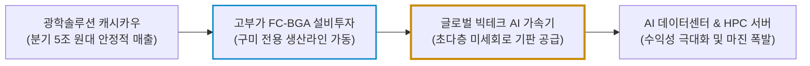
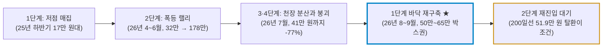

# LG이노텍(011070.KS) 실전 재무 및 독점 가치 분석 보고서

- **작성일**: 2026-09-17
- **데이터 기준**: 2026 회계연도 2분기(상반기 누적) 실적 및 yfinance 시장 데이터 (2026-09-17 종가 기준)

애플의 납품 단가 후려치기에 휘둘리는 단순 하청업체라는 대중의 편견을 깨부숴라. 지난여름 178만 원까지 치솟았다가 41만 원까지 처박힌 광풍의 잔해 위에서, 상반기 매출 11조 원을 돌파하고 글로벌 빅테크의 AI 서버용 FC-BGA 기판 목줄을 틀어쥐기 시작한 LG이노텍의 진짜 체력을 차가운 숫자로 증명한다.

## 핵심 요약

| 구분 | 핵심 요약 |
| :--- | :--- |
| **종목 및 주가** | LG이노텍 (KRX: `011070.KS`) / **513,000원** (52주 범위 173,200원 ~ 1,788,000원) |
| **최종 투자의견** | **조건부 매수 (Buy on Dip & Breakout)** / 적극적 관망 후 200일선(52만 원) 안착 또는 48~50만 원 눌림목 분할 진입 (최종 투자 가치 점수 **86.5점**, 6.1절) |
| **비즈니스 본질** | 독점적 모바일 카메라 모듈 캐시카우에서 AI 데이터센터·HPC용 고부가 FC-BGA 기판 공급사로 체질 대전환 |
| **핵심 매력 (Bull)** | 2분기 영업이익 전년비 21.6배 폭증(2,458억 원), 상반기 누적 매출 최초 11조 돌파, 글로벌 빅테크 AI 기판 수주 가시화 |
| **핵심 리스크 (Bear)** | 6월 고점 대비 -71%에 이르는 극심한 주가 변동성, 북미 단일 고객사 의존도 잔존, 대규모 설비투자(CAPEX) 집행에 따른 현금 감소와 잉여현금흐름(FCF) 압박 |
| **포트폴리오 성격** | 실적 턴어라운드와 AI 인프라 확장이 결합된 **주력 성장형 공격수** / **200일선 저항 확인 전 조급한 뇌동매매 금지** |

---

## 1. 비즈니스 실체: 애플의 '카메라 빨대'에서 AI 기판의 '고속도로 통행세'로

대중은 LG이노텍을 그저 스마트폰 뒤판에 카메라 구멍 몇 개 뚫릴 때마다 울고 웃는 단순 IT 하청 조립업체로 폄하한다. 언론이 "스마트폰 교체 주기 둔화"니 "아이폰 판매 부진"이니 하는 자극적인 헤드라인을 쏟아낼 때마다, 본질을 보지 못하는 개미들은 바닥에서 공포에 질려 주식을 내던진다.

진실은 완전히 다르다. LG이노텍은 단순한 모듈 조립업체가 아니다. **전 세계 프리미엄 스마트폰의 광학 생태계를 틀어쥔 독점 공급자이자, 인공지능(AI) 고성능 연산의 신경망인 차세대 반도체 기판(FC-BGA) 시장으로 영토를 전격 확장 중인 핵심 부품 제조 요새**다.

### 1.1 2대 핵심 사업 축의 독점 구조

LG이노텍의 수익 창출 기둥은 철저하게 고부가가치 하이엔드 영역에 집중되어 있다.

| 사업 부문 | 주력 제품 및 핵심 기술 | 시장 지배력 및 해자 | 비즈니스 실체 |
| :--- | :--- | :--- | :--- |
| **광학솔루션 (카메라 모듈)** | • 초정밀 센서 시프트 OIS(손떨림 보정) • 폴디드줌(잠망경형) 액추에이터 • 3D 센싱(ToF) 모듈 | 글로벌 하이엔드 스마트폰 1위 독점 공급망 | 북미 최대 고객사의 최상위 플래그십 모델 카메라 독점 납품 빨대 |
| **기판소재 (반도체 기판)** | • AI/HPC 서버용 FC-BGA • 모바일 AP용 FC-CSP • 통신용 RF-SiP 및 디스플레이용 Tape Substrate | 초다층·미세회로 고난도 패키징 기술력 보유 | AI 가속기 및 고성능 컴퓨팅 칩과 메인보드를 초고속으로 잇는 신경망 독점 |

### 1.2 모바일 카메라에서 AI 반도체 기판으로의 가치사슬 전이

글로벌 빅테크가 AI 연산 능력을 극대화하기 위해 초거대 가속기 칩을 설계해도, 이를 메인보드와 연결하고 열을 제어하는 고성능 기판이 없으면 칩은 한 발자국도 작동하지 못한다. LG이노텍이 수조 원의 설비투자를 쏟아부어 완성한 FC-BGA 전용 라인이 바로 이 병목을 해결하는 핵심 관문이다.

### 1.3 기술적 해자: 후발주자가 흉내 낼 수 없는 초정밀 공정

스마트폰 카메라 모듈은 마이크로미터 단위의 오차도 용납하지 않는 극도의 정밀 광학 조립 기술이 요구된다. LG이노텍은 수십 년간 축적한 광학 특허와 조 단위 공정 자동화 설비로 후발주자의 진입 장벽을 견고히 쌓았다.

여기에 과거 수십 년간 쌓아온 글로벌 전략 고객사와의 파트너십은 **단순히 가격을 깎는다고 다른 업체로 갈아탈 수 없는 강력한 락인(Lock-in) 네트워크 해자**로 기능한다. 이 안정적인 현금 흐름을 바탕으로 AI FC-BGA 영역으로 진격하고 있는 것이다.

---

## 2. 최근 실적과 시장의 오독: 상반기 11조 돌파와 대중의 착시 vs 숫자의 팩트

### 2.1 2026년 2분기 어닝 서프라이즈: 비수기에 터진 영업이익 폭발

LG이노텍은 2026년 2분기 연결기준 매출액 **5조 5,272억 원**, 영업이익 **2,458억 원**을 공시했다. 통상 2분기는 스마트폰 신제품 출시 전 재고 조정이 일어나는 계절적 비수기다. 그럼에도 불구하고 전년 동기 영업이익(114억 원) 대비 무려 **21.6배 폭증**하는 기염을 토했다.

1분기 매출(5조 5,348억 원)과 합산한 2026년 상반기 누적 매출은 **11조 620억 원**으로, 회사 창립 이래 최초로 **상반기 11조 원을 돌파했다.**

| 실적 지표 | 2026년 2분기 | 2025년 2분기 (전년 동기) | 전년비(YoY) 변동률 | 상반기 누적 (26년 1H) | 시장 의미 및 팩트 분석 |
| :--- | :---: | :---: | :---: | :---: | :--- |
| **매출액 (Revenue)** | **5조 5,272억 원** | 3조 9,346억 원 | **+40.5%** | **11조 620억 원** | 비수기에도 불구하고 상반기 사상 최대 매출 경신 |
| **영업이익 (Op Income)** | **2,458억 원** | 114억 원 | **+2,056% (21.6배)** | **5,411억 원** | 고부가 Pro 라인업 모듈 호조와 환율 효과로 어닝 서프라이즈 |
| **순이익 (Net Income)** | **1,697억 원** | -87억 원 (적자) | **흑자 전환** | **3,988억 원** | 전년 동기 적자에서 1,700억 원대 당기순이익으로 턴어라운드 |
| **부채비율 (총부채/자본)** | **87.1%** | 86.7% | **+0.4%p 보합** | **87.1%** | 총부채 5.55조 원 vs 자본 6.37조 원, 직전 분기(94.4%) 대비 7.3%p 개선 |
| **보유 현금성 자산** | **1조 2,404억 원** | 1조 3,834억 원 | **-10.3%** | **1조 2,404억 원** | FC-BGA 설비투자 집행으로 감소했으나 조 단위 유동성은 유지 |

### 2.2 대중의 3대 착시 vs 냉혹한 데이터 팩트

이렇게 놀라운 실적 숫자가 찍혔음에도 대중과 시장 일각에서는 낡은 고정관념에 사로잡혀 머뭇거리고 있다. 그 허상을 하나씩 발라내 보자.

| 시장의 오독과 착시 (노이즈) | 데이터가 증명하는 냉혹한 진실 (팩트) |
| :--- | :--- |
| **착시 1: "스마트폰 교체 주기가 늘어나 미래가 없다"** | • 스마트폰 출하량 전체가 정체되더라도, 대당 탑재되는 카메라 모듈의 ASP(평균판매단가)는 잠망경 폴디드줌과 3D 센싱 도입으로 가파르게 상승 중이다. • 소비자들이 일반 모델 대신 고가 프로(Pro) 라인업을 집중 구매하면서 LG이노텍의 마진 믹스는 오히려 질적으로 개선되었다. |
| **착시 2: "애플 단일 고객사 의존도가 너무 높아 위험하다"** | • 단일 고객사 의존도는 약점이 아니라, 세계에서 가장 현금을 많이 쥐고 있는 생태계의 목줄을 틀어쥐고 있다는 강력한 독점 증거다. • 더욱이 2026년 하반기부터 글로벌 빅테크향 AI 가속기용 FC-BGA 공급이 가시화되면서 고객사 다변화가 본격적으로 시작된다. |
| **착시 3: "FC-BGA 후발주자라 돈만 까먹을 것이다"** | • LG이노텍은 구미 플랜트에 수조 원을 선제 투입하여 이미 수율 안정화와 고객사 퀄 테스트를 통과시켰다. • AI 데이터센터 시장의 폭발적인 기판 쇼티지 국면에서 글로벌 빅테크들이 이비덴, 신코전기 등 기존 일본 업체의 대안으로 LG이노텍을 낙점했다. |

### 2.3 구광모 회장의 AI 속도전 드라이브와 전사적 B2B 체질 개선

LG그룹 차원에서 구광모 회장이 진두지휘하는 **'AI 속도전'**은 단순한 구호가 아니다. 그룹의 주력 사업 포트폴리오를 저수익 B2C 소비재에서 고수익 B2B 인공지능 인프라로 전면 뜯어고치는 구조적 혁신이다.

LG이노텍은 그룹 내 AI 하드웨어 밸류체인의 최선봉에서 반도체 기판과 전장 부품을 도맡아 그룹사 시너지를 극대화하고 있으며, 이는 전사적인 주가 재평가(Re-rating)의 결정적 모멘텀으로 작동하고 있다.

---

## 3. 경쟁 해자 및 AI 기판 생태계 전환: 독점 파트너십과 FC-BGA 장벽

전자부품 업계에서 단순히 싸게 납품하는 회사는 중국의 저가 공세에 밀려 도태된다. 살아남는 자는 후발주자가 돈을 싸 들고 와도 흉내 낼 수 없는 물리적 기술 장벽을 친 기업뿐이다.

| 비교 지표 | LG이노텍 (`011070.KS`) | 삼성전기 (`009150.KS`) | 이비덴 (Ibiden, `4062.T`) |
| :--- | :---: | :---: | :---: |
| **주력 캐시카우** | **모바일 하이엔드 광학솔루션 1위 독점** | 컴포넌트(MLCC) + 패키지 기판 | 서버/AI용 초고성능 FC-BGA |
| **FC-BGA 진입 영역** | **서버/AI HPC용 신규 진입 가속화** | PC/서버용 FC-BGA 양산 확대 | 글로벌 서버용 FC-BGA 전통의 최강자 |
| **주요 핵심 고객사** | **북미 최상위 스마트폰 빅테크 + AI 빅테크** | 삼성전자 모바일 + 해외 테크 | 엔비디아, 인텔 등 글로벌 칩셋 기업 |
| **최근 분기 수익 모멘텀** | **2Q26 영업이익 2,458억 원 (전년비 21.6배)** | 2,000억 원대 초반에서 완만한 회복 | 엔화 변동성 및 증설 감가상각 부담 존재 |
| **선행 PER 밸류에이션** | **10.9배 수준 (극단적 저평가)** | 13~15배 수준 | 20배 이상 프리미엄 거래 |
| **밸류에이션 리레이팅 축** | **AI 기판 수주 시 폭발적 멀티플 확장** | MLCC 전장화 비중 확대 | 기존 멀티플 유지 수준 |

LG이노텍은 삼성전기나 일본 이비덴 대비 카메라 모듈이라는 압도적인 분기 5조 원대 현금 창출원을 깔고 앉아 있으면서, AI 서버용 기판이라는 차세대 성장 엔진을 이제 막 가동하기 시작했다. 기존 기판 강자들의 주가가 이미 프리미엄을 받는 반면, LG이노텍은 아직 전통 부품사 멀티플(선행 PER 10.9배)에 묶여 있어 주가 업사이드 마진이 가장 크게 열려 있다.

---

## 4. 기술적 사이클 위치 (4단계 사이클 모델): 폭락 이후의 바닥 재구축 국면

스탠 와인스타인의 4단계 사이클 이론(1단계 바닥 매집 ➔ 2단계 상승 국면 ➔ 3단계 천장 분산 ➔ 4단계 공포 하락)으로 진단할 때, LG이노텍은 **한 차례 사이클을 완주하고 4단계 급락을 끝낸 뒤 1단계 바닥을 다시 쌓는 국면**에 놓여 있다. 여기서 감상을 섞지 말고 차트에 찍힌 사실만 보자.

2026년 4월 32만 원대였던 주가는 AI 기판 기대감을 연료로 6월 장중 **178만 8,000원**까지 5배 넘게 수직 상승했다. 그러나 이 광풍은 7월에 장중 **41만 6,000원**까지 무너지며 고점 대비 -77%의 붕괴로 끝났다. 현재가 51만 3,000원은 여전히 6월 고점 대비 **-71.3%** 수준이다. 이것을 "건강한 눌림목"이라고 부르는 것은 자기기만이다.

동시에 반대편 사실도 분명하다. 주가는 8월 이후 **50만 6,000원 ~ 65만 4,000원** 박스권에서 두 달 가까이 횡보하며 투매를 멈췄고, 저점은 52주 저점(17만 3,200원) 대비 약 3배 높은 위치에서 형성되었다. 거래량 역시 6월 일평균 54.7만 주에서 9월 20.6만 주, 최근 5거래일 12.0만 주까지 급감하며 과열 물량이 소진되었다.

### 4.1 기술적 지표 및 수급 구조 분석

| 기술적 지표 | 현재 수치 | 기술적 판정 및 시장 의미 |
| :--- | :---: | :--- |
| **현재 주가 (Current Price)** | **513,000원** | 200일선 바로 아래에서 공방 중, 아직 추세 전환 확정 전 |
| **200일 이동평균선** | **519,448원** | 현재가가 -1.2%로 근소하게 아래에 위치, 탈환 여부가 2단계 재진입의 분기점 |
| **50일 이동평균선** | **594,360원** | 단기 이격 -13.7%, 50일선이 200일선 위에 있어 중기 추세 자체는 아직 살아 있음 |
| **52주 가격 밴드** | **173,200원 ~ 1,788,000원** | 저점 대비 +196%이나 고점 대비 -71.3%, 극단적 변동성 구간임을 직시해야 함 |
| **직전 2개월 박스권** | **506,000원 ~ 654,000원** | 8월 이후 투매 없이 횡보, 41.6만 원 저점 이후 하방 경직성 확인 |
| **거래량 추이** | **6월 54.7만 주 ➔ 9월 20.6만 주** | 급등기 과열 물량 소진 단계, 재상승에는 거래량 재유입이 선행되어야 함 |

### 4.2 현재 국면 판정의 3대 근거
1. **폭락은 끝났으나 추세 전환은 미확정**: 7월 저점(41.6만 원) 이후 주가는 50만~65만 원 박스권에서 두 달간 버티며 하방 경직성을 확보했다. 다만 200일선을 아직 회복하지 못했으므로 2단계 상승 국면을 선언할 근거는 없다.
2. **실적 숫자가 만드는 가격 하방**: 단순한 테마성 찌라시가 아니라 상반기 누적 11조 원 매출과 2분기 영업이익 2,458억 원이라는 실적 데이터가 밸류에이션 하단을 떠받치고 있다. 선행 PER 10.9배는 추가 급락 시 강력한 매수 유인을 만든다.
3. **재상승의 조건은 거래량과 수주**: 2026년 하반기 글로벌 빅테크향 AI 반도체 기판(FC-BGA) 신규 공급 계약이 확정되고 거래량이 동반 회복될 때 비로소 200일선 탈환과 2단계 재진입이 성립한다. 그 확인 전까지는 바닥 매집 구간으로 취급하는 것이 정직하다.

---

## 5. 밸류에이션 및 가격 타당성 검증: IT 부품사 저평가 탈피와 멀티플 리레이팅

### 5.1 기형적으로 찌그러진 밸류에이션 멀티플

시장은 여전히 LG이노텍에 과거의 낡은 잣대를 들이대며 어처구니없는 저평가를 강요하고 있다.

| 밸류에이션 지표 | 현재 수치 | 시장 의미 및 냉정한 해석 |
| :--- | :---: | :--- |
| **시가총액 (Market Cap)** | **약 12조 1,399억 원** | 최근 4개 분기 매출 24조 원, 상반기 영업이익 5,411억 원 체급 대비 극단적 저평가 |
| **선행 12개월 PER (Forward P/E)** | **10.86배** | 글로벌 AI 하드웨어 밸류체인(PER 20~25배)의 절반 수준에 불과 |
| **EV/EBITDA** | **6.17배** | 기업가치가 감가상각 전 영업이익의 6.2배에 불과한, 절대적으로 낮은 구간 |
| **자기자본이익률 (ROE)** | **11.4% 수준** | 고부가 Pro 믹스 개선 및 기판 턴어라운드로 두 자릿수 ROE 복귀 |
| **부채비율 (총부채/자본)** | **87.1%** | 대규모 CAPEX 집행 중에도 100% 미만으로 관리되는 건전한 재무 방벽 |
| **보유 현금성 자산** | **1조 2,404억 원** | 전년 대비 10.3% 감소했으나 차세대 R&D를 지속할 수 있는 실탄은 확보 |

### 5.2 밸류에이션 리레이팅(Re-rating)의 3대 축
- **수익성의 양적·질적 점프**: 모바일 부품에서 고마진 프로 라인업 집중과 기판 부문의 믹스 개선으로 전사 영업이익률이 계단식 우상향을 그린다.
- **성장성의 축 이동**: AI 서버용 FC-BGA 매출이 2026년 하반기를 기점으로 본격 계상되며, 2028년을 지나 2030년으로 갈수록 모바일을 넘어선 전사 차세대 캐시카우로 완전히 안착한다.
- **멀티플의 재평가**: 전통적 단순 IT 부품사로서 적용받던 저평가(PER 7~10배) 구간을 탈피하여, 글로벌 AI 기판 밸류체인과 어깨를 나란히 하는 **밸류에이션 확장 국면**에 진입한다.

---

## 6. 종합 평가 및 냉혹한 계좌 실행 원칙

### 6.1 6대 핵심 투자 지표 다차원 평가 매트릭스

| 평가 영역 | 가중치 | 평점 (100점 만점) | 가중 점수 | 등급 | 냉혹한 평가 요약 |
| :--- | :---: | :---: | :---: | :---: | :--- |
| **① 비즈니스 모델 및 독점 해자** | 25% | **90점** | 22.50 | `S` | 하이엔드 모바일 카메라 모듈 글로벌 독점력 및 특허 장벽 |
| **② 실적 성장성 및 가이던스** | 25% | **92점** | 23.00 | `S` | 상반기 사상 최대 매출 11조 돌파, 2Q 영업이익 전년비 21.6배 폭증 |
| **③ 재무 건전성 및 현금흐름** | 20% | **82점** | 16.40 | `A` | 부채비율 87.1% 안정적이나 CAPEX로 현금 10.3% 감소, FCF 관리 필요 |
| **④ 밸류에이션 매력도** | 15% | **88점** | 13.20 | `A+` | 선행 PER 10.86배, EV/EBITDA 6.17배의 압도적인 밸류에이션 안전마진 |
| **⑤ 기술적 매매 타이밍** | 10% | **70점** | 7.00 | `B` | 고점 대비 -71% 폭락 후 바닥 재구축, 200일선 아래로 추세 전환 미확정 |
| **⑥ 리스크 관리 가능성** | 5% | **88점** | 4.40 | `A+` | 북미 고객사 의존도 잔존하나 AI FC-BGA 다변화로 하방 통제 가능 |
| **종합 가중치 환산 점수** | **100%** | — | **86.50점** | **`Buy`** | **독점 해자와 실적 폭발은 확실하나, 변동성 관리가 수익률을 가른다** |

---

### 6.2 실전 결론: "그래서 지금 어쩌라는 것인가?" (Action Verdict)

#### ① 지금 당장 사야 하는가? ➔ **"아니다. 지금 손가락 얹지 마라. 200일선 탈환이나 박스권 바닥을 먼저 확인해라."**
* **이유**: 현재가(513,000원)는 200일선(519,448원) 바로 턱밑(-1.2%)에 머리를 박고 있는 기술적 저항선 아래 구간이다. 여기에 6월 하루 54만 주 터지던 거래량이 최근 12만 주로 급감해 매수 주체의 복귀가 아직 확인되지 않았다. 200일선 저항을 뚫지 못하고 밀리면 박스권 하단(47만~49만 원)으로 다시 미끄러져 시작부터 물릴 수 있다.
* **지금 할 일**: 관심종목에 등록하고 조급한 매수 버튼을 누르지 마라. 200일선(52만 원)을 거래량과 함께 종가로 확실히 올라타 안착하는 것을 확인하고 2만 원 비싸게 사든가, 아니면 시장 발작으로 박스권 하단(48만~50만 원)까지 밀릴 때 2만 원 싸게 주워 담는 **적극적 관망(Wait & Watch)으로** 대응해야 한다.

#### ② 이런 주식은 누가 사고, 누가 절대 사면 안 되는가?
* **❌ 절대 사지 마라 (즉시 퇴장)**: 내일 당장 상한가 칠 잡주 찾는 단타 도박꾼, AI 껍데기만 씌운 테마주에 환호하는 뇌동매매자, 그리고 두 달 만에 반토막 나는 변동성을 견딜 자신이 없는 투자자.
* **⭕ 반드시 눈독 들이고 주워 담아야 할 사람 (스나이퍼 대기)**: 실적이 찍히는 진짜 하드웨어 가치주를 선호하는 자, AI 데이터센터 인프라의 다음 수혜주를 남들보다 반 박자 빠르게 선점하려는 스마트머니.

#### ③ 이 주식으로 기대해야 할 현실적 수익률과 포트폴리오 용도
* 이 주식은 실체 없는 뜬구름으로 10배 폭등하는 코인형 주식이 아니다. 동시에 지난 5개월간 5배 급등과 -77% 폭락을 모두 보여준, 변동성이 극도로 큰 종목이라는 점도 잊지 말아야 한다.
* 포트폴리오 내에서 AI 기판 리레이팅을 통해 6개월 내 **30% 안팎**, AI FC-BGA 매출이 본격 반영되는 12개월 이상 구간에서 **60%대 수익률**을 노리는 **핵심 주력 공격수**로 배치하되, 전체 자산 대비 비중은 변동성을 감안해 제한해야 한다.

---

### 6.3 실전 가격대별 실행 시나리오 및 분할 매수 로드맵

| 구분 | 실행 조건 | 배정 비중 | 가격 기준 | 실전 대응 방침 |
| :--- | :--- | :---: | :---: | :--- |
| **1차 진입 (추세 확인형)** | 200일선(51.9만 원) 종가 돌파 및 거래량 동반 안착 시 | 배정 자금의 **35%** | **520,000원 ~ 535,000원** | 200일선 탈환과 2단계 재진입 시그널 확인 후 선발대 진입 |
| **1차 진입 (눌림목 바닥형)** | 200일선 저항 맞고 밀려 박스권 하단 언더슈팅 시 | 배정 자금의 **35%** | **480,000원 ~ 500,000원** | 돌파 대신 밀릴 경우 박스권 최하단에서 선발대 저점 매수 (택1) |
| **2차 매수 (주력)** | 매크로 노이즈로 박스권 하단 일시 이탈 투매 출회 시 | 배정 자금의 **40%** | **460,000원 ~ 475,000원** | 밸류에이션 극단적 저평가(PER 10배 깨짐) 구간에서 주력 비중 확대 |
| **3차 매수 (추세 가속형)** | 50일선(59.4만 원) 거래량 실어 상향 돌파 시 | 배정 자금의 **25%** | **600,000원 돌파 시** | 50일선 회복 및 2단계 랠리 본격화 확인 후 마지막 불타기 집행 |
| **1차 목표주가** | 8월 반등 고점(65.4만 원) 매물대 돌파 및 밸류에이션 1차 정상화 | — | **680,000원 (+32.6%)** | 6개월 내 1차 차익 실현 및 일부 비중 조절 타깃 |
| **2차 목표주가** | AI FC-BGA 매출 본격 반영 및 멀티플 리레이팅 | — | **850,000원 (+65.7%)** | 12개월 이상 중기 목표주가 |
| **손절 기준선** | AI 기판 퀄 탈락 등 펀더멘털 훼손을 동반한 박스권 붕괴 | — | **450,000원 종가 이탈 (-12.3%)** | 미련 없이 비중 축소 및 계좌 리스크 관리 |

!!! tip "최종 핵심 제언 (Executive Takeaway)"
    - **실적 폭발과 멀티플 저평가의 괴리를 노려라**: 2분기 영업이익이 21.6배 폭증하고 상반기 매출 11조 원을 찍은 독점 부품사가 선행 PER 10배대에 머물고 있다. 이 괴리가 좁혀지는 순간 주가는 다시 방향을 잡는다.
    - **카메라에만 갇히지 말고 AI 기판의 빅 웨이브를 봐라**: 스마트폰 카메라 모듈은 회사의 하방을 지키는 든든한 닻이고, 진짜 주가 상승의 방아쇠는 AI 데이터센터용 FC-BGA 수주다. 시장이 이를 눈치채기 전에 선점해야 수익을 극대화할 수 있다.
    - **200일선 저항 아래에서 섣불리 덤비지 마라**: 확인하고 2만 원 비싸게(52만 원 돌파) 사거나, 투매 때 2만 원 싸게(48~50만 원) 사라. 애매한 200일선 턱밑에서 조급증으로 손가락을 놀리지 말고 분할 매수 로드맵을 기계처럼 지켜라.
