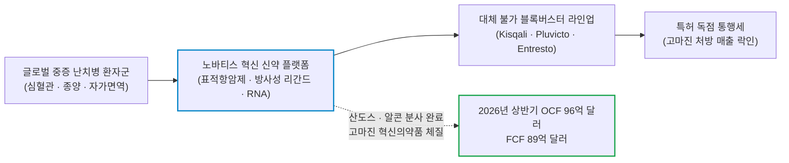
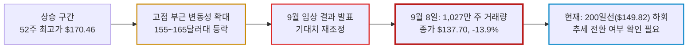

# 노바티스(Novartis / NVS) 실전 재무 및 가치 분석 보고서

- **작성일**: 2026-09-10
- **데이터 기준**: 2026년 2분기 실적(2026-06-30 마감) 및 yfinance 시장 데이터(2026-09-09 미국장 마감 기준)

스위스의 거대 제약사가 9월 초 연이은 후기 임상 악재로 큰 폭의 매도 압력을 맞았다. 다만 2026년 상반기 89억 달러의 잉여현금흐름과 3.44%의 선행 배당수익률이 특정 가격대를 떠받쳐 준다는 뜻은 아니다. 파이프라인 가치 훼손과 기존 제품의 현금 창출력을 분리해서 봐야 한다.

## 핵심 요약

| 구분 | 핵심 요약 |
| :--- | :--- |
| **종목 및 주가** | 노바티스 ADR (NYSE: `NVS`) / **$137.48** (52주 범위 $121.57 ~ $170.46) |
| **최종 투자의견** | **관망 및 조건부 분할 매수 (Wait & Watch / Conditional Dip Buy)** / 투매 진정 및 130달러 초반 지지 확인 후 선발대 접근 (투자 가치 점수 **62.0점**, 6.1절) |
| **비즈니스 본질** | 산도스·알콘 분사로 완성된 순수 혁신 신약(Pure-play) 체제, 키스칼리·플루빅토·코센틱스 등 독점 블록버스터 캐시카우 |
| **핵심 매력 (Bull)** | 2026년 상반기 FCF $8.9B, 선행 PER 14.0배, 선행 배당수익률 3.44%의 현금 창출력 |
| **핵심 리스크 (Bear)** | 9월 펠라카르센(심혈관) 및 델데시란(DM1) 후기 임상 1차 평가변수 미달, 200일선(-8.2%) 하회와 1,027만 주 거래량 급증 |
| **포트폴리오 성격** | 계좌 하방을 지탱할 **저베타 헬스케어 수비수(베타 0.49)** / **단기 V자 반등을 노리는 단타족·모멘텀 투기꾼은 매수 금지** |

---

## 1. 비즈니스 실체: 대중이 모르는 기업의 '목줄'과 독점 빨대

대중은 제약회사를 그저 '아플 때 먹는 약을 파는 곳'으로 순진하게 바라본다. 자본시장의 관점에서 노바티스(Novartis, `NVS`)는 전 세계 중증 난치병 환자들의 생명줄에 독점 빨대를 꽂고 분기마다 수십억 달러의 통행세를 거둬들이는 거대 제약 제국이다.

과거의 노바티스는 제네릭(복제약)의 산도스(Sandoz), 안과 수술 장비의 알콘(Alcon) 등 돈 안 되고 덩치만 큰 잡동사니 사업부를 거느린 비대한 복합기업이었다. 그러나 경영진은 잔혹할 정도로 냉정하게 체질을 뜯어고쳤다. 2019년 알콘을 분사하고 2023년 말 제네릭 부문인 산도스마저 주주들에게 털어내며, 영업이익률 30%를 웃도는 **'순수 혁신 의약품(Innovative Medicines)'** 전문 제약사로 환골탈태를 마쳤다.

### 1.1 환자의 목줄을 쥔 핵심 블록버스터 제국

노바티스의 실적을 지탱하는 것은 단순한 비타민이나 감기약이 아니다. 처방을 중단하는 순간 환자의 생명이 위태로워지는 중증 치료제들이다.

- **① 엔트레스토(Entresto) — 심부전 환자의 생명선**:
    - 글로벌 만성 심부전 치료의 확고한 1차 표준 치료제다. 복용을 멈추면 사망률과 재입원율이 치솟기 때문에 의사도 환자도 처방을 바꿀 수 없다.
- **② 키스칼리(Kisqali) — 유방암 표적치료제의 질주**:
    - CDK4/6 억제제 계열의 혁신 항암제다. 전이성 유방암뿐만 아니라 조기 유방암 환자를 대상으로 적응증을 확대하며 화이자의 입랜스(Ibrance) 점유율을 갉아먹는 핵심 성장 기관차다.
- **③ 플루빅토(Pluvicto) — 방사성 리간드(RLT) 독점 병기**:
    - 전립선암 환자의 암세포 표적에 방사성 동위원소를 직접 배달해 태워버리는 첨단 의약품이다. 방사성 물질의 특수 취급과 제조 허가 장벽이 극단적으로 높아 경쟁사의 진입 자체가 봉쇄된 독점 구역이다.
- **④ 코센틱스(Cosentyx) & 케심프타(Kesimpta) — 자가면역 및 신경 질환 캐시카우**:
    - 건선·관절염 자가면역 질환 시장의 든든한 방파제인 코센틱스와 환자가 집에서 자가 주사할 수 있는 다발성 경화증 치료제 케심프타가 매 분기 수십억 달러의 고마진 현금을 퍼올린다.

---

## 2. 최근 실적과 시장의 오독: 대중의 착시 vs 숫자의 팩트

### 2.1 2분기 실적 팩트 체크: 본업의 캐시 머신은 여전히 돈을 번다

2026년 2분기 노바티스의 장부를 뜯어보면, 기초 체력은 여전히 전 세계 제약사 최상위권의 현금 창출력을 유지하고 있다.

| 재무 지표 | Q2 2025 | Q1 2026 | Q2 2026 | 전년 동기 대비(YoY) | 냉혹한 데이터 분석 |
| :--- | ---: | ---: | ---: | ---: | :--- |
| **순매출** | $14,054.0M | $13,113.0M | **$14,408.0M** | **+2.5%** | 핵심 브랜드의 처방 확대로 달러 기준 매출 증가 |
| **IFRS 영업이익** | $4,864.0M | $4,235.0M | **$4,750.0M** | **-2.3%** | 매출 증가에도 영업이익은 전년보다 감소 |
| **영업이익률 (OPM)** | 34.6% | 32.3% | **33.0%** | **-1.6%p** | 높은 마진은 유지했지만 전년 수준에는 못 미침 |
| **IFRS 순이익** | $4,024.0M | $3,156.0M | **$3,257.0M** | **-19.1%** | 전년 대비 순이익 감소 |
| **IFRS 희석 EPS** | $2.07 | $1.65 | **$1.71** | **-17.4%** | 주당 이익도 전년보다 감소 |
| **영업현금흐름 (OCF)** | $6,664.0M | $3,676.0M | **$5,882.0M** | **-11.7%** | 상반기 누적 $9.56B로 전년 동기 $10.31B 대비 7.3% 감소 |
| **잉여현금흐름 (FCF)** | $6,333.0M | $3,330.0M | **$5,561.0M** | **-12.2%** | 회사 정의 FCF는 전년보다 감소했지만 상반기 $8.89B 유지 |
| **현금 및 단기투자자산** | $7,000.0M | $6,977.0M | **$7,690.0M** | **+9.9%** | 유동성은 유지했지만 순부채는 연말 대비 증가 |

출처: 노바티스 2026년 2분기 실적 공시(2026-06-30 마감 기준). 순매출·영업이익·순이익·EPS·회사 정의 FCF는 회사 공시 기준이고, 현금 및 단기투자자산과 순부채는 yfinance 분기 재무 데이터 기준이다.

### 2.2 최근 핵심 뉴스 타임라인 (2026-07-21 ~ 2026-09-09)

2026년 7월 호실적 발표로 52주 신고가 랠리를 달리던 주가가, 9월 초 불과 일주일 사이에 연달아 터진 3건의 신약 임상 중단 및 3상 실패 충격으로 2020년 3월 이후 최대 일일 낙폭(-13.93%)을 기록했다. 언론에 보도된 핵심 뉴스 흐름은 다음과 같다.

| 일자 | 주요 뉴스 및 시장 이벤트 | 영향도 | 핵심 팩트 및 시사점 |
| :--- | :--- | :---: | :--- |
| **09.09** | **델데시란 임상 3상 1차 목표 미달 공식화 및 중기 성장 전망 유지** | `🔴 악재` | 120억 달러를 들인 어비디티 인수 핵심 후보물질의 유효성 미달. '25~'30년 연평균 매출 성장률 5~6% 전망 유지 |
| **09.09** | **일주일 새 3연속 임상 차질 누적으로 ADR -13.93% 급락 마감** | `🔴 대량 매도` | 델데시란 3상 실패, 펠라카르센 3상 실패, 세포치료제 랩셀 8건 중단 등 3연속 차질. 9월 8일 종가 $137.70 마감(2020년 3월 이후 최대 낙폭) |
| **09.08** | **근긴장성 디스트로피(DM1) 3상 유효성 미입증 발표 및 장전 급락** | `🔴 장전 급락` | 근긴장성 이영양증 3상 유의미 효과 미확인 발표로 프리마켓 -12.7% 급락 |
| **09.08** | **심혈관 신약 펠라카르센 8,323명 임상 3상(HORIZON) 1차 지표 미달** | `🔴 임상 실패` | 8,323명 참여 임상에서 Lp(a) 저하에도 심혈관계 사건 감소 1차 평가변수 미달 |
| **09.02** | **자가면역 CAR-T '랩셀' 중증 반응 환자 사망에 따른 임상 8건 잠정 중단** | `🔴 안전성 이슈` | 8월 24일 조치. 환자 3명 사망(심각한 면역 반응)으로 자가면역·신경질환 임상 8건 중단 (혈액암 CAR-T는 무관) |
| **09.01** | **다발성경화증 치료제 긍정적 임상 결과 발표 및 장전 상승** | `🟢 임상 호재` | 다발성경화 신약 긍정적 임상 결과 발표로 프리마켓 +5.0% 급등 |
| **07.21** | **2분기 실적 컨센서스 상회 발표 및 연간 가이던스 달성 전망 제시** | `🟢 실적 호재` | 컨센서스 상회 실적 및 2026년 가이던스 달성 전망으로 프리마켓 +3.2% 상승 |

### 2.3 2026년 9월 초 일주일 새 터진 3연속 임상 차질과 주가 붕괴 타임라인

9월 초에는 후기 임상 결과와 안전성 이슈가 연달아 터졌다. 세 건의 차질은 파이프라인 기대치를 확실히 깎아냈다. 다만 이것을 회사 전체 R&D 역량의 붕괴나 장기 성장률 훼손으로 확대 해석하는 것은 아직 비약이다. 회사는 2025~2030년 연평균 매출 성장률 5~6%라는 기존 전망을 유지하고 있다.

- **① 2026년 8월 24일 조치 / 9월 2일: 자가면역 CAR-T 신약 '랩셀' 환자 사망으로 임상 8건 전격 중단**:
    - 루푸스, 류머티즘 관절염, 다발성 경화증 등 자가면역 및 신경질환 치료용 실험적 CAR-T 치료제 '랩셀(Rap-cell)' 임상에 참여한 환자 3명이 생명을 위협하는 심각한 면역 반응 끝에 사망했다.
    - 독립 안전성 위원회와 함께 사망 원인과 부작용 조기 발견 방안을 검토하기 위해 8건의 임상시험이 전격 중단되었다 (단, 혈액암 대상 CAR-T 임상은 유지).
- **② 2026년 9월 초 / 9월 8일: 심혈관 신약 펠라카르센(Pelacarsen) 임상 3상(HORIZON) 1차 지표 미달**:
    - 아이오니스(Ionis)와 손잡고 심혈관 질환의 새로운 타깃인 '지단백(a) [Lp(a)]'을 낮추기 위해 개발하던 안티센스 올리고뉴클레오타이드 신약 펠라카르센이 8,323명 참여 3상에서 주요 심혈관 사건(MACE) 감소라는 1차 평가변수 달성에 실패했다.
    - Lp(a) 수치는 크게 낮췄으나 임상적 사건 감소로 이어지지 못해 블록버스터 기대치에 제동이 걸렸다.
- **③ 2026년 9월 8일: 근긴장성 이영양증 1형(DM1) 신약 델데시란(Del-desiran) 임상 3상(HARBOR) 1차 평가변수 미달**:
    - 약 120억 달러에 인수한 어비디티 바이오사이언스(Avidity Biosciences)에서 확보한 DM1 후보물질 델데시란은 1차 평가변수인 비디오 손 펴기 시간(vHOT)에서 위약 대비 통계적 유의성을 보이지 못했다.
    - 노바티스는 전체 데이터를 분석하고 규제기관과 협의한 뒤 개발 방향을 결정한다는 입장이다.
- **④ 9월 8일 단 하루 만에 1,027만 주 거래량 급증 ($159.99 ➔ $137.70)**:
    - 9월 8일 거래량은 **1,027만 주**로 늘었고, 종가는 전 거래일 $159.99에서 **$137.70(-13.9%)**로 하락했다 (2020년 3월 이후 최대 일일 하락).
    - 단 며칠 사이에 시가총액 약 320억 달러(한화 수십조 원)가 증발했다.
- **⑤ 하락의 성격 판정**:
    - 단기 매도를 끌어낸 것은 일주일 사이 연달아 터진 3연속 임상 차질과 파이프라인 기대치 재조정이다. 공개된 시세와 거래량만으로는 어떤 주체가 어떤 기준으로 팔았는지 드러나지 않으므로, 기관 스톱로스나 투자의견 강등을 하락의 원인으로 지목하는 해설은 추측에 불과하다.

### 2.4 시장의 착시 vs 냉혹한 데이터 팩트

| 시장이 보고 놀란 것 (착시) | 데이터가 말해주는 진실 (팩트) |
| :--- | :--- |
| **"임상 3상 2건 연쇄 실패로 노바티스는 끝장났다"** | 두 후보물질의 가치와 후속 성장 기대치는 낮아졌다. 그러나 기존 승인 제품의 매출 기반이 곧 사라진다는 뜻은 아니다. 다만 상반기 OCF와 FCF는 전년보다 감소했다. |
| **"하루 만에 -14% 폭락했으니 무한 나락으로 갈 것이다"** | 9월 8일의 대량 거래와 급락은 확인됐다. 그러나 하루치 거래량은 투매의 주체도, 공포의 소진 여부도, 바닥의 위치도 알려주지 않는다. 선행 PER 14.0배와 3.44%의 선행 배당수익률은 밸류에이션 참고치이지 주가 하한선이 아니다. |
| **"싸졌으니 지금 당장 영끌해서 쓸어 담아야 한다"** | 본업이 우량하다고 해서 떨어지는 칼날을 맨손으로 받아서는 안 된다. 파이프라인 신뢰가 깨진 제약주는 시장 참여자들의 트라우마가 아물기까지 수개월간 횡보하는 밸류 트랩(Value Trap)에 갇힐 위험이 크다. 바닥 지지 확인 없는 성급한 추격은 자살행위다. |

---

## 3. 경쟁 해자 및 피어 그룹 잔혹 비교

글로벌 빅파마 시장에서 노바티스의 위치를 피어 그룹과 잔혹하게 대조해 보면, 이번 사태로 발생한 징벌적 디스카운트와 회사의 명암이 뚜렷하게 드러난다.

| 시장 비교 지표 | 노바티스 `NVS` | 아스트라제네카 `AZN` | 머크 `MRK` | 화이자 `PFE` | 일라이 릴리 `LLY` |
| :--- | ---: | ---: | ---: | ---: | ---: |
| **현재 주가 ($)** | **137.48** | 156.94 | 147.53 | 27.78 | 1124.21 |
| **시가총액 ($B)** | **261.3** | 243.4 | 364.0 | 158.3 | 1002.5 |
| **후행 PER (TTM)** | **20.8배** | 23.5배 | 118.0배 | 36.6배 | 37.8배 |
| **선행 PER (Forward)** | **14.0배** | 13.8배 | 15.5배 | 9.6배 | 23.8배 |
| **주가매출비율 (P/S)** | **4.6배** | 4.0배 | 5.5배 | 2.5배 | 12.6배 |
| **EV/EBITDA** | **13.1배** | 13.6배 | 14.2배 | 8.3배 | 25.1배 |
| **영업이익률 (TTM)** | **34.6%** | 23.5% | -0.2% | 27.9% | 54.2% |
| **배당수익률 (Yield)** | **3.44%** | 2.00% | 2.29% | 6.19% | 0.62% |

출처: yfinance 시장 데이터(2026-09-09 종가 기준). [Novartis(NVS)](https://finance.yahoo.com/quote/NVS/), [AstraZeneca(AZN)](https://finance.yahoo.com/quote/AZN/), [Merck(MRK)](https://finance.yahoo.com/quote/MRK/), [Pfizer(PFE)](https://finance.yahoo.com/quote/PFE/), [Eli Lilly(LLY)](https://finance.yahoo.com/quote/LLY/)

### 3.1 피어 대비 핵심 경쟁력 및 리스크 판정

- **노바티스 vs 일라이 릴리 (LLY) — 광풍의 주역과 소외된 전통 강자**:
    - 일라이 릴리는 GLP-1 비만 치료제(마운자로·젭바운드) 광풍에 힘입어 시가총액 1조 달러를 돌파하고 선행 PER 23.8배, P/S 12.6배라는 비이성적 고평가를 누리고 있다.
    - 노바티스는 비만 신약 파이프라인이 없어 이 광풍에서 철저히 소외되었으나, 역으로 선행 PER 14.0배와 34.6%의 견고한 영업이익률, 3.44%의 배당을 갖춘 '단단한 가치주'의 영역에 자리 잡고 있다.
- **노바티스 vs 아스트라제네카 (AZN) — 파이프라인 기대의 재조정**:
    - 아스트라제네카(선행 PER 13.8배)와 노바티스(14.0배)는 시총과 밸류에이션이 비슷하다. 노바티스의 두 후기 임상 결과는 개별 후보물질의 기대 매출과 파이프라인 프리미엄을 낮췄다. 이를 회사 전체의 R&D 집행 능력 실패로 일반화할 근거는 아직 부족하다.
- **화이자(PFE)의 밸류 트랩 전철을 밟지 않기 위한 조건**:
    - 화이자는 코로나 백신 특수가 끝난 뒤 주가가 20달러대로 추락하며 선행 PER 9.6배, 배당 6.2%의 만년 저평가 함정에 갇혔다.
    - 노바티스는 특정 단일 제품 거품이 꺼진 것이 아니며, 키스칼리와 플루빅토 등 상업화 블록버스터가 다변화되어 있어 화이자 수준의 밸류 붕괴는 피할 수 있다. 그러나 후속 R&D 성과가 장기간 지연될 경우 멀티플 상단이 15배 아래로 영구 억눌리는 '빅파마 디스카운트'를 감내해야 한다.

---

## 4. 기술적 사이클 위치 (4단계 사이클 모델)

노바티스 ADR은 9월 9일 기준 200일 이동평균선 아래에 있다. 그러나 하루짜리 장대 음봉과 단발성 거래량 폭증만으로는 스탠 와인스타인식 4단계 하락 추세 진입을 선고할 증거가 못 된다. 지금은 장기 추세가 실제로 꺾였는지 검증해야 하는 구간이다.

| 기술 지표 | 2026-09-09 기준값 | 기술적 상태 판정 |
| :--- | ---: | :--- |
| **현재 주가** | **$137.48** | **단기 수직 폭락**, 9월 8일 하루 만에 **-13.9%** 장대 음봉 기록 |
| **52주 최고가** | **$170.46** | 최고점 대비 **-19.35%** 급락 (상승 추세 완전 이탈) |
| **52주 최저가** | **$121.57** | 최저점 대비 **+13.09%** 상회 (120달러 초반의 중기 지지선 대기) |
| **50일 이동평균선** | **$154.87** | 주가가 50일선 대비 **-11.23%** 하회 (단기 과매도 심화) |
| **200일 이동평균선** | **$149.82** | 장기 이동평균 대비 **-8.24%** 하회 (추세 훼손 여부 확인 필요) |
| **최근 거래량** | **10.27M 주 (9/8)** | 직전 거래일(129만 주)의 약 8배로 폭증. 투매의 주체와 소진 여부는 아직 드러나지 않음 |

### 4.1 차트가 말하는 냉혹한 현실: 바닥 확인 없는 섣부른 진입은 자살행위다

주가는 200일선($149.82)을 하회했고, 9월 8일 거래량은 직전 거래일의 8배인 1,027만 주로 폭증했다. 장대 음봉과 대량 거래가 동시에 터진 자리는 기술적으로 추세 훼손 경고 구간이다.

급락 직후에는 추가 하락과 반등이 모두 가능하다. 130달러대 지지, 거래량 정상화, 200일선 회복 여부를 확인하기 전까지 가격만으로 바닥을 선언하지 마라.

---

## 5. 밸류에이션 및 가격 타당성 검증

### 5.1 선행 EPS 역산 가격 시나리오

yfinance 기준 노바티스의 선행 EPS(향후 12개월 조정 EPS) 컨센서스는 **$9.81**이다. 현재 주가 $137.48은 이 예상치 기준 **선행 PER 약 14.0배** 수준이다. 아래 표는 적용 멀티플을 가정값으로 그대로 노출한 민감도 계산이며, 파이프라인 기대가 깎인 국면에서 16~18배 같은 과거 멀티플을 적정가의 근거로 들이대는 계산은 희망을 숫자로 포장한 결과물에 불과하다.

| 시장 시나리오 | 적용 선행 PER | 산출 적정 주가 | 현재가($137.48) 대비 | 시나리오 발동 조건 |
| :--- | :---: | ---: | ---: | :--- |
| **Bear (비관적)** | **12.0배** | **$117.72** | **-14.4%** | 후보물질 가치 하향, 후속 파이프라인 기대 약화, 약가 인하 압박 |
| **Base (중립적)** | **14.5배** | **$142.25** | **+3.5%** | 기존 승인 약물(키스칼리·플루빅토) 실적 방어, 3.4% 배당 수급 유입, 130~145달러 박스권 안착 |
| **Bull (낙관적)** | **17.0배** | **$166.77** | **+21.3%** | 신약 실패 충격 흡수 완료, 키스칼리 조기 유방암 적응증 폭발, 비만 광풍의 LLY를 제외한 피어 최상단(MRK 15.5배)을 넘어서는 17배까지 멀티플 재확장 |

### 5.2 가격 타당성 판정

- 현재 주가 $137.48은 Bear와 Base 시나리오 사이에 있다. 이는 선행 EPS와 적용 멀티플에 따른 계산 결과일 뿐, 시장이 성장 가치를 영구히 박탈했다고 증명하지는 않는다.
- 2026년 상반기 OCF $9.56B, FCF $8.89B와 3.44%의 선행 배당수익률은 현금 창출력의 근거다. 다만 이 지표들은 $120 같은 특정 가격의 하한선을 보장하지 않는다.
- 두 후기 임상 결과는 단기 성장 기대를 낮췄다. 현 주가는 저평가 여부보다 추가 임상·매출·가이던스 확인이 필요한 가치주 후보로 보는 편이 정확하다.

---

## 6. 종합 평가 및 냉혹한 계좌 실행 원칙

### 6.1 6대 핵심 투자 지표 다차원 평가 매트릭스

| 평가 영역 | 가중치 | 평점 (100점 만점) | 가중 점수 | 등급 | 핵심 평가 요약 |
| :--- | :---: | :---: | :---: | :---: | :--- |
| **① 비즈니스 모델 및 해자** | 25% | **75점** | 18.75 | `B+` | 기존 블록버스터의 경쟁력은 유지되나 후기 파이프라인 기대는 낮아짐 |
| **② 실적 성장성 및 가이던스** | 25% | **55점** | 13.75 | `C-` | 두 후기 임상 결과가 후보물질 가치에 악영향. 실적·가이던스의 직접 영향은 추가 확인 필요 |
| **③ 재무 건전성 및 현금흐름** | 20% | **75점** | 15.00 | `B` | 상반기 FCF $8.89B는 강점이나, 순부채가 2025년 말 $22.0B에서 $39.5B로 증가 |
| **④ 밸류에이션 매력도** | 15% | **65점** | 9.75 | `B-` | 주가 급락으로 선행 PER 14.0배 다이어트 완료, 배당 매력 부각되나 성장 정체 리스크 상존 |
| **⑤ 기술적 매매 타이밍** | 10% | **30점** | 3.00 | `F` | 200일선 대비 -8.2%, 거래량 급증. 4단계 하락 추세 확정은 아직 이르다 |
| **⑥ 리스크 관리 가능성** | 5% | **35점** | 1.75 | `D` | 임상·인수 파이프라인 불확실성과 순부채 증가를 함께 점검해야 함 |
| **종합 가중치 환산 점수** | **100%** | — | **62.0점** | **`Hold & Conditional Watch`** | **기존 제품의 현금 창출력은 남았지만, 임상·재무·추세 확인 전 관망이 우선** |

!!! info "평점 산출 근거"
    종합 점수는 각 평가 영역의 평점에 가중치를 곱하여 엄격히 산출했다.
    `75×0.25 + 55×0.25 + 75×0.20 + 65×0.15 + 30×0.10 + 35×0.05 = 62.00점`

    상반기 FCF와 기존 제품의 해자는 회사의 현금 창출력을 뒷받침한다. 반면 후기 임상 결과, 어비디티 인수에 따른 순부채 증가, 200일선 하회는 단기 진입 판단을 어렵게 한다. 종합 **62.0점**은 확정적 바닥을 전제하지 않는 관망 국면을 가리킨다.

### 6.2 실전 결론: "그래서 지금 어쩌라는 것인가?" (Action Verdict)

#### ① 지금 당장 사야 하는가? ➔ **"절대 사지 마라. 떨어지는 칼날에 손모가지 걸지 마라."**

- **이유**: 9월 8일의 1,027만 주 폭증과 13.9% 하락은 추세 훼손 경고다. 투매가 하루 만에 끝났는지 확인되지 않은 자리에서 먼저 손을 얹는 행위는 남의 손절 물량을 대신 받아주는 짓이다.
- **지금 할 일**: 관심종목 창에만 올려두고, 거래량이 마르면서 130달러 초반에서 하방 경직성을 확보하는지 확인하는 **'적극적 관망(Wait & Watch)'**이다.

#### ② 이런 주식은 누가 사고, 누가 절대 사면 안 되는가?

- **❌ 절대 사지 마라 (즉시 퇴장)**:
    - 1~2달 안에 급반등해서 20~30% 먹겠다는 단타족.
    - AI나 바이오테크처럼 폭발적인 주가 탄력을 기대하는 공격적 성장주 추종자.
    - 주가가 2~3달간 지루하게 횡보하면 좀이 쑤셔 견디지 못하는 성격 급한 자.
- **⭕ 눈독 들이고 주워 담아야 할 사람 (스나이퍼 대기)**:
    - 연 3.4% 수준의 든든한 달러 배당금을 받으며 계좌의 변동성을 죽여줄 방파제가 필요한 자산가.
    - 대중의 공포로 인해 멀티플 14배까지 내동댕이쳐진 우량 기업을 바닥에서 주워 2~3년간 진득하게 묵힐 수 있는 가치 역발상 투자자.

#### ③ 이 주식으로 '인생 역전(대박)'을 노리면 안 되는 냉혹한 이유

- **시가총액 2,600억 달러의 거대 공룡**: 이미 글로벌 제약 시장을 장악한 성숙기 기업이다. 스타트업처럼 매출이 2배씩 튈 수 없다.
- **포트폴리오 내 진짜 쓸모**: 계좌의 수익률을 폭발시키는 공격수가 아니라, 시장이 피바다가 될 때 베타 0.49의 방어력과 달러 현금 배당으로 계좌가 깨지는 것을 막아줄 **'둔탁한 방패(수비수)'**에 불과하다.

### 6.3 실전 가격대별 실행 시나리오 및 분할 매수 로드맵

노바티스에 배정하기로 한 투자 예산 내부의 비중이며, **전체 포트폴리오 대비 최대 허용 편입 한도는 3.0% 이내**로 엄격히 제한한다.

| 구분 | 실행 조건 | 배정 비중 / 계좌 한도 | 가격 기준 | 대응 방침 |
| :--- | :--- | :---: | :---: | :--- |
| **1차 진입 (선발대)** | 투매 거래량 진정 및 $130선 하방 지지 확인 시 | **20% / 0.6%** | **$128 ~ $133** | 악재 소화 확인 후 정찰대 성격의 소액 진입 |
| **2차 매수 (주력)** | 거래량 급감 횡보 후 단기 바닥 확인 양봉 출현 | **35% / 1.0%** | **$132 ~ $136** | 1차보다 비싸도 바닥 확인 대가를 치르고 핵심 비중 집행 |
| **3차 매수 (추세 복원)** | 200일선($150) 재탈환 및 종가 안착 시 | **25% / 0.8%** | **$150 ~ $154** | 장기 이동평균 회복 확인 후 추세 추종 |
| **예비 현금** | 추가 임상·실적 변수 대비 버퍼 | **20% / 0.6%** | — | 조건 충족 시까지 현금으로 계좌 보존 |
| **철수 기준선 (재검토)** | 52주 최저가 완전 붕괴 및 실적·파이프라인 악화 동반 | **전량 재검토** | **주봉 종가 $120 하회** | 가격만으로 펀더멘털 훼손을 단정하지 말고, 투자 근거를 재점검 |

!!! tip "최종 핵심 제언 (Executive Takeaway)"
    - **최종 투자 가치 점수**: **62.0점 / 100점** (`Hold & Conditional Watch` / 펀더멘털 하방 지지, 긴 호흡의 바닥 확인 필수)
    - **공포의 본질을 꿰뚫어라**: 펠라카르센과 델데시란의 후기 임상 결과는 성장 기대를 낮췄다. 기존 제품의 현금 창출력은 남았지만, 2분기 OCF는 11.7%, 회사 정의 FCF는 12.2% 줄었다.
    - **그러나 조급증은 계좌를 파멸로 이끈다**: 1,027만 주 거래량 급증 뒤의 가격 경로는 아직 확인되지 않았다. 200일선 하회만으로 바닥 형성 기간을 단정하지 마라.
    - **냉혹하게 기다려라**: 지금은 돈을 넣는 시간이 아니라, 주가가 130달러 초반에서 멈추어 서는 것을 차분히 지켜보며 스나이퍼처럼 방아쇠를 당길 타이밍을 노릴 때다.
