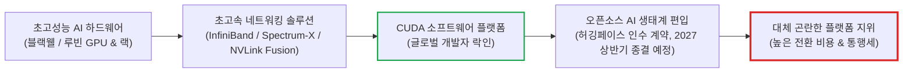
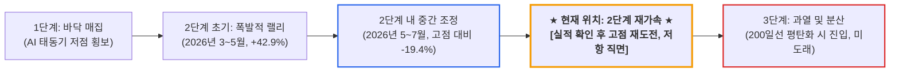

# 엔비디아(NVIDIA, NVDA) 실전 재무 및 가치 분석 보고서

- **작성일**: 2026-09-07
- **데이터 기준**: 2027 회계연도 2분기(2026년 7월 26일 마감, 8월 26일 실적 발표) 확정 실적, 최근 3개월 공시 및 뉴스(2026.06~09), yfinance 시장·재무 데이터(종가 2026-09-04 기준)

대중이 AI 버블론과 피크아웃 공포에 질려 섣부른 천장을 논할 때, 엔비디아(NVDA)는 분기 매출 962억 달러, 전년 대비 106% 증가라는 숫자로 시장의 눈높이를 밟고 지나갔다. 그런데 언론이 떠드는 "마진 피크아웃"은 애초에 데이터에 없는 이야기고, 정작 진짜로 나빠진 숫자는 아무도 들여다보지 않는 현금흐름표 안에 숨어 있다. 독점 플랫폼의 해자와 이번 분기에 실제로 금이 간 지점을 숫자로 발라낸다.

## 핵심 요약

| 구분 | 핵심 요약 |
| :--- | :--- |
| **종목 및 주가** | 엔비디아 (NVIDIA Corporation, NASDAQ: `NVDA`) / **$230.36** (52주 범위 $164.27 ~ $236.54, 고점 대비 -2.6%) |
| **최종 투자의견** | **조건부 분할 매수 (Buy on Pullback)** / 20~50일선 눌림목 분할 매수 (투자 가치 점수 **86.85점**, 7.1절) |
| **비즈니스 본질** | AI 하드웨어 독점과 CUDA 소프트웨어 락인으로 전 세계 AI 컴퓨팅 통행세를 징수하는 인프라 사업자 |
| **핵심 매력 (Bull)** | 분기 매출 962억$(YoY +106%), 영업이익률 66.2%로 4개 분기 연속 확대, 3분기 가이던스 1,080억$로 컨센서스 상회 |
| **핵심 리스크 (Bear)** | 영업현금흐름 전환율 86%&rarr;40% 급락, 매출채권 잔액 631억$(한 분기 +223억$)·차입금 260억$ 증가, 가이던스에 중국 매출 전액 배제 |
| **포트폴리오 성격** | 계좌 수익률을 견인할 **핵심 공격수 (AI 주도주)** / 베타 2.22, **52주 고점 재도전 구간 추격 매수 금지** |

---

## 1. 비즈니스 실체: 단순 칩 장사가 아닌 'AI 운영체제'의 독점 빨대

엔비디아가 세계 시총 1위를 다투는 AI 시대의 절대 권력이라는 사실을 이제 모르는 사람은 없다. 하지만 대중은 여전히 엔비디아를 그저 비싼 실리콘 칩(GPU)을 찍어내 빅테크에 납품하는 '단순 하드웨어 부품 제조사' 수준으로 오독한다. 경쟁사 칩이나 빅테크 자체 ASIC이 나오면 금세 점유율이 털릴 거라며 섣부른 피크아웃을 떠드는 이유가 여기에 있다. 천만의 말씀이다. 엔비디아는 단순한 칩 장사꾼이 아니라, 전 세계 인공지능(AI) 인프라의 핵심 연산 장치와 개발자 소프트웨어 생태계를 동시에 틀어쥔 **독점적 컴퓨팅 플랫폼 사업자**다.

생성형 AI, 거대언어모델(LLM), 자율주행, 로보틱스를 학습시키고 실시간으로 추론하려면 상상을 초월하는 초병렬 연산 능력이 필요하다. 엔비디아의 고성능 GPU와 이를 수만 개 단위로 연결해 주는 서버용 랙(Rack) 및 네트워킹 시스템(Quantum InfiniBand / Spectrum-X)이 없으면 데이터센터는 단 한 발자국도 움직이지 못한다.

대중이 AI 골드러시에서 누가 금을 캘지를 두고 뜬구름 잡는 토론을 벌일 때, 엔비디아는 광부 모두에게 반드시 필요한 곡괭이와 삽을 팔면서 돈을 쓸어 담는 **인프라 길목 사업자**다.

### 1.1 하드웨어 껍데기 뒤에 숨겨진 진짜 해자: CUDA 플랫폼

엔비디아의 진정한 무기는 실리콘 칩 자체가 아니다. 2006년부터 젠슨 황이 장기 적자를 감수하며 구축해 온 **CUDA(Compute Unified Device Architecture)** 소프트웨어 생태계다.

- 전 세계 AI 연구원, 데이터 사이언티스트, 소프트웨어 엔지니어들은 학부생 시절부터 CUDA 라이브러리 위에서 코드를 짜고 알고리즘을 최적화해 왔다.
- 타사(AMD, 인텔, 빅테크 자체 ASIC)가 아무리 가성비 좋은 하드웨어를 들고나와도, 기존에 돌아가던 방대한 AI 소프트웨어 코드를 다른 칩셋 언어로 이식하는 데 드는 비용과 시간, 버그 리스크는 감당하기 어렵다.
- 즉 **극단적인 전환 비용(Lock-in Effect)**이 고객의 발목을 잡고 있으며, 개발자가 몰릴수록 라이브러리가 풍부해지는 네트워크 효과가 작동한다.

### 1.2 매출의 92.5%가 한 부문에서 나온다: 해자인 동시에 집중 리스크

이 회사를 "다각화된 반도체 기업"으로 부르면 안 된다. FY27 2분기 매출 구성을 보면 실체가 드러난다.

| 구분 | FY27 Q2 매출 | 전체 대비 비중 | 전년 대비 증감 |
| :--- | :---: | :---: | :---: |
| **데이터센터** | **$890.0억** | **92.5%** | **+117%** |
| 게이밍·프로페셔널·자동차 등 나머지 전 부문 합계 | 약 $72.2억 | 약 7.5% | — |
| **전사 합계** | **$962.2억** | 100% | +106% |

- 데이터센터 부문 성장률(+117%)이 전사 성장률(+106%)을 웃돈다. 나머지 사업부는 성장 기여도가 사실상 반올림 오차 수준으로 밀려났다.
- 이 구조를 두고 "독점의 순도가 높다"고 읽을 수도 있고, "하이퍼스케일러 몇 곳의 설비 투자 결정에 회사 전체가 매달려 있다"고 읽을 수도 있다. **둘 다 맞다.** 데이터센터 CAPEX 사이클이 꺾이면 완충 장치가 없다는 뜻이기도 하다.

---

## 2. 최근 3개월 핵심 뉴스 및 실적 흐름 심층 분석 (2026년 6월 ~ 9월)

### 2.1 2026년 여름 핵심 뉴스 타임라인 (팩트 vs 노이즈 vs 스마트머니)

| 일자 | 주요 뉴스 및 시장 이벤트 | 분류/영향 | 스마트머니 관점의 팩트 판정 및 핵심 시사점 |
| :--- | :--- | :---: | :--- |
| **09.02** | **짐 크레이머, "애플처럼 5,000억$ 자사주 매입 단행해야"** | `🟢 주주환원` | 천문학적 현금 창출력에 걸맞은 매입 확대 촉구. 이미 5월 한도 800억$ 추가 승인 및 AI 스타트업 투자 병행 중 |
| **09.02** | **★ 허깅페이스(Hugging Face) 인수 확정 계약 (총 129.3억$) ★** | `🟢 스마트머니` | 오픈소스 AI 모델 유통 허브(1,800만 개발자, 300만 개 모델) 전격 인수. 플랫폼 개방 유지 약속으로 규제 회피 및 통행세 요금소 장악 |
| **08.31** | **대만 메디아텍(MediaTek) 전환사채(CB) 35억 달러 인수** | `🟢 플랫폼 해자` | NVLink Fusion 채택 조건부 투자. 하이퍼스케일러의 맞춤형 XPU조차 엔비디아 랙 스케일 연결망 안에서 구동되도록 포섭 |
| **08.31** | **아마존, AWS GovCloud에 엔비디아 등 서드파티 AI 모델 Bedrock 통합** | `🟢 호재` | 미국 정부 클라우드에 엔비디아, 앤트로픽, 메타 모델 제공. AWS 2분기 매출 +37%, 영업이익 +63% 폭증과 동반 수혜 |
| **08.28** | **SK하이닉스, 美 인디애나 40억$ 투자로 '30년 핵심 HBM 기지 육성** | `🟢 공급망 안정` | 첨단 패키징 팹 구축 및 '29년 HBM4E 양산 돌입. 엔비디아 차세대 로드맵용 미국 내 공급망 직결 |
| **08.28** | **스티펄·씨티, 실적 발표 후 목표주가 $315 동반 상향** | `🟢 호재` | FY28 매출 70% 가이던스 확인. "수요가 아닌 공급 부족이 성장을 제한하고 있으며, 공급 개선 시 100% 성장도 가능" 진단 |
| **08.28** | **에버코어, 목표주가 $465 상향 ("밸류에이션 극히 매력적")** | `🟢 스마트머니` | 대규모 CAPEX가 수익으로 전환되는 사이클 진입. 점유율 유지 및 확대 가시성 감안 시 현 주가는 성장 전망 대비 지나치게 저렴 |
| **08.26** | **★ FY27 Q2 실적 발표 (장 마감 후) ★** | `🟢 팩트` | **매출 $962.2억(YoY +106%), Non-GAAP EPS $2.22(컨센 $2.09 대비 +6.2%)**. 3분기 가이던스 $1,080억 제시로 익일 +8.74% 급등 |
| **08.25** | **스페이스X, 궤도상 데이터센터(Starmind) 및 AI에 Vera Rubin 탑재** | `🟢 우주/인프라` | 스페이스X와 xAI의 그록(Grok) 인프라 및 궤도 위성에 베라 루빈 NVL72 랙 전면 채택. 수GW급 초거대 컴퓨팅 표준화 |
| **08.24** | **엔비디아, 가중치 공개 모델사 풀사이드(Poolside)에 70억$ 투자** | `🟢 생태계 장악` | 기술 라이선스 60억$ + 지분 10억$(가치 120억$). 핵심 인력 100명 전원을 엔비디아 Nemotron 팀으로 흡수 합병 |
| **08.24** | **★ 엔비디아 AI 서버, HBM 원가 급등에 '가격 15% 이상 인상' 통보 ★** | `🟢 독점력 입증` | 메모리 가격 폭등분을 베라 루빈·블랙웰 서버 랙 가격에 15% 이상 전가 통보. MSFT, GOOGL, ORCL도 전량 수용 (가격결정력) |
| **08.21** | **브로드컴, 엔비디아 모델 벤치마킹해 1,000억$ 금융 플랫폼 추진** | `🟢 시장 표준화` | 블랙스톤·아폴로 참여. 엔비디아가 선도한 5,000억$ 인프라 금융 구조를 브로드컴조차 복제 시도 (앤트로픽 칩 리스) |
| **08.21** | **웨드부시, "H200 GPU 중국 수출 개시, 실적 영향은 미미"** | `🟡 팩트` | 바이트댄스·텐센트 각 1만 대 수령(홍콩 한정). 美 상무부 기업당 10만 대 쿼터 한계로 단기 실적 기여 제한적 |
| **08.19** | **BofA, "잉여현금흐름 대비 34~50% 저평가 상태, 진입 기회" (목표가 $350)** | `🟢 스마트머니` | 강력한 수익성 미반영. AI 인프라 순환투자 우려는 과도하며 시장이 리스크를 지나치게 선반영했다고 지적 |
| **08.12** | **코어위브 호실적 발표 및 엔비디아 A100 GPU 수명 2029년 연장 확인** | `🟢 해자 입증` | 수주잔고 1,040억$ 기록. 2020년산 구형 GPU조차 2029년까지 리스 연장되며 '2년 교체설' 감가상각 공포 분쇄 |
| **08.12** | **오픈소스 AI 모델 '네모트론 3.5 라이트닝(Nemotron 3.5 Lightning)' 공개** | `🟢 SW 생태계` | 개발자들에게 무상 배포. 고성능 추론 최적화를 통해 엔비디아 가속기 인프라 종속성 강화 |
| **08.12** | **BofA, "엔비디아 5,000억$ 인프라 금융 플랫폼, 순환투자 우려 차단"** | `🟢 리스크 해소` | 6개 글로벌 금융사와 컨소시엄 구성. 엔비디아의 직접 부채 부담 없이 AI 기업 자본 조달 지원 구조 완성 |
| **08.11** | **마이크로소프트, 빠르면 9월 Maia 300 공개 준비 소식** | `🔴 노이즈` | TSMC 캐파 조율 및 앤트로픽 홍보 시도. 그러나 엔비디아 랙 스케일 전체를 대체하기엔 소프트웨어 생태계 한계 뚜렷 |
| **08.07** | **비스트라(VST)·KKR·엔비디아, 10억$ 규모 Helix 디지털 인프라 발표** | `🟢 전력/인프라` | 초거대 AI 데이터센터 가동을 위한 전력·인프라 컨소시엄 결성. 에너지 병목을 파트너십으로 선제 해결 |
| **08.06** | **일론 머스크, "스페이스X는 엔비디아 GPU만으로 클라우드 구축" 선언** | `🟢 독점 확인` | AMD Helios 랙 대비 엔비디아의 압도적 성능 우위 공식 확인. 스페이스X 상장 시 최대 수혜 공급망으로 재부각 |
| **08.03** | **중국 문샷AI, 알리바바 경유 엔비디아 칩 2만 개 규모 컴퓨팅 확보** | `🟢 규제 우회 수요` | 미국의 수출 통제 속에서도 중국 빅테크 클라우드를 통한 고성능 GPU 수요 지속 확인 |
| **07.30** | **★ AI 투자 정점 우려 확산에 글로벌 반도체 시총 1.3조$ 증발 ★** | `🔴 패닉 투매` | 엔비디아 시총 2,380억$ 증발. 전일 종가 $190.01이 연중 조정 바닥으로 확정됨. 메모리 3사 동반 급락 (스마트머니의 저점 매집석) |
| **07.27** | **젠슨 황, 美 의회에 "오픈 AI 모델 정책 지원 촉구" 서한 전달** | `🟢 스마트머니` | 개방형 AI 생태계가 번성해야 독점 칩 및 CUDA 플랫폼 통행세가 극대화되는 전략적 포석 |
| **07.27** | **엔비디아, 네이버 AI 데이터센터에 10억$ 투자 (브룩필드 90억$ 자금 결합)** | `🟢 소버린 AI` | DSX 플랫폼 기반 200MW 확장. SK그룹과 2GW 규모 베라 루빈 DSX AI 팩토리 건설 발표 |
| **07.27** | **앰코테크놀로지(AMKR), 엔비디아와 15억$ 전략적 파트너십 체결** | `🟢 밸류체인` | 엔비디아 차세대 베라 CPU 패키징 점유율 60% 확보. GB10, N1X 및 로사(Rubin 후속) 생산 기틀 마련 |
| **07.22** | **MS-미스트랄 유럽 제휴 확대, 엔비디아 베라 루빈 GPU 수천 개 도입** | `🟢 유럽 거점` | 유럽 자주적 AI 인프라 구축에도 엔비디아 차세대 플랫폼 표준 채택 |
| **07.21** | **오라클·엔비디아 회사채 CDS 스프레드 사이클 고점 상승 노이즈** | `🔴 노이즈` | 오라클 196.6bp, 엔비디아 57.25bp 기록하며 IT 부채 우려 제기. 주가 조정 빌미로 작용 |
| **07.21** | **엔비디아, 네오클라우드 네비어스(NBIS) 지분 9.3%로 확대** | `🟢 클라우드 동맹` | 3월 20억$ 투자에 이어 추가 지분 확보. 코어위브에 이은 제2의 전용 GPU 클라우드 진영 구축 |
| **07.15** | **美 상무부, "엔비디아 H200 중국 수출 허가 개시, 물량은 극소수"** | `🟡 정책 리스크` | 국가안보 원칙 하에 선별 승인. 웰스파고 추정 연간 20만 개($60~80억) 매출 기회 잔존 |
| **07.10** | **웨드부시, "베라 CPU, x86 시장 침투로 엔비디아 TAM 대폭 확장"** | `🟢 신규 시장` | 단순 가속기 보조를 넘어 서버용 범용 CPU 시장으로 영역 확장. 인텔·AMD 점유율 잠식 가속 |
| **07.09** | **엔비디아, 오픈소스 'Nemotron 3 Ultra' 발표 (추론 비용 1/10 절감)** | `🟢 SW 해자` | 최상위 상용 모델급 벤치마크 달성 및 Abridge, Amdocs, Box 등 기업용 엔터프라이즈 에이전트 구축 지원 |
| **07.06** | **골드만삭스, "빅테크 ASIC 침투 우려는 이미 주가에 선반영 완료"** | `🟢 밸류에이션` | 상반기 반도체 랠리 소외로 밸류에이션 축소 완료. 추가 하락 압력 제한적이라며 목표가 $285 유지 |
| **06.24** | **시포트 리서치, "순환투자 구조 불안으로 엔비디아 매도" 의견 제시** | `🔴 노이즈` | 엔비디아와 인프라 기업 간 상호 자금 투입 구조를 거품으로 규정하며 매도 리포트 발간 |
| **06.24** | **오픈AI-브로드컴 협력 맞춤형 칩 'Jalapeño' 공개 노이즈** | `🔴 노이즈` | 오픈AI 자체 칩 설계 발표로 엔비디아 의존도 탈피 서사 유포. 그러나 실제 양산 시점 및 CUDA 전환 불가로 영향 무 |
| **06.23** | **슈퍼마이크로(SMCI), ISC 2026에서 베라 루빈 NVL4 파트너로 호명** | `🟢 생태계 확장` | 델과 함께 차세대 베라 루빈 시스템 공급사로 공식 발표되며 당일 +15.7% 급등 |
| **06.16** | **스페이스X, 커서(Cursor) 개발사 Anysphere 600억$ 인수 추진** | `🟢 지분 가치` | 엔비디아가 초기 투자자로 참여한 개발 도구 스타트업의 초대형 엑시트 기회 부각 |
| **06.15** | **★ 5년 만의 200억 달러 회사채 초대형 발행 (7개 트랜치, 국채+90bp) ★** | `🟢 스마트머니` | 2~30년 만기 초장기채를 압도적 저금리로 발행 완료. 재무제표 차입금 260억$ 증가의 실체이자 초우량 신용 방파제 |
| **06.09** | **애플 WWDC, Siri AI 구동을 엔비디아 칩과 구글 인프라에 전면 의존** | `🟢 독점력 입증` | 자체 실리콘의 최강자 애플조차 클라우드 LLM 인프라는 엔비디아 가속기 없이는 불가능함을 자인 |
| **06.05** | **젠슨 황, "베라 루빈에 메모리 3사(SK하이닉스·삼성·마이크론) HBM 검증 완료"** | `🟢 공급 병목 해소` | 3사 물량을 전량 흡수하며 HBM 공급망 다변화 및 차세대 루빈 양산 안정화 선언 |
| **06.05** | **엔비디아, 관계형 파운데이션 모델 스타트업 쿠모AI(Kumo AI) 4억$에 인수** | `🟢 볼트온 인수` | 그래프 AI 석학들로 구성된 핵심 인력을 엔비디아 내부로 흡수 |
| **06.04** | **분기 주당 배당금 25배 인상 ($0.01 &rarr; $0.25, 분기 지급액 60.5억$)** | `🟢 주주환원` | 자사주 매입 위주에서 대규모 현금 배당 병행으로 체질 전환. 연 환산 배당수익률 0.43% |
| **06.02** | **엔비디아 AI PC 칩 계획 공개로 소프트웨어주 급등 및 인텔 타격** | `🟢 영역 파괴` | 데이터센터를 넘어 차세대 On-Device AI PC 시장까지 프로세서 라인업 확장 천명 |
| **06.01** | **우버, 독일 뮌헨 로보택시 프로그램에 NVIDIA Drive Hyperion 레벨 4 채택** | `🟢 피지컬 AI` | 자율주행 차량공유 플랫폼에 엔비디아 레벨 4 컴퓨팅 아키텍처 탑재 확정 |

### 2.2 뉴스 흐름으로 본 4대 핵심 구조적 판도 변화와 스마트머니의 의도

- **① 독점적 가격결정력의 절대적 입증: HBM 원가 폭등을 고객사(빅테크)에 15% 이상 전가 (2026.08)**:
    - 2026년 여름, 언론과 비관론자들은 HBM(고대역폭메모리) 가격 급등으로 엔비디아의 마진율이 무너질 것이라고 목소리를 높였다.
    - 그러나 엔비디아가 내놓은 해법은 단순하고 잔인했다. **"원가가 올랐으니 서버 랙 가격을 15% 올린다."** 8월 24일, 엔비디아는 차세대 베라 루빈 및 그레이스 블랙웰 시스템 서버 가격을 15% 이상 전격 인상한다고 고객사에 공식 통보했다.
    - 마이크로소프트, 알파벳(구글), 오라클 등 하이퍼스케일러들은 단 한 곳도 구매를 취소하지 못하고 인상된 청구서를 전량 수용했다. **원가 상승분을 고객에게 100% 전가하고도 대기 줄을 세우는 능력, 이것이 독점 기업의 진짜 정의다.** 2분기 영업이익률이 66.2%로 4개 분기 연속 상승한 비결이 바로 이 무자비한 가격결정력(Pricing Power)에 있다.
- **② 순환투자 의혹(시포트 매도) vs 5,000억$ 금융 플랫폼(BofA)과 200억$ 회사채 방파제의 실체**:
    - 6월 시포트 리서치(Jay Goldberg)는 "엔비디아가 AI 스타트업에 돈을 대주고, 그 스타트업이 엔비디아 칩을 사서 매출을 부풀리는 순환투자 거품"을 경고하며 매도 리포트를 던졌다. 7월에는 오라클과 엔비디아의 회사채 CDS 스프레드가 57.25bp까지 치솟으며 IT 부채 공포가 주가를 7월 말 $190.01까지 끌어내렸다.
    - 젠슨 황의 반격은 영리했다. 엔비디아는 직접 대출 위험을 안는 대신, 6개 글로벌 대형 금융기관(블랙스톤, 아폴로 등)과 손잡고 **5,000억 달러 규모의 독립 인프라 금융 플랫폼**을 출범시켰다. AI 스타트업에 자금을 대고 GPU를 리스해 주는 위험을 제도권 월가 자본에 넘겨 순환투자 논란의 싹을 잘라버린 것이다. 브로드컴이 이를 벤치마킹해 1,000억 달러 플랫폼을 추진할 정도로 이 구조는 업계 표준이 됐다.
    - 2분기 재무제표에서 총차입금이 260억 달러 급증한 이유도 명확해졌다. 6월 15일, 5년 만에 **200억 달러 규모의 초대형 회사채(7개 트랜치, 2~30년 만기)**를 미 국채 대비 불과 90bp 가산금리로 발행했기 때문이다. 이는 재무 위기가 아니라, 5월 이사회가 승인한 **800억 달러 자사주 매입 한도**를 뒷받침하고 초장기 유동성 방파제를 최저 금리로 쌓아 올린 스마트머니의 재무 전략이다.
- **③ 하드웨어 칩셋을 넘어 '오픈소스 AI 생태계'를 통째로 포식하는 M&A 패권**:
    - 엔비디아의 M&A 궤적은 하드웨어 제조사의 그것이 아니다. 6월 쿠모AI(4억$), 8월 풀사이드(Poolside, 70억$ 투자·라이선스 및 핵심 엔지니어 100명 전원 Nemotron 팀 흡수), 그리고 9월 2일 사상 최대 규모인 **허깅페이스(Hugging Face, 129.3억$) 확정 인수 계약**으로 이어졌다.
    - 여기에 '네모트론 3.5 라이트닝'과 상용 모델급 업무를 10분의 1 비용으로 해치우는 'Nemotron 3 Ultra'를 오픈소스로 무료 배포했다.
    - 젠슨 황이 7월 말 미 의회에 "오픈 AI 모델 정책 지원"을 호소한 진짜 이유가 여기에 있다. 소수의 폐쇄형 LLM(오픈AI, 구글)이 천하를 통일하면 엔비디아의 협상력이 약해지지만, 전 세계 1,800만 개발자가 허깅페이스와 네모트론 오픈소스를 기반으로 수백만 개의 자체 모델을 개발하면 **그 연산을 돌리기 위한 엔비디아 GPU와 CUDA 생태계는 영구적인 통행세 징수소**가 된다. 소프트웨어 유통 길목을 통째로 집어삼킨 것이다.
- **④ 빅테크의 자체 칩(ASIC) 위협론에 대한 반격: 베라 CPU & NVLink Fusion & 우주/위성 인프라 장악**:
    - 골드만삭스와 언론은 "빅테크가 자체 ASIC을 만들어 엔비디아를 버릴 것"이라며 주가를 흔들었다. 그러나 현실은 정반대다.
    - 엔비디아는 대만 메디아텍에 35억 달러 전환사채 투자를 단행하며 **NVLink Fusion**을 채택시켰다. 빅테크가 자체 설계한 XPU조차 엔비디아의 랙 스케일 스위치와 연결망 안에서 돌아가도록 규격을 장악한 것이다.
    - 가속기를 넘어 x86 서버 CPU 시장을 직접 침투하는 **베라(Vera) CPU**를 앞세워 인텔과 AMD의 안방을 공략하기 시작했고(앰코테크놀로지와 15억$ 파트너십), 스페이스X의 차세대 그록 클라우드와 Starmind 궤도상 데이터센터 위성에는 베라 루빈 NVL72 랙이 전면 탑재됐다. 일론 머스크는 "스페이스X는 엔비디아 GPU만으로 클라우드를 구축한다"고 공언했다.
    - 심지어 자체 칩 최강자 애플조차 WWDC에서 차세대 Siri AI를 구동하기 위해 엔비디아 하드웨어와 구글 클라우드 인프라에 손을 벌리고 있음을 실토했다. 자체 칩 위협론은 현장의 현실과 180도 다른 소설이다.

### 2.3 FY27 2분기 실적 정밀 분해: 마진은 꺾이지 않았다

"마진이 피크아웃했다"는 문장이 언론에 도배됐다. 5개 분기 실적을 나란히 놓으면 그 말이 데이터 어디에도 없다는 사실이 드러난다.

| 항목 | FY26 Q2 (2025-07) | FY26 Q3 (2025-10) | FY26 Q4 (2026-01) | FY27 Q1 (2026-04) | FY27 Q2 (2026-07) |
| :--- | :---: | :---: | :---: | :---: | :---: |
| **매출** | $467.4억 | $570.1억 | $681.3억 | $816.2억 | **$962.2억** |
| 전 분기 대비 | — | +22.0% | +19.5% | +19.8% | **+17.9%** |
| **매출총이익률** | 72.4% | 73.4% | 75.0% | 74.9% | **75.0%** |
| **영업이익** | $284.4억 | $360.1억 | $443.0억 | $535.4억 | **$637.3억** |
| **영업이익률** | 60.8% | 63.2% | 65.0% | 65.6% | **66.2%** |
| 순이익 (GAAP) | $264.2억 | $319.1억 | $429.6억 | $583.2억 | **$596.9억** |
| GAAP 희석 EPS | $1.08 | $1.30 | $1.76 | $2.39 | **$2.46** |
| 조정 EPS (컨센서스 기준) | — | $1.30 | $1.62 | $1.87 | **$2.22** |
| **영업현금흐름** | $153.7억 | $237.5억 | $361.9억 | $503.4억 | **$240.8억** |
| **영업현금흐름 / 순이익** | 58.2% | 74.4% | 84.2% | 86.3% | **40.3%** |

- **매출총이익률은 73.4% &rarr; 75.0% &rarr; 74.9% &rarr; 75.0%로 3개 분기째 75% 선에서 횡보한다.** 시장에 돌아다니는 "74%대로 하락"이라는 숫자(74.7%)는 분기 실적이 아니라 **최근 4개 분기 합산(TTM) 값**이다. 마진이 낮았던 FY26 3분기(73.4%)가 아직 분모에 끼어 있어서 눌린 수치일 뿐, 분기 흐름은 하락이 아니다.
- **영업이익률은 60.8%에서 66.2%까지 4개 분기 연속 확대됐다.** HBM 원가 상승분을 AI 서버 랙 가격 15% 인상으로 전가했기 때문에 최소한 지금까지의 손익계산서에는 마진 훼손이 전혀 나타나지 않는다.
- 진짜로 나빠진 숫자는 마진이 아니라 맨 아랫줄이다. **영업현금흐름 전환율이 86.3%에서 40.3%로 반토막 났다.** 매출이 전 분기 대비 17.9% 늘어나는 동안 영업현금흐름은 $503.4억에서 $240.8억으로 **-52.2% 역주행**했다. 언론이 엉뚱한 곳을 보는 사이에 실제로 금이 간 자리가 여기다.

### 2.4 GAAP EPS $2.46 vs 조정 EPS $2.22: 이익의 품질을 확인해라

이번 분기 EPS를 두고 숫자가 두 개 돌아다닌다. 둘 다 맞는 숫자고, **기준이 다를 뿐**이다.

| 구분 | 값 | 성격 |
| :--- | :---: | :--- |
| **GAAP 희석 EPS** | **$2.46** | 회계기준 확정치. 영업외 투자평가이익 포함 |
| **조정(비GAAP) EPS** | **$2.22** | 애널리스트 컨센서스가 추적하는 기준. 투자 관련 손익 제외 |
| 컨센서스 추정치 | $2.09 | 조정 기준 |
| 어닝 서프라이즈 | **+6.22%** | 조정 기준 $2.22 대비 |

보통은 조정 EPS가 GAAP EPS보다 높게 나온다. 이번엔 **거꾸로다.** 이유는 손익계산서 아래쪽에 있다.

| 항목 | FY27 Q1 (2026-04) | FY27 Q2 (2026-07) |
| :--- | :---: | :---: |
| 영업이익 | $535.36억 | $637.34억 |
| **영업외 투자 관련 손익** | **+$159.29억** | **+$75.04억** |
| 순이자손익 | +$4.38억 | +$2.69억 |
| **세전이익** | **$699.03억** | **$715.07억** |
| **영업외 항목이 세전이익에서 차지하는 비중** | **23.4%** | **10.9%** |

- 2분기 세전이익 $715.07억 가운데 **$75.04억이 칩을 팔아서 번 돈이 아니라 보유 지분·증권의 평가이익**이다. 현금흐름표에서도 동일 금액이 비현금 항목으로 영업현금흐름에서 차감되어 확인된다.
- 직전 1분기는 더 심해서 세전이익의 **23.4%**가 영업 바깥에서 나왔다.
- 엔비디아는 AI 스타트업(풀사이드, 네비어스, 코어위브, Anysphere 등)과 인프라 기업에 대규모 지분 투자를 집행해 왔다. 그 회사들의 기업가치가 오르면 엔비디아의 GAAP 순이익이 부풀고, 꺾이면 같은 크기로 쪼그라든다. **"순이익 596억 달러"를 영업 실력으로 통째로 읽으면 안 된다.** 영업이익 $637.34억이 훨씬 정직한 숫자다.

### 2.5 대중의 착시 vs 데이터가 말해주는 팩트

| 시장이 보고 겁먹은 것 (착시) | 데이터가 말해주는 진실 (팩트) |
| :--- | :--- |
| **"마진율이 피크아웃했다"** (총 마진율 75%에서 74%대로 하락) | **분기 기준으로는 하락한 적이 없다** 회사 공시 기준 2분기 GAAP·비GAAP 매출총이익률은 **모두 75.0%**다. HBM 원가 상승을 고객사 대상 서버 가격 15% 인상으로 전가하며 방어했다. 시장이 인용한 74.7%는 TTM 합산치이고, 마진이 낮았던 FY26 3분기(73.4%)가 분모에 남아 있어 눌린 값이다. 영업이익률은 60.8%&rarr;66.2%로 4개 분기 연속 확대됐다. |
| **"빅테크들이 자체 칩(ASIC)을 만들어 엔비디아를 버릴 것이다"** | **버리는 대신 통행료를 내는 구조로 바뀌고 있다** 구글 TPU, 메타 MTIA 등은 자사 특정 워크로드용이다. 메디아텍이 NVLink Fusion을 채택하면서 하이퍼스케일러의 맞춤형 XPU조차 엔비디아 랙 위에서 돌아가고, 스페이스X는 전량 엔비디아 GPU로 채웠으며, 심지어 애플조차 Siri AI 구동을 엔비디아 인프라에 의존한다. |
| **"매출채권 급증은 재고 밀어내기다"** (매출채권 $407.1억 &rarr; $630.6억) | **밀어내기는 아니지만, 가볍게 넘길 일도 아니다** 고객은 대손 위험이 사실상 없는 초우량 하이퍼스케일러다. 다만 매출채권회전일수(DSO)가 **45.4일에서 59.6일로 14.2일 늘었고**, 그 여파로 2분기 영업현금흐름이 전 분기 대비 -52.2% 감소했다. 대손 리스크가 아니라 **현금 회수 속도 리스크**로 프레임을 바꿔서 봐야 한다. |
| **"순환투자와 차입금 급증은 거품 붕괴 신호다"** (차입금 260억$ 급증, CDS 57bp 상승) | **위기 차입이 아니라 제도권 자본 전가와 초저리 방파제 구축이다** 엔비디아는 직접 부채 부담 대신 6개 금융사와 **5,000억$ 인프라 금융 플랫폼**을 꾸려 리스크를 월가로 분산했다. 260억$ 차입 폭증의 실체는 6월 15일 단행한 **200억$ 초대형 회사채(국채+90bp)** 발행이며, 5월 승인된 800억$ 자사주 매입 한도와 M&A 실탄으로 비축된 초장기 유동성이다. |
| **"허깅페이스를 삼켜 경쟁 진영을 봉쇄했다"** | **봉쇄가 아니라 길목 장악이고, 아직 끝나지도 않았다** 엔비디아는 계약과 동시에 플랫폼 개방 유지와 **타 실리콘 벤더 지원 계속**을 공개 약속했다. AMD·구글 칩용 모델도 허깅페이스에 계속 올라간다. 게다가 이 딜은 규제 승인 조건부이며 **종결 예정 시점이 2027년 상반기**다. 완료된 해자로 계산에 넣으면 안 된다. |

---

## 3. 경쟁 해자 및 피어 그룹 잔혹 비교

### 3.1 AI 반도체 3강 정밀 비교 (NVDA vs AMD vs AVGO)

| 비교 지표 | 엔비디아 (`NVDA`) | AMD (`AMD`) | 브로드컴 (`AVGO`) |
| :--- | :---: | :---: | :---: |
| **핵심 영역** | **AI GPU, 랙 스케일 시스템, CUDA 생태계** | PC/서버 x86 CPU, 가속기(MI 시리즈) | 맞춤형 ASIC(XPU), 스위치/네트워킹 |
| **시가총액** | **$5조 5,625억** | $7,796억 | $1조 7,027억 |
| **TTM 매출** | **$3,029.7억** | $413.1억 | $891.0억 |
| **매출 성장률 (YoY)** | **+105.9%** | +50.1% | +85.5% |
| **매출총이익률** | 74.7% | 55.7% | **75.5%** |
| **영업이익률** | **66.2%** | 17.3% | 54.3% |
| **순이익률** | **63.7%** | 15.6% | 42.9% |
| **자기자본이익률 (ROE)** | **117.2%** | 10.2% | 44.2% |
| **과거 PER (Trailing)** | **29.2배** | 121.8배 | 45.6배 |
| **선행 PER (Forward)** | **14.8배** | 30.9배 | 18.5배 |
| **PEG 비율** | 0.585 | 0.475 | **0.402** |
| **주가매출비율 (P/S)** | **18.4배** | 18.9배 | 19.1배 |
| **베타 (변동성)** | 2.22 | 2.48 | **1.46** |
| **목표주가 상승여력** | +42.0% | +28.5% | **+49.0%** |
| **해자의 본질** | **하드웨어+소프트웨어 풀스택 플랫폼** | 가성비 추격자, 소프트웨어(ROCm) 열세 | 빅테크 커스텀 칩 파트너 및 네트워크 지배 |

!!! note "표의 산정 구간"
    세 회사를 같은 잣대로 놓기 위해 동일 출처(yfinance)의 값을 그대로 옮겼다. 시가총액과 주가 배수는 2026-09-04 종가 기준이고, 매출과 성장률, 매출총이익률, 순이익률, ROE는 TTM(최근 4개 분기 합산) 기준이며, 영업이익률은 각 사의 최근 분기 기준이다. 엔비디아의 매출총이익률이 2.3절의 분기 값(75.0%)이 아니라 74.7%로 적힌 이유가 여기에 있다. 참고로 엔비디아의 영업이익률을 TTM으로 환산하면 65.2%다.

### 3.2 이 표에서 반드시 짚어야 할 세 가지

- **① 수익성 격차는 논쟁의 여지가 없다**: 영업이익률 66.2%는 AMD(17.3%)의 3.8배, 브로드컴(54.3%)의 1.2배다. ROE 117.2%는 나머지 둘을 합쳐도 못 따라온다. 매출 규모가 AMD의 7.3배인데 성장률까지 가장 높다. 이 축에서는 비교가 성립하지 않는다.
- **② 매출 대비 주가는 셋 중 가장 싸다**: P/S 18.4배로 AMD(18.9배)·브로드컴(19.1배)보다 낮다. **압도적으로 높은 마진을 가진 회사가 매출 배수는 가장 낮게 받고 있다**는 뜻이고, 이건 밸류에이션 측면에서 진짜 강력한 논거다.
- **③ 그런데 PEG는 셋 중 가장 비싸다**: 동일 기준(yfinance)으로 놓고 보면 **브로드컴 0.402 < AMD 0.475 < 엔비디아 0.585**다. 엔비디아의 PEG 0.59는 1.0 미만이라 절대 수준은 매력적이지만, **"피어 대비 극단적 저평가"는 사실이 아니다.** 성장률 대비 배수만 놓고 고르면 시장은 오히려 브로드컴을 더 싸게 놔뒀다.

!!! note "피어 비교 총평: 이익의 질은 압도적, 상대 밸류에이션은 우열을 가리기 어렵다"
    수익성·성장률·자본 효율성 어느 축으로 잘라도 엔비디아가 1등이다. 여기에 이견을 다는 건 데이터를 안 본 것이다. 다만 **밸류에이션에서는 "혼자만 싸다"는 서사가 성립하지 않는다.** P/S로는 가장 싸고, PEG로는 가장 비싸며, 월가 컨센서스 상승 여력(+42.0%)조차 브로드컴(+49.0%)에 밀린다. 엔비디아를 사는 이유는 "제일 싸서"가 아니라 **"이익의 질이 압도적으로 우수한데 배수가 성장률을 아직 따라잡지 못해서"**여야 한다.

---

## 4. 기술적 사이클 위치: 2단계 상승 추세 내 고점 재도전 구간

스탠 와인스타인(Stan Weinstein)의 4단계 사이클 이론으로 보면, 엔비디아는 **2단계 상승 국면(Markup Phase) 내부에서 중간 조정을 소화하고 직전 고점을 재도전하는 구간**에 있다. 3단계 천장 분산 국면의 전형적 특징인 200일선 평탄화와 고점 절하는 아직 나타나지 않았다.

### 4.1 기술적 위치를 결정하는 5대 지표

| 기준선 | 지표 값 | 현재가($230.36) 대비 | 기술적 판정 및 냉혹한 의미 |
| :--- | :---: | :---: | :--- |
| **52주 최고가** | $236.54 (2026-05-14) | **-2.6%** | 4개월 전에 세운 고점을 다시 두드리는 중. 돌파 전까지는 저항선 |
| **20일 이동평균선** | $220.08 | **+4.7%** | 단기 추세 위. 1차 눌림목 지지 후보 |
| **50일 이동평균선** | $210.57 | **+9.4%** | 중기 상승 추세를 지지하며 건강한 이격 유지 |
| **200일 이동평균선** | $196.68 | **+17.1%** | 대세 상승 생명선 위에 안착. 중장기 추세 훼손 없음 |
| **52주 최저가** | $164.27 | **+40.2%** | 저점 대비 충분히 올라온 자리. 신규 진입자에게 유리한 구간은 아님 |

### 4.2 2026년 실제 가격 궤적: "쉼 없이 오른 주식"이라는 착각부터 깨라

지금 주가만 보면 엔비디아가 1년 내내 직선으로 올라온 것처럼 보인다. 실제 궤적은 전혀 그렇지 않다.

| 시점 | 종가 수준 | 사건 |
| :--- | :---: | :--- |
| 2026년 3월 30일 | **$164.98** | 연중 최저 종가 |
| 2026년 5월 14일 | **$235.74** (장중 $236.54) | 52주 최고가. 저점 대비 **+42.9%** |
| 2026년 7월 29일 | **$190.01** | 5월 고점 대비 **-19.4%** 조정. AI 투자 정점론 공포가 번지며 이튿날 글로벌 반도체 시총 1.3조$(엔비디아 2,380억$)가 증발했고, 여기에 CDS 스프레드(57bp) 불안 노이즈가 겹쳐 만들어진 투매 바닥 |
| 2026년 8월 26일 | $209.66 | FY27 2분기 실적 발표 (장 마감 후) |
| 2026년 8월 27일 | **$227.98** | 실적 반응 **+8.74%** |
| 2026년 9월 4일 | **$230.36** | 5월 고점 대비 **-2.6%**, 재도전 중 |

- **핵심은 이거다.** 52주 최고가는 지금 막 만들어진 게 아니라 **약 4개월 전인 5월 14일**에 세워졌다. 그 뒤 주가는 7월 말까지 **-19.4%** 밀렸고, 8월 실적으로 되살아나 이제 그 고점을 다시 두드리고 있다.
- 그래서 "신고가 행진 중인 과열주"라는 프레임은 틀렸다. 정확한 서술은 **"고점을 한 번 찍고 20% 가까이 조정받은 뒤, 실적으로 되돌아온 주식이 저항선 앞에 선 상태"**다.
- 2026년 들어 수익률은 **+22.1%**(연초 $188.62 기준)로, 전년의 폭등세와 비교하면 오히려 완만하다.

### 4.3 국면 판단의 3대 근거

- **① 2단계 실적 장세의 증거는 여전히 유효하다**:
    - 주가 상승이 기대감이나 스토리만으로 굴러가지 않는다. 분기 매출이 전년 대비 106% 늘고, 영업이익률이 4개 분기 연속 확대됐으며, 3분기 가이던스($1,080억)가 시장 기대치를 웃돌았다. 실적이 주가를 뒤에서 밀어 올리는 전형적인 2단계 주도주 구조다.
- **② 3단계 분산 국면의 신호는 아직 없다**:
    - 3단계는 200일선이 평탄해지고 고점이 차례로 낮아질 때 확인된다. 지금 200일선($196.68)은 우상향 중이고, 주가는 그 위 +17.1%에 있으며, 5~7월 조정 저점($190.01)도 200일선을 이탈하지 않았다.
    - 즉 **"과열 국면 진입"이라고 단정할 근거가 데이터에 없다.** 겁을 주려고 국면을 앞당겨 부르는 건 분석이 아니라 점술이다.
- **③ 그럼에도 지금이 좋은 진입 타점은 아니다**:
    - 이유는 과열이 아니라 **위치**다. 4개월간 뚫지 못한 저항선($236.54) 바로 아래 -2.6% 지점이고, 베타는 2.22다. 시장이 1% 흔들리면 이 종목은 2.2% 흔들린다는 뜻이다.
    - 5~7월에 실제로 -19.4% 조정이 있었다는 사실 자체가, 이 주식이 고점 부근에서 어떻게 움직이는지를 보여주는 가장 최근의 증거다.

---

## 5. 밸류에이션 및 가격 타당성 검증

### 5.1 현금 창출력과 재무 건전성: 여기가 이번 분기 유일한 균열이다

- **수익성**: 분기 매출총이익률 75.0%, 영업이익률 66.2%. 시가총액 5조 달러가 넘는 회사가 66%대 영업이익률을 찍는 건 자본주의 역사에서 유례를 찾기 어렵다. 이 축은 흠잡을 데가 없다.
- **현금흐름**: 2분기 영업현금흐름(OCF) **$240.77억**, 잉여현금흐름(FCF) **$214.00억**. 절대 규모는 여전히 거대하다. 문제는 방향이다. 직전 분기 OCF $503.44억 대비 **-52.2%** 줄었고, 순이익 대비 전환율은 86.3%에서 **40.3%**로 떨어졌다. 원인은 명확하다. 매출채권이 한 분기에 **$223.49억** 늘어나며 현금을 그대로 빨아들였다.
- **재무상태표의 구조적 변화**: 이번 분기 대차대조표는 직전 분기와 완전히 다른 회사처럼 보인다.

| 항목 | FY27 Q1 (2026-04) | FY27 Q2 (2026-07) | 변화 |
| :--- | :---: | :---: | :---: |
| 현금성자산 + 단기투자 | $805.72억 | $624.69억 | **-$181.03억** |
| **총차입금** | $123.48억 | **$383.51억** | **+$260.03억** |
| 장기차입금 | $74.70억 | $323.66억 | +$248.96억 |
| **순현금 (현금성 - 차입금)** | **+$682.24억** | **+$241.18억** | **-$441.06억** |
| 매출채권 | $407.10억 | $630.59억 | +$223.49억 |
| **매출채권회전일수 (DSO, 91일 기준)** | 45.4일 | **59.6일** | **+14.2일** |
| 재고자산 | $257.97억 | $315.75억 | +$57.78억 |
| 자기자본 | $1,954.74억 | $2,289.84억 | +$335.10억 |

- **한 분기 만에 약 260억 달러를 차입했고, 순현금은 $682억에서 $241억으로 65% 줄었다.** 이 차입금 폭증의 실체는 **2026년 6월 15일 5년 만에 단행한 200억 달러 회사채 발행(7개 트랜치, 만기 2~30년, 국채 대비 +90bp)**이다. JP모건·골드만삭스 주관 하에 초저리로 장기 자금을 조달해 유동성 방파제를 쌓고 5월 승인된 800억 달러 자사주 매입 한도 집행 및 전략적 M&A(풀사이드·허깅페이스) 실탄으로 비축한 것이다. 여전히 순현금 상태이므로 재무 위기와는 거리가 멀지만, "무차입 현금 부자"라는 이미지는 이번 분기로 끝났다.
- **주주환원 규모가 잉여현금흐름을 넘어섰다**:

| 항목 | FY27 Q2 |
| :--- | :---: |
| 잉여현금흐름 (FCF) | $214.00억 |
| 자사주 매입 | $197.32억 |
| 배당 지급 | $60.47억 |
| **주주환원 합계** | **$257.79억** |
| **FCF 대비 환원율** | **120.5%** |

- 벌어들인 현금보다 **20.5% 더 많이** 주주에게 돌려줬고, 그 차액과 투자 지출을 차입으로 메웠다. 이 조합(현금 전환율 하락 + 차입 확대 + FCF 초과 환원)은 한 분기짜리 일시적 현상일 수도 있지만, **다음 2~3개 분기 동안 반드시 확인해야 할 항목**이다. 3분기에도 DSO가 60일 위에 머문다면 그때는 구조적 문제로 다시 분류해야 한다.

### 5.2 밸류에이션 지표 및 월가 목표주가 현황

| 밸류에이션 지표 | 현재 수치 | 시장 의미 및 냉정한 해석 |
| :--- | :---: | :--- |
| **현재 주가** | **$230.36** | 52주 최고가($236.54) 대비 -2.6%, 최저가 대비 +40.2% |
| **시가총액** | **$5조 5,625억** | 글로벌 AI 컴퓨팅 인프라 1위 |
| **과거 12개월 PER (Trailing)** | **29.16배** | TTM EPS $7.90 기준. 100%가 넘는 이익 성장률을 감안하면 빅테크 평균 수준 |
| **FY27 예상 PER** | **24.75배** | 당해 회계연도(2027년 1월 결산) 컨센서스 EPS $9.31 기준 |
| **향후 12개월 PER (NTM)** | **약 19.2배** | 실질적인 '선행 12개월' 배수 (산출 근거는 5.3절) |
| **FY28 예상 PER** | **14.84배** | yfinance가 `Forward P/E`로 표기하는 값. 2028년 1월 결산 기준 |
| **PEG 비율** | **0.585** | 1.0 미만으로 성장률 대비 저렴. 다만 AVGO(0.402)·AMD(0.475)보다는 높음 |
| **주가매출비율 (P/S)** | **18.36배** | AMD(18.87)·AVGO(19.11)보다 낮다. 셋 중 가장 저렴한 매출 배수 |
| **자기자본이익률 (ROE)** | **117.21%** | 자기자본이 분기당 $335억씩 불어나는 와중에 기록한 수치라 더 이례적 |
| **베타 (Beta)** | **2.22** | 시장 대비 2.2배 변동. 방어주로 착각하면 안 된다 |
| **월가 컨센서스 투자의견** | **Strong Buy** | 애널리스트 57인 참여 |
| **월가 평균 / 중앙값 목표주가** | **$327.13 / $315.00** | 평균 기준 **+42.0%**, 중앙값 기준 **+36.7%** |
| **월가 최고 / 최저 목표주가** | **$515.00 / $180.00** | 최고 기준 **+123.6%**, 최저 기준 **-21.9%** |

### 5.3 "선행 PER 14.8배"라는 숫자에 속지 마라

증권사 리포트와 데이터 사이트에서 인용되는 엔비디아의 `Forward P/E` 14.84배는 **향후 12개월 기준이 아니다.** 계산에 쓰인 EPS(데이터 제공처 표기 $15.52, 애널리스트 컨센서스 평균 $15.46)는 **FY2028(2028년 1월 결산)** 컨센서스이고, 오늘 기준으로 약 **17개월 뒤**를 보는 숫자다. 이걸 "선행 12개월"이라고 부르면 배수가 실제보다 훨씬 싸 보이게 왜곡된다.

| 기준 | 적용 EPS | 현재가 대비 배수 | 성격 |
| :--- | :---: | :---: | :--- |
| 과거 12개월 (Trailing, GAAP 확정) | $7.90 | **29.16배** | 이미 확정된 실적 |
| **FY27 (2027-01 결산) 컨센서스** | $9.31 | **24.75배** | 당해 회계연도 |
| **향후 12개월 (NTM) 추정** | 약 $12.01 | **약 19.2배** | 실질적인 '선행 12개월' |
| FY28 (2028-01 결산) 컨센서스 | $15.46 | **14.90배** | 약 17개월 뒤. `Forward P/E`로 통용되는 값(제공처 표기로는 14.84배) |

!!! note "NTM(향후 12개월) EPS 산출 근거"
    FY27 잔여 2개 분기 컨센서스(3분기 $2.47 + 4분기 $2.75 = $5.22)에, FY28 연간 컨센서스 $15.46 중 상반기 몫을 더해서 구한다. FY27 상반기 실적이 연간 컨센서스의 43.9%($4.09 / $9.31)를 차지했으므로 같은 비율을 적용하면 FY28 상반기는 약 $6.79다. 합계 약 $12.01이고, 현재가 $230.36을 나누면 **19.2배**가 나온다. 회계연도 분기 배분이 달라지면 소폭 움직이는 추정치다.

- **결론부터 말하면, 배수를 정직하게 다시 계산해도 결론은 뒤집히지 않는다.** 향후 12개월 기준 19.2배는 연 60~90% 성장하는 회사에 붙는 배수로는 여전히 낮다.
- 다만 **"15배도 안 되는 초저평가"라는 서사는 폐기해야 한다.** 그 숫자는 17개월 뒤 실적이 컨센서스대로 나온다는 가정에 전액 의존한다. 같은 이유로 PEG 0.585 역시 이 FY28 가정 위에 서 있는 값이다.

### 5.4 컨센서스 실적 전망과 회사 가이던스

| 구간 | 매출 컨센서스 | YoY | EPS 컨센서스 | YoY | 참여 애널리스트 |
| :--- | :---: | :---: | :---: | :---: | :---: |
| **FY27 Q3** (2026-10 마감) | $1,089.7억 | **+91.2%** | $2.47 | +90.0% | 41~42인 |
| **FY27 Q4** (2027-01 마감) | $1,243.1억 | +82.5% | $2.75 | +69.5% | 38~39인 |
| **FY27 연간** | **$4,113.5억** | **+90.5%** | **$9.31** | +95.1% | 46~48인 |
| **FY28 연간** | **$6,734.8억** | **+63.7%** | **$15.46** | +66.1% | 52~56인 |

- **회사 가이던스는 3분기 매출 $1,080억 ±2%($1,058억 ~ $1,102억)다.** 발표 직전 시장 기대치 $1,042억을 3.6% 웃돌았고, 이 서프라이즈가 8월 27일 +8.74% 급등을 만들었다.
- 주의할 대목은 **현재 컨센서스($1,089.7억)가 가이던스 중간값($1,080억)보다 0.9% 높다**는 점이다. 시장은 이미 "또 상회할 것"을 전제로 숫자를 짜 놨다. 가이던스를 맞추기만 해서는 주가가 오르지 않는다는 뜻이다.
- 젠슨 황은 **FY2028 매출 약 70% 성장**을 전망하면서 이를 **공급 제약(supply-constrained) 전제**라고 명시했다. 이 숫자는 컨센서스 성장률(+63.7%)을 웃돈다. **수요가 아니라 생산 능력이 매출 상한을 결정하는 국면**이라는 뜻이고, 그렇다면 감시 대상은 수요 지표가 아니라 HBM·CoWoS 등 공급망 확보 현황이다.

---

## 6. 반드시 계산에 넣어야 할 5대 리스크

### 6.1 ① 가이던스에 중국 매출이 0으로 들어가 있다

- 엔비디아는 3분기 가이던스에 **중국 데이터센터 컴퓨트 매출을 전혀 반영하지 않았다.** 세계 2위 AI 시장이 실적 전망에서 통째로 빠져 있다는 뜻이다.
- 미 상무부가 7~8월 H200 중국 수출을 선별 허가(바이트댄스·텐센트 각 1만 대 홍콩 데이터센터 한정 배정, 기업당 10만 대 상한)했으나 단기 실적 영향은 미미하다. 웰스파고 추정에 따르면 H200 중국 판매 잠재력은 연간 약 20만 개, 매출 60억~80억 달러 수준인데, 이 금액 역시 가이던스에는 한 푼도 반영되어 있지 않다.
- **양날의 칼이다.** 규제가 더 조여도 가이던스는 훼손되지 않으니 하방은 이미 방어되어 있다. 반대로 수출 통제가 완화되면 그 매출은 전부 순증으로 붙는 **공짜 옵션**이 된다.
- 다만 이 구조가 고착되면 **총유효시장(TAM)의 영구적 축소**를 의미하고, 그 자리는 화웨이를 비롯한 중국 내수 칩이 메운다. 장기적으로는 경쟁자를 키우는 비용이다.

### 6.2 ② 이익의 상당 부분이 칩을 팔아서 번 돈이 아니다

- **숫자의 팩트: 세전이익의 11~23%가 영업 바깥에서 발생했다**:
    - 2분기 세전이익($715.07억) 가운데 영업 바깥에서 만들어진 금액이 **$77.73억(10.9%)**이고, 1분기($699.03억)는 무려 **$163.67억(23.4%)**이다.
    - 그 대부분(2분기 $75.04억, 1분기 $159.29억)은 칩과 서버를 판 영업이익이 아니라 손익계산서 하단의 **영업외 지분 증권 미실현 평가이익(Net Unrealized Gains on Equity Securities, US-GAAP ASC 321)**이고, 나머지가 순이자손익이다.
    - 월가 컨센서스는 이 일회성 평가익을 발라낸 비GAAP 조정 EPS($2.22)를 추적하지만, 언론과 대중이 환호한 확정 GAAP 순이익($596.9억, EPS $2.46)에는 이 장부상 투자이익이 통째로 얹혀 있다.
- **구체적으로 어디서 나온 이익인가? (보유 지분의 몸값 폭등)**:
    - **코어위브(CoreWeave)**: 엔비디아 GPU를 수만 장 단위로 돌리는 AI 네오클라우드 대장주. 8월 호실적과 수주잔고 1,040억 달러 발표로 주가가 급등하면서, 엔비디아가 상장 이전부터 들고 있던 지분의 공정가치가 큰 폭으로 재평가됐다.
    - **애니스피어(Anysphere, AI 코딩 도구 'Cursor' 개발사)**: 엔비디아가 초기 투자자로 들어간 스타트업으로, 최근 스페이스X의 600억 달러 인수 추진설 등으로 몸값이 폭등하며 막대한 장부상 평가익을 안겼다.
    - **풀사이드(Poolside)**: 70억 달러 규모 투자·라이선스 및 핵심 엔지니어 흡수 과정에서 지분 가치가 장부에 계상됐다.
    - **상장/전략 지분 (Arm, Nebius, SoundHound, Recursion 등)**: Arm을 비롯해 AI 음성(SOUN), 바이오 AI(RXRX), 구 얀덱스에서 분사된 GPU 클라우드 네비어스(Nebius Group) 등 상장 포트폴리오의 공정가치 변동분이 반영됐다.
- **치명적인 질적 결함 2가지: 현금 없는 숫자와 순환성 리스크**:
    - **① 통장에 현금이 1원도 들어오지 않은 돈 (Non-cash)**: 현금흐름표를 보면 이 평가이익 75억 달러는 비현금 항목으로 영업현금흐름에서 **전액 차감**된다. 실제로 돈이 들어온 게 아니라 장부상 밸류에이션만 올린 숫자다. 2분기 영업현금흐름 전환율이 40.3%로 주저앉은 주원인 중 하나다.
    - **② 양방향 순환 고리(Circular Investment) 뇌관**: 엔비디아가 스타트업에 투자하고, 그 스타트업이 그 돈으로 엔비디아 GPU를 사고, 그 회사의 기업가치가 오르면 엔비디아 GAAP 순이익이 또 늘어난다. 시포트 리서치가 6월 제기한 순환투자 리스크와 7월 CDS 스프레드 57.25bp 급등이 바로 이 취약점을 파고든 것이다. 엔비디아가 6개 금융사와 손잡고 5,000억 달러 인프라 금융 플랫폼을 꾸린 것도 이 아킬레스건을 방어하기 위한 포석이다. AI 펀딩 시장이 얼어붙거나 밸류에이션 다운라운드가 터지면, **칩 판매가 멀쩡해도 손익계산서상 수십억~백억 달러의 평가손실이 꽂혀 순이익이 급감**한다. 사이클이 꺾일 때 양쪽이 동시에 무너지는 구조다.

### 6.3 ③ 현금 회수 속도가 눈에 띄게 느려졌다

- DSO가 45.4일에서 **59.6일**로 한 분기에 14.2일 늘었다. 매출채권은 $630.59억까지 불어났다.
- 그 결과 영업현금흐름 전환율이 86.3%에서 **40.3%**로 떨어졌다. 고객이 초우량 하이퍼스케일러라 떼일 돈은 아니지만, **회수가 늦어지는 동안 회사는 그 자금을 차입으로 메워야 한다.**
- 실제로 이번 분기에 약 **260억 달러를 차입**했고 순현금은 **$441억 감소**했다. 여기에 FCF의 **120.5%**를 주주환원에 썼다. 세 지표가 같은 분기에 동시에 나빠졌다는 점이 핵심이다.

### 6.4 ④ FY28 컨센서스의 분산이 비정상적으로 크다

- FY28 매출 컨센서스 평균은 $6,734.8억이지만, **최저 추정치는 $4,164억, 최고는 $7,785억**이다. 최고와 최저가 **1.9배** 차이 난다.
- 최저 시나리오 $4,164억은 FY27 컨센서스($4,113.5억) 대비 **사실상 제로 성장**이다. 즉 시장의 일부는 이미 **FY28 성장 정지**를 진지하게 계산에 넣고 있다.
- 월가 최저 목표주가 **$180(현재가 대비 -21.9%)**의 근거가 바로 이 시나리오다. 5.3절의 "FY28 기준 14.8배"라는 저평가 논리는 이 최저 시나리오가 실현되면 **한순간에 무너진다.**

### 6.5 ⑤ 허깅페이스 인수는 아직 끝난 딜이 아니다

- 총 129.3억 달러 규모의 사상 최대 인수지만 **2027년 상반기 종결 예정**이고 규제 승인이 남아 있다. AI 인프라 1위 사업자가 오픈소스 모델 유통 허브를 사들이는 구조라 **반독점 심사가 순탄하리라 보장할 수 없다.**
- 엔비디아가 스스로 **플랫폼 개방 유지와 타 실리콘 벤더 지원 계속**을 약속한 것도 승인 확률을 높이기 위한 포석이지만, 동시에 **이 딜로 경쟁 진영을 봉쇄한다는 시나리오를 스스로 배제한 것**이기도 하다.
- 결론적으로 이 인수는 **현재 주가에 반영해도 되는 확정 해자가 아니라, 조건부 옵션**으로 취급해야 한다.

---

## 7. 종합 평가 및 냉혹한 계좌 실행 원칙

### 7.1 6대 핵심 투자 지표 다차원 평가 매트릭스

| 평가 영역 | 가중치 | 평점 (100점 만점) | 가중 점수 | 등급 | 냉혹한 평가 요약 |
| :--- | :---: | :---: | :---: | :---: | :--- |
| **① 비즈니스 모델 및 독점 해자** | 25% | **96점** | 24.00 | `S+` | CUDA 락인과 NVLink Fusion 확장. 단, 허깅페이스는 미종결 딜이라 감점 |
| **② 실적 성장성 및 가이던스** | 25% | **97점** | 24.25 | `S+` | 매출 +106%, 영업이익률 4개 분기 연속 확대, 3분기 가이던스 컨센서스 상회 |
| **③ 현금 창출력 및 재무 건전성** | 20% | **78점** | 15.60 | `B+` | OCF 전환율 86%&rarr;40%, 차입 260억$ 증가, FCF의 120% 환원. 이번 분기 최대 약점 |
| **④ 밸류에이션 매력도** | 15% | **80점** | 12.00 | `A-` | NTM 19.2배는 매력적이나 PEG는 피어 중 최고. "혼자만 싸다"는 성립 안 함 |
| **⑤ 기술적 매매 타이밍** | 10% | **72점** | 7.20 | `B` | 200일선 위 +17.1%로 추세는 건강하나, 4개월 미돌파 저항선 -2.6% 지점 |
| **⑥ 거시 및 공급망 리스크 관리력** | 5% | **76점** | 3.80 | `B+` | 중국 매출 전액 배제로 하방은 방어. 단 공급 제약이 성장 상한을 결정 |
| **종합 가중치 환산 점수** | **100%** | — | **86.85점** | **`Buy`** | **펀더멘털은 여전히 최상위. 현금흐름 균열과 진입 위치 때문에 분할 대응** |

!!! note "점수 산정에 대한 부연"
    비즈니스 해자와 실적 성장성에 90점대를 준 근거는 단순하다. 실제 데이터가 시장에 떠도는 서사보다 오히려 강했다. 반대로 **현금 창출력 항목이 78점에 그친 이유**는 영업현금흐름 전환율·차입금·주주환원율 세 지표가 같은 분기에 동시에 악화됐기 때문이다. 밸류에이션 역시 피어 대비 우위가 확인되지 않아 80점을 넘기지 못한다. 종합 86.85점은 여전히 `Buy` 구간이지만, **"흠결 없는 완벽한 종목"이라는 평가와는 거리가 있다.**

---

### 7.2 실전 결론: "그래서 지금 어쩌라는 것인가?" (Action Verdict)

#### ① 지금 당장 사야 하는가? ➔ **"아니다. 4개월간 못 뚫은 저항선 코앞에서 달려들지 마라."**
- **이유**: 52주 최고가 $236.54는 **2026년 5월 14일**에 만들어졌고, 그 뒤 주가는 7월 말까지 **-19.4%** 밀렸다가 실적으로 되돌아왔다. 지금 $230.36은 그 저항선 -2.6% 지점이다. 베타 2.22짜리 종목이 4개월간 못 뚫은 벽 앞에 서 있으면, 돌파하든 되밀리든 **양방향으로 크게 움직인다.**
- **지금 할 일**: 이미 보유 중이라면 추세를 그대로 끌고 가라. 신규 진입자는 20일선($220.08)과 50일선($210.57)으로 내려오는 눌림목을 기다리는 **'스나이퍼 대기'**가 정답이다. 5~7월에 실제로 -19.4% 조정이 있었다는 사실이, 기다리면 기회가 온다는 가장 최근의 증거다.

#### ② 이런 주식은 누가 사고, 누가 절대 사면 안 되는가?
- **❌ 절대 사지 마라 (즉시 퇴장)**: 내일 30% 폭등을 바라는 단타 투기꾼, 주가가 10% 흔들리면 밤에 잠 못 자는 사람, 4~5% 이상 배당 수입이 필요한 생활 투자자. **배당수익률은 25배 인상하고도 겨우 0.43%다.**
- **⭕ 반드시 눈독 들이고 주워 담아야 할 사람 (스나이퍼 대기)**: 향후 3~5년 AI 인프라 사이클의 중심에서 복리 성장을 노리는 장기 투자자. 단, 베타 2.22를 감당할 심장과 **계좌 전체를 흔들지 않을 비중 관리**가 전제다.

#### ③ 이 주식으로 주의해야 할 냉혹한 현실
- 시가총액이 이미 **5.5조 달러**다. 여기서 2배가 되려면 11조 달러가 필요하고, 그건 전 세계 빅테크 CAPEX가 그만큼 더 팽창해야 가능한 숫자다. **과거의 10배 수익률을 다시 기대하고 들어오면 안 된다.**
- 월가 목표주가 범위 자체가 그 불확실성을 말해 준다. 최고 $515(+123.6%)와 최저 $180(-21.9%)이 공존한다. **컨센서스 평균 $327.13만 보고 상승 여력 42%를 기정사실로 취급하는 게 가장 위험하다.**
- 그리고 6.4절에서 짚었듯, FY28 매출 최저 추정치는 **사실상 제로 성장**이다. 그 시나리오가 현실이 되면 지금의 저평가 논리는 통째로 무효가 된다.

---

### 7.3 실전 가격대별 실행 시나리오 및 분할 매수 로드맵

| 구분 | 실행 조건 | 배정 비중 | 가격 기준 | 대응 방침 |
| :--- | :--- | :---: | :---: | :--- |
| **1차 진입 (선발대)** | 20일 이동평균선($220.08) 지지 확인 및 단기 숨고르기 | 배정 자금의 **30%** | **$218 ~ $225** | 현재가 직하단에서 1차 정찰대 구축 |
| **2차 매수 (주력)** | 50일 이동평균선($210.57) 리테스트 및 반등 양봉 확인 | 배정 자금의 **40%** | **$205 ~ $215** | 손익비가 가장 유리한 핵심 주력 매집 구간 |
| **3차 매수 (돌파)** | 52주 최고가($236.54)를 평균 이상 거래량으로 종가 돌파 | 배정 자금의 **20%** | **$237 이상** | 4개월 저항선 돌파 확인 후 추격 |
| **예비 현금** | 매크로 금리 발작 및 공급망 돌발 이슈 대응용 | 배정 자금의 **10%** | — | 조건 충족 시까지 현금 보존 |
| **1차 목표주가** | 전고점 돌파 후 1차 확장 목표치 | — | **$270.00 (+17.2%)** | 6개월 내 달성 목표 |
| **2차 목표주가** | 월가 컨센서스 중앙값($315) ~ 평균값($327.13) 도달 | — | **$315 ~ $330 (+36.7% ~ +43.3%)** | 12개월 중기 목표 |
| **손절 기준선** | 200일선($196.68)을 내준 뒤 7월 저점($190.01, 200일선 -3.4% 지점)까지 붕괴 | — | **$190.00 종가 이탈 시 비중 50% 축소** | 대세 상승 추세 훼손 시 리스크 관리 |

!!! tip "최종 핵심 제언 (Executive Takeaway)"
    - **기업의 본질을 봐라**: 엔비디아는 칩을 파는 하드웨어 조립상이 아니라, 전 세계 AI 개발자를 CUDA에 묶어 둔 **소프트웨어 플랫폼 사업자**다. 메디아텍의 NVLink Fusion 채택은 경쟁사의 맞춤형 칩조차 엔비디아 인터커넥트를 거쳐 가게 만든 사건이다.
    - **언론이 틀린 지점과 맞은 지점을 구분해라**: "마진 피크아웃"은 **데이터에 없다.** 분기 매출총이익률은 GAAP·비GAAP 모두 75.0%이고 영업이익률은 4개 분기 연속 확대됐다. 대신 아무도 안 보는 곳에서 **영업현금흐름 전환율이 86%에서 40%로 반토막 났고, 차입금이 260억 달러 늘었다.** 겁먹을 곳에서 겁을 먹어라.
    - **저평가 서사를 그대로 삼키지 마라**: 흔히 인용되는 "선행 PER 14.8배"는 **17개월 뒤(FY28) 실적 기준**이다. 향후 12개월 기준으로 다시 계산하면 **약 19.2배**다. 여전히 싸지만, PEG로는 브로드컴·AMD보다 비싸다. **"혼자만 싼 주식"은 아니다.**
    - **위치를 보고 들어가라**: 52주 최고가는 4개월 전인 5월에 만들어졌고, 그 사이 -19.4% 조정이 실제로 있었다. 저항선 -2.6% 지점에서 조급하게 추격하지 말고, 20일선($218~$225)과 50일선($205~$215)으로 내려오는 눌림목을 기다려 물량을 채워라.
