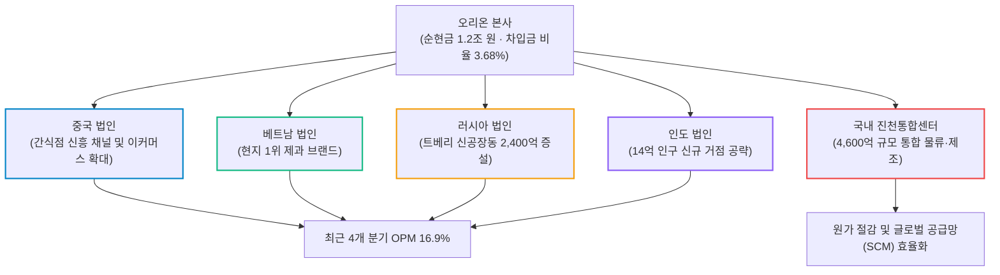
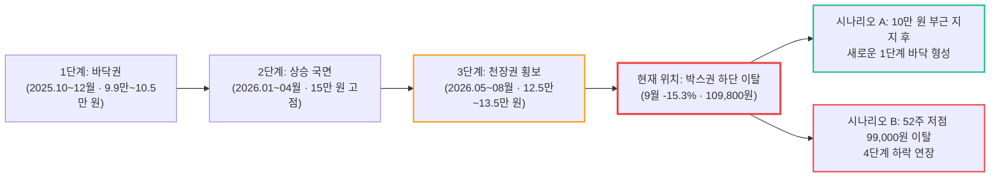

# 오리온(271560.KS) 실전 재무 및 가치 분석 보고서

- **작성일**: 2026-09-23
- **데이터 기준**: 2026년 2분기 실적(2026-06-30 마감), 2026년 8월 월간 실적 공시, 증권사 리포트(한국투자증권 2026-09-16), ICE 코코아 선물 시세, yfinance 시장 데이터(2026-09-23 종가 기준)

대중이 화려한 AI 테크주와 단기 테마주의 일확천금에 눈이 멀어 있을 때, 오리온은 매일 전 세계 소비자에게 과자를 팔아 차입금 비율 3.68%, 순현금 1조 2,000억 원의 요새를 쌓고 있다. 그런데도 주가는 9월 한 달 동안 15% 넘게 밀려 Forward PER 8.2배, PBR 1.07배까지 내려왔다. 1조 원대 글로벌 증설과 창사 첫 중간배당을 동시에 진행하는 이 현금 파이프라인이 정말 싼 것인지, 아니면 싼 데에 이유가 있는 것인지 숫자로 발라낸다.

## 핵심 요약

| 구분 | 핵심 요약 |
| :--- | :--- |
| **종목 및 주가** | 오리온 (KRX: `271560.KS`) / **109,800원** (52주 범위 99,000원 ~ 150,100원) |
| **최종 투자의견** | **분할 매수 (Buy on Dip)** / 선발대는 소규모로, 주력은 200일선 회복 확인 후 투입 (투자 가치 점수 **82.8점**, 6.1절) |
| **비즈니스 본질** | 중국·베트남·러시아·인도에 생산 거점을 둔 글로벌 제과 플랫폼, 최근 4개 분기 영업이익률 16.9%의 캐시카우 |
| **핵심 매력 (Bull)** | 차입금 비율 3.68%·순현금 1.2조 원, 창사 첫 중간배당(최근 12개월 배당 5,250원, 수익률 4.78%), 1조 원대 글로벌 Capa 증설 |
| **핵심 리스크 (Bear)** | 중동전쟁발 원가 상승과 코코아 가격 반등, 중국 소비 둔화와 경쟁 심화, 원화 강세에 따른 환산 실적 감소 |
| **9월 급락 원인** | 원가 부담 재부각 + 중국 둔화 + 환율 + 증권사 목표주가 하향 + 음식료 섹터 수급 공백 (2.4절) |
| **포트폴리오 성격** | 계좌 하방을 지키는 **저베타(0.27) 가치 방파제** / **단기 상한가 폭등을 노린 투기 매수는 엄금** |

---

## 1. 비즈니스 실체: 대중이 모르는 기업의 '목줄'과 글로벌 섭식 빨대

오리온을 '국내 내수용 과자 공장' 정도로 치부하는 것은 비즈니스의 본질을 놓치는 것이다. 이 기업의 실체는 **매출의 65% 이상을 해외에서 벌어들이며, 전 세계 소비자에게 매일 반복적으로 현금을 받아내는 글로벌 필수 소비재 플랫폼**이다.

한번 길들여진 입맛은 쉽게 바뀌지 않는다. 초코파이, 포카칩, 오감자 같은 메가 브랜드는 경기 침체가 오든 고금리가 닥치든 소비자가 장바구니에서 가장 마지막까지 빼지 않는 락인(Lock-in) 자산이다.

### 1.1 4대 해외 거점과 진천통합센터가 만든 현금 파이프라인

- **① 중국 시장의 채널 재편 선점**: 오리온은 전통 대형마트의 부진을 일찍 읽고 신흥 유통 채널인 '간식점(간식 전문 할인점)'과 온라인 이커머스 플랫폼에 선제적으로 진입했다. 다만 2026년 하반기 들어 현지 소비 둔화와 경쟁 심화로 성장 속도가 느려지고 있다는 점은 2.4절에서 따로 다룬다.
- **② 베트남의 국민 브랜드 지위**: 베트남 제과 시장에서 오리온의 지위는 독보적이다. 초코파이는 제사상에 오를 정도의 위상을 구축했고, 쌀과자(안)와 생감자칩 등 포트폴리오를 지속 확장하고 있다.
- **③ 러시아의 증설과 고수익성**: 지정학적 리스크 속에서도 러시아 법인은 현지화된 초코파이 라인업으로 수요를 흡수해 왔다. 공급 부족을 해결하기 위해 2,400억 원 규모의 트베리 신공장동 증설을 단행하며 생산능력(Capa)을 크게 늘리고 있다.
- **④ 14억 인도의 미래 성장판**: 인도 현지 생산 공장을 가동하며 중장기 성장 엔진을 확보했다. 아직 실적 기여도는 작지만 프리미엄 제과 시장 침투를 진행 중이다.
- **⑤ 국내 진천통합센터(4,600억 원)**: 충북 진천에 건립 중인 통합물류센터 및 제조 거점은 분산된 물류와 생산 라인을 일원화하여 고정비를 낮추고 전사 영업이익률을 끌어올릴 핵심 투자다.

### 1.2 왜 경쟁사가 오리온의 마진을 흉내 낼 수 없는가?

국내 일반 식음료 기업들의 영업이익률은 5~7%대에 머문다. 반면 오리온은 최근 4개 분기 합산 기준 **16.9%**(분기별 14.8~18.1%)의 마진을 낸다.

원재료 직소싱 역량, 해외 현지 법인의 높은 자체 조달률, 그리고 브랜드 파워를 바탕으로 한 **가격 전가력(Pricing Power)이** 결합된 결과다. 원가 상승기에 가격이나 중량을 조정할 힘이 없는 기업들은 원가 충격에 곧바로 무너지지만, 오리온은 충격을 상당 부분 흡수한다.

다만 원가 충격을 완전히 피하는 것은 아니다. 2026년 2분기 영업이익률은 **14.8%로 전년 동기(15.6%)보다 0.8%p 낮아졌다.** 가격 전가력은 마진 하락 폭을 줄여 줄 뿐이며, 원가 상승이 반영되기까지는 시차가 있다.

---

## 2. 최근 핵심 이슈와 2분기 실적: 대중의 착시 vs 숫자의 팩트

### 2.1 2026년 2분기 확정 실적 대차대조

증권가의 추정치가 아니라, 확정 공시된 2026년 2분기(2026-06-30 마감) 장부 숫자를 직접 대조해 봐라.

| 재무 지표 | Q2 2025 | Q1 2026 | Q2 2026 | 전년 동기 대비(YoY) | 판정 및 분석 |
| :--- | ---: | ---: | ---: | ---: | :--- |
| **총매출(Revenue)** | 7,771.7억 원 | 9,303.6억 원 | **8,935.9억 원** | **+14.98%** | 해외 법인의 물량 성장으로 두 자릿수 매출 신장 |
| **영업이익** | 1,214.5억 원 | 1,654.7억 원 | **1,325.7억 원** | **+9.16%** | 매출보다 느린 증가, **영업이익률 14.8%(전년 15.6%)로 하락** |
| **당기순이익** | 698.3억 원 | 1,244.8억 원 | **861.6억 원** | **+23.38%** | 금융수익 등 영업외 이익 개선으로 순이익 큰 폭 증가 |
| **희석 EPS** | 1,767원 | 3,149원 | **2,180원** | **+23.37%** | 주당순이익의 우상향 추세 유지 |
| **영업활동 현금흐름** | 1,180.2억 원 | 1,577.0억 원 | **1,258.3억 원** | **+6.62%** | 장부상 이익이 실제 현금으로 들어오고 있음 |
| **설비투자(CapEx)** | 420.5억 원 | 787.0억 원 | **949.8억 원** | +125.87% | 러시아 신공장 및 진천센터 대규모 투자 집행 |
| **잉여현금흐름(FCF)** | 759.7억 원 | 790.0억 원 | **308.5억 원** | -59.39% | 대규모 CapEx 집행 기간임에도 플러스 FCF 유지 |

출처: yfinance 확정 분기 재무제표 및 회사 IR 공시 (2026-06-30 마감 기준).

### 2.2 상반기 누적 실적

2026년 상반기(1~6월) 누적 실적을 합산하면 **매출액 1조 8,239.5억 원**, **영업이익 2,980.4억 원(누적 영업이익률 16.34%)**, **당기순이익 2,106.4억 원**이다. 최근 4개 분기로 넓히면 영업이익은 **6,034.7억 원**, 순이익은 **4,191.8억 원**이다.

시가총액 4조 3,403억 원에서 순현금 1조 2,166억 원을 빼면 사업 가치(EV)는 약 3조 1,236억 원이다. 이는 최근 4개 분기 영업이익의 **약 5.2배**에 불과하다. 숫자만 보면 명백한 저평가다. 다만 시장은 지금의 이익이 아니라 **하반기 이후 마진이 얼마나 더 눌릴지**를 가격에 반영하고 있다는 점을 함께 봐야 한다.

### 2.3 대중의 착시 vs 데이터가 말해주는 진실

| 시장과 대중의 흔한 착시 | 데이터와 장부 숫자가 말하는 냉혹한 진실 |
| :--- | :--- |
| **"원화 강세와 신흥국 통화 약세로 해외 실적이 작살났다?"** | 원화 강세는 해외 법인의 현지 통화 실적을 원화로 바꿀 때 숫자를 줄이는 **환산 효과**다. 현지 판매 물량 자체가 줄어든 것은 아니며, 2분기 연결 매출도 +15% 성장했다. 다만 환산 효과는 회계상 착시로 끝나지 않고 **원화 기준 이익과 배당 재원을 실제로 줄인다.** 증권사들이 목표주가를 낮춘 이유 가운데 하나다. |
| **"총 1조 원이 넘는 대규모 투자로 빚더미에 앉는다?"** | 2026년 2분기 기준 오리온의 **총차입금은 1,495억 원**이고, 보유한 현금 및 단기금융자산은 **1조 3,662억 원**이다. 순현금만 **1조 2,166억 원**이다. 차입금을 자본으로 나눈 **차입금 비율은 3.68%**, 총부채를 자본으로 나눈 **부채비율도 18.9%에** 불과하다. 증설 자금은 영업현금흐름과 보유 현금으로 충분히 감당할 수 있다. |
| **"과자 파는 전통 제조업은 주주환원이 인색하다?"** | 오리온은 2026년 7월 창사 이래 처음으로 **주당 1,750원의 중간배당**을 실시했다. 최근 12개월 동안 지급한 배당은 2025년 결산배당 3,500원과 중간배당 1,750원을 합친 **5,250원**이고, 현재 주가 기준 수익률은 **4.78%다.** 다만 2026년 연간 배당 총액은 결산배당이 확정되어야 알 수 있으므로, 이 수익률이 그대로 이어진다고 단정해서는 안 된다. |
| **"주가가 11만 원까지 떨어졌으니 망해가는 주식이다?"** | 망해가는 회사가 아니다. 2분기에도 매출 +15%, 영업이익 +9%를 기록했고 8월 월간 실적도 성장을 이어갔다. 그러나 **"펀더멘털은 멀쩡한데 수급 때문에만 빠졌다"는 해석도 틀렸다.** 9월 급락에는 원가 부담과 중국 둔화라는 실적 변수가 분명히 들어 있다(2.4절). |

### 2.4 9월 한 달 동안 15% 급락한 결정적 이유

먼저 주가 흐름을 날짜별로 정확히 봐야 한다.

| 구간 | 주가 흐름 | 해석 |
| :--- | :--- | :--- |
| **2025.10~11월** | 52주 최저가 **99,000원** 기록 | 코코아 가격 고점 부담이 실적에 반영되던 시기의 바닥 |
| **2026.01~04월** | 약 10만 원 → **150,100원(4/29 장중, 52주 최고가)** | 코코아 가격 폭락(2월 톤당 $2,798)과 실적·배당 서프라이즈로 급등 |
| **2026.05월** | 약 12.8만 원까지 조정 | 급등 이후 차익 실현 |
| **2026.06~08월** | **12.5만~13.5만 원 박스권** | 200일선 부근에서 횡보. 8/18에 하루 -6.6% 급락했으나 박스권 하단은 지킴 |
| **2026.09월** | **129,700원(9/1) → 109,800원(9/23), -15.3%** | 거래량을 동반한 박스권 하단 이탈 |

즉 주가가 "5월부터 계단식으로 밀려 11만 원에서 바닥을 다진" 것이 아니다. 여름 내내 12.5만 원 이상을 지키다가 **9월에만 급락했다.** 그 이유는 다섯 가지로 정리된다.

- **① 원가 부담의 재부각 (중동전쟁 + 코코아 반등)**:
    - 한국투자증권은 9/16 리포트에서 "중동전쟁에 따른 원가 부담이 지속되면서 제조원가율이 2%p 이상 상승했다"고 진단했다.
    - 코코아 선물 가격도 다시 오르고 있다. 코코아는 2024년 12월 톤당 **$12,565**로 사상 최고치를 찍은 뒤 2026년 2월 **$2,798**까지 78% 폭락했다. 그러나 이후 반등해 8월에는 **$6,650**으로 저점 대비 두 배 넘게 올랐다.
    - 식품 기업은 원재료를 3~6개월 앞서 사들인다. 상반기의 싼 코코아는 3분기까지 원가를 낮춰 주지만, **7~8월에 오른 가격은 4분기부터 내년 1분기 원가에 반영된다.** 시장이 걱정하는 것은 바로 이 시차다.
- **② 중국 소비 둔화와 경쟁 심화**:
    - 중국은 오리온 해외 법인 가운데 이익 비중이 가장 크다. 간식점·이커머스 채널로의 전환에는 성공했지만, 현지 소비 둔화 속에서 경쟁이 심해지며 성장 속도가 느려졌다.
- **③ 환율 하락에 따른 원화 환산 실적 감소**:
    - 원화가 강세를 보이면 해외 법인의 현지 통화 실적이 원화로 바뀌면서 줄어든다. 판매 물량이 탄탄해도 연결 실적 숫자가 깎이고, 이는 이익 추정치 하향으로 이어진다.
- **④ 증권사 목표주가 하향 (직접적 촉매)**:
    - 한국투자증권은 9/16 목표주가를 **195,000원에서 175,000원으로 하향**했다(투자의견 매수 유지). 8월 월간 실적도 매출 3,010억 원(+9%)에 비해 영업이익은 505억 원(+5%)으로 증가율이 낮아, 마진 압박이 이어지고 있음을 확인시켰다.
    - 이 리포트가 나온 9/16에 주가는 하루 -4.0% 하락했고, 거래량은 23.8만 주로 20일 평균(약 11만 주)의 두 배를 넘었다.
- **⑤ 음식료 섹터의 수급 공백과 구조적 할인 요인**:
    - 시장 유동성이 AI 반도체와 바이오 등 고베타 성장주에 쏠리면서, 해외 수출 성장이 뚜렷한 일부 종목을 제외한 전통 음식료 대형주는 외면받았다.
    - 2024년 초 리가켐바이오(구 레고켐바이오) 지분을 약 5,500억 원에 인수한 뒤 생긴 자본 배분에 대한 의구심도 여전히 할인 요인으로 남아 있다. 다만 이는 오래된 요인이어서 9월 급락을 설명하지는 못한다.

#### 9월 악재 vs 반전 트리거 점검

| 9월 하락 요인 | 현재 확인되는 사실 | 판정 및 주가 영향 |
| :--- | :--- | :---: |
| **원가 부담 (중동전쟁 · 코코아)** | 3분기는 상반기의 저가 원재료 덕에 방어되지만, 7~8월 코코아 반등분은 4분기부터 원가에 반영된다 | `부담 지속` |
| **중국 소비 둔화** | 채널 전환은 완료되었으나 현지 소비 회복 신호는 아직 없다 | `확인 필요` |
| **환율 및 실적 추정치 하향** | 주가 109,800원에 **Forward PER 8.2배, PBR 1.07배(BPS 102,850원)로** 상당 부분 선반영 | `가격 매력` |
| **자본 배분 불신 및 주주환원** | 2026년 창사 첫 **중간배당 1,750원 단행**으로 주주환원 의지를 행동으로 증명 | `주주환원 강화` |

---

## 3. 경쟁 해자 및 피어 그룹 잔혹 비교

국내 식음료 대표 4인방의 밸류에이션과 재무 지표를 같은 기준으로 한 테이블에 올려놓고 비교해 봐라.

| 비교 지표 | **오리온 (271560.KS)** | 롯데웰푸드 (280360.KS) | 농심 (004370.KS) | 삼양식품 (003230.KS) |
| :--- | :---: | :---: | :---: | :---: |
| **현재 주가** | **109,800원** | 125,400원 | 391,500원 | 1,214,000원 |
| **시가총액** | **4조 3,403억 원** | 1조 1,087억 원 | 2조 2,841억 원 | 9조 1,451억 원 |
| **Forward PER** | **8.21배** | 7.74배 | 11.35배 | 13.33배 |
| **PBR (순자산비율)** | **1.07배** (BPS 102,850원) | 0.85배 | 0.92배 | 4.80배 |
| **EV/EBITDA** | **4.23배** | 6.19배 | 3.49배 | 13.38배 |
| **영업이익률 (yfinance 기준)** | **14.8%** | 5.6% | 6.2% | 22.9% |
| **차입금/자본 비율** | **3.68%** | 66.6% | 6.1% | 43.5% |
| **순현금 상태** | **+1조 2,166억 원** | 순차입 상태 | 순현금 상태 | 순현금 상태 |
| **배당수익률** | **4.78%** (중간배당 신설) | 2.66% | 1.53% | 0.51% |
| **베타 (Beta)** | **0.273** | 0.167 | 0.129 | 0.082 |

출처: yfinance 시장 데이터 비교 (2026-09-23 종가 기준).

### 3.1 오리온만의 차별적 투자 가치

1. **삼양식품 대비 밸류에이션 할인**: 삼양식품은 불닭볶음면의 해외 수출 폭증으로 영업이익률 22.9%, 시가총액 9조 원을 기록하며 Forward PER 13.3배를 받고 있다. 삼양식품이 마진과 성장률에서 모두 앞서기 때문에 프리미엄 자체는 정당하다. 그러나 오리온도 4개국에 분산된 글로벌 포트폴리오와 15%대 영업이익률을 갖추고 있는데 PER은 8.2배에 불과하다. 성장률 격차를 감안해도 할인 폭이 과도하다.
2. **전통 음식료 피어 대비 압도적인 마진과 재무 체력**: 롯데웰푸드와 농심의 영업이익률은 5~6%대에 머물러 원가 급등 시 이익이 크게 흔들린다. 오리온은 이들의 2.5배에 가까운 마진을 유지한다. 게다가 차입금 비율 3.68%에 순현금 1조 2,000억 원이라는 방패는 국내 식음료 업계에서 최상위권이다.

---

## 4. 기술적 흐름: 스탠 와인스타인 4단계 사이클 진단

스탠 와인스타인의 4단계 사이클 모델에 비추어 볼 때, 오리온은 **6~8월의 고원형 횡보(3단계 천장권)를 아래로 이탈하며 4단계 하락 국면 초입에 진입했을 가능성**이 있는 구간이다. 바닥을 다지는 1단계 막바지로 보기에는 아직 근거가 부족하다.

### 4.1 기술적 지표 및 수급 팩트

- **① 이동평균선 역배열 진입**: 주가는 20일선(120,080원), 50일선(126,211원), 200일선(123,738원)을 모두 밑돌고 있다. 20일선이 이미 50일선과 200일선 아래로 내려와 단기 추세가 하락으로 돌아섰다.
- **② 거래량은 하락일에 늘었다**: 최근 20일 평균 거래량은 약 11만 주다. 그런데 급락일인 9/16에는 23.8만 주, 9/18에는 26.9만 주가 거래되었다. 하락하는 날 거래량이 늘어나는 것은 매도 압력이 소멸된 것이 아니라 **물량이 정리되고 있다는 신호**다. 매도 압력이 끝났다고 판단하려면, 하락일 거래량이 줄어들고 주가가 더 이상 낮은 저점을 만들지 않는 모습을 먼저 확인해야 한다.
- **③ 가까운 지지선은 52주 저점 99,000원**: 현재가에서 -9.8% 아래다. 2025년 10~11월에 바닥을 형성한 가격대여서 1차 지지선 역할을 기대할 수 있지만, 이 가격대가 지켜질지는 아직 확인되지 않았다.

---

## 5. 밸류에이션 및 가격 타당성 검증

### 5.1 PER 및 PBR로 본 가격 매력

- **Forward PER 8.21배, Trailing PER 10.4배**: 최근 4개 분기 순이익 기준 EPS는 약 10,600원이다. Forward PER 8.2배는 향후 12개월 EPS를 약 13,370원(+26%)으로 가정한 값이다. 원가 부담으로 추정치가 하향되는 국면이므로, **실제 선행 PER은 8.2배보다 높아질 수 있다**는 점을 감안해야 한다. 그렇더라도 10배 안팎의 PER은 오리온의 과거 평균 대비 낮은 수준이다.
- **PBR 1.07배**: 주당순자산(BPS) 약 **102,850원**에 7%의 프리미엄만 얹은 가격이다. 순현금 1조 2,166억 원은 시가총액의 **약 28%에** 해당한다. 청산 가치보다 싸다고 볼 수는 없지만, 연 16%대 영업이익률을 내는 기업이 장부가 수준에서 거래된다는 점은 하방 안전마진이 크다는 뜻이다.

### 5.2 하반기 실적 변수와 목표주가 타당성

- **3분기는 버티지만 4분기 원가가 관건이다**: 상반기의 저가 코코아 재고 덕에 3분기 원가는 방어될 가능성이 높다. 그러나 7~8월 코코아 반등분과 중동전쟁발 원가 부담이 4분기부터 반영된다. 이익률 반등은 원재료 가격이 다시 안정되는지 확인한 뒤에 기대해야 한다.
- **글로벌 Capa 증설 효과**: 러시아 트베리 신공장 라인과 진천통합센터가 순차 가동되면 고정비 레버리지 효과가 나타날 것이다.
- **적정 주가 컨센서스**: 증권사 17곳의 평균 목표주가는 **164,824원**(범위 148,000원 ~ 190,000원)이다. 9월 하향 조정이 진행 중인 것을 감안해도, 현재 주가(109,800원) 대비 평균 목표가까지는 **+50%**, 가장 낮은 목표가까지도 **+35%의** 괴리가 있다.

---

## 6. 종합 평가 및 냉혹한 계좌 실행 원칙

### 6.1 6대 핵심 투자 지표 다차원 평가 매트릭스

| 평가 영역 | 가중치 | 평점 (100점 만점) | 가중 점수 | 등급 | 핵심 평가 요약 |
| :--- | :---: | :---: | :---: | :---: | :--- |
| **① 비즈니스 모델 및 해자** | 25% | **92점** | 23.00 | `S` | 중국·베트남·러시아 글로벌 제과 플랫폼, 최근 4개 분기 OPM 16.9% |
| **② 실적 성장성 및 가이던스** | 25% | **75점** | 18.75 | `A-` | 2분기 매출 +15%, 영업이익 +9%로 성장 지속, 단 원가 부담으로 마진 하락과 추정치 하향 진행 |
| **③ 재무 건전성 및 현금흐름** | 20% | **96점** | 19.20 | `S+` | 차입금 비율 3.68%, 부채비율 18.9%, 순현금 1.2조 원 |
| **④ 밸류에이션 매력도** | 15% | **88점** | 13.20 | `A+` | Forward PER 8.2배, PBR 1.07배, EV/최근 4개 분기 영업이익 5.2배 |
| **⑤ 기술적 매매 타이밍** | 10% | **50점** | 5.00 | `C+` | 박스권 하단 이탈, 이동평균선 역배열, 하락일 거래량 증가 |
| **⑥ 리스크 관리 가능성** | 5% | **72점** | 3.60 | `B` | 52주 저점 99,000원이 가까운 지지선, 저베타(0.27)와 4%대 배당이 하방 완충 |
| **종합 가중치 환산 점수** | **100%** | — | **82.8점** | **`Buy`** | **현금 창출력과 밸류에이션은 최상급, 타이밍은 분할 대응이 필요한 가치주** |

!!! info "평점 산출 공식"
    종합 점수는 각 영역의 가중치를 곱해 합산한 값이다.
    `92×0.25 + 75×0.25 + 96×0.20 + 88×0.15 + 50×0.10 + 72×0.05 = 82.75점 ≒ 82.8점`

### 6.2 실전 결론: "그래서 지금 어쩌라는 것인가?" (Action Verdict)

#### ① 지금 당장 사야 하는가? ➔ **"선발대만 작게 보내라. 주력은 하락이 멈추는 것을 확인한 뒤다."**

- **선발대를 보내도 되는 이유**: PER 8~10배, PBR 1.07배, 배당수익률 4%대는 가격 자체로 충분한 매력이다. 순현금이 시가총액의 28%를 차지하고, 2분기에도 매출과 이익이 성장했다.
- **비중을 줄여야 하는 이유**: 9월 하락은 수급만의 문제가 아니라 원가와 중국이라는 실적 변수가 섞여 있다. 원가 부담은 4분기부터 본격적으로 반영될 수 있다. 차트는 박스권을 거래량과 함께 이탈했고, 가장 가까운 지지선인 52주 저점 99,000원까지 -9.8%의 여유가 남아 있다. **"10만 원이 절대 바닥"이라는 보장은 없다.**
- **지금 할 일**: 한 번에 몰빵하지 말고, 선발대 → 저점 방어 확인 → 추세 회복 확인의 3단계로 나누어 분할 매수한다(6.3절).

#### ② 이런 주식은 누가 사고, 누가 절대 사면 안 되는가?

- **❌ 절대 사지 마라 (즉시 퇴장)**: 내일 당장 상한가를 바라는 단타 투기꾼, 하루 만에 계좌가 20%씩 폭등해야 도파민이 도는 테마주 중독자.
- **⭕ 눈독 들이고 담아야 할 사람 (가치 스나이퍼)**: 시장의 고베타 변동성에 지쳐 계좌 하방을 지켜줄 **방파제(베타 0.27)가** 필요한 자, 연 4%대의 배당을 받으며 1~2년에 걸쳐 **+30% 이상의 가치 정상화**를 기다릴 수 있는 인내심 있는 투자자.

#### ③ 이 주식으로 '인생 역전(대박)'을 노리면 안 되는 냉혹한 이유

- 과자와 스낵은 AI나 바이오처럼 하룻밤 사이에 10배씩 튀어 오르는 사업이 아니다. 반대로 기술 혁신이나 규제 한 방에 하루아침에 휴지 조각이 되지도 않는다. 이 종목의 진짜 용도는 계좌의 '공격수'가 아니라, 폭락장에서도 계좌를 지탱하고 꾸준한 복리 수익을 안겨주는 '최후의 수비수'다.

### 6.3 실전 가격대별 실행 시나리오 및 분할 매수 로드맵

| 구분 | 실행 조건 | 배정 비중 | 가격 기준 | 대응 방침 |
| :--- | :--- | :---: | :---: | :--- |
| **1차 진입 (선발대)** | 현재 가격대, 밸류에이션 매력 구간 | **20%** | **108,000원 ~ 111,000원** | 추세 확인 전 매수이므로 소규모 정찰대만 배치 |
| **2차 매수 (저점 방어 확인)** | 52주 저점권에서 하락이 멈추고, 하락일 거래량이 줄어드는 것을 확인 | **30%** | **100,000원 ~ 104,000원** | 99,000원 지지를 확인하면서 비중 확대 |
| **3차 매수 (추세 회복 확인)** | 200일선 회복 및 거래량 실린 양봉으로 안착 | **50%** | **124,000원 돌파 안착 시** | 하락 추세 종료를 확인한 뒤 주력 물량 투입 |
| **목표 익절가 (1차)** | 2026년 4월 고점권 회복 | 보유 물량의 50% | **145,000원 ~ 150,000원** | +32~37% 구간에서 1차 차익실현 |
| **목표 익절가 (2차)** | 증권가 목표주가 평균~한국투자증권 목표가 도달 | 잔여 전량 | **165,000원 ~ 175,000원** | +50~59% 구간에서 전량 청산 |
| **손절 기준선** | 52주 저점 99,000원 완전 붕괴 | — | **97,000원 종가 이탈 시** | 미련 없이 비중 축소 및 관망 |

2차 매수 조건이 나오지 않고 바로 반등하면 2차 물량은 건너뛰고 3차 조건에서 합쳐서 집행한다.

### 6.4 판정을 바꿀 증거와 다음 모니터링 체크리스트

1. **월간 실적 공시 (9월분, 10월 중순)**: 매출 성장률보다 영업이익 성장률이 계속 낮게 나오는지 확인하라. 8월에는 매출 +9%, 영업이익 +5%였다.
2. **3분기 실적 발표 (11월 중순)**: 영업이익률이 2분기(14.8%)보다 개선되는지, 제조원가율 상승 폭이 얼마나 되는지 확인하라.
3. **코코아 선물 가격과 중동 정세**: 코코아가 톤당 $6,000대에서 다시 안정되는지, 중동전쟁발 에너지·물류 원가 부담이 완화되는지 확인하라. 이 두 가지가 4분기 이후 마진을 결정한다.
4. **중국 법인 성장률**: 현지 소비 둔화 속에서 간식점·이커머스 채널의 성장이 대형마트 감소분을 계속 메우는지 확인하라.
5. **2026년 결산배당 규모**: 중간배당 1,750원에 더해 결산배당이 얼마로 결정되는지에 따라 실제 배당수익률이 정해진다.

!!! tip "최종 핵심 제언 (Executive Takeaway)"
    - **최종 투자 가치 점수**: **82.8점 / 100점** (`Buy` / 최상급 재무와 밸류에이션, 그러나 추세 확인 전)
    - **9월 급락의 정체**: 수급만의 문제가 아니다. 중동전쟁발 원가 부담, 코코아 반등, 중국 둔화, 환율, 증권사 목표주가 하향이 한꺼번에 겹쳤다.
    - **가격표의 기회**: 순현금이 시가총액의 28%이고, EV는 최근 4개 분기 영업이익의 5.2배에 불과하다. 원가 부담을 감안해도 싼 가격이다.
    - **행동 강령**: 지금은 선발대 20%만 보내라. 52주 저점 99,000원 부근의 지지와 200일선 회복을 차례로 확인하면서 나머지를 채워라.
