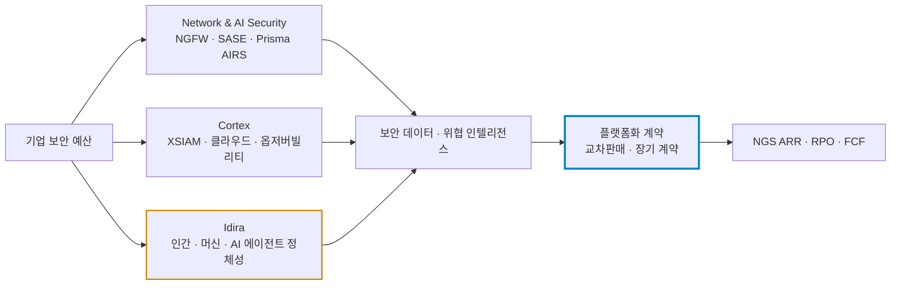
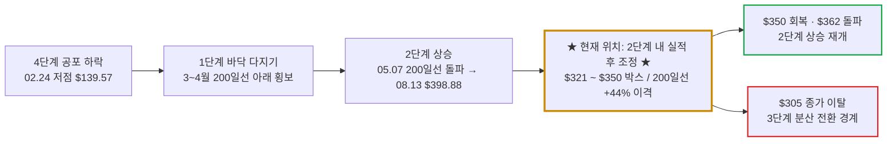

# 팔로알토 네트웍스(Palo Alto Networks / PANW) 실전 재무 및 가치 분석 보고서

- **작성일**: 2026-09-11

대중은 매출 +34%, NGS ARR +63%라는 헤드라인에 취해 있다. 그런데 주주 한 명에게 떨어지는 숫자는 전혀 다르다. FY27 매출이 23% 늘어도 주당 비GAAP 이익은 8.7%밖에 늘지 않는다. CyberArk를 사면서 찍어낸 1.12억 주 때문이다. 주식보상 $17.7억을 비용으로 치면 시가총액 대비 현금 수익률은 0.85%다. 연초 대비 +84% 오른 주가가 실적 발표를 낀 이틀 동안 -14% 빠진 건 사고가 아니라 청구서다.

## 핵심 요약

| 구분 | 핵심 요약 |
| :--- | :--- |
| **종목 및 주가** | 팔로알토 네트웍스 (NASDAQ: `PANW`) / **$338.49** (52주 범위 $139.57 ~ $398.88, 고점 대비 **-15.1%**) |
| **최종 투자의견** | **관망 (Wait & Watch)** / $305~$322 지지 재확인 또는 50일선 $350 회복 전 신규 진입 보류 (투자 가치 점수 **72.6점**, 6.1절) |
| **비즈니스 본질** | 네트워크·클라우드·보안운영·정체성 보안을 한 계약으로 묶어 고객의 보안 예산을 통째로 잠그는 플랫폼 사업자 |
| **핵심 매력 (Bull)** | NGS ARR $91억(+63%), RPO $212억(+34%), 조정 FCF $44.1억(마진 38.4%), $500만 이상 대형 계약 +50%, FY27 가이던스 컨센서스 상회 |
| **핵심 리스크 (Bear)** | FY27 비GAAP EPS +8.7%(희석 주식 +10.7%), 주식보상이 매출의 15.5%, FY27 PER 81배, 매출총이익률 -100bp, 영업권이 자본의 80% |
| **포트폴리오 성격** | 장기 2단계 추세의 **고평가 보안 성장주(베타 0.91)** / **헤드라인 성장률만 보고 PER 81배를 추격하는 투자자는 매수 금지** |

---

## 1. 비즈니스 실체: 방화벽 장사꾼이 아니라 보안 예산을 통째로 잠그는 자물쇠

팔로알토를 아직도 방화벽 회사로 보는 건 10년 전 프레임이다. 이 회사가 노리는 건 방화벽 한 대를 파는 게 아니다. 고객이 네트워크 보안, 클라우드 보안, 보안운영(SOC), AI 보안, 정체성 보안을 다섯 업체에서 따로 사지 못하게 만드는 것이다. 한 플랫폼에 보안 데이터와 운영 절차가 쌓일수록 교체 비용이 커지고, 영업 조직은 제품 판매 조직에서 교차판매 조직으로 바뀐다. 회사는 이걸 '플랫폼화'라고 부른다. 투자자 입장에서 번역하면 **고객 한 명당 계약 금액을 키우는 락인 전략**이다.

| 플랫폼 | FY26 매출 | 성장률 | 핵심 제품 | 확인된 운영 지표 |
| :--- | ---: | ---: | :--- | :--- |
| **Network & AI Security** | $83.5억 | +17% | 차세대 방화벽(NGFW), SASE, AI 보안(Prisma AIRS) | Prisma AIRS ARR 약 $1.2억, 고객 800곳 이상 |
| **Cortex** | $19.2억 | +25% | XSIAM(차세대 SOC), 클라우드 보안, Chronosphere 옵저버빌리티 | XSIAM ARR 약 $7억(+70%), 옵저버빌리티 ARR $5억 초과 |
| **Idira** | $6.1억 (인수 후 반영분) | 프로포마 +21% | CyberArk 정체성 보안 | 인수 전 기간을 합친 프로포마 매출 $12.6억 |

출처: [FY2026 실적 발표](https://investors.paloaltonetworks.com/news-releases/news-release-details/palo-alto-networks-reports-fiscal-fourth-quarter-and-fiscal-10), [Q4 FY2026 발표 자료 요약 보도](https://in.investing.com/news/stock-market-news/palo-alto-networks-q4-fy2026-slides-record-growth-margin-concerns-93CH-5578643). 플랫폼별 매출은 회사 발표 자료 기준이며, 세 플랫폼 합계($108.8억)는 총매출($114.8억)과 일치하지 않는다. 플랫폼 분류에서 제외된 항목이 있다는 뜻이므로 합산해서 쓰지 마라.

매출의 67%($76.8억)가 미주에서 나오고, EMEA(+27%)와 APAC(+25%)도 20%대 중반으로 자랐다. 플랫폼화 고객은 약 2,500곳이고, 연간 NGS ARR $1,000만 이상 고객은 78곳으로 1년 새 50% 늘었다. 회사는 FY30까지 플랫폼화 고객 4,000곳 이상, NGS ARR $200억을 목표로 제시한다.

### 1.1 인수로 산 성장: 반년 동안 $245억짜리 청구서

FY26 하반기 성장의 절반가량은 수표책에서 나왔다. 인수 전 15~16%였던 분기 매출 성장률이 인수 직후 31~34%로 뛰었다. 이 사실을 빼고 +34%를 말하는 자는 공시를 안 읽은 자다.

| 인수 대상 | 완료일 | 총 인수대가 | 대가 구성 | 회계상 흔적 |
| :--- | :---: | ---: | :--- | :--- |
| **Chronosphere** (옵저버빌리티) | 2026-01-29 | **$29.5억** | 현금 $28.4억 + 대체 보상 $1.1억 | 대체 주식보상 총 $5.25억 중 나머지는 향후 주식보상비용으로 인식 |
| **CyberArk** (정체성 보안) | 2026-02-11 | **$210.6억** | 현금 $23.1억 + PANW 보통주 **1.12억 주**($184.9억) + 대체 보상 $2.65억 | 영업권 $148억, 플랫폼 갱신 무형자산 $35억, 대체 주식보상 총 $9.45억 |
| **Console** (에이전틱 AI 워크플로) | 2026-07-29 계약, 09-01 발표 | **$5억** | 현금 (조정 조건부) | Cortex의 경보 조사·자동 대응에 편입 예정 |

출처: [FY2026 Form 10-K](https://www.sec.gov/Archives/edgar/data/1327567/000132756726000023/panw-20260731.htm), [Console 인수 발표](https://investors.paloaltonetworks.com/news-releases/news-release-details/palo-alto-networks-acquires-console-agentify-security)

CyberArk 주주는 1주당 현금 $45와 PANW 주식 2.2005주를 받았다. 1.12억 주는 FY26 희석 가중평균 주식 수 7.64억 주의 **14.7%**다. 그 결과 영업권은 FY25 $45.7억에서 **$220.1억**으로 불었고, 이는 자본총계 $274.9억의 **80%**다. 통합이 삐끗하면 이 영업권은 손상차손이라는 이름으로 손익계산서에 되돌아온다.

### 1.2 해자는 진짜다. 그러나 독점이라는 단어는 버려라

Unit 42 위협 인텔리전스, 대기업에 깔린 방화벽 설치 기반, 한 계약에 묶인 보안 데이터는 경쟁사가 하루아침에 복제할 수 없는 해자다. 회사 발표 자료가 제시한 방화벽 경쟁사 교체 $2.5억 초과, SASE 경쟁사 교체 약 100개 계정 $4.5억 규모는 이 해자가 수비만이 아니라 공격에도 쓰인다는 증거다.

그렇다고 경쟁이 멈추지는 않는다. 네트워크에서는 포티넷·시스코가, 엔드포인트와 SOC에서는 크라우드스트라이크·마이크로소프트가, SASE에서는 지스케일러·클라우드플레어가, 정체성에서는 옥타가, 옵저버빌리티에서는 데이터독이 가격과 기능으로 파고든다. 플랫폼화는 고객의 보안 복잡성을 실제로 줄일 때만 가치가 생긴다. 구매처를 하나로 합쳤다고 마진이 저절로 늘어나는 마법은 없다.

---

## 2. 최근 3개월 핵심 뉴스 및 실적 흐름 심층 분석 (2026년 6월 ~ 9월)

### 2.1 최근 3개월 핵심 뉴스 타임라인 (2026.06.04 ~ 2026.09.08)

2026년 6월 초부터 9월 초까지 쏟아진 31건의 핵심 뉴스는 팔로알토 네트웍스가 **'단순 방화벽 공급자'에서 '1조 달러 규모의 구형 인프라 교체와 정체성·옵저버빌리티·에이전틱 AI를 아우르는 절대적 사이버보안 플랫폼 제국'**으로 진화하는 거대한 체질 전환의 변곡점을 명확히 보여준다.

| 일자 | 주요 뉴스 및 시장 이벤트 | 영향도 | 스마트머니 관점의 핵심 분석 및 시사점 |
| :--- | :--- | :---: | :--- |
| **09.08** | **나이키 S&P 100 제외 및 팔로알토 네트웍스 신규 편입 확정** | `🟢 지수 편입` | 시가총액이 570억 달러로 급감한 나이키(18년 만에 퇴출)를 대신해, 9월 21일 분기 리밸런싱에서 델·팰로 앨토 네트웍스(PANW)·아리스타 네트웍스·샌디스크가 S&P 100 메가캡 지수에 신규 편입 확정. 초대형 기관 패시브 펀드의 기계적 매수세 유입 수급 방파제 확보 |
| **09.07** | **S&P 다우존스 인덱스, 9월 21일 분기 정기 리밸런싱 공식 발표** | `🟢 수급 호재` | S&P 다우존스 인덱스가 대형주 지수인 S&P 100 지수에 팔로알토 네트웍스(PANW)와 델, 아리스타, 샌디스크 편입을 공식 확정 발표(21일 개장 전 적용). 블룸에너지의 S&P 500 편입과 함께 AI 보안·인프라 플랫폼 기업들의 메가캡 지위 공식 공인 |
| **09.03** | **오펜하이머($450)·서스퀘하나($415), 실적 서프라이즈에 목표가 상향** | `🟢 스마트머니` | 오펜하이머는 NGS ARR, 매출, RPO, 영업이익률 전 부문 비트와 함께 AI 수요가 네트워크 보안, SOC, Idira(정체성), Cortex 옵저버빌리티 전 영역의 성장을 가속하고 있다며 $400에서 $450으로 상향. 서스퀘하나는 대형 플랫폼화 계약 강세와 인수 사업 기여도를 근거로 $350에서 $415로 상향 |
| **09.03** | **RBC($475)·로스($300), "유기적 순신규 ARR +39% 폭증, 가이던스 보수적"** | `🟢 스마트머니` | RBC는 회사의 FY28 잉여현금흐름(FCF) 마진 40% 목표 달성 자신감과 AI 보안 위협 수혜를 근거로 $475 제시. 로스 캐피털은 유기적 순신규 연환산 반복매출(NNARR)이 전년비 +39%, 전분기비 +84% 급증해 유기적 ARR 성장률이 29%로 재가속된 점을 포착, 가이던스가 지나치게 보수적이라며 목표가를 $210에서 $300으로 43% 파격 상향 |
| **09.03** | **DA 데이비슨($420 상향) vs 스티븐스($400, 역사적 고점 밸류에이션 부담 경고)** | `🟡 밸류에이션` | DA 데이비슨은 유기적 NNARR 호조를 들어 시장의 성장 정체 우려는 기우라며 $420으로 상향. 반면 스티븐스는 견조한 실적과 가이던스 상회에도 불구하고 주가가 역대 고점 부근의 멀티플에서 거래되고 있어 위험 대비 보상이 균형적(중립적)이라며 시장비중 의견 유지 |
| **09.03** | **JP모건, "클로드 미토스 등장 이후 CIO들의 AI 보안 플랫폼화 최적 수혜" (목표가 $384)** | `🟢 플랫폼 해자` | 앤트로픽의 클로드 미토스(Claude Mythos) 등장 이후 기업 CIO들이 AI 사이버 위협 대응을 위해 분주히 움직이는 가운데, 기존 레거시 솔루션의 기술 부채를 단번에 해결할 수 있는 단일 보안 플랫폼으로 팔로알토가 독보적 위치를 점유하고 있다고 평가하며 비중확대 유지 |
| **09.02** | **제프리스($450)·BofA($420), 실적 발표 후 강력한 성장 잠재력 확인** | `🟢 스마트머니` | 제프리스는 클로드 미토스 이후 AI 보안 기회가 확대되며 경영진이 강력한 실적 지속성을 시사했다고 평가하며 $450 유지. BofA는 차세대 보안 ARR이 컨센서스를 약 3% 상회했으나 시장의 지나치게 높아진 눈높이가 단기 차익 실현을 불렀다고 분석하며 $420 유지 |
| **09.02** | **실적 발표 직후 프리마켓 -2.1% 하락 및 기술주 차익 실현 출회** | `🔴 단기 수급` | 호실적에도 불구하고 프리마켓에서 델(+9.0%)과 대조적으로 2.1% 하락 출발. 전일(-5.24%)에 이어 실적 직후 정규장 -9.28% 급락으로 이어지는 단기 기대치 청산 파동 확인 |
| **09.02** | **니케시 아로라 CEO, "1조 달러 규모 구형 보안 인프라 전면 교체 불가피"** | `🟢 TAM 폭증` | AI 사이버 위협 등장으로 기존 인프라는 무용지물이 되었으며 업그레이드가 필요한 인프라가 1조 달러에 달한다고 강조. 앤트로픽 미토스 이후 CIO 지출 우선순위가 보안으로 급선회함에 따라 FY30 차세대 보안(NGS) ARR 200억 달러 목표 제시. Frontier AI Defense Program에 2,000개 잠재 고객사 논의 중 |
| **09.02** | **아로라 CEO CNBC 매드머니 인터뷰: "AI는 사형 선고가 아닌 성장의 성찬"** | `🟢 팩트 진단` | "7~10년 전 구축된 기존 보안 인프라 중 AI를 감당할 수 있는 것은 단 하나도 없다". 앤트로픽 미토스 파급력이 본격화된 4월 초 이후 주가가 100% 이상 폭등한 배경을 설명하며, 1조 달러의 사이버 보안 부채 교체 수요가 장기 슈퍼사이클을 뒷받침한다고 진단 |
| **09.02** | **★ 에이전틱 AI 네이티브 플랫폼 스타트업 '콘솔(Console)' 전격 인수 발표 ★** | `🟢 기술 볼트온` | 데이터와 자연어로 직접 대화하고 보안 문제를 스스로 탐지·해결하는 에이전틱 워크플로 확보. 단순 보안 소프트웨어를 넘어 행동하는 '자율 에이전트형 보안'으로 플랫폼을 진화시켜 FY30 NGS ARR 200억 달러 목표의 핵심 축으로 육성 |
| **09.02** | **★ FY26 Q4 깜짝 호실적 발표에도 시간외 -1.68% (매출 $34.1억 YoY +34%) ★** | `🔴 호실적 속 조정` | Q4 매출 $34.1억(YoY +34%), 조정 EPS $1.02로 컨센서스 상회. 1분기 가이던스($33.0억~$33.1억)와 연간 가이던스($141억~$142억) 모두 월가 예상 돌파. 그러나 인수 상각비로 분기 순손익 적자 전환(-$2.82억) 및 차익 매물 출회로 시간외 -1.68%, 정규장 -9.28% 급락 |
| **08.27** | **아로라 CEO, 데이터독(DDOG) 및 옥타(OKTA) 인수 검토 보도 (당일 주가 +12.8%)** | `🟢 M&A 야심` | 사이버아크(250억 달러 합의)에 이어 옵저버빌리티(데이터독) 및 정체성(옥타) 영역 확장을 위해 경영진이 인수를 적극 타진했다는 보도 확산. 크라우드스트라이크 호실적과 맞물려 당일 +12.83% 폭등하며 사상 최고가권 재탈환 시도 |
| **08.26** | **FY26 4분기 실적 앞두고 JP모건($384)·벤치마크($400) 목표가 동반 상향** | `🟢 실적 기대감` | JP모건은 강력한 FCF 창출과 ARR 추가 상향 여력, 사이버아크 초기 통합 순항을 근거로 상향. 벤치마크는 차세대 보안 ARR, 매출, 영업이익 전 부문 컨센서스 상회 확신을 피력하며 매수 추천 |
| **08.25** | **니덤, "Prisma AIRS·Cortex XSIAM 크로스셀 가속" 목표가 $340→$400 상향** | `🟢 크로스셀` | AI 에이전트 보안 Prisma AIRS, XSIAM 차세대 SOC, Chronosphere 모니터링, Idira(구 CyberArk)를 통한 크로스셀 기회 확대 확인. 여름 비수기에도 강력한 펀더멘털을 유지하고 있다며 매수 유지 |
| **08.18** | **짐 크레이머, "연초 대비 100% 상승한 팔로알토·CRWD 추가 상승 여력 충분"** | `🟢 시장 센티` | AI가 소프트웨어를 파괴한다는 우려는 틀렸으며, 오히려 보안 지출을 폭증시키는 요인이라고 진단. 클라우드 이전과 해킹 다변화로 전문 플랫폼 침투율(현재 15%) 상승 여력 막대. TD코웬 목표가 $400 상향 동조 |
| **08.18** | **스탠리 드러켄밀러(듀케인), 2분기 13F에서 팔로알토 네트웍스 지분 추가 매수** | `🟢 스마트머니` | 인텔, 브로드컴, 마이크론을 전량 매각하는 반도체 포트폴리오 재편 속에서도 아마존·알파벳과 함께 팔로알토 네트웍스(PANW) 지분을 신규 추가. AI 인프라의 필수 축으로 보안 플랫폼 선택 |
| **08.11** | **AI 사이버 공격 위협 확산에 글로벌 보안주 동반 랠리 (CNBC)** | `🟢 섹터 모멘텀` | 해커들이 AI를 활용해 공격 속도와 정교함을 높이면서 기업들의 사이버보안 투자 확대 기대감 급증. 주요 보안 기업들의 AI 기반 자동화 위협 탐지 시장 선점 경쟁 가속 |
| **08.11** | **★ 세계 최대 '블랙햇 2026' 직후 팔로알토 사상 최고가 경신 ($385.04, +5.82%) ★** | `🟢 신고가 랠리` | 라스베이거스 블랙햇 콘퍼런스에서 'AI 에이전트 기반 공격 고도화' 경고. BTIG "AI 보안 도구 도입은 아직 초기 단계(Early Innings)", 캔터 "AI는 공격 표면이자 방어 인프라 기둥" 호평에 힘입어 팔로알토(+5.82%)와 CRWD(+5.01%) 동반 사상 최고가 돌파 |
| **07.22** | **사용자 경험 모니터링(RUM) 전문 업체 '엠브레이스(Embrace)' 인수 발표** | `🟢 기능 확장` | 옵저버빌리티 플랫폼에 실제 사용자 모니터링(RUM) 기능을 결합하고 애플리케이션 성능 점검 기능 '신세틱스(Synthetics)' 공개. AI 애플리케이션의 엔드투엔드 확장·운영 지원 역량 강화 |
| **07.21** | **스티펄, "중국 문샷AI Kimi-K3 등 저비용 첨단 LLM 확산이 보안 지출 촉발"** | `🟢 구조적 수혜` | 중국 스타트업의 고성능 저비용 모델 등장으로 AI 활용이 폭증하고 취약점 탐지 속도가 빨라지면서 기업들의 보안 소프트웨어 지출 증액 불가피. CRWD, DDOG와 함께 PANW 핵심 수혜주 지목 |
| **07.15** | **IBM CEO "미토스 이후 AI 보안이 고객사 최우선 과제" 발언에 주가 +7% 급등** | `🟢 업황 확인` | IBM 아르빈드 크리슈나 CEO가 앤트로픽 미토스로 인해 기업들이 보안 지출 규모를 전면 재검토하고 있다고 밝히자 보안주 일제 급등. CRWD +12%, OKTA +11%, PANW +7% 동반 폭등 |
| **07.14** | **씨티, "사이버아크(CyberArk) 인수 후 통합 순항 및 조기 시너지 달성" (목표가 $400)** | `🟢 M&A 시너지` | 단기 수익성 희석에도 불구하고 신규 순 ARR 지표 긍정적. 정체성 보안(Idira 부문)의 이익률 상승과 플랫폼화 크로스셀 시너지가 예상보다 빠르게 달성되고 있다고 호평하며 매수 유지 |
| **07.10** | **아로라 CEO, "기업용 AI 대규모 확산 위해 토큰 비용 90% 낮아져야"** | `🟡 산업 화두` | 오픈AI GPT-5.6의 코딩 토큰 효율 54% 개선에 대해 추가적인 90% 비용 절감 필요성 역설. AI 수요는 무한하나 효율화가 진행되어야 기업의 보안·인프라 예산 집행이 안정화된다는 관점 제시 |
| **07.08** | **니드햄, 사이버아크·크로노스피어 결합 기대에 목표가 $350→$425 상향** | `🟢 실적 상향` | 핵심 사업과 인수 사업의 지속 성장을 확신하며 FY27 NGS ARR 전망치를 109.5억 달러로 상향. 사이버아크에서 약 $2.5억, 크로노스피어에서 정상화 기준 약 $1.0억의 순신규 NGS ARR 기여 추정 |
| **07.07** | **스코샤뱅크, "첨단 AI 모델 확산으로 '26~'27년 보안 지출 급증" (아웃퍼폼 유지)** | `🟢 거시 업황` | 가트너의 2026년 보안 지출 증가율(14.5%)을 크게 웃도는 지출 폭증 예상. 첨단 AI 모델 기반 다단계 사이버 공격에 대비한 사전 인프라 강화 수요를 강조하며 PANW 최선호 유지 |
| **07.02** | **BTIG, 광범위한 플랫폼 확장 모멘텀에 최선호주 유지 및 목표가 $333→$380 상향** | `🟢 스마트머니` | 네트워크, SASE, XSIAM(86억 달러 SIEM 시장 공략), 크로노스피어, 사이버아크 전반의 업계 최광범위 플랫폼 입지 호평. 대형 계약 증가와 크로스셀 강화로 향후 수년간 10%대 중반 성장 지속 확신 |
| **07.01** | **JP모건, "중국 AI 모델 위협 가속화로 '취약점 쓰나미' 직면... 보안주 수혜"** | `🟢 안보 모멘텀` | 중국 AI 모델의 취약점 탐지 능력 고도화로 미국 기업들의 긴박감 고조. 폭넓은 제품 포트폴리오와 선제적 AI 방어 체계를 갖춘 PANW와 CRWD가 추가 수요의 최대 수혜를 입을 것으로 전망하며 비중확대 유지 |
| **06.08** | **FY26 3분기 실적 후 IB 평가: 방화벽 수주 가속 및 SASE ARR +40% 지속** | `🟢 사업 지표` | DA 데이비슨은 자체 사업과 인수 효과 모두 강한 실적을 기록했다며 목표가를 $190에서 $345로 수직 상향. 룹 캐피탈도 $160에서 $290으로 상향하나 지속성 관망. 시장의 지나친 눈높이로 시간외 약세 발생했으나 펀더멘털은 견고 |
| **06.08** | **골드만삭스($330)·씨티($340), AI 보안 지출 확대에 목표주가 대폭 상향** | `🟢 스마트머니` | 골드만삭스는 AI가 추가 보안 지출을 견인하고 있다며 런타임 에이전틱 보안(Koi), AI 모델 보안(Protect) 수요 확대를 근거로 $224에서 $330으로 상향. 씨티는 자체 사업 ARR이 두 자릿수 성장을 지속할 것이라며 $210에서 $340으로 상향 |
| **06.04** | **웰스파고($325 상향)·UBS($300 상향): 자체 성장 둔화 우려 딛고 가속 지속 판정** | `🟢 노이즈 극복` | 웰스파고는 M&A 효과를 조정한 자체 성장 지표의 일부 아쉬움에도 차세대 보안 ARR 가속 추이가 견고하다며 $325로 상향. UBS는 매출 둔화 신호 속에서도 RPO·ARR 수주 수요의 견고함을 확인하며 $183에서 $300으로 대폭 상향 |

출처: yfinance `PANW` 일봉·`upgrades_downgrades`, SEC 13F 공시, S&P 다우존스 인덱스 정기 변경 공시, 주요 투자은행(IB) 리서치 보고서.

8월 31일 종가 $382.13에서 9월 2일 종가 $328.48까지 이틀 동안 **-14.0%**. 같은 날 동종 업체들이 -3% 안팎에 그쳤다는 건 섹터 붕괴가 아니라 실적 발표 직전까지 극단으로 치솟았던 PANW 한 종목의 기대치 재산정이라는 뜻이다.

### 2.2 뉴스 흐름으로 본 4대 핵심 구조적 변화와 스마트머니의 의도

지난 3개월간 쏟아진 31건의 뉴스 타임라인을 관통하는 거대 자본의 진짜 의도와 **4대 구조적 변화**는 명확하다.

- **① 앤트로픽 '미토스(Mythos)' 쇼크와 1조 달러 구형 인프라 교체 사이클 (AI 공포가 만든 거대한 축제)**:
    - 4월 초 앤트로픽의 최신 AI 모델 '클로드 미토스'가 소프트웨어 취약점을 자율적으로 공략할 수 있음이 입증된 이후, 시장의 내러티브가 180도 뒤집혔다. AI가 기존 보안 소프트웨어를 파괴한다는 공포는 사라지고, "7~10년 전 구형 인프라는 AI 위협을 막을 수 없다"는 현실을 깨달은 기업 CIO들이 보안 예산을 지출 최우선 순위로 격상했다.
    - 니케시 아로라 CEO가 CNBC 등에서 강조했듯 전 세계에는 1조 달러 규모의 '사이버보안 부채'가 쌓여 있다. IBM 아르빈드 크리슈나 CEO의 발언, 중국 AI(Kimi-K3 등)의 취약점 탐지 고도화 경고, 8월 블랙햇 콘퍼런스의 AI 에이전트 해커 경고는 모두 하나의 결론으로 수렴한다. 방어자 역시 실시간·자동화된 AI 플랫폼을 도입할 수밖에 없으며, 팔로알토는 이 거대한 1조 달러 교체 수퍼사이클의 최선두에서 수혜를 독식하고 있다.
- **② 단편적 포인트 솔루션의 종말과 '플랫폼화(Platformization)'의 락인 독점**:
    - 대중이 방화벽 단품 판매에 집착할 때, 스마트머니(JP모건, BTIG, 골드만삭스 등)는 '플랫폼화 계약'의 폭발적 팽창에 주목했다.
    - 고객들은 네트워크 보안(NGFW/SASE), 보안 운영(Cortex XSIAM), 옵저버빌리티(Chronosphere), 정체성(Idira)을 개별 벤더에서 따로 관리하는 운영 부채를 더 이상 감당할 수 없다. 팔로알토의 단일 플랫폼에 데이터가 집적될수록 전환 비용은 극대화되며, 500만 달러 이상 대형 계약이 50% 급증한 사실이 이를 증명한다.
- **③ $245억 M&A 수표책(CyberArk·Chronosphere·Console)과 희석이라는 숨은 대가**:
    - 팔로알토는 정체성 보안의 절대강자 사이버아크(CyberArk, 210.6억 달러), 옵저버빌리티의 크로노스피어(29.5억 달러), 에이전틱 AI 네이티브 플랫폼 콘솔(Console, 5억 달러)을 연달아 삼켰고 옥타·데이터독 인수까지 저울질했다.
    - 이 공격적 합병으로 런타임 에이전틱 보안(Koi)과 신규 ARR을 사들여 Q4 매출 성장률을 +34%로 뻥튀기했지만, 주주들은 1.12억 주라는 막대한 지분 희석과 220억 달러에 달하는 영업권(자본의 80%), 대규모 상각비로 인한 GAAP 순손실(-2.82억 달러)이라는 뼈아픈 청구서를 받아들었다.
- **④ '소문에 사고 뉴스에 파는' 실적 후 -9.3% 급락과 S&P 100 편입의 수급 안전판**:
    - 8월 블랙햇 랠리로 사상 최고가($398.88)를 찍고 드러켄밀러의 신규 매수, 크레이머의 찬사, 목표가 400달러대 줄상향이 쏟아지며 실적 전 기대치가 극단으로 치달았다. 8월 27일 하루에만 +12.8%가 폭등했던 것이 그 증거다.
    - 9월 1일 실적 발표에서 매출·ARR·가이던스가 모두 컨센서스를 넘었음에도 주가가 장중 -9.28%($328.48)로 주저앉은 것은 실적 쇼크가 아니라, 선반영된 단기 투기 거품의 청산이다. 그러나 9월 8일 나이키를 밀어내고 **S&P 100 메가캡 지수 신규 편입**이 확정되면서, 9월 21일 리밸런싱을 기점으로 막대한 패시브 기관 자금이 유입되는 강력한 하방 수급 방파제가 마련되었다.

### 2.3 FY26 4분기·연간 숫자 팩트 체크

| 지표 | Q4 FY26 | FY26 | 전년 대비 / 해석 |
| :--- | ---: | ---: | :--- |
| **총매출** | $34.10억 | **$114.80억** | Q4 +34.4%, 연간 +24.5%. 인수 편입 효과 포함 |
| **구독·지원 매출** | $26.72억 | $92.00억 | 연간 매출의 80.1%. 반복 매출의 뼈대 |
| **제품 매출** | $7.38억 | $22.80억 | 연간 매출의 19.9% |
| **NGS ARR** | **$91.0억** | — | FY25 $56억 대비 +63%. Q4 순증 약 $10억, 3분기 발표 때 제시한 4분기 가이던스 상단 $89.5억을 $1.5억 상회 |
| **RPO** | **$212억** | — | FY25 $158억 대비 +34%. 계약 잔액이지 당장의 현금이 아니다 |
| **비GAAP 매출총이익률** | 74.8% | — | 전년 대비 **-100bp**. 시장 기대치(약 76%)에 미달 |
| **GAAP 매출총이익률** | — | 70.4% | FY25 73.4%에서 -3.0%p |
| **GAAP 영업이익 / 이익률** | $1.72억 | $6.95억 / **6.1%** | FY25 $12.43억 / 13.5%에서 반토막 |
| **비GAAP 영업이익률** | 29.6% | 29.2% | FY25 대비 +40bp |
| **GAAP 순이익 / 희석 EPS** | **-$2.82억 / -$0.35** | $3.07억 / $0.40 | FY25 EPS $1.60 대비 -75% |
| **비GAAP 희석 EPS** | $1.02 | $3.84 | Q4 +7.4%, 연간 +14.7%. Q4는 예상 $0.98 대비 +4.4% |
| **영업현금흐름** | — | $45.53억 | +22.5% |
| **FCF (회사 정의)** | — | $41.13억 | +18.6% |
| **조정 FCF / 마진** | $12.9억 | **$44.14억 / 38.4%** | 인수 관련 현금 비용 등을 가산한 회사 지표 |
| **주식보상비용** | — | **$17.74억** | +37.0%. 매출의 15.5% |
| **희석 가중평균 주식 수** | — | 7.64억 주 | FY25 7.09억 주 대비 +7.8% |

출처: [FY2026 실적 발표](https://investors.paloaltonetworks.com/news-releases/news-release-details/palo-alto-networks-reports-fiscal-fourth-quarter-and-fiscal-10), [FY2026 Form 10-K](https://www.sec.gov/Archives/edgar/data/1327567/000132756726000023/panw-20260731.htm), yfinance `earnings_dates`

#### GAAP 순이익이 $3억으로 쪼그라든 진짜 이유

| FY26 GAAP 순이익을 깎은 항목 | 금액 | 현금 유출 여부 | 주주가 실제로 부담하는가 |
| :--- | ---: | :---: | :--- |
| **주식보상비용** | $17.74억 | 비현금 | **부담한다.** 현금 대신 주식을 줬을 뿐, 기존 주주 지분이 희석된다 |
| **감가상각·무형자산 상각** | $8.55억 | 비현금 | FY25 $3.43억에서 2.5배. 인수에 이미 쓴 $240억의 회계적 그림자다 |
| **전환사채·캡드콜 공정가치 변동** | $5.62억 | 비현금 | CyberArk가 발행한 2030년 만기 전환사채($12.5억)와 캡드콜의 공정가치 변동 손실. 전환사채가 남아 있는 한 다시 발생할 수 있다 |
| **법인세** | $2.29억 | 현금 | 세전이익 $5.36억의 43% |

비GAAP 순이익 $29.3억과 GAAP 순이익 $3.07억의 차이를 "일회성 회계 착시"라고 부르는 자를 조심해라. 상각비는 매년 반복되고, 주식보상은 매년 늘어나며, 희석은 되돌릴 수 없다. 비GAAP는 사업의 현금 창출력을 보는 보조 렌즈이지, GAAP를 지우는 지우개가 아니다.

### 2.4 5분기 추이: 매출은 가속했는데 주당이익은 제자리

| 분기 | Q4 FY25 | Q1 FY26 | Q2 FY26 | Q3 FY26 | Q4 FY26 | Q1 FY27 (가이던스) |
| :--- | :---: | :---: | :---: | :---: | :---: | :---: |
| **총매출** | $25.36억 | $24.74억 | $25.94억 | $30.02억 | **$34.10억** | $33.0억 ~ $33.1억 |
| **전년 대비 매출 성장률** | +16% | +16% | +15% | +31% | **+34%** | +33% ~ +34% |
| **NGS ARR** | $56억 | — | — | $81억 | **$91억** | $95.4억 ~ $95.6억 |
| **비GAAP EPS (실제 / 예상)** | $0.95 / $0.89 | $0.93 / $0.89 | $1.03 / $0.94 | $0.85 / $0.80 | **$1.02 / $0.98** | $0.96 ~ $0.98 |
| **GAAP 희석 EPS** | $0.36 | $0.47 | $0.61 | -$0.22 | **-$0.35** | — |
| **희석 가중평균 주식 수** | 7.09억 | 7.09억 | 7.11억 | **8.01억** | — | FY27 연간 8.44억 ~ 8.47억 |

출처: yfinance `quarterly_income_stmt`(FY26 3분기까지)·`earnings_dates`, 회사 분기 실적 발표. Q1~Q2 FY26 분기 NGS ARR은 이번 조회 범위에서 확인하지 못해 비워 뒀다.

- **매출 성장률이 +15%에서 +34%로 튀어 오른 시점과 인수 완료 시점이 정확히 겹친다**: CyberArk 편입 전인 1~2분기 매출 성장률은 15~16%였다. 3분기부터 31~34%로 뛰었다. 이게 유기적 가속이라고 믿는 자는 달력을 안 본 것이다.
- **같은 기간 주당이익은 뒷걸음쳤다**: 비GAAP EPS는 2분기 $1.03에서 3분기 $0.85로 꺾였고, 4분기 $1.02도 2분기 수준을 넘지 못했다. 주식 수가 한 분기 만에 7.11억 주에서 8.01억 주로 **12.7%** 불었기 때문이다. 1분기 FY27 EPS 가이던스 $0.96~$0.98은 전년 동기 $0.93 대비 **+3~5%**다.

### 2.5 FY27 가이던스: 매출은 23%, 주당이익은 9%

| FY27 회사 가이던스 | 범위 | FY26 대비 | 냉혹한 판정 |
| :--- | ---: | ---: | :--- |
| **NGS ARR** | $110.75억 ~ $111.75억 | +22% ~ +23% | 63%에서 3분의 1로 정상화 |
| **RPO** | $252억 ~ $254억 | +19% ~ +20% | FY26 +34%에서 둔화 |
| **총매출** | $141.0억 ~ $142.0억 | +23% ~ +24% | 컨센서스($138.4억)는 넘었지만 CyberArk 연간 편입 효과가 섞였다 |
| **비GAAP 영업이익률** | 29.5% | +30bp | 영업 레버리지는 거의 없다 |
| **비GAAP EPS** | **$4.16 ~ $4.19** | **+8.3% ~ +9.1%** | 컨센서스($4.11)는 넘었지만 매출 성장률의 3분의 1 |
| **희석 주식 수** | 8.44억 ~ 8.47억 주 | **+10.5% ~ +10.9%** | 매출 성장의 절반을 희석이 먹는다 |
| **조정 FCF 마진** | 38.0% | -40bp | FY28 목표 40%와 거리가 남았다 |

출처: [FY2026 실적 발표](https://investors.paloaltonetworks.com/news-releases/news-release-details/palo-alto-networks-reports-fiscal-fourth-quarter-and-fiscal-10), [실적 콜 전사 보도](https://www.investing.com/news/transcripts/earnings-call-transcript-palo-alto-networks-beats-q4-2026-estimates-shares-fall-93CH-4884701)

실적 콜에서 경영진이 스스로 꺼낸 역풍도 가격에 들어가야 한다.

- **Chronosphere 일회성 효과**: 대형 LLM 고객이 기존 업체에서 Chronosphere로 이전하면서 Q4 NGS ARR에 9자리 달러 규모의 혜택이 들어갔다. 이 효과는 FY27 1분기까지 이어지지만 Q4보다 작다. 반복 가능한 유기 성장으로 연장하면 안 된다.
- **클라우드 호스팅 비용**: FY27에 호스팅 비용이 총매출보다 빠르게 늘어난다고 밝혔다. XSIAM·옵저버빌리티처럼 데이터를 많이 먹는 제품이 클수록 매출총이익률에 역풍이다.
- **하드웨어 원가**: 매출의 약 10%인 하드웨어 사업에서 메모리·스토리지 가격 상승이 이어진다고 경고했다.
- **유기 성장률은 추정치다**: 제프리스는 Chronosphere(약 $2억)와 CyberArk(약 $0.7억) 기여분을 걷어낸 유기적 순증 ARR 성장률을 약 45%로 추정했다. 회사 공시가 아니라 애널리스트 추정이다.

### 2.6 대중의 착시 vs 숫자의 팩트

| 시장이 떠드는 것 (착시) | 데이터가 말하는 것 (팩트) |
| :--- | :--- |
| **"매출 +34%, ARR +63%면 초고성장주다"** | 인수 전 1~2분기 매출 성장률은 15~16%였다. FY27 가이던스는 매출 +23~24%, ARR +22~23%로 정상화된다 |
| **"비GAAP EPS가 매 분기 예상치를 넘으니 이익 체력이 폭발한다"** | 서프라이즈는 4~10% 수준이고, FY27 EPS 성장률은 +8.7%다. 희석 주식 +10.7%가 매출 성장을 주당이익에서 지운다 |
| **"조정 FCF 마진 38%면 현금 기계다"** | 주식보상 $17.74억이 회사 정의 FCF $41.13억의 43%다. 보상을 현금으로 줬다면 FCF 수익률은 1.5%가 아니라 **0.85%**다 |
| **"GAAP 적자는 인수 회계의 착시일 뿐이다"** | 상각은 비현금이지만 $240억어치 인수대가와 1.12억 주 희석은 주주가 실제로 치른 값이다. 영업권은 자본의 80%다 |
| **"9월 2일 -9.3%는 실적 실망이다"** | 매출·ARR·EPS·FY27 가이던스 전부 컨센서스를 넘었다. 무너진 건 실적이 아니라 5월 한 달 +57%, 연초 대비 +84%까지 쌓인 기대치다 |
| **"애널리스트가 목표가를 줄줄이 올렸으니 바닥이다"** | 목표가 상향 러시가 나온 날 주가는 -9.3%였다. 평균 목표가 $391은 +15.5% 여력뿐이고, 최저 목표가 $190은 -43.9%다 |

---

## 3. 경쟁 해자 및 피어 그룹 잔혹 비교

| 시장 지표 | 팔로알토 `PANW` | 크라우드스트라이크 `CRWD` | 포티넷 `FTNT` | 지스케일러 `ZS` | 클라우드플레어 `NET` |
| :--- | ---: | ---: | ---: | ---: | ---: |
| **주가 ($)** | 338.49 | 208.86 | 158.85 | 163.48 | 311.17 |
| **시가총액** | **$2,759억** | $2,139억 | $1,166억 | $267억 | $1,108억 |
| **52주 고점 대비** | -15.1% | -10.7% | -8.6% | **-51.5%** | -6.3% |
| **200일선 대비** | +43.9% | +45.8% | +43.3% | **-4.5%** | +39.3% |
| **공급자 선행 PER** | 69.4배 | 130.2배 | 42.1배 | **29.2배** | 185.6배 |
| **P/S (TTM)** | 24.0배 | 39.6배 | 15.5배 | **8.0배** | 44.1배 |
| **GAAP 매출총이익률** | 70.4% | 75.2% | **80.2%** | 76.8% | 72.6% |
| **GAAP 영업이익률** | 6.1% | -2.5% | **32.4%** | -3.6% | -8.1% |
| **최근 분기 매출 YoY** | 34.4% | 25.8% | 25.6% | 24.9% | **35.9%** |
| **FCF 마진 (yfinance 기준)** | **38.9%** | 37.0% | 30.1% | 32.1% | 27.5% |

출처: yfinance `info`·`ttm_income_stmt`, 2026-09-11 조회. PANW의 매출총이익률·영업이익률은 yfinance TTM 재무표가 FY26 3분기까지만 반영돼 FY26 10-K 연간 수치로 대체했다. 선행 PER은 공급자의 `forwardEps` 기준이며 기업마다 회계연도와 추정치 갱신 시점이 달라 같은 기간 비교가 아니다.

### 3.1 피어 대비 핵심 경쟁력 및 리스크 판정

- **① 체급과 현금 창출력은 1등이다**:
    - 시가총액 $2,759억, FCF 마진 38.9%로 섹터 최대·최고다. 흑자 GAAP 영업이익을 내는 곳도 포티넷과 PANW 둘뿐이다. 크라우드스트라이크·지스케일러·클라우드플레어는 GAAP 기준으로 아직 영업적자다.
- **② 그러나 수익성의 질은 포티넷에 한참 밀린다**:
    - 포티넷은 GAAP 영업이익률 32.4%를 P/S 15.5배, 선행 PER 42.1배에 판다. PANW는 6.1%를 P/S 24.0배, 선행 PER 69.4배에 판다. 시장은 PANW에 플랫폼 확장과 ARR 성장이라는 프리미엄을 얹어 주고 있다. 그 프리미엄이 정당한지는 FY27 유기 성장률이 결정한다.
- **③ 성장주 멀티플이 반토막 나는 건 순식간이다**:
    - 같은 섹터의 지스케일러는 고점 대비 -51.5%, 200일선 아래, P/S 8.0배까지 밀렸다. 매출 성장률은 24.9%로 PANW의 FY27 가이던스(+23~24%)와 사실상 같다. 성장률이 같아도 시장의 신뢰를 잃으면 매출 배수가 PANW의 3분의 1인 8배까지 눌린다는 걸 옆집이 보여 주고 있다.
- **④ 가격표는 섹터 중간이지만 절대 수준은 비싸다**:
    - P/S 24.0배는 크라우드스트라이크(39.6배)·클라우드플레어(44.1배)보다 낮아 상대적으로 덜 비싸 보인다. 하지만 GAAP 영업이익률 6.1%, FY27 EPS 성장률 8.7%인 회사에 매출의 24배를 주는 건 절대 기준으로 싼 가격이 아니다.

---

## 4. 기술적 사이클 위치: 장기 2단계는 살아 있지만 과열 이격을 토해내는 중

| 2026-09-10 미국장 마감 기준 | 값 | 현재가($338.49) 대비 | 기술적 판정 |
| :--- | ---: | ---: | :--- |
| **52주 최고가** | $398.88 (08.13 장중) | **-15.1%** | 고점 부근 매물이 두텁다 |
| **8월 말 반등 고점대** | $384 ~ $387 (08.27 ~ 08.31 장중) | +13.4% ~ +14.4% | 실적 전 기대치가 쌓였던 자리 |
| **50일 단순이동평균** | $349.97 | **-3.3%** | 9월 들어 기울기가 평평해졌다. 단기 추세 회복의 첫 관문 |
| **200일 단순이동평균** | $235.19 | **+43.9%** | 가파르게 우상향. 장기 추세는 살아 있지만 이격이 과도하다 |
| **9월 2일 저점** | $321.39 (장중) / $328.48 (종가) | -5.1% / -3.0% | 실적 투매가 멈춘 자리 |
| **7월 저점대** | $308.54 (07.28 장중) ~ $314.95 (07.08 장중) | -8.8% ~ -7.0% | 두 번째 방어선 |
| **52주 최저가** | $139.57 (02.24 장중) | +142.5% | 7개월 만에 2.4배 |
| **거래량** | 09.02 1,321만 주(50일 평균 2.04배) → 09.09~09.10 약 440만~454만 주 | 0.67~0.71배 | 투매 이후 매도세는 빠르게 말랐다 |

가격·이동평균은 yfinance `PANW` 일별 종가로 계산했다.

### 4.1 차트가 말하는 냉혹한 현실

- **① 장기 추세는 의심할 여지 없는 2단계다**:
    - 5월 7일 종가 $196.53으로 200일선을 뚫은 뒤 4개월 동안 한 번도 내주지 않았다. 200일선 자체도 5월 $184에서 $235로 가파르게 올라가고 있다. 추세 추종자 입장에서 이 종목은 아직 '사는 쪽'이다.
- **② 그런데 200일선 위 44%는 안전마진이 아니라 낙차다**:
    - 4개월 만에 주가가 2배 가까이 뛰면서 200일선과의 거리가 44%까지 벌어졌다. 장기 추세가 살아 있다는 사실과 지금 가격에 사도 된다는 사실은 전혀 다르다. 200일선까지 되돌리는 건 추세 붕괴가 아니라 정상적인 조정에서도 일어나는 일이고, 그 낙차는 -30%다.
- **③ 실적 투매는 끝났고, 방향은 아직이다**:
    - 9월 2일 거래량 2.04배 장대 음봉 뒤 다섯 거래일 동안 $321~$345 사이에서 거래량이 줄며 옆으로 기었다. 매도세 소진은 맞다. 그러나 50일선 $350을 한 번도 종가로 회복하지 못했다. 매수 주체가 돌아왔다는 증거는 아직 없다.
- **④ 3단계 전환의 경계선은 $305다**:
    - 9월 저점 $321과 7월 저점 $308이 연달아 깨지면 고점 $398.88 이후 저점이 계속 낮아지는 구조가 된다. 그때부터는 2단계 안의 조정이 아니라 3단계 분산을 의심해야 한다.

---

## 5. 밸류에이션 및 가격 타당성 검증

### 5.1 현재 가격이 요구하는 것

| 지표 | 값 | 산출 기준 및 냉혹한 해석 |
| :--- | ---: | :--- |
| **시가총액** | $2,758.7억 | 사이버보안 섹터 1위 |
| **FY26 GAAP PER** | 약 846배 | $338.49 ÷ GAAP EPS $0.40. 의미 없는 숫자지만 GAAP 기준으로는 사실상 이익이 없다는 뜻이다 |
| **FY26 비GAAP PER** | 88.1배 | $338.49 ÷ $3.84 |
| **FY27 가이던스 비GAAP PER** | **81.1배** | $338.49 ÷ 가이던스 중앙값 $4.175 |
| **FY27 EPS 성장률 대비 PER** | 약 9.3배 | 81.1배 ÷ 성장률 8.7. PEG 1을 기준으로 삼는 성장주 투자자라면 도망가야 할 숫자다 |
| **공급자 선행 PER** | 69.4배 | yfinance `forwardEps` $4.88 기준. 회사 가이던스보다 먼 미래의 이익을 당겨 쓴 배수다 |
| **P/S (TTM) / FY27 선행 P/S** | 24.0배 / 19.5배 | 선행은 FY27 매출 가이던스 중앙값 $141.5억 기준 |
| **EV/EBITDA** | 146.8배 | yfinance 기준 |
| **조정 FCF 수익률** | 1.60% | $44.14억 ÷ 시가총액 |
| **FCF − 주식보상 수익률** | **0.85%** | ($41.13억 − $17.74억) ÷ 시가총액. 주식보상을 비용으로 인정하면 시가총액 $100당 연간 현금이 85센트다 |
| **FY27 조정 FCF 수익률** | 1.95% | 가이던스 마진 38% × 매출 $141.5억 = $53.8억 |
| **재무구조** | 현금·투자자산 $79.1억 / 총차입 $25.0억 | 차입 부담은 없다. 문제는 부채가 아니라 희석이다 |
| **자사주 잔여 한도** | $10억 (2026-12-31 만료) | 시가총액의 0.36%. 1.12억 주 희석을 되돌리기엔 턱없이 부족하다. 배당은 없다 |

출처: [FY2026 Form 10-K](https://www.sec.gov/Archives/edgar/data/1327567/000132756726000023/panw-20260731.htm), yfinance `info`, 2026-09-11 조회.

### 5.2 EPS와 배수 가정에 따른 가격 민감도

아래는 가정을 바꿔 계산한 민감도 표다. 회사 가이던스도, 목표주가도 아니며, 각 경우에 확률을 부여하지 않았다.

| 시나리오 | FY27 비GAAP EPS 가정 | 적용 PER | 계산 가격 | $338.49 대비 | 필요한 조건 |
| :--- | ---: | ---: | ---: | ---: | :--- |
| **하방 스트레스** | $4.00 | 55배 | $220.00 | **-35.0%** | 통합 비용 장기화, 호스팅·하드웨어 원가로 마진 훼손, 성장주 멀티플 축소 |
| **중간 민감도** | $4.175 | 75배 | $313.13 | -7.5% | 가이던스 달성, 배수가 6월 말 수준(약 75배)으로 복귀 |
| **상방 민감도** | $4.30 | 90배 | $387.00 | +14.3% | Cortex·Idira 교차판매 가속, FY28 FCF 마진 40% 신뢰 회복 |

매출 배수로 교차 검증해도 결론은 같다. FY27 매출 가이던스 중앙값 $141.5억에 지금의 선행 P/S 19.5배가 유지돼야 현재 시가총액이 정당화된다. 지스케일러 수준까지는 아니더라도 15배로만 눌려도 시가총액은 $2,123억, **-23.1%**다.

이 표의 교훈은 잔인하다. 회사가 가이던스를 그대로 달성해도 배수가 조금만 식으면 주가는 빠진다. 상방은 +14%, 하방은 -35%다. 좋은 사업을 나쁜 가격에 사면 '장기 투자'라는 말은 손실을 숨기는 포장지가 된다.

### 5.3 월가 컨센서스: 모두가 사라고 할 때의 기대수익률

| 항목 | 값 |
| :--- | :--- |
| **투자의견 분포** | 적극 매수 10 / 매수 33 / 보유 11 / 매도 1 (55명) |
| **목표주가** | 평균 $391.02(+15.5%) / 중앙값 $410.00(+21.1%) / 최고 $475.00(RBC) / 최저 $190.00(-43.9%) |
| **실적 전 상향 (08.19 ~ 08.31)** | 미즈호 $305→$415, 스티펠 $330→$415, 트루이스트 $375→$435, BMO $335→$415, JP모건 $326→$384, 제프리스 $335→$450, UBS $300→$390(중립) |
| **실적 후 상향 (09.02)** | RBC $434→$475, 오펜하이머 $400→$450, DA 데이비드슨 $345→$420, 서스퀘하나 $350→$415, 파이퍼 샌들러 $345→$410, 로스 $210→$300(중립) |

출처: yfinance `analyst_price_targets`·`recommendations`·`upgrades_downgrades`, 2026-09-11 조회.

55명 중 43명이 매수를 외치고, 목표가는 8월과 9월에 걸쳐 전부 올라갔다. 그런데 평균 목표가까지의 여력은 +15.5%에 불과하다. 컨센서스가 한쪽으로 쏠린 종목에서 추가 상승을 만들 새로운 매수 논리는 이미 대부분 소진됐다. 반대로 최저 목표가 -43.9%는 누군가 이 가격표 전체를 의심하고 있다는 뜻이다.

---

## 6. 종합 평가 및 냉혹한 계좌 실행 원칙

### 6.1 6대 핵심 투자 지표 다차원 평가 매트릭스

| 평가 영역 | 가중치 | 평점 (100점 만점) | 가중 점수 | 등급 | 핵심 평가 요약 |
| :--- | :---: | :---: | :---: | :---: | :--- |
| **① 비즈니스 모델 및 해자** | 25% | **90점** | 22.50 | `S` | 플랫폼화 락인, 섹터 최대 설치 기반, 대형 고객 +50% |
| **② 실적 성장성 및 가이던스** | 25% | **80점** | 20.00 | `A-` | FY27 매출 +23~24%·ARR +22~23%, 하지만 **EPS +8.7%로 주당 성장은 둔하다** |
| **③ 재무 건전성 및 현금흐름** | 20% | **78점** | 15.60 | `B+` | FCF 마진 38%는 탁월하나 **주식보상 매출의 15.5%, 영업권이 자본의 80%** |
| **④ 밸류에이션 매력도** | 15% | **38점** | 5.70 | `D` | FY27 PER 81배, P/S 24배, FCF−주식보상 수익률 0.85% |
| **⑤ 기술적 매매 타이밍** | 10% | **58점** | 5.80 | `C` | 장기 2단계 유지, 그러나 **50일선 아래·200일선 +44% 과열 이격** |
| **⑥ 리스크 관리 가능성** | 5% | **60점** | 3.00 | `C` | $305 손절선은 명확하나 현재가에서 10% 떨어져 있어 손익비가 나쁘다 |
| **종합 가중치 환산 점수** | **100%** | — | **72.6점** | **`Hold`** | **회사 점수와 지금의 주가 점수를 혼동하지 마라** |

!!! info "평점 산출 근거"
    종합 점수는 각 영역 평점에 가중치를 곱해 합산한 값이다.
    `90×0.25 + 80×0.25 + 78×0.20 + 38×0.15 + 58×0.10 + 60×0.05 = 72.6점`

    사업(①)은 섹터 최상위다. 점수를 끌어내린 건 **밸류에이션(④)**이다. 매출 성장률의 3분의 1밖에 안 되는 주당이익 성장에 81배를 주는 가격은, 회사가 아무리 좋아도 안전마진을 남기지 않는다.

### 6.2 실전 결론: "그래서 지금 어쩌라는 것인가?" (Action Verdict)

#### ① 지금 당장 사야 하는가? ➔ **"아니다. 지금 가격의 손익비는 0.7:1이다."**

* **이유**: $338.49에서 사서 $305 손절선을 쓰면 주당 위험이 $33.49다. 첫 저항인 9월 1일 종가 $362.09까지의 잠재 이익은 $23.60으로 **손익비 0.70:1**, 8월 말 고점대 $387.33까지 가도 **1.46:1**이다. 위험이 이익보다 큰 자리에서 '장기 우량주'라는 이유로 사는 건 투자가 아니라 신앙이다.
* **지금 할 일**: 두 조건 중 하나를 기다린다. 7월·9월 저점대인 $308~$322로 다시 밀렸을 때 거래량이 마르며 $305를 종가로 지키는가, 아니면 50일선 $350을 종가로 회복하고 3거래일 이상 안착하는가. 둘 다 없으면 **적극적 관망(Wait & Watch)**이다.

#### ② 이런 주식은 누가 사고, 누가 절대 사면 안 되는가?

* **❌ 절대 사지 마라 (즉시 퇴장)**:
    * "실적 후 -9% 급락만 보고 반등을 노리는 단타족" — 반등 구간마다 $350, $362, $387 매물대가 기다린다.
    * "FCF 마진 38%를 고배당처럼 오해하는 사람" — 배당은 없고, 자사주 매입 한도는 시가총액의 0.36%다.
    * "비GAAP 숫자만 보고 GAAP 순이익과 희석 주식 수는 볼 생각이 없는 사람" — 이 종목의 핵심 리스크를 통째로 외면하는 것이다.
* **⭕ 눈독 들이고 기다려야 할 사람 (스나이퍼 대기)**:
    * "보안 지출이 정체성·클라우드·SOC까지 한 플랫폼으로 수렴한다는 구조 변화를 3년 이상 보고, 멀티플이 식는 시간을 견딜 수 있는 장기 성장 투자자"
    * "11월 19일 FY27 1분기 발표에서 NGS ARR $95.4억 이상 달성과 매출총이익률 방어를 직접 확인할 사람"
    * "계좌 전체의 4% 이내라는 상한을 지키고, 그 4%가 -35% 하방 시나리오를 맞아도 흔들리지 않는 사람"

#### ③ 이 주식으로 '인생 역전(대박)'을 노리면 안 되는 냉혹한 이유

* **대박은 이미 지나갔다**: 2월 저점 $139.57에서 8월 고점 $398.88까지 +186%를 7개월 만에 줬다. 그 상승의 상당 부분은 인수로 부풀린 매출과 5월 섹터 랠리가 만든 멀티플 확장이다.
* **시가총액 $2,759억의 물리적 한계**: 여기서 두 배가 되려면 시가총액 $5,500억, 즉 FY27 매출 가이던스의 39배가 필요하다. 지금 섹터에서 P/S 39배를 받는 크라우드스트라이크조차 시가총액은 PANW보다 작은 $2,139억이다.
* **현실적인 기대치**: 가이던스를 달성하고 배수가 유지되는 경우에만 현재가가 정당화된다. 상방 민감도 +14.3%와 하방 스트레스 -35.0%의 비대칭이 이 종목의 현주소다. 포트폴리오에서의 진짜 용도는 **보안 지출 구조 변화에 대한 장기 코어 후보**이지, 단기간에 계좌를 불리는 공격수가 아니다.

### 6.3 실전 가격대별 실행 시나리오 및 분할 매수 로드맵

분할 비중은 이 종목에 배정한 예산 내부의 비중이다. 전체 자산 대비 편입 한도는 **최대 4%**로 잘라 둔다. 베타가 0.91로 낮아도 PER 81배 종목의 멀티플 압축은 베타와 무관하게 온다.

| 구분 | 실행 조건 | 종목 예산 비중 / 전체 계좌 한도 | 가격 기준 | 대응 방침 |
| :--- | :--- | :---: | :---: | :--- |
| **관망 (현 위치)** | 9월 저점과 50일선 사이 박스권 | **0%** | $322 ~ $350 | 손익비 1:1 미만 구간에서는 사지 않는다 |
| **1차 진입 (선발대)** | 7월·9월 저점대 재시험에서 거래량 감소와 $305 종가 방어 확인 | **30% / 1.2%** | $308 ~ $322 | 새 저점을 계속 만들면 조건 불충족, 진입 없음 |
| **2차 매수 (주력)** | 50일선 종가 회복 후 3거래일 이상 안착 | **40% / 1.6%** | $350 이상 | 추세 복원 확인. 첫 저항 $362까지의 손익비가 부족하면 건너뛴다 |
| **3차 매수 (추세 확인)** | 9월 1일 종가 돌파 + 11월 19일 1분기 NGS ARR 가이던스 달성과 매출총이익률 방어 | **30% / 1.2%** | $362 돌파 | 실적 확인 없는 가격 돌파만으로는 추격하지 않는다 |
| **손절 기준선** | 7월 저점 붕괴로 고점 이후 저점이 연속 하락 | 신규 매수 중단 | **$305 종가 이탈** | 보유분 정리 검토. 200일선 $235까지 기다리자는 조건을 새로 만들지 않는다 |
| **반등 관리** | 9월 1일 종가 / 8월 말 고점대 / 52주 고점 | 분할 축소 검토 | $362 / $384 ~ $387 / $399 | 전부 저항 관찰 구간이며 도달 보장은 없다 |

!!! note "손익비를 계산해도 승률과 체결가는 남는다"
    $318 진입, $305 손절, $362.09 첫 저항을 가정하면 주당 계획 위험 $13에 잠재 이익 $44.09로 **약 3.39:1**, 8월 말 고점 $387.33까지는 **약 5.33:1**이다. 반면 현재가 $338.49에서 같은 손절선을 쓰면 **0.70:1**로 뒤집힌다. 20달러 차이가 손익비를 다섯 배로 벌린다. 이 계산은 수수료·슬리피지·갭 하락을 제외한 것이며, 9월 2일 같은 -9% 갭이 나오면 실제 손실은 계획 위험을 넘는다.

!!! tip "최종 핵심 제언 (Executive Takeaway)"
    - **최종 투자 가치 점수**: **72.6점 / 100점** (`Hold` / 사업은 섹터 최상위, 가격은 안전마진 없음)
    - **헤드라인 성장률과 주당 성장률을 분리해라**: 매출 +23%는 회사의 숫자이고, EPS +8.7%는 주주의 숫자다. 그 차이를 만든 1.12억 주 희석은 되돌릴 수 없다.
    - **FCF 마진 38%에서 주식보상을 빼고 다시 계산해라**: $17.74억을 비용으로 치면 시가총액 대비 현금 수익률은 0.85%다. 이 숫자를 보고도 싸다고 말할 수 있는 사람만 지금 가격에 사라.
    - **9월 2일 급락을 실적 쇼크로 오독하지 마라**: 모든 숫자가 컨센서스를 넘었다. 무너진 건 5월 +57%로 부풀린 기대치다. 기대치가 빠지는 과정은 대개 한 번에 끝나지 않는다.
    - **다음 분기에 확인할 단 두 가지**: 11월 19일 1분기 NGS ARR이 $95.4억을 넘는가, 그리고 호스팅·하드웨어 원가 속에서 매출총이익률이 74%대를 지키는가. 둘 다 지키면 조정은 기회였고, 하나라도 무너지면 81배 가격표부터 무너진다.
    - **행동 원칙**: $308~$322 지지 확인 또는 $350 회복 확인 뒤, 손익비가 3:1 이상 나오는 자리에서만 전체 계좌의 4% 이내로 세 번에 나눠 담는다. $305 종가 이탈은 논쟁 없이 철수다.
