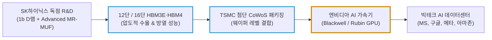
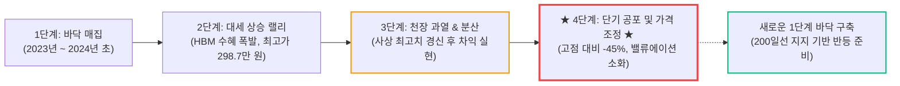

# SK하이닉스(SK hynix, 000660.KS) 실전 재무 및 독점 가치 분석 보고서

- **작성일**: 2026-09-05
- **데이터 기준**: 2026 회계연도 2분기(상반기 누적) 실적 및 yfinance 시장 데이터 (2026-09-05 기준)

분기 영업이익 60조 원을 찍고도 고점 대비 45% 떨어졌다며 공포에 질려 주식을 내던지는 대중의 무지함을 비웃어라. 엔비디아의 목줄을 쥐고 AI 가속기 생태계의 통행세를 걷는 HBM 절대 제왕, SK하이닉스가 왜 지금 3단계 과열을 털어내고 4단계 공포 구간에서 진짜 바겐세일 기회를 주는지 최근 실적 데이터와 차가운 숫자로 증명한다.

## 핵심 요약

| 구분 | 주요 내용 |
| :--- | :--- |
| **종목명 (티커)** | SK하이닉스 (SK hynix Inc., KRX: `000660.KS`) |
| **최종 투자 가치 점수** | **88.1점 / 100점** (`Buy` / 압도적 영업마진과 독점 해자 대비 단기 변동성 조정 구간) — 산출 근거는 6.1절 참조 |
| **주요 사업 영역** | 고대역폭메모리(HBM3E / HBM4), 고성능 서버용 D램(DDR5, SOCAMM2), 기업용 eSSD 및 3D 낸드플래시(NAND) |
| **현재 주가 & 52주 밴드** | 현재가 **1,647,000원** (52주 범위: 274,000원 ~ 2,987,000원) 52주 사상 최고가 대비 **-44.9% 대형 조정**, 50일선(1,843,300원, -10.7%) 하회하나 200일 장기 생명선(1,306,395원, +26.1%) 상회 지지 중 |
| **최근 분기 실적 (26년 2Q)** | 분기 매출액 **79조 3,187억 원**, 분기 영업이익 **60조 5,426억 원**(영업이익률 76.3%)으로 사상 최대 실적 경신 2026년 상반기 누적 매출 최초로 **100조 원 돌파**(누적 약 131.9조 원) |
| **수익성 & 현금창출력** | 분기 영업이익률 **76.3%**, 현금성 자산 **38조 7,244억 원** 보유, 총차입금(3조 1,945억 원)을 압도하는 무차입급 순현금 구조 영업현금흐름 **63.1조 원**, 잉여현금흐름(FCF) **55.8조 원**의 괴물 같은 현금 창출력 |
| **기술적 사이클 위치** | **3단계 천장 분산 종료 후 4단계 공포(조정/투매) 국면 본격 진입**: 50일선 이탈(-10.7%) 및 고점 대비 -45% 급락으로 차익 실현 매물과 패닉셀이 쏟아져 나오는 4단계 공포 소화 구간 |
| **핵심 투자 포인트** | • **엔비디아 동맹 기반 HBM 공급망 독점**: 엔비디아 차세대 AI 가속기용 HBM3E 및 HBM4 초기 물량 선점 및 장기공급계약(LTA) 체결 • **MR-MUF 공정 패키징 기술 해자**: 어드밴스드 MR-MUF 기술을 바탕으로 경쟁사를 압도하는 수율과 열 방출 안정성 확보 • **극단적인 저평가 밸류에이션**: 고점 대비 45% 하락으로 선행 PER **3.50배**, EV/EBITDA **1.03배** 수준까지 압축된 기형적 저평가 • **주주환원 가속화**: 막대한 잉여현금흐름을 바탕으로 대규모 자사주 취득 및 소각 공시 단행 |
| **핵심 모니터링 리스크** | 200일선(130.6만 원) 지지력 테스트, 글로벌 환율 변동성 및 거시경제 할인율 충격, 빅테크 CAPEX 집행 시점의 일시적 분산 노이즈 |

---

## 1. 비즈니스 실체: 엔비디아의 목줄을 쥔 AI 메모리 '독점 빨대'

대중은 SK하이닉스를 여전히 PC나 스마트폰에 들어가는 칩이나 만들며 경기 사이클에 널뛰기하는 단순 메모리 제조업체로 착각한다. 언론과 증권사 리포트가 '시클리컬(경기민감주)'이라는 낡은 딱지를 붙여놓으니, 개미들은 반도체 겨울이니 다운사이클이니 하는 헛소리에 휘둘려 바닥에서 주식을 털린다.

진실은 완전히 다르다. SK하이닉스는 단순한 부품 납품업체가 아니다. **전 세계 인공지능(AI) 인프라의 심장부인 그래픽처리장치(GPU)와 AI 가속기가 연산을 수행할 때 반드시 거쳐야 하는 고속도로의 통행세를 독점 징수하는 회사**다.

### 1.1 3대 핵심 메모리 비즈니스 포트폴리오

SK하이닉스의 체질은 범용 메모리에서 고부가가치 맞춤형 AI 인프라 솔루션으로 완벽하게 전환되었다.

| 사업 부문 | 주요 공급 제품 및 기술 규격 | 핵심 역할 및 독점 경쟁력 | AI 생태계 내 독점 수혜 포인트 |
| :--- | :--- | :--- | :--- |
| **HBM (초고대역폭메모리)** | • HBM3, 8단/12단 HBM3E, 차세대 16단 HBM4 • 어드밴스드 MR-MUF(액체 밀봉 봉지재) 공정 기술 | D램 다이를 수직으로 쌓아 실리콘관통전극(TSV)으로 연결한 초고속 메모리 (글로벌 1위) | 엔비디아 블랙웰(Blackwell) 및 루빈(Rubin) 아키텍처 가속기 탑재 필수재 |
| **고성능 서버용 D램** | • 1b/1c 나노 기반 고용량 DDR5 RDIMM • 차세대 모듈 규격 SOCAMM2, CXL 2.0 메모리 풀링 | 클라우드 데이터센터 서버의 주 메모리이자 대규모 병렬 연산용 버퍼 | 대규모 언어모델(LLM) 학습 및 실시간 에이전틱 AI 추론 서버의 표준 채택 |
| **기업용 eSSD & NAND** | • 초고용량 60TB/128TB PCIe Gen5 QLC eSSD • 자회사 솔리다임(Solidigm)의 플로팅 게이트 낸드 기술 | 전력 소모를 최소화하면서 페타바이트급 AI 학습 데이터를 실시간 로딩 | AI 데이터센터 스토리지 전력·공간 효율 극대화 (HDD 전면 대체) |

### 1.2 엔비디아 AI 가속기 생태계와 HBM 독점 공급망

엔비디아의 차세대 GPU가 아무리 연산 속도를 올려도, 데이터를 제때 공급해 주지 못하면 칩은 그저 전기만 먹는 돌덩이에 불과하다. 이 '메모리 병목 현상'을 해결하는 유일한 열쇠가 바로 SK하이닉스의 HBM이다.

### 1.3 기술적 해자: MR-MUF가 만든 절대적인 진입 장벽

경쟁사들이 NCF(비전도성 필름) 방식에 매달리며 열 방출 실패와 칩 휨 현상으로 수율 잡기에 허덕일 때, SK하이닉스는 에폭시 몰딩 컴파운드를 액체로 주입해 굳히는 **어드밴스드 MR-MUF(Mass Reflow Molded Underfill)** 공정을 독자적으로 완성했다.

- **열 방출 성능 2.5배 개선**: 칩과 칩 사이에 액체 보호재를 빈틈없이 채워 열전도율을 비약적으로 끌어올렸다. HBM 적층 수가 8단, 12단, 16단으로 올라갈수록 열 관리가 승패를 가르는데, 경쟁사는 이 물리적 한계를 넘지 못해 엔비디아 퀄 테스트에서 잇따라 고배를 마셨다.
- **압도적인 골든 수율**: 수년간 양산 라인에서 갈고닦은 공정 노하우와 IP는 후발주자가 돈 몇 조 원 쏟아붓는다고 하루아침에 베낄 수 있는 성질의 것이 아니다. 엔비디아가 차세대 HBM4 물량까지 SK하이닉스에 우선 배정한 것은 단순한 친분이 아니라, 물량을 불량 없이 뽑아낼 수 있는 곳이 지구상에 SK하이닉스뿐이기 때문이다.

---

## 2. 최근 실적과 시장의 오독: 60조 영업이익을 보고도 도망치는 대중의 착시 vs 숫자의 팩트

### 2.1 2026년 상반기 실적 폭탄: 영업이익 60.5조 원의 괴력

SK하이닉스는 2026년 2분기 경영실적에서 매출액 **79조 3,187억 원**, 영업이익 **60조 5,426억 원**이라는 전대미문의 숫자를 공시했다. 단 한 분기 만에 거둔 영업이익이 60조 원을 넘어섰고, **영업이익률은 76.3%**에 달했다.

1분기 매출(52.6조 원)을 합산한 상반기 누적 매출은 **131조 8,950억 원**으로 창사 이래 최초로 반기 매출 100조 원 고지를 가볍게 돌파했다. 제조업의 탈을 쓰고 소프트웨어 빅테크조차 달성하기 힘든 70%대 마진을 찍어낸 것이다.

| 실적 지표 | 2026년 2분기 실적 | 2026년 1분기 실적 | 상반기 누적 실적 | 시장 의미 및 팩트 분석 |
| :--- | :---: | :---: | :---: | :--- |
| **매출액 (Revenue)** | **79조 3,187억 원** | 52조 5,763억 원 | **131조 8,950억 원** | 사상 최초 상반기 100조 돌파, HBM3E 풀캐파 가동 |
| **영업이익 (Op Income)** | **60조 5,426억 원** | 37조 6,103억 원 | **98조 1,529억 원** | 반기 영업이익 100조 원 육박, 고부가가치 HBM 믹스 폭발 |
| **영업이익률 (OPM)** | **76.32%** | 71.53% | **74.42%** | 빅테크 플랫폼을 능가하는 역사상 유례없는 제조업 초고마진 |
| **순이익 (Net Income)** | **40조 3,302억 원** | 40조 3,459억 원 | **80조 6,761억 원** | 분기 순이익 40조 원대 안착, 주당순이익(EPS) 수직 상승 |
| **현금성 자산** | **38조 7,244억 원** | 32조 4,100억 원 | **38조 7,244억 원** | 분기마다 수십조 원의 순현금이 계좌로 직행 |
| **총차입금 (Total Debt)** | **3조 1,945억 원** | 3조 8,200억 원 | **3조 1,945억 원** | 차입금을 전부 상환하고도 35조 원이 남는 무차입 순현금 |

### 2.2 대중의 3대 착시 vs 냉혹한 데이터 팩트

이렇게 경이로운 실적을 내고도 주가가 고점 298만 원에서 164만 원으로 밀려나자, 시장 참여자들은 또다시 비관론에 빠져 허우적대고 있다. 대중이 무엇을 잘못 보고 있는지 팩트로 발라내 보자.

| 시장의 오독과 착시 (노이즈) | 데이터가 증명하는 냉혹한 진실 (팩트) |
| :--- | :--- |
| **착시 1: "분기 실적 정점(Peak-out) 찍었다"** | • AI 서비스가 학습(Training)에서 실시간 추론(Inference) 및 자율 에이전트로 확장되면서 HBM 탑재 용량은 기하급수적으로 증가 중이다. • 2026년 하반기부터 12단 HBM3E 전면 양산과 2027년 HBM4로의 세대교체가 확정되어 있어 ASP(평균판매단가)와 출하량은 꺾이지 않는다. |
| **착시 2: "범용 메모리 가격 상승률 둔화 우려"** | • 범용 D램 생산라인이 HBM용 첨단 TSV 라인으로 대거 전환되면서 범용 웨이퍼 캐파 자체가 물리적으로 잠식당했다. • 구형 메모리마저 극심한 공급 부족(쇼티지)에 직면해 있어 단기 가격 숨고르기는 일시적 재고 조정일 뿐, 구조적 역성장이 아니다. |
| **착시 3: "환율 변동성과 증권사 목표가 하향"** | • 증권사 애널리스트들이 단기 주가 급등에 놀라 기계적으로 목표주가를 조정한 것은 주가 하락에 뒤따라가는 후행적 면피 행위일 뿐이다. • 원화 환율 변동성은 달러 결제 비중이 90% 이상인 SK하이닉스의 현금흐름에 오히려 환차익 버퍼를 제공한다. |

### 2.3 주주환원의 질적 도약: 자사주 취득과 소각의 파급력

막대한 잉여현금흐름(FCF 55.8조 원)은 고스란히 주주가치 제고로 연결되고 있다. SK하이닉스는 최근 대규모 자사주 취득 및 전량 소각 공시를 단행했다.

벌어들인 돈을 엉뚱한 부실 계열사 지원이나 무리한 M&A에 낭비하지 않고, 시장에서 유통 주식 수를 직접 영구 소각하여 주당순이익(EPS)과 주당순자산(BPS)을 강제로 끌어올리는 주주환원 정책을 가동하기 시작했다. 이것이 바로 스마트머니가 하락장에서 물량을 뺏기지 않고 모아가는 결정적 이유다.

---

## 3. 경쟁 해자 및 피어 그룹 잔혹 비교 (삼성전자 vs 마이크론)

메모리 3사의 경쟁 구도는 더 이상 과거의 단순 '치킨게임'이 아니다. 누가 AI 가속기 규격에 맞춘 프리미엄 칩을 압도적인 수율과 마진으로 찍어내느냐의 단독 레이스다.

| 비교 지표 | SK하이닉스 (`000660.KS`) | 삼성전자 (`005930.KS`) | 마이크론 테크놀로지 (`MU`) |
| :--- | :---: | :---: | :---: |
| **HBM 시장 지배력** | **압도적 1위 (엔비디아 1차 메인 벤더, 물량·마진 장악)** | HBM3E 12단 퀄 통과 및 납품 (2차 세컨드 벤더 진입) | 제한적 캐파로 엔비디아 서브 벤더 (초기 8단 위주) |
| **핵심 패키징 기술** | **Advanced MR-MUF (독점 공정, 초고수율)** | TC-NCF (개선 공정 적용 중) | 1-beta 기반 Advanced NCF |
| **HBM 수율 수준** | **80% 이상 안정적 양산 수율** | 1b D램 보완으로 수율 개선 중이나 안정화 격차 존재 | 수율 개선 중이나 절대 웨이퍼 캐파 부족 |
| **영업이익률 (최신)** | **76.3% (전사 역대 최고 마진)** | 20~25% 수준 (파운드리·시스템LSI 적자 잠식) | 28~32% 수준 |
| **재무 상태** | **순현금 35조 원 이상 (무차입 요새)** | 대규모 순현금 보유 | 순부채 상태에서 설비투자 집행 |
| **차세대 HBM4 주도권** | **TSMC 베이스 다이 원팀 동맹 (엔비디아 삼각 편대 선점)** | 자체 파운드리 턴키 및 외주 병행 모색 (차세대 라인업 대응) | TSMC 외주 협력 추진 중 |

### 3.1 삼성전자 HBM3E 12단 퀄 통과의 실체와 팩트 교정

시장 일각에서 "삼성전자는 HBM을 아예 못 넣고 있다"며 비웃는 것은 과거 1년 전의 흘러간 프레임에 갇힌 아마추어적 오독이다. 투자는 루머가 아니라 변한 팩트 위에 세워야 한다.

* **HBM3E 공급망 공식 합류**: 초기 8단 제품에서 겪었던 발열 및 전력 효율 문제를 1b D램 개선품 등으로 보완하면서, **12단 제품을 중심으로 엔비디아 품질 인증(퀄 테스트)을 통과하고 블랙웰 공급망에 정식 합류해 이미 납품을 진행 중**이다. 삼성전자의 HBM 공급 배제설은 이미 과거의 이야기다.
* **현재 전선(HBM4 경쟁 돌입)**: 시장의 초점은 이미 HBM3E를 넘어 차세대 규격인 6세대 HBM4로 빠르게 이동했다. 삼성전자는 베이스 다이에 자체 파운드리 공정을 직접 결합하는 '턴키(Turnkey) 역량'을 앞세워 엔비디아 차세대 라인업 대응과 수주 경쟁에 본격 돌입했다.

### 3.2 그럼에도 SK하이닉스 대비 주가 탄력이 둔화되는 2대 냉혹한 이유

삼성전자가 퀄을 통과해 공급망에 들어왔는데도, 왜 시장은 SK하이닉스에게만 압도적인 프리미엄과 주가 탄력을 부여하는가? 그 이면에는 겉핥기식 기사로는 보이지 않는 2가지 냉혹한 구조적 진실이 도사리고 있다.

- **① 절대적 물량 점유율과 판가(ASP) 협상력 격차 (1차 메인 벤더 vs 2차 세컨드 벤더)**:
    - 퀄 테스트를 통과해 납품이 이루어지더라도, **메인 벤더(1차 공급사)로서 엔비디아의 절대적 수량과 가장 달콤한 최상위 마진을 선점한 곳은 여전히 SK하이닉스**다.
    - 삼성전자는 공급망 다변화를 위한 세컨드 벤더(2차 공급사) 격으로 진입했기 때문에, 단가 협상력이나 전사 매출에서 차지하는 고마진 HBM 믹스 비중에서 SK하이닉스와 체급 차이가 날 수밖에 없다. 엔비디아로서도 수율과 안정성이 검증된 SK하이닉스를 메인으로 두고 삼성전자를 단가 후려치기 및 공급망 리스크 분산 카드로 활용하는 것이 합리적이기 때문이다.
- **② 파운드리 적자 늪과 레거시 메모리의 밸류에이션 갉아먹기**:
    - SK하이닉스는 순수 메모리-HBM 집중 체제로 전환하여 분기 영업이익률 76.3%라는 경이로운 현금창출력을 온전히 주가 멀티플에 반영한다.
    - 반면 삼성전자는 메모리 사업부가 HBM 진입으로 흑자 폭을 키워도, **비메모리(파운드리 및 시스템LSI) 사업부의 누적 적자**와 여전히 높은 레거시(범용) 메모리 비중이 발목을 잡는다. 한쪽에서 번 돈을 다른 쪽 적자가 까먹는 구조 탓에 전체 기업가치(멀티플)의 상단이 무겁게 짓눌려 온 것이다.

### 3.3 투자자의 최종 결론: '단순 퀄 통과'가 아닌 '실질 점유율 격차 축소'가 관건이다

삼성전자가 엔비디아 HBM 공급망에 발을 디딘 것은 팩트다. 그러나 시장의 눈높이는 이미 "통과했느냐"라는 초보적 질문을 넘어섰다.

앞으로의 주가 차별화는 **'단순 납품 통과'라는 간판을 넘어, 엔비디아 전체 HBM 물량 안에서 SK하이닉스와의 실질적인 점유율 격차를 얼마나 유의미하게 좁히고 마진을 지켜내느냐**에 달려 있다. TSMC와 굳건한 3각 편대를 구축하고 MR-MUF 공정으로 수율을 쥐어짠 SK하이닉스의 성벽은 결코 만만치 않다. 대중의 풍문에 휩쓸리지 말고, 실제 분기별 점유율과 마진 믹스 숫자로 승부를 확인해라.

---

## 4. 기술적 사이클 위치: 3단계 천장 분산 종료와 4단계 공포(투매) 국면의 바닥 시그널

### 4.1 스탠 와인스타인 4단계 사이클 모델 기준 위치

현재 SK하이닉스의 주가 흐름은 **'3단계 천장 과열(Distribution) 국면'을 공식 종료하고, 50일선 이탈과 함께 단기 투매와 공포 심리가 쏟아져 나오는 '4단계 공포/투매(Capitulation) 국면'에 본격 진입**해 있다.

### 4.2 국면 판단의 3대 기술적 근거

- **① 사상 최고가(298.7만 원) 대비 -44.9% 하락과 50일선 이탈**:
    - 연초 이후 AI 슈퍼사이클 광풍을 타고 주가가 298만 7,000원까지 가파르게 치솟았던 구간이 전형적인 3단계 과열 국면이었다. 이후 2분기 사상 최대 실적 발표를 전후로 고점 대비 주가가 무려 45%나 조정을 받으며 164만 7,000원까지 내려앉았다.
    - 50일 이동평균선(1,843,300원)을 -10.7% 밑돌며 단기 추세가 꺾이자, 레버리지를 썼던 신용 물량과 단타 개미들이 공포에 질려 물량을 집어 던졌다. 이는 4단계 조정 국면의 전형적인 매물 출회 현상이다.
- **② 200일 장기 생명선(1,306,395원) 지지력과 추세의 건전성**:
    - 주가가 반토막 났다고 호들갑을 떨지만, **기관과 외국인의 1년 평균 매입 단가이자 대세 생명선인 200일 이동평균선(130.6만 원)은 여전히 현재가보다 26.1% 아래에 굳건히 버티고 있다.**
    - 즉, 펀더멘털이 망가져 회사가 무너지는 시스템적 하락이 아니라, 단기 급등에 따른 밸류에이션 과열을 식히고 손바뀜을 유도하는 '건전한 대형 눌림목'이다.
- **③ 손익비(Risk/Reward)의 극적인 역전**:
    - 고점 부근에서는 위로 먹을 룸은 적고 아래로 떨어질 위험만 컸다. 하지만 지금은 200일선(130.6만 원)이라는 강력한 콘크리트 바닥까지의 하방 위험(약 -20%) 대비, 직전 고점(298만 원) 회복 시 기대할 수 있는 상방 룸(+81.4%)이 약 4배 넓은 자리다. 공포가 극에 달했을 때가 가장 안전한 진입 시점이다.

### 4.3 4단계에서 2단계 복귀까지의 소요 시간과 투자자의 딜레마

기술적 분석을 공부한 투자자라면 즉각 다음 의문을 제기할 것이다:
**"4단계(하락)에 진입했다면 1단계(바닥 횡보 매집)를 거쳐 2단계(상승)로 복귀하기까지 상당한 시간이 걸리는 것 아닌가? 지금 사면 물려서 하세월을 보내야 하는 것 아닌가?"**

이에 대한 헤지펀드의 냉혹한 시장 분석과 시간표는 다음과 같다.

#### ① '대세 하락 4단계'와 '슈퍼사이클 내부의 급락 조정(4단계)'의 결정적 차이
- **교과서적 대세 하락 4단계**: 200일 이동평균선이 하향 꺾이고 주가가 200일선 밑으로 장기 침몰하는 국면이다. 이 경우 바닥을 다지고 이평선을 돌려세우는 1단계 매집에 최소 1년~2년 이상의 긴 시간이 걸린다. 스탠 와인스타인이 "절대 쳐다보지도 마라"고 경고한 4단계가 바로 이것이다.
- **SK하이닉스의 현재 국면**: **200일 장기 생명선(130.6만 원)은 여전히 가파르게 우상향** 중이며, 주가는 200일선보다 +26.1% 위에 살아있다. 즉, 장기 추세가 사망한 것이 아니라 단기 과열(300만 원)에 따른 단기 50일선 이탈과 패닉셀이 결합된 **'사이클 내부의 중기 가격 급락(Intra-cycle Crash Correction)'**이다.

#### ② 소요 시간의 2가지 경로 (기간 조정 vs V자 밸류에이션 리레이팅)
- **경로 A: 전형적인 1단계 기간 조정 (소요 기간 3~6개월)**
    - 주가가 140만~175만 원 박스권에 갇혀 50일선이 내려오고 200일선이 올라와 수렴할 때까지 지루한 횡보 손바뀜이 진행된다.
    - 조급한 단타 개미들은 지쳐서 물량을 던지고, 스마트머니는 티 안 나게 물량을 매집한다. 수익을 보는 데 최소 한두 분기의 시간이 걸릴 수 있다.
- **경로 B: 비이성적 극단 저평가(PER 3.5배)에 따른 V자 급반등 (소요 기간 1~2개월)**
    - 기업 이익이 망가진 게 아니라 분기 영업이익 60조 원을 찍고 있는 상태에서 센티먼트만 과매도로 꺾인 경우, 대형 호재(엔비디아 차세대 로드맵 발표, 자사주 소각 집행, 외국인 숏커버링) 하나로 1단계를 단숨에 건너뛰고 50일선(185만 원)을 V자로 뚫어버리는 숏스퀴즈 반등이 터질 수 있다.

#### ③ 투자자의 전략적 선택: '가격의 이점' vs '시간의 이점'
- **시간을 아끼고 싶다면**: 지금 사지 마라. 주가가 4단계 조정을 완전히 끝내고 50일선(185만 원)을 거래량 실어 상향 돌파하며 공식 2단계로 복귀하는 것을 눈으로 확인하고 사라. 대신 바닥(150만~160만 원)보다 **+20~30% 비싼 가격을 치르는 대가**를 치러야 한다.
- **가장 싼 가격과 압도적 안전마진을 쥐고 싶다면**: 지금 4단계 공포 구간부터 분할로 진입해라. PER 3.5배라는 역사적 바겐세일 가격에 지분을 확보하는 대신, **'3~6개월간의 지루한 바닥 다지기를 견뎌내는 시간(인내심)'**을 지불해야 한다.
- 공짜 점심은 없다. 싸게 사려면 시간을 주고, 시간을 아끼려면 비싸게 사야 한다. 자신의 투자 성향이 '인내하는 가치투자자'인지 '추세추종 모멘텀 트레이더'인지 먼저 스스로에게 물어봐라.

---

## 5. 밸류에이션 및 가격 타당성 검증

### 5.1 수익성과 현금창출력의 압도적 방어막

- **수익성 (Profitability)**: 분기 영업이익률 76.3%, 순이익률 50.8%를 찍었다. 100원어치 물건을 팔아서 원가와 판관비를 다 제하고 76원을 남긴다는 뜻이다. 반도체 가격이 일시적으로 흔들려 마진이 10~20% 깎인다 한들 여전히 50% 이상의 초고마진을 유지한다.
- **재무 건전성 (Balance Sheet)**: 보유 현금성 자산만 38조 7,244억 원이다. 총차입금(3.2조 원)을 당장 내일 아침 전액 일시 상환해도 수중에 35조 원이 넘는 뭉칫돈이 남는다. 부채비율은 사실상 무의미한 수준이며, 연간 수십조 원의 설비투자(CapEx)를 외부 차입 없이 자체 현금으로 전액 충당하고도 자사주를 소각할 수 있는 무적의 체력이다.

### 5.2 기형적으로 찌그러진 밸류에이션 멀티플

시장은 공포에 눈이 멀어 SK하이닉스의 주가를 상식 이하의 헐값으로 내던졌다.

| 밸류에이션 지표 | 현재 수치 | 시장 의미 및 냉정한 해석 |
| :--- | :---: | :--- |
| **현재 주가 (Current Price)** | **1,647,000원** | 52주 최고가(2,987,000원) 대비 **-44.9%**, 52주 최저가 대비 +501.1% |
| **시가총액 (Market Cap)** | **약 1,169조 원** | 분기 영업이익 60조 원, 연간 환산 200조 원 이상 체급 |
| **선행 12개월 PER (Forward P/E)** | **3.50배** | **글로벌 테크 기업 역사상 전례 없는 극단적 저평가. 빅테크 평균(25~30배)의 1/7 수준** |
| **EV/EBITDA** | **1.03배** | 회사를 통째로 인수했을 때 1년 벌어들이는 현금만으로 인수 대금을 회수하는 수준 |
| **자기자본이익률 (ROE)** | **354% 수준** | 비정상적으로 치솟은 분기 순이익이 만들어낸 비현실적 자본 효율 |
| **영업현금흐름 (OCF)** | **63조 548억 원** | 기업 활동을 통해 실제 통장에 꽂히는 막대한 현금 유입 |
| **잉여현금흐름 (FCF)** | **55조 7,681억 원** | 대규모 CapEx를 집행하고도 순수하게 남는 주주 몫의 잉여 현금 |

선행 PER 3.5배, EV/EBITDA 1.03배라는 수치는 시장이 SK하이닉스를 향해 "너희가 지금 버는 이익은 신기루이고 내년이면 1/5 토막 날 것이다"라고 저주를 퍼붓고 있다는 증거다. 그러나 빅테크들의 인공지능 인프라 투자는 멈추지 않고 있으며, HBM 주문은 이미 내년 물량까지 완판되었다. 시장의 편견과 실제 숫자의 괴리가 이렇게 벌어졌을 때가 바로 인생을 바꿀 기회다.

---

## 6. 종합 평가 및 냉혹한 계좌 실행 원칙

### 6.1 6대 핵심 투자 지표 다차원 평가 매트릭스

| 평가 영역 | 가중치 | 평점 (100점 만점) | 가중 점수 | 등급 | 냉혹한 평가 요약 |
| :--- | :---: | :---: | :---: | :---: | :--- |
| **① 비즈니스 모델 및 독점 해자** | 25% | **97점** | 24.25 | `S+` | 엔비디아 차세대 가속기 HBM 독점 공급, MR-MUF 수율 해자 |
| **② 실적 성장성 및 마진 파괴력** | 25% | **96점** | 24.00 | `S+` | 분기 영업이익 60.5조 원, 영업이익률 76.3%의 전무후무한 수익성 |
| **③ 현금 창출력 및 재무 건전성** | 20% | **95점** | 19.00 | `S` | FCF 55.8조 원, 순현금 35조 원의 완벽한 재무 요새 구축 |
| **④ 밸류에이션 매력도** | 15% | **92점** | 13.80 | `S` | 선행 PER 3.5배, EV/EBITDA 1.03배로 글로벌 증시 최저 수준 |
| **⑤ 기술적 매매 타이밍** | 10% | **45점** | 4.50 | `D` | 3단계 과열 후 4단계 공포 국면 진입, 50일선 이탈로 단기 변동성 확대 |
| **⑥ 거시 리스크 관리력** | 5% | **50점** | 2.50 | `C` | 글로벌 환율 부담, 미 매크로 금리 기조 및 증권가 목표가 하향 노이즈 |
| **종합 가중치 환산 점수** | **100%** | — | **88.05점** | **`Buy`** | **펀더멘털은 무적이나 단기 사이클 과열 해소 국면. 분할 매수 적기** |

---

### 6.2 최종 종합 결론 및 실전 행동 방침

SK하이닉스는 기업 역사상 가장 찬란한 실적을 찍고 있는 순간에, 가장 차가운 시장의 냉대를 받고 있다. 분기 60조 원을 벌어들이는 회사에 선행 PER 3.5배를 매겨놓은 시장의 집단 광기보다 더 확실한 안전마진은 없다.

하지만 50일선을 이탈하며 4단계 공포/투매 국면에 본격 진입한 구간에서는 주가의 바닥을 함부로 예단하고 한 번에 돈을 털어 넣어서는 안 된다. 공포에 질린 투매 물량이 쏟아져 나올 때는 칼날을 손바닥으로 잡지 말고, 바닥에 꽂힌 뒤 진동이 멈출 때까지 가격대별로 차분하게 주워 담아야 한다.

200일선(130.6만 원)을 추세 판정의 기준선으로 삼고, 지금부터 3~6개월의 시계열을 두고 철저히 분할 매수로 대응하라.

| 구분 | 실행 조건 | 배정 비중 | 가격 기준 | 실전 대응 방침 |
| :--- | :--- | :---: | :---: | :--- |
| **1차 진입 (선발대)** | 고점 대비 -45% 과매도 구간 진입 확인에 따른 1차 진입 | 배정 자금의 **30%** | **1,550,000원 ~ 1,650,000원** | 현재가 부근에서 공포를 이겨내고 선발대 포지션 구축 |
| **2차 매수 (눌림목)** | 200일선(130.6만 원) 상단 지지 확인 및 패닉 셀 마무리 구간 | 배정 자금의 **40%** | **1,350,000원 ~ 1,450,000원** | 추가 하락 시 비중을 가장 크게 늘리는 주력 매수 구간 |
| **3차 매수 (회복 경로)** | 50일 이동평균선(184만 원)을 거래량 실어 상향 돌파할 때 | 배정 자금의 **30%** | **1,850,000원 돌파 시** | 4단계 조정 종료 및 새로운 2단계 랠리 시작 확인 후 불타기 |
| **3차 매수 (하락 경로)** | 독점 구조 훼손 없이 매크로 충격만으로 100만 원대까지 언더슈팅할 때 | 배정 자금의 **30%** | **1,000,000원 ~ 1,100,000원** | 회복 경로와 택일. 먼저 도달하는 한쪽에만 마지막 실탄을 집행 |
| **1차 목표주가** | 밸류에이션 정상화 및 50일선 안착 후 직전 중간 저항선 | — | **2,200,000원 (+33.6%)** | 6개월 내 밸류에이션 리레이팅 1차 타깃 |
| **2차 목표주가** | HBM4 양산 가시화 및 사상 최고가 탈환 시도 | — | **2,800,000원 ~ 3,000,000원** | 12개월 이상 중기 목표 (고점 전고점 도전) |
| **비중 축소선 (독점 구조 훼손 시)** | HBM 장기공급계약 축소나 엔비디아 물량 이탈로 독점 구조가 깨진 상태에서 200일선을 종가로 이탈하고 3거래일 연속 회복에 실패할 때 | — | **1,250,000원 종가 이탈 시 비중 50% 축소** | 가격만의 하락은 매수 근거이고, 독점 구조의 훼손만이 청산 근거다 |

!!! tip "최종 핵심 제언 (Executive Takeaway)"
    - **60조 원을 버는 놈이 3.5배에 거래되는 기형적 시장을 이용해라**: 대중은 실적이 꺾일까 봐 두려워 도망치지만, 숫자는 거짓말을 하지 않는다. 제조업에서 76% 영업마진을 찍고 35조 원 순현금을 쥐고 있는 독점 기업을 이 가격에 살 수 있는 기회는 흔치 않다.
    - **절대 한 번에 몰빵하지 마라**: 4단계 공포/투매(Capitulation) 국면의 한복판에서는 공포에 질린 패닉셀이 언제든 추가로 쏟아질 수 있다. 현재가 부근(30%)에서 선발대만 넣고, 135만~145만 원 눌림목(40%)에서 기다려라. 시장이 패닉에 빠져 던질 때 차분히 입을 벌리고 있어야 한다.
    - **200일선(130.6만 원)은 대세 추세의 분기점이다**: 이 선이 무너지지 않는 한 HBM 슈퍼사이클의 대세 우상향 기조는 유효하다. 단기 환율 노이즈나 애널리스트들의 목표가 하향 따위에 쫄지 마라. 그들은 언제나 고점에서 목표가를 올리고 바닥에서 목표가를 내리는 확증 편향의 노예들이다.
    - **주주환원의 속도를 믿어라**: 자사주 취득과 소각은 회사가 자기 주식이 말도 안 되게 싸다는 것을 세상에 공표하는 가장 강력한 신호다. 경영진이 자사주를 쓸어 담아 태워버리는 판국에 개미가 겁을 먹고 주식을 던지는 바보짓을 반복하지 마라.

---

### 6.3 블랙스완 스트레스 테스트: '100만 원 붕괴 시나리오'와 계좌 생존 방정식

대중과 초보 투자자들은 언제나 묻는다. **"지금 분할 매수하면 '절대' 안 물리나? 이거 100만 원 밑으로 처박힐 수도 있는 것 아닌가?"**

이 질문에 대해 글로벌 헤지펀드가 계산하는 냉혹한 수학과 리스크 관리 매뉴얼로 답한다.

#### ① "절대 물리지 않는다"는 환상부터 쓰레기통에 처넣어라
- 주식 시장에서 '절대'라는 말을 지껄이는 자는 사기꾼이거나 시장을 도박판으로 아는 하수뿐이다.
- 분할 매수는 "단 1원도 손실을 보지 않겠다"는 탐욕의 기술이 아니다. **"내가 진입한 뒤 주가가 -20%, -30% 처박혀도 계좌가 터지지 않고, 평단을 낮춰 다음 상승 사이클에서 압도적인 수익으로 시장을 이겨내겠다"는 방어와 공격의 결합 기술**이다.
- 주식을 사자마자 당장 빨간불이 들어오길 바라는 어린애 같은 조급증을 버리지 못하면, 지금 이 종목뿐만 아니라 어떤 주식도 사서는 안 된다.

#### ② 100만 원 밑으로 떨어질 수도 있는가? (블랙스완 가능성)
- **떨어질 수 있다.** 시장에 100% 불가능이란 존재하지 않는다.
- 미국발 극심한 글로벌 경기 침체, 대만 해협 지정학적 전면전, 빅테크 기업들의 AI 데이터센터 설비투자(CapEx) 전면 동결 같은 대형 '블랙스완'이 터진다면, 시장의 비이성적 공포는 100만 원은커녕 80만 원까지도 패닉 셀을 밀어붙일 수 있다. 시장의 광기와 공포는 언제나 인간의 이성을 뛰어넘기 때문이다.

#### ③ 하지만 100만 원이 무너졌을 때의 숫자를 계산해 본 적이 있는가?
- 100만 원이라는 가격표 뒤에 숨겨진 기업가치를 엑셀로 단 한 번이라도 두드려 봤는가?

| 비교 항목 | 현재가 기준 (1,647,000원) | 100만 원 붕괴 시 (1,000,000원) | 냉혹한 금융 팩트 및 의미 |
| :--- | :---: | :---: | :--- |
| **고점(298.7만 원) 대비 낙폭** | -44.9% | **-66.5% 폭락** | 반도체 슈퍼사이클 사상 최대 낙폭 수준 |
| **시가총액** | 약 1,169조 원 | **약 710조 원** | 시가총액 약 460조 원 증발 |
| **선행 12개월 PER** | 3.50배 | **2.12배** | **전 세계 제조업 및 테크 역사상 전무후무한 밸류에이션 붕괴** |
| **EV/EBITDA** | 1.03배 | **0.62배** | 영업현금흐름 반년 치면 기업 전체를 무차입 인수하는 수준 |
| **보유 순현금 대비 시총** | 시총의 3.0% (35조 원) | **시총의 5.0% 육박** | 통장에 꽂힌 순현금만 35조 원, FCF 연간 55조 원 |

- 최근 12개월 순이익만 162조 원을 찍고 내년 이익이 두 배로 뛴다는 컨센서스를 깔고 있는 독점적 1위 기업의 시가총액이 710조 원(최근 12개월 실적 기준 PER 4.4배, 선행 PER 2.1배)까지 떨어진다는 것은, **"인류의 AI 혁명은 완전한 사기극이었고 빅테크는 망했으며 인류는 2010년대로 퇴보한다"는 종말론**이 현실화되어야만 설명이 되는 기형적 가격이다.
- 만약 100만 원이 깨진다면? 그것은 공포에 질려 도망칠 자리가 아니라, 집문서를 잡혀서라도 전 세계 1등 반도체 과점 기업을 거저 주워 담아야 하는 역사적 바겐세일의 순간이다.

#### ④ "반도체는 시클리컬이라 이익이 반토막 날 수 있지 않나?" — 빙하기 스트레스 테스트

"반도체는 원래 업황을 심하게 타는 경기민감주(Cyclical)다. 매년 이익이 일정할 리가 없지 않나?"라는 의문은 **어처구니없는 소리가 아니라, 시장의 본질을 정확히 꿰뚫는 지극히 정당한 질문**이다.

실제로 시장이 SK하이닉스에 선행 PER 3.5배라는 기형적 저평가를 매겨놓은 근본적 원인이 바로 이 **'과거의 사이클 트라우마(2022~2023년의 8조 원 적자 공포)'** 때문이다. 대중과 기관 모두 "지금 버는 60조 원은 사이클의 꼭짓점(Peak-out)이고 내년이면 곤두박질칠 것"이라는 공포에 질려 있다.

그렇다면 진짜로 최악의 반도체 빙하기가 와서 **연간 순이익이 최근 12개월 실적(약 162조 원)의 3분의 1 남짓인 60조 원 수준으로 수직 낙하**한다고 가정하고 밸류에이션을 스트레스 테스트해 보자:

- **① 현재 주가(164.7만 원, 시총 1,169조 원) 기준**:
    - 연간 순이익이 3분의 1 토막 나서 60조 원으로 추락해도, **PER은 고작 19.5배**에 불과하다. 미국 빅테크 평균 PER(25~30배)보다 여전히 훨씬 싸다.
- **② 주가 100만 원(시총 710조 원) 기준**:
    - 이익이 3분의 1 토막 난 최악의 혹한기 국면에서도 **PER은 11.8배**다. 무차입 순현금 35조 원을 시총에서 덜어내면 실질 PER은 **11.2배**까지 더 내려간다.
- **③ '과거 범용 D램'과 '현재 HBM'의 구조적 차이**:
    - **Commodity vs 맞춤형 수주(Custom Order)**: 과거에는 일단 공장을 돌려 창고에 재고를 쌓아두고 가격이 떨어지면 덤핑을 쳤다. 하지만 HBM은 엔비디아와 빅테크의 다음 세대 칩에 맞춰 1년 전부터 선주문(Pre-order)을 받아 전량 소진(Sold-out) 계약을 체결하고 생산하는 **수주형 비즈니스**다. 공급 과잉 덤핑이 일어날 구조적 여지가 없다.
    - **물리적 웨이퍼 캐파 잠식**: HBM은 일반 D램보다 웨이퍼 면적을 2.5~3배나 더 잡아먹는다. 즉, HBM을 증산할수록 전 세계 일반 D램 캐파가 강제로 줄어들어 메모리 전반의 공급 과잉을 물리적으로 원천 차단한다.

#### ⑤ 100만 원 붕괴에 대비하는 실전 계좌 운용 매뉴얼
- 지금 160만 원대에서 돈을 한 번에 다 털어 넣으면, 주가가 130만 원, 100만 원으로 내려앉을 때 심리가 박살 나서 바닥에서 손절을 치고 피눈물을 흘리게 된다.
- 그래서 다음 3단 방어 진형을 지켜야 한다:
    1. **1선 진입 (현재가 155만~165만 원, 30%)**: 밸류에이션 3.5배 과매도 구간에서 선발대로 지분을 확보한다. 물려도 상관없는 비중이다.
    2. **2선 매수 (200일선 상단 135만~145만 원, 40%)**: 정상적 기술적 조정의 최후 지지선에서 비중을 가장 크게 싣는다. 여기까지 채우면 평단이 148만 원대로 내려온다.
    3. **3선 비상 실탄 (100만~110만 원 언더슈팅 대비, 30%)**: 매크로 블랙스완이 터져 100만 원을 위협할 때를 대비해 마지막 30% 현금은 절대 건드리지 않고 쥐고 있는다.
- 이 원칙대로 포트를 짜두면, 100만 원으로 처박혀도 평균 단가는 135만 원 안팎으로 내려오고, 남들이 공포에 질려 주식을 내던지는 최악의 구간에서 당신은 마지막 3차 실탄을 쏘며 판을 지배할 수 있다.
- **결론**: 떨어질까 봐 밤잠을 설칠 거라면 비중을 줄여라. 100만 원까지 밀리는 최악의 스트레스 테스트를 견딜 배짱과 계좌 설계가 없다면 단 1주도 건드리지 마라.
