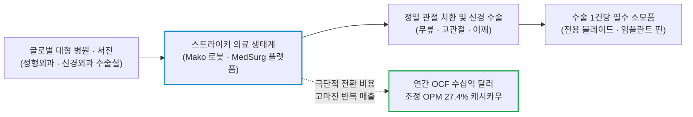
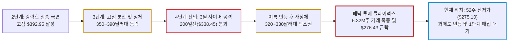

# 스트라이커(Stryker / SYK) 실전 재무 및 가치 분석 보고서

- **작성일**: 2026-09-09
- **데이터 기준**: 2026년 2분기 실적(2026-06-30 마감) 및 yfinance 시장 데이터(2026-09-08 미국장 마감 기준)

전 세계 정형외과 수술실의 목줄을 쥐고 있는 독점 헬스케어 공룡이 단기 공급망 노이즈 하나로 52주 신저가($275.10) 바닥까지 내팽개쳐졌다. 언론과 대중이 일시적 생산 차질에 질려 패닉 셀을 던질 때, 콘크리트 해자와 선행 PER 16배의 역사적 손익비를 꿰뚫어 보고 냉혹하게 분할 매수 타점을 계산하라.

## 핵심 요약

| 구분 | 핵심 요약 |
| :--- | :--- |
| **종목 및 주가** | 스트라이커 (NYSE: `SYK`) / **$276.43** (52주 범위 $275.10 ~ $392.95) |
| **최종 투자의견** | **조건부 분할 매수 (Buy on Oversold)** / 52주 저점($275) 지지 확인 후 저격 매수 (투자 가치 점수 **84.0점**, 6.1절) |
| **비즈니스 본질** | 마코(Mako) 로봇 수술 생태계 락인(Lock-in), MedSurg 및 정형외과 수술용 소모품 과점 통행세 |
| **핵심 매력 (Bull)** | Q2 매출 YoY +9.4%($6.59B), 연간 유기적 성장 8.3~9.3%, YTD OCF $1.8B+, 10억 달러 자사주 매입 |
| **핵심 리스크 (Bear)** | 말초혈관 부문 주요 공장 공급 차질(3~4분기 여파), 고관절 치환 회복 지연, 200일선(-18.3%) 이탈 및 투매 거래량(6.32M) |
| **포트폴리오 성격** | 경기 불황을 뚫는 **고품질 헬스케어 방파제(베타 0.77, 배당률 1.2%)** / **단기 2배 폭등 테마를 쫓는 투기꾼은 매수 금지** |

---

## 1. 비즈니스 실체: 대중이 모르는 기업의 '목줄'과 독점 빨대

대중은 병원과 의사를 치료의 주체로만 본다. 금융의 눈으로 수술실 문을 열어젖히면 전혀 다른 진실이 드러난다. 환자의 뼈를 깎고, 인공관절을 박아 넣고, 뇌신경을 건드리는 수술실의 모든 하드웨어와 소모품 인프라를 독점 공급하며 막대한 통행세를 뜯어내는 배후의 포식자가 바로 스트라이커(Stryker, `SYK`)다.

스트라이커는 정형외과 수술에 필수적인 인공 무릎·고관절 임플란트, 수술실 전동 공구, 환자 이송·모니터링 시스템, 뇌·척추 신경외과용 첨단 장비를 생산하는 글로벌 의료 기술의 표준이다. 병원이 문을 열고 서전(Surgeon)이 메스를 잡는 한, 스트라이커의 제품 없이는 하루의 수술 스케줄도 정상 가동될 수 없다.

### 1.1 마코(Mako) 로봇이 구축한 극단적 락인(Lock-in)

- **① 의사를 길들이는 전환 비용(Switching Cost)**:
    - 정형외과 로봇 수술 시스템인 **마코(Mako)**는 0.1mm 단위로 뼈를 절삭하고 인공관절 삽입 궤적을 제어한다. 수년간 마코 플랫폼의 햅틱 피드백과 소프트웨어에 손이 익은 집도의는 타사 기기로 넘어가지 못한다. 로봇을 바꾸다 수술 오차나 합병증이 발생하면 집도의의 평판과 병원의 법적 리스크가 파멸로 치닫기 때문이다.
- **② '면도기-면도날' 독점 빨대 모델**:
    - 마코 로봇 본체 판매는 시작에 불과하다. 수술을 집도할 때마다 반드시 스트라이커가 특허로 묶어둔 전용 임플란트 팩과 소모품 키트를 소비해야 한다. 로봇이 병원에 깔릴수록 매 분기 꼬박꼬박 꽂히는 고마진 소모품 통행세의 규모는 자동으로 불어난다.
- **③ 규제와 인증이라는 난공불락의 진입 장벽**:
    - 의료기기 산업은 까다로운 미국 FDA 승인, 수년간 축적된 수십만 건의 임상 추적 데이터, 각국 보건 당국의 GMP 품질 인증이 필수적이다. 실리콘밸리의 어떤 테크 스타트업도 돈 몇 푼 싸 들고 와서 이 시장을 침범할 수 없다. 규제 자체가 기존 과점 기업의 밥그릇을 지켜주는 콘크리트 참호다.
- **④ MedSurg와 정형외과의 환상적인 바벨 구조**:
    - 정형외과(관절 치환)뿐만 아니라 경기 변동과 무관하게 병원 수술실에서 계속 소모되는 MedSurg(수술용 전동 기구, 내시경, 환자 케어 장비) 부문이 포트폴리오의 절반 이상을 받치고 있다. 특정 관절 수술 수요가 일시적으로 흔들려도 회사 전체의 마진과 현금흐름이 무너지지 않는 강력한 하방 복원력의 원천이다.

### 1.2 마코(Mako) 로봇의 시장 지배력: 68% 독점 점유율과 임상 장벽

대중은 경쟁사들도 로봇을 내놓으니 독점이 깨질 것이라 착각한다. 시장 점유율과 설치 대수 데이터를 까보면 경쟁 자체가 성립하지 않는 일방적인 독점 판도다.

| 로봇 플랫폼 | 제조사 | 시장 점유율 (미국/글로벌) | 출시/진입 시기 | 누적 설치 대수 (Installed Base) |
| :--- | :--- | :---: | :---: | :--- |
| **마코 (Mako)** | **스트라이커 (`SYK`)** | **약 65% ~ 68%** | **2013년 인수 (압도적 선점)** | **글로벌 3,000대 (2025년 말 기준, 독보적 1위)** |
| **로사 (ROSA)** | 짐머 바이오메트 (`ZBH`) | 약 15% ~ 20% | 2019년 출시 (6년 늦은 후발주자) | 수백 대 수준 (추격 중이나 격차 극심) |
| **벨리스 (VELYS)** | 존슨앤드존슨 (DePuy) | 약 8% ~ 10% | 2021년 출시 (8년 늦은 후발주자) | 대형 병원 번들링 위주 침투 시도 |
| **코리 (CORI)** | 스미스앤드네퓨 (`SNN`) | 약 5% ~ 7% | 2020년 출시 | 소형 핸드헬드 위주 틈새시장 공략 |

- **① 6~8년 앞선 '퍼스트 무버(First Mover)' 선점 효과**:
    - 스트라이커는 2013년에 마코 서지컬(Mako Surgical)을 16.5억 달러(약 2조 2천억 원)에 전격 인수했다. 짐머나 JNJ가 뒤늦게 뛰어들었을 때는 이미 전 세계 주요 대학병원과 대형 정형외과 수술실의 명당자리를 마코가 선점한 뒤였다.
- **② '임상 데이터 250만 건'이라는 넘을 수 없는 참호**:
    - 정형외과 서전들은 검증되지 않은 신형 로봇을 환자 뼈에 대지 않는다. 마코는 이미 **47개국에서 글로벌 누적 수술 250만 건 이상**을 돌파하며 "수술 후 10년 생존율, 재수술 감소율" 등 방대한 임상 논문 데이터를 학계에 독점 구축했다. 후발주자들은 이 데이터의 양을 따라잡는 것 자체가 불가능하다.
- **③ 2026년 최신 병기 투입 (어깨 적응증 확대 및 Mako RPS)**:
    - 무릎과 고관절을 완전히 장악한 데 이어, 최근 **어깨 관절 치환술(Shoulder)**로 적응증을 확대했다.
    - 또한 2026년 7월 16일에는 핸드헬드 방식의 차세대 수술 로봇인 **'마코 RPS(Mako Robotic Power System)'**를 정식 출시했다. 절삭 가이드(Cutting Block) 없이 집도의의 손동작에 실시간으로 반응하는 능동 보정 기술을 탑재하여, 대형 로봇 팔을 들여놓기 어려웠던 진료 환경까지 파고들며 후발주자들이 비집고 들어올 틈새마저 틀어막았다.

### 1.3 '원 트릭 포니'라는 착시: 마코는 38%의 공격수, 본체는 62%의 MedSurg 제국이다

대중은 '로봇'이라는 화려한 기술에 눈이 팔려 "스트라이커는 마코 로봇 하나 보고 투자하는 회사"라고 단정 짓는다. 하수들의 시야다. 실제 장부를 까보면 정형외과보다 **MedSurg(내과·외과 장비 및 인프라)의 매출 비중이 훨씬 더 크다.**

| 사업 부문 | 연간 매출 규모 (2025 기준) | 전체 매출 비중 | 핵심 제품군 및 독점 빨대 |
| :--- | :---: | :---: | :--- |
| **MedSurg & 신경외과** *(MedSurg & Neuro)* | **약 156.5억 달러** ($15.65B) | **약 62%** | **수술실 전동 드릴/톱, 4K 내시경, 스마트 병상, 응급실 제세동기, 뇌졸중 혈전제거 카테터** |
| **정형외과 (관절 치환)** *(Orthopaedics)* | **약 94.7억 달러** ($9.47B) | **약 38%** | **마코(Mako) 로봇, 인공 무릎·고관절·어깨 임플란트, 골절 외상 치료 기구** |

- **① MedSurg — 병원이 돌아가는 한 무조건 소모되는 인프라 독점**:
    - 환자가 관절 수술을 받든, 맹장을 떼든, 암 수술을 받든 집도의가 손에 쥐는 전동 톱, 드릴, 지혈 장비, 4K 복강경/내시경 시스템의 표준이 스트라이커다.
    - 응급차의 들것, 응급실 제세동기(LIFEPAK), 입원실 스마트 병상(ProCuity)까지 병원의 물리적 동선 전체를 도배해 놓았다. 경기가 침체되어도 병원이 문을 여는 한 이 장비와 소모품은 매일 교체된다.
- **② Neurotechnology — 분초를 다투는 뇌혈관 초고마진 중재 시술**:
    - 급성 뇌졸중 환자의 혈관에서 혈전을 빼내는 카테터와 뇌동맥류 코일 등 뇌와 척추를 다루는 초정밀 기기를 독점한다. 의사의 숙련도와 환자의 생사가 직결되어 병원이 가격을 깎지 못하는 고마진 영역이다.
- **③ 마코 로봇의 진짜 역할: '원 트릭 포니'가 아닌 '가장 날카로운 창'**:
    - 인튜이티브 서지컬(`ISRG`, 다빈치)처럼 매출 대부분이 로봇 하나에 쏠린 회사는 병원의 장비 예산(CAPEX) 축소나 경쟁 로봇 출현 시 회사 전체가 흔들린다.
    - 반면 스트라이커는 **62%의 MedSurg·신경외과 인프라가 계좌의 콘크리트 바닥을 지탱하고, 38%의 마코 로봇이 경쟁사(짐머, JNJ)의 밥그릇을 뺏어오는 '공수 완벽한 바벨 포트폴리오'**다. 마코는 스트라이커의 전부가 아니라, 이미 완성된 거대 병원 유통망 위에서 영구 락인을 거는 **'화룡점정의 치트키'**다.

---

## 2. 최근 실적과 시장의 오독: 대중의 착시 vs 숫자의 팩트

### 2.1 2분기 실적 팩트 체크: 본업의 성장 엔진은 건재하다

2026년 2분기 스트라이커의 실적은 탑라인과 바텀라인 모두 시장의 눈높이를 상회했다. 숫자는 회사의 펀더멘털이 여전히 강력한 순항 궤도에 있음을 명백히 가리킨다.

| 재무 지표 | Q2 2025 | Q1 2026 | Q2 2026 | 전년 동기 대비(YoY) | 냉혹한 데이터 분석 |
| :--- | ---: | ---: | ---: | ---: | :--- |
| **총매출** | $6,022.0M | $6,020.0M | **$6,589.0M** | **+9.4%** | 글로벌 수술 수요 회복 및 신제품 믹스 개선 |
| **GAAP 영업이익** | $1,168.0M | $936.0M | **$1,660.0M** | **+42.1%** | 운영 효율화 및 가격 결정력 기반 이익 급증 |
| **조정 영업이익률 (Adjusted OPM)** | 26.2% | 25.8% | **27.4%** | **+1.2%p** | 고마진 마코 소모품 확대로 27%대 돌파 |
| **GAAP 순이익** | $884.0M | $745.0M | **$1,276.0M** | **+44.3%** | 견고한 탑라인 레버리지 효과 입증 |
| **GAAP 희석 EPS** | $2.29 | $1.93 | **$3.30** | **+44.1%** | 분기 사상 최대 수준 순이익 기록 |
| **조정 희석 EPS (Non-GAAP)** | $3.13 | $2.87 | **$3.69** | **+17.9%** | 월가 컨센서스 상회 |
| **영업현금흐름 (OCF)** | $1,111.0M | $581.0M | **$1,261.0M** | **+13.5%** | `YTD` 누적 영업현금흐름 **$1.84B+** 달성 |
| **현금 및 단기투자자산** | $2,464.0M | $2,965.0M | **$3,476.0M** | **+41.1%** | 약 **$3.5B**의 막강한 유동성 방파제 보유 |

출처: yfinance 분기 재무제표 및 스트라이커 2026년 2분기 실적 발표(2026-06-30 마감 기준).

### 2.2 지난 1년간 주가가 30% 폭락한 4대 구체적 악재 타임라인

스트라이커 주가가 최고점 $392.95에서 52주 신저가 $275.10을 찍고 $276.43에 마감하기까지 곤두박질친 것은 단순한 기분 탓이 아니다. 지난 1년간 회사를 덮친 4대 구체적 악재의 연쇄 작용이 기관들의 투매 버튼을 연속으로 눌렀다.

- **① 2026년 3월 11일: 글로벌 사이버 공격(Cybersecurity Incident) 직격탄 ($389 ➔ $329)**:
    - 스트라이커의 글로벌 IT 시스템이 대규모 사이버 해킹 공격을 받으며 79개국에서 주문 접수, 공장 가동, 제품 출하 라인이 일시에 마비되었다.
    - 수술실로 들어가야 할 필수 의료기기 납품이 지연되며 1분기 실적에 직접적인 타격을 입혔다. IT는 복구되었으나 이때 발생한 재고 꼬임과 공급망 병목이 이후 생산 차질의 화근이 되었다.
- **② 2026년 5~8월: 정형외과 및 고관절(Hip) 부문의 실적 회복 지연 ($281 저점 후 $320선 정체)**:
    - 마코 로봇 기반의 무릎 치환술은 견조했으나, 고관절(Hip) 치환 수술의 회복 속도가 월가 기대치를 크게 밑돌았다.
    - 5월에는 장중 $281까지 밀렸다가 2분기 실적 호조에 힘입어 6~7월에 반등했으나, 7~8월 들어 전형적인 여름철 계절적 비수기(수술 연기)와 맞물리며 $320~$330 구간에서 횡보세를 면치 못했다.
- **③ 2026년 9월 8일: 웰스파고 컨퍼런스 CFO의 자백과 투매 폭탄 ($303 ➔ $276 신저가 직행)**:
    - 9월 8일 웰스파고 제21회 헬스케어 컨퍼런스에서 CFO 프레스턴 웰스(Preston Wells)가 입을 열었다. 3월 사이버 공격의 여진이 핵심 캐시카우인 **말초혈관(Peripheral Vascular) 제조 공장의 생산 차질**로 번졌으며, 이 공급 차질이 분기 성장률을 70~80bp씩 갉아먹으면서 3분기는 물론 4분기까지 이어질 것이라고 자백했다.
    - 배신감을 느낀 기관들이 물량을 일제히 집어던지며 **발언 당일 하루 만에 632만 주(평소의 2.5배)의 투매 거래량과 함께 -8.8% 폭락**이 터졌다.
- **④ 거시 환경: 고금리 지속과 비만치료제(GLP-1) 공포의 잔여 노이즈**:
    - 고금리 장기화로 미국 중소형 병원들이 고가 로봇 구매(CAPEX)를 일시 미루거나 리스로 전환하며 지갑을 닫았다.
    - 여기에 "위고비·젭바운드로 살이 빠지면 관절염 수술이 줄어들 것"이라는 월가의 설레발이 메드테크 전반의 밸류에이션 멀티플을 지속적으로 짓눌렀다.
- **⑤ 회사의 반격 카드: 전략적 M&A와 10억 달러 자사주 매입**:
    - 회사는 위축되지 않고 차세대 혈관 쇄석술(IVL) 기업인 **앰플리튜드 배스큘러 시스템즈(AVS)** 인수를 완료했으며, 어깨 회전근개 보강 기술을 확보하기 위해 **주리메드(ZuriMED)** 인수에도 합의했다.
    - 여기에 **최대 10억 달러($1.0B) 규모의 자사주 매입 재개**를 발표하며 바닥 밸류에이션을 강력하게 지탱하겠다는 의지를 천명했다.

!!! info "투자 전략가의 냉혹한 판정: 일시적 운영 병목인가, 영구적 파괴인가?"
    지난 1년간의 하락은 '사이버 공격 ➔ 공장 생산 차질 ➔ 3~4분기 납품 지연'으로 이어진 **순수 운영상의 실행 리스크(Execution Issue)**다.

    환자의 연골은 지금도 닳고 있고, 수술 대기 명단(백로그)은 사라지지 않았다. 공장에 불이 났다고 기업의 독점력이 죽은 줄 알고 던진 대중의 공포는, 공급망이 정상화되고 이연된 주문이 출하되는 순간 가장 강력한 주가 반등의 스프링으로 전환된다.

### 2.3 시장의 착시 vs 냉혹한 데이터 팩트

| 시장이 보고 놀란 것 (착시) | 데이터가 말해주는 진실 (팩트) |
| :--- | :--- |
| **"공급망 차질로 3~4분기 실적이 폭망할 것이다"** | 공장 생산 차질은 일시적 물리적 병목일 뿐, 제품 결함이나 수요 소멸이 아니다. 수술을 기다리는 환자와 의사들의 마코 로봇 주문 백로그는 그대로 살아있다. 공급망이 정상화되는 순간 이연된 매출이 한꺼번에 쏟아진다. |
| **"고관절 회복 지연으로 정형외과 패권을 잃고 있다"** | 무릎과 어깨 등 타 관절 치환술은 여전히 시장 평균을 웃도는 성장을 유지하고 있다. 고관절 부문의 일시적 계절성은 AVS와 ZuriMED 등 고성장 M&A 파이프라인으로 충분히 상쇄된다. |
| **"52주 신저가까지 처박혔으니 끝없는 나락이다"** | 하루 만에 632만 주의 손절 물량이 터지며 떨어진 자리는 52주 신저가($275.10)다. 펀더멘털 파괴가 아니라 단기 노이즈에 놀란 투기 자금의 패닉 셀이며, 선행 PER은 16.5배까지 다이어트가 완료됐다. |

---

## 3. 경쟁 해자 및 피어 그룹 잔혹 비교

의료기기 및 헬스케어 메드테크 시장은 높은 진입 장벽 덕분에 소수 과점 기업들만의 리그다. 피어 그룹과 지표를 대조해 보면 스트라이커가 받고 있는 단기 징벌적 디스카운트의 실체가 드러난다.

| 시장 비교 지표 | 스트라이커 `SYK` | 짐머 바이오메트 `ZBH` | 보스턴 사이언티픽 `BSX` | 메드트로닉 `MDT` | 존슨앤드존슨 `JNJ` |
| :--- | ---: | ---: | ---: | ---: | ---: |
| **현재 주가 ($)** | **276.43** | 94.22 | 44.98 | 92.39 | 269.12 |
| **시가총액 ($B)** | **106.03** | 17.97 | 65.19 | 118.18 | 648.55 |
| **후행 PER (TTM)** | **28.7배** | 22.9배 | 18.2배 | 22.8배 | 31.3배 |
| **선행 PER (Forward)** | **16.5배** | 10.4배 | 13.1배 | 14.4배 | 21.9배 |
| **주가매출비율 (P/S)** | **4.1배** | 2.1배 | 3.1배 | 3.1배 | 6.6배 |
| **EV/EBITDA** | **16.0배** | 9.8배 | 13.6배 | 13.3배 | 19.4배 |
| **최근 분기 매출 성장률 (YoY)** | **+9.4%** | +4.8% | +7.5% | +13.7% | +6.6% |
| **영업이익률 (TTM)** | **27.0%** | 18.0% | 22.9% | 19.3% | 29.2% |

출처: yfinance 시장 데이터(2026-09-08 종가 기준). [Stryker(SYK)](https://finance.yahoo.com/quote/SYK/), [Zimmer Biomet(ZBH)](https://finance.yahoo.com/quote/ZBH/), [Boston Scientific(BSX)](https://finance.yahoo.com/quote/BSX/), [Medtronic(MDT)](https://finance.yahoo.com/quote/MDT/), [Johnson & Johnson(JNJ)](https://finance.yahoo.com/quote/JNJ/)

### 3.1 피어 대비 핵심 경쟁력 및 리스크 판정

- **스트라이커 vs 짐머 바이오메트 (ZBH) — 순수 관절주와 종합 메드테크의 격차**:
    - 짐머 바이오메트는 선행 PER 10.4배로 얼핏 싸 보이지만, 정형외과 비중이 지나치게 높아 관절 수술 업황이 꺾이면 속수무책이다. 최근 분기 매출 성장률이 **+4.8%**에 그치고 OPM도 **18.0%**로 스트라이커(27.0%)에 한참 못 미친다.
    - 로봇 수술(Mako vs ROSA) 침투율에서도 마코의 압도적 시장 점유율에 밀리고 있다. 싼 데는 다 구조적인 이유가 있다.
- **스트라이커 vs 존슨앤드존슨 (JNJ) — 비대함과 집중도의 차이**:
    - JNJ는 제약과 메드테크를 합친 6,480억 달러짜리 공룡이지만, 선행 PER 21.9배로 스트라이커(16.5배)보다 32% 이상 비싸다.
    - 메드테크 부문만 놓고 보면 스트라이커가 로봇 수술 및 정형외과 틈새에서 훨씬 더 공격적인 혁신과 빠른 의사결정으로 시장 점유율을 갉아먹고 있다.
- **성장과 수익성의 완벽한 교집합**:
    - 메드트로닉(MDT)이 심혈관 부문 회복으로 +13.7% 성장했으나 영업이익률은 19.3%에 불과하다.
    - **연간 8~9%대의 유기적 성장률과 27%가 넘는 두터운 영업이익률, 그리고 선행 PER 16.5배의 밸류에이션 매력을 동시에 쥐고 있는 기업은 스트라이커뿐이다.** 고점 멀티플이 깨져 내려앉은 지금 자리는 역사적으로 드문 가격대다.

### 3.2 선행 PER 16.5배의 착시: 왜 폭락했는데도 피어보다 비싸 보이는가?

주가가 52주 신저가까지 떨어졌음에도, 선행 PER을 대조해 보면 짐머 바이오메트(10.4배), 보스턴 사이언티픽(13.1배), 메드트로닉(14.4배)보다 스트라이커(16.5배)가 여전히 비싸다. 이 숫자를 보고 "아직 덜 빠졌다"고 오독하는 것은 **절대 밸류에이션(자체 역사)과 상대 밸류에이션(피어 대비)의 차이**를 이해하지 못한 얕은 시야다.

- **자체 역사적 기준으로는 5년 내 유례없는 폭락 세일**:
    - 스트라이커는 평상시 시장에서 **선행 PER 24~28배**의 높은 밸류에이션을 인정받던 최상급 1티어 퀄리티 종목이다.
    - 25배를 웃돌던 주식이 단기 공장 차질 노이즈로 16.5배까지 내려앉은 것은, 역사적 멀티플 밴드의 바닥을 뚫고 내려온 전형적인 **'멀티플 다이어트'**다.
- **피어 대비 왜 항상 프리미엄을 받는가? (품질의 격차)**:
    - **짐머 바이오메트(`ZBH`, 10.4배)**는 수치상 싸 보이지만, 매출 성장률이 **+4.8%**에 그치고 OPM도 **18.0%**에 불과하며 로봇 수술(ROSA)에서도 마코에 완패했다. 성장이 멈춰 주가가 오르지 못하는 전형적인 **'밸류 트랩(Value Trap, 저평가 함정)'**이다.
    - 반면 스트라이커(`SYK`)는 **+9.4% 성장률 + 27.4% 고마진 + 68% 로봇 독점 점유율**을 동시에 쥐고 있다. 시장은 주가가 폭락한 와중에도 "이 회사는 짐머 따위의 2류 기업과 같은 취급을 받을 수 없다"며 품질 프리미엄(Quality Premium)을 유지하고 있는 것이다.
- **실전 투자자의 결론**:
    - 스트라이커는 "피어보다 싸서" 사는 종목이 아니다. **"평소에 25배 프리미엄을 줘야만 살 수 있던 업계 1등 독점주를 단기 공급망 악재 덕분에 16배 바겐세일에 살 수 있는 기회"**로 해석해야 한다. 독점 퀄리티 주식은 위기 상황에서도 2류 피어들처럼 10배 밑으로 내려오지 않는다.

---

## 4. 기술적 사이클 위치 (4단계 사이클 모델)

스탠 와인스타인의 4단계 사이클 모델로 진단할 때, 스트라이커는 **3단계 천장 분산 이후 단기 악재 돌출로 급격한 패닉 셀이 터진 4단계 공포(Capitulation) 국면의 극단이자 극단적 과매도(Oversold) 바닥권**에 위치해 있다.

| 기술 지표 | 2026-09-08 기준값 | 기술적 상태 판정 |
| :--- | ---: | :--- |
| **현재 주가** | **$276.43** | **단기 수직 급락**, 9월 8일 하루 만에 **-8.81%** 투매 음봉 출현 |
| **52주 최고가** | **$392.95** | 최고점 대비 **-29.65%** 폭락 (고점 거품 완전 해소) |
| **52주 최저가** | **$275.10** | 최저점 대비 불과 **+0.48%** 상회 (강력한 바닥 지지선 테스트) |
| **50일 이동평균선** | **$328.91** | 주가가 50일선 대비 **-15.95%** 하회 (극단적 이격도 과매도) |
| **200일 이동평균선** | **$338.45** | 장기 생명선 대비 **-18.32%** 이탈 (추세 훼손 경고) |
| **최근 거래량** | **6.32M 주** | 3개월 평균(약 2.5M 주) 대비 **2.5배** 폭증 (기관 손절 투매 절정) |

### 4.1 차트가 말하는 냉혹한 현실: 바닥 확인 없는 섣부른 추격은 금물

주가가 200일선($338.45)을 한참 밑돌고 있는 상태에서 하루 만에 평소의 2.5배에 달하는 632만 주의 매도 폭탄이 쏟아졌다. 이것은 단기 모멘텀 펀드와 기관들이 악재성 뉴스에 질려 손절매 버튼을 일제히 누른 전형적인 **클라이맥스 투매(Climax Selling)**의 흔적이다.

52주 최저점인 **$275.10** 바로 위에서 마감했다는 사실은 두 가지 의미를 갖는다.
1. 지지선이 바로 발밑에 있어 손절 기준을 $270선으로 매우 타이트하게 잡을 수 있는 최상의 손익비 자리다.
2. 그러나 투매 봉의 여진이 남아있으므로 첫날 음봉에 목돈을 한꺼번에 밀어 넣는 것은 떨어지는 칼날을 맨손으로 잡는 바보짓이다. 거래량이 마르고 $275선에서 하방 경직성을 확보하는 분할 접근이 필수적이다.

---

## 5. 밸류에이션 및 가격 타당성 검증

### 5.1 선행 EPS 역산 가격 시나리오

yfinance 기준 스트라이커의 선행 EPS 컨센서스(다음 회계연도 조정 EPS)는 **$16.75**다. 현재 주가 $276.43은 이 예상치 기준 **선행 PER 약 16.5배** 수준이다. 지난 5년간 스트라이커가 받아온 역사적 선행 PER 밴드(24~28배)의 최하단을 완전히 뚫고 내려온 파격적인 할인 가격이다.

한 가지 짚어둘 점은 후행 PER 28.7배와 선행 PER 16.5배의 큰 격차다. 후행 배수는 인수 자산 상각비가 그대로 반영된 **GAAP 기준 TTM EPS($9.64)**로 계산되고, 선행 배수는 상각비를 제외한 **조정(Non-GAAP) EPS** 컨센서스로 계산되기 때문에 생기는 차이이지 실적이 1년 만에 74% 뛴다는 뜻이 아니다. 참고로 회사가 제시한 2026년 조정 EPS 가이던스는 **$14.95 ~ $15.10**이다.

| 시장 시나리오 | 적용 선행 PER | 산출 적정 주가 | 현재가($276.43) 대비 | 시나리오 발동 조건 |
| :--- | :---: | ---: | ---: | :--- |
| **Bear (비관적)** | **14.0배** | **$234.50** | **-15.2%** | 공급망 차질이 2027년까지 장기화되고 미국 병원 CAPEX 예산 전면 삭감 |
| **Base (중립적)** | **19.0배** | **$318.25** | **+15.1%** | 4분기 공장 정상화, 연간 가이던스(8.3~9.3%) 달성 및 자사주 10억 달러 집행 |
| **Bull (낙관적)** | **24.0배** | **$402.00** | **+45.4%** | AVS/ZuriMED 인수 시너지 조기 가시화, Mako 어깨 적응증 폭발, 역사적 밸류 복원 |

### 5.2 가격 타당성 판정

- 현재 주가 $276.43은 **Bear 시나리오와 Base 시나리오 사이의 바닥권**에 놓여 있다. 시장은 마치 스트라이커의 수술 로봇 비즈니스가 영구적으로 망가진 것처럼 가격을 매겨놓았다.
- 상방 여력(Bull)은 **+45.4%**에 달하는 반면, 최악의 침체를 가정한 하방(Bear)은 **-15.2%** 수준이다. **기대 손익비가 3.0 대 1**에 달한다. 잃을 것은 제한적이고 얻을 것은 명확한 전형적인 비대칭 베팅 구간이다.
- 회사가 보유한 약 **35억 달러($3.5B)의 현금성 자산**과 **10억 달러($1.0B)의 자사주 매입 카드**는 주가가 $250선 아래로 붕괴되는 것을 막아줄 강력한 콘크리트 안전마진이다.

### 5.3 장기 투자 가치의 확실성: 4대 영구 복리 엔진 (Demographic & Compounding Moat)

단기 노이즈를 걷어내고 5년, 10년의 시계열로 스트라이커를 바라보면 투자의 근거는 훨씬 선명해진다. 숫자로 확인되는 4대 장기 복리 엔진이 기업 가치의 우상향을 뒷받침한다.

- **① 인구통계학의 절대 법칙: 재생되지 않는 연골과 실버 쓰나미**:
    - AI 반도체는 3년 뒤 기술 표준이 바뀔 수 있지만, 인간의 무릎과 고관절 연골은 60세가 넘으면 물리적으로 무조건 마모된다.
    - 베이비붐 세대의 초고령화(Silver Tsunami)는 2030년대까지 이어지는 거대한 메가트렌드다. 경기 침체가 오든 금리가 폭등하든, 뼈가 부딪혀 걷지 못하는 노인은 수술대에 오를 수밖에 없다. 관절 치환은 아낄 수 있는 선택재가 아니라 인간의 존엄을 위한 '비탄력적 필수 소비'다.
- **② 30년 배당 성장과 25년을 관통한 복리 트랙레코드**:
    - 스트라이커는 1991년 배당을 개시한 이래 닷컴 버블, 2008년 금융위기, 2020년 팬데믹을 모두 통과하면서 **30년 넘게 배당을 꾸준히 증액해 온 배당 성장주**다. 2015년 주당 $1.42였던 연간 배당금은 2025년 $3.40까지 불어나며 10년간 연평균 9.1%씩 증가했다.
    - 연평균 8~10%의 유기적 매출 성장과 10~13%의 EPS 성장도 시계추처럼 찍어냈다. 배당 재투자 기준 25년 총수익률은 **1,260%(연 11.0%)**로 같은 기간 S&P 500(SPY, 993%·연 10.0%)을 앞선다.
    - 다만 빅테크가 지수를 끌어올린 최근 10년만 잘라 보면 스트라이커(연 10.4%)는 S&P 500(연 15.2%)에 뒤졌다. 이 종목은 지수를 압도하는 초과수익 엔진이 아니라, **변동성을 크게 낮춘 상태로 두 자릿수 복리를 꾸준히 쌓는 자산**으로 이해해야 한다.
- **③ 실패 확률 0%에 수렴하는 '볼트온 M&A' 현금 증식 공식**:
    - 매년 병원 수술실에서 **50억 달러를 웃도는 순수 영업현금**을 채굴한다(2025년 $5.04B, 최근 12개월 $5.53B).
    - 임상 실패 확률이 높은 바이오 도박 대신, 유망한 특허 기술을 개발한 알짜 스타트업(AVS, ZuriMED 등)을 인수(Bolt-on)하여 전 세계 3,000대 마코 로봇과 이미 깔아 놓은 글로벌 병원 유통망에 즉시 태운다. R&D 리스크는 외부에 넘기고 이익만 독식하는 자본 증식 모델이다.
- **④ 선행 PER 16배 바닥권에서의 기대 총수익률(Total Return) 구조**:
    - 평소 24~28배를 치러야 했던 최상급 독점주가 단기 공장 차질 노이즈로 16.5배까지 내려앉았다. 52주 신저가($275선)에서 진입하여 3~5년을 보유할 경우:
        - **연 10~12%의 주당순이익(EPS) 복리 성장**
        - **선행 PER 16배에서 정상 멀티플(22~24배)로의 복원 (+35~40% 리레이팅)**
        - **연 1.2%의 배당금 재투자 복리 효과**
    - 이 3박자가 결합되면 **연평균 15% 안팎의 총수익률(Total Return)**을 기대할 수 있는 구조다. 다만 이 수치는 멀티플 복원을 전제로 한 시나리오이므로, 리레이팅이 지연되면 EPS 성장률과 배당수익률을 합한 연 11~13% 수준이 현실적인 하한선이다.

---

## 6. 종합 평가 및 냉혹한 계좌 실행 원칙

### 6.1 6대 핵심 투자 지표 다차원 평가 매트릭스

| 평가 영역 | 가중치 | 평점 (100점 만점) | 가중 점수 | 등급 | 핵심 평가 요약 |
| :--- | :---: | :---: | :---: | :---: | :--- |
| **① 비즈니스 모델 및 해자** | 25% | **95점** | 23.75 | `S` | Mako 로봇 수술 독점 생태계, 극단적 전환 비용 및 면도날 소모품 모델 |
| **② 실적 성장성 및 가이던스** | 25% | **88점** | 22.00 | `A+` | Q2 매출 YoY +9.4%, 연간 유기적 성장 8.3~9.3% 가이드라인 완벽 유지 |
| **③ 재무 건전성 및 현금흐름** | 20% | **90점** | 18.00 | `S` | YTD OCF $1.84B+, $3.5B 현금성 자산, 10억 달러 자사주 매입 재개 |
| **④ 밸류에이션 매력도** | 15% | **75점** | 11.25 | `B+` | 고점 대비 -30% 폭락, 선행 PER 16.5배로 과거 5년 평균 대비 극단적 저평가 |
| **⑤ 기술적 매매 타이밍** | 10% | **50점** | 5.00 | `D+` | 200일선 붕괴 및 투매 거래량(6.32M) 폭증, 52주 저점($275.10) 지지력 시험 중 |
| **⑥ 리스크 관리 가능성** | 5% | **80점** | 4.00 | `A-` | 52주 신저가 지지선 명확하여 손절 기준 설정 용이 |
| **종합 가중치 환산 점수** | **100%** | — | **84.0점** | **`Buy on Oversold`** | **펀더멘털 최우량, 단기 악재 과매도 국면을 이용한 분할 진입** |

!!! info "평점 산출 근거"
    종합 점수는 각 영역 평점에 가중치를 곱해 합산한 값이다.
    `95×0.25 + 88×0.25 + 90×0.20 + 75×0.15 + 50×0.10 + 80×0.05 = 84.00점`

    비즈니스 해자(95점)와 현금흐름(90점), 실적 성장성(88점)은 글로벌 톱티어 의료기기 기업답게 압도적이다. 그러나 단기 공장 차질 노이즈로 200일선을 깨고 632만 주의 투매가 터진 기술적 자리(50점)는 여전히 바닥 확인이 필요하다. 종합 **84.0점**은 뛰어난 비즈니스가 단기 악재로 할인 판매대에 올라왔음을 명확히 보여준다.

### 6.2 실전 결론: "그래서 지금 어쩌라는 것인가?" (Action Verdict)

#### ① 지금 당장 사야 하는가? ➔ **"몰빵하지 마라. 52주 저점($275) 위에서 정찰대부터 쪼개 넣어라."**

- **이유**: 하루 만에 -8.8%가 빠지고 거래량이 평소의 2.5배로 터진 칼날은 첫날 바로 멈추지 않는다. 시장의 공포가 진정되고 바닥을 다지는 시간이 필요하다.
- **지금 할 일**: 52주 신저가인 **$275.10** 지지 여부를 실시간으로 감시하면서, 배정 예산의 25% 이내로만 1차 선발대(정찰대)를 투입하는 전략적 분할 대응이다.

#### ② 이런 주식은 누가 사고, 누가 절대 사면 안 되는가?

- **❌ 절대 사지 마라 (즉시 퇴장)**:
    - 1~2달 안에 50% 폭등할 AI 밈 주식이나 테마주를 찾는 투기꾼.
    - 5% 이상의 고배당 분배금을 노리는 인컴 투자자 (스트라이커의 배당수익률은 1.2% 수준이며, 잉여현금은 R&D와 자사주 매입에 집중된다).
    - 하루 주가 3% 흔들릴 때마다 공포에 질려 시장가 매도를 누르는 심약자.
- **⭕ 반드시 눈독 들이고 주워 담아야 할 사람 (스나이퍼 대기)**:
    - 경기 침체나 매크로 금리 발작에도 흔들리지 않는 초우량 헬스케어 독점 인프라를 원하는 장기 복리 투자자.
    - 대중의 어리석은 뉴스 공포(공장 일시 차질)를 비웃고, 남들이 던진 우량주의 피를 닦아 담을 줄 아는 가치 역발상 투자자.

#### ③ 이 주식으로 '인생 역전(대박)'을 노리면 안 되는 냉혹한 이유

- **시가총액 1,060억 달러(약 145조 원)의 골리앗**: 이미 글로벌 병원망을 장악한 성숙기 대형주다. 스타트업처럼 매출이 2배씩 튈 수 없으며, 연간 8~10%의 유기적 성장과 마진 개선이 합리적인 물리적 한계다.
- **포트폴리오 내 진짜 쓸모**: 단기 대박을 터뜨려 줄 카지노의 공격수가 아니라, 시장 폭락장에서도 베타 0.77의 방어력과 독점 소모품 매출로 계좌를 지켜줄 **'최상급 방파제이자 장기 우상향 복리 엔진'**이다.

### 6.3 실전 가격대별 실행 시나리오 및 분할 매수 로드맵

스트라이커에 배정하기로 한 총 투자 예산 내부의 비중이며, **전체 포트폴리오 대비 최대 허용 편입 한도는 4.0% 이내**로 엄격히 제한한다.

| 구분 | 실행 조건 | 배정 비중 / 계좌 한도 | 가격 기준 | 대응 방침 |
| :--- | :--- | :---: | :---: | :--- |
| **1차 진입 (선발대)** | 52주 저점($275) 지지 확인 및 하락 진정 시 | **25% / 1.0%** | **$272 ~ $278** | 투매 진정 확인 후 1차 정찰 포지션 구축 |
| **2차 매수 (주력)** | 거래량 급감 횡보 및 단기 바닥 양봉 출현 | **35% / 1.4%** | **$268 ~ $275** | 손익비가 극대화되는 구간에서 핵심 비중 집행 |
| **3차 매수 (추세 복원)** | 50일선($328) 회복 및 200일선 재돌파 시 | **25% / 1.0%** | **$320 ~ $330** | 장기 상승 추세 복귀 확인 후 불타기 |
| **예비 현금** | 매크로 충격 및 공급망 지연 장기화 버퍼 | **15% / 0.6%** | — | 바닥 붕괴 시 추가 대응용으로 계좌에 보존 |
| **철수 기준선 (손절)** | 52주 저점 완전 붕괴 및 주요 지지선 이탈 | **전량 철수** | **주봉 종가 $255 하회** | 장기 펀더멘털 훼손으로 간주하고 미련 없이 손절 |

!!! tip "최종 핵심 제언 (Executive Takeaway)"
    - **최종 투자 가치 점수**: **84.0점 / 100점** (`Buy on Oversold` / 펀더멘털 최우량, 과매도 구간 분할 진입)
    - **공포의 본질을 보라**: 공장 생산 차질은 수술 환자의 수요를 없애지 못한다. 수술은 취소된 것이 아니라 미뤄진 것뿐이다.
    - **가격의 선물을 취하라**: 고점 $392에서 $276까지 30%가 빠지며 선행 PER 16.5배가 됐다. 이런 가격은 평상시에는 구경조차 할 수 없다.
    - **단, 흥분하여 한 번에 베팅하지 마라**: 52주 최저점인 **$275.10** 지지력을 며칠간 차분히 확인하고, 정찰대부터 3단계로 나누어 냉철하게 계좌에 담아라.
