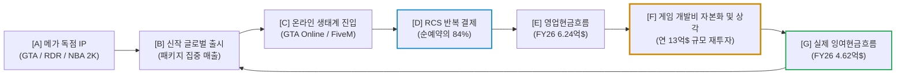
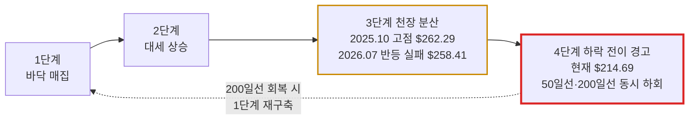

# 테이크-투 인터랙티브(Take-Two Interactive, TTWO) 실전 재무 및 가치 분석 보고서

- **작성일**: 2026-09-06
- **데이터 기준**: 회계연도 2027년 1분기(2026년 8월 7일 공시) 실적, 최근 3개월 핵심 뉴스(2026.06.03 ~ 2026.09.04) 및 yfinance 시장 데이터 (2026-09-06 조회, 종가 기준일 2026-09-04)

GTA VI는 진짜다. 그런데 시장은 그걸 이미 알고 있고, 이미 값을 다 치렀다. 주가 $214.69는 FY28 컨센서스 주당순이익 $5.29에 **40.6배**를 얹은 가격이다. "10년 만의 역사적 저평가"라고 떠드는 소리에 속지 마라. 지금 이 주식을 사는 행위는 싼 자산을 줍는 게 아니라, **이미 성공이 반영된 가격에 출시일 하나를 걸고 베팅하는 것**이다. 그 베팅의 진짜 배당률을 숫자로 발라낸다.

## 핵심 요약

| 구분 | 주요 내용 |
| :--- | :--- |
| **종목명 (티커)** | 테이크-투 인터랙티브 소프트웨어 (Take-Two Interactive Software, Inc., NASDAQ: `TTWO`) |
| **최종 투자 가치 점수** | **69.6점 / 100점** (`Hold` / 사업 실체는 최상급이나 주가에 성공이 선반영된 단일 이벤트 베팅) |
| **주요 사업 영역** | 글로벌 메가 IP 퍼블리싱(락스타 게임즈, 2K, 징가), 패키지 타이틀 판매, 반복 소비자 지출(RCS, 인게임 화폐 및 시즌 패스), 모바일 및 모드 커뮤니티(FiveM) 생태계 |
| **현재 주가 & 52주 밴드** | 현재가 **$214.69** (52주 장중 범위: $187.63 ~ $265.94) 52주 고점 대비 **-19.3%**. 8월 31일 연기설 루머로 **-6.67% 급락**(거래량 684만 주)하며 200일선($227.89) 붕괴. 50일선($239.67)은 그 이전부터 하회 |
| **최근 분기 실적 (FY27 Q1)** | 매출 **15.34억 달러**(YoY **+2.0%**), GAAP EPS **-$0.18**(컨센서스 -$0.209 대비 $0.03 상회). **영업현금흐름 -1.69억 달러, 잉여현금흐름 -1.94억 달러로 분기 현금 순유출** |
| **연간 가이던스 (FY27)** | 순예약(Net Bookings) **80억 ~ 82억 달러**, 매출 **79억 ~ 81억 달러**. 월가 매출 컨센서스 **85.15억 달러**를 하회하는 보수적 제시 |
| **현금창출력 (실측)** | FY26 잉여현금흐름 **4.62억 달러**(영업현금 6.24억 − 설비투자 1.63억). 최근 12개월 기준 **3.38억 달러**. **FCF 수익률 1.15%, EV/FCF 89.4배** |
| **기술적 사이클 위치** | **3단계 분산 후반 ~ 4단계 초입 경고**: 2025년 10월 고점 이후 저점 높이기 실패, 50일선·200일선 동시 하회, 대량 거래 동반 지지선 이탈 |
| **핵심 투자 포인트** | • **GTA VI 2026년 11월 19일 출시 예정**: 6월 18일 프리오더 개시(+4.93%), 8월 27일 신규 영상 공개 • **RCS 순예약 비중 84%**: 신작 공백기에도 현금이 도는 구조. FY27 Q1 매출 YoY +2.0%가 이를 입증 • **12월 분기 폭발 예정**: FY27 Q3(12월) 매출 컨센서스 **33.82억 달러**로 전년 동기 대비 **+92.5%** • **월가 목표가**: BofA $368, BTIG $313, 파이퍼샌들러 $280, 평균 $286.89 |
| **핵심 모니터링 리스크** | • **밸류에이션**: FY27 PER 111.8배, FY28 PER 40.6배로 이미 프리미엄 구간 • **출시 일정**: 이미 2회 연기된 전력. 투자 논리 전체가 단일 날짜에 종속 • **현금흐름**: 직전 분기 FCF 적자, FY23~FY26 4년 연속 GAAP 순손실 • **기술적 훼손**: 200일선 이탈 후 거래량 감소 속 저가 이탈 지속 |

---

## 1. 비즈니스 실체: 3대 레이블과 RCS가 만드는 진짜 현금 구조

테이크-투를 단순 게임 유통사로 보는 건 틀렸다. 이 회사는 **전 세계 수억 명의 여가 시간을 붙잡아 두고 그 안에서 반복 결제를 걷어 들이는 구조**를 쥐고 있다. 전작 GTA V가 2013년 출시 이후 2억 2,500만 장 이상 팔려나간 건 문화 현상이지 단순 히트작이 아니다.

다만 이 구조가 아무리 강해도 그것과 "지금 주가가 싸다"는 명제는 완전히 별개다. 사업의 질과 주식의 값어치를 뒤섞는 순간 계좌가 녹는다.

### 1.1 3대 핵심 레이블의 영토 분할

| 레이블 | 핵심 프랜차이즈 IP | 비즈니스 모델 및 경쟁력 | 현금 창출 특성 |
| :--- | :--- | :--- | :--- |
| **락스타 게임즈 (Rockstar Games)** | • Grand Theft Auto (GTA) 시리즈 • Red Dead Redemption (RDR) 시리즈 | 자체 오리지널 IP라 외부 라이선스 로열티가 없다. GTA V 단일 타이틀 2억 2,500만 장 판매 | 신작 출시 시 패키지 집중 매출 + GTA 온라인 기반 연중 반복 결제 |
| **2K** | • NBA 2K, WWE 2K • 시빌라이제이션(Civilization), 보더랜드(Borderlands) | 스포츠 시뮬레이션 및 전략 장르. 매년 가을 신작으로 교체 수요 흡수 | 연간 반복되는 정기 캐시카우. 단 리그 라이선스 비용이 마진을 깎는다 |
| **징가 (Zynga)** | • 엠파이어스 & 퍼즐, 툰 블래스트 등 모바일 캐주얼 | 모바일 확장 담당. **인수가 127억 달러 중 58.9억 달러(46.4%)를 손상 처리한 자산** | 인앱 결제 및 인게임 광고. 유저 획득 비용(UAC) 부담이 상시 존재 |

징가를 냉정하게 봐라. 2022년 5월 127억 달러를 주고 샀는데 FY24에 23.4억, FY25에 35.5억, 합계 **58.9억 달러를 손상 처리**했다. 영업권은 FY23 67.7억 달러에서 FY26 10.6억 달러로 쪼그라들었고, 자기자본은 같은 기간 90.4억에서 35.1억 달러로 반토막 났다. 3대 레이블 중 하나는 **자본을 파괴한 이력이 있는 자산**이다. 이 사실을 빼놓고 해자를 논하는 건 반쪽짜리다.

### 1.2 반복 소비자 지출(RCS): 순예약의 84%

테이크-투의 진짜 무기는 **반복 소비자 지출(RCS, Recurrent Consumer Spending)**이다. FY27 1분기 기준 **순예약(Net Bookings)의 84%**가 기존 고객의 반복 결제에서 나왔다. 매출이 아니라 순예약 기준이라는 점을 정확히 짚어 둔다. 두 지표는 인식 시점이 달라 섞어 쓰면 안 된다.

이 구조 덕분에 신작이 하나도 없던 2026년 4~6월 분기에도 매출이 전년 동기 대비 **+2.0%**를 찍었다. 유저들이 차량, 무기, 의상, 시즌 패스, 가상 화폐에 쓰는 돈이 1년 내내 들어온다. 최대 GTA 모드 플랫폼 **FiveM(Cfx.re)**을 인수해 유저 자생 커뮤니티까지 공식 생태계로 편입한 것도 같은 맥락의 락인(Lock-in) 전략이다.

위 흐름도에서 반드시 봐야 할 마디는 **[F] 개발비 상각**이다. 대중은 여기를 건너뛰고 **[E] 영업현금흐름**에서 바로 "현금 폭발"을 외친다. 하지만 게임 개발비는 이 회사가 존속하려면 매년 반드시 태워야 하는 실질 비용이고, 그걸 빼고 남는 게 **[G]의 4.62억 달러**다.

---

## 2. 최근 3개월 뉴스 및 실적 흐름 분석 (2026년 6월 ~ 9월)

### 2.1 실제 거래 세션 기준 핵심 이벤트 타임라인

아래 등락률은 모두 해당 거래일 종가 기준 실측치다. 일일 시황 기사가 "어제 시장"을 서술하는 관행 탓에 날짜가 하루 밀려 인용되는 경우가 흔하니, 반드시 세션 단위로 확인해야 한다.

| 거래일 | 등락률 | 주요 뉴스 및 시장 이벤트 | 성격 | 핵심 분석 |
| :--- | :---: | :--- | :---: | :--- |
| **08.31(월)** | **-6.67%** | **GTA 6 추가 연기설 루머 확산** | `루머` | 거래량 **684만 주**로 평소(200~400만 주)의 2배 이상. **200일선($227.89) 하방 이탈 확정.** 대량 거래를 동반한 지지선 붕괴는 매집이 아니라 분산의 전형이다 |
| **09.01(화)** | -1.37% | 루머 후속 약세 지속 | `루머` | 급락 다음 날 반등 실패. 거래량 280만 주로 급감 |
| **09.02~09.04** | -0.25 / -0.93 / +0.26% | 저가권 표류 | `중립` | 거래량 248 → 270 → 208만 주로 계속 감소. **매수 주체가 붙지 않는다는 증거** |
| **08.27(목)** | -0.19% | **락스타, GTA VI 신규 플레이 영상 공개** | `호재` | 개발 막바지 진입 신호. 다만 주가 반응은 없었다 |
| **08.24(월)** | -2.55% | 출시 전 경계 매물 출회 | `조정` | 8월 중순 이후 고점 대비 하락 추세 시작 |
| **08.12(수)** | -2.99% | CPI 경계감으로 커뮤니케이션 약세 | `매크로` | 유가 변동성 및 물가 지표 관망 |
| **08.10(월)** | **+2.87%** | **BTIG, 목표주가 $293 → $313 상향 (매수 유지)** | `스마트머니` | '27~'29년 약 30개 신작 파이프라인 근거. 실적 발표 직후 상향이라 시장이 즉각 반응 |
| **08.07(금)** | **+6.04%** | **FY27 Q1 실적 발표** | `팩트` | **매출 15.34억 달러(YoY +2.0%), GAAP EPS -$0.18로 컨센서스 $0.03 상회.** 거래량 399만 주. 보수적 가이던스에도 **시장은 환호했고, 다음 거래일까지 이틀간 +9.1% 급등**했다 |
| **07.27(월)** | +5.31% | 출시 기대감 선반영 랠리 | `호재` | 7월 고점권($258.41) 형성 구간 |
| **07.15(수)** | +2.85% | PPI 둔화로 커뮤니케이션 섹터 반등 | `매크로` | 국채금리 안정에 따른 섹터 동반 상승 |
| **06.29(월)** | +3.61% | 프리오더 호조 관측 | `호재` | 6월 반등 파동의 정점 |
| **06.24(수)** | **-2.83%** | **BofA, 목표주가 $320 → $368 상향 (매수 유지)** | `스마트머니` | 목표가 상향에도 **주가는 하락**. 매크로 부담이 개별 호재를 눌렀다 |
| **06.18(목)** | **+4.93%** | **GTA VI 공식 프리오더 개시** | `호재` | 거래량 **724만 주**로 3개월 내 최대급. 출시일 11월 19일 재확인 |
| **06.17(수)** | -0.84% | **파이퍼샌들러, 목표주가 $280 유지** | `스마트머니` | 출시 시점 4,500만 장 이상 판매 추정 제시 |
| **06.16(화)** | +6.35% | 프리오더 임박 기대 선반영 | `호재` | 6월 저점권에서의 급반등 |
| **06.12(금)** | -0.16% | 중동 변수 관망 | `매크로` | 보합권 등락 |
| **06.03(수)** | -2.96% | 지정학 리스크로 커뮤니케이션 하락 | `매크로` | 유가 변동성 확대 |

### 2.2 뉴스 흐름이 실제로 말하는 것

- **① 8월 31일 급락은 "매집"이 아니라 "이탈"이다**:
    - 연기설 루머로 하루에 -6.67%가 빠졌고, 락스타는 11월 19일 일정을 유지 중이다. 여기까지는 맞다.
    - 문제는 그 다음이다. 급락일 거래량은 684만 주였는데, 이후 4거래일 거래량은 280 → 248 → 270 → 208만 주로 계속 줄었고 **종가는 계속 낮아졌다.**
    - 진짜 기관 매집이 들어오면 하락 후 거래량이 늘면서 주가가 지지된다. 지금은 **거래량이 마르면서 주가가 흘러내리는** 정반대 패턴이다. 이건 받아주는 주체가 없다는 뜻이지, 스마트머니가 쓸어 담고 있다는 뜻이 아니다.
- **② 실적 발표에 시장은 이미 환호했다**:
    - 8월 7일 실적 당일 주가는 **+6.04%**, 다음 거래일 **+2.87%**로 이틀간 9.1% 올랐다. 보수적 가이던스를 시장이 트집 잡아 주가를 눌렀다는 서사는 시세와 맞지 않는다.
    - 즉 **호실적에 대한 재평가는 8월 초에 이미 끝났다.** 그 랠리의 고점이 8월 10일 $253.57이고, 지금 주가는 거기서 -15.3% 내려온 자리다. 지금의 하락은 실적 저평가가 아니라 **출시 리스크 재반영**이다.
- **③ 목표가 상향이 주가를 못 올린 날들을 봐라**:
    - 6월 24일 BofA가 목표가를 $320에서 $368로 올린 날, 주가는 **-2.83%** 빠졌다. 8월 27일 신규 영상 공개일에도 -0.19%로 무반응이었다.
    - 목표가는 애널리스트의 의견이지 수급이 아니다. 목표가만 세고 있으면 6월 24일 같은 날 그대로 물린다.
- **④ 진짜 숫자는 12월 분기에 찍힌다**:
    - FY27 Q2(9월 분기) 매출 컨센서스는 **16.58억 달러로 전년 동기 대비 -15.4% 역성장**이다. 출시 직전 공백기라 실적이 비어 있다.
    - FY27 Q3(12월 분기) 컨센서스는 **33.82억 달러로 +92.5% 폭증**이다. 모든 승부는 이 한 분기에 걸려 있다.

### 2.3 FY27 Q1 실적: 무엇이 좋았고 무엇이 나빴나

| 실적 항목 | FY27 Q1 (2026년 4~6월) | 비교 기준 | 판정 |
| :--- | :---: | :---: | :--- |
| **총매출액 (Revenue)** | **$15.34억** | 전년 동기 $15.04억 | **+2.0% 증가.** 신작 공백기에 역성장을 피한 건 RCS 구조의 힘이다 |
| **GAAP EPS** | **-$0.18** | 컨센서스 -$0.209 | **$0.03 상회.** 적자 폭 축소는 사실이나 여전히 적자다 |
| **순손실 (Net Income)** | **-$0.34억** | 전년 동기 -$0.12억 | **적자 폭은 오히려 확대**됐다. 출시 전 마케팅비 집행 영향 |
| **EBITDA** | **$2.97억** | 전년 동기 $2.88억 | +3.1%. 상각 전 기준으로는 흑자 유지 |
| **영업현금흐름 (OCF)** | **-$1.69억** | 전년 동기 -$0.45억 | **현금 유출 3.8배 확대.** 출시 준비 비용이 현금을 빨아들이고 있다 |
| **잉여현금흐름 (FCF)** | **-$1.94억** | 전년 동기 -$0.70억 | **분기 기준 현금 순유출.** "이미 현금이 쏟아진다"는 서술은 이 숫자와 충돌한다 |
| **RCS 순예약 비중** | **84%** | 순예약 $13.9억 기준 | 구조적 강점. 단 매출이 아닌 순예약 기준이다 |

정리하면 **손익은 예상보다 나았고, 현금은 예상보다 나빴다.** 두 가지를 같이 봐야 한다.

---

## 3. 경쟁 해자 및 피어 그룹 비교

| 비교 지표 | 테이크-투 (TTWO) | 일렉트로닉 아츠 (EA) | 유비소프트 (UBI) |
| :--- | :---: | :---: | :---: |
| **핵심 킬러 IP** | **GTA, RDR, NBA 2K** | FC(구 피파), 에이펙스 레전드 | 어쌔신 크리드, 파 크라이 |
| **IP 파괴력** | **최상위** (전작 2억 2,500만 장) | 스포츠 중심, 리그 라이선스 비용 상시 부담 | IP 노후화 및 품질 논란 |
| **유저 락인 생태계** | **GTA 온라인 + FiveM 모드** | 얼티밋 팀(UT) 카드 시스템 | 라이브 서비스 전환 실패 사례 다수 |
| **차기작 모멘텀** | **GTA VI (2026.11.19 출시 예정)** | 연간 스포츠 타이틀 갱신 | 신작 부진 및 지분 구조 재편 |
| **중기 파이프라인** | '27~'29 약 30개 신작 (BTIG 추정) | 스포츠 외 신규 대작 부재 | 구조조정 및 스튜디오 통폐합 |
| **수익성 실태** | **FY26 영업이익 -1.09억 달러 적자** | 안정적 흑자 기조 | 역성장 및 적자 |

락스타는 자체 오리지널 IP라 외부에 로열티를 내지 않는다. 이건 EA가 FIFA·NBA·NFL 단체에 매년 라이선스료를 상납하는 구조 대비 확실한 우위다.

그런데 **테이크-투는 FY26 영업이익이 -1.09억 달러 적자였다.** IP가 강한데 왜 영업적자냐. 게임 개발비를 자본화한 뒤 상각하는 규모가 워낙 커서다. FY26 EBITDA는 12.42억 달러였지만 영업이익은 -1.09억 달러였고, 그 사이 약 13.5억 달러가 감가상각 및 무형자산 상각으로 빠졌다. **이 상각비는 회계 장난이 아니라 게임을 계속 만들기 위해 매년 실제로 태우는 돈이다.** IP 우위가 아직 손익계산서 하단까지 내려오지 못하고 있다는 뜻이다.

!!! note "EA 피어 비교 시 확인 사항"
    EA는 2025년 발표된 약 550억 달러 규모의 비상장 전환(Take-Private) 거래가 진행 중이다. 상장 피어로서의 밸류에이션 비교 데이터를 인용할 때는 거래 종결 여부와 최신 상장 상태를 먼저 확인해야 한다.

---

## 4. 기술적 사이클 위치 (4단계 사이클 모델)

스탠 와인스타인의 4단계 사이클로 보면 TTWO는 **3단계 분산 후반에서 4단계 초입으로 넘어가는 경고 구간**에 있다. 바닥 매집 구간이 아니다.

### 4.1 실제 차트가 보여주는 사실

지난 1년은 "지루한 박스권 횡보"가 아니었다. 실제 월별 종가 궤적은 명확한 고점 형성과 하락이다.

| 구간 | 종가 범위 | 국면 판정 |
| :--- | :---: | :--- |
| 2025.09 ~ 2025.12 | $232 ~ $262 | 고점권 형성. 10월 20일 52주 최고 종가 **$262.29** |
| 2026.01 ~ 2026.03 | $189 ~ $257 | **-27.7% 하락.** 3월 27일 52주 최저 종가 **$189.69** |
| 2026.04 ~ 2026.07 | $196 ~ $258 | 반등 시도. 그러나 7월 고점 **$258.41로 직전 고점 미달(저점 높이기 실패)** |
| 2026.08 ~ 현재 | $214 ~ $253 | 8월 10일 $253.57 이후 하락. **8월 31일 200일선 붕괴** |

- **이동평균선 배열이 무너졌다**:
    - 현재가 $214.69는 50일선($239.67) 대비 **-10.4%**, 200일선($227.89) 대비 **-5.8%** 아래다.
    - 8월 31일 급락 이전 종가는 $235.39로, **이미 50일선을 하회하고 있었다.** 그날 무너진 건 200일선이다.
    - 와인스타인 모델의 원칙은 단순하다. **주가가 30주 이동평균선 아래에 있는 동안에는 신규 매수를 하지 않는다.** 현재 주가는 그 조건을 충족하지 못한다.
- **거래량이 매집을 부정한다**:
    - 8월 31일 붕괴 당일 거래량 684만 주는 3개월 내 최대 수준이다. **대량 거래를 동반한 지지선 이탈은 분산의 신호다.**
    - 이후 거래량은 280 → 248 → 270 → 208만 주로 마르면서 종가는 계속 낮아졌다. 매집이라면 나올 수 없는 조합이다.
- **현재가는 "박스권 바닥"이 아니다**:
    - 52주 장중 범위 $187.63 ~ $265.94에서 $214.69는 **하단으로부터 34.6% 지점**이다. 하단부이긴 해도 바닥은 아니다.
    - 진짜 지지 후보는 3월 저점 $189.69 부근이며, 현재가에서 **추가로 -11.6% 아래**에 있다.

---

## 5. 밸류에이션: 지금 주가에 무엇이 이미 담겨 있나

### 5.1 밸류에이션 지표 실측

| 밸류에이션 지표 | 현재 수치 | 해석 |
| :--- | :---: | :--- |
| **현재 주가** | **$214.69** | 2026-09-04 종가. 52주 최고가 대비 -19.3% |
| **시가총액 / 기업가치(EV)** | **$401.4억 / $412.6억** | 총차입금 29.4억, 현금 18.3억으로 순차입금 약 11.2억 달러 |
| **FY27 컨센서스 PER** | **111.8배** | 컨센서스 EPS $1.92 기준. 출시 연도라 비용이 집중된다 |
| **FY28 컨센서스 PER** | **40.6배** | 컨센서스 EPS $5.29 기준. **GTA VI 온기 반영 연도의 배수** |
| **FY28 낙관 시나리오 PER** | **25.3배** | 컨센서스 최고 추정치 EPS $8.48 적용 시 |
| **EV / FY26 EBITDA** | **33.2배** | EBITDA 12.42억 달러 기준 |
| **EV / FY26 FCF** | **89.4배** | 잉여현금흐름 4.62억 달러 기준 |
| **FCF 수익률** | **1.15%** | 시가총액 대비. 미 국채 수익률에도 못 미친다 |
| **매출총이익률** | **57.1%** | 소프트웨어치고 낮은 편. 로열티 및 유통 비용 반영 |

여기서 반드시 짚어야 할 지점이 있다. 일부 데이터 서비스는 TTWO의 선행 주당순이익을 **$10.30**으로 표기하고, 그 값으로 계산하면 선행 PER이 20.8배로 나온다. 그런데 **애널리스트 컨센서스 최고 추정치조차 FY28 기준 $8.48**이다. $10.30은 어느 회계연도의 컨센서스에도 대응하지 않는 값이다. 이 숫자를 근거로 "20배 저평가"를 주장하면 논리 전체가 무너진다. 밸류에이션은 반드시 **회계연도를 특정한 컨센서스 EPS**로 계산해야 한다.

### 5.2 컨센서스 실적 전망

| 항목 | FY26 (실적) | FY27 (컨센서스) | FY28 (컨센서스) |
| :--- | ---: | ---: | ---: |
| **매출** | $66.56억 | **$85.15억 (+27.9%)** | $92.59억 (+8.7%) |
| **주당순이익(EPS)** | 적자 | **$1.92** (최저 $0.73 / 최고 $3.76) | **$5.29** (최저 $2.03 / 최고 $8.48) |
| **현재가 기준 PER** | — | **111.8배** | **40.6배** |

회사 가이던스(매출 79~81억)는 컨센서스 85.15억보다 낮다. 경영진이 대작 출시를 앞두고 눈높이를 낮추는 건 흔한 일이지만, **가이던스가 컨센서스에 4~6억 달러 미달한다는 사실 자체**는 기록해 둬야 한다.

### 5.3 시나리오별 적정 주가: 배당률을 계산해라

FY28은 GTA VI가 온전히 반영되는 첫 회계연도다. 그 해 EPS에 배수를 곱해 나오는 값이 이 베팅의 실제 손익 구조다.

| 시나리오 | FY28 EPS | 적용 PER | 산출 주가 | 현재가 대비 |
| :--- | ---: | ---: | ---: | ---: |
| **초강세** (컨센 최고치 + 프리미엄 유지) | $8.48 | 40배 | **$339.2** | **+58.0%** |
| **강세** (컨센 최고치 + 배수 정상화) | $8.48 | 30배 | **$254.4** | **+18.5%** |
| **기본** (컨센 평균 + 현재 배수 유지) | $5.29 | 40배 | **$211.6** | **-1.4%** |
| **기본·배수 정상화** (컨센 평균 + 30배) | $5.29 | 30배 | **$158.7** | **-26.1%** |
| **약세** (컨센 최저치) | $2.03 | 30배 | **$60.9** | **-71.6%** |

이 표가 전부다. **컨센서스 평균이 그대로 실현되고 현재 배수가 유지돼도 주가는 제자리다.** 수익이 나려면 컨센서스 평균이 아니라 **최고 추정치 근처를 달성해야 한다.** 반대로 실적이 컨센서스 하단으로 가면 손실 폭은 상승 폭보다 훨씬 크다. 이게 "이미 성공이 반영된 가격"의 정확한 의미다.

### 5.4 시장이 오해하는 두 지점

#### ① "수년간 적자 기업"이라는 오해와, 그 반대편의 오해

대중은 손익계산서의 마이너스만 보고 회사가 망해간다고 착각한다. 그건 틀렸다. 하지만 그 반박이 과장되면 정반대의 착시가 생긴다. 사실관계는 이렇다.

| 회계연도 | 순손실 | 손상차손 | 영업현금흐름 | 잉여현금흐름 |
| :--- | ---: | ---: | ---: | ---: |
| FY24 (2024.03) | -$37.44억 | $23.42억 | -$0.16억 | -$1.58억 |
| FY25 (2025.03) | -$44.79억 | $35.45억 | -$0.45억 | -$2.15억 |
| **FY26 (2026.03)** | **-$2.98억** | **$0** | **+$6.24억** | **+$4.62억** |
| FY27 Q1 (2026.06) | -$0.34억 | $0 | **-$1.69억** | **-$1.94억** |

- **맞는 부분**: FY24~FY25의 천문학적 적자는 징가 인수 관련 **비현금성 손상차손**이 대부분이었다. FY26에 손상차손이 0으로 끝나면서 순손실은 -2.98억 달러로 급감했고, 영업현금흐름은 +6.24억 달러 흑자로 돌아섰다. 이건 실질적인 개선이다.
- **틀린 부분**: 그렇다고 이 회사가 "연 12억 달러 넘는 잉여현금을 쓸어 담는" 상태는 아니다. **FY26 실제 잉여현금흐름은 4.62억 달러**(영업현금 6.24억 − 설비투자 1.63억)이고, 최근 12개월 기준으로는 **3.38억 달러**다. 시가총액 401억 달러 대비 **FCF 수익률 1.15%**에 불과하다.
- **가장 중요한 부분**: **직전 분기(FY27 Q1) 잉여현금흐름은 -1.94억 달러 적자다.** 출시 준비 비용이 현금을 빨아들이는 국면이 아직 진행 중이다. "개발비 정점을 이미 통과했다"고 단정하기엔 이르다.

!!! note "EBITDA를 현금 창출력으로 읽으면 안 되는 이유"
    FY26 EBITDA는 12.42억 달러였지만 같은 해 영업이익은 **-1.09억 달러 적자**였다. 차이 약 13.5억 달러의 대부분은 자본화된 게임 개발비의 상각이다. 게임 퍼블리셔에게 개발비는 선택이 아니라 존속 조건이므로, 이걸 제외한 EBITDA를 "진짜 현금"으로 취급하면 창출력을 2~3배 부풀리게 된다. 실제 지갑에 남는 돈은 잉여현금흐름 4.62억 달러다.

#### ② "게임 하나"라는 오해와, "게임 하나로 다 해결된다"는 오해

GTA를 평범한 패키지 게임으로 보는 건 확실히 틀렸다. 전작 GTA V는 2013년 발매 후 2억 2,500만 장 이상 팔렸고 발매 3일 만에 10억 달러를 돌파했다. 단일 IP로 이 정도 규모를 만든 사례는 극히 드물다.

그런데 반대 방향의 과장도 경계해야 한다. **투자 논리 전체가 2026년 11월 19일이라는 단 하나의 날짜에 종속돼 있다.** 이 타이틀은 이미 두 차례 출시가 연기된 전력이 있다. 8월 31일 루머 하나에 하루 -6.67%가 빠진 건 시장이 이 종속성을 정확히 알고 있다는 증거다.

BTIG는 2027~2029년 약 30개 신작으로 EPS가 10달러 이상 증가할 수 있다고 봤다. 이건 단일 증권사의 장기 추정이며, **같은 기간 애널리스트 컨센서스 평균 FY28 EPS는 $5.29**다. 한 곳의 낙관 시나리오를 컨센서스인 것처럼 취급하면 안 된다.

### 5.5 월가 목표주가와 의견 분포

| 구분 | 수치 | 현재가 대비 | 비고 |
| :--- | :---: | :---: | :--- |
| **BofA 목표주가** | **$368.00** | **+71.4%** | 최고 목표가. GTA Online 라이브 서비스 확장 시나리오 |
| **BTIG 목표주가** | **$313.00** | **+45.8%** | 30개 신작 파이프라인 반영 |
| **파이퍼샌들러 목표주가** | **$280.00** | **+30.4%** | 출시 초기 4,500만 장 판매 추정 |
| **월가 평균 목표주가** | **$286.89** | **+33.6%** | 중앙값은 $290.00 |
| **월가 최저 목표주가** | **$170.00** | **-20.8%** | 출시 장기 연기 시나리오 |
| **의견 분포 (총 29명)** | 강력매수 3 / 매수 25 / 보유 0 / **매도 0 / 강력매도 1** | — | 컨센서스 등급은 `Strong Buy`이나 **강력매도 1건이 존재**한다 |

평균 목표가 $286.89에 도달하려면 FY28 EPS가 컨센서스 평균($5.29)이 아니라 **$7.07 수준(현재 배수 40.6배 적용 시)**이어야 한다. 즉 월가 평균 목표가 자체가 **컨센서스 평균 EPS가 아니라 상단 시나리오를 전제로 계산된 값**이다. 목표가를 그대로 기대수익률로 환산하면 안 되는 이유가 여기 있다.

---

## 6. 종합 평가 및 계좌 실행 원칙

### 6.1 6대 핵심 투자 지표 다차원 평가 매트릭스

| 평가 영역 | 가중치 | 평점 (100점 만점) | 가중 점수 | 등급 | 평가 근거 |
| :--- | :---: | :---: | :---: | :---: | :--- |
| **① 비즈니스 모델 및 독점 해자** | 25% | **88점** | 22.00 | `A` | GTA IP 지배력과 RCS 84% 구조는 최상급. 단 징가 인수가의 46.4%(58.9억$)를 손상 처리한 이력 반영 |
| **② 실적 성장성 및 턴어라운드** | 25% | **90점** | 22.50 | `A+` | FY27 매출 컨센서스 +27.9%, 12월 분기 +92.5%로 성장 실재. 단 9월 분기는 -15.4% 역성장 |
| **③ 현금 창출력 및 재무 건전성** | 20% | **62점** | 12.40 | `C+` | FY26 FCF 4.62억 달러(수익률 1.15%), **직전 분기 FCF -1.94억 적자**, FY23~FY26 4년 연속 GAAP 순손실, FY26 영업이익도 적자 |
| **④ 밸류에이션 매력도** | 15% | **40점** | 6.00 | `D` | FY27 PER 111.8배, FY28 PER 40.6배, EV/FCF 89.4배. 저평가가 아니라 성공 선반영 구간 |
| **⑤ 기술적 매매 타이밍** | 10% | **35점** | 3.50 | `D-` | 50일선·200일선 동시 하회, 대량 거래 동반 200일선 붕괴, 저점 높이기 실패. 모델 기준 신규 매수 구간 아님 |
| **⑥ 리스크 관리력 (출시 일정)** | 5% | **64점** | 3.20 | `C+` | 11월 19일 일정 유지 중이나 2회 연기 전력. 투자 논리가 단일 날짜에 종속 |
| **종합 가중치 환산 점수** | **100%** | — | **69.60점** | **`Hold`** | **사업은 최상급, 가격은 이미 비싸다. 지금은 추격이 아니라 조건 충족을 기다릴 자리** |

### 6.2 최종 종합 결론

테이크-투는 좋은 회사다. 그 명제와 "지금 이 가격에 사야 한다"는 명제는 전혀 다른 얘기다.

**사업 측면에서 확인된 사실**은 이렇다. RCS가 순예약의 84%를 채우는 구조 덕에 신작 공백기에도 매출이 전년 대비 +2.0% 늘었다. 징가 손상차손 정리가 FY26에 끝나면서 순손실이 -2.98억 달러로 줄었고 영업현금흐름은 +6.24억 달러 흑자로 돌아섰다. GTA VI는 11월 19일 출시 예정이고, 12월 분기 매출 컨센서스는 전년 대비 +92.5%다. 여기까지는 전부 강세 재료다.

**가격 측면에서 확인된 사실**은 정반대다. 현재가 $214.69는 FY28 컨센서스 EPS $5.29에 **40.6배**를 얹은 값이다. 컨센서스 평균이 그대로 실현되고 이 배수가 유지되어도 주가는 **-1.4%**로 제자리다. 수익을 내려면 컨센서스 최고 추정치($8.48) 근처를 쳐야 한다. 잉여현금흐름 수익률은 1.15%, EV/FCF는 89.4배다. 이건 어떤 기준으로도 바겐세일이 아니다.

**타이밍 측면**은 더 나쁘다. 주가는 50일선과 200일선 아래에 있고, 8월 31일 684만 주라는 대량 거래로 200일선을 깨고 내려왔다. 그 후 4거래일 동안 거래량은 계속 줄었는데 종가는 계속 낮아졌다. 받아주는 손이 없다는 뜻이다. 와인스타인 모델의 원칙대로라면 **30주 이동평균선 아래에서는 신규 매수를 하지 않는다.**

결론은 하나다. **좋은 회사를 비싼 값에, 그것도 추세가 무너진 자리에서 사는 건 세 가지 실수를 한 번에 저지르는 것이다.** GTA VI가 대박이 나도 그 시나리오는 이미 주가에 들어 있다. 지금 필요한 건 용기가 아니라 **조건**이다.

### 6.3 조건부 실행 로드맵

추격 매수는 하지 마라. 아래 조건 중 하나가 충족되기 전까지는 현금이 정답이다.

| 구분 | 실행 조건 | 배정 비중 | 가격 기준 | 대응 방침 |
| :--- | :--- | :---: | :---: | :--- |
| **현재 대응** | 200일선 하회 및 추세 훼손 상태 지속 | **0%** | $214 구간 | **신규 진입 보류.** 떨어진다는 이유만으로 사지 마라 |
| **1차 조건부 진입** | **200일선($227.89) 종가 회복 + 거래량 동반** | 배정 자금의 **30%** | **$228 이상** | 추세 훼손이 해소된 뒤 최소 단위로 진입. 기술적 조건이 먼저다 |
| **2차 진입 (밸류 방어선)** | 52주 저점권($189.69) 재시험 시 | 배정 자금의 **30%** | **$188 ~ $198** | FY28 컨센 기준 PER 36배 수준. 여기서만 분할 매수 의미가 생긴다 |
| **3차 진입 (실측 확인)** | **11월 19일 출시 후 초기 실판매량 공시 확인** | 배정 자금의 **25%** | 실측 확인 후 | 추정치가 아니라 회사가 발표한 실제 숫자를 보고 판단 |
| **예비 현금** | 출시 재연기 및 매크로 급변 대응 | **15%** | — | 조건 충족 시까지 현금 대기 |
| **1차 목표주가** | 50일선 회복 및 전고점 시험 | — | **$253 ~ $258** | 8월 및 7월 고점권. 여기서 1차 이익 실현 검토 |
| **2차 목표주가** | 컨센서스 상단 실적 확인 시 | — | **$286.89** (월가 평균) | **FY28 EPS $7 이상 확인이 전제 조건** |
| **손절선 (생명선)** | 52주 저점 이탈 확정 | — | **$185.00 종가 이탈 시 전량 정리** | 박스 하단이 깨지면 4단계 하락 전이 확정. 미련 두지 마라 |

!!! danger "계좌 전체 대비 최대 편입 한도 (필수 준수)"
    - **단일 종목 상한: 전체 계좌의 5% 이내.** 출시일 하나에 손익이 걸린 고변동 이벤트 종목이므로, 아무리 확신이 서도 이 선을 넘기지 마라.
    - **11월 19일 출시 확정 전까지는 전체 계좌의 2~3% 이내**로 더 조인다. 연기 재발표 한 번이면 하루 -6.67%가 또 나온다.
    - 위 표의 비중은 이 종목에 배정하기로 정한 **자금 내부의 분할 비율**이지 계좌 전체 비중이 아니다. 둘을 혼동하면 계좌가 한 종목에 인질로 잡힌다.

### 6.4 핵심 실행 원칙

!!! tip "최종 핵심 제언 (Executive Takeaway)"
    - **좋은 회사와 싼 주식을 구분해라**: RCS 84%, GTA IP 지배력, FY26 영업현금 6.24억 달러 흑자 전환은 전부 사실이다. 그런데 FY28 PER 40.6배, EV/FCF 89.4배, FCF 수익률 1.15%도 똑같이 사실이다. 사업 칭찬을 매수 근거로 바꿔치기하는 순간 돈을 잃는다.
    - **배당률을 계산하고 베팅해라**: 컨센서스 평균이 실현되고 현재 배수가 유지되면 주가는 -1.4%다. 수익은 컨센서스 최고치를 쳐야 나오고, 하단으로 가면 손실이 상승 폭보다 크다. 이 비대칭을 모르고 들어가면 도박이다.
    - **거래량이 매집을 부정하고 있다**: 8월 31일 684만 주 대량 거래로 200일선이 깨졌고, 이후 거래량은 마르는데 종가는 계속 낮아졌다. 진짜 기관 매집이면 거래량이 늘면서 지지된다. 지금 패턴은 그 반대다.
    - **목표가를 기대수익률로 착각하지 마라**: 6월 24일 BofA가 목표가를 $368로 올린 날 주가는 -2.83% 빠졌다. 목표가는 의견이지 수급이 아니다. 월가 평균 $286.89도 컨센서스 평균 EPS가 아니라 상단 시나리오를 깔고 계산된 값이다.
    - **조건을 세우고 기다려라**: 200일선 $227.89 종가 회복이든, $188~$198 저점권 재시험이든, 11월 19일 이후 실판매 수치든, **셋 중 하나가 확인되기 전까지 현금이 정답이다.** 계좌 전체 대비 5% 상한도 반드시 지켜라.
