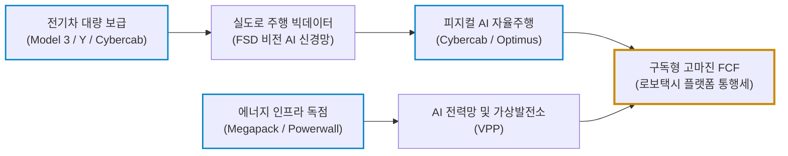
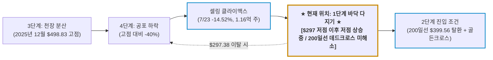

# 테슬라(TSLA) 실전 재무 및 독점 가치 분석 보고서

- **작성일**: 2026-09-06
- **데이터 기준**: 2026 회계연도 2분기(2026년 6월 마감) 실적, 최근 3개월 핵심 뉴스(2026.06~09) 및 yfinance 시장 데이터 (2026-09-06 기준)

단순한 전기차 조립업체라는 낡은 프레임에 갇혀 분기 EPS 미스에 벌벌 떠는 대중의 무지를 비웃어라. 기가팩토리의 압도적 제조 원가 혁신과 에너지 저장(Megapack)·물리적 AI(FSD, Cybercab, Optimus) 생태계로 전 세계를 락인하는 테슬라(TSLA)의 비즈니스 실체와 냉혹한 투자 가치를 숫자로 증명한다.

## 핵심 요약

| 구분 | 핵심 요약 |
| :--- | :--- |
| **종목 및 주가** | 테슬라 (Tesla, Inc., NASDAQ: `TSLA`) / **$354.08** (52주 범위: $297.38 ~ $498.83) |
| **최종 투자의견** | **조건부 분할 매수 (Buy on Dip)** / 4단계 하락을 끝낸 1단계 바닥 다지기 구간, 200일선 탈환 확인 전까지 분할 저격만 (투자 가치 점수 **80.5점**, 6.1절) |
| **비즈니스 본질** | 독보적 제조 원가 절감 해자 + 자율주행 주행 데이터 락인 + 폭발적 마진의 에너지 저장(Megapack) 생태계 |
| **핵심 매력 (Bull)** | 상반기 사상 최대 매출 506억$ 돌파, 2분기 기준 역대 최고 인도량(약 48만 대), 에너지 부문 YoY +40% 폭증, 로보택시(Cybercab) 상용화 기대 |
| **핵심 리스크 (Bear)** | 공격적 가격 인하 및 R&D/Capex 폭증에 따른 2분기 EPS 쇼크($0.33 vs 컨센서스 $0.54), 7월 -14.5% 폭락 후 데드크로스 미해소, 중국 BYD 저가 공세, 높은 밸류에이션 부담 |
| **포트폴리오 성격** | 미래 피지컬 AI·에너지 패러다임 주도주(베타 1.85) / **단기 실적 변동성을 견디지 못하는 자는 매수 금지** |

---

## 1. 비즈니스 실체: 전기차 껍데기를 쓴 AI·에너지 독점 빨대

대중과 제도권 언론은 테슬라를 단순히 자동차를 만들어 파는 완성차 조립업체(OEM)의 잣대로 바라본다. 그러니 가격 할인에 따른 마진 하락이나 보조금 축소 소식이 들릴 때마다 회사가 망하기라도 할 것처럼 호들갑을 떤다.

하지만 테슬라 비즈니스의 실체는 자동차 조립에 머물지 않는다. 테슬라는 **전기차(하드웨어 단말기) 대량 보급을 통해 방대한 실도로 데이터를 빨아들이고, 이를 자율주행 AI 소프트웨어(FSD)와 로보택시(Cybercab), 휴머노이드 로봇(Optimus)으로 연결하는 피지컬 AI 기업이자 분산형 에너지 제국**이다.

### 1.1 3대 핵심 사업 축의 상호작용

- **① 전기차 대량 양산 (Model 3, Model Y 등)**:
    - 전 세계 도로를 달리는 수백만 대의 차량은 단순한 이동 수단이 아니다.
    - 테슬라의 AI 모델을 학습시킬 고화질 영상과 실도로 주행 데이터를 매일 수억 마일씩 빨아들이는 거대한 '움직이는 센서 단말기'다.
- **② 에너지 저장장치 (Megapack, Powerwall)**:
    - 전기차 성장세가 둔화되는 동안 테슬라의 새로운 성장 엔진으로 우뚝 선 핵심 캐시카우다.
    - AI 데이터센터 증설과 신재생에너지 그리드 전환에 필수적인 산업용 대용량 ESS(Megapack) 부문이 분기마다 40% 이상 가파르게 성장하며 전체 마진을 방어한다.
- **③ 피지컬 AI 및 자율주행 생태계 (FSD, Cybercab, Optimus)**:
    - 완전자율주행(FSD) 소프트웨어 구독과 무인 로보택시(Cybercab) 네트워크를 통해 소프트웨어 플랫폼에 준하는 고마진 통행세를 징수한다.
    - 나아가 제조 라인과 서비스 현장에 투입될 휴머노이드 로봇 옵티머스(Optimus)는 물리적 세계의 노동 비용을 파괴할 테슬라의 최종 종착지다.

### 1.2 테슬라의 데이터·에너지 선순환 생태계

---

## 2. 최근 3개월 핵심 뉴스 및 실적 흐름 심층 분석 (2026년 6월 ~ 9월)

### 2.1 최근 3개월 핵심 뉴스 타임라인 (팩트 vs 노이즈)

2026년 6월부터 9월까지 쏟아진 34건의 핵심 뉴스 흐름은 테슬라가 단순 전기차 제조사에서 **'피지컬 AI(자율주행·로보택시·반도체)와 대용량 에너지 인프라 독점 기업'**으로 진화하는 거대한 체질 전환의 변곡점을 명확히 보여준다.

| 일자 | 주요 뉴스 및 시장 이벤트 | 영향도 | 스마트머니 관점의 핵심 분석 및 시사점 |
| :--- | :--- | :---: | :--- |
| **09.04** | **오스틴 사이버캡(Cybercab) 실물 공개, 당일 주가 -5.9% 급락** | `🟡 재료 소멸` | 운전대와 페달이 완전히 제거된 2인승 전용 무인 로보택시 실물 전격 공개. 텍사스 자율주행 등록 차량 약 420대 중 사이버캡 45대 확인. 전날(09.03) 기대감으로 +5.4% 급등($376.37)했다가 행사 당일 양산 일정 미공개에 실망 매물이 쏟아지며 $354.08(-5.92%, 거래량 6,483만)로 되밀린 전형적 '소문에 사고 뉴스에 파는' 패턴 |
| **09.02** | **웨이모(14개 도시·주 50만회) & 죽스(12곳) 美 로보택시 급확대** | `🟡 경쟁 심화` | 웨이모 샌디에이고·덴버 유료 운행 및 죽스 시험 운행 진출. 라이다 기반 고비용 연합군에 맞선 테슬라 비전 AI 및 사이버캡의 대량 양산 단가 파괴 시험대 |
| **08.25** | **사이버트럭 AWD 2개 트림 각 $5,000 기습 인상 (최상위와의 격차 $5,000씩 축소)** | `🟡 구조적 대응` | 듀얼모터 AWD 및 프리미엄 AWD 가격 인상 단행, 최상위 사이버비스트(Cyberbeast)는 동결. 1~5월 누적 등록 7,133대 부진 속에서도 원가 상승을 고객에게 전가하는 트림 간 마진 믹스 최적화 |
| **08.25** | **태양광 지붕(Solar Roof) 판매 중단 및 범용 패널·텍사스 공장 집중** | `🟢 구조조정` | 2016년 솔라시티 인수 후 목표(주 1,000건) 미달 타일 사업 전격 정리. 범용 패널과 텍사스 101억 달러 태양광 셀 공장으로 자본을 재배치하는 영리한 가지치기 단행 |
| **08.24** | **중국 내 모델3·모델Y 등 약 298만 대 자발적 리콜** | `🔴 노이즈` | 비상 도어 손잡이 식별 안전 문제로 올해 중국 최대 규모 리콜 발생. 물리적 부품 교체가 아닌 소프트웨어 OTA 업데이트 및 경고 부착으로 즉각 해결 가능한 전형적 단기 노이즈 |
| **08.19** | **스웨덴 아인라이드, 테슬라 세미(Semi) 트럭 500대 전격 도입 발표** | `🟢 호재` | 유럽 친환경 물류 운송망에 향후 2년간 테슬라 세미 500대 순차 배치 확정. 상용차 전동화 및 물류 생태계 침투 본격화 |
| **08.18** | **국채금리 급등 속 사이버캡 8월 운행 개시 기대감 교차** | `🔴 매크로` | 미 국채금리 발작으로 메모리·반도체주 폭락(-4~5%) 국면에서 사이버캡 상용화 기대감 반영되며 상대적 낙폭 제한(종가 $336.87, -0.7%) |
| **08.06** | **텍사스에 168억 달러 규모 자체 반도체 팹 'Terafab' 건설 공식 발표** | `🟢 메가 호재` | Grimes 카운티에 초대형 팹 신설. 테슬라 전기차·로봇, 스페이스X 위성, xAI 데이터센터용 AI 칩 자체 조달. AMAT·ASML·LRCX 장비 발주 완료 |
| **08.06** | **스페이스X, AI 데이터센터 전력 확보 위해 테슬라 메가팩 2.95억$ 구매** | `🟢 팩트` | 머스크 생태계 간 내부 결합 증명. AI 컴퓨팅 폭증에 따른 대용량 에너지 저장장치(ESS) 수요 폭발이 테슬라 에너지 부문 초고속 성장의 확고한 실적으로 직결 |
| **08.06** | **아마존 죽스, 라스베이거스 유료 로보택시 서비스 공식 개시** | `🟡 경쟁 심화` | 일반 승객 대상 완전 무인 차량 호출 상업화로 미국 자율주행 삼국지(웨이모·죽스·테슬라) 격돌 개막 |
| **08.06** | **BofA, 머스크 "스페이스X 엔비디아 GPU 우선" 발언 속 AMD 저평가 진단** | `🟡 기술 센티` | 머스크의 AI 가속기 선별 발언으로 기술 하드웨어 시장 내 테슬라·머스크 진영의 막강한 업계 영향력 재확인 |
| **08.04** | **스페이스X 공매도 잔액, 테슬라 추월** | `🔴 노이즈` | 보호예수 해제와 단기 변동성을 우려한 투기적 숏 세력이 스페이스X로 이동하며 테슬라 본주에 대한 공매도 수급 압박 상대적 완화 |
| **08.03** | **알리바바 Qwen AI, 중국 테슬라 차량 인포테인먼트 탑재 테스트** | `🟢 호재` | 중국 현지 음성 AI 비서·차량 제어 기술 탑재를 통해 중국 시장 사용자 경험 극대화 및 현지 맞춤형 소프트웨어 경쟁력 강화 |
| **08.03** | **머스크, "테슬라 중국 사업 매각설은 터무니없는 가짜뉴스" 전면 일축** | `🟢 팩트` | 상하이 공장은 전체 생산의 50% 이상을 담당하며 중국은 매출의 20% 이상을 창출하는 핵심 축임을 재확인. 찌라시 노이즈 즉각 진화 |
| **08.03** | **머스크, 테슬라·스페이스X 합병 가능성 공식 일축** | `🟢 팩트` | "각자의 독립적인 전략과 경영 구조 유지, 기술 협력에 집중" 선언. 합병 기대감으로 형성된 단기 투기성 거품을 걷어내고 본업 실력 평가로 복귀 |
| **07.31** | **아마존 죽스, 무인 차량 호출 관련 美 규제 승인 획득** | `🟡 규제 완화` | 미국 규제당국의 완전 자율주행 차량 호출 승인 가속화로 테슬라 사이버캡의 규제 통과 환경에도 우호적 선례 마련 |
| **07.29** | **RBC 캐피털, "궤도에서 지상까지 수직계열화... 1조 달러 비용 절감"** | `🟢 스마트머니` | 테슬라-스페이스X 결합 시 자율주행·로봇·우주 연결성 독점 및 테라팹 시너지로 2050년까지 1조 달러 이상 원가 절감 가능 평가 (목표가 $480) |
| **07.27** | **마이클 버리, 테슬라·캐터필러 공매도로 7월 급락 적중** | `🔴 노이즈` | 빅쇼트 마이클 버리가 AI 밸류에이션 거품을 경고하며 단기 하락 베팅 성공. 단기 가격 차익 플레이였을 뿐 펀더멘털 훼손은 전무 |
| **07.23** | **★ 2분기 실적 발표 직후 -14.52% 대폭락 (종가 $319.69, 거래량 1억 1,560만 주) ★** | `🔴 어닝 쇼크` | 7월 22일 장 마감 후 2분기 EPS $0.33(컨센서스 $0.54, -39.15%) 발표. 1년 전체를 통틀어 최대 낙폭이자 최대 거래량을 동반한 투매. 6영업일 뒤인 7월 29일 장중 $297.38로 52주 최저가 경신하며 4단계 하락의 바닥을 확인 |
| **07.23** | **테슬라, 마이크론(MU)으로부터 장기 메모리 공급권 확보 공식 확인** | `🟢 호재` | AI 메모리 쇼티지 속에서 수년간의 핵심 물량을 합리적 조건에 독점 계약. Terafab 구축을 위한 글로벌 핵심 반도체 장비 발주 공식 완료 |
| **07.20** | **독일 기가팩토리 생산량 주간 7,500대 증설 (연 37.5만 대, +20%)** | `🟢 팩트` | 유럽 모델Y 수요 반등에 대응해 베를린 공장 설비 20% 확장 및 3,500명 인력 증원 발표. 글로벌 전기차 다운턴 속에서도 압도적 증설 감행 |
| **07.06** | **테슬라 로보택시, 오스틴 이어 플로리다 마이애미 서비스 전격 개시** | `🟢 사업 확장` | 텍사스 오스틴 상업 운행에 이어 미 남동부 마이애미로 자율주행 서비스 지역 공식 확장. 상용 로보택시 거점 단계적 확대 가시화 |
| **07.02** | **★ 2분기 차량 480,126대 인도 (컨센서스 40.6만 대 대폭 상회), 그러나 주가 -7.49% ★** | `🟡 호재 vs 수급` | 전년 동기(38.4만 대) 대비 **+25% 폭증**하며 월가 전망치를 7.4만 대 초과 달성. 생산량 451,758대, **에너지 저장(ESS) 13.5GWh 설치로 컨센서스(13.3GWh) 동반 상회**. 그럼에도 당일 주가는 $393.45(-7.49%, 거래량 7,372만)로 급락. 시장이 인도량 자체보다 대규모 할인으로 밀어낸 물량의 마진 훼손을 먼저 계산했다는 신호 |
| **06.29** | **머스크, 1.5조 파라미터 'Grok 4.5' 비공개 테스트를 테슬라에 우선 적용** | `🟢 기술 진보` | V9 기반 차세대 AI 모델을 테슬라와 스페이스X 실무 업무 환경에 우선 투입해 비전 및 자율주행 소프트웨어 고도화 가속 |
| **06.29** | **테슬라, 2023년 FSD 보행자 사고 소송 비공개 합의 종결** | `🟢 리스크 해소` | 모델Y FSD 사고 관련 법적 분쟁을 원만히 합의 종결하며 자율주행 상용화 확대를 가로막던 핵심 사법 리스크 해소 |
| **06.24** | **선런(Sunrun)-테슬라, 16GWh 규모 유연 전력망 협력 발표 (선런 주가 +23%)** | `🟢 메가 호재` | 주택용 ESS 16GWh를 하나로 묶어 버지니아 AI 데이터센터에 순시 출력 300MW를 직접 공급. 2030년 500MW 이상 공급 목표 제시로 가상발전소(VPP) 비즈니스 본격 태동 |
| **06.24** | **베어드, "스페이스X 결합 및 옵티머스·로보택시 촉매" (목표가 $522)** | `🟢 스마트머니` | 2분기 인도량을 보수적인 39.3만 대로 잡고도 목표가를 올렸고, 실제 인도량은 이를 크게 웃돌았다. 옵티머스 업데이트 및 유럽 FSD 확대, 세미 출시 등을 핵심 주가 상승 촉매로 제시 |
| **06.22** | **제프리스, "스페이스X 프록시 투자 인식은 테슬라의 리스크" (목표가 $375)** | `🔴 노이즈` | 로보택시와 옵티머스의 이익 창출에 시간이 필요하다는 이유로 밸류에이션 하향. 장기 소프트웨어 현금흐름의 본질을 외면한 보수적 시각 |
| **06.17** | **경쟁사 리비안(RIVN), R2 인도 직후 2% 인력 감축 단행** | `🟢 경쟁 우위` | 신차 출시 직후에도 적자를 견디지 못하고 구조조정에 내몰린 경쟁사들의 비참한 현실. 테슬라의 독보적인 흑자 원가 구조와 극명한 대조 |
| **06.17** | **골드만삭스, 유럽 판매 개선 반영해 2분기 인도량 42만 대로 상향** | `🟢 호재` | 4~5월 부진 우려를 딛고 6월 급격한 회복세를 포착하며 실적 턴어라운드 사전 경고 |
| **06.12** | **예측시장 칼시(Kalshi), 테슬라-스페이스X 합병 확률 51% 베팅** | `🟡 시장 센티` | 트레이더 과반이 2027년 5월 전 합병을 점치며 거대한 머스크 생태계의 결합 프리미엄을 주가에 선반영 |
| **06.11** | **벨기에 플랑드르 정부, 테슬라 FSD Supervised 공식 승인** | `🟢 규제 완화` | EU 내 4개국에 이어 벨기에까지 운전자 주의 단계 FSD 승인 완료. 유럽 대륙 내 자율주행 규제 빗장이 본격적으로 풀리기 시작 |
| **06.10** | **오스틴 로보택시 운행 59대 제한 및 대기 시간 불만 언론 노이즈** | `🔴 노이즈` | CFRA 등 비관론자들의 사업 확장 지연 비판. 그러나 이는 9월 4일 전용 사이버캡 45대 실물 공개 및 대량 양산 전환을 위한 철저한 테스트 과정으로 판명 |
| **06.05** | **★ JP모건, 목표주가 $145 &rarr; $475 대폭 상향 (+228% 수직 상향) ★** | `🟢 스마트머니` | "테슬라는 하드웨어와 소프트웨어가 수직 통합된 피지컬 AI 절대강자. Optimus 휴머노이드 로봇의 2040년 글로벌 TAM은 3,000만 대에 달할 것"이라며 투자의견 중립 상향 |

---

### 2.2 뉴스 흐름으로 본 4대 핵심 구조적 변화와 스마트머니의 의도

지난 3개월간 쏟아진 뉴스들을 엮어보면, 시장이 단순한 전기차 인도대수 숫자에 울고 웃는 동안 진짜 거대 자본이 주목한 **4대 구조적 변화**가 선명히 드러난다.

- **① 피지컬 AI 수직계열화의 완성: 168억 달러 'Terafab'과 독자 반도체·소프트웨어 동맹**:
    - 6월 5일 JP모건이 목표주가를 $145에서 $475로 무려 228% 수직 상향한 핵심 근거는 단순 전기차가 아니라 '피지컬 AI의 수직 통합'이었다.
    - 테슬라는 AI 반도체를 외부 파운드리에 마냥 맡겨두지 않는다. 8월 6일 텍사스 그라임스 카운티에 168억 달러 규모의 자체 반도체 팹 **'Terafab'** 신설을 전격 발표했다. 마이크론(MU)으로부터 다년간의 메모리 공급권을 확정 짓고 전공정 장비 발주를 마쳤다.
    - 여기에 1조 5,000억 개 파라미터의 xAI **Grok 4.5**를 테슬라 실무에 직접 통합하고 중국 알리바바 Qwen과 현지 AI 테스트를 병행하고 있다. 전 세계에서 유일하게 **자체 칩 생산(Terafab) + 거대 AI 신경망(Grok) + 데이터 수집 단말(수백만 대 EV) + 물리적 구동체(사이버캡·옵티머스)**를 모두 소유한 유일무이한 피지컬 AI 제국을 구축하고 있다.
- **② AI 데이터센터의 전력 갈증을 삼키는 메가팩(Megapack)과 16GWh 그리드 독점**:
    - 대중이 전기차 판매량만 쳐다보고 있을 때, 테슬라의 진짜 고마진 현금 창출력은 에너지 부문에서 폭발했다. 2분기 에너지 저장장치(ESS) 설치량은 **13.5GWh**로 시장 컨센서스(13.3GWh)와 전년 동기(9.6GWh)를 완전히 압도했다.
    - 스페이스X조차 AI 데이터센터 전력망을 구축하기 위해 테슬라 메가팩 2억 9,500만 달러어치를 쓸어 담았고, 선런(Sunrun)과는 **16GWh 유연 전력망 협력**을 체결해 버지니아 AI 데이터센터에 300MW 전력을 직접 공급하기 시작했다.
    - 마진이 나오지 않는 지붕 타일(솔라루프)은 단호히 폐기하고, 텍사스 101억 달러 태양광 셀 공장과 메가팩으로 자원을 집중했다. 테슬라는 이미 전 세계 AI 데이터센터의 숨통을 쥐고 있는 '전력 인프라 독점 공급자'다.
- **③ 사이버캡(Cybercab) 실물 공개와 로보택시 패권 삼국지 (vs 웨이모·죽스)**:
    - 알파벳 웨이모가 14개 도시에서 주 50만 회 운행을 달성하고 아마존 죽스가 라스베이거스에서 유료 운행을 개시하며 턱밑까지 추격해 왔다. 6월 오스틴 59대 운행 노이즈를 틈타 CFRA 등 제도권 언론은 테슬라의 사업 지연을 비웃었다.
    - 그러나 테슬라는 7월 마이애미 확장, 유럽 벨기에 FSD Supervised 승인, 2023년 FSD 보행자 사고 소송 합의로 규제·사법 족쇄를 풀었다. 그리고 9월 4일 오스틴에서 **운전대와 페달이 아예 없는 2인승 전용 로보택시 '사이버캡(Cybercab)' 실물 45대를 전격 공개**했다. 이미 텍사스에만 420대의 자율주행 차량이 등록되어 있다.
    - 대당 1억 원을 훌쩍 넘는 고가 라이다를 주렁주렁 매단 웨이모와 달리, 저비용 카메라 비전 AI와 대량 양산 전용 바디로 무장한 사이버캡은 로보택시의 원가를 극단적으로 파괴할 수 있는 유일한 대량 보급 무기다.
- **④ 버리의 숏과 합병 노이즈를 짓밟은 본업의 압도적 체급 차이**:
    - 7월 23일 2분기 실적 발표 직후 주가는 하루에만 -14.52%(거래량 1억 1,560만 주) 무너졌고, 마이클 버리는 AI 거품론을 외치며 이 폭락에 올라타 단기 하락 수익을 챙겼다. 시장은 칼시 51% 합병 베팅과 RBC의 '1조 달러 비용 절감' 보고서에 취해 테슬라를 단순 스페이스X 프록시로 거래하려 했다.
    - 머스크는 "중국 매각설은 가짜뉴스이며 스페이스X와의 경영 합병은 없다"고 선을 그으며 투기적 거품을 걷어냈다.
    - 그사이 테슬라는 2분기 **48만 126대 인도(월가 전망 40.6만 대 압도, YoY +25%)**와 베를린 기가팩토리 주간 7,500대 증설(연 37.5만 대)을 발표했다. 신차를 내놓고도 감원을 단행한 리비안 등 후발 주자들과의 체급 차이를 완전히 벌려 놓았다. 사이버트럭 가격을 5,000달러 기습 인상한 것 역시 생산 원가 상승을 고객에게 전가할 수 있는 독점적 가격 결정권이 살아있음을 입증한다.

---

### 2.3 2026년 상반기 실적 팩트 체크와 2분기 EPS 쇼크의 진실

2026년 상반기 실적 발표는 테슬라의 압도적인 외형 성장과 단기 비용 지출 사이의 괴리를 극명하게 드러냈다.

- **상반기 총매출 사상 최초 500억 달러(약 506억 달러) 돌파**:
    - 글로벌 가격 경쟁 심화와 전기차 보조금 축소라는 악조건 속에서도, 테슬라는 2026년 상반기 기준 누적 매출 약 506억 달러(1분기 223.9억 달러 + 2분기 282.4억 달러)를 기록하며 사상 최대 외형 성장을 달성했다.
- **2분기 차량 인도량 48만 대(480,126대) 역대 2분기 최고치 달성**:
    - 월가 컨센서스(40.6만 대)와 골드만삭스 등 낙관적 IB 전망치(41만~42만 대)를 가볍게 따돌리고 48만 126대를 인도하며 전년 동기(38.4만 대) 대비 **+25% 급증**했다. 2분기 생산량 또한 45만 1,758대를 기록했다.
- **에너지 저장장치(Megapack) 폭풍 성장 (13.5GWh 설치)**:
    - 2분기 중 13.5GWh의 에너지 저장장치를 설치하여 시장 컨센서스(13.3GWh)와 전년 동기(9.6GWh, **+40.6% 폭증**)를 완전히 압도했다. 전력 인프라 쇼티지의 수혜가 현금으로 찍히고 있다.

#### 2분기 EPS 쇼크의 원인과 시장의 착시

반면 시장을 충격에 빠뜨린 숫자는 주당순이익(EPS)이었다. 컨센서스 비교 기준 2분기 EPS는 0.33달러에 그쳐, 월가 컨센서스 0.54달러를 -39.15% 밑도는 어닝 쇼크를 기록했다. 발표 다음 날인 7월 23일 주가는 하루 만에 -14.52% 폭락했고, 6영업일 뒤 52주 최저가 $297.38까지 밀렸다.

단기 실적주의자들은 마진이 무너졌다며 비명을 질렀지만, 손익계산서를 한 줄씩 뜯어보면 이야기가 완전히 달라진다.

| 시장이 보고 놀란 것 (착시) | 데이터가 말해주는 진실 (팩트) |
| :--- | :--- |
| **2분기 EPS 쇼크 ($0.33 vs 컨센서스 $0.54)** | 회사의 펀더멘털이 망가진 것이 아니다. 2분기 R&D 지출은 19.5억 달러에서 **23.7억 달러로 4.3억 달러(+21.8%) 폭증**했고, 영업이익은 9.4억 달러에서 4.0억 달러로 5.4억 달러 줄었다. 영업이익 감소분의 대부분이 R&D 증액 하나로 설명된다. 168억 달러 규모의 자체 반도체 팹 Terafab 투자, 마이크론 메모리 장기 조달 및 장비 발주, 사이버캡 양산 라인 준비를 선제적으로 폭발 집행한 결과지 장사를 못해서 생긴 구멍이 아니다. |
| **"이익이 반토막 났다"는 공포** | 정반대다. **GAAP 순이익은 1분기 4.77억 달러에서 2분기 11.14억 달러로 134% 급증**했고, GAAP 희석 EPS도 $0.13에서 $0.32로 뛰었다. 컨센서스와 비교하는 조정 EPS만 $0.41에서 $0.33으로 내려갔을 뿐이다. 매출총이익도 47.2억 달러에서 47.5억 달러로 방어했다. 대중은 헤드라인 숫자 하나만 보고 팔았고, 실제 회사가 벌어들인 현금은 오히려 두 배 넘게 늘었다. |
| **가격 인하로 인한 자동차 마진 둔화** | 공격적인 가격 인하는 경쟁사(리비안 등)를 적자의 늪과 감원으로 몰아넣고 시장 점유율을 지키기 위한 전략적 포석이다. 상반기 506억 달러 매출과 2분기 48만 대 인도량(+25%)으로 압도적 체급 차이를 증명했다. 원가 부담이 있는 사이버트럭은 5,000달러 가격을 올릴 만큼 가격 결정권도 보유했다. |
| **단기 수익성 압박 공포** | 분기 13.5GWh를 쏟아내며 전년비 40% 이상 폭증하는 메가팩(Megapack) 에너지 저장 부문과 스페이스X·선런향 대규모 전력망 공급이 고마진 캐시카우로 자리 잡아 자동차 부문의 단기 마진 압박을 구조적으로 완충하고 있다. |
| **사이버캡 공개 후 주가 변동성 확대** | 9월 3일 기대감으로 +5.42% 급등($376.37)한 뒤 행사 당일인 9월 4일 -5.92%($354.08) 되밀렸다. 재료 소멸에 따른 차익 실현이지 사업의 훼손이 아니다. 마이클 버리의 숏 포지션과 스마트머니(JP모건 목표가 $475, 베어드 $522) 간의 손바뀜이 격렬하게 일어나는 구간이다. |

---

### 2.4 [스페셜 딥다이브] 사이버캡(Cybercab) 끝장 해부: 주가 폭등의 기폭제인가, 선반영된 설거지인가?

9월 4일 오스틴에서 운전대와 페달이 완전히 제거된 2인승 전용 로보택시 **사이버캡(Cybercab)** 실물 45대가 전격 공개되자 시장은 다시 한번 극단적인 환호와 차가운 회의론으로 갈라졌다. 단기 급등에 흥분한 개미들은 "이제 주가가 500달러, 1,000달러로 폭등한다"고 외치고, 비관론자들은 "일정 하나 못 박지 못한 껍데기 쇼"라며 깎아내린다.

냉혹한 숫자로 사이버캡의 본질을 뜯어본다. 이것은 테슬라의 주가를 폭등시킬 진짜 기폭제인가, 아니면 이미 선반영되어 지금 뛰어들면 물리는 전형적인 설거지인가?

#### ① 주가를 폭등시킬 수 있는 3대 파괴적 무기 (The Bull Thesis)

- **마일당 운행 원가(TCO)의 절대적 학살 ($0.20의 충격)**:
    - 현재 우버·리프트의 마일당 운행 비용은 약 $2.00~$3.00 선이며, 알파벳 웨이모는 대당 1억 원이 훌쩍 넘는 고가 라이다(LiDAR)와 센서 타워로 인해 마일당 비용이 $1.50 밑으로 내려가지 못한다.
    - 반면 사이버캡은 고가 센서를 일체 배제하고 순수 비전 카메라와 AI 신경망으로만 구동되며, 차량 제작 원가 자체를 2만 5,000~3만 달러 수준으로 낮췄다. 테슬라가 목표로 하는 **마일당 운행 비용은 $0.20(기존 인간 택시의 1/10 수준)**이다. 기존 모빌리티와 대중교통 생태계를 통째로 파괴할 수 있는 유일한 원가 구조다.
- **일회성 조립 매출총이익률(15~20%) &rarr; 반복적 플랫폼 매출의 매출총이익률(60~70%)로의 퀀텀 점프**:
    - 완성차 조립 판매는 차 한 대를 팔아 15~20%의 매출총이익을 남기면 끝이다. 가격 경쟁이 붙으면 마진이 10% 밑으로 쪼그라든다.
    - 하지만 사이버캡이 테슬라 네트워크(Robotaxi App)에 편입되면, 테슬라는 24시간 굴러가는 무인 택시 운임의 **20~30%를 '플랫폼 수수료'로 떼어간다.** 그렇게 걷은 수수료는 추가 원가가 거의 붙지 않는 소프트웨어 매출이라 매출총이익률이 60~70%까지 올라간다. 떼어가는 비율(20~30%)과 그 돈이 남기는 마진율(60~70%)은 전혀 다른 숫자이며, 하드웨어 제조사가 우버와 구글을 합친 형태의 초고마진 FCF 소프트웨어 기업으로 탈바꿈하는 지점이 바로 여기다.
- **테라팹(Terafab)과 엔드-투-엔드 반도체 수직계열화 결합**:
    - 웨이모나 죽스는 완성차 OEM(지리, 현대 등)과 외부 AI 칩(엔비디아)에 의존하지만, 테슬라는 텍사스 168억 달러 Terafab에서 자체 생산할 자율주행 칩과 Grok 4.5 신경망, 사이버캡 전용 바디를 100% 수직 통합했다. 경쟁사가 원가와 공급망에서 테슬라를 따라잡는 것은 물리적으로 불가능하다.

#### ② 지금 당장 뛰어들면 계좌가 터지는 3대 현실적 함정 (The Bear & Reality Check)

- **첫째, "판매 개시 시점 미공개"가 의미하는 치명적인 가이던스 공백**:
    - 행사 전날인 9월 3일 주가는 기대감만으로 +5.42% 급등해 $376.37까지 치솟았다. 그러나 실물 45대 공개라는 화려한 쇼 뒤에 남겨진 진짜 팩트는 **"구체적인 상용 판매 및 대량 양산 시점이 여전히 공개되지 않았다"**는 점이었고, 행사 당일 주가는 -5.92% 되밀려 $354.08로 마감했다.
    - 과거 사이버트럭(공개 후 양산까지 4년 소요), 로드스터(무기한 연기), 세미(발표 후 7년째 소량 배치)의 역사를 떠올려라. 머스크의 타임라인은 언제나 현실보다 2~3년 앞서나간다. 당장 2026~2027년 실적에 사이버캡 매출이 유의미하게 찍힐 가능성은 0%에 가깝다.
- **둘째, 미국 연방 규제(FMVSS)와 법적 빗장이라는 거대한 장벽**:
    - 운전대와 페달이 아예 없는 차량은 일반 도로를 합법적으로 달릴 수 없다. 미국 도로교통안전국(NHTSA)의 연방자동차안전기준(FMVSS) 면제 승인과 각 주(State)별 상업 무인 운행 허가를 통과해야 한다.
    - 웨이모는 기존 양산차(아이오닉5, 재규어) 기반으로 14개 도시 주 50만 회 유료 운행이라는 규제 트랙레코드를 쌓아두었지만, 테슬라 사이버캡은 이제 텍사스에 45대를 등록하고 시험 운행을 시작한 초기 단계다. 규제 당국과의 줄다리기는 단기간에 끝나지 않는다.
- **셋째, 현금흐름 밸리(Valley of Death): 실적 찍히기 전까지는 Capex 폭탄만 남는다**:
    - 사이버캡 전용 양산 라인 설비 투자, 168억 달러 규모의 Terafab 반도체 팹 건설, 마이크론 메모리 매입 등은 모두 **현재 테슬라의 잉여현금흐름(FCF)과 분기 EPS를 갉아먹는 막대한 비용**이다.
    - 2분기 EPS 쇼크($0.33)가 보여주듯, 사이버캡이 진짜 고마진 현금을 벌어오기 전까지 향후 4~6개 분기 동안 시장은 실적 발표 때마다 "마진 둔화"를 빌미로 주가를 후려칠 것이다.

#### ③ 스마트머니의 냉혹한 판정: "지금 그 재료 보고 들어가면 늦었는가?"

| 쟁점 질문 | 냉혹한 팩트 진단 및 스마트머니의 판정 |
| :--- | :--- |
| **Q1. 이미 주가에 다 선반영되었는가?** | **단기적으로는 70~80% 선반영, 장기적으로는 10%도 반영되지 않았다.** 행사 전날 +5.42% 급등으로 단기 이벤트 모멘텀은 가격에 상당 부분 녹아들었고, 행사 당일 '구체적 일정 미공개'에 실망 매물이 쏟아지며 -5.92% 되밀렸다. 전형적인 **'소문에 사고 뉴스에 팔아라(Sell the News)'**가 이미 하루 만에 그대로 재현된 셈이다. 그러나 사이버캡이 가져올 2028년 이후의 모빌리티 수수료 독점 가치는 현재 주가에 거의 반영되어 있지 않다. |
| **Q2. 지금 행사 재료 하나 보고 추격 매수해도 되는가?** | **절대 안 된다. 지금 행사 보고 흥분해서 불나방처럼 달려드는 것은 하수 중의 하수다.** 주가는 200일선($399.56)과 50일선($357.95) **아래에 갇혀 있고, 50일선이 200일선을 밑도는 데드크로스 상태**다. 위로는 전고점($498.83)의 악성 물림 매물이 버티고 있고, 아래로는 2분기 어닝 쇼크의 실적 후폭풍이 도사리고 있다. 사이버캡 재료만 믿고 몰빵하면 다음 실적 시즌에 피눈물을 흘린다. |
| **Q3. 그렇다면 언제, 어떤 가격대에 들어가야 하는가?** | **행사 거품이 마저 빠지고 실망 매물이 쏟아질 때를 노려라.** 9월 4일 하루에 이미 $376에서 $354까지 밀렸다. 여기서 언론이 "구체적 양산 일정 부재", "규제 통과 불확실성", "웨이모에 뒤처진 로보택시" 따위의 비관론을 얹으며 주가가 **$330~$350 지지선**까지 마저 밀려 내려올 때, 그때가 비로소 스마트머니가 바닥에서 사이버캡의 독점적 원가 파괴력을 헐값에 주워 담는 진짜 진입 타점이다. |

---

## 3. 경쟁 해자 및 피어 그룹 잔혹 비교

테슬라의 경쟁력을 논할 때 빠지지 않는 위협이 중국 BYD의 저가 공세와 레거시 완성차 업체들의 추격이다. 그러나 이들의 사업 구조를 뜯어보면 테슬라의 독점적 해자를 넘어서기에는 구조적 한계가 뚜렷하다.

### 3.1 테슬라의 3대 독점 해자

- **① 기가캐스팅 기반의 압도적 제조 원가 절감**:
    - 수백 개의 부품을 하나의 거대한 알루미늄 합금으로 찍어내는 기가캐스팅(Giga-casting) 공법과 수직 계열화된 배터리·구동계 공급망은 원가 경쟁력의 절대적 무기다. 가격 전쟁이 벌어져도 테슬라는 흑자를 유지하지만, 레거시 업체들은 파산 위기에 직면한다.
- **② 수십억 마일의 실주행 데이터 해자**:
    - 가상 시뮬레이션이나 수백 대의 테스트 차량에 의존하는 경쟁사들과 달리, 테슬라는 전 세계 수백만 대의 차량에서 매일 쏟아지는 엣지 케이스(Edge Case) 데이터를 기반으로 엔드-투-엔드 신경망 AI를 고도화한다. 이 데이터 격차는 돈으로 단기간에 살 수 없다.
- **③ 에너지·충전 생태계의 수직 결합**:
    - 북미 충전 표준(NACS)을 장악한 슈퍼차저 네트워크와 산업용 메가팩 그리드는 테슬라 고객을 생태계 안에 가두는 강력한 락인 장치다.

### 3.2 글로벌 완성차 피어 그룹 잔혹 비교

| 비교 지표 | 테슬라 (TSLA) | 중국 BYD (1211.HK) | 레거시 OEM (포드 / GM) |
| :--- | :--- | :--- | :--- |
| **기업의 본질** | **피지컬 AI & 분산형 에너지 플랫폼** | 저가 배터리 기반 박리다매 전기차 조립 | 내연기관 기반 레거시 조립업체 |
| **제조 원가 구조** | 기가캐스팅·공정 혁신으로 구조적 원가 절감 | 중국 내 저임금 및 저가 LFP 배터리 수직 계열화 | 복잡한 부품 결합과 높은 노조 비용으로 전기차 만성 적자 |
| **자율주행 기술력** | 자체 개발 FSD (비전 AI 엔드-투-엔드 신경망) | 외부 솔루션 의존형 보조 ADAS 수준 | 자체 소프트웨어 개발 실패, 빅테크에 외주 의존 |
| **에너지 인프라** | **Megapack 수주 폭발 (YoY +40% 성장)** | 단순 ESS 배터리 셀 납품 (단순 가격 경쟁) | 에너지 사업 전무 |
| **재무 건전성** | **보유 현금 435억$ vs 부채 161억$ (순현금 상태)** | 중국 정부 보조금 의존 및 높은 레버리지 | 수백억 달러에 달하는 막대한 레거시 금융 부채 |
| **글로벌 확장성** | 글로벌 프리미엄 브랜드 파워 사수 | 미국·유럽의 높은 관세 장벽에 직면 | 자국 내연기관 규제 유예에만 급급 |

---

## 4. 기술적 사이클 위치 (4단계 사이클 모델)

스탠 와인스타인(Stan Weinstein)의 4단계 시장 사이클 모델로 진단하면, 테슬라의 주가는 **4단계 공포 하락을 7월에 끝내고 1단계 바닥 다지기(Base Building)에 막 진입한 초입**에 있다. 상승 추세 한복판이 아니다. 이 단계 구분을 틀리면 진입 시점 전체가 어긋나므로 감상이 아니라 규칙으로 판정한다.

### 4.1 기술적 위치를 결정하는 4대 지표

| 기준선 | 값 | 현재가($354.08) 대비 | 기술적 판정 및 냉혹한 의미 |
| :--- | :---: | :---: | :--- |
| **52주 최고가** | $498.83 (2025.12) | **-29.0%** | 대세 고점을 찍은 지 이미 9개월. 여기서 아래로 물린 매물이 위쪽 구간 전체를 덮고 있다 |
| **200일 이동평균선** | $399.56 | **-11.4%** | 기울기가 아래로 꺾인 200일선 밑에 주가가 있다. 와인스타인 모델에서 이 조건 하나만으로 2단계 상승은 성립하지 않는다 |
| **50일 이동평균선** | $357.95 | **-1.1%** | **50일선이 200일선을 41달러 밑도는 데드크로스 상태.** 단기선 바로 아래에서 탈환 공방 중 |
| **52주 최저가** | $297.38 (2026.07.29) | **+19.1%** | 불과 5주 전에 찍은 신저점. 오래 검증된 지지선이 아니라 이제 막 만들어진 바닥이다 |

### 4.2 2026년 실제 가격 궤적: "연초 바닥"이라는 착각을 먼저 깨라

| 시점 | 월 종가 (저점 ~ 고점) | 사이클 국면 |
| :--- | :---: | :--- |
| 2025년 12월 | **$489.88** (52주 최고 종가) | 3단계 천장 분산 |
| 2026년 1월 | $430.41 ($416 ~ $452) | 고점권 이탈, 하락 전환 |
| 2026년 3월 | $371.75 ($355 ~ $408) | 4단계 하락 진행 |
| 2026년 4월 | $381.63 (**$343** ~ $401) | 중간 저점 형성 |
| 2026년 5월 | $435.79 ($389 ~ $445) | 반등 시도, 12월 고점 회복 실패 |
| **2026년 7월 23일** | **$319.69 (-14.52%, 거래량 1.16억 주)** | **셀링 클라이맥스** |
| 2026년 7월 29일 | $298.32 (장중 $297.38) | 4단계 저점 확인 |
| 2026년 8월 | $367.95 ($320 ~ $368) | 저점 반등 개시 |
| 2026년 9월 4일 | $354.08 | 1단계 바닥 다지기 |

연초는 바닥이 아니라 $416~452의 고점권이었고, 저점은 연초가 아니라 **7월 말**에 찍혔다. "연초 바닥을 딛고 저점을 높여왔다"는 이야기는 이 데이터 어디에도 없다. 5월에 $445까지 되돌렸지만 2025년 12월 고점 $489.88을 끝내 회복하지 못하고 다시 무너졌다. 2026년은 고점과 저점이 나란히 내려온 하락의 해였고, 7월 실적 폭락이 그 마지막 투매였다.

### 4.3 기술적 흐름 및 수급 분석

- **4단계 하락은 끝난 것으로 본다 (셀링 클라이맥스 확인)**:
    - 7월 22일 장 마감 후 2분기 실적이 발표되자 다음 날 주가는 -14.52% 무너졌다. 이때 거래량 1억 1,560만 주는 1년 전체를 통틀어 최대치다. 대량 거래를 동반한 마지막 급락은 팔 사람이 다 판 셀링 클라이맥스의 전형이다.
    - 7월 29일 $297.38을 찍은 뒤 지금까지 그 저점을 다시 깨지 않았고, 8월 $319 → 9월 $354로 저점을 높이고 있다. **저점이 올라오고 있다는 관찰 자체는 사실이다. 다만 그것은 상승 추세의 증거가 아니라 바닥을 다지는 중이라는 증거다.**
- **그러나 2단계 상승은 아직 시작도 하지 않았다**:
    - 주가는 50일선($357.95)과 200일선($399.56) 아래에 있고, 50일선이 200일선을 41달러나 밑도는 데드크로스가 해소되지 않았다.
    - 200일선 자체의 기울기도 아직 아래를 향한다. 이 상태에서 "상승 2단계"를 선언하고 목돈을 밀어 넣는 것은 모델을 자기 편할 대로 읽는 짓이다.
- **2단계 진입을 확인해줄 4개 신호 (이게 뜨기 전엔 비중을 키우지 마라)**:
    - **① 200일선 $399.56을 종가로 탈환**하고 그 위에서 최소 2~3주 버틸 것
    - **② 200일선 기울기가 아래에서 옆 또는 위로 전환**될 것
    - **③ 50일선이 200일선을 상향 돌파(골든크로스)**할 것
    - **④ 돌파 시 거래량이 평소 대비 뚜렷하게 실릴 것**
- **판정 무효화 조건 (1단계 실패)**:
    - 종가 기준 **$297.38 이탈** 시 바닥 다지기는 실패한 것이며, 사이클은 4단계 하락 재개로 되돌아간다. 이 선이 아래에서 제시하는 모든 매수 논리를 지탱하는 마지막 기둥이다.
- **1단계가 실전에서 뜻하는 것**:
    - 1단계는 크게 버는 자리가 아니라 **싸게 모으는 자리**다. 빠른 수익을 기대하고 들어오면 몇 달간 지루한 횡보에 지쳐 바닥에서 던지게 된다. 추격이 아니라 분할, 속도가 아니라 단가로 접근해야 할 국면이다.

---

## 5. 밸류에이션 및 미래 현금흐름 타당성 검증

현재 테슬라의 주가 $354.08과 시가총액 약 1조 3,985억 달러는 전통 완성차 업체의 PER(5~8배) 잣대로 보면 명백한 고평가처럼 보인다. 선행 PER 164배, 트레일링 PER 321배는 단순한 자동차 판매 마진으로는 결코 정당화할 수 없는 숫자다.

그러나 스마트머니가 테슬라에 프리미엄을 부여하는 이유는 3~5년 뒤 펼쳐질 **고마진 소프트웨어 플랫폼과 에너지 인프라 기업으로의 체질 전환**에 있다.

### 5.1 3대 핵심 밸류에이션 축 분석

- **① 수익성 (Profitability: 단기 압박 후 중장기 V자 반등)**:
    - 단기적으로는 공격적인 가격 인하 정책과 AI 슈퍼클러스터 구축, FSD v13 학습을 위한 Capex 및 R&D 비용 집행으로 인해 **2분기 영업이익률 1.4%**(영업이익 3.98억 달러 / 매출 282.4억 달러)의 빠른 반등은 어렵다.
    - 하지만 자율주행 구독(FSD) 매출 인식이 본격화되고, 마진율이 20%를 상회하는 에너지 저장장치(Megapack)의 매출 비중이 확대되면서 향후 2~3년 내 구조적 수익성 개선이 가시화될 것이다.
- **② 성장성 (Growth: 전기차 안정화 + 에너지 폭발 + 로보택시 옵션)**:
    - 전기차 인도량이 연 200만 대 수준에서 안정적인 캐시카우 기반을 닦는 동안, 연 40% 이상 폭증하는 메가팩 사업부가 외형 성장을 이끈다.
    - 향후 3~5년 내 사이버캡(Cybercab) 로보택시 상용화가 현실화될 경우, 테슬라의 매출 구성은 일회성 차량 판매에서 고마진 마일당 수수료(플랫폼 통행세) 모델로 완전히 탈바꿈한다.
- **③ 재무 건전성 및 현금흐름 (Balance Sheet & Cash Flow: 철옹성 대차대조표)**:
    - 대규모 미래 설비투자로 인해 잉여현금흐름(FCF)은 압박을 받고 있지만, 그래도 **48억 3,600만 달러 흑자**를 유지한다. 영업활동 현금흐름 186억 8,500만 달러에서 Terafab과 사이버캡 양산 라인에 쏟아부은 설비투자를 빼고도 남는 돈이다.
    - 그러나 테슬라의 대차대조표는 **총 현금성 자산 435억 2,400만 달러**를 보유하고 있는 반면, **총 부채는 160억 8,000만 달러**에 불과하다. 순현금(Net Cash)만 274억 달러가 넘는 사실상의 무차입 경영 상태다. 고금리 장기화나 매크로 위기가 닥쳐도 외부 자금 수혈 없이 독자 생존하며 경쟁사를 압살할 체력을 갖추고 있다.

---

## 6. 종합 평가 및 냉혹한 계좌 실행 원칙

### 6.1 6대 핵심 투자 지표 다차원 평가 매트릭스

| 평가 영역 | 가중치 | 평점 (100점 만점) | 가중 점수 | 등급 | 핵심 평가 요약 |
| :--- | :---: | :---: | :---: | :---: | :--- |
| **① 비즈니스 모델 및 해자** | 25% | **92점** | 23.00 | `S` | 제조 원가 절감 독점력, 실주행 빅데이터 및 ESS 생태계 락인 |
| **② 실적 성장성 및 가이던스** | 25% | **85점** | 21.25 | `A` | 상반기 506억$ 돌파, 메가팩 YoY 40% 폭증 및 로보택시 확장성 |
| **③ 재무 건전성 및 현금흐름** | 20% | **88점** | 17.60 | `A+` | 현금 435억$ 순현금 대차대조표, 압도적 위기 방어력 |
| **④ 밸류에이션 매력도** | 15% | **65점** | 9.75 | `C+` | 선행 PER 164배, 2분기 EPS 쇼크에 따른 단기 고평가 부담 |
| **⑤ 기술적 매매 타이밍** | 10% | **50점** | 5.00 | `D` | 4단계 하락 직후 1단계 바닥 다지기 초입, 200일선 아래 데드크로스 미해소 |
| **⑥ 리스크 관리 가능성** | 5% | **78점** | 3.90 | `B+` | 7월 저점 $297.38이라는 명확한 손절 기준선 확보로 하방 통제 가능 |
| **종합 가중치 환산 점수** | **100%** | — | **80.5점** | **`Buy`** | **펀더멘털은 사도 좋으나 타이밍은 아직 이르다. 바닥 다지기 구간의 조건부 분할 매수** |

---

### 6.2 실전 결론: "그래서 지금 어쩌라는 것인가?" (Action Verdict)

#### ① 지금 당장 사야 하는가? ➔ **"사이버캡 이벤트 직후의 추격 매수는 자살행위다. 철저한 눌림목 분할 저격만 허용한다."**
* **이유**: 9월 4일 사이버캡 45대 실물 공개로 단기 기대감은 이미 주가에 70~80% 선반영되었고, 행사 당일 -5.92% 되밀리며 실망 매물이 이미 나오기 시작했다. 더 중요한 것은 사이클 위치다. 주가는 7월 -14.52% 폭락으로 4단계 하락을 끝낸 뒤 **이제 막 바닥을 다지는 1단계 초입**이며, 50일선과 200일선 아래에서 데드크로스를 해소하지 못했다. 바닥을 다지는 자리에서 행사 뉴스 하나 보고 한 번에 목돈을 밀어 넣는 행위는 계좌를 도박판에 던지는 것과 다름없다.
* **지금 할 일**: 단기 급등에 흥분하지 마라. 실망 매물로 주가가 $330~$350 선까지 마저 밀려 내려오는 구간에서만 밴드 하단에 침착하게 분할 매수 그물을 펼치고, 200일선 $399.56 탈환과 골든크로스가 확인되기 전까지는 비중을 키우지 마라.

#### ② 이런 주식은 누가 사고, 누가 절대 사면 안 되는가?
* **❌ 절대 사지 마라 (즉시 퇴장)**: 분기 EPS 수치 0.1달러에 밤잠을 설치는 자, 안정적인 4~5% 배당 수익을 바라는 은퇴 생활자, 베타 1.85의 롤러코스터 변동성에 손이 떨려 뇌동매매할 자.
* **⭕ 반드시 눈독 들이고 주워 담아야 할 사람 (스나이퍼 대기)**: 단순 전기차 조립을 넘어 자율주행 로보택시와 메가팩 에너지 인프라의 3~5년 독점 생태계에 확신을 가진 장기 기술주 투자자, 단기 악재로 인한 주가 폭락을 절호의 바겐세일 기회로 삼을 줄 아는 배짱 있는 승부사.

#### ③ 이 주식으로 '인생 역전(단기 폭등)'을 바라면 안 되는 냉혹한 이유
* 테슬라는 이미 시가총액 1.4조 달러에 달하는 초대형 메가캡 공룡이다. 2020년과 같은 10배 폭등은 수학적으로 불가능하며, 높은 밸류에이션 부담으로 인해 실적 발표 시즌마다 혹독한 주가 조정의 매를 맞아야 한다. 고수익을 원한다면 인내심을 갖고 긴 호흡의 복리 수익률로 접근해야 한다.

---

### 6.3 실전 가격대별 실행 시나리오 및 분할 매수 로드맵

| 구분 | 실행 조건 | 배정 비중 | 가격 기준 | 대응 방침 |
| :--- | :--- | :---: | :---: | :--- |
| **1차 진입 (선발대)** | 7월 저점($297.38) 미이탈 확인 후 밴드 하단 지지 | 25% | $330 ~ $350 | 바닥 다지기 구간의 정찰대 구축 (추격 금지) |
| **2차 매수 (주력)** | 50일선($358) 종가 탈환 및 거래량 동반 양봉 | 35% | $355 ~ $375 | 바닥 이탈 위험 축소 확인 후 핵심 비중 확대 |
| **3차 매수 (2단계 확인)** | **200일선($399.56) 탈환 + 골든크로스 성립** | 25% | $400 돌파 안착 시 | 1단계 졸업과 2단계 진입이 확인된 뒤에만 불타기 |
| **예비 현금** | 매크로 금리 발작 및 단기 $300 위협 버퍼 | 15% | — | 저점 재이탈 시 패닉 바겐세일 줍기용 현금 보존 |
| **손절 기준선** | **1단계 바닥 다지기 실패 = 4단계 하락 재개** | — | $295 종가 이탈 시 | 미련 없이 비중 대폭 축소 및 리스크 관리 |

!!! tip "최종 핵심 제언 (Executive Takeaway)"
    대중은 테슬라의 2분기 EPS가 예상치보다 0.21달러 덜 나왔다며 공포에 질려 하루 만에 1억 1,560만 주를 내던졌다. 정작 같은 분기 GAAP 순이익은 4.77억 달러에서 11.14억 달러로 두 배 넘게 늘었다. 스마트머니는 헤드라인 EPS가 아니라 상반기 사상 최대 506억 달러 매출과 40%씩 폭증하는 메가팩 에너지 저장 사업, 그리고 테슬라가 전 세계에 깔아놓은 수백만 대의 바퀴 달린 로봇 단말기를 본다.

    다만 좋은 기업과 좋은 매수 시점은 전혀 다른 문제다. 지금 이 자리는 4단계 하락을 겨우 끝내고 바닥을 다지는 1단계이지 상승의 한복판이 아니다. 단기 실적 변동성의 파도를 견뎌낼 배짱이 없다면 애초에 테슬라를 쳐다보지도 마라. 그러나 피지컬 AI와 분산 에너지라는 거대한 고속도로의 수수료를 징수할 최종 승자에게 베팅하고 싶다면, 대중의 공포로 주가가 흔들릴 때 $297.38이라는 마지막 선을 손에 쥔 채 가격대별 분할 매수로 계좌를 채워라.
