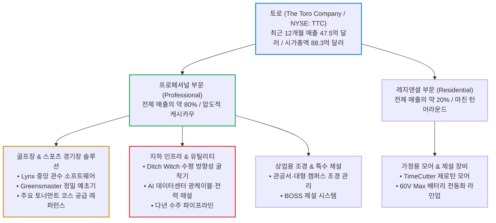

# 토로(The Toro Company, TTC) 실전 재무 및 가치 분석 보고서

- **작성일**: 2026-09-06
- **데이터 기준**: 2026년 9월 3일 발표된 FY2026 3분기 실적(2026년 7월 31일 마감 기준) 및 yfinance 시장 데이터 (2026년 9월 4일 종가 기준)

대중은 토로(The Toro Company, `TTC`)를 잔디깎이나 만드는 낡은 기계 제조사로 착각한다. 실체는 전 세계 골프장의 목줄과 AI 데이터센터 지하 광케이블망 굴착을 동시에 틀어쥔 해자 기업이고, 어닝 서프라이즈를 내고도 발표 당일 -6.84% 얻어맞으며 200일선까지 밀려 내려온 종목이다.

## 핵심 요약

| 구분 | 핵심 요약 |
| :--- | :--- |
| **종목 및 주가** | 토로 (The Toro Company, NYSE: `TTC`) / **$93.33** (52주 범위 $67.64 ~ $105.19) |
| **최종 투자의견** | **조건부 매수 (Buy on Dip)** / 지금 당장 풀매수는 금지, 200일선($91) 지지 확인 후 분할 저격 매수 (상세 점수 82.9점, 6.1절) |
| **비즈니스 본질** | 전 세계 골프장 스마트 관수 독점(Lynx) + AI 데이터센터 전력망·광케이블 지하 굴착 독점(Ditch Witch) |
| **핵심 매력 (Bull)** | TTM FCF 6억 800만 달러(수익률 6.9%), 배당(1.7%) + 자사주 매입으로 총 주주환원율 약 5~6%, 연 8~11% 안정적 복리 |
| **핵심 리스크 (Bear)** | 실적 발표 당일 2.74배 거래량 동반 -6.84% 급락(수급 훼손), GAAP vs 조정 EPS 괴리 확대($0.84) |
| **포트폴리오 성격** | 빅테크 하락장에 계좌를 지킬 **든든한 수비수(베타 0.71)** / **단기 대박·폭등 노림수는 매수 절대 금지** |

---

## 1. 비즈니스 실체: 대중이 모르는 골프장과 인프라의 '독점 빨대'

주식시장의 게으른 대중은 '토로(Toro)'라는 사명을 들으면 주말에 교외 주택 마당에서 풀 깎는 모어(Mower)나 제설기를 떠올린다. 전통 기계 제조사, 경기 민감주 따위의 꼬리표를 붙이고 거들떠보지도 않는다. 하지만 이런 무지함이야말로 기회다.

토로의 진짜 본질은 단순 조경 기계 제조사가 아니라, **골프장과 상업 시설의 유지·보수 시스템을 독점하고 AI 데이터센터 전력망·광케이블 지하 매설 장비를 지배하는 B2B 인프라 플랫폼 기업**이다.

### 1.1 골프장 지하에 박아둔 영구적인 독점 빨대 (Switching Cost)
전 세계 18홀 정규 골프 코스 지하에는 수천 개의 스마트 스프링클러 헤드, 토양 수분 감지 센서, 수십 킬로미터의 배관망이 묻혀 있다. 이 모든 하드웨어는 토로의 **Lynx 중앙 관수 제어 소프트웨어**와 연동되어 한 방울의 물까지 데이터로 통제된다.

골프장 지배인이나 그린키퍼가 경쟁사 제품으로 바꾸고 싶다고 바꿀 수 있는가? 천만의 말씀이다. 관수 시스템을 교체하려면 골프 코스 전체 페어웨이와 그린의 잔디를 다 뜯어내고 땅을 파헤쳐야 한다. 한 번 깔리면 최소 15년~20년 동안 토로의 부품, 소프트웨어 라이선스, 유지보수 용역을 강제로 사 쓸 수밖에 없는 **천문학적인 전환 비용(Switching Cost)**이 작동한다. 대중은 풀 깎는 쇳덩이를 보지만, 스마트머니는 코스 지하에서 평생 뽑아먹는 고마진 수수료 통행세를 본다.

### 1.2 AI 데이터센터와 지하 유틸리티의 숨은 수혜자: Ditch Witch
토로가 2019년 찰스 머신 웍스(Charles Machine Works) 인수로 확보한 **디치 위치(Ditch Witch)** 브랜드는 지하 케이블 매설용 수평 방향성 굴착기(HDD, Horizontal Directional Drilling) 시장의 독보적인 강자다.

지금 미국 전역은 AI 데이터센터를 짓기 위해 수 기가와트(GW)의 전력망을 새로 깔고 수만 킬로미터의 지하 초고속 광케이블망을 매설하고 있다. 전선과 케이블을 공중에 흉물스럽게 매달 수 없는 도심과 산업단지에서 땅속을 정밀하게 뚫어 케이블 관로를 내는 장비가 바로 Ditch Witch다. 이 수요는 단발성 발주가 아니라 다년에 걸친 프로젝트 파이프라인으로 이어진다.

---

## 2. 최근 실적과 시장의 오독: 대중의 착시 vs 숫자의 팩트

2026년 9월 3일 발표된 2026 회계연도 3분기(7월 31일 마감) 실적은 토로의 펀더멘털이 얼마나 단단한지 숫자로 증명했다. 매출은 컨센서스를 두 자릿수로 짓밟았고 조정 EPS도 전망치를 넘겼다.

그런데 주가는 그날 **-6.84% 처맞고 내려앉았다**. 이게 이 종목의 핵심 관전 포인트다.

| 시장이 보고 놀란 것 (착시) | 데이터가 말해주는 진실 (팩트) |
| :--- | :--- |
| **"고금리로 주택 경기가 죽어 장비 안 팔린다"** | **총매출 12억 2,580만 달러(YoY +8.4%)로 컨센서스(11억 748만 달러) +10.7% 상회, 순수 유기적 성장(Organic)만 +6.2% 기록** |
| **"인플레이션으로 원가 부담 터져 마진 축소될 것이다"** | **조정 EPS $1.33으로 컨센서스($1.31) 상회, 연간 EPS 가이던스 $4.60~$4.65 제시** |
| **"가정용(Residential) 소비 심리 둔화로 적자 날 것이다"** | **주거용 영업이익률 전년 동기 대비 400 bps 이상 개선하며 이익 체질 전환** |
| **"제조업 설비투자 줄여 가이던스 낮출 것이다"** | **연간 순매출 성장률 전망치를 기존 4.0%~6.5%에서 6.3%~6.6%로 상향, 하단을 2.3%p 끌어올림** |
| **"실적이 좋았는데 왜 6.8%나 빠졌냐, 뭔가 썩었다"** | **GAAP 순이익과 조정 실적의 괴리가 이번 분기에 확대됐다. TTM 기준 GAAP 희석 EPS는 $3.74인 반면 조정 EPS는 $4.58로 격차가 $0.84까지 벌어졌다. 시장은 서프라이즈의 질을 할인했다** |

### 2.1 3분기 주요 재무 성과 분해

- **매출액**: 12억 2,580만 달러 (전년 동기 11억 3,130만 달러 대비 +8.4% 증가)
    - 환율 효과나 인수·매각 효과를 제외한 순수 **유기적 성장률(Organic Growth)이 6.2%**에 달했다. 프로페셔널 부문에서 골프장 및 지하 인프라 장비 수주가 매출 성장을 하드캐리했다.
    - 시장 컨센서스는 11억 748만 달러였다. 실제 매출은 이를 **10.7% 상회**했다. 이건 오차 범위의 서프라이즈가 아니라 수요 자체가 다른 궤도에 있었다는 뜻이다.
- **조정 EPS**: 주당 **$1.33** (컨센서스 $1.31 상회, 전년 동기 조정 기준 $1.24 대비 +7.3% 성장)
    - 다만 매출이 컨센서스를 10.7% 넘겼는데 조정 EPS 서프라이즈는 +1.7%에 그쳤다. 매출 초과분이 이익으로 온전히 전환되지 못했다는 신호이고, 발표 당일 급락의 실질적 원인이다.
- **연간 가이던스 상향 조정**:
    - **연간 순매출 성장률**: 기존 `4.0% ~ 6.5%` ➔ **`6.3% ~ 6.6%`**로 하단을 2.3%p 끌어올렸다.
    - **연간 조정 EPS**: **`$4.60 ~ $4.65`**로 제시했다. FY26 1~3분기 누적 조정 EPS가 $3.67이므로, 4분기에 $0.93~$0.98을 벌겠다는 계산이다. 시장의 4분기 컨센서스($0.97)와 거의 정확히 겹친다. 허풍이 아니라 회사가 이미 손에 쥔 숫자를 말한 것이다.

### 2.2 AMP(Amplifying Maximum Productivity)의 잔혹한 마진 방어력
토로 경영진이 추진해온 전사적 생산성 프로그램인 **AMP(Amplifying Maximum Productivity)**는 원가 절감의 괴물 같은 위력을 발휘하고 있다.

누적 원가 절감 목표인 **1억 2,500만 달러($125M)** 달성을 향해 순항 중이며, 공급망 최적화, 자동화 라인 재배치, 모듈형 부품 설계를 통해 인플레이션과 관세로 인한 원가 상승 압박을 정면으로 받아냈다. 주거용 부문의 영업이익률이 400 bps(4%p) 이상 개선된 비결이 바로 이 AMP 프로그램에 있다.

---

## 3. 경쟁 해자 및 피어 그룹 잔혹 비교

조경 및 농기계 섹터에서 존디어(Deere & Company, `DE`), 쿠보타(Kubota, `KUBTY`) 같은 거인들이 존재하지만, 세부 시장으로 들어가면 토로의 해자는 난공불락이다. 다만 밸류에이션은 냉정하게 봐야 한다. 여기서 대중이 가장 많이 착각하는 지점이 있다.

| 비교 지표 | 토로 (TTC) | 디어앤컴퍼니 (DE) | 쿠보타 (KUBTY) | 조경·농기계 피어 평균 (ALG·LNN·AGCO·CNH·ASTE 포함) |
| :--- | :---: | :---: | :---: | :---: |
| **주력 독점 시장** | **골프장 관리·관수 / 지하 유틸리티** | 대형 농업 트랙터 / 대형 건설장비 | 소형 트랙터 / 건설장비 | 일반 상업용 모어 / 소형 굴착기 |
| **농산물 가격 민감도** | **극도로 낮음** (골프·인프라 예산 기반) | 극도로 높음 (곡물 가격 사이클 직격탄) | 높음 | 중간 |
| **고객 전환 비용** | **매우 높음** (Lynx 중앙 관수망 결합) | 높음 (농기계 텔레매틱스) | 보통 | 보통 (가격 경쟁 취약) |
| **선행 PER** | **18.4배** | **30.6배** (다운사이클로 EPS 급감) | 14.8배 | 약 17.1배 |
| **트레일링 PER** | 25.0배 | 38.6배 | 13.1배 | 약 34.6배 |
| **시가총액** | 88.3억 달러 | 1,870억 달러 | 218억 달러 | 10억 ~ 232억 달러 |
| **베타(변동성)** | **0.71** (가장 방어적) | 0.91 | 0.82 | 약 1.09 (시장 평균 이상) |

!!! warning "피어 밸류에이션에 대한 흔한 오독 교정"
    대중과 게으른 리포트는 "다운사이클에 빠진 존디어가 싸게 거래된다"고 말한다. **정반대다.** 다운사이클은 분모인 EPS를 깎아내리기 때문에 PER을 **끌어올린다.** 존디어는 곡물 가격 하락과 농가 소득 감소로 이익이 무너지면서 선행 PER이 **30.6배**까지 치솟았다. 토로의 18.4배가 존디어 대비 **약 40% 할인**된 자리다.

    다만 정직하게 말하자면, 조경·농기계 피어 평균 선행 PER은 약 17.1배다. 토로는 이 평균보다 **약 8% 비싸다.** 그 프리미엄이 Lynx 락인 구조와 베타 0.71의 방어력, 그리고 6.9%에 달하는 FCF 수익률로 정당화되느냐가 이 종목의 유일한 밸류에이션 쟁점이다.

존디어(`DE`)가 곡물 가격 하락으로 인한 농가 소득 감소와 대형 농기계 재고 누적으로 이익이 급감하는 동안, 토로는 골프 산업 유지보수 수요와 데이터센터 전력망·광대역 통신망 확충(IIJA 산하 BEAD 프로그램 등 연방 인프라 예산)에 힘입어 완전히 차별화된 실적 궤적을 그리고 있다.

---

## 4. 기술적 사이클 위치 (4단계 사이클 모델)

스탠 와인스타인의 4단계 주가 사이클(1단계 바닥 매집 ➔ 2단계 상승 ➔ 3단계 천장 분산 ➔ 4단계 공포 하락) 기준으로 볼 때, 토로(`TTC`)는 **2단계 상승 국면 안에 있으나, 실적 발표 당일의 대량 거래 급락으로 단기 수급이 훼손되어 200일선 지지력을 시험받는 구간**에 위치한다.

| 주가 수준 | 가격 | 기술적 의미 및 수급 분석 |
| :--- | :---: | :--- |
| **52주 최고가 (장중)** | **$105.19** | 2026년 3월 5일 기록. 최고 종가는 2026년 2월 20일의 $101.76이며, 이후 6개월간 회복하지 못한 상단 저항 |
| **50일 이동평균선** | **$96.18** | **실적 발표 당일 대량 거래로 하향 이탈. 1차 회복 목표이자 저항대로 전환** |
| **현재 주가** | **$93.33** | 실적 급락 직후 소폭 반등. 50일선과 200일선 사이의 완충 구간 |
| **200일 이동평균선** | **$91.19** | **기관 중장기 수급 생명선 / 마지막 방어선** |
| **52주 최저가 (장중)** | **$67.64** | 2025년 11월 21일 기록. 1단계 바닥 매집 완료 후 2단계 상승 시작 기점 |

- **현재 위치 판정**: **2단계 상승 국면 유지, 단 단기 수급은 훼손된 조정 구간**
- **근거**:
    - **2단계 전환 이후의 200일선 방어**: 토로는 2025년 9월 말부터 12월 중순까지 48거래일 동안 종가 기준으로 200일선을 밑돌았고, 그 구간에서 52주 최저가 $67.64를 찍었다. 하지만 **2025년 12월 16일을 마지막으로 종가가 200일선 아래로 내려간 적은 없다.** 즉 $91선이 "지난 1년간의 철벽"이었던 것이 아니라, **2단계 상승으로 전환한 2025년 12월 중순 이후 약 9개월간 지켜온 방어선**이다. 이 구분을 흐리면 지지선의 강도를 과대평가하게 된다.
    - **50일선 이탈과 거래량 급증**: 8월 말까지 $97~$100 구간에서 50일선 위를 지키던 주가는 실적 발표일인 9월 3일 **$99.15에서 $92.37로 -6.84% 급락**하며 50일선을 한 번에 내줬다. 이날 거래량은 **193만 7,800주로 20일 평균(9월 4일 기준 70만 7,945주)의 2.74배**였고, 다음 날인 9월 4일에도 **137만 200주(같은 평균의 1.94배)**가 터졌다. 이건 급락일 자신을 평균에 넣고 계산한 보수적인 숫자다. 급락 직전 20거래일 평균(62만 7,195주)으로 재면 9월 3일 거래량은 **3.09배**까지 뛴다.
    - **거래량 해석의 정직한 판정**: 대량 거래를 동반한 하락은 교과서적으로 **매집이 아니라 분산(Distribution) 신호**다. "조용히 물량을 흡수하는 스마트머니"로 미화할 근거가 이 차트에는 없다. 다만 하락 이튿날 주가가 $93.33으로 소폭 반등하며 200일선을 건드리지 않은 점, 그리고 200일선 자체가 우상향 중이라는 점은 2단계 구조가 아직 깨지지 않았음을 뜻한다.

!!! danger "이 구간에서 확인해야 할 단 하나의 조건"
    실적 급락은 이미 벌어진 일이다. 중요한 건 그 다음이다. **하락 이후 며칠 안에 거래량이 평균 수준으로 잦아들면서 $91선이 지켜지느냐**가 2단계 유지 여부를 가른다. 반대로 200일선을 대량 거래와 함께 종가로 내주면 그건 3단계 분산 전이의 신호이며, 매수 논리 전체를 재검토해야 한다.

---

## 5. 밸류에이션 및 가격 타당성 검증: 세 가지 PER의 진짜 얼굴

대중은 아무 PER이나 하나 집어 들고 "비싸다", "싸다"를 떠든다. 토로는 어떤 기준으로 계산하느냐에 따라 PER이 **25.0배에서 18.4배까지** 널뛴다. 이 차이를 모르면 밸류에이션 논쟁 자체가 무의미하다.

  토로의 실질 현금 가치 &nbsp;=&nbsp;
  
    탄탄한 FCF ($6.08억) &times; AMP 마진 확장
    요구수익률(할인율) &minus; 락인 독점력이 지켜주는 장기 성장률
  

### 5.1 기준별 PER 분해: 어떤 숫자를 봐야 하는가

| PER 기준 | 배수 | 사용한 EPS | 해석 |
| :--- | :---: | :---: | :--- |
| **트레일링 PER (GAAP)** | **25.0배** | TTM GAAP 희석 EPS $3.74 | 일회성 비용이 모두 반영된 가장 보수적인 숫자. 대중이 "비싸다"고 말할 때 보는 값 |
| **트레일링 PER (조정)** | **20.4배** | TTM 조정 EPS $4.58 | 일회성 비용을 제외한 실질 수익력 기준 |
| **당해 연도 PER (FY26)** | **20.2배** | 회사 가이던스 중간값 $4.625 | 회사가 직접 제시한 올해 실적 기준 |
| **선행 PER (FY27)** | **18.4배** | 2027 회계연도 컨센서스 EPS $5.08 | 내년 이익 성장을 반영한 값 |

!!! note "GAAP과 조정 실적을 섞어 비교하지 마라"
    "PER이 25배에서 18배로 뚝 떨어진다"는 식의 서술은 **GAAP 기준(25.0배)과 조정 기준(18.4배)을 섞은 착시**다. 같은 조정 기준으로만 비교하면 **20.4배 ➔ 18.4배**, 즉 실질적인 멀티플 하락 폭은 2.0배 수준이다.

    이번 분기에 GAAP EPS와 조정 EPS의 TTM 격차가 $0.84까지 벌어진 점은 그냥 넘길 사안이 아니다. 조정 실적만 보고 투자 판단을 내리면 일회성으로 분류된 비용이 실제로는 구조적 비용일 가능성을 놓친다. 다음 분기 실적에서 이 격차가 좁혀지는지를 반드시 확인해야 한다.

### 5.2 밸류에이션 판정과 현금 창출력

- **상대 밸류에이션은 '싸다'가 아니라 '합리적이다'**:
    - 선행 PER 18.4배는 존디어(30.6배) 대비 약 40% 할인, S&P 500 트레일링 PER(SPY 기준 24.9배) 대비로도 낮은 자리다.
    - 다만 조경·농기계 피어 평균 선행 PER 약 17.1배와 견주면 **소폭 프리미엄**이다. 무조건 싸다고 우기는 건 거짓말이다. 정확한 판정은 **GARP(합리적인 가격에 거래되는 성장주)** 구간이지, 바겐세일이 아니다.
- **막강한 현금 창출력**:
    - 연초 이후(YTD) 잉여현금흐름(FCF)이 **4억 2,500만 달러**, 지난 12개월(TTM) 기준 FCF는 **6억 800만 달러**에 달한다. 시가총액(88억 3,000만 달러) 대비 FCF 수익률이 **6.9%**다. 조정 순이익 기준 이익수익률(4.9%)보다 높다는 건, 회계상 이익보다 실제로 들어오는 현금이 더 많다는 뜻이다.

### 5.3 배당과 총 주주환원율(Total Shareholder Yield)의 냉혹한 해부: "배당도 없다"는 착각

대중은 배당수익률 **1.67%**(연간 주당 $1.56, 분기당 $0.39)라는 숫자만 보고 "은행 예금이나 고배당주(4~5%+)에 비해 쥐꼬리 수준 아니냐, 배당 매력도 없다"며 코웃음을 친다. 하지만 이는 기업의 자본 배치(Capital Allocation) 구조를 전혀 모르는 무지의 소치다.

| 주주환원 항목 | 연간 규모 / 비율 | 핵심 성격 및 의미 |
| :--- | :---: | :--- |
| **연간 현금 배당** | **약 1억 5,000만 달러** (분기 약 $3,750만) | **20년 연속 배당 인상**(Dividend Contender), 조정 EPS 기준 배당성향 34%(GAAP 기준 42%)로 불황에도 삭감 불가능한 철옹성 |
| **자사주 매입 (FY26 상반기)** | **2억 8,510만 달러** | 1분기 9,490만 달러 + 2분기 1억 9,020만 달러 집행. 반년 만에 **1년 치 배당 총액의 거의 2배를 자사주 매입에 투입** |
| **자사주 매입 (최근 4개 분기)** | **3억 7,510만 달러** | 시가총액 대비 **약 4.2%**. 다만 FY25 4분기처럼 집행액이 0원인 분기도 있어 분기별 편차가 크다 |
| **총 주주환원율** | **약 5% ~ 6%** | 시가총액의 5~6%를 매년 자사주 소각과 배당으로 주주에게 직접 돌려주는 고밀도 환원 구조 |

- **① 배당성장주(Dividend Growth)의 교과서**:
    - 토로는 당장 5%씩 쥐여주는 고배당주가 아니라, 조정 이익의 3분의 1(조정 EPS 기준 배당성향 34%)만 배당으로 풀고 나머지는 재투자 및 자사주 매입에 쓰는 전형적인 **배당성장 복리주**다.
    - 지난 20년 이상 배당을 단 한 번도 깎지 않고 매년 늘려왔다. 분기 배당은 2024년 $0.36에서 2025년 $0.38, 2025년 12월 이후 $0.39로 계단식 인상을 이어가고 있다. 배당 컷(Dividend Cut) 공포가 사실상 제로에 수렴한다.
- **② 진짜 알맹이는 배당이 아니라 자사주 매입(Share Buybacks)**:
    - 배당금을 주면 주주는 배당소득세(미국 15%)를 강제로 뜯긴다. 영리한 기업은 현금을 배당으로 다 뿌리는 대신 **시장에서 자기 주식을 쓸어 담아 유통주식수를 영구적으로 줄인다.**
    - 토로는 FY26 상반기(6개월)에만 **2억 8,510만 달러의 자사주를 매입**했다. 1년 치 배당금(약 1억 5,000만 달러)의 거의 두 배에 달하는 현금을 반년 만에 자사주 매입으로 쏴버린 것이다.
    - 따라서 표면 배당수익률 1.67%에 자사주 매입 수익률(최근 4개 분기 실제 집행액 3억 7,510만 달러 기준 약 4.2%)을 더한 **총 주주환원율(Total Shareholder Yield)은 약 5~6%**에 달한다. 겉만 보면 1.67%짜리 시시한 배당주 같지만, 속을 뜯어보면 매년 시가총액의 5~6%를 주주 몫으로 되돌려주는 고효율 현금 환원 기계다.

---

## 6. 종합 평가 및 냉혹한 계좌 실행 원칙

### 6.1 6대 핵심 투자 지표 다차원 평가 매트릭스

| 평가 영역 | 가중치 | 평점 (100점 만점) | 가중 점수 | 등급 | 핵심 평가 요약 |
| :--- | :---: | :---: | :---: | :---: | :--- |
| **① 비즈니스 모델 및 해자** | 25% | **90점** | 22.50 | `S` | Lynx 관수망의 물리적 전환 비용과 Ditch Witch의 HDD 시장 지위는 최상급 |
| **② 실적 성장성 및 가이던스** | 25% | **86점** | 21.50 | `A` | 매출이 컨센서스를 +10.7% 상회하고 가이던스 하단을 2.3%p 상향했으나, **EPS 서프라이즈는 +1.7%에 그쳐 이익 전환율이 아쉬움** |
| **③ 재무 건전성 및 현금흐름** | 20% | **88점** | 17.60 | `A+` | TTM FCF 6억 800만 달러, FCF 수익률 6.9%, 반기 자사주 매입 2억 8,510만 달러 |
| **④ 밸류에이션 매력도** | 15% | **74점** | 11.10 | `B+` | 존디어 대비 40% 할인이나 **피어 평균(17.1배) 대비로는 프리미엄** |
| **⑤ 기술적 매매 타이밍** | 10% | **62점** | 6.20 | `C+` | **실적 당일 거래량 2.74배 폭증과 함께 -6.84% 급락하며 50일선 이탈** |
| **⑥ 리스크 관리 가능성** | 5% | **80점** | 4.00 | `A-` | 베타 0.71의 방어적 특성과 명확한 200일선 손절 기준이 리스크를 통제 가능하게 함 |
| **종합 가중치 환산 점수** | **100%** | — | **82.9점** | **`Buy`** | **사업 실체와 현금 창출력은 우량하나, 단기 수급 훼손으로 진입 시점을 나눠야 함** |

!!! info "평점 산출 근거"
    종합 점수는 각 영역 평점에 가중치를 곱해 합산한 값이다.
    `90×0.25 + 86×0.25 + 88×0.20 + 74×0.15 + 62×0.10 + 80×0.05 = 82.9점`

    해자(①)와 현금흐름(③)은 최상위 등급이다. 반면 **대량 거래를 동반한 50일선 이탈(⑤)과 피어 평균 대비 프리미엄(④)** 이 점수를 끌어내렸다. 종합 등급은 **`Buy`** 를 유지하되, 한 번에 사들이는 방식은 금지한다.

### 6.2 실전 결론: "그래서 지금 어쩌라는 것인가?" (Action Verdict)

앞서 펀더멘털과 숫자를 다 까봤다. 독자가 가장 궁금한 핵심 질문 세 가지에 대해 단도직입적으로 답을 내린다.

#### ① 지금 당장 사야 하는가? ➔ **"아니다. 지금 손가락 얹지 마라."**
* **이유**: 실적 발표 당일 거래량이 평소의 2.74배 터지며 주가가 -6.84% 급락해 50일선($96.18)을 내줬다. 떨어진 칼날의 피가 아직 마르지 않았다.
* **지금 할 일**: 관심종목 최상단에 올려두고, 거래량이 평소 수준(70만 주)으로 마르면서 주가가 **200일선($91.19 부근)을 지켜내는지 지켜보는 '적극적 관망(Wait & Watch)'**이다. 바닥을 지레짐작하고 성급하게 손을 뻗으면 손가락만 베인다.

#### ② 이런 주식은 누가 사고, 누가 절대 사면 안 되는가?
* **❌ 절대 사지 마라 (즉시 퇴장)**: 아래 셋 중 하나라도 해당한다면 이 종목은 네 것이 아니다. **사지 마라. 네 돈 낭비고 인생 낭비다.**
    * "엔비디아나 테슬라처럼 1년에 50%, 100% 터질 대박주를 찾는 사람"
    * "당장 분기마다 5~7%씩 현금이 꽂히는 고배당주를 찾는 은퇴 생활자"
    * "주가가 며칠만 안 움직여도 답답해서 손가락이 근질거리는 단타 트레이더"
* **⭕ 반드시 눈독 들이고 주워 담아야 할 사람 (스나이퍼 대기)**:
    * "빅테크의 살인적인 롤러코스터 변동성에 지쳐서, 하락장에도 계좌 하방을 든든하게 받쳐줄 방파제(베타 0.71)가 절실한 사람"
    * "골프장의 목줄을 쥐고 AI 데이터센터 지하 케이블망을 독점한 해자 기업을 일시적 수급 충격 덕에 200일선 바닥에서 세일가로 줍고 싶은 사람"
    * "현금배당(1.7%)과 막대한 자사주 매입(약 4.2%)을 합쳐 매년 5~6%의 주주환원을 챙기며, 연 8~11%씩 안전하게 복리로 굴릴 장기 가치 투자자"

#### ③ 이 주식으로 '인생 역전(대박)'을 바라면 안 되는 냉혹한 이유
* **베타 0.71의 구조적 한계**: 시장(S&P 500)이 20% 폭등하며 불을 뿜을 때 토로는 10% 남짓 기어 올라간다. 변동성이 낮다는 것은 하락장에서는 축복이지만, 불장에서는 소외감으로 피눈물을 흘리게 만드는 족쇄다.
* **물리적 제조업의 성장 천장**: 골프장 잔디를 깎고 지하에 광케이블 관로를 뚫는 장비는 소프트웨어처럼 마진율 90%로 무한 복제되지 않는다. 유기적 연간 매출 성장률은 **6% 내외**다.
* **현실적인 장기 기대 수익률의 한계**:
    - **상방 요인**: 유기적 매출 성장 6% + AMP 원가절감에 따른 마진 개선 1~2%p + 총 주주환원 5~6%
    - **하방 요인**: 선행 PER 18.4배가 피어 평균(약 17.1배)으로 수렴하기만 해도 멀티플에서 매년 1~2%p를 깎아먹는다. 경기가 꺾여 골프장·인프라 설비 예산이 밀리면 성장률 6%조차 보장이 아니다.
    - 상방에서 하방을 덜어내고 남는 현실적인 숫자가 **연 8~11% 복리**다. 이 주식의 진정한 실체는 **'지루하지만 망하지 않는 연 9~10%짜리 복리 기계'**다.
* **포트폴리오 내 진짜 용도**:
    - 이 주식은 공격수가 아니라 **골키퍼이자 중앙 수비수**다.
    - 테크주가 폭락하고 경기 침체 공포가 덮칠 때 6억 달러의 FCF와 베타 0.71의 둔중함으로 계좌의 하방을 받쳐주는 **포트폴리오 방파제**로 편입하는 것이지, 계좌 역전 홈런을 치려고 사는 종목이 아니다.

### 6.3 실전 가격대별 실행 시나리오 및 분할 매수 로드맵

토로는 화려한 AI 수혜주처럼 하루아침에 20%씩 폭등하는 주식이 아니다. 땅속에 배관과 전선을 깔고 푸른 잔디를 유지해야 하는 한 절대로 망할 수 없는 독점적 시장 지위와 기계적인 현금 창출력을 갖춘 **포트폴리오의 든든한 방파제**다. 다만 방금 대량 거래를 동반한 급락을 맞았다는 사실을 외면하고 몰빵하는 건 다른 종류의 바보짓이다.

| 구분 | 실행 조건 | 배정 비중 | 가격 기준 | 실전 대응 방침 |
| :--- | :--- | :---: | :---: | :--- |
| **1차 진입 (선발대)** | 급락 후 거래량 정상화 확인 | **30%** | **$92.00 ~ $94.50** | 현재가($93.33) 부근에서 기본 포지션만 구축하고 관망 |
| **2차 매수 (주력)** | 200일선($91.19) 눌림목 테스트 및 종가 방어 | **35%** | **$89.50 ~ $91.50** | 200일선 터치 후 **종가로 지켜내는 것을 확인한 뒤** 비중 확대 (최적의 손익비 타점) |
| **3차 매수 (추세 확인)** | 50일선($96.18) 회복 및 종가 안착 | **25%** | **$96.50 돌파 시** | 실적 급락 갭을 메우고 추세가 복원된 것을 확인한 후 추격 |
| **예비 현금** | 4분기 실적 및 매크로 급변 대응 | **10%** | — | 조건 충족 시까지 현금 보존 |
| **손절 기준선** | 장기 추세선 완전 붕괴 | — | **$87.00 종가 이탈** | 200일선 대비 -4.6% 완충까지 소진되면 2단계 종료로 보고 미련 없이 비중 축소 |

!!! tip "최종 핵심 제언 (Executive Takeaway)"
    - **최종 투자 가치 점수**: **82.9점 / 100점** (`Buy` / 고품질 현금흐름 기반 우량 가치주, 단기 수급은 훼손)
    - **시장의 오독을 역이용하되, 차트까지 미화하지 마라**: 대중이 "잔디깎이 회사"라며 소외시킬 때 골프장 코스 지하의 독점 소프트웨어와 AI 데이터센터 지하 케이블망 굴착 수요를 봐야 한다. 그러나 실적 당일 평균의 2.74배 거래량과 함께 -6.84% 밀린 사실은 사실대로 받아들여야 한다. 사업이 좋다는 것과 지금 당장 주가가 오른다는 것은 별개다.
    - **$91선은 9개월짜리 방어선이지 1년짜리 철벽이 아니다**: 2025년 11월 저점 $67.64를 기억해라. 200일선은 2025년 12월 중순 2단계 전환 이후에야 지켜지기 시작한 선이다. 이 선을 종가로 내주면 논리가 아니라 계좌를 지켜라.
    - **다음 분기에 확인할 단 하나**: GAAP EPS와 조정 EPS의 TTM 격차($0.84)가 좁혀지는가. 좁혀지면 이번 급락은 과잉 반응이고, 벌어지면 조정 실적이 만들어낸 착시였다는 뜻이다.
