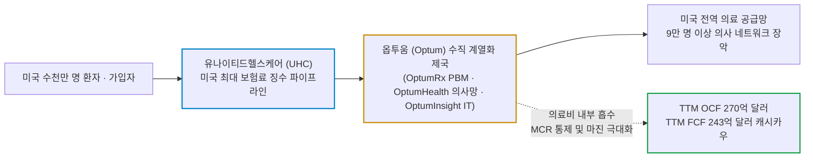
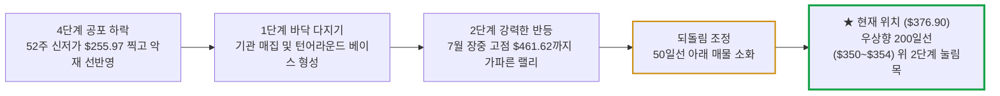

# 유나이티드헬스 그룹(UnitedHealth Group / UNH) 실전 재무 및 가치 분석 보고서

- **작성일**: 2026-09-19
- **데이터 기준**: 2026년 2분기 실적(2026-06-30 마감) 및 yfinance 시장 데이터(2026-09-18 미국장 마감 기준)

연 매출 4,500억 달러로 미국 의료비 흐름의 한가운데를 틀어쥔 헬스케어 공룡이 사이버 공격과 손해율 충격을 딛고 턴어라운드를 숫자로 입증했다. 대중이 규제와 정치권 노이즈에 질려 머뭇거릴 때, 최근 12개월 잉여현금흐름 243억 달러와 선행 PER 16.7배의 손익비를 꿰뚫어 보고 200일선 지지 기반의 냉혹한 분할 매수 타점을 계산하라.

## 핵심 요약

| 구분 | 핵심 요약 |
| :--- | :--- |
| **종목 및 주가** | 유나이티드헬스 그룹 (NYSE: `UNH`) / **$376.90** (52주 범위 $255.97 ~ $461.62) |
| **최종 투자의견** | **적극 분할 매수 (Buy on Dip)** / 현재가 선발대 진입 후 200일선 지지 확인 시 주력 매수 (투자 가치 점수 **88.0점**, 6.1절) |
| **비즈니스 본질** | 건강보험(UHC)과 의료 IT·처방약(PBM)·클리닉(Optum)을 수직 통합한 미국 헬스케어의 대체 불가능한 '통행세 빨대' |
| **핵심 매력 (Bull)** | Q2 조정 EPS **$6.38**(MCR 86.7%로 급락), 연간 조정 EPS 가이던스 $19.50~$20.00 상향, 주요 IB 목표가 $490~$529 상향, TTM FCF 243억 달러 |
| **핵심 리스크 (Bear)** | 정부 메디케어 어드밴티지(MA) 요율 압박, 메디케이드 재정 삭감, 사이버 공격 관련 소송 여진, 선거철 PBM 청문회 노이즈 |
| **포트폴리오 성격** | 경기 침체에도 꺾이지 않는 **헬스케어 방파제(베타 0.62)** / **단기 2배 급등을 바라는 투기꾼은 매수 금지** |

---

## 1. 비즈니스 실체: 대중이 모르는 기업의 '목줄'과 독점 빨대

대중은 유나이티드헬스 그룹을 단순히 '가입자들에게 매달 보험료를 걷어 병원비를 대신 내주는 건강보험 회사' 정도로 순진하게 이해한다. 자본시장의 관점에서 까보면 전혀 다른 괴물이 도사리고 있다. 환자가 병원에 가고, 의사가 진료를 보고, 약국에서 약을 타는 미국 의료 시스템의 모든 단계에 빨대를 꽂아놓고 양방향에서 통행세를 쓸어 담는 **'수직 계열화된 거대 헬스케어 제국'**이 바로 유나이티드헬스 그룹(UnitedHealth Group, `UNH`)이다.

이 회사의 사업 모델은 크게 두 개의 강력한 톱니바퀴로 맞물려 돌아간다:

- **① 유나이티드헬스케어 (UnitedHealthcare)**:
    - 의료보험 가입자 약 4,850만 명(2026년 6월 말 기준)을 거느린 미국 최대 건강보험 사업 부문이다. 개인, 기업, 정부(메디케어 및 메디케이드)로부터 매달 천문학적인 보험료를 징수한다.
- **② 옵투움 (Optum)**:
    - 병원, 환자, 제약사를 연결하는 헬스케어 기술·서비스 플랫폼이다. 약국 급여 관리(Optum Rx), 병원 IT 및 데이터 분석(Optum Insight), 그리고 9만 명 이상의 의사를 고용하거나 제휴로 묶어 둔 클리닉 네트워크(Optum Health)로 구성된다.

대중이 알아채지 못하는 진짜 무서운 점은 **'수직 계열화의 머니 루프(Money Loop)'**다. 가입자가 아파서 병원에 가면, 보험사인 유나이티드헬스케어가 의료비를 지급한다. 그런데 그 환자가 찾아간 클리닉이 옵투움(Optum Health) 소속이고, 처방받은 약을 조제하는 관리자가 옵투움(Optum Rx)이며, 청구서를 처리하는 IT 소프트웨어가 옵투움(Optum Insight)이다.

결국 보험 부문에서 빠져나간 돈이 자회사인 옵투움의 매출로 고스란히 되돌아오는 구조다. 경쟁 보험사들이 병원과 약국의 가격 횡포에 휘둘릴 때, 유나이티드헬스는 그룹 내부에서 원가를 직접 통제하고 이중으로 이익을 남긴다.

### 1.1 옵투움(Optum) 3대 축: 후발 주자가 넘볼 수 없는 데이터 참호

- **① Optum Rx (약국 급여 관리, PBM)**:
    - 미국 3대 PBM 중 하나로, 제약사와 약가 협상을 벌이고 리베이트를 통제한다. 미국 전역의 약품 유통 물량을 쥐고 있어 제약사조차 가격을 함부로 올리지 못한다.
- **② Optum Health (직속 의료 전달망)**:
    - 9만 명 이상의 의사를 고용·제휴로 거느린 미국 최대 규모의 의료 제공자 네트워크다. 환자를 외부 병원에 보내 바가지 진료비를 무는 대신, 자체 클리닉에서 예방 진료와 효율적 치료를 제공하여 의료 손해율을 구조적으로 낮춘다.
- **③ Optum Insight (의료 IT 및 빅데이터 인프라)**:
    - 미국 수천 개 병원과 보험사의 청구·수납·행정을 처리하는 IT 중추다. 방대한 임상 및 청구 데이터를 독점 분석하여 보험 사기, 과잉 진료, 행정 누수를 실시간으로 걸러낸다. 실리콘밸리의 테크 기업들이 아무리 날고 기어도 수십 년간 축적된 이 의료 데이터를 단기간에 복제하는 것은 불가능하다.

---

## 2. 최근 실적과 시장의 오독: 대중의 착시 vs 숫자의 팩트

### 2.1 2분기 실적 팩트 체크: 숫자로 증명한 턴어라운드

2026년 2분기 실적 발표는 작년의 부진과 시장의 의구심을 정면으로 박살 냈다. 매출은 제자리였지만 이익과 현금흐름이 폭발했다. 조정 EPS는 컨센서스($4.92)를 29.8% 상회했고, 영업현금흐름은 분기 110억 달러를 넘겼다.

| 재무 지표 | Q2 2025 | Q1 2026 | Q2 2026 | 전년 동기 대비(YoY) | 냉혹한 데이터 분석 |
| :--- | ---: | ---: | ---: | ---: | :--- |
| **총매출** | $111,616.0M | $111,721.0M | **$112,032.0M** | **+0.4%** | 분기 1,120억 달러 수준 유지, 외형 성장 대신 수익성 선택 |
| **영업이익** | $5,150.0M | $8,990.0M | **$7,991.0M** | **+55.2%** | MCR 안정화 및 비용 효율화로 영업이익 급증 |
| **영업이익률 (OPM)** | 4.6% | 8.0% | **7.1%** | **+2.5%p** | 작년 저점 탈출 후 7%대 마진 안착 |
| **순이익** | $3,406.0M | $6,280.0M | **$5,484.0M** | **+61.0%** | 기저효과 및 본업 회복에 따른 순이익 폭증 |
| **조정 희석 EPS (Non-GAAP)** | $4.08 | $7.23 | **$6.38** | **+56.4%** | 컨센서스 $4.92 대비 +$1.46 서프라이즈, 연간 전망 상향 |
| **영업현금흐름 (OCF)** | $7,188.0M | $8,912.0M | **$11,052.0M** | **+53.8%** | 분기 OCF 110억 달러 돌파, 막강한 현금 회수력 |
| **잉여현금흐름 (FCF)** | $6,302.0M | $8,149.0M | **$10,253.0M** | **+62.7%** | 분기 FCF 100억 달러 이상 쓸어 담음 |
| **분기 주당 배당금** | $2.21 | $2.21 | **$2.32** | **+5.0%** | 6월 배당 5% 인상, 연간 $9.28 기준 시가배당률 2.47% |

출처: yfinance 분기 재무제표·실적 발표 데이터 및 유나이티드헬스 그룹 2026년 2분기 실적 공시(2026-07-16 발표).

### 2.2 2024~2025년 충격을 딛고 일어선 4대 턴어라운드 동력

- **① 의료비 손해율(MCR) 통제와 수익성 위주 포트폴리오 재편**:
    - 과거 시니어들의 지연되었던 무릎·고관절 수술 등 의료 이용 급증으로 MCR(의료비용비율)이 89%를 넘나들며 이익을 갉아먹었다. 경영진은 무리한 가입자 수 늘리기를 중단하고, 수익성이 낮은 메디케이드 및 정부 플랜을 정리하는 결단을 내렸다. 그 결과 의료보험 가입자 수는 약 4,850만 명으로 전분기 대비 약 50만 명 줄었으나, 2분기 MCR은 **86.7%로 전년 동기(89.4%) 대비 270bp 떨어지며** 마진 복원력을 증명했다. 연간 MCR 가이던스도 88.8%(±50bp)에서 88.1%(±25bp)로 낮아졌다.
- **② 15억 달러 규모의 전사적 AI 인프라 구축**:
    - 유나이티드헬스는 **약 15억 달러($1.5B) 규모의 인공지능(AI) 투자**를 가동 중이다. 청구 사전 승인, 복잡한 진료비 심사, 환자 질환 예측 모델에 AI 알고리즘을 배치하여 새어 나가던 행정 비용과 누수를 차단하고 운영 효율성을 끌어올리고 있다.
- **③ 체인지 헬스케어(Change Healthcare) 해킹 악재의 소멸 국면**:
    - 2024년 발생했던 대규모 전산망 사이버 공격의 현금 부담은 빠르게 줄고 있다. 해킹 피해 의료기관에 내줬던 대출의 상환 관련 현금 유출은 2025년 상반기 12.9억 달러에서 2026년 상반기 1.97억 달러로 쪼그라들었다. 다만 관련 소송은 아직 꼬리로 남아 있다.
- **④ 가이던스 상향과 주주 환원 확대**:
    - 경영진은 2026년 연간 조정 EPS 가이던스를 4월에 제시한 18.25달러 이상에서 **19.50~20.00달러로 상향**했다. 연간 영업현금흐름 가이던스는 180억 달러 이상에서 **약 240억 달러로**, 자사주 매입 계획은 약 25억 달러에서 **50억 달러 이상으로** 두 배 늘렸다. 분기당 주당 **$2.32**(연간 $9.28)의 배당금과 함께 주주 가치를 지탱하고 있다.

### 2.3 2분기 실적 전후 핵심 뉴스 및 월가 IB 시각 타임라인 (2026.06.17 ~ 2026.07.21)

2026년 6월 중순부터 7월 하순까지 이어진 뉴스와 주요 투자은행(IB)들의 보고서는 한마디로 **'비관론의 항복과 목표주가 줄상향 랠리'**였다. 대중이 규제와 손해율 공포에 질려 주식을 내던질 때, 월가 기관들은 옵투움의 마진 잠재력과 MCR 급락을 꿰뚫어 보고 목표주가를 500달러 안팎까지 올려 잡았다.

#### 월가 주요 IB 투자의견 및 목표주가 변동 추이

| 일자 | 투자은행 (IB) | 담당 분석가 | 투자의견 | 목표주가 변동 | 핵심 평가 근거 |
| :---: | :--- | :--- | :---: | :---: | :--- |
| **06.17** | **리링크 파트너스** *(Leerink Partners)* | 휘트 마요 | **아웃퍼폼** *(Outperform)* | $400 ➔ **$462** | 옵투움 헬스 마진 회복을 반영해 2027~2028년 EPS 추정치 상향, 2028년 마진 목표 달성 시 EPS $30 가능 |
| **06.30** | **모간스탠리** *(Morgan Stanley)* | 에린 라이트 | **최선호주** *(Top Pick)* | $453 ➔ **$468** | 15억 달러 규모 AI 투자에 따른 운영 효율화 및 AI 관련 매출 기회 |
| **07.02** | **레이먼드제임스** *(Raymond James)* | 분석팀 | **최선호주** *(Top Pick)* | **최선호주 편입** | 오스카헬스(OSCR)를 대체하여 최선호주 선정, 의료비 추세 둔화와 보험·옵투움헬스 마진 개선, 7월 실적 모멘텀 |
| **07.16** | **2분기 실적 공시** *(속보 발표)* | 사측 공시 | — | **어닝 서프라이즈** | 매출 $1,120억(+0.4%), 조정 EPS **$6.38**(+56.4% YoY, 컨센 +$1.46), MCR **86.7%로** 급락, 연간 EPS $19.50~$20.00 상향 |
| **07.17** | **모간스탠리** *(Morgan Stanley)* | 에린 라이트 | **비중확대** *(Overweight)* | $468 ➔ **$529** | 실적 발표 후 월가 최고 목표주가로 상향 |
| **07.17** | **트루이스트** *(Truist)* | 데이비드 맥도널드 | **매수** *(Buy)* | $480 ➔ **$500** | 메디케어 어드밴티지 사업 호조, MCR 예상치 하회, UHC·옵투움헬스 이익 기대치 상향 |
| **07.17** | **키뱅크** *(KeyBanc)* | 매슈 길모어 | **비중확대** *(Overweight)* | $475 ➔ **$500** | EPS 가이던스 약 8% 상향, 상업보험 비용 부담은 단기 요인으로 판단 |
| **07.17** | **RBC 캐피털** *(RBC Capital)* | 분석팀 | **아웃퍼폼** *(Outperform)* | $463 ➔ **$478** | 호실적 및 가이던스 상향 확인, 상업보험 마진 시차에 따른 장 초반 매물 소화 후 펀더멘털 건재 |
| **07.21** | **골드만삭스** *(Goldman Sachs)* | 스콧 피델 | **매수** *(Buy)* | $435 ➔ **$490** | 양호한 의료손해율과 옵투움헬스 수익성 복원력 검증 |

#### 냉혹한 3대 팩트 분해

- **① 15억 달러 AI 투자와 옵투움 헬스의 이익 잠재력 (리링크 & 모간스탠리)**:
    - 리링크 파트너스는 옵투움 헬스의 마진 개선 추세가 안정적이라고 보고 2027~2028년 EPS 추정치를 끌어올렸다. 회사가 2028년까지 마진 목표를 달성하면 EPS가 **$30까지** 오를 수 있다는 것이 리링크의 계산이다. 옵투움 내부에서 아직 실현되지 않은 이익 잠재력이 수년에 걸쳐 쏟아져 나올 수 있다는 뜻이다.
    - 모간스탠리가 주목한 **15억 달러 규모의 AI 투자**는 껍데기뿐인 테마가 아니다. 모간스탠리는 보험사와 의료기관이 행정 처리에만 연간 800억 달러를 쓴다는 점을 짚었다. 환자의 입원율을 예측하고 불필요한 청구를 자동으로 걸러내는 알고리즘이 이 비용을 직접 깎아낸다.
- **② MCR 86.7%의 급락과 연간 가이던스 약 8% 상향 (7월 16일 실적 발표)**:
    - 7월 16일 2분기 장부 공개는 시장의 공포를 단번에 침묵시켰다. 의료비용비율(MCR)은 **86.7%까지 곤두박질**쳤고, 회사는 연간 MCR 가이던스까지 88.1%로 낮췄다.
    - 저수익 가입자 약 50만 명을 과감히 털어내고 고마진 계약 위주로 다이어트를 감행한 결과, 분기 조정 EPS는 전년 대비 **+56.4% 폭증한 6.38달러**를 찍었다. 연간 영업현금흐름 가이던스는 약 240억 달러로, 자사주 매입 계획은 50억 달러 이상으로 올라갔다.
- **③ 상업보험 마진 시차와 장중 매물 소화의 진짜 내막 (트루이스트 & 키뱅크 & RBC)**:
    - 실적 발표 직후 주가가 장 초반 상승분을 반납하며 매물을 소화한 이유는 "상업보험(Commercial Insurance) 부문의 비용 압박과 마진 회복 시차" 때문이었다.
    - 그러나 상업보험은 정부 메디케어와 달리 **기업들과의 계약 갱신 주기에 맞춰 보험료율을 인상**할 수 있다. 마진 압박은 갱신 주기를 거치며 가격에 전가된다. 일시적 시차를 빌미로 던져진 물량은 리링크가 그린 2028년 EPS $30 경로를 믿는 기관들의 먹잇감이 되었을 뿐이다.

### 2.4 시장의 착시 vs 냉혹한 데이터 팩트

| 시장이 보고 놀란 것 (착시) | 데이터가 말해주는 진실 (팩트) |
| :--- | :--- |
| **"정부 메디케어 요율 인하 압박으로 마진이 영구 훼손된다"** | 요율이 깎이면 보험사만 죽는 것이 아니다. UNH는 옵투움(Optum)이라는 거대한 비보험 의료 서비스·IT 제국을 가지고 있어 정책 충격을 내부 흡수하고 분산시킬 수 있는 유일한 공룡이다. |
| **"노령층 의료 이용 급증(MCR 폭등)으로 실적이 꺾일 것이다"** | 2분기 MCR은 **86.7%로 급락하며** 전년 동기(89.4%) 대비 270bp나 개선되었다. 손실 나는 가입자를 쳐내고 마진 중심의 프라이싱을 단행하여 2분기 영업이익이 전년 대비 **+55.2% 폭증했다**. |
| **"상업보험 마진 회복 지연으로 주가가 상승분을 반납했다"** | 상업보험은 계약 갱신 때마다 인플레이션 비용을 고객사에 가장 빠르게 전가할 수 있는 영역이다. 단기 마진 시차일 뿐, 연간 가이던스 상향과 2028년 EPS $30 시나리오는 훼손되지 않았다. |
| **"정치권의 PBM 청문회와 약가 규제로 옵투움이 해체된다"** | PBM을 두들겨 패는 정치적 쇼는 선거철마다 반복된 레퍼토리다. 복잡한 미국 의약품 유통망에서 옵투움의 규모의 경제를 대체할 대안은 존재하지 않는다. |

---

## 3. 경쟁 해자 및 피어 그룹 잔혹 비교

미국 헬스케어 보험 및 의료 관리 시장은 막대한 자본과 규제 장벽 때문에 소수 과점 기업들만의 리그다. 경쟁사들과 숫자를 대조해 보면 유나이티드헬스 그룹이 왜 프리미엄을 받는지 알 수 있다.

| 비교 지표 | 유나이티드헬스 `UNH` | 엘레반스 헬스 `ELV` | CVS 헬스 `CVS` | 시그나 `CI` | 휴마나 `HUM` |
| :--- | ---: | ---: | ---: | ---: | ---: |
| **현재 주가 ($)** | **376.90** | 410.95 | 88.84 | 275.28 | 386.22 |
| **시가총액 ($B)** | **338.30** | 89.12 | 113.62 | 72.74 | 46.38 |
| **후행 PER (TTM)** | **24.2배** | 18.2배 | 23.4배 | 11.4배 | 36.5배 |
| **선행 PER (Forward)** | **16.7배** | 13.9배 | 10.4배 | 8.2배 | 23.3배 |
| **PEG 비율** | **1.02배** | 1.35배 | 0.21배 | 0.75배 | 1.29배 |
| **시가배당수익률** | **2.47%** | 1.66% | 2.95% | 2.26% | 0.92% |
| **베타 (Beta)** | **0.62** | 0.70 | 0.58 | 0.32 | 0.75 |

출처: yfinance(2026-09-18 미국장 마감 기준).

- **① 휴마나(HUM)의 참패와 대비되는 UNH의 수직 계열화**:
    - 정부 메디케어 어드밴티지(MA) 의존도가 지나치게 높았던 휴마나는 정부 요율 압박과 MCR 급등 폭탄을 맞고 이익이 쪼그라들어 선행 PER이 23배까지 부풀어 올랐다. 반면 UNH는 상업 보험과 옵투움이 분산 방파제 역할을 해냈다.
- **② CVS 헬스(CVS)의 리테일 덫**:
    - CVS는 오프라인 약국 매장의 고정비 부담과 애트나(Aetna) 보험 부문의 손해율 통제 실패로 진통을 겪고 있다. UNH는 비효율적인 소매 점포 없이 디지털 IT와 대형 클리닉 중심의 자산 효율성을 구축했다.
- **③ 밸류에이션 손익비(PEG 1.02배)**:
    - 시가총액 3,380억 달러의 거대 독점 기업이 선행 PER 16.7배, PEG **1.02배 수준에** 거래되고 있다는 사실은, 시장이 여전히 작년의 악재 공포에 질려 디스카운트를 부여하고 있음을 방증한다.

---

## 4. 기술적 사이클 위치 (4단계 사이클 모델)

스탠 와인스타인(Stan Weinstein)의 4단계 시장 사이클 관점에서 현재 유나이티드헬스 그룹의 주가는 **우상향하는 200일선 위에서 진행되는 '2단계 상승 추세 안의 되돌림(눌림목) 국면'**에 위치해 있다.

- **① 주가 흐름 분석**:
    - 주가는 3월 말 52주 저점인 $255.97에서 바닥을 다진 뒤, 4월 1분기 실적과 7월 2분기 실적을 연료 삼아 7월 16일 장중 최고 $461.62까지 수직 상승했다. 이후 차익실현 매물이 쏟아지며 종가 고점($436.35, 7월 21일) 대비 약 -13.6% 밀려났고, 50일 이동평균선($402~$405) 아래에서 **콘솔리데이션(횡보 및 매물 소화)을** 진행 중이다. 50일선 자체도 최근 한 달간 꺾여 내려오고 있어 단기 추세는 아직 약하다.
- **② 우상향하는 200일선의 생명선 지지**:
    - 장기 추세를 결정하는 200일 이동평균선은 현재 **$350.16 ~ $354.05 구간에서** 우상향하고 있다. 한 달 전보다 약 $7 올라왔다.
    - 현재 주가($376.90)는 200일선 대비 약 +6.5~7.6% 위에 떠 있다. 공포에 질린 추세 붕괴가 아니라, 200일선 지지력을 테스트하며 다음 상승 파동을 위해 에너지를 응축하는 조정 구간이다.

---

## 5. 밸류에이션 및 가격 타당성 검증

### 5.1 선행 PER 16.7배와 PEG 1.02배의 가성비

- 후행 PER 24.2배가 선행 PER 16.7배로 떨어진다는 것은, 주당순이익이 최근 12개월 $15.57(GAAP)에서 다음 회계연도 추정치 $22.61로 약 45% 뛴다는 월가 추정이 깔려 있다는 뜻이다.
- 과거 수년간 20배 안팎의 선행 PER을 받던 종목이 16배대에 머물고 있다. 멀티플은 역사적 밴드의 하단부다.
- yfinance 기준 PEG는 **1.02배**다. 다만 보수적으로 연평균 EPS 성장률을 10~12%로만 잡으면 PEG는 1.4~1.7배로 올라간다. 싸다는 근거는 PEG 숫자 자체가 아니라 **멀티플이 역사적 밴드 하단에 있다는 사실**에 있다.

### 5.2 TTM 잉여현금흐름 243억 달러와 배당 매력

- yfinance 기준 최근 12개월(TTM) 잉여현금흐름(FCF)은 **약 243억 달러**, 영업현금흐름(OCF)은 약 270억 달러다. 회사가 제시한 2026년 연간 OCF 가이던스도 **약 240억 달러**다. 시가총액 대비 TTM FCF 수익률은 약 **7.2%에 달한다**.
- 현재 주가 기준 시가배당수익률은 **2.47%**(분기당 주당 $2.32, 연간 $9.28)다. 5년 평균 배당수익률(1.65%)을 80bp 이상 상회하고 있어 배당 매력 역시 역사적 고점 부근이다.

### 5.3 월가 목표주가 및 기대 수익률

- 월가 애널리스트 25명의 컨센서스 목표주가 평균은 **$481.72**(중앙값 $490.00, 최고 $529.00, 최저 $380.00) 수준이다.
- 2분기 어닝 서프라이즈 이후 **모간스탠리가 $529.00로** 월가 최고 목표주가를 내놨고, **트루이스트와 키뱅크가 나란히 $500.00으로** 상향했다. 골드만삭스는 **$490.00**, RBC 캐피털은 **$478.00으로** 상향 대열에 합류했다.
- 현재 주가($376.90) 대비 평균 목표가($481.72)까지의 상승 여력은 **+27.8%**, 주요 IB들의 500달러 목표가 기준으로는 **+32.7%에 달한다**. 실적 턴어라운드가 하반기에도 연속 입증될 경우, 멀티플 리레이팅과 함께 목표주가를 향한 가치 회귀가 진행될 것이다.

---

## 6. 종합 평가 및 냉혹한 계좌 실행 원칙

### 6.1 6대 핵심 투자 지표 다차원 평가 매트릭스

| 평가 영역 | 가중치 | 평점 (100점 만점) | 가중 점수 | 등급 | 핵심 평가 요약 |
| :--- | :---: | :---: | :---: | :---: | :--- |
| **① 비즈니스 모델 및 해자** | 25% | **95점** | 23.75 | `S` | UHC 보험과 옵투움 수직 통합의 대체 불가 독점 해자 |
| **② 실적 성장성 및 가이던스** | 25% | **88점** | 22.00 | `A+` | Q2 조정 EPS $6.38 서프라이즈 및 연간 가이던스 상향 턴어라운드 |
| **③ 재무 건전성 및 현금흐름** | 20% | **92점** | 18.40 | `S-` | TTM FCF 243억 달러 창출, 자사주 50억 달러+ 및 $2.32 분기 배당 |
| **④ 밸류에이션 매력도** | 15% | **85점** | 12.75 | `A` | 선행 PER 16.7배, 역사적 밴드 하단의 저평가 매력 |
| **⑤ 기술적 매매 타이밍** | 10% | **71점** | 7.10 | `B` | 50일선 아래 매물 소화 중, 우상향 200일선 위 눌림목 |
| **⑥ 리스크 관리 가능성** | 5% | **80점** | 4.00 | `A-` | 200일선($350~$354) 아래 $340 종가 손절선 명확 |
| **종합 가중치 환산 점수** | **100%** | — | **88.0점** | **`Buy`** | **실적 턴어라운드 확인, 200일선 지지 기반 분할 매수 적기** |

### 6.2 실전 결론: "그래서 지금 어쩌라는 것인가?" (Action Verdict)

#### ① 지금 당장 사야 하는가? ➔ **"그렇다. 선발대만 넣고, 주력은 200일선에서 받아라."**
- **이유**: 단기 과열 매물 소화로 주가가 50일선 아래로 눌려 있다. 하방에는 우상향하는 200일 이동평균선($350~$354)이라는 콘크리트 바닥이 버티고 있다.
- **지금 할 일**: 현재가($370~$380)에서 30% 선발대만 진입하고, 주력 물량은 200일선($350~$360) 근접 시 지지 양봉을 확인한 뒤 싣는다. 10월 13일로 예정된 3분기 실적 발표(컨센서스 EPS $4.15)에서 MCR 개선이 이어지는지가 다음 분기점이다.

#### ② 이런 주식은 누가 사고, 누가 절대 사면 안 되는가?
- **❌ 절대 사지 마라 (즉시 퇴장)**: 한두 달 만에 50~100% 폭등을 바라는 단타 투기꾼, 고베타 AI 테마주 맹신자.
- **⭕ 반드시 눈독 들이고 주워 담아야 할 사람 (스나이퍼 매수)**: 경기 침체와 시장 폭락에도 계좌를 든든히 지켜줄 방파제가 필요한 자, 2.5% 수준의 배당을 받으며 향후 2~3년간 연 12~15%(EPS 성장 10~12% + 배당 2.5%)의 복리 수익을 노리는 가치투자자.

#### ③ 이 주식으로 '인생 역전(대박)'을 바라면 안 되는 냉혹한 이유
- 유나이티드헬스 그룹은 시가총액 3,380억 달러에 달하는 초대형 공룡이며, 베타는 0.62에 불과하다. 매출 성장률은 전년 대비 +0.4%로 사실상 정체 상태이며, 이익 성장은 마진 복원에서 나온다.
- 이 종목은 폭발적인 골을 넣는 공격수가 아니라, 상대 팀의 맹공을 막아내고 실점을 방어하는 **'월드클래스 중앙 수비수'**다. 포트폴리오의 중심을 잡고 하방 리스크를 틀어막는 용도로 써야지, 대박을 기대하고 몰빵해서는 안 된다.

### 6.3 실전 가격대별 실행 시나리오 및 분할 매수 로드맵

| 구분 | 실행 조건 | 배정 비중 | 가격 기준 | 대응 방침 |
| :--- | :--- | :---: | :---: | :--- |
| **1차 진입 (선발대)** | 현재가 부근 횡보 매물 소화 | 30% | $370 ~ $380 | 기본 포지션 정찰대 구축 |
| **2차 매수 (주력)** | 200일선($350~$354) 근접 및 지지 양봉 | 40% | $350 ~ $360 | 핵심 비중 공격적 확대 (손익비 최적 타점) |
| **3차 매수 (추세 확인)** | 50일선($402~$405) 상향 돌파 및 안착 | 20% | $405 돌파 시 | 상승 추세 복원 확인 후 불타기 |
| **예비 현금** | 매크로 및 정부 규제 노이즈 버퍼 | 10% | — | 돌발 변수 대비 안전 현금 보존 |
| **손절 기준선** | 200일선 완전 붕괴 및 이탈 | — | $340 종가 이탈 시 | 지지선 붕괴 시 미련 없이 비중 축소 후 관망 |

!!! tip "최종 핵심 제언 (Executive Takeaway)"
    언론이 정부 규제와 메디케어 손해율 공포를 떠들며 대중을 겁줄 때가 항상 최고의 매수 기회였다.

    미국인들이 치료를 포기하고 약을 끊지 않는 한 유나이티드헬스의 독점 빨대는 마르지 않는다. 공포에 질려 던진 대중의 물량을 200일선 지지선에서 냉혹하게 받아내라. 숫자는 이미 턴어라운드를 가리키고 있다.
