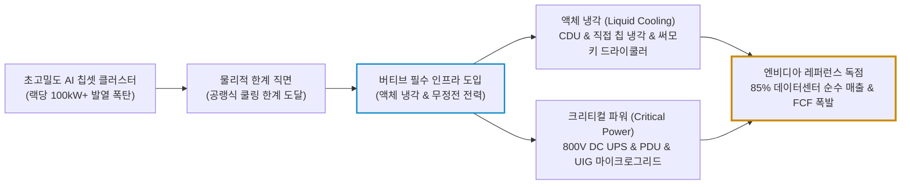
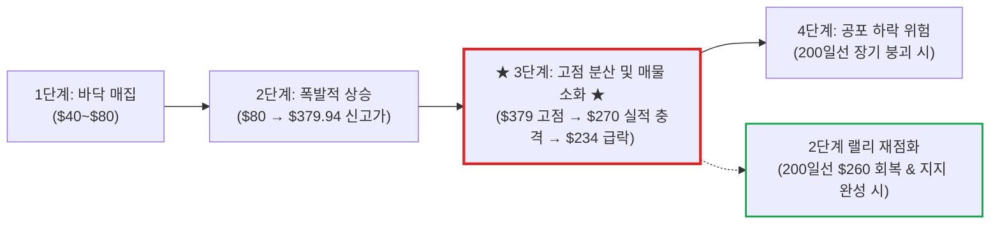

# 버티브 홀딩스(Vertiv Holdings / VRT) 실전 재무 및 독점 가치 분석 보고서

- **작성일**: 2026-09-16
- **데이터 기준**: 2026 회계연도 2분기(2026-06-30 마감, 7월 29일 발표) 실적, 연간 가이던스 상향안, 최근 3개월 핵심 뉴스(2026.06~09) 및 yfinance 시장 데이터(2026-09-15 미국 정규장 종가 기준, 조회일 2026-09-16)

대중은 엔비디아의 차세대 GPU 칩과 메가캡 빅테크의 AI 모델 껍데기에만 환호하지만, 수만 개의 고발열 칩이 뿜어내는 수천 킬로와트의 열을 잡지 못하고 정전 없는 초고밀도 전력을 공급하지 못하면 수십억 달러짜리 AI 데이터센터는 순식간에 작동을 멈추는 실리콘 화로에 불과하다. 버티브(Vertiv Holdings, NYSE: `VRT`)는 글로벌 AI 데이터센터의 숨통을 틀어쥔 '액체 냉각(Liquid Cooling) 및 무정전 전력 인프라(UPS·배전)'의 독점 공급자로서, 2분기 비GAAP EPS YoY +60% 폭증($1.52), 잉여현금흐름(FCF) 9억 2,530만 달러라는 압도적인 현금 창출력을 입증했다. 그러나 2분기 매출 일시 미스(-17.26% 폭락), 8월 국채금리 4.75% 발작(-7.1%), 9월 AI 모델 속도 조절론의 삼중고를 맞으며 주가는 52주 최고가($379.94)에서 $234.61로 -38.2% 수직 낙하해 200일선($259.97)을 밑도는 혹독한 3단계 매물 소화 국면에 갇혀 있다. 냉혹한 숫자와 실전 손익비로 비즈니스 실체와 가격 타당성을 발라낸다.

## 핵심 요약

| 구분 | 핵심 요약 |
| :--- | :--- |
| **종목 및 주가** | 버티브 홀딩스 (NYSE: `VRT`) / **$234.61** (52주 범위 $132.69 ~ $379.94, 고점 대비 **-38.2%**) |
| **최종 투자의견** | **조건부 분할 매수 (Buy on Dip)** / $225~$235 바닥 지지 확인 시 1차 진입, 200일선($259.97) 탈환 시 주력 비중 확대 (투자 가치 점수 **84.0점**, 6.1절) |
| **비즈니스 본질** | AI 하이퍼스케일러 데이터센터 필수 고밀도 액체 냉각(Liquid Cooling) 및 무정전 전력망(UPS·마이크로그리드) 독점 공급 |
| **핵심 매력 (Bull)** | 2분기 EPS YoY +60%($1.52), FCF 9.25억 달러 폭발, 연간 가이던스 상향($140억 / EPS $6.65~$6.75), UIG(14.5억$)·써모키 M&A |
| **핵심 리스크 (Bear)** | 2분기 매출 미스 후 -17.3% 폭락 및 200일선 이탈(3단계 매물 소화), 국채금리 급등 및 AI 속도 조절론 노이즈, 고베타(2.08) 변동성 |
| **포트폴리오 성격** | AI 인프라 핵심 **공격수 위성 포지션(베타 2.08)** / **원금 보존형, 고배당 생활자, 단기 대박 투기꾼은 매수 금지** |

---

## 1. 비즈니스 실체: AI 데이터센터의 숨통을 쥔 '냉각과 전력의 독점 빨대'

대중은 AI 혁명이라고 하면 화려한 생성형 AI 챗봇과 엔비디아의 블랙웰(Blackwell)·루빈(Rubin) GPU만 쳐다본다. 하수들은 소프트웨어 알고리즘이 세상을 바꾼다고 떠들지만, 엔지니어링의 현실은 지극히 물리적이고 가혹하다.

서버 랙(Rack)당 전력 소모량이 과거 10~20kW 수준에서 최신 AI 클러스터에 이르러 **100kW~140kW 이상으로 10배 폭증**했다. 이 정도 전력 밀도에서는 기존의 공랭식(Air Cooling) 에어컨 바람으로는 칩 내부의 열을 식히는 것이 물리적으로 불가능하다. 냉각이 1초만 멈춰도 수천억 원어치의 GPU 클러스터가 서멀 스로틀링(Thermal Throttling)으로 다운되거나 타버린다.

버티브(`VRT`)는 전체 매출의 **약 85%를 데이터센터 인프라에서** 거두는 순수 퓨어플레이어(Pure Play)로서, AI 클러스터가 타 죽지 않도록 피를 돌리고 열을 뽑아내는 **'열관리(Thermal Management)와 전력 관리(Critical Power)'의 글로벌 1위 공급자**다.

### 1.1 양대 핵심 축: 열관리와 전력의 수직 통합 솔루션

- **① 고밀도 액체 냉각 풀루프(Full-Loop Liquid Cooling)**:
    - **냉각수 분배 장치(CDU, Coolant Distribution Unit)**와 직접 칩 냉각(Direct-to-Chip Liquid Cold Plate) 시스템을 설계·제조한다. 차가운 냉각액을 고열의 실리콘 다이에 직접 순환시켜 열을 흡수하고 밖으로 빼내는 구조다.
    - 2026년 6월 인수를 완료한 유럽의 열교환·열방출 강자 **써모키(ThermoKey)**를 통해 데이터센터 실외 드라이쿨러(Dry Cooler) 및 칠러 포트폴리오를 완벽히 내재화했다. 서버 랙 내부의 마이크로 냉각판부터 옥상 냉각탑까지 이어지는 **'전체 냉각 루프(Full-Loop)'를 턴키로 납품할 수 있는 기업은 전 세계에서 사실상 버티브가 유일하다.**
- **② 크리티컬 파워 및 800V DC 차세대 전력 아키텍처**:
    - 대형 데이터센터용 **산업용 무정전 전원장치(UPS), 전력 배전 캐비닛(PDU), 버스웨이(Busway), 정밀 스위치기어**를 장악하고 있다.
    - 특히 **엔비디아의 차세대 AI 반도체 로드맵과 직결되는 800V 직류(DC) 전력 아키텍처**를 선제 구축했다. 기존 교류(AC) 전력망 대비 변환 손실을 획기적으로 줄이고 메가와트(MW)당 매출 창출력을 극대화하여 경쟁사들과의 격차를 벌리고 있다.
- **③ UIG 인수를 통한 'Time to Power' 병목 장악**:
    - 2026년 9월 2일, 버티브는 **유틸리티 인노베이션 그룹(UtilityInnovation Group, UIG)**을 선지급 14.5억 달러(마일스톤 달성 시 최대 11.5억 달러 추가, 총 26억 달러 규모)에 인수한다고 발표했다.
    - 현재 글로벌 하이퍼스케일러들의 최대 골칫거리는 전력망 변전소 인입 지연(Time to Power)이다. 변전소 허가에만 3~5년이 걸리는 병목 상황에서, UIG의 분산 발전 마이크로그리드 제어 소프트웨어와 특수 변전 설비를 결합해 **'전력망 허가 지연과 상관없이 데이터센터를 즉시 조기 가동시키는 독점 솔루션'**을 완성했다.

---

## 2. 최근 3개월 핵심 뉴스 및 실적 흐름 심층 분석 (2026년 6월 ~ 9월)

2026년 6월부터 9월 중순까지의 핵심 뉴스 흐름은 버티브가 **'초고마진 액체 냉각·전력 병목 독점과 적극적 볼트온 M&A로 실적을 폭발시키는 과정'**과, **'매출 일시 미스·국채금리 급등·AI 속도 조절론의 3각 파도로 주가가 혹독하게 얻어맞은 전말'**을 선명하게 드러낸다.

### 2.1 최근 3개월 핵심 타임라인 (팩트 vs 노이즈)

| 일자 | 주요 뉴스 및 시장 이벤트 | 성격 | 스마트머니 관점의 핵심 분석 및 시사점 |
| :---: | :--- | :---: | :--- |
| **09.15** | **AI 모델 개발 속도 조절론 및 인프라 기업 채권 발행 확대 보도에 관련주 동반 급락 (-3.3%)** | `🔴 센티 충격` | 앤스로픽과 오픈AI CEO의 AI 모델 개발 속도 조절 발언과 함께 하이퍼스케일러 및 인프라 기업들의 가을철 고금리 회사채 발행 확대 우려가 대두. VRT를 비롯해 ORCL, GEV, CAT, DELL 등 인프라주 전반이 차익실현 매물로 밀리며 $234.61 마감 |
| **09.02** | **★ 전력망 병목 해소를 위한 UtilityInnovation Group(UIG) 최대 26억 달러 M&A 발표 ★** | `메가 M&A` | 선지급 14.5억 달러(마일스톤 충족 시 11.5억 달러 추가)에 UIG 전격 인수. 데이터센터 인허가 최대 난제인 'Time to Power' 단축 및 마이크로그리드 역량 내재화. DELL 호실적 급등 속 VRT의 전력망 솔루션 수직계열화 단행 |
| **09.01** | **블랙록, 빅테크 부채 급증 경고 속 '인프라 병목 수혜 기업(VRT)' 최선호 지목** | `🟢 스마트머니` | 하이퍼스케일러의 투자등급 회사채 발행이 1,000억 달러를 돌파하며 부채 불확실성이 커진 반면, 전력·냉각 병목을 틀어쥐고 가격 결정력을 행사하는 퓨어플레이어(VRT, CEG, BE)가 자본 효율성과 손익비 측면에서 훨씬 매력적이라고 진단 |
| **08.19** | **미 국채 30년물 2007년래 최고치 및 10년물 4.75% 급등으로 AI 인프라주 일제 투매 (-7.1%)** | `🔴 금리 충격` | 글로벌 국채금리 발작으로 자본집약적 AI 인프라 프로젝트 차질 우려 확산. 52주 저점($132.69) 대비 두 배 가까이 급등했던 버티브에 높은 밸류에이션 부담이 부각되며 하루 만에 -7.1% 급락, FIX(-7.6%), AAON(-6.2%) 동반 하락 |
| **08.10** | **GLJ 리서치, 콜로케이션 및 네오클라우드 성장 가속으로 '매수' 상향 및 목표가 $381 제시** | `🟢 수혜 진단` | 엔드-투-엔드 번들 전략으로 코어위브, 네비우스 등 네오클라우드 및 대형 콜로케이션 수주를 독식하고 있다며 업계 최고치인 목표가 $381을 신규 제시 |
| **08.04** | **월가 주요 IB(키뱅크·골드만·RBC·오펜하이머), 실적 후 목표가 300달러대로 줄하향 속 매수 유지** | `🟢 스마트머니` | 대형 프로젝트 집행 지연으로 인한 2분기 매출 미스를 반영해 목표가를 $301~$337로 하향 조정했으나, 전원 투자의견 '매수/비중확대'를 유지하며 견조한 기저 수요와 수주잔고를 재확인 |
| **07.30** | **CEO 알베르타치, "매출 둔화는 프로젝트 일정 조정일 뿐, 장기 성장 궤도 불변" 진화** | `🟢 경영진 육성` | 실적 발표 직후 주가 폭락 사태에 대해 고객사의 설치 일정 조정에 따른 일시적 현상이라고 단언하며 AI 인프라 수요의 견고함을 재확인 |
| **07.30** | **★ 2분기 실적 발표 직후 매출 컨센 하회 빌미로 주가 -17.26% 일일 폭락 ★** | `🟡 실적 쇼크` | 연준의 매파적 금리 동결(3.50~3.75%) 속 산업재(XLI -3.19%) 급락과 맞물려, 매출 1.1억 달러 미스를 빌미로 프리마켓 -12%에서 본장 -17.26%까지 투매 폭발 |
| **07.29** | **2026 Q2 실적 공시: 비GAAP EPS $1.52(+60%), FCF 9.25억$, 연간 가이던스 상향** | `🟢 어닝 비트` | 매출 32.74억$(YoY +24%), 조정 영업이익률 22.6%(YoY +2.8%p), 조정 FCF 9.25억$(YoY +234%) 기록하며 순차입금을 2.3억 달러까지 축소. 연간 가이던스를 매출 140억 달러, EPS 6.65~6.75달러로 컨센서스 상회 제시 |
| **07.24** | **키뱅크, 데이터센터 매출 비중 85%의 순수 퓨어플레이어로 지목 및 목표가 $360 커버리지** | `🟢 분석 개시` | 하이퍼스케일러의 전력·냉각 수요가 시장 예상보다 훨씬 거대하며, 버티브가 이를 수익화할 가장 유리한 위치에 있다고 분석 |
| **07.17** | **베어드, 800V DC 아키텍처 및 엔비디아 반도체 로드맵 연계로 목표가 $370 커버리지** | `🟢 기술 선도` | MW당 매출 창출력 향상과 고마진 비중 확대를 근거로 Outperform 및 목표가 $370 제시 |
| **07.06** | **UBS, 높은 현금흐름수익률(CFROI) 바탕 3분기 최선호주(Top Pick)로 VRT·NVDA 선정** | `🟢 기관 최선호` | 견조한 CFROI와 자산 성장률 결합, AI 인프라 순풍의 최대 수혜주로 지목 |
| **06.15** | **유럽 열교환·드라이쿨러 전문 기업 써모키(ThermoKey) 인수 완료** | `🟢 포트폴리오` | 이탈리아 생산시설 기반 열 방출 기술 내재화로 고밀도 액체 냉각 풀루프 완성 |
| **06.10** | **바클레이즈, 2028년 800VDC 도입 확대로 버티브의 압도적 outperform 전망** | `🟢 장기 독점` | 광범위한 데이터센터 전력 장비 포트폴리오를 기반으로 2027~2028년 실적이 월가 컨센서스를 대폭 상회할 것으로 예측 |

---

### 2.2 급락의 전말: 7월 30일 실적 쇼크(-17.26%)와 '매출 미스 vs 가이던스 상향'의 괴리

버티브의 주가 흐름에서 가장 결정적인 변곡점은 2026년 7월 29일 장 마감 후 실적 발표 직후인 7월 30일에 터진 **-17.26%의 주가 폭락**이다. 좋은 숫자를 까놓고도 하루 만에 시가총액의 6분의 1이 증발한 이유는 무엇인가?

- **알고리즘이 때려잡은 표면적 핑계 (매출 1.1억 달러 미스)**:
    - 2분기 매출액은 **32억 7,430만 달러(YoY +24.1%, 유기적 성장률 18%)**를 기록했다.
    - 그런데 시장 컨센서스가 33억 8,000만 달러 선에 형성되어 있었기에, 수치상 **1억 1,000만 달러의 매출 미스**가 발생했다. 단기 트레이더와 고평가 피로감에 젖어 있던 헤지펀드들은 이 핑계를 물고 늘어져 기계적 투매 버튼을 눌렀다.
- **실제 숫자가 증명한 펀더멘털의 괴물 같은 폭발**:
    - **조정 EPS**: 전년 동기 $0.95에서 **$1.52로 +60.0% 폭증**하며 컨센서스($1.43)를 0.09달러 여유 있게 상회했다.
    - **조정 영업이익률**: 전년 동기 19.8%에서 **22.6%로 +2.8%p 개선**되며 제품 믹스 개선의 위력을 입증했다.
    - **조정 잉여현금흐름(FCF)**: 전년 동기 2.77억 달러에서 **9억 2,530만 달러로 +234.0% 수직 폭발**했다.
    - **연간 가이던스 상향**: 경영진은 2026년 연간 전체 매출을 **140.0억 달러**, 연간 EPS를 **$6.65~$6.75**로 월가 기대치(매출 $138.8억, EPS $6.48)를 압도하는 수치로 상향 제시했다.
- **진짜 원인은 무엇이었나? (수요 소멸이 아닌 공정 타이밍의 문제)**:
    - 골드만삭스, RBC, 오펜하이머와 알베르타치 CEO가 일제히 확인했듯, 매출 미스의 원인은 고객사 이탈이나 수주 취소가 아니었다.
    - 북미 대형 하이퍼스케일러들의 복합 프로젝트 현장에서 건물 건축 지연과 부품 조달 병목으로 인해 **버티브의 냉각·전력 장비 설치 및 매출 인식 시점이 3분기와 4분기로 밀려난 것(Phasing Issue)**에 불과했다. 즉, 들어올 돈이 다음 분기로 이월된 것뿐인데 시장은 이를 '성장 둔화'로 곡해하여 -17%의 패닉 셀을 연출했다.

---

### 2.3 월가 IB들의 시각: 목표가 300달러대 줄하향의 진짜 의미

실적 발표 직후 월가 주요 IB들은 목표가를 일제히 300달러대로 깎아내렸다. 하수들은 이를 보고 "월가도 버티브를 버렸다"고 공포에 떤다. 숫자를 읽을 줄 아는 스마트머니는 목표가의 방향이 아니라 **투자의견과 하향의 논리**를 본다.

| 투자은행(IB) | 투자의견 | 목표주가 변동 | 핵심 평가 및 스마트머니 시각 |
| :--- | :---: | :---: | :--- |
| **골드만삭스** | **매수** | **$352 ➔ $301** | 공급망 차질로 인한 매출 인식 시점 지연을 반영해 목표가를 조정했으나, EBIT·EPS·가이던스는 기대를 상회. 견조한 수주잔고와 자본배분 여력이 장기 성장을 담보 |
| **키뱅크** | **비중확대** | **$360 ➔ $325** | 프로젝트 일정 지연이 있었으나 기저 수요 모멘텀은 흔들림 없음. 상향된 유기적 성장률이 이를 입증하며 주가 폭락은 과도 |
| **RBC 캐피털** | **아웃퍼폼** | **$418 ➔ $337** | 대형 프로젝트 집행 차질로 2분기 미주 매출이 일시 부진했으나, 글로벌 데이터센터 기저 수요와 수주 파이프라인은 오히려 더 빠르게 확장 중 |
| **오펜하이머** | **아웃퍼폼** | **$353 ➔ $325** | 통합형 솔루션 확대 과정에서의 일시적 시행착오. 펀더멘털 우려는 명백한 과도 반응이며 지난 3년간 증명된 실행력을 신뢰 |
| **GLJ 리서치** | **매수 (상향)** | **신규 $381** | 콜로케이션 및 네오클라우드(코어위브 등) 시장 폭발로 엔드-투-엔드 번들 수요 장악. 업계 최고 목표가 제시 |
| **베어드 / 바클레이즈** | **Outperform** | **$370 / 상향** | 800V DC 아키텍처 도입으로 2027~2028년 실적이 월가 컨센서스를 압도적으로 깰 것으로 전망 |

- **목표가 하향의 본질**: IB들이 목표주가를 내린 것은 회사의 경쟁력이 꺾여서가 아니라, 상반기 주가 급등에 따른 밸류에이션 멀티플을 현실화하고 설치 지연에 따른 단기 수치를 보수적으로 재조정한 것에 불과하다.
- **주목할 팩트**: 목표가를 깎은 모든 하우스(골드만, 키뱅크, RBC, 오펜하이머)가 **'매수(Buy / Outperform)' 의견을 단 한 곳도 철회하지 않았다.** 최저 목표가인 골드만삭스의 $301조차 현재 주가($234.61) 대비 **+28.3%의 상승 여력**을 가리키고 있다.

---

### 2.4 UIG 14.5억 달러 인수와 'Time to Power' 패권 장악

2026년 9월 2일 발표된 **유틸리티 인노베이션 그룹(UIG) 인수**는 버티브의 사업 체질을 한 단계 도약시키는 결정적 사건이다.

- **인수 구조**: 현금 선지급 **14억 5,000만 달러**, 향후 경영 마일스톤 달성에 따른 조건부 지급 최대 **11억 5,000만 달러**, 총 거래 규모 **최대 26억 달러(약 3조 5,000억 원)**의 대형 딜이다.
- **전략적 가치 (Time to Power의 목줄)**:
    - 현재 빅테크들이 직면한 가장 큰 벽은 엔비디아 칩 부족이 아니라 **'데이터센터를 지어놓고도 전력망 연결 승인이 안 나서 스위치를 못 켜는 사태'**다. 미국 전역에서 송전망 인허가에만 3~5년이 걸린다.
    - UIG는 유틸리티 변전소 엔지니어링과 마이크로그리드 제어 소프트웨어의 최강자다. 데이터센터 부지 내에 독립 발전 설비와 배터리(BESS), 변전소를 즉시 패키징하여 전력망 인입 시간을 수년 앞당길 수 있다.
    - 버티브는 랙 내부의 냉각수 순환(써모키)부터 데이터센터 앞마당의 변전 설비(UIG)까지, **'서버 룸과 전력망을 연결하는 전체 물리적 인프라'**를 독점하는 거인으로 거듭났다.

---

### 2.5 국채금리 4.75% 발작과 AI 속도 조절론의 외풍 해부

8월 중순과 9월 중순, 버티브의 주가를 230달러대 바닥으로 끌어내린 주범은 외부 매크로 요인이었다.

- **① 8월 19일 국채금리 발작 (-7.1% 급락)**:
    - 미국 30년물 국채금리가 2007년 이후 최고치로 치솟고 10년물 금리가 4.75%를 돌파하자, 시장은 자본집약적인 AI 인프라 프로젝트의 조달 비용 증가를 우려했다.
    - 52주 저점($132.69) 대비 두 배 가까이 폭등했던 버티브는 밸류에이션 부담이 부각되며 하루 만에 -7.1% 급락했다. 고금리는 고밸류 인프라주에 가차 없는 할인율 역풍으로 작용한다.
- **② 9월 15일 AI 속도 조절론 및 인프라 채권 발행 확대 (-3.3% 하락)**:
    - 앤스로픽과 오픈AI CEO가 AI 모델 개발 속도를 조절해야 한다는 발언을 내놓고, 가을철 인프라 기업들의 고금리 채권 발행 확대 전망이 나오자 단기 투자자들은 또다시 투매에 나섰다.
    - **스마트머니의 반론 (블랙록의 진단)**: 대중은 '속도 조절'이라는 단어에 질려 도망치지만, 블랙록이 정확히 지적했듯 하이퍼스케일러의 부채 발행 급증(1,000억 달러 돌파)은 오히려 **전력과 냉각의 물리적 병목을 쥔 기업의 대체 불가능한 지위**를 증명한다. 모델의 학습 속도가 조절되더라도 이미 착공된 데이터센터의 전력 밀도는 줄어들지 않으며, 오히려 효율적인 냉각 솔루션에 대한 의존도는 더 높아진다.

---

### 2.6 대중의 착시 vs 데이터가 말하는 진실

| 시장이 보고 놀란 것 (착시) | 데이터가 말해주는 진실 (팩트) |
| :--- | :--- |
| **"2분기 매출이 컨센서스를 밑돌았으니 AI 성장이 꺾였다?"** | 하이퍼스케일러의 현장 건축 일정 지연에 따른 **매출 인식 시점 지연(Phasing)**일 뿐이다. 분기 EPS는 +60% 폭증했고, 연간 매출 가이던스는 140억 달러로 오히려 상향됐다 |
| **"월가 IB들이 목표가를 줄줄이 내렸으니 탈출해야 한다?"** | 밸류에이션 멀티플 압축에 맞춘 기술적 하향일 뿐이다. 골드만, 키뱅크, RBC 등 주요 하우스는 **전원 '매수' 의견을 유지**했으며, 최저 목표가($301)도 현재가보다 28% 위에 있다 |
| **"AI 모델 개발 속도 조절론으로 데이터센터 투자가 멈춘다?"** | 개발 중단이 아닌 효율화 국면 진입이다. 전력 소모가 극에 달한 환경에서 칩을 안정적으로 굴리기 위한 **액체 냉각과 전력 인프라 수요는 물리적 필수재**다 |
| **"UIG 인수로 14.5억 달러를 썼으니 현금이 고갈된다?"** | 버티브는 2분기 단 한 분기에만 **FCF 9.25억 달러**를 뽑아냈다. 두 분기 FCF만으로 선지급 인수대금 14.5억 달러를 전액 충당할 수 있는 막강한 현금 창출력을 보유하고 있다 |

---

## 3. 경쟁 해자 및 피어 그룹 잔혹 비교: 액체 냉각과 전력 인프라의 진짜 진입장벽

데이터센터 전력 및 냉각 시장에서 버티브와 맞붙는 피어 그룹들의 허상과 실체를 적나라하게 발라낸다.

| 비교 항목 | 버티브 (Vertiv / `VRT`) | 슈나이더 일렉트릭 (Schneider / `SU.PA`) | 이튼 (Eaton / `ETN`) | 모딘 매뉴팩처링 (Modine / `MOD`) |
| :--- | :---: | :---: | :---: | :---: |
| **데이터센터 매출 순수 비중** | **약 85% (AI 인프라 순수 퓨어플레이)** | 약 20~25% (빌딩·산업 자동화 과다) | 약 20~25% (항공우주·차량 배전 혼재) | 약 30% (차량·상업용 HVAC 위주) |
| **액체 냉각(CDU/칠러) 역량** | **글로벌 선도 (써모키 인수로 풀루프 독점)** | 냉각 솔루션 보유하나 전력 배전 비중 과다 | 액체 냉각 파트너십 위주, 자체 풀루프 부족 | 데이터센터 쿨링 급성장 중이나 전력 솔루션 부재 |
| **전력망 해결력 (Time to Power)** | **UIG 인수로 마이크로그리드·변전 턴키 선점** | 마이크로그리드 강하나 유틸리티 통합 느림 | 변압기 강점 있으나 냉각 통합 솔루션 부재 | 전력망 연계 역량 전무 |
| **차세대 800V DC 아키텍처** | **선제 개발·상용화 착수 (엔비디아 로드맵 정합)** | 개발 진행 중이나 상용화 늦음 | 파트너십 탐색 단계 | 해당 없음 |
| **최근 분기 영업이익률** | **조정 22.6% (YoY +2.8%p 개선)** | 약 18% | 약 23%(전사 기준) | 약 13% |
| **스마트머니 최종 평가** | **압도적 1위 퓨어플레이어 (블랙록·UBS 최선호)** | 덩치만 큰 복합 산업재 | 안정적이나 AI 순수 베타 부족 | 틈새 냉각 부품 공급사 |

- **슈나이더와 이튼의 딜레마**: 슈나이더와 이튼은 훌륭한 대형 산업재 기업이지만, 사업 포트폴리오의 절반 이상이 전통적인 공장 자동화, 주거용·상업용 빌딩 저압 전기, 차량 부품 등에 묶여 있다. 키뱅크가 지적했듯 데이터센터 매출 비중이 85%에 달하는 버티브의 순수성(Pure Play)을 따라올 수 없다.
- **버티브의 독보적 해자 (엔비디아 800V DC 레퍼런스)**: 버티브는 엔비디아와 GB200 NVL72 및 후속 랙 시스템의 액체 냉각 아키텍처를 공동 설계하고, 바클레이즈가 지목한 차세대 **800V DC 전력 시스템을 선점**했다. 칩 설계 단계부터 발열 곡선과 냉각 유량 데이터를 공유하며 표준을 만드는 기업이다. 후발 주자가 카탈로그를 보고 부품을 흉내 낸다고 뚫을 수 있는 시장이 아니다.

---

## 4. 기술적 사이클 위치: 3단계 고점 매물 소화 및 200일선 이탈의 경고

스탠 와인스타인(Stan Weinstein)의 4단계 시장 사이클 모델에 입각해 버티브의 차트와 수급 위치를 냉정하게 판정한다.

### 4.1 현재 위치: 명백한 3단계(천장권 분산 및 매물 소화 국면)

현재 버티브는 **3단계(고점 과열 해소 및 변동성 소화 국면)**의 한가운데에 위치해 있다.

- **하락의 3단계 파도 분석**:
    - **1차 충격 (07.29~07.30)**: 2분기 매출 미스를 빌미로 주가가 $320대에서 하루 만에 **-17.26% 폭락**하며 1차 갭다운 발생.
    - **2차 충격 (08.19)**: 미 국채 10년물 금리가 4.75%로 치솟으며 고밸류 인프라주 투매가 덮쳐 **-7.1% 추가 급락**, 200일선($259.97)을 하향 이탈.
    - **3차 충격 (09.15)**: AI 모델 속도 조절론과 회사채 발행 우려로 **-3.3% 추가 밀리며 $234.61 마감**, 52주 최고가($379.94) 대비 **-38.2% 하락**.
- **기술적 경고**: 기관들이 중장기 추세의 생명선으로 여기는 200일 이동평균선($259.97) 아래로 주가가 내려앉았다. 상단에 물린 실망 매물이 두텁기 때문에, 현 위치에서 $225~$235 구간의 바닥 지지력을 확인하고 200일선을 거래량을 실어 재탈환하기 전까지는 섣부른 추격 매수를 자제해야 한다.

---

## 5. 밸류에이션 및 가격 타당성 검증: 멀티플 부담 vs EPS 고속 성장의 시소게임

버티브의 밸류에이션 지표를 낱낱이 해체하여 숫자가 주는 경고와 기회를 점검한다.

| 밸류에이션 지표 | 현재 수치 | 업종(산업재) 평균 | 스마트머니의 냉혹한 판정 |
| :--- | :---: | :---: | :--- |
| **현재 주가** | **$234.61** | — | 52주 최고가($379.94) 대비 -38.2% 하락 수준 |
| **시가총액** | **$90.32B** (약 122조 원) | — | 대형 인프라 독점 기업 체급 구축 |
| **트레일링 P/E (후행)** | **53.81배** | 약 22~25배 | 과거 12개월 실적 기준으로는 명백한 극단적 고평가 영역 |
| **2026 연간 가이던스 P/E** | **약 35.0배** | 약 20~22배 | 경영진 제시 연간 EPS 중앙값($6.70) 기준 여전히 피어 대비 프리미엄 |
| **포워드 P/E (선행 2027E)** | **25.72배** | 약 18~20배 | 2027년 예상 EPS($9.12) 고성장을 반영해야 비로소 정상 궤도 진입 |
| **주가매출비율 (P/S)** | **7.87배** | 약 1.5~2.5배 | ⚠️ **제조업 기준 역사적 극단 영역** (SaaS 소프트웨어 수준의 고평가) |
| **주가순자산비율 (P/B)** | **18.98배** | 약 3.0~4.5배 | 설비 집약적 하드웨어 기업으로서는 상당한 장부가치 부담 |
| **PEG 배수** | **0.80배** | 1.5~2.0배 | 연 30%+ 고속 성장이 100% 지속된다는 전제하에 성장성 대비 가격 타당 |
| **총 현금성 자산** | **$31.11억** | — | 2분기 FCF 유입으로 대규모 유동성 장전 완료 |
| **총 차입성 부채** | **$33.38억** | — | 차입금/자기자본(Debt/Equity) 70.2%, 통제 가능한 레버리지 |
| **순차입금 (Net Debt)** | **약 $2.27억** | — | 한 분기 FCF(9.25억$)만으로 전액 상환 가능한 **사실상 무차입 수준** |

### 5.1 왜 "아직도 고평가"라는 시장의 의구심이 100% 정당한가

스마트머니나 날카로운 투자자가 차트를 보고 **"고점에서 38% 빠졌는데도 여전히 비싸다"**고 느끼는 것은 대단히 정확하고 날카로운 직관이다. 하수들은 전고점($380)만 보고 "싸졌다"고 착각하지만, 냉혹한 데이터는 다음과 같은 치명적 고평가 징후를 명백히 가리키고 있다.

- **① 하드웨어 제조업체에 씌워진 P/S 7.87배의 멍에**:
    - 버티브는 아무리 AI 액체 냉각 독점이라 포장해도, 본질은 공장에서 철판을 절단하고 구리 배관을 용접하며 냉매와 변압기를 조립해 납품하는 **하드웨어 설비 제조사**다.
    - 매출총이익률이 70~80%에 달하는 클라우드 소프트웨어(SaaS) 독점 기업도 받기 힘든 **P/S 7.87배, P/B 18.98배**를 제조업체가 받고 있다. 전통 전력·냉각 피어인 슈나이더 일렉트릭(P/E 25배), 캐터필러(P/E 17배), 모딘(P/E 22배)과 비교하면 2026년 가이던스 기준 P/E 35.0배조차 어마어마한 밸류에이션 프리미엄을 얹어준 가격표다.
- **② 완전무결함을 강요당하는 가격표 (Priced for Perfection)**:
    - 7월 30일 2분기 실적 발표 직후, 매출이 시장 예상보다 겨우 **1.1억 달러(3.2%) 밑돌았다는 이유 하나로 주가가 하루 만에 -17.26% 폭락**한 진짜 이유가 여기에 있다.
    - 멀티플이 35~54배에 달하는 초고밸류 주식은 **"매출, 영업이익, 납기 일정, 고객사 수주 중 단 1mm의 흠집이나 지연도 용납하지 않는 완벽함"**을 시장으로부터 강요받는다. 고객사 공사 일정이 단 한 달만 밀려도 주가가 15~20%씩 박살 나는 취약성이 바로 고평가의 대가다.
- **③ -38% 하락의 앵커링(Anchoring) 착시**:
    - 최고가 $379.94에서 떨어졌으니 반값 세일처럼 보이지만, 1년 전 52주 저점($132.69)과 비교하면 여전히 **+76.8% 높은 자리**에 있고, 2년 전 주가($30~$40) 대비로는 **6배 이상 폭등해 있는 상태**다.
    - "고점에서 많이 빠졌다"는 것은 가격이 내려앉았다는 뜻일 뿐, 그 자체로 절대적 밸류에이션이 저평가 영역에 진입했다는 보증수표가 결코 아니다.

### 5.2 그럼에도 불구하고 이 주식의 멀티플이 깨지지 않는 단 하나의 이유

그렇다면 왜 월가 IB들과 스마트머니는 이 비싼 주식에 대해 '매도'가 아닌 '매수'를 외치며 84점의 높은 점수를 부여하는가?

- **폭발적인 이익 성장(EPS +60%)과 잉여현금흐름(FCF +234%)의 괴력**:
    - 주가 고평가 거품을 해소하는 방식은 두 가지뿐이다. 주가가 더 폭락해 멀티플을 낮추거나(가격 조정), 주가가 횡보하는 사이 이익과 현금이 폭증해 분모를 채우는 것(기간 조정)이다.
    - 버티브는 2분기에만 **FCF 9억 2,530만 달러**를 벌어들였고, 비GAAP EPS 성장률이 **+60%**에 달했다. 회사가 공언한 2026년 연간 EPS $6.70, 그리고 2027년 EPS $9.12(YoY +36%)가 숫자로 확인된다면, 현재의 230달러대 주가는 2027년 기준 **P/E 25.7배, PEG 0.80배**로 급격히 정상화된다.
- **결론적 행동 지침**: 고평가 논란이 100% 실재하기 때문에 **"지금 손가락을 함부로 얹지 마라"**고 경고한 것이다. $225~$235 바닥 지지를 반드시 확인하고, 200일선($259.97)을 거래량을 싣고 탈환해 밸류에이션 소화가 끝났음을 증명하기 전까지는 철저히 가격대별 분할로만 접근해야 한다.

---

## 6. 종합 평가 및 냉혹한 계좌 실행 원칙

### 6.1 6대 핵심 투자 지표 다차원 평가 매트릭스

| 평가 영역 | 가중치 | 평점 (100점 만점) | 가중 점수 | 등급 | 핵심 평가 요약 |
| :--- | :---: | :---: | :---: | :---: | :--- |
| **① 비즈니스 모델 및 해자** | 25% | **92점** | 23.00 | `S` | 엔비디아 800V DC 공동 설계, UIG·써모키 인수로 풀루프 전력·냉각 장악 |
| **② 실적 성장성 및 가이던스** | 25% | **90점** | 22.50 | `S-` | 2분기 EPS YoY +60%, FCF 9.25억$, 연간 가이던스 $140억 / EPS $6.70 상향 |
| **③ 재무 건전성 및 현금흐름** | 20% | **88점** | 17.60 | `A+` | 분기 FCF 9.25억 달러로 순차입금을 2.3억 달러까지 축소, UIG 인수대금 자체 조달 가능 |
| **④ 밸류에이션 매력도** | 15% | **68점** | 10.20 | `B-` | 후행 PER 53.8배 부담 있으나, PEG 0.80 및 선행 PER 25.7배로 성장성 대비 우수 |
| **⑤ 기술적 매매 타이밍** | 10% | **65점** | 6.50 | `C+` | 고점 대비 -38% 급락, 200일선($260) 하회로 3단계 매물 소화 진행 중 |
| **⑥ 리스크 관리 가능성** | 5% | **84점** | 4.20 | `A` | 200일선 탈환 여부와 손절선($210)을 기준으로 명확한 손절·비중 통제 가능 |
| **종합 가중치 환산 점수** | **100%** | — | **84.0점** | **`Buy`** | **펀더멘털은 최상급이나 기술적 3단계 매물 소화로 철저한 분할 진입 요구** |

---

### 6.2 실전 결론: "그래서 지금 어쩌라는 것인가?" (Action Verdict)

#### ① 지금 당장 전 재산을 몰빵해야 하는가? ➔ **"아니다. 200일선 밑에서 서둘러 손가락 얹지 마라."**
* **이유**: 7월 30일 실적 쇼크(-17.3%), 8월 금리 급등(-7.1%), 9월 AI 속도 조절론(-3.3%)이라는 3각 파도로 주가가 200일선($259.97) 밑으로 주저앉았다. 고점 대비 38% 빠졌다고 흥분해서 떨어지는 칼날을 맨손으로 잡지 마라. 200일선 아래의 주식은 상단의 실망 매물을 소화하기까지 지루한 바닥 다지기를 거쳐야 한다.
* **지금 할 일**: 관심종목 최상단에 두고, $225~$235 구간에서 거래량이 마르며 지지선이 형성되는지, 그리고 200일선을 거래량을 동반해 재탈환하는지 감시하는 '적극적 분할 대기(Sniper Watch)'.

#### ② 이런 주식은 누가 사고, 누가 절대 사면 안 되는가?
* **❌ 절대 사지 마라 (즉시 퇴장)**:
    - 연 5% 이상 배당으로 생활비를 충당해야 하는 고배당 추구자 (배당수익률 0.11%).
    - 계좌 원금이 하루 3~5% 흔들리면 공황에 빠지는 극단적 원금 보존형 투자자.
    - 다음 주에 당장 50% 폭등해야 직성이 풀리는 조급한 단타 투기꾼.
* **⭕ 반드시 눈독 들이고 주워 담아야 할 사람 (스나이퍼 대기)**:
    - AI 혁명의 물리적 병목(냉각과 전력)에서 85% 순수 매출을 거두는 압도적 1위 독점주를 포트폴리오 핵심 공격수로 편입하고자 하는 장기 가치 성장 투자자.
    - 베타 2.08의 높은 변동성을 견디고 고점 대비 38% 눌린 자리에서 손익비 극대화 타점을 노리는 스마트머니.

#### ③ 이 주식으로 단기 '인생 역전(대박)'을 바라면 안 되는 냉혹한 이유
* 버티브의 시가총액은 이미 **900억 달러(약 122조 원)**에 달한다. 코스피 시가총액 최상위권 대기업에 맞먹는 거대 인프라 기업이다. 이런 대형주가 하루아침에 2배, 3배 폭등하는 기적은 일어나지 않는다.
* 단기 폭등을 노리고 덤비면 3단계 매물대의 거센 변동성에 털리기 십상이다. 데이터센터 증설 사이클에 발맞춰 2~3년에 걸쳐 복리로 계좌를 불려 나갈 **'포트폴리오 핵심 공격수'**로 취급해야 한다.

---

### 6.3 실전 가격대별 실행 시나리오 및 분할 매수 로드맵

| 구분 | 실행 조건 | 배정 비중 | 가격 기준 | 실전 대응 방침 |
| :--- | :--- | :---: | :---: | :--- |
| **1차 진입 (선발대)** | 현 가격대 지지력 확인 및 거래량 진정 | **25%** | **$225 ~ $235** | 바닥권 정찰대 구축. 성급한 전량 매수 금지 |
| **2차 매수 (주력)** | **200일선($259.97) 탈환 및 종가 안착 확인** | **40%** | **$255 ~ $265** | **최적의 손익비 타점.** 중장기 추세 복원 확인 후 핵심 비중 적재 |
| **3차 매수 (추세 추격)** | 50일선($275) 돌파 및 1차 갭다운 매물대 소화 | **25%** | **$275 ~ $285** | 3단계 박스권 상단 돌파 확인 후 불타기 완성 |
| **예비 현금** | 매크로 급변 및 추가 투매 대비 | **10%** | — | 200일선 안착 전까지 비상 탄약으로 보존 |
| **손절 / 비중 축소선** | **$225~$235 지지 구간 붕괴 및 추세 훼손 확정** | — | **$210 종가 이탈 시** | **미련 없이 손절 및 비중 50% 이상 축소 후 현금화** |

!!! tip "최종 핵심 제언 (Executive Takeaway)"
    대중은 주가가 380달러 꼭대기에 있을 때는 온갖 장밋빛 환상에 취해 너도나도 추격 매수하다가, 정작 7월의 매출 미스 노이즈, 8월의 금리 발작, 9월의 AI 속도 조절론이라는 세 차례 파도를 맞고 230달러대 바닥으로 밀려나자 공포에 질려 도망치기 바쁘다.

    버티브의 비즈니스는 단 한 걸음도 후퇴하지 않았다. 2분기 FCF 9.25억 달러, 비GAAP EPS +60% 폭증, UIG 인수를 통한 Time to Power 장악은 이 회사가 AI 인프라의 진짜 최상위 포식자임을 증명하고 있다. 대중의 공포와 3단계 매물 소화의 지루함을 기회로 삼아라. 200일선 생명선을 기준점으로 삼고 가격대별 로드맵대로 기계처럼 분할 매수하는 자만이 다음 랠리의 과실을 온전히 거머쥘 것이다.
