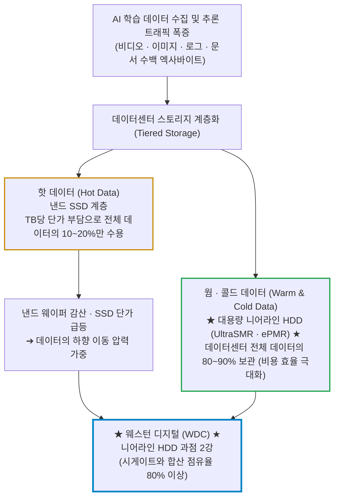
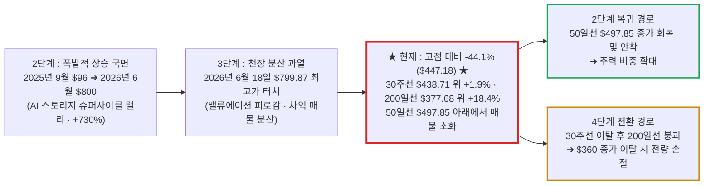

# 웨스턴 디지털(Western Digital / WDC) 실전 재무 및 가치 분석 보고서

- **작성일**: 2026-09-12
- **데이터 기준**: 2026 회계연도 4분기 실적 및 yfinance 시장 데이터 (2026-09-11 종가 기준)

대중이 화려한 AI 모델과 고가 GPU 거품에 취해 껍데기 소프트웨어에 환호할 때, 페타바이트 단위의 AI 학습·추론 데이터를 틀어쥔 '디지털 곡물 창고' 대용량 니어라인 HDD 한 품목으로 52주 고점 대비 -44.1% 폭락해 선행 PER 14배에 팽개쳐진 웨스턴 디지털의 실체와 숫자를 발라낸다. 단 한 분기에 잉여현금흐름(FCF) 12억 8,100만 달러를 쓸어 담고 2026년 대용량 공급 물량을 이미 전량 완판한 과점 기업의 현금 창출력은 결코 거짓말을 하지 않는다.

## 핵심 요약

| 구분 | 핵심 요약 |
| :--- | :--- |
| **종목 및 주가** | 웨스턴 디지털 (NASDAQ: `WDC`) / **$447.18** (52주 범위 $95.98 ~ $799.87, 고점 대비 **-44.1%**) |
| **최종 투자의견** | **적극 분할 매수 (Buy on Dip)** / 3단계 천장 분산 이후 -44% 조정, 30주선($438.71) 지지 구간 $430~$455 선발대 진입 및 50일선($497.85) 돌파 안착 주력 매수 (투자 가치 점수 **88.0점**, 6.1절) |
| **비즈니스 본질** | AI 하이퍼스케일러 데이터센터의 필수 불가결한 '디지털 곡물 창고' 대용량 니어라인(Nearline) HDD 글로벌 과점 2강. 2025년 샌디스크(낸드) 분사 이후 HDD 단일 사업 구조 |
| **핵심 매력 (Bull)** | Q4 매출 $37.5억(+43.8% YoY), 분기 FCF $12.8억, 2026년 공급 물량 완판(LTA 체결), 총부채 $46.8억 ➔ $10.5억 축소 및 순현금 $5.3억 전환 |
| **핵심 리스크 (Bear)** | 고베타(2.18) 변동성, 52주 고점 $799 대비 급락에 따른 $500~$600 상단 악성 매물대, HAMR 전환기 마진 압박(FY27 총마진 45% 선) |
| **포트폴리오 성격** | 거품 청산을 끝낸 **AI 인프라 대형 성장가치주(베타 2.18)** / **30주선·200일선 하방 지지와 선행 PER 14.1배(FY28 컨센서스), 단기 며칠 만의 100% 폭등 노리는 투기꾼은 매수 금지** |

---

## 1. 비즈니스 실체: AI 데이터 폭증의 진짜 목줄과 고용량 스토리지 독점

웨스턴 디지털을 여전히 조립 PC에 들어가는 구식 하드디스크나 꽂아 파는 사양 기업으로 치부하는 자는 클라우드 데이터센터의 물리적 경제학을 전혀 모르는 문외한이다.

대중과 언론은 엔비디아의 블랙웰 GPU와 HBM 메모리 수급에만 온 신경을 빼앗기지만, 냉혹한 데이터센터의 물리 법칙을 직시해라. 초거대 인공지능(AI)을 학습시키고(Training) 24시간 실시간으로 추론(Inference)을 돌리는 과정에서 발생하는 수백 엑사바이트(EB)의 정형·비정형 원시 데이터를 대체 어디에 집어넣을 것인가?

모든 데이터를 고가의 초고속 플래시(SSD)로 채우면 데이터센터 구축 및 전력 비용(TCO)이 천문학적으로 치솟아 마이크로소프트, 구글, 메타, 아마존 같은 빅테크도 파산한다. 결국 데이터센터 전체 용량의 80~90%는 테라바이트(TB)당 저장 비용과 전력 효율이 압도적인 **대용량 니어라인(Nearline) HDD**가 틀어막고, 실시간 연산 투입 구간만 **고성능 낸드 플래시 SSD**가 분담하는 계층화 구조(Tiered Storage)로 갈 수밖에 없다.

웨스턴 디지털은 2025년 낸드 사업부(샌디스크)를 분사해 떼어낸 뒤, 이 계층화 구조의 바닥을 떠받치는 대용량 니어라인 HDD 한 품목에 전사 역량을 몰아넣은 순수 플레이어다. 낸드 가격이 뛰어 올플래시 구축 단가가 올라갈수록 데이터는 HDD 계층으로 더 많이 밀려 내려오므로, 분사는 사업 축소가 아니라 수혜 구조의 단순화였다.

### 1.1 깨지지 않는 과점 해자(Moat)와 높은 진입장벽

데이터 저장장치 산업은 신규 진입자가 발을 들여놓는 것 자체가 불가능한 극단적 과점 시장이다.

| 경쟁 요소 | 구식 레거시 스토리지 | 일반 범용 부품 제조사 | 웨스턴 디지털 (WDC) |
| :--- | :--- | :--- | :--- |
| **시장 구조** | 과거 수십 개 제조사 난립 | 저가형 조립 SSD 난립 | **WDC · 시게이트(STX) 양강 과점 (합산 점유율 80% 이상, 잔여 물량만 3위 도시바 몫)** |
| **핵심 원천 기술** | 물리적 플래터 기록 한계 | 패키징 조립 수준 | **UltraSMR, ePMR(에너지 보조 수직 자기 기록) 및 헤드·미디어 수직 계열화 특허 독점** |
| **자본 지출 장벽 (CapEx)** | 감가상각 부담 파산 속출 | 라인 증설 엄두 불가 | **수조 원 단위의 클린룸 및 나노미터 정밀 헤드/미디어 제조 인프라** |
| **고객사 락인 (Lock-in)** | 단순 단품 납품 | 가격 경쟁 취약 | **글로벌 하이퍼스케일러 CSP와 2026년 장기 공급 계약(LTA) 완판 체결** |

대용량 하드디스크 산업은 과거 수십 개 기업이 피 튀기는 치킨게임을 벌인 끝에 대부분 망해 나갔다. 지금은 웨스턴 디지털과 시게이트(STX)가 시장의 80% 이상을 틀어쥐고 있고, 3위 도시바가 나머지를 주워 담는 구조다. 나노미터 단위로 플래터 위를 비행하는 마그네틱 헤드 기술과 에너지 보조 수직 자기 기록(ePMR), 기록 트랙을 겹쳐 용량을 끌어올리는 UltraSMR는 수십 년간 축적된 특허 장벽으로 둘러싸여 있어 중국조차 흉내 내지 못한다.

공급자가 둘뿐인 시장에서 AI 수요가 폭증하자, 가격 결정권은 완전히 제조사로 넘어왔다. 테라바이트당 판가가 지속적으로 상승하면서 마진이 폭발하고 있는 근본 배경이다.

---

## 2. 최근 실적 흐름과 6월 이후 대폭락(-44%)의 해부: 대중의 착시 vs 숫자의 팩트

### 2.0 6월 최고가($799.87) 이후 -44% 폭락의 4대 전말과 스마트머니의 반전 근거

웨스턴 디지털이 2026년 6월 18일 장중 52주 신고가($799.87)를 터치한 뒤 9월 11일 종가 $447.18까지 **-44.1% 폭락**하며 반토막 난 이유는 회사가 망해 가거나 AI 데이터센터 수요가 꺾여서가 아니다.

직전 1년간 주가가 **+730%(2025년 9월 $96 ➔ 2026년 6월 $800)**나 폭등하며 미래 호재를 한꺼번에 당겨 쓴 상태에서, 월가의 눈높이가 신(God)의 영역까지 치솟았다가 **단기 성장률 둔화 꼬투리를 잡혀 잔혹하게 두들겨 맞은 전형적인 '3단계 천장 분산과 기대치 불일치'**였다.

- **① 6월의 포물선 광기와 밸류에이션 피로감 (과열 천장)**:
    - 6월 18일 팀 쿡 애플 CEO가 "스토리지 칩 원가 폭등으로 기기 가격 인상이 불가피하다"고 발표하자, 시장은 웨스턴 디지털이 스토리지 시장의 절대 권력을 쥐었다며 집단 최면에 빠졌다.
    - 주가는 나흘 만에 $562.93에서 $799.87까지 치솟으며 3단계 과열의 극단적 상투를 잡았다. 2025년 말 종가($172.27) 대비 4.6배, 1년 전 대비 8.3배 폭등한 자리였기에 어떤 사소한 악재에도 차익 매물이 쏟아질 수밖에 없는 '밸류에이션 피로감(Valuation Fatigue)'이 임계점에 달해 있었다.
- **② 7월 기관들의 차익 실현 폭탄과 매크로 발작 (자금 순환매)**:
    - 7월 초 기관투자자들은 상반기 막대한 평가이익을 확정 짓기 위해 대규모 리밸런싱 매도에 나섰다.
    - 여기에 모닝스타가 "삼성전자와 SK하이닉스 증설로 공급이 수요를 추월할 것이며 AI CapEx는 올해가 정점"이라는 비관론 보고서를 내며 20~30% 추가 하락을 경고하자 패닉셀이 촉발됐다.
    - 설상가상으로 중동 지정학 위기 재점화로 유가가 급등하고 금리 인하 지연 공포가 덮치자, 1년 만에 여섯 배 넘게 오른 WDC에서 차익을 실현한 거대 자금들이 금($4,200 돌파)과 비트코인 등 대체 자산으로 이동하는 순환매가 발생했다.
- **③ 8월 5일 장 마감 후 실적 발표의 '눈높이 쇼크' (가장 결정적 폭락 방아쇠)**:
    - 대중은 실적 발표 직후 왜 시간외에서 -10.7%, 이튿날 정규장에서 -13.0%나 폭락했는지 이해하지 못한다. 발표된 팩트와 시장의 왜곡을 대조해 보면 월가의 잔혹함이 드러난다.

| 구분 | 발표된 팩트 | 시장이 꼬투리 잡고 투매한 이유 |
| :--- | :--- | :--- |
| **Q4 실적** | 매출 $37.5억, 비GAAP EPS $3.56 (컨센서스 비트) | 컨센서스는 넘겼지만, 시장 일각의 비공식 과열 기대치(Whisper Number)에는 미달 |
| **Q1 가이던스** | 매출 $41억, EPS $4.00 제시 (컨센서스 비트) | **직전 분기 순이익 증가율(+31%) 대비 Q1 증가율(+12%)이 급격히 둔화**된다며 피크아웃 프레임 적용 |
| **엑사바이트 출하** | 전년 동기 대비 +22% 증가 | 판매 제품 믹스 변화로 출하량 증가율이 장기 목표치(25%)를 밑돌았다고 트집 |

    - 월가는 주가가 800달러까지 치솟는 동안 매 분기 기적 같은 가속만을 요구했다. 그러나 경영진이 보수적인 가이던스(순이익 증가율 12% 둔화)를 제시하자, 기관들은 "단기 성장의 정점은 지났다"며 시간외에서 $463.50(-10.7%)까지, 이튿날 정규장에서 $451.52(-13.0%)까지 주가를 단숨에 패대기쳤다.
- **④ 경쟁사 시게이트(STX) 대비 마진 열세 및 HAMR 기술 전환 우려**:
    - UBS(목표가 $560 ➔ $525)와 웨드부시 등은 실적 발표 직후 "마진율과 EPS 성장 탄력성에서 경쟁사인 시게이트(STX) 대비 웨스턴 디지털의 열세가 뚜렷했다"고 평가하며 주가에 찬물을 끼얹었다. 강세론을 유지하던 씨티마저 목표가를 $800에서 $740으로 내렸다.
    - 서밋 인사이트 역시 차세대 저장 기술인 HAMR(열 보조 자기 기록)로 넘어가는 과도기에서 수율과 마진 하락 압력(FY27 총마진 45.4% 전망)이 불가피하다며 투자의견을 매수에서 보유로 하향 조정했다.

#### 지금 이런 문제가 해결되어 앞으로 오른다고 보는가? (스마트 머니의 4대 반전 근거)

모든 문제가 마법처럼 100% 증발해서 오르는 게 아니다. 주식시장은 모든 악재가 완전히 사라진 뒤에 사면 이미 저 위에서 또 상투를 잡게 된다. 스마트 머니가 지금 웨스턴 디지털을 담는 이유는 **"단기 급등 거품이 완전히 털려 나갔고, 2026년 캐파 완판이 숫자로 확인되며 2029~2031년 초장기 계약 협상이 진행 중이고, 30주선과 200일선이 하방을 받치고 있기 때문"**이다.

- **① 2026년 캐파 완판 및 2029~2031년 초장기 공급계약(LTA) 협상 진행**:
    - 빅테크 하이퍼스케일러들은 이미 2026년 물량을 전량 계약 완료했다. 단순한 구두 계약에 그치지 않고 2029년부터 2031년까지의 물량을 미리 확보하기 위해 WDC와 초장기 LTA 협상을 벌이고 있다. AI 추론과 피지컬 AI 확산으로 스토리지 수요는 향후 수년간 꺾일 수 없다.
- **② HDD 수요 초과의 물리적 진실 (수요 40~50% vs 공급 30~35%)**:
    - 모건스탠리 실측 데이터상 연간 대용량 니어라인 HDD 수요 증가율(40~50%)은 증설 속도(30~35%)를 지속적으로 웃돌고 있다. 데이터센터용 니어라인 드라이브의 테라바이트(TB)당 가격이 현재 $15에서 3년 내 $25~$30으로 2배 폭등할 수밖에 없는 공급 쇼티지 구조다.
- **③ 부채 77% 소각 및 순현금(Net Cash) 우량 기업으로의 질적 체질 개선**:
    - 회사는 1년간 벌어들인 막대한 현금으로 부채를 잔혹하게 소각했다. 총부채는 46.8억 달러에서 10.5억 달러로 급감했고, 보유 현금(15.79억 달러)이 부채를 넘어서는 순현금 5.3억 달러 구조를 달성했다. 이자 비용 부담이 미미해졌으므로 금리 변동성에도 흔들리지 않는다.
- **④ 30주선·200일선($377.68) 지지와 선행 PER 14배의 안전마진**:
    - 6월의 800달러가 탐욕의 오버슈팅이었다면, 지금의 447달러는 과도한 공포가 깎아낸 가격이다. 로젠블랫은 목표가를 $900에서 $800으로 내리면서도 *"FY28 EPS $40 도달 경로 감안 시 $375~$400은 강력한 매수 기회"*라고 못 박았다. 월가 평균 목표가는 $664.92(현재 대비 +48.7%), 최고 목표가는 $1,050(+134.8%)이며, 모틀리풀은 모건스탠리의 FY29 EPS 추정치 $44.83에 나스닥100 평균 PER 26배를 적용해 3년 목표가 **$1,165(+160.5%)**를 계산해 냈다. 하방은 이동평균선이 받치고 상방은 열려 있는 손익비 자리다.

---

### 2.1 최근 3개월 핵심 뉴스 타임라인 (2026.06.09 ~ 2026.08.26)

지난 3개월간 웨스턴 디지털을 둘러싼 22건의 핵심 이벤트는 **'AI 스토리지 슈퍼사이클과 애플의 원가 상승 인정에 따른 52주 최고가($799.87) 폭등 ➔ 반도체 섹터 순환매 및 가이던스 눈높이 미달로 인한 고점 대비 -44% 급락 ➔ 2029~2031년 초장기 공급계약(LTA) 논의 및 3년 목표가 $1,165 전망에 따른 저가 매수세 유입'**으로 요약된다. 대중이 단기 주가 급락과 가이던스 노이즈에 공포를 느낄 때, 스마트 머니는 200일선 위에서 분할 매수에 나섰다.

| 일자 | 주요 뉴스 및 시장 이벤트 | 영향도 | 스마트머니 관점의 핵심 분석 및 시사점 |
| :--- | :--- | :---: | :--- |
| **08.26** | **모틀리풀·모건스탠리, "WDC 3년 내 160% 상승 잠재력... FY29 EPS $44.83, 3년 목표가 $1,165" 분석** | `🟢 메가 리포트` | AI 데이터센터 스토리지 공급난의 최대 승자는 HDD 과점 사업자인 WDC라고 평가. 2026년 캐파 완판에 이어 2029~2031년 초장기 LTA 논의 중. 연간 HDD 수요 증가율(40~50%)이 공급(30~35%)을 압도하며 니어라인 TB당 가격이 $15에서 $25~$30으로 급등 전망. 선행 PER 14배에서 나스닥100 평균(26배) 회복 시 3년간 연평균 38% 상승 여력 제시. 당일 주가 +4.02% 반등 |
| **08.24** | **알리바바 100억 달러 신주 발행 AI 투자 확대 속 반도체·메모리 섹터 동반 약세** | `🔴 단기 수급` | 빅테크의 막대한 AI 자금 조달 소식에도 불구하고 단기 차익 실현 및 매크로 우려로 WDC -5.24%, SNDK -6.45%, MU -5.83% 하락. 고점 대비 40% 이상 조정을 거친 구간에서 쏟아지는 전형적인 막바지 투매 물량 |
| **08.17** | **미 상무장관, 애플의 중국산 메모리 구입 반대 표명... 미국산 스토리지 반사 수혜 반등** | `🟢 정책 수혜` | 러트닉 상무장관이 국가 안보를 이유로 애플의 중국 메모리 채택에 제동을 걸자 미국 대표 제조사 반등(WDC +5.35%, SNDK +8.88%, MU +4.13%). 글로벌 지정학 갈등이 오히려 미국 과점 스토리지 기업들의 공급 지배력을 강화하는 강력한 방패막이 역할 |
| **08.13** | **샌디스크 인베스터 데이 장기 로드맵 발표(총마진 80%, FCF 마진 50%)에 스토리지 섹터 폭등** | `🟢 업황 폭발` | 메모리 ETF(DRAM +3.89%) 급등 속 샌디스크 +13.67%, WDC +7.31%, 마이크론 +4.23% 동반 랠리. 2028년 출하량의 66%를 8대 고객사 장기 계약으로 묶어 메모리 고유의 시클리컬 변동성을 사실상 해체했다는 평가 |
| **08.07** | **실적 발표 후 글로벌 IB 목표가 조정 분열: 가격결정력 유지 vs 시게이트 대비 보수적 가이던스** | `🟡 쟁점 분열` | TD코웬(목표가 $500 ➔ $540 상향, 니어라인 판가 강세)은 저평가를 강조한 반면, 로젠블랫($900 ➔ $800), UBS($560 ➔ $525), 씨티($800 ➔ $740)는 목표가를 줄줄이 내렸다. 다만 로젠블랫은 "FY28 EPS $40 도달 감안 시 $375~$400은 강력한 매수 기회"라는 단서를 달았다. 당일 주가 -3.81%($434.30) |
| **08.07** | **AI 주도주 단기 피로감 속 대체자산(금·비트코인) 자금 순환매 조짐 보도** | `🔴 자금 분산` | 직전 1년간 WDC +483%, SNDK +2,880% 폭등에 따른 차익 실현 물량이 금과 암호화폐로 일시 이동. 그러나 하이퍼스케일러의 필수 인프라인 스토리지 실적 펀더멘털은 훼손되지 않는 일시적 유동성 노이즈 |
| **08.06** | **★ 실적 서프라이즈에도 성장 둔화를 빌미로 정규장 -13.03% 폭락($451.52) ★** | `🔴 눈높이 쇼크` | 시간외 $463.50(-10.7%)에서 시작된 낙폭이 정규장에서 -13.03%까지 확대. 직전 분기 대비 순이익 증가율 둔화(+31% ➔ +12%)를 구실 삼은 기계적 매도가 쏟아졌다. 시장의 비이성적 눈높이가 빚어낸 역대급 가격 왜곡 |
| **08.06** | **서밋 인사이트, HAMR 기술 전환기 마진 하락 우려 제기하며 투자의견 '보유' 하향** | `🟡 기술 리스크` | 40TB 이상 제품군이 차세대 열 보조 자기 기록(HAMR)으로 전환되는 과정에서 일시적 수율 및 마진 하락 압력(FY27 총마진 전망 45.4%)이 발생할 수 있다고 경고. 단기 주가 조정의 기술적 명분 제공 |
| **08.05** | **FY26 Q4 호실적 및 Q1 가이던스 발표 (장 마감 후)** | `🟢 실적 서프라이즈` | 4분기 매출 $37.5억(+43.8% YoY), 비GAAP EPS $3.56으로 컨센서스($3.30)를 +7.9% 상회. Q1 가이던스도 매출 $41억(전년 동기 대비 +45%), EPS $4.00으로 제시하며 최근 5개 분기 연속 컨센서스 상회 기록 유지 |
| **08.05** | **Irving Tan CEO "AI 추론 및 피지컬 AI 확산으로 2029~2031년 초장기 공급계약(LTA) 논의 중"** | `🟢 장기 수요` | 실적 컨퍼런스콜에서 경영진이 장기 공급계약 확대를 공식 언급. 인공지능이 단순 훈련을 넘어 추론과 피지컬 AI로 진화함에 따라 폭발하는 저장장치 수요를 빅테크들이 미리 선점하려는 쟁탈전 확인 |
| **07.21** | **UBS HOLT 분석: "반도체 조정은 절호의 매수 기회... WDC·AVGO·STX 펀더멘털 개선주 선별"** | `🟢 스마트머니` | 6월 말 이후 기술주 급락 속에서도 현금흐름수익률(CFROI)이 지속 개선되고 가치평가상 상승 여력이 높은 10대 핵심주로 WDC와 브로드컴, 시게이트, 마이크론 등을 선별 추천. 당일 WDC +12.51% 급반등 |
| **07.16** | **넷플릭스 실적 실망 등 빅테크 매크로 조정 속 메모리·스토리지 섹터 동반 약세** | `🔴 매크로 조정` | 넷플릭스 가이던스 실망과 알파벳 제미나이 업데이트 지연 등 기술주 투자 심리가 냉각되며 WDC는 7월 15~16일 이틀간 -17.1%(-8.78%, -9.15%), MU -5.65% 급락. 개별 펀더멘털과 무관한 지수 연동성 하락 |
| **07.08** | **톰 리(펀드스트랫) "구조적 AI 강세 유지, 조정은 매수 기회" 발언 및 WDC +3.42% 저가 반등** | `🟢 저가 매수` | 중동 분쟁 및 하이퍼스케일러 투자 둔화 우려로 흔들리던 주가가 저가 매수세 유입으로 $550.30 회복. SK하이닉스 미국 ADR 상장 추진과 함께 AI 하드웨어 장기 수혜론 재부각 |
| **07.07** | **트럼프 이란 휴전 종료 발언 및 유가 급등 속 메모리 섹터 일제히 하락** | `🔴 지정학 노이즈` | 중동 지정학 위기 재점화로 원자재 및 유가가 반등하자 기술주 전반에 인플레이션 할인율 부담 작용. WDC -7.86%, SNDK -7.26%, MU -4.71% 하락 |
| **07.02** | **기관 리밸런싱 및 차익 실현 폭탄에 메모리주 일제 급락 (WDC -9.92%, $539.00 마감)** | `🔴 차익 출회` | 6월 26일 -13.17%에 이은 연쇄 투매. 모닝스타의 20~30% 추가 하락 경고(증설로 공급이 수요 추월, AI CapEx 피크 우려)와 분기 초 기관 리밸런싱 매도세가 겹치며 DRAM ETF -7.94% 급락. 반면 BofA는 7월 1일 샌디스크 목표가를 $2,100 ➔ $2,500으로 올리며 강세론 팽팽 대립 |
| **06.25** | **마이크론 FQ3 서프라이즈(EPS $25.11 vs 예상 $20.69) 후폭풍에 WDC +4.90%($675.39), SNDK +21.97% 폭등** | `🟢 실적 훈풍` | 마이크론의 압도적 호실적이 메모리·스토리지 섹터 전반의 강력한 가격결정력을 증명하며 매수세 폭발. 높은 밸류에이션을 실적이 정당화한다는 시장 합의 형성 |
| **06.24** | **에버코어 "AI 인프라 투자 지속으로 HBM뿐 아니라 HDD·SSD 스토리지 수요도 슈퍼사이클"** | `🟢 사이클 확신` | 메모리 업사이클 지속성에 대한 월가 우려 해소. 고점 대비 조정(당일 -4.01%)이 진행되는 국면에서도 AI 서버 필수 인프라로서의 니어라인 HDD 희소성 가치 부각 |
| **06.23** | **코스피 9,000 돌파 후 -10% 급락 여파로 글로벌 반도체 동반 투매... 웨드부시 "매수 기회"** | `🟡 과열 청산` | 한국 증시 급락 충격이 전이되며 WDC -8.45%, MU -13.18%, 메모리 ETF(DRAM) -14.25% 급락. 그러나 댄 아이브스(웨드부시)는 "공급망 조사 결과 AI 인프라 구축 수요는 가속 중이며 이번 조정은 과열 해소의 선물"이라 진단 |
| **06.18** | **★ 팀 쿡 애플 CEO "스토리지 칩 원가 폭등으로 제품 가격 인상 불가피" 발언에 주가 +4.79% ★** | `🟢 가격결정력` | 세계 최대의 IT 하드웨어 바이어인 애플이 스토리지 부품 원가 상승을 견디지 못하고 소비자 가격 전가를 공식화. WDC $746.23 마감 및 장중 52주 최고가($799.87) 터치 |
| **06.15** | **모건스탠리, WDC 목표주가 $488 ➔ $650 파격 상향... 주가 하루 +16.09% 폭등** | `🟢 목표가 상향` | 호르무즈 해협 재개방 기대감 및 AI 스토리지 수혜 재평가에 힘입어 $653.53 마감, 이튿날에도 +4.22%($681.08) 랠리 지속. 피어 그룹 대비 차별화된 상승 전개 |
| **06.12** | **JPM, "HDD 가격 인상 매분기 한 자릿수 중반 지속" WDC 목표가 $530 ➔ $650 상향** | `🟢 가격 인상` | SK하이닉스의 10년 웨이퍼 대규모 증설 계획 발표에도 불구하고, 시장에서는 AI 데이터 폭증을 충족하기에 턱없이 부족하다고 판단. 6월 11일 +8.00%($529.29)에 이어 12일 +6.36%($562.93)로 연속 급등 |
| **06.09** | **미즈호, "NAND 공급 부족 심화... 2026년 웨이퍼 생산 -5% 감소" WDC 목표가 $550 ➔ $685 상향** | `🟢 공급 부족` | 낸드 웨이퍼 증설이 막히면 eSSD 단가가 뛰고, 데이터는 값싼 니어라인 HDD 계층으로 밀려 내려온다는 논리. WDC 투자의견 Outperform 유지 및 목표가 상향 |

출처: yfinance `WDC` 일봉·`upgrades_downgrades`·분기 재무제표, 주요 투자은행(IB: 모건스탠리, JPM, BofA, UBS, 미즈호, TD코웬, 로젠블랫, 씨티) 리서치 보고서 및 SEC 공시.

---

### 2.2 뉴스 흐름으로 본 4대 핵심 구조적 변화와 스마트머니의 의도

지난 3개월간 쏟아진 22건의 뉴스 타임라인을 관통하는 거대 자본의 진짜 의도와 **4대 구조적 판도 변화**는 명확하다.

- **① 6월 '애플의 항복'과 스토리지 가격결정권의 독점화**:
    - 6월 18일 팀 쿡 애플 CEO가 스토리지 칩 원가 폭등을 견디지 못하고 아이폰·맥북 등 제품 가격 인상을 공식 선언한 사건은 산업 지형도의 일대 전환점이었다. 세계 최대의 '슈퍼 갑' 고객사가 부품 원가 상승을 인정하고 소비자에게 가격을 전가하겠다고 항복한 것이다.
    - JPM과 미즈호가 분석했듯, HDD와 낸드 공급자들은 매 분기 한 자릿수 중반대의 가격 인상을 관철시키고 있다. 주가는 이 모멘텀을 타고 6월 중순 장중 $799.87(52주 최고가)까지 수직 폭등하며 3단계 과열의 정점을 찍었다.
- **② 2029~2031년 초장기 공급계약(LTA)과 HDD 수요 초과의 실체**:
    - 8월 5일 실적 컨퍼런스콜에서 Irving Tan CEO가 폭로했듯, 글로벌 빅테크들은 이미 2026년 공급 물량을 전량 사들인 것도 모자라 **2029년부터 2031년까지의 초장기 공급계약(LTA)**을 따내기 위해 협상 테이블에 줄을 서 있다.
    - 모건스탠리의 실측 데이터에 따르면 연간 대용량 니어라인 HDD 수요 증가율(40~50%)은 물리적 증설 속도(30~35%)를 압도하고 있다. 데이터센터용 고용량 니어라인의 테라바이트(TB)당 가격이 현재 $15 선에서 3년 내 $25~$30으로 2배 폭등할 수밖에 없는 물리적 이유다.
- **③ 8월 실적 발표 직후 '가이던스 눈높이 쇼크'와 -44% 거품 청산**:
    - 8월 5일 장 마감 후 발표한 회계연도 4분기 실적(매출 $37.5억, 비GAAP EPS $3.56)은 컨센서스($3.30)를 7.9% 상회했고, 다음 분기 가이던스(매출 $41억, EPS $4.00)도 전년 동기 대비 45% 성장을 담고 있었다.
    - 그럼에도 주가가 시간외 -10.7%, 이튿날 정규장 -13.03% 폭락하고 이후 $447선까지 -44.1% 추락한 이유는, 2025년 말 대비 4배 이상 폭등한 주가에 취해 직전 분기(순이익 증가율 +31%) 이상의 기적을 기대했던 시장의 과도한 눈높이 때문이었다. 실적 쇼크가 아니라 3단계 천장 분산 국면에서 쌓였던 밸류에이션 거품을 잔혹하게 털어내는 과정이었다.
- **④ 월가 시각 분열(단기 노이즈) vs 3년 내 160% 폭등($1,165) 전망**:
    - 월가의 단기 트레이더들은 서밋 인사이트의 HAMR 전환기 마진 둔화 우려나 시게이트 대비 보수적인 단기 가이던스를 핑계 삼아 주가를 200일선($377.68) 상단인 $447선까지 내리눌렀다.
    - 그러나 로젠블랫이 일갈했듯 *"FY28 EPS $40 도달 경로 감안 시 $375~$400은 강력한 매수 기회"*이며, 월가 평균 목표가는 $664.92(현재가 대비 +48.7%), 모틀리풀이 모건스탠리의 FY29 EPS 추정치 $44.83에 나스닥100 평균 PER 26배를 적용해 계산한 3년 목표가는 **$1,165(+160.5%)**다. 대중이 단기 실적 가이던스 둔화에 겁을 먹고 던질 때, 스마트 머니는 200일선 위에서 역사상 가장 거대한 현금 창출력을 지닌 과점주를 주워 담고 있다.

---

### 2.3 최근 실적과 시장의 오독: 대중의 착시 vs 숫자의 팩트

언론의 호들갑과 고점 대비 -44% 급락 뒤에 숨겨진 차가운 숫자를 대조해라. 시장이 무엇을 오해하고 있는지 단번에 드러난다.

| 시장이 보고 놀란 것 (착시) | 데이터가 말해주는 진실 (팩트) |
| :--- | :--- |
| **"주가가 $799에서 $447로 반토막 났으니 AI 스토리지 붐도 끝났다"** | 단기 급등에 따른 멀티플 거품 청산일 뿐이다. 회사의 2026년 데이터센터 공급 물량은 **이미 전량 완판**되었으며, 하이퍼스케일러들은 2029~2031년 물량을 배정받기 위해 초장기 공급 계약(LTA)을 협상하고 있다. |
| **"메모리 시클리컬 기업이니 언제든 다시 적자로 곤두박질칠 것이다"** | 과거의 웨스턴 디지털이 아니다. 최근 분기 단 한 분기에만 **영업현금흐름 13억 8,900만 달러**, **잉여현금흐름(FCF) 12억 8,100만 달러**를 쏟아냈다. FY26 연간 FCF는 **35억 1,100만 달러**로 전년(12억 7,900만 달러)의 2.7배다. |
| **"매출총이익률 48.9%는 역사적 고점이며 곧 마진이 꺾일 것이다"** | 테라바이트당 판가 상승세가 유지되고 있으며 수요 증가율(40~50%)이 공급(30~35%)을 초과하므로, 다음 분기(FY27 Q1)도 **매출 $41억(전년 동기 대비 +45%) 가이던스**를 제시했다. 다만 HAMR 전환기인 FY27에 총마진이 45% 선으로 일시 눌릴 수 있다는 점은 감수해야 한다. |
| **"막대한 차입금 때문에 금리 부담에 짓눌릴 것이다"** | 회사는 최근 1년간 벌어들인 막대한 현금으로 부채를 잔혹하게 소각했다. 총부채는 46.8억 달러에서 **10.5억 달러로 급감**했고, 보유 현금(15.79억 달러)이 부채보다 많은 **순현금 5.3억 달러의 우량 재무 구조**로 완벽히 탈바꿈했다. |

---

### 2.4 숫자로 증명된 폭발적 펀더멘털

- **매출 폭증과 마진 정상화**: 2026 회계연도 4분기 매출은 **37억 4,700만 달러**로 전년 동기 대비 **43.8% 급증**했다. 비GAAP EPS는 **$3.56**으로 시장 예상치를 압도했다.
- **현금 창출력의 극대화**: 분기 영업활동현금흐름 **13.89억 달러**, FCF **12.81억 달러**를 기록했다. FY26 한 해로 묶으면 영업활동현금흐름 39.29억 달러, FCF 35.11억 달러다.
- **대차대조표 대청소 완료**: 과거 샌디스크 인수 등으로 짊어졌던 악성 부채를 대거 청산하여 총부채를 10.5억 달러 수준으로 줄였다. 이로써 이자 비용 부담이 미미해졌고, 주주환원도 이미 집행 단계다. 4분기에만 자사주 6.72억 달러를 매입했고 연 $0.60의 배당을 지급하고 있다.

---

## 3. 경쟁 해자 및 피어 그룹 잔혹 비교

데이터 스토리지 및 메모리 인프라 피어 그룹의 냉혹한 숫자를 한 테이블에 올려놓고 비교해라. 왜 웨스턴 디지털이 현재 가장 매력적인 가격표를 달고 있는지 드러난다.

| 티커 | 기업명 | 현재가 | 52주 최고가 | 고점 대비 낙폭 | 200일선 괴리율 | 선행 P/E | 최근 12개월 FCF | 매출총이익률 (GM) | 베타 | 판정 및 진입 자리 |
| :---: | :--- | ---: | ---: | ---: | ---: | ---: | ---: | ---: | ---: | :--- |
| **WDC** | **웨스턴 디지털** | **$447.18** | **$799.87** | **-44.1%** | **+18.4%** | **14.1배** | **$35.1억** | **48.9%** | **2.18** | **적극 매수 (낙폭 1위, 200일선 이격 최소로 손익비 우위)** |
| **STX** | 시게이트 테크놀로지 | $830.17 | $1,145.00 | -27.5% | +37.7% | 15.0배 | $31.1억 | 45.6% | 2.09 | **조건부 관망 (200일선 이격 과열, 되돌림 시 -27%)** |
| **MU** | 마이크론 테크놀로지 | $975.26 | $1,255.00 | -22.3% | +57.8% | 6.3배 | $261.7억 | 72.6% | 2.22 | **보유 (HBM 수혜 강력하나 200일선 괴리 +58% 부담)** |
| **NTAP** | 넷앱 | $199.28 | $209.06 | -4.7% | +51.2% | 18.0배 | $16.5억 | 70.6% | 1.43 | **매수 보류 (신고가 부근 추격 매수 위험)** |

시게이트(STX)가 고점 대비 -27.5% 조정받고 200일선 위로 +37.7% 떠 있는 동안, 웨스턴 디지털은 무려 **-44.1% 폭락**하여 거품을 완전히 걷어냈다.

트레일링 PER은 WDC 16.6배, STX 59.8배로 격차가 극단적으로 보이지만 이 숫자를 곧이곧대로 믿으면 안 된다. WDC의 FY26 순이익(92.98억 달러)에는 샌디스크 지분을 정리하며 발생한 대규모 일회성 이익이 섞여 있어, 영업 실적만 반영한 비GAAP 기준(FY26 EPS $10.19)으로 환산하면 43.9배다. 제대로 된 잣대는 **선행 PER 14.1배(FY28 컨센서스 EPS $31.75) 대 STX 15.0배**이며, 여기서 둘의 멀티플은 사실상 대등하다. 같은 값이면 낙폭이 두 배 크고 200일선이 발밑에 있으며 재무가 순현금인 쪽을 사는 것이 산수다.

---

### 3.1 정면 승부: 왜 시게이트(STX)에 밀리는 '만년 2등주' 취급을 받는가? (규모인가, 기술인가?)

시장의 표면적 통념만 믿는 자들은 묻는다. *"스토리지 대장주는 시게이트(STX) 아닌가? 웨스턴 디지털은 기술도 밀리고 규모도 작은 만년 2등주 아닌가?"*

단언컨대, 이것은 **스토리와 마케팅에 속아 실제 기업 재무제표와 공장 라인을 단 한 번도 까보지 않은 자들의 무지한 편견**이다.

#### ① 팩트 체크: 웨스턴 디지털은 시게이트보다 결코 작지 않다 (오히려 더 크다)
두 회사의 실적과 재무제표를 1:1로 발가벗겨 대조해라. 규모든 마진이든 현금흐름이든 웨스턴 디지털이 시게이트를 압도한다.

1. **FY26 매출**: WDC **129억 1,900만 달러** vs STX 121억 9,500만 달러 (WDC 우위)
2. **FY26 잉여현금흐름(FCF)**: WDC **35억 1,100만 달러** vs STX 31억 500만 달러 (WDC 우위)
3. **FY26 매출총이익률(Gross Margin)**: WDC **48.9%** vs STX 45.6% (WDC 우위)
4. **FY26 영업이익률(Operating Margin)**: WDC **35.6%**(영업이익 46억 달러) vs STX 34.7%(42억 3,000만 달러) (WDC 대등 이상)
5. **대차대조표(순현금 vs 순차입금)**:
    - WDC는 총부채 10억 5,200만 달러, 보유 현금 15억 7,900만 달러로 **순현금(Net Cash) 5억 2,700만 달러**의 초우량 클린 컴퍼니다.
    - 반면 STX는 총부채 38억 5,800만 달러, 보유 현금 17억 400만 달러로 **순차입금(Net Debt)이 21억 5,400만 달러**에 달하는 채무 부담을 안고 있다.

#### ② 그렇다면 왜 시장은 WDC를 '2등주'로 디스카운트해 왔는가? (3대 본질적 이유)

1. **순수 HDD(Pure-play) vs 복합 기업(Conglomerate) 디스카운트**:
    - 시게이트는 HDD 단일 품목에만 집중하는 순수 플레이어(Pure-play)로 평가받아 경기 사이클 해석이 단순했다.
    - 반면 웨스턴 디지털은 2016년 샌디스크(SanDisk) 인수 이후 'HDD + 낸드 플래시' 복합 기업 구조였다. 낸드 메모리 시장의 혹독한 치킨게임과 적자 사이클이 터질 때마다 HDD의 견고한 이익을 낸드가 갉아먹었다. FY24 영업이익이 9,700만 달러에 그친 것이 그 시절의 성적표다. 이 때문에 시장은 WDC에 지독한 **'복합 기업 디스카운트'**와 **'메모리 시클리컬 할인'**을 부여했다. 2025년 낸드 분사(Spin-off)를 완료해 독자 HDD 강자로 거듭나고 FY26 영업이익을 46억 달러까지 끌어올렸음에도, 관성에 젖은 월가는 여전히 WDC를 메모리 잡주 다루듯 취급하고 있다.
2. **기술 로드맵의 마케팅 내러티브 착시 (HAMR의 환상 vs ePMR/UltraSMR의 실속)**:
    - 시게이트는 차세대 열 보조 자기 기록(HAMR, Heat-Assisted Magnetic Recording) 기술을 5년 넘게 언론에 대대적으로 선전하며 *"차세대 30TB+ 스토리지는 우리만 만들 수 있다"*는 강력한 혁신 프레임을 월가에 주입했다.
    - 반면 웨스턴 디지털은 HAMR이라는 화려한 구호 대신, 기존 수직 자기 기록을 극대화한 **ePMR(에너지 보조 수직 자기 기록)**과 독보적인 **UltraSMR** 기술을 결합하는 실용적 노선을 택했다. 그 결과 훨씬 높은 수율과 저렴한 원가로 26TB~32TB 드라이브를 하이퍼스케일러(구글, MS, 메타)에 대량 납품하며 실제 시장 점유율을 쓸어 담았다. 기술의 '실제 수익성과 양산 수율'보다 '신기술 마케팅 내러티브'에 취하는 시장의 속성이 WDC를 기술 후발주자로 착각하게 만든 것이다.
3. **과거 샌디스크 인수 부채 트라우마와 주주환원 이력**:
    - 시게이트는 벌어들인 현금을 자사주 매입과 고배당에 쏟아부으며 주당 가치를 방어해 왔다.
    - 반면 WDC는 190억 달러에 달했던 샌디스크 인수 차입금을 상환하느라 수년간 배당을 중단하고 주주환원에 소극적일 수밖에 없었다. 그러나 지금은 부채를 10.5억 달러 수준까지 잔혹하게 청산해 **순현금 구조**로 탈바꿈했고, 배당을 재개한 데 이어 4분기에만 자사주 6.72억 달러를 매입했다. 과거의 할인 요인은 이미 해소되었는데 주가만 여전히 과거의 프레임에 갇혀 있다.

---

### 3.2 왜 시게이트(-27.5%)와 달리 웨스턴 디지털만 -44.1% 폭락했는가?

피어인 시게이트가 $1,145에서 $830(-27.5%)으로 완만하게 조정을 받는 동안, 웨스턴 디지털은 왜 $799.87에서 $447.18(-44.1%)로 유독 가혹하게 부러졌는가? 이 가격 격차의 배후에는 4가지 차가운 메커니즘이 작동했다.

1. **상승 폭 격차에 따른 가혹한 차익 실현 (더 높이 오른 자의 숙명)**:
    - 2026년 초 저점 대비 시게이트가 약 300%($283 ➔ $1,145) 상승하는 동안, 웨스턴 디지털은 1월 8일 장중 저점 $176.70에서 $799.87까지 **+353% 수직 폭등**했다. 2025년 9월 $96선을 기준으로 잡으면 8.3배다.
    - WDC의 베타(Beta)는 **2.18**로 STX(2.09)보다 높았고, 단기 급등에 따른 미실현 이익이 시장에 넘쳐났다. 6월 천장에서 차익 실현 욕구가 분출하자, 레버리지 투기 자금과 단기 모멘텀 펀드들이 WDC를 1순위 현금화 타깃으로 삼고 융단폭격을 가했다.
2. **8월 6일 실적 발표의 '단기 가이던스 톤'에 대한 알고리즘 발작**:
    - 시게이트는 실적 가이던스를 공격적으로 제시한 반면, WDC는 다음 분기 매출 $41억, EPS $4.00이라는 보수적인 숫자를 내놓았다. 직전 분기 +31%였던 순이익 증가율이 +12%로 낮아지는 그림이 그대로 노출된 것이다.
    - 월가의 초단타 퀀트 알고리즘은 이를 *"WDC의 성장 탄력이 꺾이는 것 아니냐"*는 핑계로 삼아 기계적인 매도 폭탄을 쏟아냈다.
3. **서밋 인사이트(Summit Insights)의 'HAMR 전환기 마진 하락론' 노이즈**:
    - 8월 6일 서밋 인사이트는 *"40TB 이상 제품군을 HAMR로 넘기는 과도기에 수율과 마진이 눌린다"*며 FY27 총마진 45.4% 전망과 함께 투자의견을 매수에서 보유로 내렸다.
    - 이 리포트가 공매도 세력에게 완벽한 먹잇감을 던져주며 단기 패닉 셀을 가속화했다. (그러나 팩트는 2026년 물량이 이미 전량 완판됐고, 하이퍼스케일러들이 2029~2031년 물량을 놓고 초장기 계약을 협상 중이라는 점이다).
4. **글로벌 메모리 반도체 섹터 투매의 도매급 연좌제**:
    - 6~8월 사이 마이크론(MU), 삼성전자, SK하이닉스 등 글로벌 메모리 주식들이 단기 조정을 겪었다.
    - 월가 패시브 펀드와 ETF 바스켓 시스템에서 WDC를 여전히 '메모리·낸드 관련주'로 분류해 둔 탓에, 메모리 섹터 비중 축소 알고리즘이 돌 때 WDC가 억울하게 도매급으로 함께 털려 나갔다.

---

### 3.3 단 하나만 선택한다면: 시게이트 vs 웨스턴 디지털 냉혹한 손익비 판정

만약 오늘 당장 둘 중 단 하나의 종목에만 모든 승부수를 던져야 한다면, 무엇을 사야 하는가?

감정을 배제하고 산수(Arithmetics)와 확률로만 계산해라. **판정은 웨스턴 디지털(WDC)의 압도적인 KO 승리다.**

| 비교 지표 | 웨스턴 디지털 (WDC) | 시게이트 테크놀로지 (STX) | 냉혹한 승패 및 시사점 |
| :--- | :---: | :---: | :--- |
| **현재가** | **$447.18** | $830.17 | - |
| **고점 대비 낙폭** | **-44.1% (완벽한 거품 청산)** | -27.5% (어중간한 조정) | **WDC 승**: 악성 매물과 거품을 철저히 털어냄 |
| **200일선 괴리율** | **+18.4% (바닥 지지선 근접)** | +37.7% (허공에 붕 떠 있음) | **WDC 승**: 지지선이 바로 발밑, 하방 경직성 확보 |
| **선행 P/E (FY28 컨센서스)** | **14.1배** | 15.0배 | **WDC 승**: 같은 과점 사업인데 멀티플은 오히려 더 싸다 |
| **트레일링 P/E (Trailing)**| **16.6배 (일회성 이익 포함)** | 59.8배 | **비교 불가**: WDC 이익에 샌디스크 지분 정리 일회성이 섞여 단순 대조 금물 |
| **FY26 잉여현금흐름(FCF)**| **$35억 1,100만 달러** | $31억 500만 달러 | **WDC 승**: 실제로 주머니에 꽂히는 현금이 더 많음 |
| **재무 상태 (Net Cash/Debt)**| **순현금 $5억 2,700만 달러 (클린)** | 순차입금 $21억 5,400만 달러 | **WDC 압승**: 금리 부담이 미미하고 자사주 소각 여력 우위 |
| **전고점 회복 시 기대수익** | **+78.9%** ($799.87 회복 시) | +37.9% ($1,145 회복 시) | **WDC 압승**: 전고점 회복만으로 상방 폭이 두 배 |
| **월가 최고 목표가 상방** | **+134.8%** ($1,050 제시) | +92.7% ($1,600 제시) | **WDC 승**: 평균 목표가 기준으로도 +48.7% 대 +35.5% |

#### 1. 지지선과 안전마진의 격차 (하방이 어디까지 열려 있는가?)
- **STX의 위험한 위치**: 시게이트는 현재가 $830.17로 200일선($602.92)보다 **무려 +37.7%나 위에 붕 떠 있다.** 만약 시장 매크로 충격이나 실적 노이즈가 발생해 200일선까지 되돌림이 나온다면, 앉은자리에서 **-27%의 추가 폭락**을 두들겨 맞아야 한다. 하방 지지선이 너무 멀다.
- **WDC의 두꺼운 바닥**: 웨스턴 디지털은 이미 -44.1% 폭락을 거쳐 200일선($377.68) 위 **단 +18.4%** 지점에 닿아 있다. 30주선($438.71)과 200일선이 겹치는 $380~$440 구간이 1차 방어 지대이므로 추가 하락 룸이 제한적이다. 물려도 얕게 물리고 반등은 가장 강하게 나오는 안전마진 구간이다.

#### 2. 비대칭적 손익비(Asymmetric Risk-Reward)의 절대 우위
- STX를 매수해서 누릴 수 있는 전고점 상방은 +37.9%인데, 200일선까지 되돌림이 나오면 하방 위험은 -27.4%다. 손익비가 1:1.4 수준으로 매력적이지 않다.
- 반면 WDC는 200일선까지 밀려도 -15.5%, 손절선($360 종가 이탈) 기준으로도 -19.5%에서 손실이 끊기는 반면, 전고점 회복만으로 **+78.9%**, 3년 장기 시나리오($1,165) 도달 시 **+160.5%**의 수익률이 열린다. 잃을 것은 푼돈이고 취할 것은 거대한 바구니다.

#### 3. 결론: 2등주의 가면을 쓴 1등 밸류에이션을 사라
시장의 편견과 라벨링에 속지 마라. 웨스턴 디지털은 시게이트보다 더 많은 매출과 현금을 벌어들이고, 부채를 10분의 1 토막 내 순현금으로 돌아섰으며, 2026년 물량을 완판하고 2029~2031년 물량까지 협상 테이블에 올려놓은 스토리지의 진짜 실세다.

단기 급등에 따른 거품 청산과 메모리 연좌제 덕분에 -44% 세일 딱지가 붙은 지금의 WDC를 버려두고, 200일선 위에 위태롭게 떠 있는 STX를 기웃거리는 것은 투자자로서 가장 비합리적인 도박이다.

---

## 4. 기술적 사이클 위치 (스탠 와인스타인 4단계 사이클 모델)

스탠 와인스타인의 4단계 모델은 30주(150일) 이동평균선의 기울기와 주가의 상대 위치로 국면을 가른다. 이 잣대를 그대로 들이대면 웨스턴 디지털은 **3단계 천장 분산을 거쳐 -44.1% 급락했지만, 아직 우상향 중인 30주선($438.71) 위에 주가가 걸쳐 있는 2단계 추세 내 깊은 눌림목**에 서 있다. 여기서 50일선을 되찾으면 2단계 복귀이고, 30주선과 200일선을 차례로 내주면 그때가 진짜 4단계 전환이다.

- **3단계 과열 천장 확인**: 2025년 9월 $96선에서 2026년 6월 18일 $799.87까지 9개월 만에 8.3배 폭등하며 3단계 과열의 정점을 찍었다.
- **거품 청산 투매의 전개**: 최고가 터치 이후 차익 실현 매물과 매크로 우려가 겹치며 -44.1%에 달하는 가혹한 조정을 받았다. 6월 26일 -13.17%, 7월 2일 -9.92%, 8월 6일 -13.03% 같은 대량 거래 투매일마다 고점에 달라붙었던 신용 미수 개미들과 단기 모멘텀 투기꾼들이 대거 털려 나갔다.
- **현재 좌표와 판정 기준**: 주가($447.18)는 200일선($377.68) 위 +18.4%, 30주선($438.71) 위 +1.9%, 50일선($497.85) 아래 -10.2%에 있다. 장기 추세는 살아 있고 중기 추세만 꺾인 전형적인 눌림목 시험 구간이다. 30주선이 여전히 우상향하는 한 이 구간의 매물 소화는 실적 악화가 아니라 과열을 식히는 **숨 고르기**이며, 스마트 머니가 분할 매수로 접근하는 자리도 바로 여기다.

---

## 5. 밸류에이션 및 가격 타당성 검증

웨스턴 디지털의 현재 시가총액은 **1,612억 달러(약 216조 원)**다. 이 숫자가 이익 체력 대비 얼마나 헐값인지 밸류에이션 지표로 분해한다.

### 5.1 현금 창출력 및 저평가 지표

| 지표 | 수치 | 냉혹한 평가 및 시사점 |
| :--- | ---: | :--- |
| **주가수익비율 (Trailing P/E)** | **16.61배** | GAAP 순이익에 샌디스크 지분 정리 일회성 이익이 포함된 수치다. 영업 실적만 반영한 비GAAP(FY26 EPS $10.19) 기준으로는 43.9배 |
| **선행 주가수익비율 (Forward P/E)** | **14.08배** | FY28 컨센서스 EPS $31.75 기준. FY27 컨센서스 EPS $20.09(+97% YoY) 기준으로는 22.3배 |
| **분기 잉여현금흐름 (FCF)** | **$12억 8,100만 달러** | FY26 연간 FCF 35억 1,100만 달러로 전년(12억 7,900만 달러) 대비 2.7배 급증 |
| **매출총이익률 (Gross Margin)** | **48.85%** | 판가 인상과 2026년 공급 완판으로 FY25(38.8%) 대비 10%p 급등. HAMR 전환기인 FY27에는 45% 선 둔화 가능성 |
| **총부채 (Total Debt)** | **$10억 5,200만 달러** | 2025년 9월 말 46.8억 달러에서 77% 감축, 보유 현금(15.79억 달러) 대비 순현금 5.3억 달러 |
| **베타 (Beta)** | **2.18** | 시장 대비 변동성이 크므로 저점 분할 매수 시 상방 레버리지 극대화 |

### 5.2 "지금 주가는 호황 정점의 저PER 함정(Peak Earnings Trap)인가, 구조적 슈퍼사이클인가?": 5대 물리적 팩트 검증

대중과 회의론자들은 묻는다. *"경기순환주(반도체·스토리지)는 실적이 사상 최대를 찍을 때 저PER(10~15배)을 기록하고, 이듬해 실적이 곤두박질치며 주가가 반토막 나는 '호황 정점의 저PER 함정(Peak Earnings Trap)'에 빠진다. 웨스턴 디지털의 지금 PER 14배도 결국 그 썩은 함정 아니냐?"*

단도직입적으로 결론부터 찌른다. **과거의 시클리컬 잣대로 보면 그렇게 착각할 수밖에 없다. 하지만 이번 사이클을 과거의 호황 정점 함정으로 치부하는 자는 경제학과 데이터센터의 물리 법칙을 모르는 문외한이다.**

왜 지금의 PER 14배가 함정이 아닌지, 거짓말할 수 없는 **5대 냉혹한 물리적 팩트**로 입증한다.

#### ① 팩트 1: 과거의 정점은 '가짜 재고(더블 부킹)'였지만, 지금은 '초장기 고정 계약(LTA) 완판'이다
- **과거 함정의 패턴**: PC·스마트폰 시절에는 부품 품귀가 나면 세트 업체들이 실수요의 2~3배씩 중복 주문(Double Booking)을 넣었다가, 수요가 꺾이는 순간 주문을 취소하고 재고를 덤핑했다. 이 순간 판가가 폭락하며 적자로 곤두박질쳤다.
- **지금의 팩트**: 2026년 대용량 공급 물량은 이미 **전량 완판(Sold Out)**되었으며, 빅테크 하이퍼스케일러들과 **법적 구속력이 있는 장기 공급 계약(LTA)**으로 묶여 있다. 더 결정적인 것은 8월 5일 실적 컨퍼런스콜에서 Irving Tan CEO가 밝혔듯, 고객사들이 **"2029년부터 2031년까지의 초장기 LTA"**를 맺기 위해 줄을 서 있다는 사실이다. 데이터센터 랙이 비면 수조 원짜리 AI 서비스가 멈추기 때문에 취소할 수 있는 허수 재고가 아니다.

#### ② 팩트 2: 물리적 공급 부족: 연간 수요 증가율(40~50%) > 공급 능력(30~35%)
- 호황 정점 함정이 터지려면 경쟁사들의 무분별한 증설로 공급 과잉이 와야 한다. 그러나 대용량 니어라인 HDD를 대량 양산할 수 있는 회사는 **웨스턴 디지털과 시게이트 두 곳(합산 점유율 80% 이상)**과 3위 도시바뿐이다.
- 모건스탠리의 실측 데이터에 따르면 AI 데이터센터 니어라인 수요는 매년 **40~50%씩 폭증**하는 반면, 양사의 생산 능력 증가는 **30~35%에 묶여 있다.** 미즈호 분석대로 2026년 낸드 웨이퍼 생산마저 -5% 감소하면 올플래시 구축 단가가 올라 데이터는 HDD 계층으로 더 밀려 내려온다. 클린룸과 나노미터 정밀 헤드 제조의 물리적 한계 탓에 공급 과잉을 만들고 싶어도 만들 수가 없다.

#### ③ 팩트 3: 테라바이트(TB)당 판가(ASP)가 떨어지기는커녕 계속 폭등하고 있다
- 피크아웃의 전조는 항상 납품 단가(판가) 하락이다. 그러나 6월 18일 세계 최대의 슈퍼 갑인 애플 팀 쿡 CEO가 "스토리지 칩 원가 폭등을 견디지 못해 제품 가격을 인상한다"고 공식 토로했다.
- JPM에 따르면 WDC와 시게이트는 매 분기 한 자릿수 중반대의 가격 인상을 밀어붙이고 있으며, 모건스탠리는 데이터센터용 니어라인 TB당 가격이 현재 **$15 수준에서 3년 내 $25~$30으로 2배 폭등**할 것으로 전망했다. 판가가 분기마다 오르고 3년 뒤 2배가 되는 산업을 '피크아웃'이라 부르는 것은 어불성설이다.

#### ④ 팩트 4: AI 워크로드의 진화: '학습(Training)'이 끝나면 '추론(Inference)'이 터진다
- 대중은 "AI 학습이 끝나면 저장장치도 덜 사겠지"라고 착각한다. 정반대다.
- 모델 학습 단계의 데이터는 수백 테라바이트 수준이지만, 에이전틱 AI, 비디오 생성, 자율주행·로봇 등 피지컬 AI가 24시간 실시간으로 데이터를 쏟아내는 **'추론 단계'에서는 수백 엑사바이트(EB)의 데이터가 매일 생성**된다.
- 이 천문학적인 데이터를 비싼 HBM이나 SSD에 다 넣으면 데이터센터 전력과 비용(TCO)이 폭발한다. 결국 데이터의 80~90%는 WDC의 대용량 니어라인 HDD로 내려보내야만 데이터센터가 생존한다. AI가 발전할수록 WDC의 '디지털 곡물 창고'는 더 미친 듯이 팔린다.

#### ⑤ 팩트 5: 대차대조표의 극적 반전: 빚쟁이에서 '순현금(Net Cash)' 우량아로 변신
- 과거 WDC가 다운사이클에서 피눈물을 흘린 진짜 원인은 80억~100억 달러에 달하던 막대한 부채였다. 이자 낼 돈이 없어 유상증자를 때리고 주주 지분이 걸레짝이 됐다.
- 그러나 최근 1년간 회사는 총부채를 46.8억 달러에서 **10.5억 달러로 77%나 소각**했다. 반면 보유 현금은 **15.79억 달러**로, 빚을 다 갚고도 **5.3억 달러가 남는 순현금 기업**으로 체질을 완전히 바꿨다.
- 만에 하나 내년에 매크로 침체로 발주가 일시 주춤해도, 이자 비용이 없고 금고에 현금이 넘쳐나 파산이나 유상증자 리스크가 원천 차단됐다.

---

#### ⚠️ 하지만 냉혹하게 직시해야 할 2대 단기 리스크
모든 것이 장밋빛이라고 사기 치지 않는다. 주가를 흔들어댈 단기 노이즈는 분명히 존재한다.

1. **빅테크의 분기별 CapEx 집행 시차**: 하이퍼스케일러들이 서버 랙을 증설하는 과정에서 발주 일정을 1~2분기 미세 조정하며 단기 실적 숨 고르기가 나올 수 있다.
2. **차세대 HAMR 기술 전환 과도기 마진 압박**: 서밋 인사이트가 지적했듯, 차세대 HAMR 드라이브로 라인을 전환하는 초기 수율 안정화 비용으로 FY27 총마진이 일시적으로 45% 선까지 압박받을 수 있다.

---

#### 💡 스마트머니의 최종 판정: "호황 정점의 함정이 아닌 이유"

> **"호황 정점의 저PER 함정이 아니라, 과거 다운사이클의 공포에 질린 월가가 'AI 인프라의 독점적 슈퍼사이클'을 제대로 가격에 반영하지 못하고 있는 명백한 가격 왜곡이다."**

만약 지금이 호황의 꼭지라면,
- 빅테크들이 2029~2031년 물량을 달라며 초장기 LTA 계약을 애걸복걸할 리가 없고,
- 애플이 부품 원가 상승에 항복 선언을 할 리가 없으며,
- 공급 부족으로 TB당 가격이 $15에서 $30으로 뛸 것이라는 전망이 나올 리가 없다.

- **손익비 구조**:
    - **하방 위험**: 매크로 악재로 30주선($438.71)이 무너져도 200일선($377.68, -15.5%)이 1차 방어선이며, 이마저 종가로 내주면 $360(-19.5%)에서 기계적으로 끊는다.
    - **상방 잠재력**: 월가 평균 목표가가 $664.92(+48.7%)이고, FY28 컨센서스 EPS $31.75에 PER 22배를 적용하면 **$770(+72%)**, 나스닥100 평균 PER 26배와 FY29 EPS $44.83을 함께 달성하면 **$1,165(+160%)**가 열린다.
- **행동 원칙**: "저평가니까 내일 당장 튀어 오르겠지" 하고 빚내서 몰빵하는 자는 하수다. 베타 2.18의 고변동성 주식이므로 월가의 흔들기를 버텨낼 줄 알아야 한다. 전체 계좌 비중을 3~5% 이내로 통제하고 $430~$455 선발대부터 분할로 매집하는 자만이 이 저평가의 과실을 온전히 취한다.

---

### 5.3 시장의 비관론(Bear Thesis) 5대 핵심 논리와 냉혹한 팩트 검증

현재 웨스턴 디지털을 비관적으로 바라보며 주가를 $447 선까지 짓누르고 있는 월가 숏세력과 신중론자들의 논리는 명확하다.

그러나 그들의 주장을 까뒤집어 보면 **"단 1개의 유효한 기술적 과도기 리스크를 제외하고는, 대다수가 스토리지 산업의 물리적 구조를 모르는 1차원적 공포이자 철 지난 과거 트라우마의 재탕"**에 불과하다. 비관론자들의 5대 공격 논리와 그 진위를 냉혹하게 검증한다.

#### ① 비관론 1: "빅테크 AI CapEx 피크아웃... 인프라 투자 줄이면 스토리지부터 망한다"
- **비관론자들의 주장**: 마이크로소프트, 구글, 메타의 AI 수익화(ROI) 속도가 늦다. 빅테크들이 AI 투자 지출을 긴축하기 시작하면 범용 부품인 하드디스크와 메모리 주문부터 취소하거나 단가를 후려칠 것이다.
- **냉혹한 팩트 검증**: ➔ **데이터센터의 물리 법칙을 모르는 치명적인 오독이다.**
    - 빅테크가 AI 투자를 줄일 때 가장 먼저 조절하는 것은 개당 수천만 원짜리 고가 GPU 클러스터이지, 데이터를 담는 스토리지가 아니다.
    - AI 모델 학습이 둔화되더라도, 이미 가동 중인 서비스에서 쏟아져 나오는 추론 데이터, 비디오, 에이전트 로그는 법적으로나 사업적으로 지울 수가 없다.
    - 오히려 빅테크는 전체 인프라 비용(TCO)을 아끼기 위해 고가의 올플래시(SSD) 도입을 줄이고, 가격이 10분의 1 수준인 대용량 니어라인 HDD로 데이터를 강제로 몰아넣고 있다. 비용 절감 국면에서 니어라인 HDD는 대체 불가능한 '가성비 방파제'가 된다.

#### ② 비관론 2: "차세대 기술(HAMR) 전환 실패 시 마진이 붕괴한다"
- **비관론자들의 주장**: 40TB 이상의 초고용량 HDD로 가려면 레이저로 플래터를 순간 가열해 자화시키는 HAMR(열 보조 자기 기록) 기술이 필수적이다. 시게이트(STX)는 상용화에 앞서가는 반면, WDC는 기존 기술(ePMR/UltraSMR)로 버티고 있다. 향후 WDC가 HAMR로 전환할 때 나노미터 레이저 헤드 수율이 무너지면 FY27 총마진이 45% 아래로 추락할 것이다.
- **냉혹한 팩트 검증**: ➔ **비관론 중 유일하게 근거가 있는 '진짜 단기 리스크'다.**
    - 서밋 인사이트의 지적은 팩트에 기반한다. WDC는 성숙 기술(ePMR)로 32TB까지 뽑아내며 FY26 총마진 48.9%를 누리고 있지만, 40TB 이상으로 가려면 결국 HAMR 전환 비용과 수율 안정화 진통을 겪어야 한다.
    - 그러나 '마진 붕괴'는 과장이다. 현재 시장은 연간 수요 증가율(40~50%)이 공급(30~35%)을 초과하는 극심한 공급 쇼티지 상태다. 테라바이트당 판가가 $15에서 $25~$30으로 뛰고 있어 기술 전환 원가 상승분을 고객사 LTA 판가로 전가할 수 있는 강력한 가격결정권을 쥐고 있다. 마진이 45% 수준으로 일시 둔화될 수는 있어도 적자로 곤두박질치는 일은 없다.

#### ③ 비관론 3: "시게이트(STX)에 밀리는 만년 2등주 한계... 2등주는 버려라"
- **비관론자들의 주장**: HDD 과점 시장에서 시게이트가 마진율과 기술 리더십에서 앞서고 있다. 8월 실적에서도 시게이트는 공격적인 가이던스를 낸 반면 WDC는 보수적이었다. 과점 시장에서는 1등 독식이 원칙이므로 WDC는 영구적인 디스카운트를 받아야 마땅하다.
- **냉혹한 팩트 검증**: ➔ **월가의 맹목적인 편견이자 스마트머니에게 안겨준 차익거래 기회다.**
    - 먼저 사실 관계를 바로잡아라. FY26 매출총이익률은 WDC 48.9%로 시게이트(45.6%)보다 높고, 매출·FCF·순현금 어느 항목에서도 WDC가 앞선다. 마진 열세라는 프레임 자체가 분기 가이던스 톤에서 나온 착시다.
    - 밸류에이션은 선행 기준으로 봐야 한다. 선행 PER은 WDC 14.1배, STX 15.0배로 대등하다. 트레일링 PER(16.6배 대 59.8배)은 WDC 이익에 섞인 샌디스크 지분 정리 일회성 때문에 그대로 비교할 수 없다.
    - 멀티플이 같은데 낙폭은 다르다. WDC는 고점 대비 **-44.1%** 폭락해 거품을 털어냈고, STX는 -27.5%에 그친 채 200일선 위로 +37.7% 떠 있다.
    - 하이퍼스케일러들은 단일 벤더 독점 리스크를 극도로 꺼리기 때문에 시게이트 한 곳에만 물량을 몰아주지 않는다. WDC의 2026년 물량도 **전량 완판**됐다.

#### ④ 비관론 4: "낸드를 떼어낸 HDD 단일 품목 기업이라 사이클 방어력이 없다"
- **비관론자들의 주장**: WDC는 2025년 샌디스크를 분사해 낸드를 완전히 떼어냈다. 이제 니어라인 HDD 하나에 매출 전부가 걸려 있으므로, 수요가 한 번 꺾이면 충격을 흡수할 완충 장치가 전혀 없다.
- **냉혹한 팩트 검증**: ➔ **분사는 약점이 아니라 수혜 구조의 단순화다.**
    - 낸드가 붙어 있던 시절의 성적표를 보면 답이 나온다. 메모리 치킨게임이 터질 때마다 HDD에서 번 돈을 낸드가 까먹어 FY24 영업이익은 9,700만 달러에 불과했다. 분사 이후 FY26 영업이익은 **46억 달러**다.
    - 미즈호 분석에 따르면 2026년 글로벌 낸드 웨이퍼 생산은 오히려 -5% 감소하고 2027년 증설도 3%에 불과하다. 낸드가 귀해져 올플래시 구축 단가가 오를수록 데이터는 값싼 니어라인 HDD 계층으로 밀려 내려온다. 낸드의 부재는 오히려 순풍이다.
    - 남은 것은 분류상의 왜곡뿐이다. 월가 패시브 바스켓이 WDC를 여전히 '메모리·낸드 관련주'로 묶어둔 탓에 메모리 섹터가 흔들릴 때마다 함께 털려 나간다. 실적 구조와 라벨이 어긋난 만큼의 가격 왜곡이 남아 있다.

#### ⑤ 비관론 5: "8월 실적에서 순이익 증가율이 31%에서 12%로 꺾였다... 성장 피크아웃이다"
- **비관론자들의 주장**: 직전 분기 조정 순이익 증가율은 +31%였는데, 1분기 가이던스는 +12% 수준으로 둔화됐다. 성장의 기울기가 완만해졌다는 것은 피크아웃의 명백한 증거다.
- **냉혹한 팩트 검증**: ➔ **공장 가동률의 물리적 한계를 '수요 둔화'로 둔갑시킨 왜곡이다.**
    - 경영진은 최근 5개 분기 연속으로 보수적인 가이던스(Sandbagging)를 내놓고 실제로는 컨센서스를 +7.9~+22.7% 상회하는 실적을 발표해 왔다.
    - 전년 동기 대비(YoY) 성장률을 보면 Q1 매출 가이던스가 +45%이고, 월가의 FY27 컨센서스는 매출 +48.6%, EPS +97%다. 꺾인 것은 분기 간 증가율이지 성장 자체가 아니다.
    - 공장이 1년 치 완판되어 24시간 100% 풀가동 중인 상태에서, 분기별 생산량이 일시적으로 계단식 정체를 보이는 것은 "공장이 꽉 차서 더 못 찍어내는 일시적 병목"이지 수요가 꺾인 것이 아니다. 이를 수요 피크아웃으로 해석하는 것은 공장 가동률의 기본도 모르는 탁상공론이다.

| 비관론자들의 핵심 논리 | 팩트 기반 검증 결과 | 스마트머니의 냉혹한 판정 |
| :--- | :--- | :--- |
| **1. AI CapEx 피크아웃** | TCO 절감을 위해 비싼 GPU/SSD 대신 저렴한 니어라인 HDD 채택 가속 | **시장 구조를 모르는 헛발질** |
| **2. HAMR 기술 전환 마진 압박** | 2027년 수율 안정화 과정에서 마진율 일시 조정(45% 선) 가능성 실재 | **유일하게 주시해야 할 '진짜 기술 리스크'** |
| **3. 시게이트 대비 2등주 한계** | FY26 총마진은 WDC 48.9%로 STX(45.6%)보다 높고 선행 PER은 14.1배 대 15.0배로 대등한데 낙폭만 -44.1% 대 -27.5% | **편견이 빚어낸 손익비 격차** |
| **4. 낸드 분사 후 단일 품목 리스크** | 낸드를 떼어낸 뒤 영업이익 FY24 0.97억 ➔ FY26 46억 달러, 낸드 감산(-5%)은 오히려 HDD 수요 순풍 | **철 지난 과거 트라우마의 재탕** |
| **5. 분기 성장률 둔화(12%)** | Q1 가이던스 전년 대비 +45%, FY27 컨센서스 매출 +48.6%·EPS +97%, 공장 완판 풀가동에 따른 물리적 상한선 | **단기 트레이더들의 꼬투리 잡기** |

---

### 5.4 가격 민감도 및 시나리오별 목표가

| 시나리오 | FY28 예상 EPS | 적용 P/E 배수 | 계산 주가 | 현재가($447.18) 대비 | 시나리오 전제 조건 |
| :--- | ---: | ---: | ---: | ---: | :--- |
| **하방 스트레스** | $25.00 | 14.0배 | **$350.00** | **-21.7%** | 매크로 침체로 CSP CapEx 지연, 컨센서스 하단($21.95) 근접 및 200일선($377.68) 붕괴 |
| **기준 시나리오** | $31.75 (컨센서스) | 18.0배 | **$571.50** | **+27.8%** | 월가 FY28 컨센서스 부합, 50일선 회복 및 PER 역사적 중간값 복귀 |
| **상방 시나리오** | $35.00 | 22.0배 | **$770.00** | **+72.2%** | AI 스토리지 공급 부족 심화, 테라바이트당 판가 추가 폭등 및 신고가 재시험 |
| **장기 슈퍼사이클 (3년)** | $44.83 (FY29) | 26.0배 (나스닥100 평균) | **$1,165.00** | **+160.5%** | 모틀리풀·모건스탠리 전망 부합, 2029~2031년 LTA 체결 및 니어라인 판가 $30 도달 |

하방 스트레스 경로는 200일선($377.68)이 무너지는 국면이므로 $360 종가 이탈에서 기계적으로 손실을 끊으면 실제 감수 폭은 -19.5% 안팎이다. 반대로 기준 시나리오만 달성해도 +28%, 상방 랠리 재개 시 +72%, 3년 장기 슈퍼사이클 안착 시 +160%가 열린다. 감수하는 손실은 통제 가능하고 기대수익은 그 서너 배인 비대칭 구간이다.

---

## 6. 종합 평가 및 냉혹한 계좌 실행 원칙

### 6.1 6대 핵심 투자 지표 다차원 평가 매트릭스

| 평가 영역 | 가중치 | 평점 (100점 만점) | 가중 점수 | 등급 | 핵심 평가 요약 |
| :--- | :---: | :---: | :---: | :---: | :--- |
| **① 비즈니스 모델 및 해자** | 25% | **92점** | 23.00 | `S` | 니어라인 HDD 시게이트와 양강 독점, 대체 불가 TCO 경제학 |
| **② 실적 성장성 및 가이던스** | 25% | **90점** | 22.50 | `A+` | Q4 매출 +43.8%, 비GAAP EPS $3.56 서프라이즈, 2026년 캐파 완판 |
| **③ 재무 건전성 및 현금흐름** | 20% | **92점** | 18.40 | `S` | FY26 FCF $35.1억, 총부채 $10.5억으로 급감 및 순현금 $5.3억 전환 |
| **④ 밸류에이션 매력도** | 15% | **88점** | 13.20 | `A` | 고점 대비 -44.1% 급락, 선행 PER 14.1배로 시게이트(15.0배)보다 저렴 |
| **⑤ 기술적 매매 타이밍** | 10% | **70점** | 7.00 | `B-` | 30주선($438.71) 위 매물 소화 중, 50일선($497.85) 회복 대기 |
| **⑥ 리스크 관리 가능성** | 5% | **78점** | 3.90 | `B+` | $360 종가 이탈 손절선 명확, 베타 2.18에 따른 포지션 비중 관리 필수 |
| **종합 가중치 환산 점수** | **100%** | — | **88.0점** | **`Buy`** | **실적과 현금흐름 역사상 최고, 가격은 -44% 할인된 알짜 기회** |

!!! info "평점 산출 근거"
    종합 점수는 각 평가 영역 평점에 가중치를 곱해 합산한 값이다.
    `92×0.25 + 90×0.25 + 92×0.20 + 88×0.15 + 70×0.10 + 78×0.05 = 88.0점`

    비즈니스 과점력(①)과 재무 건전성·현금흐름(③)은 92점으로 최상위다. 약점은 50일선 아래에 놓인 기술적 매매 타이밍(⑤ 70점)과 베타 2.18의 변동성(⑥ 78점)이다. 30주선과 200일선이 아직 하방을 받치고 있으므로, 이 약점은 한 번에 담지 않고 분할로 접근하는 방식으로 상쇄한다.

### 6.2 실전 결론: "그래서 지금 어쩌라는 것인가?" (Action Verdict)

#### ① 지금 당장 사야 하는가? ➔ **"그렇다. 거품 청산을 끝낸 30주선 지지 구간, 지금 선발대를 얹을 자리다."**

- **이유**: 52주 최고가($799.87)에서 -44.1% 폭락해 거품이 완벽히 제거되었다. 현재가($447.18)가 걸쳐 있는 $430~$455 구간은 우상향 중인 30주선($438.71) 바로 위이자 200일선($377.68) 위 +18.4% 지점으로, 장기 상승 추세를 훼손하지 않는 눌림목이다.
- **지금 할 일**: 현재가 부근에서 배정 예산의 30%를 선발대로 즉시 투입하고, 50일 이동평균선($497.85)을 일봉 종가로 상향 돌파하는 순간 주력 물량을 싣는다.

#### ② 이런 주식은 누가 사고, 누가 절대 사면 안 되는가?

- **❌ 절대 사지 마라 (즉시 퇴장)**:
    - "내일 당장 30% 폭등하거나 며칠 만에 주가가 두 배 되기를 바라는 도박꾼" — WDC는 시총 1,612억 달러의 거대 대형주다. 주가는 기관들의 매물 소화와 분기별 실적 확인을 거치며 계단식으로 움직인다.
    - "베타 2.18의 롤러코스터 변동성을 견디지 못하고 -5%만 흔들려도 밤잠을 설칠 개미" — 메모리/스토리지 섹터 특유의 일일 주가 변동성을 견뎌낼 배짱이 없으면 들어오지 마라.
- **⭕ 반드시 눈독 들이고 주워 담아야 할 사람 (스나이퍼 매수)**:
    - "AI 인프라 성장의 열매를 취하고 싶지만, 200일선 위로 +37.7% 떠 있는 시게이트를 추격 매수하기는 두려운 냉철한 가치투자자"
    - "분기 FCF 12.8억 달러를 벌어들이고 부채를 77%나 털어낸 초우량 인프라 기업을 선행 PER 14배에 주워 담을 줄 아는 역발상 투자자"
    - "전체 계좌 자산 대비 비중을 3~5% 이내로 통제하며 분할 매수의 규율을 지킬 줄 아는 전략가"

#### ③ 기대수익률의 현실적 상한선과 매물대 소화의 시간

- **기대수익률의 천장**: 기준 시나리오 목표가는 $571(+27.8%), 상방 시나리오는 $770(+72.2%) 수준이며 월가 평균 목표가도 $664.92(+48.7%)다. 단기적으로 전고점($800)을 단숨에 뚫고 수배 이상 폭등할 것이라는 망상은 버려라.
- **포트폴리오 내 쓸모**: 베타 2.18의 공격수다. 하락장에서 계좌를 지켜주는 방파제가 아니며, 시장 반등 시 지수를 초과하는 알파(Alpha)를 창출하는 포워드 공격수 포지션이다.
- **상단 매물대 소화**: $500~$600 구간에는 지난 6~7월 하락 과정에서 저가 매수라 믿고 들어갔다가 물린 개미들의 악성 매물이 첩첩이 쌓여 있다. 주가가 반등할 때마다 본전 탈출 매물이 쏟아지며 주가를 흔들어댈 것이다. 이 숨 고르기 파동을 실적을 믿고 버텨내는 자만이 수익을 거둘 수 있다.

### 6.3 실전 가격대별 실행 시나리오 및 분할 매수 로드맵

종목 배정 예산 내부 비중과 함께, 전체 포트폴리오 자산 대비 최대 편입 한도는 **5.0%**로 엄격히 제한한다. 아무리 저평가된 88점짜리 종목이라도 단일 경기민감주에 몰빵하는 행위는 금지한다.

| 구분 | 실행 조건 | 종목 예산 비중 / 전체 계좌 한도 | 가격 기준 | 대응 방침 |
| :--- | :--- | :---: | :---: | :--- |
| **1차 진입 (선발대)** | 30주선($438.71) 지지 확인 및 현재가 안착 | **30% / 1.50%** | **$430 ~ $455** | 현재가 부근 정찰대 즉시 구축 |
| **2차 매수 (주력)** | 50일선($497.85) 일봉 종가 상향 돌파 안착 | **40% / 2.00%** | **$500 ~ $520** | 단기 하락 추세 탈출 확인 후 핵심 비중 확대 |
| **3차 매수 (추세 확인)** | 1차 저항대($600) 돌파 및 매물 소화 | **20% / 1.00%** | **$600 돌파 시** | 2단계 상승 랠리 복원 확인 후 잔여 비중 완성 |
| **예비 현금 버퍼** | 매크로 급변 및 지수 흔들기 대응 | **10% / 0.50%** | — | 조건 충족 시까지 현금 보존 |
| **손절 기준선** | 200일 이동평균선($377.68) 완전 붕괴 | **전량 매도 철수** | **$360 종가 이탈** | 미련 없이 손절. 추가 하락 리스크 차단 |
| **1차 목표가** | 밸류에이션 1차 정상화 (선행 PER 18배) | 비중 유지 | **$570** | $600 매물대 돌파 여부 확인. 돌파에 실패하고 50일선을 다시 내주면 보유분 3분의 1 익절 |
| **2차 목표가** | 52주 전고점 매물대 재시험 | 절반 익절 | **$750 ~ $780** | 상방 시나리오 도달 구간. 절반을 덜어내 원금 이상을 회수하고 잔여 비중만 끌고 간다 |
| **3차 목표가** | 3년 슈퍼사이클 도달 (FY29 EPS $44.83 반영) | 최종 장기 목표 | **$1,000 ~ $1,165** | 나스닥100 평균 멀티플(26배) 회복 시 160% 랠리 완주 |

!!! tip "최종 핵심 제언 (Executive Takeaway)"
    - **최종 투자 가치 점수**: **88.0점 / 100점** (`Buy` / 압도적 현금 창출력과 부채 축소, -44.1% 가격 할인)
    - **대중이 공포에 질려 던질 때가 프로들의 잔칫날이다**: AI 데이터센터 구축이 지속되는 한, 페타바이트 단위의 데이터를 떠받칠 대용량 니어라인 HDD 수요는 결코 줄어들지 않는다.
    - **단 한 분기에 FCF 12.8억 달러를 벌고 총부채를 10.5억 달러로 줄여 순현금 기업이 된 과점 제조사가 선행 PER 14배에 버려져 있다.** 2026년 물량이 이미 완판된 기업의 실적을 의심하는 것 자체가 시장의 코미디다.
    - **행동 원칙**: $430~$455 구간에서 선발대 30%를 담고, 50일선($497.85) 돌파 시 주력 40%를 채워라. $360 종가 이탈 시에는 기계적으로 손절하되, 지켜낸다면 1차 $570, 2차 $750~$780까지 인내하며 수익을 온전히 챙겨라.
