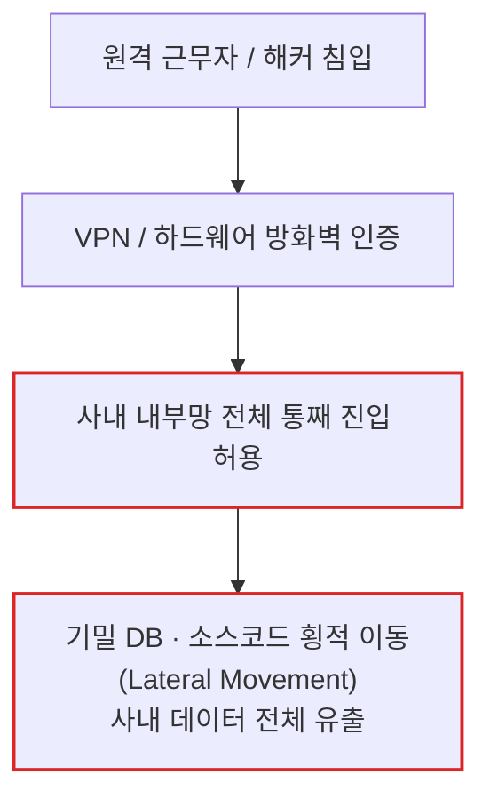
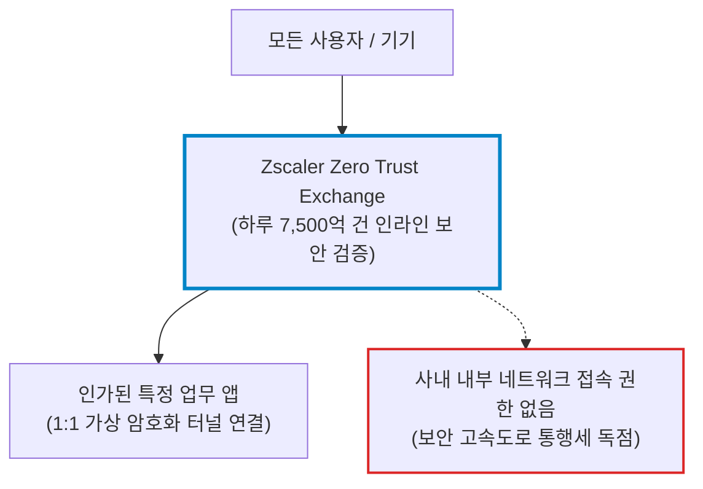
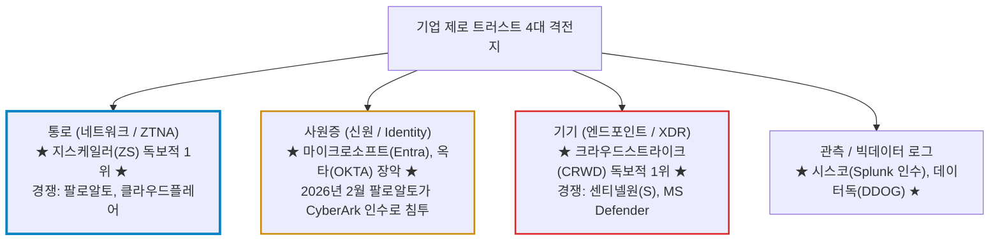
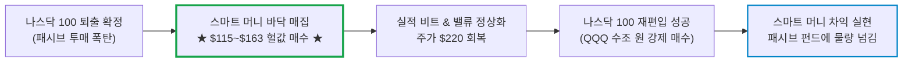
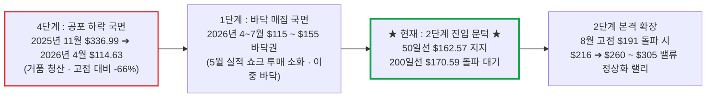

# 지스케일러(Zscaler / ZS) 실전 재무 및 가치 분석 보고서

- **작성일**: 2026-09-11
- **데이터 기준**: 2026 회계연도 4분기 실적 및 yfinance 시장 데이터 (2026-09-10 종가 기준)

대중이 엔비디아의 하드웨어와 크라우드스트라이크의 P/S 40배 거품에 취해 뇌동매수할 때, 52주 고점 대비 -51% 폭락해 200일선 아래 바닥권에서 P/S 8.0배로 내팽개쳐진 제로 트러스트 절대 강자 지스케일러의 실체와 숫자를 발라낸다. 연간 FCF 7.8억 달러와 ARR 37.7억 달러를 쏟아내며 AI 보안 예약을 전분기 대비 50% 폭증시킨 본업의 현금 창출력은 결코 거짓말을 하지 않는다.

## 핵심 요약

| 구분 | 핵심 요약 |
| :--- | :--- |
| **종목 및 주가** | 지스케일러 (NASDAQ: `ZS`) / **$163.48** (52주 범위 $114.63 ~ $336.99, 고점 대비 **-51.5%**) |
| **최종 투자의견** | **적극 분할 매수 (Buy on Dip)** / 50일선($162.57) 지지 1차 진입 및 200일선($170.59) 돌파 안착 주력 매수 (투자 가치 점수 **91.0점**, 6.1절) |
| **비즈니스 본질** | 사내망 침투 자체를 원천 봉쇄하고 검증된 앱만 1:1 연결하는 Zero Trust Exchange 통행세 독점 모델 |
| **핵심 매력 (Bull)** | ARR $37.7억(+25%), Q4 매출 $8.98억(+25%), 연간 FCF $7.79억, AI 보안 예약 QoQ +50%, Z-Flex 4분기 TCV $7.7억 |
| **핵심 리스크 (Bear)** | FY27 가이던스(매출 +16.6~17.5%)의 성장 둔화, 연간 주식보상(SBC) $8.22억에 따른 GAAP 순손실(-$6,318만 달러), 대형 경쟁사 번들링 공세 |
| **포트폴리오 성격** | 2단계 진입 문턱의 **바닥권 턴어라운드 성장주(베타 0.95)** / **하방 지지 및 손익비 극대화 자리, 단기 100% 폭등 노리는 투기꾼은 매수 금지** |

---

## 1. 비즈니스 실체: 구식 성곽 방어의 종말과 제로 트러스트 통행세 독점

지스케일러를 단순한 보안 백신이나 방화벽 회사로 치부하는 자는 클라우드 아키텍처의 기본조차 모르는 문외한이다. 이 회사가 부숴버린 것은 지난 30년간 기업 IT를 지배해 온 구시대의 유물, 이른바 **'성곽 방어(Castle-and-Moat)'** 모델이다.

과거 기업들은 사옥과 데이터센터 입구에 수십억 원짜리 하드웨어 방화벽과 VPN(가상사설망) 장비를 깔아두고, 문패를 확인하면 내부망 전체에 대한 접근을 허용했다. 하지만 클라우드와 원격근무가 표준이 된 지금, 이 방식은 재앙이다. 침입자가 직원의 피싱 계정 하나만 탈취해 내부망에 발을 들이는 순간, 성벽 안의 모든 서버와 데이터베이스를 옆으로 기어 다니며(Lateral Movement) 초토화하기 때문이다.

- **[구식 성곽 방어 모델 (Castle-and-Moat)]**: 문패(VPN)만 뚫리면 사내망 통째 진입 ➔ 해커의 횡적 이동(Lateral Movement)으로 전산망 초토화

- **[지스케일러 제로 트러스트 모델 (Zero Trust Exchange)]**: 사내망 진입 자체를 원천 차단 ➔ 검증된 개별 앱과만 1:1 가상 터널 연결

지스케일러는 이 썩은 성벽을 해체했다. 전 세계 150개 이상의 데이터센터에 자체 프락시 교환망인 **`Zero Trust Exchange`**를 깔아두고, 사용자가 지구상 어디에 있든 기업 내부망으로 절대 들여보내지 않는다. 사용자는 오직 신원과 기기 보안이 검증된 단 하나의 특정 애플리케이션과만 1:1로 가상 암호화 터널을 맺는다.

기업 내부망이라는 개념 자체가 사라졌으므로, 해커가 직원의 노트북을 탈취해도 다른 서버로 옮겨갈 연결 통로가 아예 없다. 지스케일러는 대기업들의 모든 트래픽이 지나갈 수밖에 없는 전 세계 보안 고속도로를 깔아놓고, 하루 7,500억 건 이상의 트랜잭션을 검증하며 매달 막대한 통행세를 뜯어내는 플랫폼 독점 사업자다.

### 1.1 대체 불가능한 락인(Lock-in)과 7,500억 건의 데이터 해자

대중은 크라우드스트라이크(CRWD)나 팔로알토 네트웍스(PANW)가 지스케일러를 금방 집어삼킬 것처럼 호들갑을 떤다. 하지만 네트워크 인프라의 물리적 진실을 알면 비웃음이 나온다.

| 경쟁 요소 | 구식 하드웨어 방화벽 (레거시) | 거대 플랫폼 번들 (PANW 등) | 지스케일러 (Zero Trust Exchange) |
| :--- | :--- | :--- | :--- |
| **아키텍처** | 물리적 어플라이언스 박스 설치 | 방화벽 기반 클라우드 가상화 혼용 | **순수 클라우드 네이티브 프락시 아키텍처** |
| **트래픽 처리** | 게이트웨이 병목 및 레이턴시 폭증 | 데이터센터 우회로 성능 저하 | **글로벌 150+ PoP에서 지연 없는 인라인 처리** |
| **일일 트랜잭션** | 수천만~수억 건 (사내 분산) | 플랫폼별 분산 집계 | **일일 7,500억 건 이상 단일 플랫폼 집계** |
| **고객 전환 비용** | 장비 교체 주기마다 취약 | 번들 계약 만료 시 재검토 | **전사 라우팅 정책이 종속되어 재설계 없이는 교체 불가** |

하루 7,500억 건 이상의 인라인(In-line) 트랜잭션은 단순한 트래픽 숫자가 아니다. 전 세계 악성코드, 피싱 공격, 제로데이 위협 시그널이 실시간으로 지스케일러의 AI 엔진으로 빨려 들어간다. 이 방대한 위협 데이터는 그 어떤 후발주자도 돈을 주고 살 수 없는 독점적 AI 학습 데이터다.

여기에 포춘 500대 기업의 절반(50%)이 이미 전사 네트워크 라우팅을 지스케일러 클라우드로 고정해 두었다. 연간 반복 매출(ARR) 100만 달러 이상을 쏟아붓는 초대형 고객 수만 **785개사**에 달하며, 전년 대비 **18% 증가**했다. 기업의 모든 인터넷 패킷이 지스케일러를 통과하도록 라우팅을 짜놓은 이상, 이를 걷어내는 것은 기업 전산망 전체를 마비시키는 위험을 감수해야 하므로 이탈률은 극히 낮다.

### 1.2 개념 심층 해부: '제로 트러스트(Zero Trust)'의 진짜 의미와 아파트 비유

대중과 IT 기획자들이 남발하는 **'제로 트러스트(Zero Trust)'**의 철학적 본질은 단 한 문장이다.

> **"아무것도 신뢰하지 마라. 언제나, 매 순간 검증해라 (Never Trust, Always Verify)."**

| 구분 | 구식 보안 : 성곽 방어 (Castle-and-Moat) | 차세대 보안 : 제로 트러스트 (Zero Trust) |
| :--- | :--- | :--- |
| **기본 전제** | "성벽(방화벽/VPN) 밖은 위험하지만, **성벽 안(내부망)에 들어온 놈은 무조건 믿는다**" | **"내부자든 외부자든, CEO든 그 누구도 믿지 않는다. 내부는 이미 해커에게 털렸다고 가정한다"** |
| **직관적 비유** | **아파트 정문 차단기**: 경비실에서 출입증 한 번 보여주고 들어가면 단지 내 모든 동, 모든 집의 현관문이 활짝 열려 있는 상태 | **금고형 개별 격실**: 아파트 정문이란 개념 자체가 없음. 방 문을 열 때마다 지문과 홍채를 매번 다시 찍어야 열리는 구조 |
| **접속 방식** | 회사 **내부 네트워크망 전체**에 통째로 접속 허용 | 사용자와 **인가된 특정 애플리케이션만 1:1로 암호화 터널 연결** |
| **침투 시 결과** | 해커가 직원 PC 하나만 뚫으면 사내 모든 DB로 **횡적 이동(Lateral Movement)** 하여 기밀을 초토화 | 해커가 특정 PC나 계정을 털어도 **다른 서버나 시스템의 존재 자체를 볼 수 없어** 피해가 즉시 격리 |

왜 지금 전 세계 기업들이 막대한 비용을 들여 제로 트러스트로 갈아엎는가?

1. **사내 성벽의 소멸**: 재택근무, 모바일 기기, SaaS(슬랙·노션·세일즈포스), 멀티 클라우드(AWS·Azure) 확산으로 지켜야 할 '물리적 사옥 성벽' 자체가 사라졌다.
2. **내부자 피싱의 일상화**: 해커들은 방화벽을 뚫지 않고 직원의 이메일로 피싱 링크를 보내 로그인 계정을 훔쳐 정문으로 걸어 들어온다. 내부자를 신뢰하는 순간 기업은 끝장난다.
3. **최소 권한의 원칙 (Least Privilege)**: 회계팀 직원에게는 개발 서버나 영업 CRM의 IP 주소 자체를 숨겨버린다. 권한이 없는 자에게는 네트워크상에서 **'보이지도 않고(Dark), 존재하지도 않는 것'**으로 만든다.

### 1.3 전장 판정: 지스케일러는 제로 트러스트의 진정한 '최고 강자'인가?

결론부터 냉혹하게 말한다. **"네트워크·웹 트래픽 제로 트러스트(ZTNA/SSE)" 영역에서는 명실상부한 부동의 1등 대장이다. 하지만 "기업 IT 전체의 제로 트러스트"라는 판으로 넓히면 거대 공룡들과 피 튀기는 영토 전쟁 중이다.**

대중과 언론은 '제로 트러스트 = 지스케일러'라는 단편적인 공식에 갇혀 있지만, 엔터프라이즈 보안 전장의 지형도는 훨씬 복잡하다.

제로 트러스트는 네트워크 통로 하나만으로 완성되지 않는다. **통로(네트워크) + 사원증(신원) + 기기(엔드포인트) + 데이터(로그)**의 4대 바퀴가 맞물려야 한다.

- **① 지스케일러가 압도적 최고 강자인 영역 (통로: SSE / ZTNA)**:
    - 가트너(Gartner) 매직 쿼드런트 SSE 부문에서 2025년까지 4년 연속 리더로 선정됐고, **실행 능력(Ability to Execute) 축에서 전체 벤더 중 가장 높은 평가**를 받았다.
    - 경쟁사들이 하드웨어 박스에 클라우드를 덧붙일 때, 100% 순수 클라우드 분산망으로 시작하여 하루 7,500억 건 이상의 인라인 트래픽을 지연 없이 소화한다. 물리적 인프라 격차가 너무 벌어져 있다.
- **② 지스케일러를 위협하는 2대 공룡의 칼날**:
    - **팔로알토 네트웍스 (PANW)의 번들링(끼워팔기) 공세**: 방화벽, SASE, 클라우드, 정체성(CyberArk 인수)까지 한 계약으로 묶어 대폭 할인해 주며 CIO들을 유혹한다.
    - **마이크로소프트 (MSFT)의 기본 탑재 위협**: 윈도우와 M365 사원증(Entra ID)을 쥐고 기본 보안 기능을 끼워 팔며 저가 시장을 갉아먹는다.
- **③ 투자자가 꿰뚫어 봐야 할 진짜 실체**:
    - 지스케일러는 네트워크 통로에서 타의 추종을 불허하는 세계 최고 기술을 가졌다. 대기업들이 아무리 번들 유혹을 받아도 전사 트래픽의 목줄인 지스케일러를 통째로 걷어내지는 못한다.
    - 최고 강자임에도 불구하고 번들링 경쟁 우려와 성장 둔화 공포로 주가가 **52주 고점 대비 -51% 폭락해 P/S 8배(경쟁사 CRWD는 P/S 40배)**까지 내팽개쳐졌다. 바로 이 비이성적 공포가 스마트 머니에게 최고의 기술주를 바닥권 헐값에 쓸어 담을 기회를 안겨준 것이다.

---

## 2. 최근 실적 흐름과 52주 대폭락(-66%)의 해부

### 2.0 52주 대폭락(-66%)의 전말과 턴어라운드 반전의 5대 축

지스케일러가 2025년 11월 최고점($336.99)에서 2026년 4~6월 저점($114.63)까지 **-66% 처참하게 폭락**하고 현재까지 고점 대비 -51% 수준($163선)에 묶여 있는 이유는 **5대 악재 연쇄 폭탄**이 한꺼번에 터졌기 때문이다.

1. **밸류에이션 거품 청산 (4단계 공포 하락)**: 주가 $337 당시 P/S 20배를 웃돌던 극단적 프리미엄이 매크로 고금리 기조와 맞물리며 잔혹하게 청산되었다.
2. **거대 공룡들의 '번들링(끼워팔기)' 공세 공포**: 팔로알토(PANW)의 SASE 번들 및 CyberArk 인수, 마이크로소프트(MSFT)의 M365 Entra ID 기본 탑재 공세로 단일 보안 솔루션이 고사할 것이라는 비관론이 팽배했다.
3. **2026년 5월 가이던스 쇼크**: FY26 3분기 실적 발표 직후, FY27 성장률 둔화 우려로 단 하루 만에 **-31.5% 폭락**하며 **3,183만 주**의 기록적 기관 투매가 쏟아졌다.
4. **2026년 6월 나스닥 100 지수 퇴출**: 나스닥 지수가 AI 하드웨어 중심으로 개편되며 지스케일러가 나스닥 100에서 제외되어, QQQ 등 패시브 펀드의 기계적 강제 투매 폭탄이 바닥 매물대를 형성했다.
5. **연간 $8.2억 달러 주식보상(SBC)과 장부상 적자**: FCF는 1조 원을 벌지만, 막대한 주식 보상으로 GAAP 기준 연간 -$6,318만 달러 적자를 기록해 월가의 멀티플 디스카운트 빌미를 제공했다.

#### 지금 이런 문제가 해결되어 앞으로 오른다고 보는가? (스마트 머니의 5대 반전 근거)
모든 문제가 마법처럼 100% 증발해서 오르는 게 아니다. 주식시장은 문제가 완전히 사라진 뒤에 사면 이미 저 위에서 상투를 잡게 된다. 스마트 머니가 지금 지스케일러를 담는 이유는 **"악재의 피크(절정)가 지났고, 숫자가 시장의 오독을 깨부수고 있으며, P/S 8배가 최악의 시나리오를 다 반영해 하방이 닫혔기 때문"**이다.

- **① 나스닥 100 퇴출 패시브 수급 폭탄 소화 완료**: 6월 패시브 펀드 투매 물량은 6~7월 $114~$120 바닥권에서 전부 소화되었고, 일간 거래량이 280만 주 수준으로 바짝 마르며 50일선($162.57) 지지를 확정했다.
- **② 'Z-Flex' 계약과 락인으로 번들 공세 무력화**: 유연 계약 모델인 `Z-Flex` 총계약가치(TCV)가 4분기 단 한 분기에만 7.7억 달러(QoQ +60%), 연간 17억 달러를 돌파했다. 포춘 500대 기업 50%가 라우팅을 고정했고, ARR 100만 달러 이상 고객이 785개사(+18%)로 늘어 번들링 위협을 정면 돌파했다.
- **③ AI 에이전트 확산으로 일감 폭증**: AI가 코드를 마구잡이로 찍어내며 공격 표면이 급증하자, 지스케일러의 AI 보안 예약(Bookings)이 전분기 대비 50% 이상 폭증했다. 하루 7,500억 건 검증 인프라는 대체 불가능하다.
- **④ 성장 둔화는 경영진의 '낮춰 부르기(Sandbagging)' 관행**: FY27 매출 가이던스 +17%는 보수적 관행일 뿐이다. 최근 5분기 연속 EPS를 7~13% 상회했고, 본업의 ARR은 $37.7억(+25%)을 유지 중이며 비GAAP 영업이익률은 24.3%로 역대 최고치를 찍었다.
- **⑤ 비대칭적 손익비 (하방 -7% vs 상방 +32~87%)**: 1년에 FCF 7.8억 달러(약 1조 원, 마진 23.2%)를 남기는 1등 기업이 P/S 8.0배에 버려져 있다. 하방은 꽉 막힌 반면, 실적 비트 시 멀티플 정상화 랠리가 활짝 열려 있다.

---

### 2.1 최근 3개월 핵심 뉴스 타임라인 (2026.06.15 ~ 2026.09.08)

지난 3개월간 지스케일러를 둘러싼 5건의 핵심 이벤트는 **'나스닥 100 퇴출로 인한 기계적 패시브 투매 바닥 확인 ➔ AI 확산에 따른 보안 수요 재평가 ➔ FY26 4분기 호실적 발표 및 FY27 가이던스를 둘러싼 월가 시각 분열'**로 요약된다. 대중이 지수 퇴출과 가이던스 둔화라는 표면적 악재에 공포를 느낄 때, 스마트 머니는 가격 왜곡이 빚어낸 턴어라운드 바닥을 집어삼켰다.

| 일자 | 주요 뉴스 및 시장 이벤트 | 영향도 | 스마트머니 관점의 핵심 분석 및 시사점 |
| :--- | :--- | :---: | :--- |
| **09.08** | **FY27 가이던스 둘러싼 월가 IB 평가 팽팽한 대립 (파이퍼샌들러 vs 웰스파고)** | `🟡 쟁점 분열` | 파이퍼샌들러는 AI 보안·Z-Flex 모멘텀과 신규 Agentic SecOps 잠재력을 인정하면서도, FY27 유기적 NNARR +6% 둔화와 영업 리더십 전환을 근거로 중립($175) 유지. 반면 웰스파고는 4분기 전 부문 비트와 FCF 압박이 일시적임을 들어 비중확대($215 상향). 월가의 시각이 엇갈리며 주가가 바닥권에 묶여 있는 지금이 최적의 매수 구간 |
| **09.04** | **스코샤뱅크, 목표가 $200 상향: "AI 보안 잠재력 미반영, 손익비 매력적"** | `🟢 스마트머니` | M&A(Red Canary) 효과를 뺀 유기적 순신규 ARR +17% 성장과 76.8%의 견고한 매출총이익률 확인. 시장이 지스케일러의 AI 사이버보안 성장성을 전혀 가격에 반영하지 않고 있으며, 현재 밸류에이션의 위험 대비 보상(손익비)이 압도적으로 우수하다고 평가하며 Outperform 유지 |
| **09.04** | **호실적에도 개장 전 프리마켓 -3.5% 하락... 가이던스 실망 차익 출회** | `🔴 단기 수급` | 4분기 매출($8.98억)과 EPS가 모두 월가 컨센서스를 상회했으나, FY27 연간 매출 가이던스(+16.6~17.5%)가 높아진 눈높이에 미치지 못하자 단기 실망 매물 출회. 52주 고점 대비 -51% 폭락한 자리에서 50일선($162) 지지력을 확인시켜 주는 전형적인 눌림목 형성 |
| **07.15** | **IBM CEO "미토스 등장 이후 AI 사이버보안이 고객사 최우선 과제" 발언에 주가 +7% 급등** | `🟢 업황 확인` | IBM 아르빈드 크리슈나 CEO가 앤트로픽 미토스 등 첨단 AI 확산으로 기업들이 보안 지출 규모를 전면 재검토하고 있다고 밝히자 사이버보안주 일제 랠리(CRWD +12%, OKTA +11%, ZS +7%, PANW +7%). AI가 소프트웨어를 파괴하기는커녕 24시간 실시간 보안 트래픽을 폭증시킨다는 펀더멘털 확인 |
| **06.15** | **나스닥 100 지수 정기 리밸런싱 퇴출 확정... 기계적 패시브 매도 클라이맥스** | `🔴 수급 충격` | 나스닥거래소가 AI 하드웨어·데이터센터 중심(ALAB, CRWV 등)으로 지수를 개편하면서 지스케일러가 나스닥 100 지수에서 제외됨. 패시브 펀드(QQQ 등)의 기계적 투매가 쏟아지며 $114~$120 저점 매물대 형성. 기업 펀더멘털과 무관한 지수 리밸런싱 충격은 스마트머니에게 역사적 바닥 매집의 선물이었음 |

### 2.2 최근 실적과 시장의 오독: 대중의 착시 vs 숫자의 팩트

2026년 9월 3일 발표된 지스케일러의 2026회계연도 4분기(FY26 Q4) 실적은 매출과 EPS 모두 월가 예상을 넘어섰다. 주가를 끌어내린 것은 FY27 가이던스 하나뿐이다.

| 시장이 보고 놀란 것 (착시) | 데이터가 말해주는 진실 (팩트) |
| :--- | :--- |
| **"FY27 연간 매출 가이던스 +17%는 성장 둔화다"** | 경영진의 전통적인 보수적 가이던스(Sandbagging) 관행이다. 최근 5개 분기 연속 EPS가 컨센서스를 **7~13%** 웃돌았다. 연간 반복 매출(ARR)은 **$37.7억 달러로 +25% 성장**을 유지하고 있고, AI 보안 예약은 전분기 대비 **+50% 이상 폭증**했다. |
| **"GAAP 기준 연간 -$6,318만 달러 적자 회사다"** | 장부상 적자의 원인은 현금 유출이 없는 주식기준보상(SBC $8.22억 달러) 때문이다. 회사가 벌어들인 연간 영업현금흐름은 **$11.3억 달러**, 잉여현금흐름(FCF)은 **$7억 7,900만 달러**로 사상 최대 현금을 창출했다. |
| **"팔로알토의 번들 공세에 파이 뺏긴다"** | 유연 계약 모델인 `Z-Flex` 총계약가치(TCV)가 4분기에만 **7억 7,000만 달러(전분기 대비 +60% 이상)**, 연간 **17억 달러**를 넘기며 대형 엔터프라이즈의 보안 예산을 통째로 묶고 있다. 비GAAP 영업이익률은 **24.3%**로 역대 최고치를 찍었다. |
| **"실적 발표 직후 $178에서 $163으로 주가가 밀렸다"** | FY27 가이던스 실망에 따른 차익 실현과 매크로 수급 노이즈일 뿐이다. 52주 고점($336.99) 대비 반토막 난 상태에서 50일선 지지를 확인하는 최적의 **손익비 극대화 눌림목**을 제공했다. |

### 2.3 숫자로 증명된 폭발적 펀더멘털

- **매출 및 ARR의 견고함**: 4분기 매출은 전년 동기 대비 25% 급증한 **8억 9,820만 달러**를 기록하며 월가 컨센서스($8.77억)를 가볍게 뛰어넘었다. 연간 총매출 역시 33억 5,250만 달러로 +25% 성장했다.
- **AI 에이전트 확산의 최대 수혜**: 생성형 AI와 에이전틱 AI(Agentic AI)가 코드를 마구잡이로 찍어내면서 기업 인프라의 공격 표면이 기하급수적으로 넓어졌다. 지스케일러의 AI 보안 솔루션 예약(Bookings)은 **전분기 대비 50% 이상 폭증**했다. AI가 만든 보안 구멍을 메우기 위해 지스케일러의 실시간 트래픽 감시망을 쓰지 않을 수 없다.
- **현금흐름의 폭발**: 연간 잉여현금흐름(FCF) **7억 7,914만 달러**를 달성했다. FCF 마진율은 무려 **23.2%**에 이른다. 깡통 소프트웨어 기업들이 적자에 허덕일 때, 지스케일러는 금고에 매년 1조 원에 달하는 현금을 쓸어 담고 있다.

### 2.4 나스닥 100 퇴출의 진실과 재편입 시나리오: 스마트 머니의 차익 거래 메커니즘

대중은 "나스닥 100에서 쫓겨났으니 다시 들어갈 수 있느냐"며 불안에 떤다. 결론부터 명확히 한다. **"당연히 다시 들어간다. 단, 주가가 $215를 뚫고 시총 350억 달러를 넘어서야 한다."**

나스닥 100은 기업의 도덕성이나 인기도를 보는 게 아니라, 오직 **'시가총액 랭킹'** 하나로만 자르고 붙이는 냉혹한 기계적 시스템이다.

#### ① 나스닥 100 편입·퇴출 룰과 재편입 체급 조건
- **퇴출 룰**: 나스닥 비금융 상위 기업 중 시가총액 순위가 **125위 밖으로 밀려나면 무조건 퇴출**된다. 주가가 $114까지 폭락해 시총이 180억 달러로 쪼그라들었기에 6월에 쫓겨난 것이다.
- **재편입 룰**: 주가가 회복되어 시가총액 순위 **상위 75~100위권 안으로 복귀하면 차기 정기 리밸런싱(매년 12월)에서 우선 편입**된다.

| 구분 | 현재 지스케일러 체급 | 나스닥 100 재편입 가시권 | 복귀 시점 및 시사점 |
| :--- | :---: | :---: | :--- |
| **주가** | **$163.48** | **$215 ~ $230 돌파** | 200일선 안착 후 밸류 정상화 1차 목표가 달성 시 |
| **시가총액** | **$266억** | **$350억 ~ $375억 달러** | 나스닥 비금융 상위 90~100위권 재진입 |
| **심사 시점** | — | **매년 12월 연례 정기 리밸런싱** | 2026년 12월 또는 2027년 정기 재편 심사 대상 |

#### ② 스마트 머니의 지수 퇴출·재편입 차익 거래 공식
대중은 지수에서 쫓겨나면 공포에 팔고, 다시 들어간다고 하면 고점에서 환호한다. 헤지펀드의 돈 버는 공식은 정반대다.

쫓겨나서 패시브 펀드가 눈물을 머금고 헐값에 던져놓은 지금(P/S 8.0배) 사두고, 나중에 화려하게 재편입될 때 규정에 따라 비싸게 사러 들어올 패시브 자금에게 물량을 넘기는 것, 이것이 프로들의 게임이다.

---

## 3. 경쟁 해자 및 피어 그룹 잔혹 비교

사이버보안 섹터의 피어 그룹과 지스케일러의 숫자를 한 테이블에 올려놓고 잔혹하게 대조해라. 대중이 왜 크라우드스트라이크와 팔로알토의 고점에서 상투를 잡고 피눈물을 흘리는지 단번에 드러난다.

| 티커 | 기업명 | 현재가 | 52주 고점 대비 | 200일선 괴리율 | P/S 배수 | 선행 P/E | FCF (최근 4분기) | FCF 마진 | 판정 및 진입 자리 |
| :---: | :--- | ---: | ---: | ---: | ---: | ---: | ---: | ---: | :--- |
| **ZS** | **지스케일러** | **$163.48** | **-51.5%** | **-4.2%** | **8.0배** | **29.2배** | **$7.79억** | **23.2%** | **적극 매수 (손익비 압도적 1위)** |
| **CRWD** | 크라우드스트라이크 | $208.86 | -10.7% | **+45.3%** | 39.6배 | 130.2배 | $15.2억 | 28.2% | **추격 매수 엄금 (200일선 이격 과열)** |
| **PANW** | 팔로알토 네트웍스 | $338.49 | -15.1% | **+43.9%** | 24.0배 | 69.4배 | $37.9억 | 35.8% | **관망 (CyberArk 인수로 주식 약 15% 희석)** |
| **NET** | 클라우드플레어 | $311.17 | -6.3% | **+38.9%** | 44.1배 | 185.6배 | $3.1억 | 12.5% | **매수 보류 (극단적 밸류에이션 부담)** |
| **CSCO** | 시스코 시스템즈 | $107.44 | -17.6% | +13.4% | 6.7배 | 19.2배 | $127.7억 | 20.2% | **수비형 보유 (성장률 한 자릿수 둔화)** |
| **S** | 센티넬원 | $19.81 | -17.3% | +23.2% | 6.3배 | 42.8배 | $0.3억 | 2.8% | **매수 보류 (FCF 마진 2.8%, 현금 창출력 미약)** |

대중이 환호하는 크라우드스트라이크는 P/S 40배, 선행 PER 130배에 거래되며 200일선 위로 45%나 치솟아 있다. 여기서 조금만 삐끗해도 -30% 급락을 두들겨 맞는다. 팔로알토는 2026년 2월 CyberArk 인수를 마무리하면서 보통주 1.12억 주를 찍어내 기존 주주 지분을 약 15% 희석시켰다.

반면 지스케일러는 52주 최고가 $336.99에서 **-51.5% 폭락**하여 거품을 완전히 털어냈다. 제로 트러스트 시장의 원조 독점 기업이 **P/S 8.0배, 선행 PER 29.2배**에 방치되어 있다. 매출의 23%를 잉여현금흐름으로 남기는 기업이 CRWD(39.6배)·NET(44.1배)의 5분의 1, PANW(24.0배)의 3분의 1 수준 P/S에 거래되고 있는 것이다. 이것이 스마트 머니가 노리는 '가격 왜곡'이다.

---

## 4. 기술적 사이클 위치 (스탠 와인스타인 4단계 사이클 모델)

스탠 와인스타인의 4단계 사이클 모델로 냉정하게 해부하면, 지스케일러는 처절했던 **4단계 공포 하락과 1단계 바닥 매집을 거쳐 2단계 상승 국면(Uptrend) 진입 문턱**에 서 있다. 와인스타인의 2단계는 주가가 상승하는 30주 이동평균선 위에 올라선 구간이다. 주가는 30주선($151.53) 위로 올라섰지만 30주선 자체는 아직 하락 중이고, 200일선($170.59)도 뚫지 못했다. 200일선 종가 돌파가 2단계 확정 신호다.

- **4단계 하락 국면의 종료**: 2025년 11월 3일 고점 $336.99에서 2026년 4월 10일 저점 $114.63까지 주가는 -66% 처참하게 털려 나갔다. 단기 투기꾼들과 거품 추종자들은 이미 시장을 빠져나갔다.
- **1단계 바닥 다지기**: 5월 27일 3분기 실적 발표 직후 가이던스 쇼크로 하루 만에 -31.5%(거래량 3,183만 주) 투매가 쏟아졌다. 그러나 6월 저점 $119.50은 4월 저점 $114.63을 깨지 않았다. 이중 바닥을 확인한 뒤 6~7월 $120~$155 박스권에서 일간 거래량이 200만~300만 주로 마르며 악성 매물을 소화했다.
- **2단계 진입의 변곡점**: 8월 박스권 상단 $155를 뚫고 $191(8월 18일 장중 $190.97)까지 올랐다가 현재 $163.48로 되밀렸다. 주가는 50일 이동평균선($162.57) 위에 있고, 200일 이동평균선($170.59) 아래 -4.2% 지점에 있다. 최근 20거래일 동안 50일선은 $143.59에서 $162.57로 가파르게 올랐고 200일선은 $184.46에서 $170.59로 내려왔다. 골든크로스 직전의 선발대 진입 자리다.
- **수급과 지표의 일치**: 14일 RSI는 43.6으로 과열 징후가 전혀 없다. 실적 발표 당일과 다음 날 각각 851만 주, 774만 주의 대량 거래가 터진 뒤, 거래량이 287만 주 수준으로 급감하며 조정을 마무리하는 전형적인 건강한 매물 소화 패턴이다.

---

## 5. 밸류에이션 및 가격 타당성 검증

지스케일러의 현재 시가총액은 **266억 6,000만 달러(약 36조 원)**다. 이 가격표가 얼마나 저평가되어 있는지 숫자로 쪼개본다.

### 5.1 현금 창출력 기반 밸류에이션 지표

| 지표 | 수치 | 냉혹한 평가 및 시사점 |
| :--- | ---: | :--- |
| **연간 잉여현금흐름 (FCF)** | **$7억 7,914만 달러** | 전년 대비 +7.2%. 영업현금흐름은 +16% 늘었지만 설비투자(CapEx)가 $2.46억에서 $3.51억으로 43% 불어나 증가분을 잠식했다 |
| **시가총액 대비 FCF 수익률** | **2.92%** | 시총 $266.6억 대비 약 3%의 현금 수익률. CRWD(0.71%) 대비 4배 높음 |
| **현금 및 단기투자자산** | **$34억 7,400만 달러** | 시가총액의 13%가 현금성 자산. 총차입금($18.6억)을 갚고도 16억 달러가 남음 |
| **주식기준보상 (SBC)** | **$8억 2,192만 달러** | **반드시 직시해야 할 암수(Dark Side).** SBC를 빼면 실질 현금흐름은 거의 0이다 |
| **주가매출비율 (P/S Trailing)** | **7.95배** | 최근 3개 회계연도 평균 P/S(11.1~14.8배) 대비 30~46% 할인. 피어 5개사 평균(24배)의 3분의 1 수준 |
| **선행 PER (Forward P/E)** | **29.19배** | CRWD(130배)·PANW(69배)의 절반 이하로 내려온 성장주 멀티플 |

출처: yfinance 시장 데이터 및 FY2026 연간 재무제표(2026-09-10 종가 기준).

### 5.2 장부의 이면: 주식보상(SBC)의 실체와 팩트 해부

칭찬만 늘어놓는 것은 가짜 애널리스트들의 사기극이다. 지스케일러의 재무제표에서 반드시 비판해야 할 지점은 연간 **8억 2,192만 달러(약 1조 1,000억 원)에 달하는 주식기준보상(SBC)**이다.

#### ① 주식보상(SBC)의 본질과 기업의 꼼수
- **SBC의 정의**: 임직원 월급과 성과급을 현금 대신 회사 주식(신주)을 찍어내서 주는 제도다. 실리콘밸리 테크 기업들이 고급 인재를 끌어모으는 무기이자, 주주 입장에서는 내 지분을 야금야금 갉아먹는 '합법적 소매치기'다.
- **기업이 환장하는 이유**:
    - **현금 유출 제로(0)**: 현금을 한 푼도 쓰지 않고 최고급 엔지니어를 붙잡아둘 수 있다. 지스케일러가 FCF 7.79억 달러(약 1조 원)를 남겼다고 자랑할 수 있는 핵심 비결도 인건비의 상당 부분을 주식으로 때웠기 때문이다.
    - **Non-GAAP 회계 분칠**: 공식 회계(GAAP)에서는 비용이지만, 실적 발표 때 "비GAAP 조정 영업이익 흑자!"라며 SBC를 싹 발라내고 마치 돈을 엄청 잘 버는 것처럼 포장한다.

#### ② 주주에게 독약인 이유: 지분 희석과 EPS 훼손
- **지분 희석 (Dilution)**: 피자 1판(기업 가치)의 크기는 그대로인데, 신주를 마구 찍어 조각을 8조각에서 10조각, 12조각으로 쪼개 직원들에게 나눠주니 기존 주주가 가진 1주의 지분 가치가 강제로 물타기된다.
- **주당순이익(EPS) 훼손**: 회사가 이익을 늘려도 주식 수가 늘어나니 주당순이익 성장이 억제된다.

#### ③ 지스케일러의 숫자로 보는 GAAP vs Non-GAAP 민낯
지스케일러는 연간 총매출(33.5억 달러)의 무려 **24.5%**를 신주를 찍어 직원들 보너스로 퍼줬다.

| 구분 | 공식 회계 (GAAP) | 경영진의 주장 (Non-GAAP) | 차이의 원인 |
| :--- | :---: | :---: | :--- |
| **연간 영업이익** | **-$6,318만 달러 (적자)** | **+$8억 1,300만 달러 (흑자)** | **SBC 8.22억 달러를 비용에서 뺐느냐 넣었느냐의 차이** |
| **실질 잉여현금흐름** | **-$4,278만 달러 (BEP 미달)** | **+$7억 7,914만 달러 (FCF)** | **주식보상을 전액 현금으로 지급했다면 남는 현금은 0** |

워런 버핏의 독설을 상기해야 한다. *"주식기준보상이 비용이 아니라면 대체 무엇이란 말인가? 현금 유출이 없다고 비용이 아니라면, 임직원들이 자선사업 하러 출근했단 말인가?"*

#### ④ 투자자의 냉혹한 판정: 지분 희석 vs 파이의 성장
- **판정 기준**: 지분 희석률보다 비즈니스의 성장 속도가 압도적으로 빠른가를 봐야 한다.
- **지스케일러의 체력**: 기본 발행주식수 증가율은 연간 +3.0%(1억 5,830만 주 → 1억 6,306만 주)로 통제되고 있다. 피자 조각이 3% 늘어나는 동안 연간 매출은 +25%, FCF 마진은 23.2%로 성장하고 있어 현재 P/S 8.0배 구간에서는 성장이 희석을 압도한다.
- **감시 과제**: 대차대조표의 34.7억 달러 현금을 자사주 매입 및 소각으로 돌려 주주 지분을 방어하는지, 4분기 설비투자 급증($2.19억)으로 FCF($6,076만 달러)가 쪼그라든 현상이 일회성에 그치는지 매 분기 철저히 감시해야 한다. 회사는 FY27 FCF 마진 가이던스로 23.0~23.5%를 제시했으므로 이 회복 여부를 추적해야 한다.

### 5.3 가격 민감도 및 시나리오별 목표가

| 시나리오 | FY27 예상 매출 | 적용 P/S 배수 | 예상 시가총액 | 계산 주가 | 현재가($163.48) 대비 | 시나리오 전제 조건 |
| :--- | ---: | ---: | ---: | ---: | ---: | :--- |
| **하방 스트레스** | $38.0억 (+13%) | 6.5배 | $247억 | **$151.50** | **-7.3%** | 매크로 침체로 IT 지출 축소, $145 박스권 지지선 시험 |
| **기준 시나리오** | $39.2억 (+17%) | 9.0배 | $353억 | **$216.50** | **+32.4%** | 회사 가이던스 부합, 200일선 돌파 후 밸류에이션 소폭 정상화 |
| **상방 시나리오** | $41.5억 (+24%) | 12.0배 | $498억 | **$305.50** | **+86.9%** | AI 보안 예약 급증으로 가이던스 대폭 비트, P/S 리레이팅 |

하방은 6~7월 박스권 상단($145~$155) 지지로 인해 -7% 안팎에서 막히는 반면, 상방은 가이던스만 달성해도 +32%, AI 서프라이즈 시 +87%가 열린다. 기준 시나리오로 따져도 하방 위험 1에 상방 잠재력 4.4가 주어지는 비대칭적 손익비다.

---

## 6. 종합 평가 및 냉혹한 계좌 실행 원칙

### 6.1 6대 핵심 투자 지표 다차원 평가 매트릭스

| 평가 영역 | 가중치 | 평점 (100점 만점) | 가중 점수 | 등급 | 핵심 평가 요약 |
| :--- | :---: | :---: | :---: | :---: | :--- |
| **① 비즈니스 모델 및 해자** | 25% | **94점** | 23.50 | `S` | 하루 7,500억 건 프락시 교환망, 포춘 500대 기업 50% 침투, 대형 고객 +18% |
| **② 실적 성장성 및 가이던스** | 25% | **90점** | 22.50 | `A+` | ARR $37.7억(+25%), AI 보안 예약 QoQ +50%, 5개 분기 연속 EPS 서프라이즈 |
| **③ 재무 건전성 및 현금흐름** | 20% | **93점** | 18.60 | `S-` | FCF $7.8억(마진 23%), 현금 및 단기투자 $34.7억, 차입금 차감 후 순현금 $16억 |
| **④ 밸류에이션 매력도** | 15% | **88점** | 13.20 | `A` | 52주 고점 대비 -51% 폭락, P/S 8.0배, CRWD 대비 5분의 1 수준 |
| **⑤ 기술적 매매 타이밍** | 10% | **86점** | 8.60 | `A-` | 1단계 이중 바닥 확인 후 2단계 진입 문턱, 50일선 지지 및 200일선 돌파 목전 |
| **⑥ 리스크 관리 가능성** | 5% | **92점** | 4.60 | `S-` | $145 손절선 명확, 손실 폭(-11%) 대비 기준 목표 수익(+32%) 약 3배 |
| **종합 가중치 환산 점수** | **100%** | — | **91.0점** | **`Strong Buy`** | **사이버보안 섹터 내 손익비 1위 바닥권 알짜 종목** |

!!! info "평점 산출 근거"
    종합 점수는 각 평가 영역 평점에 가중치를 곱해 합산한 값이다.
    `94×0.25 + 90×0.25 + 93×0.20 + 88×0.15 + 86×0.10 + 92×0.05 = 91.0점`

    비즈니스 독점력(①), 현금흐름(③), 밸류에이션 매력(④) 모두 최상위다. 약점은 연간 $8.2억의 주식보상비용(SBC)과 FY27 매출 성장률 +16.6~17.5% 가이던스다. 다만 고점 대비 -51% 하락한 주가가 이 악재를 상당 부분 선반영해 안전마진을 확보했다.

### 6.2 실전 결론: "그래서 지금 어쩌라는 것인가?" (Action Verdict)

#### ① 지금 당장 사야 하는가? ➔ **"그렇다. 지금 손가락을 얹어 선발대를 넣을 자리다."**

- **이유**: 52주 최고가 대비 반토막이 난 뒤 50일선($162.57)을 딛고 200일선($170.59) 정면 돌파를 준비하고 있다. $163에서 사서 $145 손절선을 잡으면 계획 위험은 주당 -$18(-11%)에 불과하다. 반면 1차 정상화 목표가인 $216까지만 가도 +$53(+32%), 상방 시나리오 $305에 도달하면 +$142(+87%)가 열린다. 손익비가 기준 약 3:1, 상방 약 8:1인 비대칭 구간이다.
- **지금 할 일**: 50일선 부근($160~$165)에서 1차 선발대(배정 예산의 35%)를 매수하고, 200일선($170.59)을 일봉 종가로 뚫어내는 순간 주력 물량을 싣는다.

#### ② 이런 주식은 누가 사고, 누가 절대 사면 안 되는가?

- **❌ 절대 사지 마라 (즉시 퇴장)**:
    - "내일 당장 상한가 치거나 1주일 만에 50% 폭등할 밈 주식을 찾는 도박꾼" — 지스케일러는 대형 B2B 소프트웨어 기업이다. 주가는 분기 실적과 ARR 성장률을 확인하며 차분한 계단식 상승을 그린다.
    - "분기 배당금 따박따박 받아서 생활비 쓰려는 은퇴 생활자" — 배당은 단 1원도 없다. 모든 현금은 R&D와 AI 보안 인프라 확장에 재투자된다.
    - "SBC 희석의 의미를 모르고 단순 GAAP 흑자만 찾는 회계 초보자" — 주식보상비용이 줄어드는 과정을 인내하지 못하면 흔들린다.
- **⭕ 반드시 눈독 들이고 주워 담아야 할 사람 (스나이퍼 매수)**:
    - "AI 사이버보안 슈퍼사이클의 과실을 통째로 누리고 싶지만, 200일선 위로 44~45% 치솟은 CRWD나 PANW의 상투를 잡기 죽기보다 싫은 현명한 투자자"
    - "연간 FCF 7.8억 달러를 쏟아내고 P/S 8.0배에 버려진 우량 독점주를 줍는 역발상 가치성장 투자자"
    - "전체 계좌의 5% 이내로 비중을 통제하고 분할 매수 원칙을 칼같이 지킬 줄 아는 냉철한 전략가"

#### ③ 기대수익률의 현실적 상한선과 박스권 흔들기

- **기대수익률의 천장**: 회사가 제시한 FY27 매출 성장률은 16.6~17.5%다. 멀티플이 P/S 9배로 정상화되는 기준 시나리오에서 FY27 종료 시점(2027년 7월)까지 기대할 수 있는 현실적 수익률은 +32%다. 상방 시나리오 +87%는 AI 보안 예약 급증과 P/S 12배 리레이팅이 동시에 맞아떨어져야 나오는 숫자이며, 이를 기본값으로 계산하는 자는 계좌를 망친다.
- **포트폴리오 내 쓸모**: 베타 0.95의 이 종목은 계좌의 방파제가 아니라 사이버보안 섹터 반등을 노리는 공격수다. 배당이 없고 SBC 희석이 있으므로 하락장에서 계좌를 지켜주지 않는다.
- **박스권 흔들기**: FY27 가이던스는 월가의 기대치보다 낮았다. 따라서 실적 발표 사이사이 매크로 악재나 금리 발작이 터질 때마다 $150~$160 선까지 주가를 흔들어대는 개미 털기 파동이 나올 수 있다.
- 이 흔들기에 겁을 먹고 투매하는 자는 하수다. 펀더멘털의 핵심인 ARR 25%와 FCF 마진 23%가 훼손되지 않는 한, 주가 하락은 비중 확대의 기회일 뿐이다.

### 6.3 실전 가격대별 실행 시나리오 및 분할 매수 로드맵

종목 배정 예산 내부 비중과 함께, 전체 포트폴리오 자산 대비 최대 편입 한도는 **5.0%**로 엄격히 제한한다. 아무리 손익비가 뛰어난 91점짜리 종목이라도 단일 성장주에 몰빵하는 자살 행위는 용납하지 않는다.

| 구분 | 실행 조건 | 종목 예산 비중 / 전체 계좌 한도 | 가격 기준 | 대응 방침 |
| :--- | :--- | :---: | :---: | :--- |
| **1차 진입 (선발대)** | 50일선 지지 확인 및 $160선 안착 | **35% / 1.75%** | **$160 ~ $165** | 현재가 부근 즉시 선발대 포지션 구축 |
| **2차 매수 (주력)** | 200일선($170.59) 일봉 종가 돌파 및 거래량 증가 | **40% / 2.00%** | **$171 ~ $175** | 2단계 상승 국면 전환 확인 후 메인 물량 편입 |
| **3차 매수 (불타기)** | 8월 고점($191) 돌파 및 안착 | **25% / 1.25%** | **$191 돌파 시** | 2단계 추세 확장 확인 후 비중 완성 |
| **손절 기준선** | 6~7월 박스권 상단 및 8월 돌파 출발 구간 붕괴 | **전량 매도 철수** | **$145 종가 이탈** | 미련 없이 손절. 4월 저점 $114 재시험 리스크 차단 |
| **1차 목표가** | 밸류에이션 정상화 (FY27 매출 기준 P/S 9.0배) | 절반 익절 검토 | **$216** | 투자 원금 회수 및 무위험 포지션 전환 |
| **2차 목표가** | 직전 사이클 저항대 및 상방 시나리오 | 잔여 비중 홀딩 | **$260 ~ $305** | 추세 이탈 전까지 수익 극대화 |

!!! tip "최종 핵심 제언 (Executive Takeaway)"
    - **최종 투자 가치 점수**: **91.0점 / 100점** (`Strong Buy` / 사업과 현금흐름은 최상위, 가격은 50% 할인)
    - **남들이 환호하는 고점 대장주를 버려라**: 200일선 위로 44~45% 치솟은 크라우드스트라이크(P/S 40배)와 팔로알토(선행 PER 69배)를 쫓아가는 건 남의 잔치에 설거지하러 들어가는 짓이다.
    - **진짜 돈길은 바닥에서 돌아선 독점주에 있다**: 52주 고점 대비 -51% 폭락한 뒤 이중 바닥을 딛고 200일선 돌파를 노리는 지스케일러(P/S 8.0배, FCF $7.8억)야말로 하방은 닫혀 있고 상방은 활짝 열린 가장 파괴적인 무기다.
    - **SBC 착시를 잊지 마라**: 연간 $8.2억 달러의 주식보상은 경영진이 주주에게 넘긴 청구서다. 다만 $34.7억의 막강한 현금 버퍼와 23%의 FCF 마진이 이를 방어하고 있으므로, 기본 주식수 증가율이 연 3% 수준으로 통제되는 한 매수 논리는 견고하다.
    - **행동 원칙**: 지금 $160~$165 구간에서 선발대 35%를 담고, 200일선 돌파 시 주력 40%를 채워라. $145 종가 이탈 시에는 논쟁 없이 손절하되, 지켜낸다면 1차 $216, 2차 $260~$305까지 인내하며 수익을 온전히 취해라.
